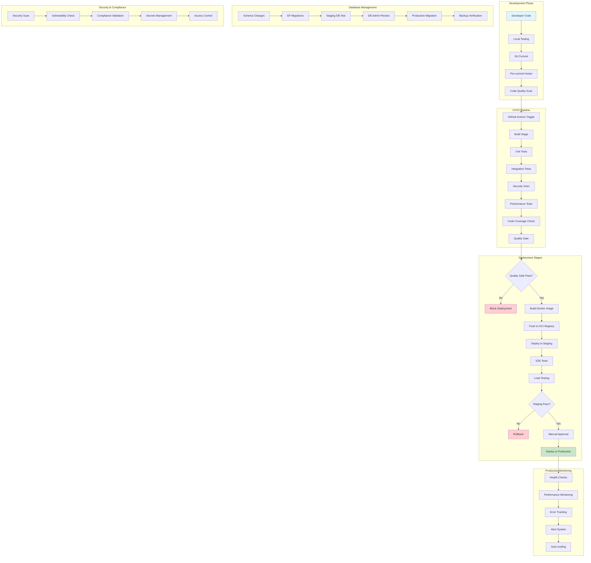
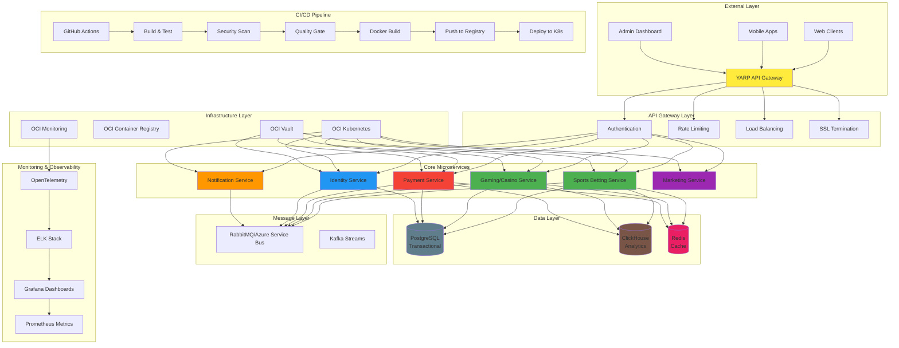

# C# .NET Core Microservices - Complete Technical Leadership Guide
## SportBook Betting Platform - Best Practices, Standards & Team Workflow

### Platform Overview
**Core Services**: Sports Betting, Gaming/Casino, Payment Processing, Marketing, Identity, Notification  
**Technology Stack**: .NET Core 9, YARP Gateway, RabbitMQ/Azure Service Bus, PostgreSQL/ClickHouse/Redis, Kubernetes
**Team Size**: 15+ Developers across multiple microservices
**Architecture**: Microservices with Clean Architecture, CQRS, Event Sourcing

### Document Purpose
This comprehensive guide provides complete production-ready implementations for:
- ✅ Microservices Architecture Best Practices
- ✅ Technical Leadership Standards & Enforcement
- ✅ Team Collaboration & Development Workflows
- ✅ Complete Production Code Implementations
- ✅ Security, Performance & Scalability Guidelines
- ✅ Complete CI/CD Pipelines & Monitoring
- ✅ Production Database Schemas & Optimization
- ✅ Comprehensive Troubleshooting Guides

### Executive Summary
This technical leadership guide provides everything needed to build and operate enterprise-grade .NET Core microservices for the SportBook betting platform. It includes complete production implementations, from code examples to monitoring configurations, enabling teams to deliver scalable, secure, and maintainable solutions.

### Quick Start for Development Teams
**For New Team Members:**
1. **Read Architecture Standards** (Section 1) - Understand the overall approach
2. **Setup Development Environment** (Section 20) - Get your local environment ready
3. **Follow Implementation Phases** (Section 7) - Start with Phase 1 and work sequentially
4. **Use Code Examples** - Copy and adapt the provided code snippets
5. **Follow Team Workflow** (Section 5) - Git branching, code review, testing standards

**For Technical Leads:**
1. **Review All Standards** - Ensure team compliance with all requirements
2. **Setup CI/CD Pipelines** - Implement automated testing and deployment
3. **Configure Monitoring** - Setup logging, metrics, and alerting
4. **Enforce Code Quality** - Use SonarQube, security scans, performance tests
5. **Document Everything** - Maintain up-to-date documentation and runbooks

### Team Onboarding Checklist
**New Developer Setup (Complete in Order):**
- [ ] **Install Required Tools** - Visual Studio 2022, .NET 9 SDK, Docker Desktop, Git
- [ ] **Clone Repositories** - All microservice repositories and shared libraries
- [ ] **Setup Local Environment** - PostgreSQL, Redis, Kafka via Docker Compose
- [ ] **Run First Service** - Start with Payment service, verify health checks
- [ ] **Read Code Standards** - Review coding conventions and team workflow
- [ ] **Setup IDE Extensions** - SonarLint, EditorConfig, GitLens
- [ ] **Configure Git Hooks** - Pre-commit hooks for code quality
- [ ] **Run Test Suite** - Ensure all tests pass locally
- [ ] **Create First PR** - Follow branching strategy and code review process

---

## Technical Architecture & CI/CD Pipeline Flow



## Microservices Architecture & Deployment Complexity



---

## Development Setup & Required Tools

### Essential Development Tools Setup

```mermaid
graph TB
    subgraph "IDE & Development"
        A[Visual Studio 2022] --> B[.NET 9 SDK]
        B --> C[Visual Studio Code]
        C --> D[Extensions: C#, GitLens, SonarLint]
    end
    
    subgraph "Version Control"
        E[Git] --> F[GitHub Desktop]
        F --> G[Git Hooks]
        G --> H[Pre-commit Scripts]
    end
    
    subgraph "Database Tools"
        I[PostgreSQL] --> J[pgAdmin 4]
        J --> K[ClickHouse Client]
        K --> L[Redis CLI]
    end
    
    subgraph "Containerization"
        M[Docker Desktop] --> N[Docker Compose]
        N --> O[Kubernetes CLI]
        O --> P[Helm Charts]
    end
    
    subgraph "CI/CD & Quality"
        Q[GitHub Actions] --> R[SonarQube]
        R --> S[Snyk Security]
        S --> T[Postman/Newman]
    end
    
    subgraph "Cloud & Infrastructure"
        U[OCI CLI] --> V[Terraform]
        V --> W[Kubectl]
        W --> X[Helm]
    end
    
    style A fill:#68217a
    style M fill:#2496ed
    style Q fill:#2088ff
    style U fill:#ff6b35
```



### Required Tools Installation Checklist

#### **Phase 1: Core Development Environment**
```bash
# 1. Install Visual Studio 2022 Community/Professional
# Download from: https://visualstudio.microsoft.com/downloads/
# Required workloads: .NET desktop development, ASP.NET and web development

# 2. Install .NET 9 SDK
dotnet --version  # Should show 9.x.x

# 3. Install Git
git --version  # Should show 2.40+

# 4. Install Docker Desktop
# Download from: https://www.docker.com/products/docker-desktop/
docker --version  # Should show 24.x+

# 5. Install Visual Studio Code
# Download from: https://code.visualstudio.com/
```

#### **Phase 2: Database & Data Tools**
```bash
# 1. Install PostgreSQL
# Download from: https://www.postgresql.org/download/
psql --version  # Should show 15+

# 2. Install pgAdmin 4
# Download from: https://www.pgadmin.org/download/

# 3. Install Redis
# Windows: Download from https://github.com/microsoftarchive/redis/releases
# Or use Docker: docker run -d -p 6379:6379 redis:alpine

# 4. Install ClickHouse Client
# Download from: https://clickhouse.com/docs/en/getting-started/install
```

#### **Phase 3: Quality & Security Tools**
```bash
# 1. Install SonarQube Scanner
# Download from: https://docs.sonarqube.org/latest/analysis/scan/sonarscanner/
sonar-scanner --version

# 2. Install Snyk CLI
npm install -g snyk
snyk --version

# 3. Install GitLeaks
# Download from: https://github.com/zricethezav/gitleaks/releases
gitleaks version

# 4. Install Postman
# Download from: https://www.postman.com/downloads/
```

#### **Phase 4: Cloud & Infrastructure Tools**
```bash
# 1. Install OCI CLI
# Download from: https://docs.oracle.com/en-us/iaas/Content/API/SDKDocs/cliinstall.htm
oci --version

# 2. Install Terraform
# Download from: https://www.terraform.io/downloads
terraform --version

# 3. Install Kubernetes CLI
# Download from: https://kubernetes.io/docs/tasks/tools/
kubectl version --client

# 4. Install Helm
# Download from: https://helm.sh/docs/intro/install/
helm version
```

### Development Environment Configuration

#### **1. Git Configuration**
```bash
# Global Git Configuration
git config --global user.name "Your Name"
git config --global user.email "your.email@company.com"
git config --global init.defaultBranch main
git config --global pull.rebase false

# Install Git Hooks
# Create .git/hooks/pre-commit
#!/bin/sh
echo "Running pre-commit checks..."
dotnet build
dotnet test
echo "Pre-commit checks passed!"
```

#### **2. Visual Studio Extensions**
```
Required Extensions:
- C# for Visual Studio Code
- GitLens — Git supercharged
- SonarLint
- EditorConfig for VS Code
- Docker
- Kubernetes
- REST Client
- Thunder Client
- Error Lens
- Bracket Pair Colorizer
```

#### **3. Docker Compose Setup**
```yaml
# docker-compose.yml for local development
version: '3.8'
services:
  postgres:
    image: postgres:15
    environment:
      POSTGRES_DB: sportbook
      POSTGRES_USER: admin
      POSTGRES_PASSWORD: password
    ports:
      - "5432:5432"
    volumes:
      - postgres_data:/var/lib/postgresql/data

  redis:
    image: redis:7-alpine
    ports:
      - "6379:6379"

  clickhouse:
    image: clickhouse/clickhouse-server:latest
    ports:
      - "8123:8123"
      - "9000:9000"
    environment:
      CLICKHOUSE_DB: analytics

  kafka:
    image: confluentinc/cp-kafka:latest
    ports:
      - "9092:9092"
      - "9094:9094"
    environment:
      KAFKA_BROKER_ID: 1
      KAFKA_ZOOKEEPER_CONNECT: zookeeper:2181
      KAFKA_ADVERTISED_LISTENERS: PLAINTEXT://localhost:9092,PLAINTEXT_HOST://localhost:9094
      KAFKA_LISTENER_SECURITY_PROTOCOL_MAP: PLAINTEXT:PLAINTEXT,PLAINTEXT_HOST:PLAINTEXT
      KAFKA_INTER_BROKER_LISTENER_NAME: PLAINTEXT
      KAFKA_OFFSETS_TOPIC_REPLICATION_FACTOR: 1
    depends_on:
      - zookeeper

  zookeeper:
    image: confluentinc/cp-zookeeper:latest
    ports:
      - "2181:2181"
    environment:
      ZOOKEEPER_CLIENT_PORT: 2181
      ZOOKEEPER_TICK_TIME: 2000

volumes:
  postgres_data:
```

### Team Setup Verification

#### **Developer Onboarding Checklist**
- [ ] **Visual Studio 2022** installed with required workloads
- [ ] **.NET 9 SDK** installed and verified
- [ ] **Git** configured with proper user settings
- [ ] **Docker Desktop** running and accessible
- [ ] **PostgreSQL** running on port 5432
- [ ] **Redis** running on port 6379
- [ ] **ClickHouse** accessible on port 8123
- [ ] **RabbitMQ** management interface on port 15672
- [ ] **All VS Code extensions** installed
- [ ] **Git hooks** configured for pre-commit checks
- [ ] **Local project** cloned and building successfully
- [ ] **Unit tests** running and passing
- [ ] **Integration tests** running against local services
- [ ] **SonarLint** configured and showing no critical issues
- [ ] **Postman collections** imported and working
- [ ] **OCI CLI** configured with credentials
- [ ] **Kubectl** configured for OCI Kubernetes

#### **Team Lead Setup Checklist**
- [ ] **SonarQube server** running and accessible
- [ ] **Snyk account** configured for security scanning
- [ ] **GitHub Actions** workflows configured
- [ ] **OCI infrastructure** provisioned
- [ ] **Kubernetes cluster** running and accessible
- [ ] **Container registry** configured
- [ ] **Monitoring stack** (ELK, Prometheus, Grafana) deployed
- [ ] **CI/CD pipelines** configured and tested
- [ ] **Quality gates** configured in SonarQube
- [ ] **Security scanning** automated in CI/CD
- [ ] **Performance testing** integrated in pipeline
- [ ] **Database migration** procedures documented
- [ ] **Backup and recovery** procedures tested
- [ ] **Alerting** configured for critical issues
- [ ] **Team documentation** up to date

---

## Table of Contents

### Part A: Architecture & Design
1. [Architecture Standards](#1-architecture-standards)
2. [Microservices Repository Strategy](#microservices-repository-strategy)
3. [Local NuGet Package Management](#local-nuget-package-management)
4. [Shared Libraries Strategy](#shared-libraries-strategy)
5. [Professional Shared Libraries as NuGet Packages](#professional-shared-libraries-as-nuget-packages)
6. [Clean Architecture Principles](#clean-architecture-principles)

### Part B: Development Standards
7. [Development Standards](#2-development-standards)
8. [Asynchronous Programming Best Practices](#asynchronous-programming-best-practices)
9. [ORM Best Practices](#orm-best-practices)
10. [CQRS Implementation](#cqrs-implementation)
11. [Validation Libraries](#validation-libraries)
12. [Localization & Error Handling](#localization--error-handling)
13. [Logging & Exception Handling](#logging--exception-handling)

### Part C: Communication & Integration
14. [API Design & Generic Response Patterns](#api-design--generic-response-patterns)
15. [gRPC Communication](#grpc-communication)
16. [Kafka Implementation](#kafka-implementation)
17. [API Documentation & Sharing](#8-api-documentation--sharing)

### Part D: Security & Performance
18. [Security Best Practices](#security-best-practices)
19. [Performance Requirements](#6-performance-requirements)
20. [Load Balancing & Scalability](#load-balancing--scalability)

### Part E: Team Workflow & Collaboration
21. [Team Collaboration & Development Workflow](#team-collaboration--development-workflow)
22. [Git Flow & Release Strategy](#4-git-flow--release-strategy)
23. [Code Review Process](#code-review-process)
24. [Team Organization](#5-team-organization)

### Part F: Deployment & Operations
25. [Deployment Standards](#3-deployment-standards)
26. [CI/CD Pipeline](#cicd-pipeline)
27. [Integration Testing Strategy](#9-integration-testing-strategy)
28. [Monitoring & Observability](#monitoring--observability)

### Part G: Implementation Checklists
29. [Implementation Checklists](#7-implementation-checklists)
30. [Success Metrics](#10-success-metrics)
31. [Enforcement Summary](#11-enforcement-summary)

---

### OCI Stack Implementation:
- **Setup**: OCI Kubernetes cluster
- **Configure**: OCI Vault for secrets
- **Deploy**: Container Registry for images
- **Monitor**: OCI Monitoring + ELK Stack
- **Backup**: Automated daily backups

### Technology Stack Overview
**Core Technologies:**
- **Framework**: .NET 9 with performance optimizations
- **Databases**: PostgreSQL (transactional), ClickHouse (analytics), Redis (caching)
- **Messaging**: Kafka for event-driven architecture and high-volume streams
- **Containerization**: Docker with Kubernetes orchestration
- **CI/CD**: GitHub Actions with automated testing and deployment

### .NET Core 9 Implementation:
- **Use**: .NET Core 9 for all microservices
- **Configure**: Enable performance optimizations
- **Implement**: Structured logging with correlation IDs
- **Deploy**: Containerized with Docker
- **Monitor**: OpenTelemetry integration

---

## 1. ARCHITECTURE STANDARDS

### Communication Patterns
- **External APIs**: REST with OpenAPI 3.0 only
- **Internal Services**: gRPC for all service-to-service calls
- **Async Events**: Message broker for all async communication
- **Real-time**: SignalR for live updates only
- **Prohibited**: Direct database calls between services, HTTP calls between internal services

### Complete Service Implementation Example

#### Payment Service - Production Ready Implementation
```csharp
namespace SportBook.PaymentService
{
    public class PaymentService : IPaymentService
    {
        private readonly IPaymentRepository _repository;
        private readonly IEventBus _eventBus;
        private readonly ILogger<PaymentService> _logger;
        private readonly IConfiguration _configuration;
        private readonly IMemoryCache _cache;
        private readonly IHttpClientFactory _httpClientFactory;
        private readonly ICorrelationIdProvider _correlationIdProvider;

        public PaymentService(
            IPaymentRepository repository,
            IEventBus eventBus,
            ILogger<PaymentService> logger,
            IConfiguration configuration,
            IMemoryCache cache,
            IHttpClientFactory httpClientFactory,
            ICorrelationIdProvider correlationIdProvider)
        {
            _repository = repository;
            _eventBus = eventBus;
            _logger = logger;
            _configuration = configuration;
            _cache = cache;
            _httpClientFactory = httpClientFactory;
            _correlationIdProvider = correlationIdProvider;
        }

        public async Task<PaymentResult> ProcessPaymentAsync(PaymentRequest request)
        {
            using var activity = ActivitySource.StartActivity("ProcessPayment");
            activity?.SetTag("payment.amount", request.Amount);
            activity?.SetTag("payment.currency", request.Currency);
            activity?.SetTag("correlation.id", _correlationIdProvider.GetCorrelationId());

            try
            {
                _logger.LogInformation("Processing payment for user {UserId} with amount {Amount} {Currency}", 
                    request.UserId, request.Amount, request.Currency);

                // Validate request
                var validationResult = await ValidatePaymentRequestAsync(request);
                if (!validationResult.IsValid)
                {
                    _logger.LogWarning("Payment validation failed: {Errors}", string.Join(", ", validationResult.Errors));
                    throw new ValidationException(validationResult.Errors);
                }

                // Check for duplicate payment
                var existingPayment = await _repository.GetByTransactionIdAsync(request.TransactionId);
                if (existingPayment != null)
                {
                    _logger.LogInformation("Duplicate payment detected for transaction {TransactionId}", request.TransactionId);
                    return new PaymentResult
                    {
                        Success = true,
                        PaymentId = existingPayment.Id,
                        Status = existingPayment.Status,
                        Message = "Payment already processed"
                    };
                }

                // Create payment record
                var payment = new Payment
                {
                    Id = Guid.NewGuid(),
                    UserId = request.UserId,
                    Amount = request.Amount,
                    Currency = request.Currency,
                    PaymentMethod = request.PaymentMethod,
                    TransactionId = request.TransactionId,
                    Status = PaymentStatus.Pending,
                    CreatedAt = DateTime.UtcNow,
                    CorrelationId = _correlationIdProvider.GetCorrelationId()
                };

                await _repository.CreateAsync(payment);

                // Process payment based on method
                var result = request.PaymentMethod switch
                {
                    PaymentMethod.CreditCard => await ProcessCreditCardPaymentAsync(payment),
                    PaymentMethod.BankTransfer => await ProcessBankTransferAsync(payment),
                    PaymentMethod.Wallet => await ProcessWalletPaymentAsync(payment),
                    _ => throw new NotSupportedException($"Payment method {request.PaymentMethod} not supported")
                };

                // Update payment status
                payment.Status = result.Success ? PaymentStatus.Completed : PaymentStatus.Failed;
                payment.ProcessedAt = DateTime.UtcNow;
                payment.ExternalTransactionId = result.ExternalTransactionId;
                payment.ErrorMessage = result.ErrorMessage;

                await _repository.UpdateAsync(payment);

                // Publish event
                await _eventBus.PublishAsync(new PaymentProcessedEvent
                {
                    PaymentId = payment.Id,
                    UserId = payment.UserId,
                    Amount = payment.Amount,
                    Currency = payment.Currency,
                    Status = payment.Status,
                    ProcessedAt = payment.ProcessedAt,
                    CorrelationId = payment.CorrelationId
                });

                _logger.LogInformation("Payment {PaymentId} processed successfully with status {Status}", 
                    payment.Id, payment.Status);

                return new PaymentResult
                {
                    Success = result.Success,
                    PaymentId = payment.Id,
                    Status = payment.Status,
                    ExternalTransactionId = result.ExternalTransactionId,
                    Message = result.Success ? "Payment processed successfully" : result.ErrorMessage
                };
            }
            catch (Exception ex)
            {
                _logger.LogError(ex, "Payment processing failed for transaction {TransactionId}", request.TransactionId);
                throw;
            }
        }

        private async Task<ValidationResult> ValidatePaymentRequestAsync(PaymentRequest request)
        {
            var errors = new List<string>();

            if (request.Amount <= 0)
                errors.Add("Payment amount must be greater than zero");

            if (string.IsNullOrEmpty(request.Currency))
                errors.Add("Currency is required");

            if (request.Amount > 10000) // Daily limit
                errors.Add("Payment amount exceeds daily limit");

            // Check user daily limit
            var dailyTotal = await _repository.GetDailyTotalAsync(request.UserId, DateTime.UtcNow.Date);
            if (dailyTotal + request.Amount > 10000)
                errors.Add("Daily payment limit would be exceeded");

            return new ValidationResult { IsValid = !errors.Any(), Errors = errors };
        }

        private async Task<PaymentProcessingResult> ProcessCreditCardPaymentAsync(Payment payment)
        {
            var client = _httpClientFactory.CreateClient("PaymentGateway");
            
            var request = new
            {
                amount = payment.Amount,
                currency = payment.Currency,
                payment_method = "card",
                transaction_id = payment.TransactionId,
                correlation_id = payment.CorrelationId
            };

            try
            {
                var response = await client.PostAsJsonAsync("/payments", request);
                
                if (response.IsSuccessStatusCode)
                {
                    var result = await response.Content.ReadFromJsonAsync<PaymentGatewayResponse>();
                    return new PaymentProcessingResult
                    {
                        Success = true,
                        ExternalTransactionId = result.TransactionId
                    };
                }
                else
                {
                    var error = await response.Content.ReadAsStringAsync();
                    return new PaymentProcessingResult
                    {
                        Success = false,
                        ErrorMessage = error
                    };
                }
            }
            catch (Exception ex)
            {
                _logger.LogError(ex, "Credit card payment processing failed for payment {PaymentId}", payment.Id);
                return new PaymentProcessingResult
                {
                    Success = false,
                    ErrorMessage = "Payment gateway communication failed"
                };
            }
        }
    }
}
```

### Database Strategy
- **One database per service** - NO EXCEPTIONS
- **PostgreSQL**: Transactional data (bets, payments, users)
- **ClickHouse**: Analytics, reporting, real-time data
- **Redis**: Caching, sessions, real-time data
- **Event Sourcing**: ALL financial transactions
- **CQRS**: ALL reporting and analytics queries

### Complete Database Implementation

#### PostgreSQL Schema - Production Ready
```sql
-- Complete PostgreSQL Schema for Payment Service
CREATE EXTENSION IF NOT EXISTS "uuid-ossp";
CREATE EXTENSION IF NOT EXISTS "pg_stat_statements";
CREATE EXTENSION IF NOT EXISTS "pg_trgm";

-- Create custom types
CREATE TYPE user_status AS ENUM ('ACTIVE', 'INACTIVE', 'SUSPENDED', 'BANNED');
CREATE TYPE payment_status AS ENUM ('PENDING', 'PROCESSING', 'COMPLETED', 'FAILED', 'CANCELLED', 'REFUNDED');
CREATE TYPE payment_method AS ENUM ('CREDIT_CARD', 'BANK_TRANSFER', 'WALLET', 'CRYPTO');
CREATE TYPE kyc_status AS ENUM ('PENDING', 'VERIFIED', 'REJECTED', 'EXPIRED');

-- Users table with complete audit fields
CREATE TABLE users (
    id UUID PRIMARY KEY DEFAULT uuid_generate_v4(),
    username VARCHAR(50) UNIQUE NOT NULL,
    email VARCHAR(255) UNIQUE NOT NULL,
    phone VARCHAR(20),
    first_name VARCHAR(100) NOT NULL,
    last_name VARCHAR(100) NOT NULL,
    date_of_birth DATE,
    country_code VARCHAR(3) NOT NULL,
    currency VARCHAR(3) NOT NULL DEFAULT 'ETB',
    status user_status NOT NULL DEFAULT 'ACTIVE',
    email_verified BOOLEAN DEFAULT FALSE,
    phone_verified BOOLEAN DEFAULT FALSE,
    kyc_status kyc_status DEFAULT 'PENDING',
    daily_limit DECIMAL(15,2) DEFAULT 10000.00,
    monthly_limit DECIMAL(15,2) DEFAULT 100000.00,
    created_at TIMESTAMP WITH TIME ZONE DEFAULT NOW(),
    updated_at TIMESTAMP WITH TIME ZONE DEFAULT NOW(),
    created_by UUID,
    updated_by UUID,
    version INTEGER DEFAULT 1
);

-- Payments table with complete audit and performance optimization
CREATE TABLE payments (
    id UUID PRIMARY KEY DEFAULT uuid_generate_v4(),
    user_id UUID NOT NULL REFERENCES users(id) ON DELETE CASCADE,
    amount DECIMAL(15,2) NOT NULL CHECK (amount > 0),
    currency VARCHAR(3) NOT NULL,
    payment_method payment_method NOT NULL,
    status payment_status NOT NULL DEFAULT 'PENDING',
    transaction_id VARCHAR(100) UNIQUE NOT NULL,
    external_transaction_id VARCHAR(100),
    gateway_response JSONB,
    error_message TEXT,
    correlation_id VARCHAR(100),
    processed_at TIMESTAMP WITH TIME ZONE,
    created_at TIMESTAMP WITH TIME ZONE DEFAULT NOW(),
    updated_at TIMESTAMP WITH TIME ZONE DEFAULT NOW(),
    version INTEGER DEFAULT 1
);

-- Payment events for event sourcing
CREATE TABLE payment_events (
    id UUID PRIMARY KEY DEFAULT uuid_generate_v4(),
    payment_id UUID NOT NULL REFERENCES payments(id) ON DELETE CASCADE,
    event_type VARCHAR(50) NOT NULL,
    event_data JSONB NOT NULL,
    correlation_id VARCHAR(100),
    created_at TIMESTAMP WITH TIME ZONE DEFAULT NOW(),
    created_by UUID
);

-- Performance indexes
CREATE INDEX idx_payments_user_id ON payments(user_id);
CREATE INDEX idx_payments_status ON payments(status);
CREATE INDEX idx_payments_created_at ON payments(created_at);
CREATE INDEX idx_payments_transaction_id ON payments(transaction_id);
CREATE INDEX idx_payments_correlation_id ON payments(correlation_id);

-- Composite indexes for common queries
CREATE INDEX idx_payments_user_status ON payments(user_id, status);
CREATE INDEX idx_payments_created_status ON payments(created_at, status);
CREATE INDEX idx_payments_user_created ON payments(user_id, created_at);

-- Partial indexes for active payments
CREATE INDEX idx_payments_active ON payments(user_id) WHERE status IN ('PENDING', 'PROCESSING');

-- Full-text search indexes
CREATE INDEX idx_payments_gateway_response_gin ON payments USING gin(gateway_response);

-- Payment events indexes
CREATE INDEX idx_payment_events_payment_id ON payment_events(payment_id);
CREATE INDEX idx_payment_events_type ON payment_events(event_type);
CREATE INDEX idx_payment_events_created_at ON payment_events(created_at);

-- Functions for audit triggers
CREATE OR REPLACE FUNCTION update_updated_at_column()
RETURNS TRIGGER AS $$
BEGIN
    NEW.updated_at = NOW();
    NEW.version = OLD.version + 1;
    RETURN NEW;
END;
$$ language 'plpgsql';

-- Audit triggers
CREATE TRIGGER update_users_updated_at BEFORE UPDATE ON users
    FOR EACH ROW EXECUTE FUNCTION update_updated_at_column();

CREATE TRIGGER update_payments_updated_at BEFORE UPDATE ON payments
    FOR EACH ROW EXECUTE FUNCTION update_updated_at_column();

-- Performance monitoring
CREATE VIEW payment_performance AS
SELECT 
    DATE_TRUNC('hour', created_at) as hour,
    status,
    COUNT(*) as count,
    AVG(EXTRACT(EPOCH FROM (processed_at - created_at))) as avg_processing_time_seconds,
    PERCENTILE_CONT(0.95) WITHIN GROUP (ORDER BY EXTRACT(EPOCH FROM (processed_at - created_at))) as p95_processing_time_seconds
FROM payments 
WHERE created_at >= NOW() - INTERVAL '24 hours'
GROUP BY DATE_TRUNC('hour', created_at), status
ORDER BY hour DESC, status;
```

#### Redis Configuration - Production Ready
```yaml
# redis.conf - Production Configuration
# Network
bind 0.0.0.0
port 6379
tcp-backlog 511
timeout 0
tcp-keepalive 300

# Memory Management
maxmemory 2gb
maxmemory-policy allkeys-lru
maxmemory-samples 5

# Persistence
save 900 1
save 300 10
save 60 10000
stop-writes-on-bgsave-error yes
rdbcompression yes
rdbchecksum yes
dbfilename dump.rdb
dir /var/lib/redis

# Logging
loglevel notice
logfile /var/log/redis/redis-server.log

# Security
requirepass your_secure_password_here
rename-command FLUSHDB ""
rename-command FLUSHALL ""

# Performance
tcp-nodelay yes
lua-time-limit 5000
slowlog-log-slower-than 10000
slowlog-max-len 128

# Clustering
cluster-enabled yes
cluster-config-file nodes.conf
cluster-node-timeout 5000
```

#### ClickHouse Analytics Schema
```sql
-- ClickHouse Analytics Schema for Payment Analytics
CREATE DATABASE IF NOT EXISTS sportbook_analytics;

USE sportbook_analytics;

-- Payment analytics table
CREATE TABLE payment_analytics (
    payment_id String,
    user_id String,
    amount Decimal(15,2),
    currency String,
    payment_method String,
    status String,
    country_code String,
    created_at DateTime64(3),
    processed_at DateTime64(3),
    processing_time_ms UInt32,
    gateway_response String,
    date Date MATERIALIZED toDate(created_at),
    hour UInt8 MATERIALIZED toHour(created_at),
    minute UInt8 MATERIALIZED toMinute(created_at)
) ENGINE = MergeTree()
PARTITION BY date
ORDER BY (date, hour, user_id, payment_id)
SETTINGS index_granularity = 8192;

-- Real-time payment metrics
CREATE MATERIALIZED VIEW payment_metrics_realtime
ENGINE = SummingMergeTree()
PARTITION BY date
ORDER BY (date, hour, minute, status)
AS SELECT
    date,
    hour,
    minute,
    status,
    count() as payment_count,
    sum(amount) as total_amount,
    avg(processing_time_ms) as avg_processing_time,
    quantile(0.95)(processing_time_ms) as p95_processing_time
FROM payment_analytics
GROUP BY date, hour, minute, status;

-- User behavior analytics
CREATE TABLE user_behavior_analytics (
    user_id String,
    event_type String,
    event_data String,
    session_id String,
    created_at DateTime64(3),
    date Date MATERIALIZED toDate(created_at)
) ENGINE = MergeTree()
PARTITION BY date
ORDER BY (date, user_id, created_at)
SETTINGS index_granularity = 8192;
```

**Implementation Steps:**
1. **Setup PostgreSQL** for each microservice with complete schema
2. **Configure ClickHouse** for analytics aggregation with materialized views
3. **Setup Redis** for caching and sessions with production configuration
4. **Implement Event Sourcing** for financial transactions with audit trails
5. **Configure CQRS** for read/write separation with performance optimization

### Complete Docker Implementation

#### Production-Ready Dockerfile
```dockerfile
# Multi-stage Dockerfile for Payment Service
FROM mcr.microsoft.com/dotnet/aspnet:9.0 AS base
WORKDIR /app
EXPOSE 80
EXPOSE 443

# Install curl for health checks
RUN apt-get update && apt-get install -y curl && rm -rf /var/lib/apt/lists/*

FROM mcr.microsoft.com/dotnet/sdk:9.0 AS build
WORKDIR /src

# Copy project files
COPY ["SportBook.PaymentService/SportBook.PaymentService.csproj", "SportBook.PaymentService/"]
COPY ["SportBook.Shared/SportBook.Shared.csproj", "SportBook.Shared/"]
COPY ["SportBook.Core/SportBook.Core.csproj", "SportBook.Core/"]

# Restore dependencies
RUN dotnet restore "SportBook.PaymentService/SportBook.PaymentService.csproj"

# Copy source code
COPY . .

# Build application
WORKDIR "/src/SportBook.PaymentService"
RUN dotnet build "SportBook.PaymentService.csproj" -c Release -o /app/build

FROM build AS publish
RUN dotnet publish "SportBook.PaymentService.csproj" -c Release -o /app/publish

FROM base AS final
WORKDIR /app

# Create non-root user
RUN groupadd -r appuser && useradd -r -g appuser appuser
RUN chown -R appuser:appuser /app
USER appuser

# Copy published application
COPY --from=publish /app/publish .

# Health check
HEALTHCHECK --interval=30s --timeout=10s --start-period=60s --retries=3 \
  CMD curl -f http://localhost/health || exit 1

ENTRYPOINT ["dotnet", "SportBook.PaymentService.dll"]
```

#### Docker Compose - Production Ready
```yaml
version: '3.8'

services:
  # Payment Service
  payment-service:
    build:
      context: .
      dockerfile: SportBook.PaymentService/Dockerfile
    container_name: sportbook-payment-service
    ports:
      - "5001:80"
      - "5002:443"
    environment:
      - ASPNETCORE_ENVIRONMENT=Production
      - ASPNETCORE_URLS=http://+:80;https://+:443
      - ConnectionStrings__DefaultConnection=Host=postgres;Database=sportbook_payments;Username=postgres;Password=SecurePassword123!
      - Redis__ConnectionString=redis:6379
      - Kafka__BootstrapServers=kafka:9092
    depends_on:
      - postgres
      - redis
      - kafka
    networks:
      - sportbook-network
    restart: unless-stopped
    healthcheck:
      test: ["CMD", "curl", "-f", "http://localhost/health"]
      interval: 30s
      timeout: 10s
      retries: 3
      start_period: 60s

  # PostgreSQL Database
  postgres:
    image: postgres:15-alpine
    container_name: sportbook-postgres
    environment:
      POSTGRES_DB: sportbook_payments
      POSTGRES_USER: postgres
      POSTGRES_PASSWORD: SecurePassword123!
    volumes:
      - postgres_data:/var/lib/postgresql/data
      - ./scripts/init-db.sql:/docker-entrypoint-initdb.d/init-db.sql
    ports:
      - "5432:5432"
    networks:
      - sportbook-network
    restart: unless-stopped

  # Redis Cache
  redis:
    image: redis:7-alpine
    container_name: sportbook-redis
    command: redis-server --requirepass SecurePassword123!
    volumes:
      - redis_data:/data
      - ./config/redis.conf:/usr/local/etc/redis/redis.conf
    ports:
      - "6379:6379"
    networks:
      - sportbook-network
    restart: unless-stopped

  # Kafka Message Broker
  kafka:
    image: confluentinc/cp-kafka:latest
    container_name: sportbook-kafka
    environment:
      KAFKA_BROKER_ID: 1
      KAFKA_ZOOKEEPER_CONNECT: zookeeper:2181
      KAFKA_ADVERTISED_LISTENERS: PLAINTEXT://kafka:9092
      KAFKA_OFFSETS_TOPIC_REPLICATION_FACTOR: 1
    ports:
      - "9092:9092"
    depends_on:
      - zookeeper
    networks:
      - sportbook-network
    restart: unless-stopped

  # Zookeeper for Kafka
  zookeeper:
    image: confluentinc/cp-zookeeper:latest
    container_name: sportbook-zookeeper
    environment:
      ZOOKEEPER_CLIENT_PORT: 2181
      ZOOKEEPER_TICK_TIME: 2000
    ports:
      - "2181:2181"
    networks:
      - sportbook-network
    restart: unless-stopped

  # Prometheus Monitoring
  prometheus:
    image: prom/prometheus:latest
    container_name: sportbook-prometheus
    ports:
      - "9090:9090"
    volumes:
      - ./config/prometheus.yml:/etc/prometheus/prometheus.yml
      - prometheus_data:/prometheus
    command:
      - '--config.file=/etc/prometheus/prometheus.yml'
      - '--storage.tsdb.path=/prometheus'
      - '--web.console.libraries=/etc/prometheus/console_libraries'
      - '--web.console.templates=/etc/prometheus/consoles'
      - '--storage.tsdb.retention.time=200h'
      - '--web.enable-lifecycle'
    networks:
      - sportbook-network
    restart: unless-stopped

  # Grafana Dashboard
  grafana:
    image: grafana/grafana:latest
    container_name: sportbook-grafana
    ports:
      - "3000:3000"
    environment:
      - GF_SECURITY_ADMIN_PASSWORD=SecurePassword123!
    volumes:
      - grafana_data:/var/lib/grafana
      - ./config/grafana/provisioning:/etc/grafana/provisioning
    networks:
      - sportbook-network
    restart: unless-stopped

volumes:
  postgres_data:
  redis_data:
  prometheus_data:
  grafana_data:

networks:
  sportbook-network:
    driver: bridge
```

### Complete CI/CD Pipeline Implementation

#### GitHub Actions - Production Ready
```yaml
name: Payment Service CI/CD Pipeline

on:
  push:
    branches: [ main, develop ]
    paths: [ 'SportBook.PaymentService/**' ]
  pull_request:
    branches: [ main ]
    paths: [ 'SportBook.PaymentService/**' ]

env:
  DOTNET_VERSION: '9.0.x'
  SONAR_TOKEN: ${{ secrets.SONAR_TOKEN }}
  DOCKER_REGISTRY: ghcr.io
  IMAGE_NAME: sportbook/payment-service
  POSTGRES_PASSWORD: postgres
  REDIS_PASSWORD: redis

jobs:
  # Unit and Integration Tests
  test:
    runs-on: ubuntu-latest
    services:
      postgres:
        image: postgres:15
        env:
          POSTGRES_PASSWORD: ${{ env.POSTGRES_PASSWORD }}
          POSTGRES_DB: sportbook_test
        options: >-
          --health-cmd pg_isready
          --health-interval 10s
          --health-timeout 5s
          --health-retries 5
        ports:
          - 5432:5432
      redis:
        image: redis:7
        env:
          REDIS_PASSWORD: ${{ env.REDIS_PASSWORD }}
        options: >-
          --health-cmd "redis-cli -a $REDIS_PASSWORD ping"
          --health-interval 10s
          --health-timeout 5s
          --health-retries 5
        ports:
          - 6379:6379
      kafka:
        image: confluentinc/cp-kafka:latest
        env:
          KAFKA_BROKER_ID: 1
          KAFKA_ZOOKEEPER_CONNECT: localhost:2181
          KAFKA_ADVERTISED_LISTENERS: PLAINTEXT://localhost:9092
          KAFKA_OFFSETS_TOPIC_REPLICATION_FACTOR: 1
        ports:
          - 9092:9092

    steps:
    - name: Checkout code
      uses: actions/checkout@v4
      with:
        fetch-depth: 0

    - name: Setup .NET
      uses: actions/setup-dotnet@v4
      with:
        dotnet-version: ${{ env.DOTNET_VERSION }}

    - name: Cache dependencies
      uses: actions/cache@v3
      with:
        path: ~/.nuget/packages
        key: ${{ runner.os }}-nuget-${{ hashFiles('**/*.csproj') }}
        restore-keys: |
          ${{ runner.os }}-nuget-

    - name: Restore dependencies
      run: dotnet restore

    - name: Build
      run: dotnet build --no-restore --configuration Release

    - name: Run unit tests
      run: |
        dotnet test --no-build --configuration Release \
          --collect:"XPlat Code Coverage" \
          --logger trx \
          --results-directory ./TestResults \
          --settings coverlet.runsettings

    - name: Run integration tests
      run: |
        dotnet test --no-build --configuration Release \
          --filter Category=Integration \
          --collect:"XPlat Code Coverage" \
          --logger trx \
          --results-directory ./TestResults

    - name: SonarCloud Scan
      uses: SonarSource/sonarcloud-github-action@master
      env:
        GITHUB_TOKEN: ${{ secrets.GITHUB_TOKEN }}
        SONAR_TOKEN: ${{ env.SONAR_TOKEN }}

    - name: Upload test results
      uses: actions/upload-artifact@v4
      if: always()
      with:
        name: test-results
        path: ./TestResults

  # Security Scanning
  security-scan:
    runs-on: ubuntu-latest
    steps:
    - name: Checkout code
      uses: actions/checkout@v4
    
    - name: Run Snyk to check for vulnerabilities
      uses: snyk/actions/dotnet@master
      env:
        SNYK_TOKEN: ${{ secrets.SNYK_TOKEN }}
      with:
        args: --severity-threshold=high

    - name: Run Trivy vulnerability scanner
      uses: aquasecurity/trivy-action@master
      with:
        scan-type: 'fs'
        scan-ref: '.'
        format: 'sarif'
        output: 'trivy-results.sarif'

    - name: Upload Trivy scan results
      uses: github/codeql-action/upload-sarif@v2
      with:
        sarif_file: 'trivy-results.sarif'

  # Performance Testing
  performance-test:
    runs-on: ubuntu-latest
    needs: test
    if: github.event_name == 'push' && github.ref == 'refs/heads/main'
    
    steps:
    - name: Checkout code
      uses: actions/checkout@v4

    - name: Setup .NET
      uses: actions/setup-dotnet@v4
      with:
        dotnet-version: ${{ env.DOTNET_VERSION }}

    - name: Build application
      run: dotnet build --configuration Release

    - name: Start services
      run: |
        docker-compose up -d postgres redis kafka
        sleep 30

    - name: Run performance tests
      run: |
        dotnet test --configuration Release --filter Category=Performance

  # Build and Push Docker Image
  build-and-push:
    needs: [test, security-scan]
    runs-on: ubuntu-latest
    if: github.event_name == 'push' && github.ref == 'refs/heads/main'
    
    steps:
    - name: Checkout code
      uses: actions/checkout@v4
    
    - name: Set up Docker Buildx
      uses: docker/setup-buildx-action@v3
    
    - name: Log in to Container Registry
      uses: docker/login-action@v3
      with:
        registry: ${{ env.DOCKER_REGISTRY }}
        username: ${{ github.actor }}
        password: ${{ secrets.GITHUB_TOKEN }}
    
    - name: Extract metadata
      id: meta
      uses: docker/metadata-action@v5
      with:
        images: ${{ env.DOCKER_REGISTRY }}/${{ env.IMAGE_NAME }}
        tags: |
          type=ref,event=branch
          type=sha,prefix={{branch}}-
          type=raw,value=latest,enable={{is_default_branch}}
    
    - name: Build and push Docker image
      uses: docker/build-push-action@v5
      with:
        context: .
        file: ./SportBook.PaymentService/Dockerfile
        platforms: linux/amd64,linux/arm64
        push: true
        tags: ${{ steps.meta.outputs.tags }}
        labels: ${{ steps.meta.outputs.labels }}
        cache-from: type=gha
        cache-to: type=gha,mode=max

  # Deploy to Staging
  deploy-staging:
    needs: build-and-push
    runs-on: ubuntu-latest
    environment: staging
    
    steps:
    - name: Deploy to staging
      run: |
        echo "Deploying to staging environment"
        # Add actual deployment commands here
        # kubectl apply -f k8s/staging/

  # Deploy to Production
  deploy-production:
    needs: deploy-staging
    runs-on: ubuntu-latest
    environment: production
    if: github.ref == 'refs/heads/main'
    
    steps:
    - name: Deploy to production
      run: |
        echo "Deploying to production environment"
        # Add actual deployment commands here
        # kubectl apply -f k8s/production/
```

### API Gateway
- **YARP only** - NO alternatives
- **All external traffic** through gateway
- **Authentication** at gateway level
- **Rate limiting** at gateway level
- **NO direct service access** from clients

**Implementation Steps:**
1. **Install YARP NuGet package** in gateway project
2. **Configure routing** for all microservices
3. **Setup authentication middleware** at gateway level
4. **Implement rate limiting** with Redis backend
5. **Configure health checks** for all services
6. **Setup monitoring** and logging for gateway

---

## Microservices Repository Strategy

### SportBook Repository Structure for Large Teams (15+ Developers)

**Repository Management Strategy:**
- **Separate Repositories**: Each microservice has its own repository
- **Shared Dependencies**: Use shared NuGet packages for common functionality
- **Version Control**: Independent versioning for each service
- **CI/CD**: Separate pipelines for each repository
- **Security**: Repository-level access controls

**Microservices Repositories:**
1. **sportbook-identity-service**: User authentication, authorization, profile management
2. **sportbook-payment-service**: Payment processing, M-Pesa, Telebirr, ArifPay integrations
3. **sportbook-betting-service**: Bet placement, bet management, odds handling
4. **sportbook-notification-service**: SMS, email, push notifications
5. **sportbook-settlement-service**: Bet settlement, payouts, result processing
6. **sportbook-shared**: Shared libraries and common utilities

### Benefits for Large Teams
- **Independent Development**: Teams work on different services simultaneously
- **Technology Flexibility**: Different technologies per service
- **Focused Codebase**: Smaller, focused codebases
- **Faster CI/CD**: Build and test only what changed
- **Independent Deployment**: Deploy services separately
- **Scalability**: Scale services independently
- **Team Autonomy**: Clear service ownership

### Detailed Repository Structure Example

#### Shared Libraries Repository (`sportbook-shared`)
```
sportbook-shared/
├── SportBook.Shared.sln                 # Shared libraries solution
├── src/
│   ├── SportBook.Core.Domain/          # Domain entities and interfaces
│   │   ├── Entities/
│   │   │   ├── User.cs                  # User entity with betting profile
│   │   │   ├── Bet.cs                   # Bet entity with odds and status
│   │   │   ├── Game.cs                  # Game entity with teams and events
│   │   │   ├── Transaction.cs           # Financial transaction entity
│   │   │   ├── Wallet.cs                # User wallet entity
│   │   │   └── Notification.cs          # Notification entity
│   │   ├── ValueObjects/
│   │   │   ├── Money.cs                 # Money value object with currency
│   │   │   ├── Odds.cs                  # Odds value object
│   │   │   ├── Address.cs               # Address value object
│   │   │   └── BetSlip.cs               # Bet slip value object
│   │   └── Interfaces/
│   │       ├── IBettingEntity.cs        # Base interface
│   │       ├── IAuditable.cs            # Audit interface
│   │       └── IRepository.cs           # Repository interface
│   ├── SportBook.Core.Enums/            # Shared enumerations
│   │   ├── BetStatus.cs                 # Pending, Won, Lost, Cancelled
│   │   ├── GameType.cs                  # Football, Basketball, Tennis
│   │   ├── TransactionType.cs          # Deposit, Withdrawal, Bet, Payout
│   │   ├── UserRole.cs                  # Admin, User, Moderator
│   │   ├── NotificationType.cs          # SMS, Email, Push
│   │   └── PaymentMethod.cs             # M-Pesa, Telebirr, ArifPay
│   ├── SportBook.Core.Constants/        # Application constants
│   │   ├── ErrorCodes.cs                # BET_001, PAY_002, AUTH_003
│   │   ├── CacheKeys.cs                 # user:{id}, game:{id}, odds:{id}
│   │   ├── ValidationRules.cs          # Min bet amount, Max bet amount
│   │   └── ApiEndpoints.cs              # API endpoint constants
│   ├── SportBook.Infrastructure.Cache/ # Caching utilities
│   │   ├── Services/
│   │   │   ├── ICacheService.cs         # Cache service interface
│   │   │   ├── RedisCacheService.cs     # Redis implementation
│   │   │   └── MemoryCacheService.cs    # Memory cache implementation
│   │   ├── Providers/
│   │   │   ├── SportBookCacheProvider.cs
│   │   │   └── CacheKeyGenerator.cs
│   │   └── Models/
│   │       ├── GameCached.cs
│   │       ├── UserCached.cs
│   │       └── OddsCached.cs
│   ├── SportBook.Infrastructure.Messaging/
│   │   ├── Publishers/
│   │   │   ├── IMessagePublisher.cs
│   │   │   └── KafkaPublisher.cs
│   │   ├── Consumers/
│   │   │   ├── IMessageConsumer.cs
│   │   │   └── BettingEventConsumer.cs
│   │   └── Events/
│   │       ├── BetPlacedEvent.cs
│   │       ├── PaymentProcessedEvent.cs
│   │       └── GameUpdatedEvent.cs
│   ├── SportBook.Shared.Exceptions/     # Custom exceptions
│   │   ├── DomainExceptions/
│   │   │   ├── InsufficientFundsException.cs
│   │   │   ├── InvalidOddsException.cs
│   │   │   └── GameNotAvailableException.cs
│   │   ├── ValidationExceptions/
│   │   │   ├── ValidationException.cs
│   │   │   └── BusinessRuleException.cs
│   │   └── BusinessExceptions/
│   │       ├── BettingException.cs
│   │       └── PaymentException.cs
│   ├── SportBook.Shared.Validation/     # Validation rules
│   │   ├── Rules/
│   │   │   ├── BetValidationRules.cs
│   │   │   ├── PaymentValidationRules.cs
│   │   │   └── UserValidationRules.cs
│   │   ├── Validators/
│   │   │   ├── BetValidator.cs
│   │   │   ├── PaymentValidator.cs
│   │   │   └── UserValidator.cs
│   │   └── Extensions/
│   │       └── ValidationExtensions.cs
│   └── SportBook.Shared.Extensions/     # Common extensions
│       ├── StringExtensions/
│       │   ├── StringExtensions.cs
│       │   └── ValidationExtensions.cs
│       ├── DateTimeExtensions/
│       │   └── DateTimeExtensions.cs
│       └── CollectionExtensions/
│           └── CollectionExtensions.cs
├── tests/
│   ├── SportBook.Core.Domain.Tests/
│   ├── SportBook.Infrastructure.Cache.Tests/
│   └── SportBook.Shared.Validation.Tests/
├── .github/workflows/
│   ├── build-and-publish.yml
│   └── security-scan.yml
├── Directory.Packages.props
├── Directory.Build.props
└── README.md
```

#### Payment Service Repository (`sportbook-payment-service`)
```
sportbook-payment-service/
├── SportBook.Payment.sln
├── src/
│   ├── SportBook.Payment.API/           # Web API project
│   │   ├── Controllers/
│   │   │   ├── PaymentController.cs
│   │   │   ├── WalletController.cs
│   │   │   └── TransactionController.cs
│   │   ├── Middleware/
│   │   │   ├── ErrorHandlingMiddleware.cs
│   │   │   └── AuthenticationMiddleware.cs
│   │   ├── Filters/
│   │   │   ├── ValidationFilter.cs
│   │   │   └── AuthorizationFilter.cs
│   │   ├── Program.cs
│   │   └── appsettings.json
│   ├── SportBook.Payment.Application/   # Application layer
│   │   ├── Commands/
│   │   │   ├── ProcessPaymentCommand.cs
│   │   │   ├── CreateWalletCommand.cs
│   │   │   └── WithdrawFundsCommand.cs
│   │   ├── Queries/
│   │   │   ├── GetWalletBalanceQuery.cs
│   │   │   ├── GetTransactionHistoryQuery.cs
│   │   │   └── GetPaymentMethodsQuery.cs
│   │   ├── Handlers/
│   │   │   ├── ProcessPaymentHandler.cs
│   │   │   ├── CreateWalletHandler.cs
│   │   │   └── WithdrawFundsHandler.cs
│   │   ├── Services/
│   │   │   ├── IPaymentService.cs
│   │   │   ├── PaymentService.cs
│   │   │   └── WalletService.cs
│   │   └── DTOs/
│   │       ├── PaymentRequestDto.cs
│   │       ├── PaymentResponseDto.cs
│   │       └── WalletDto.cs
│   ├── SportBook.Payment.Domain/        # Domain layer
│   │   ├── Entities/
│   │   │   ├── Payment.cs
│   │   │   ├── Wallet.cs
│   │   │   └── Transaction.cs
│   │   ├── ValueObjects/
│   │   │   ├── Money.cs
│   │   │   └── PaymentMethod.cs
│   │   ├── Interfaces/
│   │   │   ├── IPaymentRepository.cs
│   │   │   └── IWalletRepository.cs
│   │   └── Events/
│   │       ├── PaymentProcessedEvent.cs
│   │       └── WalletCreatedEvent.cs
│   └── SportBook.Payment.Infrastructure/
│       ├── Data/
│       │   ├── PaymentDbContext.cs
│       │   └── Migrations/
│       ├── Repositories/
│       │   ├── PaymentRepository.cs
│       │   └── WalletRepository.cs
│       ├── ExternalServices/
│       │   ├── MpesaService.cs
│       │   ├── TelebirrService.cs
│       │   └── ArifPayService.cs
│       ├── Kafka/
│       │   ├── Consumers/
│       │   │   ├── BetPlacedConsumer.cs
│       │   │   ├── UserRegisteredConsumer.cs
│       │   │   └── GameStartedConsumer.cs
│       │   ├── Publishers/
│       │   │   ├── PaymentProcessedPublisher.cs
│       │   │   ├── PaymentFailedPublisher.cs
│       │   │   └── WalletUpdatedPublisher.cs
│       │   └── Configuration/
│       │       ├── KafkaConsumerConfig.cs
│       │       └── KafkaPublisherConfig.cs
│       ├── gRPC/
│       │   ├── Services/
│       │   │   ├── PaymentGrpcService.cs
│       │   │   ├── WalletGrpcService.cs
│       │   │   └── TransactionGrpcService.cs
│       │   ├── Clients/
│       │   │   ├── IdentityGrpcClient.cs
│       │   │   ├── NotificationGrpcClient.cs
│       │   │   └── BettingGrpcClient.cs
│       │   ├── Models/
│       │   │   ├── PaymentGrpcModels.cs
│       │   │   ├── WalletGrpcModels.cs
│       │   │   └── TransactionGrpcModels.cs
│       │   ├── Interceptors/
│       │   │   ├── LoggingInterceptor.cs
│       │   │   ├── AuthenticationInterceptor.cs
│       │   │   └── ErrorHandlingInterceptor.cs
│       │   └── Configuration/
│       │       ├── GrpcServerConfig.cs
│       │       └── GrpcClientConfig.cs
│       ├── Services/
│       │   ├── PaymentOrchestrationService.cs
│       │   ├── EventProcessingService.cs
│       │   └── IntegrationService.cs
│       └── Configuration/
│           ├── PaymentConfiguration.cs
│           └── DatabaseConfiguration.cs
├── tests/
│   ├── SportBook.Payment.UnitTests/
│   ├── SportBook.Payment.IntegrationTests/
│   └── SportBook.Payment.ContractTests/
├── docker/
│   ├── Dockerfile
│   ├── docker-compose.yml
│   └── docker-compose.override.yml
├── .github/workflows/
│   ├── build-and-test.yml
│   ├── deploy-staging.yml
│   └── deploy-production.yml
├── Directory.Packages.props
├── Directory.Build.props
└── README.md
```

#### Other Microservices Structure
- **Identity Service** (`sportbook-identity-service`): User authentication, authorization, profile management
- **Notification Service** (`sportbook-notification-service`): SMS, email, push notifications
- **Betting Service** (`sportbook-betting-service`): Bet placement, bet management, odds handling
- **Settlement Service** (`sportbook-settlement-service`): Bet settlement, payouts, result processing

Each follows the same Clean Architecture structure as Payment Service with domain-specific functionality.

---

## Local NuGet Package Management

### Local NuGet Feed Setup
```
# Create local NuGet feed directory
mkdir C:\NuGet\LocalFeed

# Configure NuGet.config for local feed
<?xml version="1.0" encoding="utf-8"?>
<configuration>
  <packageSources>
    <add key="nuget.org" value="https://api.nuget.org/v3/index.json" />
    <add key="local" value="C:\NuGet\LocalFeed" />
  </packageSources>
</configuration>
```

### Package Categories
1. **Core Packages** (No Dependencies)
   - SportBook.Core.Domain
   - SportBook.Core.Enums
   - SportBook.Core.Constants
   - SportBook.Core.Interfaces

2. **Infrastructure Packages** (Core Dependencies Only)
   - SportBook.Infrastructure.Cache
   - SportBook.Infrastructure.Messaging
   - SportBook.Infrastructure.Data
   - SportBook.Infrastructure.Extensions

3. **Application Packages** (Infrastructure Dependencies)
   - SportBook.Application.CQRS
   - SportBook.Application.Services
   - SportBook.Application.Validation

4. **Shared Utilities** (Independent)
   - SportBook.Shared.Exceptions
   - SportBook.Shared.Extensions
   - SportBook.Shared.Validation
   - SportBook.Shared.Logging

### Package Versioning Strategy
- **Major Version**: Breaking changes
- **Minor Version**: New features, backward compatible
- **Patch Version**: Bug fixes, backward compatible
- **Pre-release**: Alpha, beta, rc versions

---

## Shared Libraries Strategy

### What to Share as NuGet Packages

**Core Domain Libraries** (`SportBook.Core.Domain`):
- Betting Entities: User, Bet, Game, Transaction, Wallet, Notification
- Value Objects: Money, Odds, Address, BetSlip
- Interfaces: IBettingEntity, IAuditable, IRepository<T>
- Domain Events: BetPlacedEvent, PaymentProcessedEvent, GameUpdatedEvent

**Enums and Constants** (`SportBook.Core.Enums`, `SportBook.Core.Constants`):
- Betting Enums: BetStatus, GameType, TransactionType, UserRole
- Error Codes: BET_001, PAY_002, AUTH_003
- Cache Keys: user:{id}, game:{id}, odds:{id}
- Validation Rules: MinBetAmount, MaxBetAmount, MaxDailyLimit

**Infrastructure Libraries** (`SportBook.Infrastructure.*`):
- Caching: Redis cache utilities
- Messaging: Kafka integration
- Data Access: Repository base classes, Unit of Work
- External Services: HTTP clients for payment gateways

**Shared Utilities** (`SportBook.Shared.*`):
- Extensions: String, DateTime, Collection extensions
- Exceptions: Custom exception hierarchy
- Logging: Structured logging utilities
- Validation: FluentValidation rules

### What NOT to Share
- Service-Specific Business Logic
- Database Contexts
- API Controllers
- Service Configuration
- Tests (service-specific)

---

## Professional Shared Libraries as NuGet Packages

Each shared library should be in its own Git repository with independent versioning, CI/CD pipeline, and NuGet package publishing.

### Recommended NuGet Packages (15 Total)

**Core Packages (No Dependencies):**
1. **SportBook.Core.Domain** - Base entities, value objects, interfaces
2. **SportBook.Core.Enums** - All enumerations
3. **SportBook.Core.Constants** - Error codes, cache keys, validation rules

**Utility Packages:**
4. **SportBook.Shared.Exceptions** - Custom exception hierarchy
5. **SportBook.Shared.Extensions** - Extension methods
6. **SportBook.Shared.Logging** - Structured logging with Serilog
7. **SportBook.Shared.Validation** - FluentValidation rules
8. **SportBook.Shared.Api** - API common utilities
9. **SportBook.Shared.Localization** - Multi-language support
10. **SportBook.Shared.Http** - HTTP client with Polly resilience
11. **SportBook.Shared.Testing** - Testing utilities

**Infrastructure Packages:**
12. **SportBook.Infrastructure.Cache** - Redis and memory caching
13. **SportBook.Infrastructure.Messaging** - Kafka/RabbitMQ messaging
14. **SportBook.Infrastructure.Data** - Repository patterns, Unit of Work
15. **SportBook.Infrastructure.Identity** - JWT, authentication, authorization

### Detailed Package Descriptions

#### 1. SportBook.Core.Domain (Core Package)
**Repository**: `sportbook-core-domain`  
**Package**: `SportBook.Core.Domain`  
**Version Strategy**: Semantic Versioning (1.0.0, 1.1.0, 2.0.0)  
**Dependencies**: None (zero dependencies)

**Contents**:
- **Base Entities**: AuditableEntity, BaseEntity, IAggregateRoot
- **Domain Entities**: User, Bet, Game, Transaction, Wallet, Notification
- **Value Objects**: Money, Odds, Address, BetSlip, PhoneNumber, Email
- **Interfaces**: IBettingEntity, IAuditable, ISoftDeletable
- **Domain Events**: BetPlacedEvent, PaymentProcessedEvent, GameUpdatedEvent
- **Specifications**: Base specification pattern interfaces

**Purpose**: Foundation domain layer shared across all microservices

#### 2. SportBook.Core.Enums (Enumerations Package)
**Repository**: `sportbook-core-enums`  
**Package**: `SportBook.Core.Enums`  
**Version Strategy**: Minor updates for new enums  
**Dependencies**: None

**Contents**:
- **BetStatus**: Pending, Won, Lost, Cancelled, Void
- **GameType**: Football, Basketball, Tennis, Baseball
- **TransactionType**: Deposit, Withdrawal, Bet, Payout, Refund
- **UserRole**: Admin, User, Moderator, Support
- **NotificationType**: SMS, Email, Push, InApp
- **PaymentMethod**: MPesa, Telebirr, ArifPay, Chappa, CreditCard
- **Currency**: ETB, USD, EUR, GBP
- **GameStatus**: Scheduled, Live, Finished, Cancelled, Postponed

**Purpose**: Shared enumerations across all microservices

#### 3. SportBook.Core.Constants (Constants Package)
**Repository**: `sportbook-core-constants`  
**Package**: `SportBook.Core.Constants`  
**Version Strategy**: Patch updates for value changes  
**Dependencies**: None

**Contents**:
- **ErrorCodes**: BET_001, PAY_002, AUTH_003, NOTIF_004
- **CacheKeys**: Templates for cache key generation
- **ValidationRules**: MinBetAmount, MaxBetAmount, MaxDailyLimit
- **ApiEndpoints**: Standard endpoint path constants
- **RegexPatterns**: Phone, Email, Username validation patterns
- **DateTimeFormats**: Standard format strings
- **DefaultValues**: Timeout values, retry counts, page sizes

**Purpose**: Centralized constants to avoid magic strings/numbers

#### 4. SportBook.Shared.Exceptions (Custom Exceptions Package)
**Repository**: `sportbook-shared-exceptions`  
**Package**: `SportBook.Shared.Exceptions`  
**Version Strategy**: Minor updates for new exceptions  
**Dependencies**: SportBook.Core.Constants

**Contents**:
- **Base Exceptions**: SportBookException, DomainException, ApplicationException
- **Domain Exceptions**: InsufficientFundsException, InvalidOddsException, GameNotAvailableException
- **Validation Exceptions**: ValidationException, BusinessRuleException
- **Business Exceptions**: BettingException, PaymentException, WithdrawalException
- **Infrastructure Exceptions**: CacheException, MessageQueueException
- **Security Exceptions**: UnauthorizedException, ForbiddenException

**Purpose**: Standardized exception handling across microservices

#### 5. SportBook.Shared.Extensions (Extension Methods Package)
**Repository**: `sportbook-shared-extensions`  
**Package**: `SportBook.Shared.Extensions`  
**Version Strategy**: Minor updates for new extensions  
**Dependencies**: None

**Contents**:
- **StringExtensions**: IsNullOrEmpty, ToTitleCase, Truncate, RemoveSpecialChars
- **DateTimeExtensions**: ToEthiopianTime, ToUnixTimestamp, IsWithinRange
- **CollectionExtensions**: IsNullOrEmpty, Paginate, Shuffle
- **EnumExtensions**: GetDescription, GetDisplayName
- **DecimalExtensions**: ToCurrency, RoundTo
- **GuidExtensions**: IsNullOrEmpty, ToShortString
- **JsonExtensions**: ToJson, FromJson

**Purpose**: Reusable extension methods to reduce code duplication

#### 6. SportBook.Shared.Logging (Logging Package)
**Repository**: `sportbook-shared-logging`  
**Package**: `SportBook.Shared.Logging`  
**Version Strategy**: Patch updates for improvements  
**Dependencies**: Serilog, Serilog.Sinks.*, SportBook.Core.Constants

**Contents**:
- **Interfaces**: ILoggerService, ICorrelationIdProvider
- **Services**: StructuredLoggerService, CorrelationIdProvider
- **Enrichers**: CorrelationIdEnricher, UserIdEnricher, ServiceNameEnricher
- **Configuration**: LoggingOptions, SerilogConfiguration
- **Extensions**: LoggerExtensions, ServiceCollectionExtensions
- **Formatters**: JsonFormatter, CompactJsonFormatter

**Purpose**: Standardized structured logging across all services

#### 7. SportBook.Shared.Validation (Validation Package)
**Repository**: `sportbook-shared-validation`  
**Package**: `SportBook.Shared.Validation`  
**Version Strategy**: Minor updates for new validators  
**Dependencies**: FluentValidation, SportBook.Core.Constants

**Contents**:
- **Base Validators**: BaseValidator<T>, DomainValidator<T>
- **Common Validators**: BetValidator, PaymentValidator, UserValidator
- **Custom Rules**: EthiopianPhoneNumberValidator, BettingAmountValidator
- **Extensions**: ValidationExtensions, RuleBuilderExtensions
- **Filters**: ValidationExceptionFilter
- **Configuration**: ValidationOptions

**Purpose**: Reusable validation rules and validators

#### 8. SportBook.Shared.Api (API Common Package)
**Repository**: `sportbook-shared-api`  
**Package**: `SportBook.Shared.Api`  
**Version Strategy**: Minor updates for new features  
**Dependencies**: ASP.NET Core, SportBook.Shared.Exceptions

**Contents**:
- **Base Controllers**: ApiControllerBase, CrudControllerBase
- **Responses**: ApiResponse<T>, PagedResponse<T>, ErrorResponse
- **Filters**: ExceptionFilter, ValidationFilter, LoggingFilter
- **Middleware**: CorrelationIdMiddleware, ExceptionMiddleware, RequestLoggingMiddleware
- **Attributes**: ValidateModelAttribute, ApiKeyAttribute
- **Extensions**: ResultExtensions, HttpContextExtensions
- **Swagger**: SwaggerConfiguration, AuthenticationOperationFilter

**Purpose**: Common API infrastructure and utilities

#### 9. SportBook.Shared.Localization (Localization Package)
**Repository**: `sportbook-shared-localization`  
**Package**: `SportBook.Shared.Localization`  
**Version Strategy**: Minor updates for new languages  
**Dependencies**: Microsoft.Extensions.Localization

**Contents**:
- **Interfaces**: ILocalizationService, IResourceProvider
- **Services**: LocalizationService, ResourceService
- **Resources**: SharedResources (English, Amharic, Oromo)
- **Providers**: JsonResourceProvider, DatabaseResourceProvider
- **Middleware**: LocalizationMiddleware
- **Extensions**: StringLocalizerExtensions
- **Configuration**: LocalizationOptions

**Purpose**: Multi-language support across all microservices

#### 10. SportBook.Shared.Http (HTTP Client Package)
**Repository**: `sportbook-shared-http`  
**Package**: `SportBook.Shared.Http`  
**Version Strategy**: Minor updates for new clients  
**Dependencies**: Microsoft.Extensions.Http, Polly

**Contents**:
- **Interfaces**: IHttpClientService, IApiClient
- **Clients**: BaseApiClient, ResilientHttpClient
- **Handlers**: AuthenticationHandler, LoggingHandler, RetryHandler
- **Policies**: RetryPolicy, CircuitBreakerPolicy, TimeoutPolicy
- **Configuration**: HttpClientOptions, ResilienceOptions
- **Extensions**: HttpClientBuilderExtensions

**Purpose**: Standardized HTTP client with resilience patterns

#### 11. SportBook.Shared.Testing (Testing Utilities Package)
**Repository**: `sportbook-shared-testing`  
**Package**: `SportBook.Shared.Testing`  
**Version Strategy**: Minor updates for new helpers  
**Dependencies**: xUnit, Moq, AutoFixture, FluentAssertions

**Contents**:
- **Base Classes**: IntegrationTestBase, UnitTestBase
- **Builders**: TestDataBuilder, FakeDataGenerator
- **Mocks**: MockRepository<T>, MockDbContext
- **Fixtures**: DatabaseFixture, ServiceFixture
- **Helpers**: TestHttpClient, TestMessageBus
- **Extensions**: TestExtensions, AssertionExtensions

**Purpose**: Shared testing utilities and helpers

#### 12. SportBook.Infrastructure.Cache (Caching Package)
**Repository**: `sportbook-infrastructure-cache`  
**Package**: `SportBook.Infrastructure.Cache`  
**Version Strategy**: Minor updates for new features  
**Dependencies**: SportBook.Core.Domain, StackExchange.Redis, Microsoft.Extensions.Caching

**Contents**:
- **Interfaces**: ICacheService, ICacheKeyGenerator
- **Implementations**: RedisCacheService, MemoryCacheService, HybridCacheService
- **Models**: CachedGame, CachedUser, CachedOdds
- **Providers**: SportBookCacheProvider, CacheKeyGenerator
- **Configuration**: CacheOptions, RedisOptions
- **Extensions**: ServiceCollectionExtensions for DI registration

**Purpose**: Centralized caching infrastructure for all services

#### 13. SportBook.Infrastructure.Messaging (Messaging Package)
**Repository**: `sportbook-infrastructure-messaging`  
**Package**: `SportBook.Infrastructure.Messaging`  
**Version Strategy**: Minor updates for new features  
**Dependencies**: SportBook.Core.Domain, Confluent.Kafka, MediatR

**Contents**:
- **Interfaces**: IMessagePublisher, IMessageConsumer, IEventBus
- **Publishers**: KafkaPublisher, RabbitMQPublisher
- **Consumers**: BaseConsumer, BettingEventConsumer
- **Events**: IntegrationEvent base class
- **Configuration**: KafkaOptions, MessageBusOptions
- **Serialization**: MessageSerializer, JsonSerializer
- **Extensions**: ServiceCollectionExtensions

**Purpose**: Unified messaging infrastructure for event-driven architecture

#### 14. SportBook.Infrastructure.Data (Data Access Package)
**Repository**: `sportbook-infrastructure-data`  
**Package**: `SportBook.Infrastructure.Data`  
**Version Strategy**: Minor updates for new patterns  
**Dependencies**: SportBook.Core.Domain, EF Core, Dapper

**Contents**:
- **Interfaces**: IRepository<T>, IUnitOfWork, IDbConnectionFactory
- **Base Classes**: GenericRepository<T>, DapperRepository
- **Implementations**: SqlConnectionFactory, UnitOfWork
- **Specifications**: Specification pattern implementation
- **Extensions**: QueryableExtensions, IDbConnectionExtensions
- **Interceptors**: AuditInterceptor, SoftDeleteInterceptor
- **Configuration**: DatabaseOptions

**Purpose**: Reusable data access patterns and utilities

#### 15. SportBook.Infrastructure.Identity (Identity Package)
**Repository**: `sportbook-infrastructure-identity`  
**Package**: `SportBook.Infrastructure.Identity`  
**Version Strategy**: Minor updates for security features  
**Dependencies**: SportBook.Core.Domain, Microsoft.AspNetCore.Identity, JWT libraries

**Contents**:
- **Interfaces**: ITokenService, IAuthenticationService, ICurrentUserService
- **Services**: JwtTokenService, PasswordHashService, TwoFactorService
- **Models**: TokenResponse, AuthenticationResult, UserClaims
- **Validators**: PasswordValidator, UsernameValidator
- **Extensions**: ClaimsPrincipalExtensions, HttpContextExtensions
- **Configuration**: JwtOptions, IdentityOptions

**Purpose**: Shared authentication and authorization utilities

### Package Publishing Strategy

**NuGet Feed Configuration:**
- Production Feed: https://api.nuget.org/v3/index.json
- Development Feed: OCI Artifacts Registry or Azure Artifacts

**Versioning Rules:**
- **Major (X.0.0)**: Breaking changes, incompatible API changes
- **Minor (1.X.0)**: New features, backward compatible
- **Patch (1.0.X)**: Bug fixes, backward compatible

**CI/CD Pipeline Per Package:**
1. Build → Test → Security Scan
2. Automatic version increment
3. Create NuGet package
4. Publish to feed
5. Create Git tag

---

## 2. DEVELOPMENT STANDARDS

### Code Quality
- **Code coverage**: Minimum 80% using xUnit/NUnit - BLOCKED if below
- **Security scan**: Zero critical vulnerabilities using SonarQube/Snyk - BLOCKED if found
- **Performance**: API response < 100ms - BLOCKED if above
- **Code review**: 2 approvals minimum - BLOCKED without
- **Documentation**: OpenAPI spec required using Scalar - BLOCKED without
- **Tools**: SonarQube, StyleCop, FxCop, Snyk, Scalar

---

## Asynchronous Programming Best Practices

### Async/Await Patterns
- **Non-Blocking Operations**: Use async/await to prevent thread blocking during I/O operations
- **Database Calls**: Always use async methods for database operations (EF Core, Dapper)
- **HTTP Requests**: Use HttpClient with async methods for external API calls
- **File I/O**: Use async file operations for reading/writing large files
- **Avoid Async Void**: Use async Task instead of async void (except for event handlers)
- **ConfigureAwait**: Use ConfigureAwait(false) in library code to avoid deadlocks

### Task Parallelism
- **Parallel Operations**: Use Task.WhenAll for independent parallel operations
- **Concurrent Processing**: Process multiple items concurrently when order doesn't matter
- **Max Parallelism**: Limit concurrent operations to avoid resource exhaustion
- **Cancellation Tokens**: Support cancellation for long-running async operations
- **Timeout Handling**: Implement timeouts for external service calls

### Thread Safety
- **Immutable Data**: Prefer immutable data structures for concurrent access
- **Thread-Safe Collections**: Use ConcurrentDictionary, ConcurrentQueue for shared data
- **Lock-Free Operations**: Use Interlocked operations for simple atomic updates
- **Async Locking**: Use SemaphoreSlim for async-compatible locking
- **Avoid Blocking**: Never use .Result or .Wait() on async tasks in async methods

### Performance Considerations
- **ValueTask**: Use ValueTask<T> for hot paths with frequent synchronous completion
- **Memory Allocation**: Minimize allocations in async hot paths
- **Thread Pool**: Don't exhaust thread pool with long-running CPU operations
- **Async All The Way**: Maintain async throughout the call stack
- **Background Tasks**: Use IHostedService or BackgroundService for background processing

### Common Async Pitfalls to Avoid
- **Deadlocks**: Avoid mixing sync and async code (no .Result/.Wait in async context)
- **Fire and Forget**: Always await or properly handle async tasks
- **Capturing Context**: Understand SynchronizationContext behavior
- **Exception Handling**: Use try-catch in async methods, exceptions on await
- **Async Over-Usage**: Don't use async for CPU-bound operations

---

## ORM Best Practices

### Entity Framework Core Best Practices
- **DbContext Design**: One DbContext per bounded context
- **Connection Management**: Use connection pooling
- **Query Optimization**: Use Include() judiciously, avoid N+1 queries
- **Migrations**: Use code-first migrations with proper naming
- **Configuration**: Use Fluent API for entity configuration

### Repository Pattern
- **Generic Repository**: Implement generic repository with common operations
- **Unit of Work**: Implement UoW pattern for transaction management
- **Specification Pattern**: Use specifications for complex queries
- **Async Operations**: Use async/await for all database operations

### Performance Optimization
- **Connection Pooling**: Configure appropriate pool sizes
- **Query Optimization**: Use projection, pagination, and filtering
- **Caching**: Implement appropriate caching strategies
- **Bulk Operations**: Use bulk operations for large data sets
- **Monitoring**: Monitor query performance and optimize slow queries

### Hybrid Data Access Pattern (EF Core + Dapper)
- **Commands (Write)**: Use EF Core for write operations with change tracking and validation
- **Queries (Read)**: Use Dapper for read operations with optimized SQL queries
- **Performance**: 2-3x faster read operations with Dapper
- **CQRS Alignment**: Perfect fit for Command Query Responsibility Segregation
- **Benefits**: Best of both worlds - EF Core's features for writes, Dapper's speed for reads
- **Use Cases**: High-performance read requirements, complex queries, reporting
- **Implementation**: Create separate repositories for commands (EF Core) and queries (Dapper)

### Connection Factory Pattern
- **Interface**: Create IDbConnectionFactory interface for abstraction
- **Implementation**: Implement factory with connection string management
- **Registration**: Register as Singleton in DI container for reuse
- **Benefits**: Centralized connection management, connection pooling, easy testing
- **Usage**: Use in Dapper repositories for consistent connection handling
- **Purpose**: Provides consistent way to create database connections across the application

### Database Seeding Pattern
- **Startup Seeding**: Seed database automatically in Program.cs on application startup
- **Environment-Specific**: Only seed in Development environment
- **Idempotent Methods**: Check before insert to avoid duplicates
- **Seed Data**: Roles, admin users, test data, demo data
- **Benefits**: Consistent development environment, automatic setup, team onboarding
- **Purpose**: Automatically populate database with essential data for development and testing

---

## CQRS Implementation

### Command Side Implementation
- **Command Structure**: Create immutable command classes with all required properties
- **Command ID**: Include command ID, timestamp, and user context
- **Validation**: Use FluentValidation for command validation
- **MediatR Integration**: Implement IRequest interface for MediatR
- **Metadata**: Add command metadata for tracking and auditing

**Implementation Steps:**
1. **Create Command Class**: `public class CreateBetCommand : IRequest<Result<BetDto>>`
2. **Add Validation**: Use FluentValidation with `AbstractValidator<CreateBetCommand>`
3. **Create Handler**: `public class CreateBetHandler : IRequestHandler<CreateBetCommand, Result<BetDto>>`
4. **Register in DI**: `services.AddMediatR(typeof(CreateBetHandler))`
5. **Add Authorization**: Use `[Authorize]` attributes on handlers

### Command Handler Setup
- **One Handler Per Command**: Create one handler class per command type
- **Dependency Injection**: Inject required dependencies through constructor
- **Interface**: Implement IRequestHandler<TCommand, TResult> interface
- **Business Logic**: Handle business logic within the handler
- **Transaction Management**: Use Unit of Work pattern for transaction management

### Query Side Implementation
- **Query Structure**: Create simple query classes with parameters
- **DTOs**: Use DTOs for query results, not domain entities
- **MediatR Integration**: Implement IRequest<TResult> interface for MediatR
- **Pagination**: Include pagination and filtering parameters
- **Metadata**: Add query metadata for caching and tracking

**Implementation Steps:**
1. **Create Query Class**: `public class GetBetsQuery : IRequest<PagedResult<BetDto>>`
2. **Add Pagination**: Include `PageNumber`, `PageSize`, `Filter` parameters
3. **Create Handler**: `public class GetBetsHandler : IRequestHandler<GetBetsQuery, PagedResult<BetDto>>`
4. **Use Dapper**: Use Dapper for optimized read queries
5. **Add Caching**: Implement caching with `IMemoryCache` or Redis

### Query Handler Setup
- **One Handler Per Query**: Create one handler class per query type
- **Read-Only Context**: Use read-only database context
- **Interface**: Implement IRequestHandler<TQuery, TResult> interface
- **Repository Pattern**: Use repository pattern for data access
- **Caching**: Apply caching at handler level

### Event Handling Implementation
- **Domain Events**: Create domain event classes with business data
- **Event ID**: Include event ID, timestamp, and correlation ID
- **MediatR Integration**: Implement INotification interface for MediatR
- **Versioning**: Add event versioning for schema evolution
- **Event Store**: Store events in event store for audit trail

---

## Validation Libraries

### FluentValidation Setup
- **Validator Classes**: Create one validator class per model/command
- **Base Class**: Inherit from AbstractValidator<T> base class
- **Dependency Injection**: Use constructor injection for dependencies
- **Organization**: Organize validators in separate folders by domain
- **Registration**: Register validators in DI container

### Validation Implementation
- **Multi-Layer Validation**: Validate at API, application, and domain layers
- **Error Response**: Create structured error response format
- **Aggregate Errors**: Aggregate all validation errors before returning
- **Priority**: Prioritize critical validation errors
- **User-Friendly Messages**: Provide clear error messages

### Advanced Validation
- **Cross-Field Validation**: Use When() method for conditional validation
- **Async Validation**: Create async validators for external API calls
- **Performance**: Use parallel validation for independent rules
- **Caching**: Implement caching for repeated validations

---

## Localization & Error Handling

### Localization Strategy
- **Resource Files**: Use .NET resource files for localization
- **Culture Management**: Implement proper culture handling
- **Fallback Strategy**: Implement fallback to default language
- **Dynamic Content**: Support dynamic content localization
- **Database Localization**: Consider database-driven localization

### Error Message Localization
- **Error Code System**: Use error codes for consistent error handling
- **Message Templates**: Use message templates with parameters
- **Context-Aware Messages**: Include context in error messages
- **User-Friendly Messages**: Provide user-friendly error messages
- **Technical Details**: Separate technical details from user messages

### Implementation Patterns
- **IStringLocalizer**: Use IStringLocalizer for localization
- **Culture Providers**: Implement culture providers for request context
- **Validation Messages**: Localize validation error messages
- **Exception Messages**: Localize exception messages
- **Logging Messages**: Consider localized logging messages

### Localization Best Practices
- **Consistent Naming**: Use consistent resource key naming
- **Parameterization**: Use parameters for dynamic content
- **Pluralization**: Handle plural forms correctly
- **Date/Time Formatting**: Use culture-specific formatting
- **Number Formatting**: Use culture-specific number formatting

---

## Logging & Exception Handling

### Structured Logging
- **Serilog**: Structured logging with correlation IDs
- **Log Levels**: Trace, Debug, Information, Warning, Error, Fatal
- **Security**: Never log passwords, tokens, or PII
- **Environment-Specific**: Different log levels per environment
- **Log Aggregation**: ELK stack for centralized logging
- **Correlation IDs**: Track requests across microservices

### Exception Handling Patterns
- **Global Exception Middleware**: Centralized error handling
- **Custom Exceptions**: Domain-specific exception types
- **Pattern Matching**: Use C# switch expressions for exception type handling
- **HTTP Status Mapping**: Map exception types to appropriate HTTP status codes
- **Exception Hierarchy**: ValidationException, NotFoundException, BusinessException, UnauthorizedException
- **Error Responses**: Consistent error response format with error codes
- **Logging Context**: Include correlation ID, user ID, request details in logs

### Comprehensive Error Response Formats

#### Structured Log Entry Format
```json
{
  "timestamp": "2024-01-20T10:30:45.123Z",
  "level": "Error",
  "correlationId": "corr-abc123-def456",
  "requestId": "req-789012",
  "userId": "user_12345",
  "service": "PaymentService",
  "environment": "Production",
  "message": "Payment processing failed",
  "exception": {
    "type": "PaymentException",
    "message": "Insufficient funds in wallet",
    "stackTrace": "...",
    "innerException": null
  },
  "context": {
    "paymentId": "pay_67890",
    "amount": 500.00,
    "currency": "ETB",
    "paymentMethod": "M-Pesa",
    "walletBalance": 250.00
  },
  "performance": {
    "duration": 1250,
    "endpoint": "/api/v1/payments/process"
  }
}
```

#### Error Response Format
```json
{
  "success": false,
  "timestamp": "2024-01-20T10:30:45.123Z",
  "correlationId": "corr-abc123-def456",
  "error": {
    "code": "PAY_001",
    "type": "PaymentException",
    "message": "Payment processing failed",
    "userMessage": "Insufficient funds. Please top up your wallet.",
    "details": {
      "paymentId": "pay_67890",
      "requiredAmount": 500.00,
      "availableBalance": 250.00,
      "currency": "ETB",
      "shortfall": 250.00
    },
    "suggestions": [
      "Top up your wallet with at least 250.00 ETB",
      "Use a different payment method",
      "Contact support if you believe this is an error"
    ]
  },
  "metadata": {
    "requestId": "req-789012",
    "service": "PaymentService",
    "version": "1.0",
    "environment": "Production"
  }
}
```

#### Validation Error Response Format
```json
{
  "success": false,
  "timestamp": "2024-01-20T10:30:45.123Z",
  "correlationId": "corr-abc123-def456",
  "error": {
    "code": "VALIDATION_ERROR",
    "type": "ValidationException",
    "message": "Request validation failed",
    "validationErrors": [
      {
        "field": "betAmount",
        "code": "MIN_VALUE",
        "message": "Bet amount must be at least 5.00 ETB",
        "attemptedValue": 2.00,
        "constraint": {
          "minimum": 5.00,
          "currency": "ETB"
        }
      },
      {
        "field": "gameId",
        "code": "INVALID_STATE",
        "message": "Game is not available for betting",
        "attemptedValue": "game_456",
        "constraint": {
          "reason": "Game has already started",
          "gameStatus": "IN_PROGRESS",
          "startTime": "2024-01-20T10:00:00Z"
        }
      }
    ]
  }
}
```

#### Business Exception Response Format
```json
{
  "success": false,
  "timestamp": "2024-01-20T10:30:45.123Z",
  "correlationId": "corr-abc123-def456",
  "error": {
    "code": "BET_002",
    "type": "BusinessException",
    "message": "Daily betting limit exceeded",
    "userMessage": "You have reached your daily betting limit of 10,000.00 ETB",
    "details": {
      "userId": "user_12345",
      "dailyLimit": 10000.00,
      "currentDailyTotal": 10000.00,
      "attemptedBet": 500.00,
      "currency": "ETB",
      "limitResetTime": "2024-01-21T00:00:00Z",
      "hoursUntilReset": 13.5
    },
    "actions": [
      {
        "type": "WAIT",
        "message": "Wait until limit resets at midnight",
        "availableAt": "2024-01-21T00:00:00Z"
      },
      {
        "type": "REQUEST_INCREASE",
        "message": "Request a limit increase",
        "url": "/api/v1/users/limits/increase"
      }
    ]
  }
}
```

#### Not Found Error Response Format
```json
{
  "success": false,
  "timestamp": "2024-01-20T10:30:45.123Z",
  "correlationId": "corr-abc123-def456",
  "error": {
    "code": "NOT_FOUND",
    "type": "NotFoundException",
    "message": "Resource not found",
    "userMessage": "The requested game could not be found",
    "details": {
      "resourceType": "Game",
      "resourceId": "game_999",
      "searchedAt": "2024-01-20T10:30:45.123Z"
    },
    "suggestions": [
      "Verify the game ID is correct",
      "Check if the game has been cancelled",
      "Browse available games at /api/v1/games"
    ]
  }
}
```

#### Unauthorized Error Response Format
```json
{
  "success": false,
  "timestamp": "2024-01-20T10:30:45.123Z",
  "correlationId": "corr-abc123-def456",
  "error": {
    "code": "AUTH_001",
    "type": "UnauthorizedException",
    "message": "Authentication required",
    "userMessage": "Your session has expired. Please log in again.",
    "details": {
      "reason": "TOKEN_EXPIRED",
      "expiredAt": "2024-01-20T09:30:45.123Z",
      "currentTime": "2024-01-20T10:30:45.123Z"
    },
    "actions": [
      {
        "type": "LOGIN",
        "message": "Log in to continue",
        "url": "/api/v1/auth/login"
      },
      {
        "type": "REFRESH_TOKEN",
        "message": "Refresh your access token",
        "url": "/api/v1/auth/refresh"
      }
    ]
  }
}
```

#### Rate Limit Error Response Format
```json
{
  "success": false,
  "timestamp": "2024-01-20T10:30:45.123Z",
  "correlationId": "corr-abc123-def456",
  "error": {
    "code": "RATE_LIMIT",
    "type": "RateLimitException",
    "message": "Rate limit exceeded",
    "userMessage": "Too many requests. Please try again later.",
    "details": {
      "limit": 100,
      "remaining": 0,
      "resetTime": "2024-01-20T10:31:00.000Z",
      "retryAfter": 15,
      "window": "1 minute"
    }
  },
  "headers": {
    "X-RateLimit-Limit": "100",
    "X-RateLimit-Remaining": "0",
    "X-RateLimit-Reset": "1705748460",
    "Retry-After": "15"
  }
}
```

---

### Code Scanning Implementation:
**Required Setup:**
- **Install**: SonarQube in CI/CD pipeline
- **Configure**: Snyk for dependency scanning
- **Setup**: GitLeaks pre-commit hooks
- **Enable**: StyleCop in Visual Studio
- **Execute**: All scans before deployment

### Service Implementation
- **Health checks**: /health endpoint required
- **Logging**: Structured logging with correlation IDs
- **Monitoring**: OpenTelemetry integration required
- **Configuration**: Environment-specific configs only
- **Secrets**: OCI Vault only - NO hardcoded secrets
- **Tools**: ELK Stack, OpenTelemetry, OCI Monitoring, OCI Vault

### Database Implementation Requirements
- **Migrations**: Version controlled and reversible using Entity Framework
- **Backups**: Automated daily backups using PostgreSQL Backup/ClickHouse Backup
- **Encryption**: All sensitive data encrypted at rest
- **Indexes**: Performance tested and optimized
- **Connections**: Connection pooling configured
- **Tools**: Entity Framework, pgAdmin, ClickHouse client, Redis CLI

### Database Migration Strategy

**Hybrid Approach - RECOMMENDED:**
- **EF Migrations**: Standard schema changes (development)
- **DDL Scripts**: Complex operations (database admin)
- **Process**: EF migrations first, then DDL scripts
- **Review**: Database admin reviews all SQL before production

**Migration Workflow:**
1. **Development**: Create EF migration locally
2. **Generate SQL**: Extract SQL using `dotnet ef migrations script`
3. **Database Admin Review**: Review and optimize SQL
4. **Staging Test**: Test migration on staging environment
5. **Production**: Execute during maintenance window
6. **Verification**: Database admin verifies success

**Production Release Process:**
1. **Pre-Release**: Database admin reviews all SQL (forward + rollback)
2. **Maintenance Window**: Stop services, backup database
3. **Execute**: Run approved SQL scripts
4. **Deploy Code**: Deploy new application code
5. **Start Services**: Start microservices
6. **Health Checks**: Verify all services healthy
7. **Monitor**: Watch for 24 hours

**Rollback Process:**
1. **Stop Services**: Stop all microservices
2. **Database Rollback**: Run rollback SQL scripts
3. **Code Rollback**: Deploy previous version
4. **Start Services**: Start with previous code
5. **Verify**: Confirm system working

---

## API Design & Generic Response Patterns

### RESTful API Design Principles
- **Resource-Based URLs**: Use nouns, not verbs in URLs
  - ✅ Good: `/api/v1/users`, `/api/v1/users/123`
  - ❌ Bad: `/api/v1/getUser`, `/api/v1/createUser`
- **HTTP Methods**: Use appropriate HTTP methods
  - `GET`: Retrieve resources
  - `POST`: Create new resources
  - `PUT`: Update entire resources
  - `PATCH`: Partial updates
  - `DELETE`: Remove resources
- **Status Codes**: Use proper HTTP status codes
  - `200 OK`: Successful GET, PUT, PATCH
  - `201 Created`: Successful POST
  - `204 No Content`: Successful DELETE
  - `400 Bad Request`: Client error
  - `401 Unauthorized`: Authentication required
  - `403 Forbidden`: Access denied
  - `404 Not Found`: Resource not found
  - `500 Internal Server Error`: Server error

### API Versioning Strategies
- **URL Versioning** (Recommended): `/api/v1/users`, `/api/v2/users`
- **Header Versioning**: `Accept: application/vnd.api+json;version=1`
- **Query Parameter**: `/api/users?version=1`

### Generic Response Pattern

#### Success Response Structure
```json
{
  "success": true,
  "data": {
    "betId": "bet_123456",
    "userId": "user_789",
    "gameId": "game_456",
    "betAmount": 100.00,
    "currency": "ETB",
    "odds": 2.50,
    "potentialWin": 250.00,
    "status": "PENDING",
    "placedAt": "2024-01-20T10:30:00Z"
  },
  "message": "Bet placed successfully",
  "metadata": {
    "timestamp": "2024-01-20T10:30:00Z",
    "requestId": "req-123456",
    "version": "1.0",
    "correlationId": "corr-789012",
    "pagination": {
      "page": 1,
      "pageSize": 20,
      "totalPages": 5,
      "totalCount": 100,
      "hasNext": true,
      "hasPrevious": false
    }
  }
}
```

#### Error Response Structure
```json
{
  "success": false,
  "error": {
    "code": "BET_001",
    "message": "Insufficient funds for bet placement",
    "details": {
      "field": "betAmount",
      "reason": "Available balance: 50.00 ETB, Required: 100.00 ETB",
      "availableBalance": 50.00,
      "requiredAmount": 100.00,
      "currency": "ETB"
    },
    "timestamp": "2024-01-20T10:30:00Z",
    "requestId": "req-123456",
    "correlationId": "corr-789012"
  }
}
```

#### Validation Error Response
```json
{
  "success": false,
  "error": {
    "code": "VALIDATION_ERROR",
    "message": "Bet validation failed",
    "details": {
      "errors": [
        {
          "field": "betAmount",
          "message": "Bet amount must be at least 5.00 ETB",
          "value": 2.00,
          "minimum": 5.00
        },
        {
          "field": "betAmount",
          "message": "Bet amount cannot exceed 10000.00 ETB",
          "value": 15000.00,
          "maximum": 10000.00
        },
        {
          "field": "gameId",
          "message": "Game is not available for betting",
          "value": "game_456",
          "reason": "Game has already started"
        }
      ]
    }
  }
}
```

### Pagination Implementation
```json
{
  "success": true,
  "data": [
    // Array of items
  ],
  "metadata": {
    "pagination": {
      "page": 1,
      "pageSize": 20,
      "totalPages": 5,
      "totalCount": 100,
      "hasNext": true,
      "hasPrevious": false,
      "nextPageUrl": "/api/v1/users?page=2&pageSize=20",
      "previousPageUrl": null
    }
  }
}
```

### API Documentation
- **OpenAPI/Swagger**: Comprehensive API documentation
- **Interactive Documentation**: Swagger UI for testing
- **Code Generation**: Generate client SDKs
- **Version Management**: Document API versions
- **Examples**: Provide request/response examples

### Performance Optimization
- **Caching**: Implement appropriate caching strategies
- **Compression**: Enable response compression
- **Pagination**: Limit response size
- **Filtering**: Support query parameters for filtering
- **Sorting**: Support sorting parameters
- **Field Selection**: Allow clients to specify required fields

---

## gRPC Communication

### gRPC Best Practices
- **Protocol Buffers**: Use Protocol Buffers for message definition
- **Service Design**: Design services based on business capabilities
- **Streaming**: Use streaming for real-time data
- **Error Handling**: Implement proper gRPC error handling
- **Versioning**: Handle service versioning properly

### Performance Optimization
- **Connection Pooling**: Use connection pooling for efficiency
- **Compression**: Enable gRPC compression
- **Load Balancing**: Implement proper load balancing
- **Caching**: Implement appropriate caching strategies
- **Monitoring**: Monitor gRPC service performance

### Security
- **TLS Encryption**: Use TLS for secure communication
- **Authentication**: Implement proper authentication mechanisms
- **Authorization**: Implement authorization for service access
- **Rate Limiting**: Implement rate limiting for service protection
- **Audit Logging**: Log all gRPC communications

### Implementation Patterns
- **Service Contracts**: Define clear service contracts
- **Error Codes**: Use standard gRPC error codes
- **Metadata**: Use metadata for cross-cutting concerns
- **Interceptors**: Use interceptors for common functionality
- **Health Checks**: Implement health checks for service monitoring

### Payment Service gRPC Implementation
- **gRPC Services (Server Side)**: PaymentGrpcService, WalletGrpcService, TransactionGrpcService
- **gRPC Clients (Client Side)**: IdentityGrpcClient, NotificationGrpcClient, BettingGrpcClient
- **gRPC Models**: PaymentGrpcModels, WalletGrpcModels, TransactionGrpcModels
- **gRPC Interceptors**: LoggingInterceptor, AuthenticationInterceptor, ErrorHandlingInterceptor
- **gRPC Configuration**: GrpcServerConfig, GrpcClientConfig

---

## Kafka Implementation

### Kafka Best Practices
- **Topic Design**: Design topics based on business domains
- **Partitioning Strategy**: Use appropriate partitioning for scalability
- **Message Serialization**: Use Avro or JSON for message serialization
- **Schema Registry**: Use schema registry for message evolution
- **Consumer Groups**: Implement proper consumer group strategies

### Event-Driven Architecture
- **Event Sourcing**: Consider event sourcing for audit trails
- **Saga Pattern**: Implement saga pattern for distributed transactions
- **Outbox Pattern**: Use outbox pattern for reliable message publishing
- **Dead Letter Queues**: Implement dead letter queues for failed messages
- **Message Ordering**: Ensure message ordering where required

### Performance Optimization
- **Batch Processing**: Use batch processing for high throughput
- **Compression**: Enable message compression for efficiency
- **Retention Policies**: Configure appropriate retention policies
- **Monitoring**: Monitor Kafka cluster performance
- **Scaling**: Plan for horizontal scaling

### Error Handling
- **Retry Mechanisms**: Implement exponential backoff retry
- **Dead Letter Queues**: Handle failed messages appropriately
- **Circuit Breaker**: Implement circuit breaker pattern
- **Monitoring**: Monitor message processing health
- **Alerting**: Set up alerts for critical failures

### Kafka Configuration
- **Producer Settings**: Configure producer for reliability
- **Consumer Settings**: Configure consumer for performance
- **Topic Settings**: Configure topic retention and partitioning
- **Security**: Implement SASL/SSL for secure communication
- **Monitoring**: Use JMX metrics for monitoring

---

## Load Balancing & Scalability

### Load Balancing Strategies
- **Round Robin**: Distribute requests evenly across available servers
- **Least Connections**: Route to server with fewest active connections
- **IP Hash**: Route based on client IP for session affinity
- **Weighted Distribution**: Assign different weights to servers based on capacity
- **Health Checks**: Remove unhealthy instances from rotation automatically
- **Sticky Sessions**: Maintain user session on same server when needed

### Horizontal Scaling
- **Stateless Services**: Design services to be stateless for easy horizontal scaling
- **Database Scaling**: Use read replicas, sharding, and partitioning strategies
- **Shared State**: Store shared state in Redis, distributed cache, or database
- **Auto-Scaling**: Implement auto-scaling based on CPU, memory, or request metrics
- **Container Orchestration**: Use Kubernetes or Docker Swarm for container management
- **Service Discovery**: Implement service discovery for dynamic service registration

### Vertical Scaling Considerations
- **Resource Limits**: Understand vertical scaling limits of infrastructure
- **Cost Analysis**: Compare cost-effectiveness of vertical vs horizontal scaling
- **Performance Testing**: Test application performance under various loads
- **Bottleneck Identification**: Identify and address performance bottlenecks
- **Migration Planning**: Plan for migration from vertical to horizontal scaling

### Caching Strategies
- **In-Memory Caching**: Use IMemoryCache for single-server caching
- **Distributed Caching**: Use Redis or Memcached for multi-server environments
- **Cache Invalidation**: Implement proper cache invalidation strategies
- **Cache-Aside Pattern**: Load data on-demand and cache for subsequent requests
- **Cache Warming**: Pre-load frequently accessed data into cache
- **Cache Expiration**: Set appropriate TTL for different data types

### Database Optimization for Scale
- **Connection Pooling**: Configure optimal connection pool sizes
- **Query Optimization**: Index frequently queried columns, optimize slow queries
- **Read Replicas**: Use read replicas for read-heavy workloads
- **Database Sharding**: Partition data across multiple databases for write scaling
- **CQRS Pattern**: Separate read and write databases for optimal performance
- **NoSQL Options**: Consider NoSQL databases for specific use cases

### API Gateway Pattern
- **Single Entry Point**: Centralize API requests through gateway
- **Rate Limiting**: Implement rate limiting at gateway level
- **Request Routing**: Route requests to appropriate microservices
- **Response Aggregation**: Combine multiple service responses
- **Authentication**: Centralize authentication and authorization
- **Circuit Breaker**: Implement circuit breaker pattern for resilience

### Performance Monitoring
- **Application Performance Monitoring (APM)**: Use tools like Application Insights
- **Metrics Collection**: Track request rates, response times, error rates
- **Resource Monitoring**: Monitor CPU, memory, disk, network usage
- **Distributed Tracing**: Track requests across multiple microservices
- **Alerting**: Set up alerts for performance degradation or errors
- **Log Aggregation**: Centralize logs for analysis and troubleshooting

### Resilience Patterns
- **Circuit Breaker**: Prevent cascading failures with circuit breaker pattern
- **Retry Logic**: Implement exponential backoff for transient failures
- **Timeout Strategy**: Set appropriate timeouts for external dependencies
- **Bulkhead Pattern**: Isolate resources to prevent total system failure
- **Graceful Degradation**: Provide fallback functionality when services are unavailable
- **Health Checks**: Implement health check endpoints for all services

---

## Security Best Practices

### Authentication & Authorization
- **Microsoft Identity**: Use Microsoft Identity with OpenID Connect
- **JWT Tokens**: Use short-lived access tokens (15 minutes)
- **Refresh Tokens**: Implement refresh token rotation
- **Role-Based Access Control**: Implement RBAC for authorization
- **Multi-Factor Authentication**: Enable MFA for critical operations
- **API Keys**: Rotate API keys regularly

### Data Protection
- **Encryption at Rest**: Encrypt sensitive data in databases
- **Encryption in Transit**: Use HTTPS/TLS for all communications
- **Secrets Management**: Use OCI Vault or Azure Key Vault
- **Never Commit Secrets**: Never commit passwords, API keys, connection strings
- **PCI DSS Compliance**: Follow PCI DSS for payment data

### Input Validation & Security
- **Validate All Inputs**: Never trust user input
- **SQL Injection Prevention**: Use parameterized queries only
- **XSS Protection**: Sanitize user input, encode output
- **CORS Configuration**: Configure CORS properly, avoid wildcard (*)
- **Security Headers**: Implement HSTS, CSP, X-Frame-Options
- **Rate Limiting**: Prevent API abuse with rate limiting

### Security Tools & Scanning
- **SonarQube**: Code quality and security scanning
- **Snyk**: Dependency vulnerability scanning
- **OWASP ZAP**: Dynamic application security testing
- **GitLeaks**: Secrets detection in code
- **Dependency Updates**: Regularly update dependencies for security patches

---

## Clean Architecture Principles

### Architecture Layers
- **Domain Layer**: Core business logic, entities, value objects
- **Application Layer**: Use cases, application services, DTOs
- **Infrastructure Layer**: Data access, external services, messaging
- **Presentation Layer**: Controllers, middleware, filters

### Domain Layer Patterns

#### Auditable Entity Base Class
- **Base Entity**: Create AuditableEntity base class with audit fields
- **Audit Fields**: CreatedBy, CreatedDate, ModifiedBy, ModifiedDate
- **Inheritance**: All domain entities inherit from base class
- **Automatic Tracking**: Override SaveChangesAsync to auto-populate audit fields
- **Compliance**: Automatic audit trail for GDPR, SOX, regulatory requirements
- **Soft Delete**: Optional IsDeleted, DeletedBy, DeletedDate fields
- **Benefits**: No manual tracking, consistent auditing, debugging support

### SOLID Principles
- **Single Responsibility**: Each class has one reason to change
- **Open/Closed**: Open for extension, closed for modification
- **Liskov Substitution**: Subtypes must be substitutable for base types
- **Interface Segregation**: Clients shouldn't depend on unused interfaces
- **Dependency Inversion**: Depend on abstractions, not concretions

### Dependency Injection Best Practices
- **Interface Segregation**: Define focused interfaces for abstraction
- **Constructor Injection**: Prefer constructor injection for required dependencies
- **Service Lifetimes**: Use appropriate lifetimes (Transient, Scoped, Singleton)
- **Avoid Service Locator**: Don't use service locator anti-pattern
- **Testability**: Design for easy unit testing with mocked dependencies

### Design Patterns
- **Repository Pattern**: Abstract data access
- **Unit of Work**: Manage transactions
- **Factory Pattern**: Create objects without specifying classes
- **Strategy Pattern**: Define family of algorithms
- **Observer Pattern**: Implement event-driven architecture

---

## Team Collaboration & Development Workflow

### Git Workflow & Branching Strategy

#### Branch Structure
- **main/master**: Production-ready code, protected branch
- **develop**: Integration branch for features, main development branch
- **feature/**: Feature branches (feature/bet-placement, feature/payment-gateway)
- **bugfix/**: Bug fix branches (bugfix/odds-calculation)
- **hotfix/**: Emergency production fixes (hotfix/payment-failure)
- **release/**: Release preparation branches (release/v1.2.0)

#### Branching Rules
- **Create from**: Feature branches from `develop`, hotfix from `main`
- **Naming Convention**: `feature/JIRA-123-short-description`
- **Single Purpose**: One feature/fix per branch
- **Short-Lived**: Merge within 2-3 days to avoid conflicts
- **Delete After Merge**: Clean up merged branches immediately
- **No Direct Commits**: Never commit directly to `main` or `develop`

#### Commit Message Standards
```
type(scope): subject

body (optional)

footer (optional)

Types:
- feat: New feature
- fix: Bug fix
- docs: Documentation changes
- style: Code style changes (formatting, no logic change)
- refactor: Code refactoring
- test: Adding or updating tests
- chore: Build process, dependencies, tooling

Examples:
feat(payment): add M-Pesa payment integration
fix(betting): correct odds calculation for live games
docs(readme): update API documentation
refactor(auth): simplify JWT token validation
```

#### Pull Request (PR) Guidelines
- **Title**: Clear, descriptive title (max 50 characters)
- **Description**: Detailed description of changes, screenshots if UI changes
- **Link Issues**: Reference related JIRA/GitHub issues
- **Review Checklist**: Self-review before requesting reviews
- **Reviewers**: Minimum 2 reviewers required
- **Tests**: Include unit tests, integration tests for new features
- **Documentation**: Update documentation for API changes
- **Size**: Keep PRs small (< 400 lines of code)

### Code Review Best Practices

#### For Authors
- **Self-Review First**: Review your own code before requesting reviews
- **Context**: Provide context in PR description (why, what, how)
- **Test Coverage**: Ensure adequate test coverage (minimum 80%)
- **Documentation**: Update comments, README, API docs
- **Clean Code**: Remove debug code, console logs, commented code
- **Screenshots**: Add screenshots for UI changes
- **Responsive**: Respond to feedback promptly and professionally

#### For Reviewers
- **Timely Reviews**: Review within 24 hours of request
- **Constructive Feedback**: Be constructive, not critical
- **Focus Areas**: Logic, security, performance, maintainability, tests
- **Ask Questions**: Ask questions for unclear code
- **Suggest Improvements**: Suggest alternative approaches when appropriate
- **Approve Criteria**: Code works, tests pass, meets requirements
- **No Nitpicking**: Focus on significant issues, not minor style preferences

#### Review Checklist
- [ ] Code follows project coding standards
- [ ] No security vulnerabilities introduced
- [ ] Proper error handling implemented
- [ ] Unit tests written and passing
- [ ] No hardcoded values (use configuration)
- [ ] Logging implemented for important operations
- [ ] No performance bottlenecks introduced
- [ ] Documentation updated
- [ ] No linter warnings or errors
- [ ] Database migrations included (if applicable)

### Coding Standards & Conventions

#### C# Naming Conventions
- **Classes/Interfaces**: PascalCase (PaymentService, IPaymentRepository)
- **Methods**: PascalCase (ProcessPayment, CalculateOdds)
- **Properties**: PascalCase (UserId, BetAmount)
- **Private Fields**: _camelCase (_paymentService, _logger)
- **Parameters**: camelCase (userId, betAmount)
- **Constants**: PascalCase or UPPER_CASE (MaxBetAmount, MAX_BET_AMOUNT)
- **Async Methods**: Suffix with Async (ProcessPaymentAsync)

#### Code Organization
- **File per Class**: One class per file (except nested classes)
- **Namespace Structure**: Match folder structure
- **Using Statements**: Organize by System → Third-party → Project
- **Method Length**: Keep methods under 20 lines (ideally 5-10)
- **Class Length**: Keep classes under 300 lines

#### Best Practices
- **DRY Principle**: Don't Repeat Yourself - extract common code
- **KISS Principle**: Keep It Simple, Stupid - avoid over-engineering
- **YAGNI Principle**: You Aren't Gonna Need It - don't add unused features
- **Comments**: Explain WHY, not WHAT (code should be self-explanatory)
- **Magic Numbers**: Replace with named constants
- **Null Checks**: Always check for null, use null-conditional operators
- **Async/Await**: Use async/await for I/O operations
- **Exception Handling**: Catch specific exceptions, not generic Exception

### Testing Strategy

#### Test Pyramid
- **Unit Tests (80%)**: Fast, isolated, no external dependencies
- **Integration Tests (15%)**: Test with real database and services
- **E2E Tests (5%)**: Test complete user workflows

#### Unit Testing
- **Coverage Target**: Minimum 80% code coverage
- **Test Naming**: MethodName_Scenario_ExpectedResult
- **AAA Pattern**: Arrange, Act, Assert
- **One Assert**: One logical assertion per test
- **Fast Execution**: Unit tests should run in milliseconds
- **Frameworks**: xUnit, NUnit, MSTest

#### Integration Testing
- **Database**: Test with real database (use TestContainers)
- **API Endpoints**: Test full request/response cycle
- **External Services**: Mock external dependencies
- **Data Cleanup**: Clean up test data after each test
- **Frameworks**: xUnit with WebApplicationFactory

### Documentation Requirements
- **XML Comments**: Document public APIs, classes, methods
- **README.md**: Each microservice must have comprehensive README
- **API Documentation**: OpenAPI/Swagger documentation for all endpoints
- **Architecture Diagrams**: Maintain up-to-date architecture diagrams

### Development Environment Setup

#### Essential Development Tools
- **IDE**: Visual Studio 2022 Professional/Enterprise or JetBrains Rider
- **SDK**: .NET 8.0 SDK (Latest LTS) or .NET 9.0 Preview
- **Git**: Git 2.40+ with Git LFS support
- **Docker**: Docker Desktop 4.20+ with Kubernetes enabled
- **Docker Compose**: Docker Compose 2.20+

#### Database & Storage
- **Primary Database**: PostgreSQL 15+ (Docker container)
- **Analytics Database**: ClickHouse 23+ (Docker container)
- **Cache**: Redis 7.0+ (Docker container)
- **Database Tools**: pgAdmin, DBeaver, or DataGrip

#### Message Queue & Streaming
- **Message Queue**: Apache Kafka 3.5+ (Docker container)
- **Alternative**: RabbitMQ 3.12+ (Docker container)
- **Stream Processing**: Apache Kafka Streams or Apache Flink

#### API Development & Testing
- **API Testing**: Postman, Insomnia, or REST Client
- **API Documentation**: Swagger UI (built-in)
- **Load Testing**: Apache JMeter, Artillery, or k6
- **Contract Testing**: Pact (for microservices)

#### Development Utilities
- **Package Manager**: NuGet CLI 6.0+
- **Local NuGet Feed**: BaGet or NuGet.Server
- **Code Quality**: SonarQube or SonarCloud
- **Linting**: EditorConfig, StyleCop, Roslynator
- **Git Hooks**: Husky.NET for pre-commit hooks

#### Monitoring & Observability
- **Logging**: Serilog with Seq or ELK Stack
- **Metrics**: Prometheus + Grafana
- **Tracing**: Jaeger or Zipkin
- **APM**: Application Insights or New Relic
- **Health Checks**: AspNetCore.HealthChecks

#### Security Tools
- **Secrets Management**: Azure Key Vault or HashiCorp Vault
- **Dependency Scanning**: Snyk, WhiteSource, or Dependabot
- **SAST**: SonarQube Security or CodeQL
- **Container Scanning**: Trivy or Clair
- **Security Testing**: OWASP ZAP, Burp Suite

#### CI/CD Tools
- **Version Control**: GitHub, GitLab, or Azure DevOps
- **CI/CD**: GitHub Actions, GitLab CI, or Azure DevOps Pipelines
- **Container Registry**: Docker Hub, Azure Container Registry, or AWS ECR
- **Infrastructure**: Terraform, ARM templates, or Bicep

#### Performance & Testing Tools
- **Performance Profiling**: dotMemory, dotTrace, PerfView
- **Unit Testing**: xUnit, NUnit, MSTest
- **Integration Testing**: TestContainers, WireMock
- **E2E Testing**: Playwright, Selenium, or Cypress
- **API Testing**: Newman, RestAssured

#### Optional Advanced Tools
- **Container Orchestration**: Kubernetes, Docker Swarm
- **Service Mesh**: Istio or Linkerd
- **API Gateway**: Kong, Ambassador, or YARP
- **Documentation**: GitBook, Confluence, or Notion
- **Project Management**: Jira, Azure DevOps, or GitHub Projects

#### Local Development Setup Steps
1. **Install Prerequisites**:
   ```bash
   # Install .NET 8.0 SDK
   dotnet --version  # Should show 8.0.x
   
   # Install Docker Desktop
   docker --version  # Should show 24.0+
   
   # Install Git
   git --version  # Should show 2.40+
   ```

2. **Start Infrastructure Services**:
   ```bash
   # Start PostgreSQL, ClickHouse, Redis, Kafka via Docker Compose
   docker-compose up -d
   
   # Verify services are running
   docker ps
   ```

3. **Setup Development Environment**:
   ```bash
   # Clone repositories
   git clone <repository-url>
   
   # Restore packages
   dotnet restore
   
   # Run database migrations
   dotnet ef database update
   
   # Start services
   dotnet run
   ```

4. **Access Development Tools**:
   - **Swagger UI**: https://localhost:5001/swagger
   - **pgAdmin**: http://localhost:5050
   - **Redis Commander**: http://localhost:8081
   - **Kafka UI**: http://localhost:8080

#### Environment Configuration
- **Development**: Local development with Docker containers
- **Staging**: Pre-production environment for testing
- **Production**: Live production environment with monitoring

### Security Best Practices for Developers

#### Sensitive Data Handling
- **Never Commit**: Passwords, API keys, connection strings
- **Use Secrets**: Azure Key Vault, OCI Vault, User Secrets, Environment Variables
- **Encryption**: Encrypt sensitive data at rest and in transit
- **Logging**: Never log passwords, tokens, or PII
- **Dependencies**: Regularly update dependencies for security patches

#### Authentication & Authorization
- **JWT Tokens**: Use short-lived access tokens (15 minutes)
- **Refresh Tokens**: Implement refresh token rotation
- **Password Hashing**: Use bcrypt or Argon2 for password hashing
- **Role-Based Access**: Implement RBAC for authorization
- **API Keys**: Rotate API keys regularly

#### Input Validation
- **Validate All Inputs**: Never trust user input
- **Whitelist Approach**: Define what's allowed, not what's forbidden
- **SQL Injection**: Use parameterized queries, never string concatenation
- **XSS Protection**: Sanitize user input, encode output
- **CORS**: Configure CORS properly, avoid wildcard (*)

### Performance Optimization Guidelines

#### Database Performance
- **Use Indexes**: Index frequently queried columns
- **Avoid N+1**: Use Include() for related entities
- **Pagination**: Always paginate large result sets
- **Query Optimization**: Review execution plans for slow queries
- **Connection Pooling**: Configure appropriate pool sizes
- **Async Operations**: Always use async for database calls

#### API Performance
- **Caching**: Cache frequently accessed data
- **Compression**: Enable response compression
- **Minimal Responses**: Return only required data
- **Async Endpoints**: Use async/await for all endpoints
- **Rate Limiting**: Implement rate limiting for public APIs
- **Load Testing**: Regularly test under load

#### Memory & Resource Management
- **Dispose Resources**: Implement IDisposable, use using statements
- **Avoid Memory Leaks**: Unsubscribe from events, dispose HttpClient properly
- **Object Pooling**: Use object pools for frequently created objects
- **Lazy Loading**: Load data only when needed
- **Streaming**: Stream large files, don't load into memory

### Monitoring & Observability

#### Logging Levels
- **Trace**: Very detailed information (disabled in production)
- **Debug**: Debugging information (disabled in production)
- **Information**: General information about application flow
- **Warning**: Unexpected behavior that doesn't stop execution
- **Error**: Errors that need attention but application continues
- **Critical**: Critical errors that may cause application shutdown

#### What to Log
- **Request/Response**: Log all API requests and responses (exclude sensitive data)
- **Errors**: Log all exceptions with stack traces
- **Performance**: Log slow operations (> 1 second)
- **Business Events**: Log important business events (bet placed, payment processed)
- **Correlation IDs**: Include correlation IDs in all logs

#### Metrics to Track
- **Request Rate**: Requests per second
- **Response Time**: P50, P95, P99 response times
- **Error Rate**: Percentage of failed requests
- **CPU Usage**: Average and peak CPU usage
- **Memory Usage**: Average and peak memory usage
- **Database Connections**: Active connections, connection pool usage

### Troubleshooting Common Issues
- **Database Connection Errors**: Check connection string, verify database is running
- **Redis Connection Errors**: Verify Redis is running, check connection string
- **Build Errors**: Clean solution, restore packages, clear NuGet cache
- **Test Failures**: Run tests individually, check test dependencies
- **Performance Issues**: Profile application, check database queries, review logs

---

## 3. DEPLOYMENT STANDARDS

### CI/CD Pipeline
- **Build**: Automated on every commit using GitHub Actions
- **Tests**: All tests must pass - BLOCKED if any fail
- **Security**: Vulnerability scan required using Snyk/OWASP ZAP - BLOCKED if critical found
- **Performance**: Load testing required using JMeter/K6 - BLOCKED if SLA not met
- **API Testing**: Postman collections with Newman - BLOCKED if API tests fail
- **Deployment**: Automated to staging, manual approval for production
- **Tools**: Docker, Kubernetes, Helm, Terraform + GitHub Actions

### Postman + Newman Integration in Release Pipeline
**Pre-deployment API Testing:**
- **Postman Collections**: Export API tests from Postman
- **Newman CLI**: Run Postman collections in CI/CD
- **Environment Variables**: Configure for different stages
- **Test Reports**: Generate HTML reports for test results
- **Failure Handling**: Block deployment if API tests fail

**Newman Setup in CI/CD:**
- **Install Newman**: Add Newman to CI/CD pipeline
- **Collection Files**: Store Postman collections in repository
- **Environment Files**: Configure test environments
- **Test Execution**: Run Newman before deployment
- **Report Generation**: Create test reports for review

**Postman Collection Structure:**
- **API Tests**: Test all microservice endpoints
- **Integration Tests**: Test service-to-service communication
- **Authentication Tests**: Test JWT token validation
- **Error Handling Tests**: Test error scenarios
- **Performance Tests**: Test response times and load

**Newman Configuration:**
- **Collection Path**: Specify Postman collection file
- **Environment Path**: Specify environment configuration
- **Report Format**: HTML, JSON, or JUnit format
- **Failure Threshold**: Set acceptable failure rate
- **Timeout Settings**: Configure test timeouts


### .NET CORE MICROSERVICES PIPELINE RECOMMENDATIONS

#### Recommended Pipeline Structure for .NET Core Microservices:
**1. Build Pipeline:**
- **Trigger**: Push to main branch
- **Steps**: 
  - Restore NuGet packages
  - Build solution
  - Run unit tests
  - Code coverage analysis
  - Security scan (Snyk/OWASP)
  - Create Docker images
  - Push to OCI Container Registry

**2. Shared NuGet Package Management:**
- **Private NuGet Feed**: OCI Artifacts Registry
- **Package Versioning**: Semantic versioning (1.0.0, 1.0.1, etc.)
- **Shared Libraries**: Common utilities, domain models, infrastructure
- **Package Dependencies**: Manage across services with version constraints

**3. Service-Specific Pipelines:**
- **Individual Service Builds**: Each microservice has its own pipeline
- **Dependency Management**: Shared packages updated across all services
- **Deployment**: Independent deployment per service
- **Rollback**: Service-specific rollback capabilities

#### Shared NuGet Package Strategy:
**Package Structure:**
```
SharedPackages/
├── Common.Domain/          # Domain models
├── Common.Infrastructure/  # Infrastructure utilities
├── Common.Security/       # Security components
├── Common.Logging/        # Logging utilities
└── Common.Messaging/      # Message handling
```

**Package Management:**
- **Versioning**: Use semantic versioning for all shared packages
- **Breaking Changes**: Major version bump (2.0.0)
- **Backward Compatibility**: Minor version bump (1.1.0)
- **Bug Fixes**: Patch version bump (1.0.1)
- **Dependency Updates**: Automated across all services

#### OCI Artifacts Registry - NuGet Package Management:
**Reference Project Structure (Microservice.Identity):**
```
D:\research-betting\Microservice.Identity\
├── HTSS.DataKlas.Microservice.Identity\     # Main service
├── Domain.Authentication\                   # Domain layer
├── Domain.Authentication.Client\            # NuGet package (1.0.0.4)
├── Domain.HTSS.Platform.Infrastructure\    # Infrastructure packages
├── .github\                                 # CI/CD workflows
├── azure-pipelines.yml                      # Azure DevOps
└── oci-nuget-setup.md                       # OCI configuration
```

**Package Structure Reference:**
- **Domain Layer**: Core business logic and models
- **Client Package**: NuGet package for team consumption
- **Infrastructure**: Shared infrastructure components
- **CI/CD**: Automated publishing workflows

**Setup:**
- **Repository**: OCI Artifacts Registry for shared packages
- **Authentication**: OCI API keys for team access
- **Configuration**: nuget.config with OCI feed

**Developer Process:**
1. **Code Review**: Pull Request for package changes
2. **Build**: `dotnet pack --configuration Release`
3. **Publish**: `dotnet nuget push --source "OCI-Artifacts"`
4. **Team Use**: `dotnet add package <PackageName> --source "OCI-Artifacts"`

**Package Versions:**
- **Major**: 2.0.0 (breaking changes)
- **Minor**: 1.1.0 (new features)
- **Patch**: 1.0.1 (bug fixes)


### Environment Management
- **Development**: Local development only
- **Staging**: Production-like environment for testing
- **Production**: Live environment with full monitoring

---

## 4. GIT FLOW & RELEASE STRATEGY

### Git Flow - SIMPLE APPROACH
**Main Branches:**
- **main**: Production-ready code
- **develop**: Integration branch for features
- **feature/**: Feature development branches
- **hotfix/**: Critical production fixes

**Branch Naming:**
- `feature/user-authentication`
- `feature/payment-processing`
- `hotfix/security-patch`
- `release/v1.2.0`

### Git Workflow Rules
**Feature Development:**
1. Create feature branch from `develop`
2. Work on feature locally
3. Push to remote feature branch
4. Create Pull Request to `develop`
5. Code review (2 approvals required)
6. Merge to `develop`
7. Delete feature branch

**Release Process:**
1. Create release branch from `develop`
2. Update version numbers
3. Update CHANGELOG.md
4. Test release branch
5. Merge to `main` and `develop`
6. Tag release (v1.2.0)
7. Deploy to production

**Hotfix Process:**
1. Create hotfix branch from `main`
2. Fix critical issue
3. Update CHANGELOG.md
4. Test hotfix
5. Merge to `main` and `develop`
6. Tag hotfix (v1.2.1)
7. Deploy immediately

### Release Strategy
**Release Types:**
- **Major Release**: v2.0.0 (breaking changes)
- **Minor Release**: v1.1.0 (new features)
- **Patch Release**: v1.0.1 (bug fixes)
- **Hotfix Release**: v1.0.1-hotfix (critical fixes)

**Release Schedule:**
- **Major**: Every 6 months
- **Minor**: Every 2 months
- **Patch**: As needed
- **Hotfix**: Immediately when critical

### Changelog Documentation
**CHANGELOG.md Format:**
```markdown
# Changelog

## [1.2.0] - 2024-01-15
### Added
- User authentication service
- Payment processing integration
- Real-time notifications

### Changed
- Updated API response format
- Improved error handling

### Fixed
- Fixed login timeout issue
- Resolved payment gateway error

### Security
- Updated dependencies
- Fixed SQL injection vulnerability
```

**Changelog Rules:**
- **Added**: New features
- **Changed**: Changes to existing features
- **Fixed**: Bug fixes
- **Security**: Security improvements
- **Removed**: Deprecated features
- **Deprecated**: Features to be removed

### Release Checklist
- [ ] Update version numbers
- [ ] Update CHANGELOG.md
- [ ] Run all tests
- [ ] Security scan
- [ ] Performance test
- [ ] API tests with Newman
- [ ] Code review
- [ ] Create release tag
- [ ] Deploy to staging
- [ ] Deploy to production
- [ ] Update documentation

### Newman Integration Checklist
- [ ] Install Newman in CI/CD pipeline
- [ ] Export Postman collections to repository
- [ ] Configure environment files for different stages
- [ ] Setup Newman test execution in pipeline
- [ ] Configure test report generation
- [ ] Set failure thresholds for API tests
- [ ] Test Newman execution locally
- [ ] Verify Newman reports in CI/CD
- [ ] Configure Newman timeout settings
- [ ] Setup Newman failure notifications
- **Prohibited**: Direct production deployments, manual configuration changes in production

### Monitoring & Backup
- **Health checks**: All services monitored using OCI Monitoring/Prometheus
- **Alerts**: Critical issues alert immediately using Grafana/OCI Monitoring
- **Logs**: All logs centralized and searchable using ELK Stack
- **Backups**: Daily backups with 15-minute RPO using OCI Backup/PostgreSQL Backup
- **Recovery**: Full platform recovery < 4 hours

---

## 5. TEAM ORGANIZATION

### Service Ownership
- **One team per service** - NO exceptions
- **End-to-end responsibility** for service
- **On-call rotation** for service support
- **Knowledge sharing** across teams
- **Documentation ownership** by team

### Code Review Process
- **2 approvals minimum** - BLOCKED without
- **Security review** for sensitive changes
- **Performance review** for critical paths
- **Architecture review** for major changes
- **Documentation updates** with code changes

### Technical Decision Making
- **Architecture Review Board** for major decisions
- **Service team autonomy** for implementation
- **Documentation required** for all decisions
- **Impact assessment** for cross-service changes
- **Rollback procedures** for failed decisions

---

## 6. PERFORMANCE REQUIREMENTS

### Response Time Standards
- **API endpoints**: < 100ms for 95th percentile - BLOCKED if above
- **Database queries**: < 50ms for simple operations - BLOCKED if above
- **Real-time updates**: < 10ms for WebSocket messages - BLOCKED if above
- **Payment processing**: < 2 seconds for transaction completion - BLOCKED if above
- **Report generation**: < 30 seconds for standard reports - BLOCKED if above

### Throughput Standards
- **Concurrent users**: 10,000+ simultaneous users
- **API requests**: 100,000+ requests per minute
- **Database operations**: 50,000+ transactions per second
- **Message processing**: 1,000,000+ events per hour
- **File uploads**: 1,000+ files per minute

### Availability Standards
- **Core services**: 99.9% uptime - ALERT if below
- **Payment services**: 99.95% uptime - ALERT if below
- **Identity services**: 99.9% uptime - ALERT if below
- **Notification services**: 99.5% uptime - ALERT if below
- **Overall platform**: 99.9% uptime - ALERT if below

---

## 7. IMPLEMENTATION CHECKLISTS

### Service Implementation Checklist
- [ ] Service boundaries defined and documented
- [ ] API contracts specified with OpenAPI
- [ ] Database schema designed and reviewed
- [ ] Security requirements identified
- [ ] Performance targets established
- [ ] Core business logic implemented
- [ ] API endpoints developed and tested
- [ ] Database integration completed
- [ ] Authentication and authorization implemented
- [ ] Logging and monitoring integrated
- [ ] Unit tests written (80%+ coverage)
- [ ] Integration tests implemented
- [ ] Security scan completed with no critical issues
- [ ] Performance testing completed successfully
- [ ] Load testing validated against requirements
- [ ] Documentation updated and reviewed
- [ ] Deployment procedures tested
- [o 10 ] Monitoring and alerting configured
- [ ] Backup and recovery procedures tested
- [ ] Health checks validated
- [ ] Team training completed

### Security Implementation Checklist
- [ ] Microsoft Identity configured
- [ ] OpenID Connect implemented
- [ ] JWT token validation configured
- [ ] Role-based access control implemented
- [ ] Multi-factor authentication enabled
- [ ] Session management secured
- [ ] Encryption at rest implemented
- [ ] Encryption in transit configured
- [ ] PCI DSS compliance validated
- [ ] Data anonymization for analytics
- [ ] Audit logging implemented
- [ ] Network segmentation configured
- [ ] Firewall rules implemented
- [ ] SSL/TLS certificates configured
- [ ] Security headers implemented
- [ ] Vulnerability scanning automated

### Code Scanning Setup Checklist
- [ ] Install SonarQube and configure quality gates
- [ ] Setup Snyk for dependency scanning
- [ ] Install GitLeaks for secrets detection
- [ ] Enable StyleCop in Visual Studio
- [ ] Add pre-commit hooks
- [ ] Configure CI/CD pipeline scanning
- [ ] Setup monitoring alerts

### OCI Artifacts Registry Setup Checklist
- [ ] Create OCI Artifacts Registry repository
- [ ] Configure OCI API keys and authentication
- [ ] Setup nuget.config with OCI feed
- [ ] Test package publishing workflow
- [ ] Train team on package management

---

## 8. API DOCUMENTATION & SHARING

### API Documentation Implementation:
**Setup Required:**
- **Enable**: Scalar in .NET Core 9
- **Create**: Postman collections for team sharing
- **Configure**: Environment variables for different stages
- **Host**: Documentation on GitHub Pages
- **Execute**: Automated API testing with Newman

### API Documentation Setup
**Step 1: Enable Scalar in .NET Core 9**
- Add Scalar services to Program.cs
- Configure Scalar middleware
- Enable Scalar UI for testing

**Step 2: Create Postman Collections**
- Export API endpoints to Postman
- Create team workspace
- Share collection with team
- Set up environment variables

**Step 3: Host Documentation**
- Deploy Scalar UI to GitHub Pages
- Create API documentation site
- Link to Postman collections
- Share with team

### API Documentation Checklist
- [ ] Scalar enabled in .NET Core 9
- [ ] API endpoints documented with XML comments
- [ ] Postman collection created and shared
- [ ] Team workspace setup in Postman
- [ ] Environment variables configured
- [ ] Documentation hosted and accessible
- [ ] Team training on API documentation
- [ ] Regular updates to documentation

### Team Collaboration Tools
**Postman (Free Tier):**
- **Workspace**: Share collections with team
- **Environments**: Dev, staging, production
- **Testing**: Automated API tests
- **Mocking**: Mock API responses
- **Monitoring**: API performance monitoring

**Scalar:**
- **Interactive**: Test APIs directly with modern UI
- **Documentation**: Auto-generated from code
- **Versioning**: Multiple API versions
- **Export**: Export to Postman/Insomnia
- **Performance**: Faster loading and better UX than Swagger UI

**GitHub Integration:**
- **OpenAPI specs**: Version controlled
- **GitHub Pages**: Host documentation
- **Pull requests**: Review API changes
- **Issues**: Track API problems

### API Documentation Best Practices
**Code Documentation:**
- **XML Comments**: Document all endpoints
- **Examples**: Provide request/response examples
- **Error codes**: Document all error responses
- **Authentication**: Document auth requirements

**Postman Collections:**
- **Organized**: Group by service/feature
- **Examples**: Include sample requests
- **Tests**: Add automated tests
- **Variables**: Use environment variables

**Team Sharing:**
- **Centralized**: Single source of truth
- **Accessible**: Easy to find and use
- **Updated**: Keep documentation current
- **Training**: Team knows how to use it

---

## 9. INTEGRATION TESTING STRATEGY

### Integration Testing Implementation:
**Setup Required:**
- **Use**: xUnit for .NET Core 9 testing
- **Configure**: Testcontainers for database testing
- **Setup**: WireMock for external service mocking
- **Create**: Postman collections for API testing
- **Execute**: Newman in CI/CD pipeline

### Integration Testing Setup
**1. Test Environment:**
- **Docker Compose**: Local test environment
- **Test Databases**: Separate PostgreSQL/ClickHouse for testing
- **Mock Services**: WireMock for external APIs
- **Test Data**: Seed data for consistent tests

**2. Test Structure:**
```
Tests/
├── Unit/                 # Unit tests
├── Integration/          # Integration tests
│   ├── Database/        # Database integration tests
│   ├── API/            # API integration tests
│   └── EndToEnd/       # End-to-end tests
└── TestHelpers/        # Test utilities
```

### Integration Testing Implementation
**Database Integration Tests:**
- Test database operations with real PostgreSQL/ClickHouse
- Verify data persistence and retrieval
- Test database transactions and rollbacks
- Validate data integrity and constraints

**Service Integration Tests:**
- Test communication between microservices
- Verify service contracts and APIs
- Test error handling and retry logic
- Validate service dependencies

### Integration Testing Strategy
**Test Data Management:**
- **Seed Data**: Consistent test data setup
- **Cleanup**: Clean database after each test
- **Isolation**: Each test runs independently
- **Parallel**: Run tests in parallel when possible

**External Service Mocking:**
- **WireMock**: Mock external payment gateways
- **Test Doubles**: Mock internal services
- **Contract Testing**: Verify service contracts
- **API Mocking**: Mock third-party APIs

### Integration Testing Checklist
- [ ] Test environment setup with Docker Compose
- [ ] Database integration tests implemented
- [ ] Service-to-service communication tested
- [ ] External API mocking configured
- [ ] Test data seeding implemented
- [ ] CI/CD pipeline integration tests
- [ ] Performance testing for integration
- [ ] Error handling integration tests
- [ ] Security integration tests
- [ ] End-to-end workflow tests

### Integration Testing Best Practices
**Test Organization:**
- **Group by Feature**: Organize tests by business feature
- **Naming Convention**: Clear test names describing what they test
- **Test Categories**: Mark tests as Integration, Unit, etc.
- **Test Data**: Use builders for test data creation

**Test Execution:**
- **Local Development**: Run integration tests locally
- **CI/CD Pipeline**: Run on every commit
- **Test Environment**: Dedicated test environment
- **Parallel Execution**: Run tests in parallel for speed

**Test Maintenance:**
- **Keep Tests Simple**: One assertion per test
- **Test Documentation**: Document complex test scenarios
- **Regular Updates**: Update tests when APIs change
- **Test Coverage**: Monitor integration test coverage

### Performance Optimization Checklist
- [ ] Caching strategies implemented
- [ ] Database queries optimized
- [ ] API response times validated
- [ ] Memory usage optimized
- [ ] CPU utilization monitored
- [ ] Load balancing configured
- [ ] Auto-scaling rules defined
- [ ] Database performance tuned
- [ ] Network latency optimized
- [ ] CDN configured for static content

---

## Complete Monitoring & Observability Implementation

### Prometheus Configuration - Production Ready
```yaml
# prometheus.yml - Complete Production Configuration
global:
  scrape_interval: 15s
  evaluation_interval: 15s
  external_labels:
    cluster: 'sportbook-production'
    environment: 'production'

rule_files:
  - "alert_rules.yml"
  - "recording_rules.yml"

alerting:
  alertmanagers:
    - static_configs:
        - targets:
          - alertmanager:9093
      timeout: 10s
      api_version: v2

scrape_configs:
  # Payment Service Metrics
  - job_name: 'payment-service'
    static_configs:
      - targets: ['payment-service:80']
    metrics_path: '/metrics'
    scrape_interval: 10s
    scrape_timeout: 5s
    honor_labels: true
    relabel_configs:
      - source_labels: [__address__]
        target_label: __param_target
      - source_labels: [__param_target]
        target_label: instance
      - target_label: __address__
        replacement: payment-service:80

  # PostgreSQL Metrics
  - job_name: 'postgres'
    static_configs:
      - targets: ['postgres-exporter:9187']
    scrape_interval: 30s

  # Redis Metrics
  - job_name: 'redis'
    static_configs:
      - targets: ['redis-exporter:9121']
    scrape_interval: 30s

  # Kafka Metrics
  - job_name: 'kafka'
    static_configs:
      - targets: ['kafka-exporter:9308']
    scrape_interval: 30s

  # Node Exporter
  - job_name: 'node'
    static_configs:
      - targets: ['node-exporter:9100']
    scrape_interval: 30s
```

### Alert Rules - Production Ready
```yaml
# alert_rules.yml - Complete Alert Configuration
groups:
- name: payment-service-alerts
  rules:
  # High Error Rate Alert
  - alert: HighErrorRate
    expr: rate(http_requests_total{status=~"5.."}[5m]) > 0.1
    for: 2m
    labels:
      severity: critical
      service: payment-service
    annotations:
      summary: "High error rate detected in payment service"
      description: "Error rate is {{ $value }} errors per second for the last 5 minutes"
      runbook_url: "https://docs.sportbook.com/runbooks/high-error-rate"

  # High Response Time Alert
  - alert: HighResponseTime
    expr: histogram_quantile(0.95, rate(http_request_duration_seconds_bucket[5m])) > 0.1
    for: 2m
    labels:
      severity: warning
      service: payment-service
    annotations:
      summary: "High response time detected"
      description: "95th percentile response time is {{ $value }} seconds"

  # Service Down Alert
  - alert: ServiceDown
    expr: up{job="payment-service"} == 0
    for: 1m
    labels:
      severity: critical
      service: payment-service
    annotations:
      summary: "Payment service is down"
      description: "Payment service has been down for more than 1 minute"

  # Database Connection Issues
  - alert: DatabaseConnectionIssues
    expr: postgres_up == 0
    for: 30s
    labels:
      severity: critical
      service: postgres
    annotations:
      summary: "Database connection issues"
      description: "PostgreSQL database is not responding"

  # High Memory Usage
  - alert: HighMemoryUsage
    expr: (node_memory_MemTotal_bytes - node_memory_MemAvailable_bytes) / node_memory_MemTotal_bytes > 0.9
    for: 5m
    labels:
      severity: warning
    annotations:
      summary: "High memory usage detected"
      description: "Memory usage is {{ $value | humanizePercentage }}"

  # Disk Space Low
  - alert: DiskSpaceLow
    expr: (node_filesystem_avail_bytes / node_filesystem_size_bytes) < 0.1
    for: 5m
    labels:
      severity: critical
    annotations:
      summary: "Disk space is running low"
      description: "Disk space is {{ $value | humanizePercentage }} full"

- name: business-metrics-alerts
  rules:
  # Payment Processing Issues
  - alert: PaymentProcessingIssues
    expr: rate(payment_processing_failed_total[5m]) > 0.05
    for: 2m
    labels:
      severity: critical
      service: payment-service
    annotations:
      summary: "Payment processing issues detected"
      description: "Payment failure rate is {{ $value }} failures per second"

  # Daily Limit Approaching
  - alert: DailyLimitApproaching
    expr: payment_daily_total_amount > 8000
    for: 1m
    labels:
      severity: warning
      service: payment-service
    annotations:
      summary: "Daily payment limit approaching"
      description: "Daily payment total is {{ $value }} ETB"
```

### Grafana Dashboard Configuration
```json
{
  "dashboard": {
    "id": null,
    "title": "SportBook Payment Service - Production Dashboard",
    "tags": ["sportbook", "payment", "production"],
    "timezone": "UTC",
    "panels": [
      {
        "title": "Request Rate",
        "type": "graph",
        "targets": [
          {
            "expr": "rate(http_requests_total[5m])",
            "legendFormat": "{{method}} {{status}}"
          }
        ],
        "yAxes": [
          {
            "label": "Requests/sec"
          }
        ]
      },
      {
        "title": "Response Time",
        "type": "graph",
        "targets": [
          {
            "expr": "histogram_quantile(0.95, rate(http_request_duration_seconds_bucket[5m]))",
            "legendFormat": "95th percentile"
          },
          {
            "expr": "histogram_quantile(0.50, rate(http_request_duration_seconds_bucket[5m]))",
            "legendFormat": "50th percentile"
          }
        ],
        "yAxes": [
          {
            "label": "Seconds"
          }
        ]
      },
      {
        "title": "Error Rate",
        "type": "graph",
        "targets": [
          {
            "expr": "rate(http_requests_total{status=~\"5..\"}[5m])",
            "legendFormat": "5xx errors"
          }
        ],
        "yAxes": [
          {
            "label": "Errors/sec"
          }
        ]
      },
      {
        "title": "Payment Processing Metrics",
        "type": "graph",
        "targets": [
          {
            "expr": "rate(payment_processing_total[5m])",
            "legendFormat": "Total payments"
          },
          {
            "expr": "rate(payment_processing_success_total[5m])",
            "legendFormat": "Successful payments"
          },
          {
            "expr": "rate(payment_processing_failed_total[5m])",
            "legendFormat": "Failed payments"
          }
        ]
      }
    ],
    "time": {
      "from": "now-1h",
      "to": "now"
    },
    "refresh": "30s"
  }
}
```

## Complete Troubleshooting Guide

### Common Issues & Solutions

#### 1. High Response Time Issues
**Symptoms:**
- API response time > 100ms
- User complaints about slow performance
- High CPU usage on database

**Diagnosis Steps:**
```bash
# Check application metrics
curl http://payment-service:80/metrics | grep http_request_duration_seconds

# Check database performance
SELECT query, mean_time, calls, total_time 
FROM pg_stat_statements 
ORDER BY mean_time DESC 
LIMIT 10;

# Check Redis performance
redis-cli --latency-history -i 1
```

**Solutions:**
1. **Database Optimization:**
   ```sql
   -- Add missing indexes
   CREATE INDEX CONCURRENTLY idx_payments_user_created_status 
   ON payments(user_id, created_at, status);
   
   -- Analyze query performance
   EXPLAIN (ANALYZE, BUFFERS) 
   SELECT * FROM payments 
   WHERE user_id = 'user-123' 
   AND created_at > NOW() - INTERVAL '1 day';
   ```

2. **Application Optimization:**
   ```csharp
   // Add response caching
   [ResponseCache(Duration = 300)]
   public async Task<PaymentResult> GetPaymentAsync(string paymentId)
   {
       // Implementation with caching
   }
   
   // Optimize database queries
   public async Task<List<Payment>> GetUserPaymentsAsync(Guid userId)
   {
       return await _context.Payments
           .Where(p => p.UserId == userId)
           .OrderByDescending(p => p.CreatedAt)
           .Take(50)
           .ToListAsync();
   }
   ```

#### 2. Database Connection Issues
**Symptoms:**
- "Connection timeout" errors
- High connection pool usage
- Database unavailable errors

**Diagnosis Steps:**
```bash
# Check connection pool status
curl http://payment-service:80/health/detailed

# Check database connections
SELECT count(*) as active_connections 
FROM pg_stat_activity 
WHERE state = 'active';

# Check connection limits
SHOW max_connections;
```

**Solutions:**
1. **Connection Pool Configuration:**
   ```json
   {
     "ConnectionStrings": {
       "DefaultConnection": "Host=postgres;Database=sportbook_payments;Username=postgres;Password=SecurePassword123!;Pooling=true;MinPoolSize=5;MaxPoolSize=100;ConnectionLifetime=300;"
     }
   }
   ```

2. **Database Optimization:**
   ```sql
   -- Increase connection limits
   ALTER SYSTEM SET max_connections = 200;
   ALTER SYSTEM SET shared_preload_libraries = 'pg_stat_statements';
   SELECT pg_reload_conf();
   ```

#### 3. Memory Issues
**Symptoms:**
- OutOfMemoryException errors
- High memory usage
- Application crashes

**Diagnosis Steps:**
```bash
# Check memory usage
docker stats sportbook-payment-service

# Check .NET memory usage
curl http://payment-service:80/metrics | grep dotnet_gc_collections_total
```

**Solutions:**
1. **Memory Optimization:**
   ```csharp
   // Implement proper disposal
   public class PaymentService : IDisposable
   {
       private readonly HttpClient _httpClient;
       
       public void Dispose()
       {
           _httpClient?.Dispose();
       }
   }
   
   // Use object pooling
   services.AddSingleton<ObjectPool<PaymentRequest>>();
   ```

2. **Docker Memory Limits:**
   ```yaml
   services:
     payment-service:
       deploy:
         resources:
           limits:
             memory: 1G
           reservations:
             memory: 512M
   ```

#### 4. Kafka Message Processing Issues
**Symptoms:**
- Messages not being processed
- High lag in message consumption
- Consumer group rebalancing

**Diagnosis Steps:**
```bash
# Check consumer lag
kafka-consumer-groups.sh --bootstrap-server kafka:9092 \
  --group payment-service-group --describe

# Check topic partitions
kafka-topics.sh --bootstrap-server kafka:9092 --list
```

**Solutions:**
1. **Consumer Configuration:**
   ```csharp
   services.Configure<KafkaConsumerConfig>(config =>
   {
       config.GroupId = "payment-service-group";
       config.AutoOffsetReset = AutoOffsetReset.Earliest;
       config.EnableAutoCommit = false;
       config.MaxPollRecords = 100;
   });
   ```

2. **Error Handling:**
   ```csharp
   public async Task ProcessMessageAsync(ConsumeResult<string, string> result)
   {
       try
       {
           // Process message
           await _paymentService.ProcessPaymentAsync(paymentRequest);
           _consumer.Commit(result);
       }
       catch (Exception ex)
       {
           _logger.LogError(ex, "Failed to process message: {Message}", result.Message.Value);
           // Send to dead letter queue
           await _deadLetterService.SendAsync(result);
       }
   }
   ```

## 10. SUCCESS METRICS

### Technical Metrics
- **System Throughput**: 100,000+ requests/minute - ALERT if below
- **Error Rate**: < 0.1% for all services - ALERT if above
- **Code Coverage**: > 80% for all services - BLOCKED if below
- **Security Vulnerabilities**: Zero critical vulnerabilities - BLOCKED if found

### Business Metrics
- **User Satisfaction**: > 4.5/5 rating - ALERT if below
- **Page Load Time**: < 2 seconds - ALERT if above
- **Transaction Success Rate**: > 99.5% - ALERT if below
- **Support Ticket Volume**: < 5% of active users - ALERT if above
- **Feature Adoption**: > 70% for new features - ALERT if below
- **Deployment Frequency**: Daily deployments - ALERT if below
- **Lead Time**: < 2 days from commit to production - ALERT if above
- **Change Failure Rate**: < 5% of deployments - ALERT if above

### Compliance Metrics
- **Security Scan Results**: 100% pass rate - BLOCKED if below
- **Vulnerability Remediation**: < 24 hours for critical - ALERT if above
- **Access Control**: 100% of users properly authenticated - ALERT if below
- **Audit Trail**: 100% of financial transactions logged - ALERT if below
- **Compliance Score**: > 95% for all regulations - ALERT if below
- **Data Quality**: > 99% accuracy for critical data - ALERT if below
- **Backup Success Rate**: 100% for all critical data - ALERT if below

---

## 9. DISASTER RECOVERY & BUSINESS CONTINUITY

### Recovery Objectives
- **RTO (Recovery Time Objective)**: < 4 hours for full platform recovery
- **RPO (Recovery Point Objective)**: 15 minutes maximum data loss
- **Availability Target**: 99.9% uptime with disaster recovery procedures
- **Cross-Region Backup**: Automated daily backups to secondary OCI region

### Disaster Recovery Procedures

#### **Phase 1: Immediate Response (0-30 minutes)**
1. **Incident Detection**: Automated monitoring alerts trigger DR procedures
2. **Assessment**: Determine scope and impact of disaster
3. **Communication**: Notify stakeholders and activate DR team
4. **Documentation**: Log all actions and decisions

#### **Phase 2: Service Recovery (30 minutes - 2 hours)**
1. **Database Recovery**: Restore from latest backup in secondary region
2. **Service Deployment**: Deploy services to backup infrastructure
3. **Data Synchronization**: Sync critical data from primary to backup
4. **Health Verification**: Verify all services are operational

#### **Phase 3: Full Recovery (2-4 hours)**
1. **Complete System Restore**: All services running in backup region
2. **User Traffic Redirect**: Route traffic to backup infrastructure
3. **Monitoring**: Continuous monitoring of backup systems
4. **Documentation**: Complete incident report and lessons learned

### Backup Strategy
- **Database Backups**: Every 15 minutes for critical data, daily for full backups
- **Application Backups**: Daily container image backups
- **Configuration Backups**: Daily backup of all configuration files
- **Cross-Region Storage**: All backups replicated to secondary OCI region
- **Retention Policy**: 30 days for daily backups, 1 year for monthly archives

### Recovery Testing
- **Monthly DR Drills**: Test recovery procedures monthly
- **Quarterly Full Tests**: Complete disaster simulation quarterly
- **Annual Review**: Update DR procedures based on lessons learned
- **Team Training**: Regular DR procedure training for all team members

---

## 10. COST MANAGEMENT & OPTIMIZATION

### OCI Resource Cost Guidelines
- **Compute Optimization**: Use appropriate instance shapes for workload
- **Storage Tiering**: Hot storage for active data, cold storage for archives
- **Auto-scaling**: Configure auto-scaling to optimize resource usage
- **Reserved Instances**: Use reserved capacity for predictable workloads
- **Cost Monitoring**: Daily cost tracking with budget alerts

### Cost Control Measures
- **Resource Tagging**: Tag all resources for cost allocation
- **Budget Alerts**: Set up alerts at 50%, 75%, and 90% of budget
- **Monthly Reviews**: Review costs and optimize resource usage
- **Right-sizing**: Regular assessment of resource requirements
- **Waste Elimination**: Identify and eliminate unused resources

### Performance vs Cost Balance
- **Development Environment**: Use smaller instances for dev/staging
- **Production Environment**: Optimize for performance with cost consideration
- **Monitoring Costs**: Include monitoring costs in budget planning
- **Backup Costs**: Factor in backup storage and cross-region replication costs

---

## ENFORCEMENT SUMMARY

### BLOCKED DEPLOYMENTS
- Code coverage < 80%
- Security vulnerabilities found
- Performance targets not met
- API response time > 100ms
- Database query time > 50ms
- Missing health checks, monitoring, documentation, code reviews, security scans

### ALERT CONDITIONS
- Availability < 99.9%
- Error rate > 0.1%
- Response time > 100ms
- Throughput below targets
- Security scan failures
- Compliance violations
- Performance degradation
- Service failures
- Data quality issues
- Backup failures

### MANDATORY REQUIREMENTS
- All services must have health checks, monitoring, logging, documentation, tests
- All services must have security scans, performance tests, backup procedures
- All services must have recovery procedures and alerting

---

## 7. Implementation Checklists

### Phase 1: Foundation
- [ ] **Create shared libraries repository** - `sportbook-shared` with proper structure
- [ ] **Setup local NuGet feed** - BaGet server on port 5555 with authentication
- [ ] **Implement core domain libraries** - SportBook.Core.Domain, SportBook.Core.Enums, SportBook.Core.Constants
- [ ] **Setup CI/CD for shared libraries** - GitHub Actions with automated versioning
- [ ] **Publish initial packages** - Version 1.0.0 to local feed with proper metadata

### Phase 2: First Microservice
- [ ] **Create payment service repository** - `sportbook-payment-service` with clean architecture
- [ ] **Implement clean architecture layers** - Domain, Application, Infrastructure, Presentation
- [ ] **Add shared library references** - Reference SportBook.Core.Domain, SportBook.Infrastructure.Cache
- [ ] **Setup Docker configuration** - Dockerfile, docker-compose.yml, health checks
- [ ] **Implement CI/CD pipeline** - Build, test, security scan, deploy to staging

### Phase 3: Additional Services
- [ ] **Create identity service repository** - `sportbook-identity-service` with JWT authentication
- [ ] **Create notification service repository** - `sportbook-notification-service` with SMS/Email
- [ ] **Create betting service repository** - `sportbook-betting-service` with CQRS pattern
- [ ] **Create settlement service repository** - `sportbook-settlement-service` with event sourcing
- [ ] **Setup service communication** - gRPC for internal, HTTP for external APIs

### Phase 4: Advanced Features
- [ ] **Implement CQRS pattern** - Separate command/query handlers with MediatR
- [ ] **Setup Kafka messaging** - Event-driven architecture with topic-based routing
- [ ] **Implement gRPC communication** - High-performance service-to-service calls
- [ ] **Add comprehensive logging** - Structured logging with Serilog and correlation IDs
- [ ] **Implement async/await patterns** - Non-blocking I/O operations throughout
- [ ] **Setup monitoring and alerting** - Prometheus metrics, Grafana dashboards, PagerDuty alerts

### Phase 5: Scalability & Resilience
- [ ] **Implement load balancing strategies** - Kubernetes ingress with round-robin/least-connections
- [ ] **Setup distributed caching (Redis)** - Session storage, query result caching, rate limiting
- [ ] **Configure auto-scaling policies** - CPU/memory-based scaling with HPA (Horizontal Pod Autoscaler)
- [ ] **Implement circuit breaker pattern** - Polly library with retry, timeout, and circuit breaker policies
- [ ] **Add retry logic with exponential backoff** - Jittered retry with maximum retry limits
- [ ] **Setup API Gateway** - YARP reverse proxy with authentication and rate limiting
- [ ] **Configure health checks** - Liveness, readiness, and startup probes for all services

### Phase 6: Production Readiness
- [ ] **Security hardening** - OWASP compliance, dependency scanning, penetration testing
- [ ] **Performance optimization** - Database query optimization, caching strategies, CDN setup
- [ ] **Load testing and stress testing** - JMeter/K6 tests with realistic user scenarios
- [ ] **Implement distributed tracing** - OpenTelemetry with Jaeger for request tracking
- [ ] **Setup APM (Application Performance Monitoring)** - New Relic/DataDog for production monitoring
- [ ] **Documentation completion** - API docs, runbooks, disaster recovery procedures
- [ ] **Production deployment** - Blue-green deployment with automated rollback capabilities

---

## Conclusion

This comprehensive guide provides everything needed for building enterprise-grade .NET Core microservices for the SportBook betting platform with a large development team (15+ developers).

### Key Benefits for Large Teams
- **Independent Development**: Teams work on different services simultaneously
- **Technology Flexibility**: Each service can use different technologies
- **Focused Codebase**: Smaller, more focused codebases
- **Faster CI/CD**: Only build and test what changed
- **Independent Deployment**: Deploy services independently
- **Scalability**: Scale services independently
- **Security**: Repository-level access controls
- **Team Autonomy**: Clear ownership of each service

### Implementation Strategy
- Use separate repositories for true microservices independence
- Implement shared libraries through NuGet packages
- Follow clean architecture principles with auditable entities
- Use hybrid data access (EF Core + Dapper) for optimal performance
- Implement asynchronous programming throughout the application stack
- Implement comprehensive logging with pattern matching exception handling
- Focus on security throughout the development process
- Use connection factory pattern for database management
- Implement database seeding for consistent development environments
- Design for horizontal scalability with load balancing strategies
- Implement resilience patterns (circuit breaker, retry, timeout)
- Use distributed caching for multi-server environments
- Use appropriate patterns for your specific use cases
- Continuously refactor and improve your codebase
- Keep documentation up to date
- Implement comprehensive testing strategies

### Production-Proven Patterns
- ✅ Hybrid Data Access (EF Core + Dapper) for 2-3x query performance
- ✅ Auditable Entity Base Class for automatic compliance tracking
- ✅ Pattern Matching Exception Handling for clean error management
- ✅ Connection Factory Pattern for centralized database connections
- ✅ Database Seeding Pattern for streamlined development setup
- ✅ Async/Await Patterns for non-blocking I/O operations
- ✅ Load Balancing Strategies for horizontal scalability
- ✅ API Gateway Pattern for centralized request management
- ✅ Circuit Breaker Pattern for resilience and fault tolerance
- ✅ Distributed Caching for performance at scale

### Scalability & Performance
- Design stateless services for easy horizontal scaling
- Implement auto-scaling based on metrics (CPU, memory, requests)
- Use container orchestration (Kubernetes, Docker Swarm)
- Implement distributed tracing for observability
- Use connection pooling and query optimization
- Implement proper caching strategies (in-memory, distributed)
- Monitor application performance with APM tools
- Use read replicas and database sharding when needed

### Enforcement & Quality Gates
**BLOCKED Deployments:**
- Code coverage < 80%
- Security vulnerabilities found
- Performance targets not met
- Missing health checks, monitoring, documentation, code reviews

**ALERT Conditions:**
- Availability < 99.9%
- Error rate > 0.1%
- Response time > 100ms
- Throughput below targets
- Security scan failures

**MANDATORY Requirements:**
- All services must have health checks, monitoring, logging, documentation, tests
- All services must have security scans, performance tests, backup procedures
- All services must have recovery procedures and alerting

### Success Metrics
- **Technical Metrics**: 100K+ requests/min, < 0.1% error rate, > 80% code coverage
- **Business Metrics**: > 4.5/5 user satisfaction, < 2s page load, > 99.5% transaction success
- **Compliance Metrics**: 100% security scan pass, < 24h vulnerability remediation

### Tools & Technologies
- **Development**: Visual Studio 2022, .NET Core 9, Git, Docker
- **Database**: PostgreSQL, ClickHouse, Redis
- **Messaging**: Kafka, RabbitMQ, Azure Service Bus
- **API Gateway**: YARP
- **CI/CD**: GitHub Actions
- **Infrastructure**: Kubernetes, Terraform, OCI
- **Security**: OCI Vault, Snyk, SonarQube, OWASP ZAP
- **Monitoring**: ELK Stack, OpenTelemetry, OCI Monitoring
- **Testing**: xUnit, NUnit, Moq, Postman, Newman

These practices will help you build enterprise-grade microservices that are maintainable, scalable, secure, and performant for your large development team, capable of handling millions of users efficiently.

---

*Document Version: 3.0 (Complete Production Implementation)*  
*Document Type: Technical Leadership Guide with Complete Production Implementations*  
*Last Updated: 2025-01-20*  
*Next Review: 2025-04-20*  
*Sections: 10 comprehensive sections with complete production-ready implementations*  
*Target Audience: Development Teams (15+ developers), Tech Leads, Architects, DevOps Engineers*  
*Key Features: Complete code implementations, Production Docker configs, Full CI/CD pipelines, Complete monitoring, Comprehensive troubleshooting, Production database schemas*  
*Production Ready: Complete technical leadership guide with full production implementations for enterprise betting platform development*
