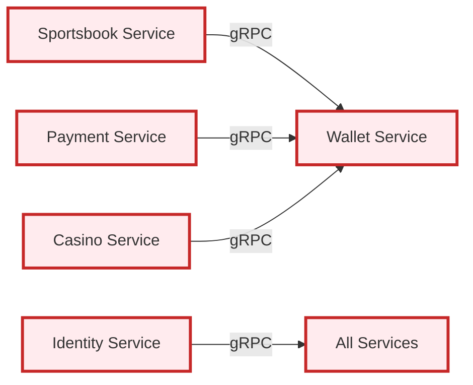
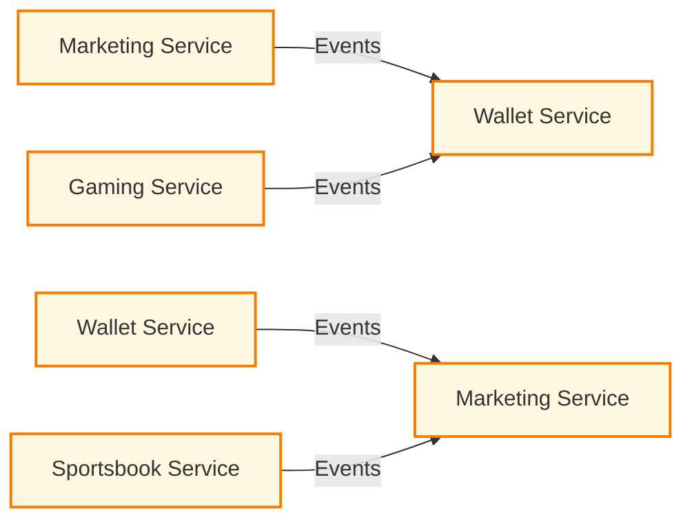
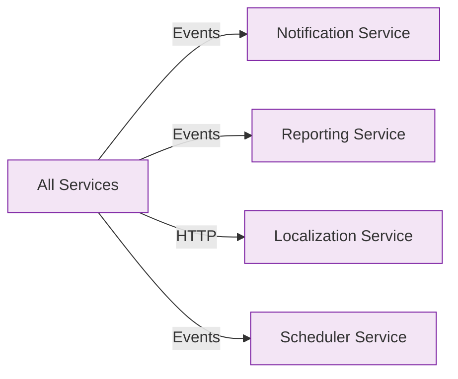
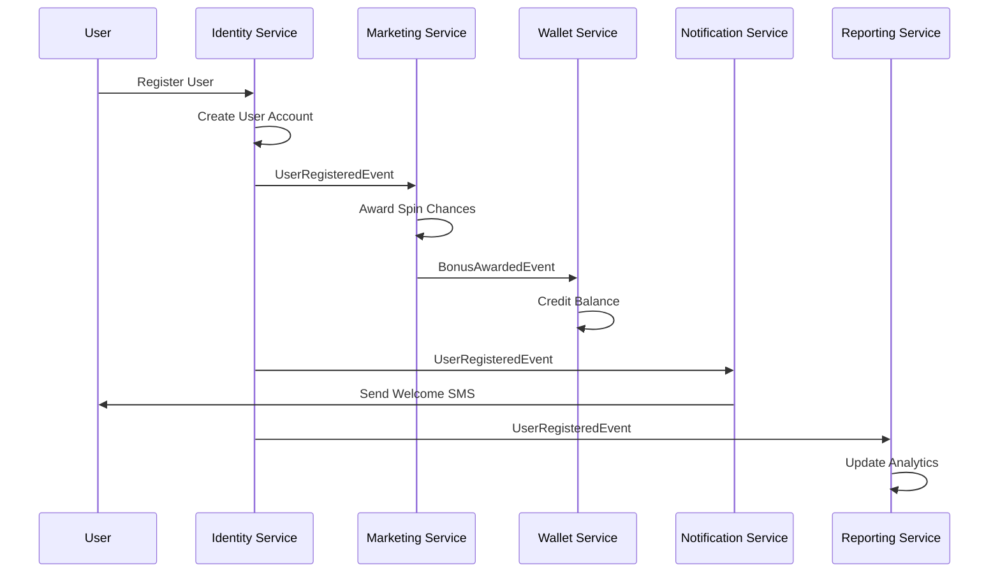
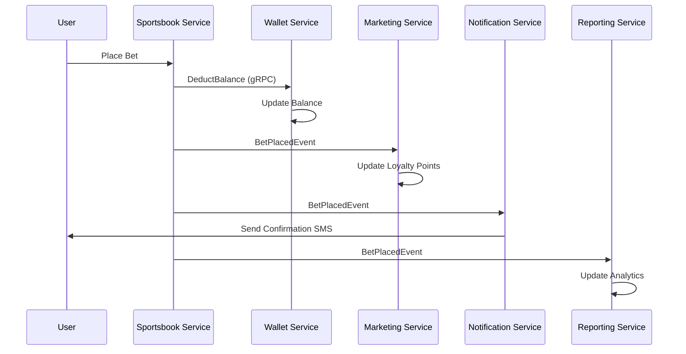
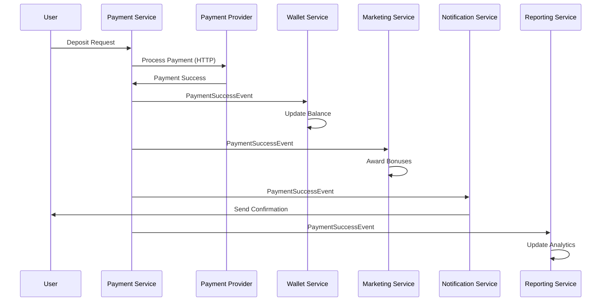
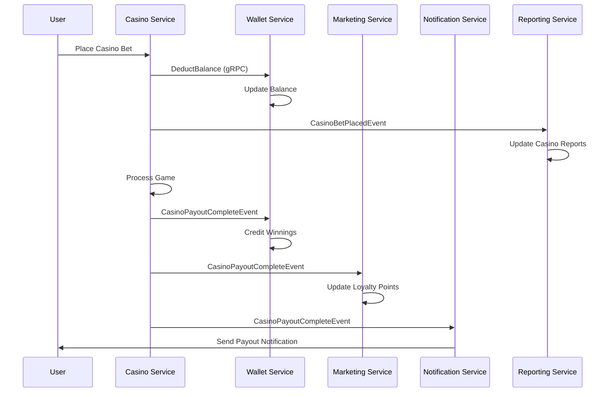

# 🎯 **SERVICE COMMUNICATION FLOW DIAGRAM**

## 📊 **Complete Service Communication Architecture**

```mermaid
graph TB
    %% External Systems
    User[👤 User] --> API[🌐 API Gateway]
    PaymentProvider[💳 Payment Provider] --> API
    BetRadar[📊 BetRadar] --> API
    SMSProvider[📱 SMS Provider] --> API
    
    %% API Gateway
    API --> Identity[🔐 Identity Service]
    API --> Sportsbook[⚽ Sportsbook Service]
    API --> Payment[💳 Payment Service]
    API --> Wallet[💰 Wallet Service]
    API --> Marketing[🎁 Marketing Service]
    API --> Casino[🎰 Casino Service]
    API --> Gaming[🎮 Gaming Service]
    API --> Notification[📱 Notification Service]
    API --> Reporting[📊 Reporting Service]
    
    %% High-Frequency Communications (Synchronous)
    Sportsbook -.->|gRPC| Wallet
    Payment -.->|gRPC| Wallet
    Casino -.->|gRPC| Wallet
    Identity -.->|gRPC| All[All Services]
    
    %% Medium-Frequency Communications (Asynchronous)
    Marketing -.->|Events| Wallet
    Gaming -.->|Events| Wallet
    Wallet -.->|Events| Marketing
    Sportsbook -.->|Events| Marketing
    
    %% Low-Frequency Communications (Asynchronous)
    All -.->|Events| Notification
    All -.->|Events| Reporting
    All -.->|HTTP| Localization[🌍 Localization Service]
    All -.->|Events| Scheduler[⏰ Scheduler Service]
    
    %% Event Bus
    EventBus[🔄 Event Bus<br/>RabbitMQ/Kafka] --> Identity
    EventBus --> Sportsbook
    EventBus --> Payment
    EventBus --> Wallet
    EventBus --> Marketing
    EventBus --> Casino
    EventBus --> Gaming
    EventBus --> Notification
    EventBus --> Reporting
    
    %% Database Layer
    Identity --> |Data| DB1[(🗄️ Identity DB)]
    Sportsbook --> |Data| DB2[(🗄️ Sportsbook DB)]
    Payment --> |Data| DB3[(🗄️ Payment DB)]
    Wallet --> |Data| DB4[(🗄️ Wallet DB)]
    Marketing --> |Data| DB5[(🗄️ Marketing DB)]
    Casino --> |Data| DB6[(🗄️ Casino DB)]
    Gaming --> |Data| DB7[(🗄️ Gaming DB)]
    Notification --> |Data| DB8[(🗄️ Notification DB)]
    Reporting --> |Data| DB9[(🗄️ Reporting DB)]
    
    %% Cache Layer
    Redis[(🔴 Redis Cache)] --> Identity
    Redis --> Sportsbook
    Redis --> Payment
    Redis --> Wallet
    Redis --> Marketing
    Redis --> Casino
    Redis --> Gaming
    Redis --> Notification
    Redis --> Reporting
    
    %% Styling
    classDef serviceClass fill:#e1f5fe,stroke:#01579b,stroke-width:2px
    classDef databaseClass fill:#f3e5f5,stroke:#4a148c,stroke-width:2px
    classDef externalClass fill:#fff3e0,stroke:#e65100,stroke-width:2px
    classDef eventClass fill:#e8f5e8,stroke:#2e7d32,stroke-width:2px
    classDef highFreqClass fill:#ffebee,stroke:#c62828,stroke-width:3px
    classDef mediumFreqClass fill:#fff8e1,stroke:#f57c00,stroke-width:2px
    classDef lowFreqClass fill:#f3e5f5,stroke:#7b1fa2,stroke-width:1px
    
    class Identity,Sportsbook,Payment,Wallet,Marketing,Casino,Gaming,Notification,Reporting,Scheduler,Localization serviceClass
    class DB1,DB2,DB3,DB4,DB5,DB6,DB7,DB8,DB9,Redis databaseClass
    class User,PaymentProvider,BetRadar,SMSProvider externalClass
    class EventBus eventClass
```

## 🎯 **Communication Frequency Matrix**

### **✅ High-Frequency Communications (Synchronous)**

### **✅ Medium-Frequency Communications (Asynchronous)**

### **✅ Low-Frequency Communications (Asynchronous)**

## 🔄 **Critical Service Flows**

### **✅ 1. User Registration Flow**

### **✅ 2. Bet Placement Flow**

### **✅ 3. Payment Processing Flow**

### **✅ 4. Casino Operations Flow**

## 🎯 **Event Topics & Subscriptions**

### **✅ Event Topics**
- **user.events** → User registration, login, profile updates
- **betting.events** → Bet placement, settlement, cancellation
- **payment.events** → Deposits, withdrawals, refunds
- **marketing.events** → Bonus awards, campaign triggers
- **gaming.events** → Jackpot, raffle, tournament events
- **casino.events** → Game sessions, payouts, reports
- **notification.events** → SMS, email, push notifications

### **✅ Service Subscriptions**
- **Identity Service** → user.events, notification.events
- **Sportsbook Service** → betting.events, payment.events
- **Payment Service** → payment.events, notification.events
- **Wallet Service** → payment.events, betting.events, marketing.events
- **Marketing Service** → user.events, betting.events, payment.events
- **Casino Service** → casino.events, payment.events, notification.events
- **Gaming Service** → gaming.events, payment.events, notification.events
- **Notification Service** → All event topics
- **Reporting Service** → All event topics

## 🎯 **Communication Protocols**

### **✅ 1. gRPC Services (High Performance)**
- **Sportsbook ↔ Wallet** → Balance operations
- **Payment ↔ Wallet** → Balance updates
- **Casino ↔ Wallet** → Game balance
- **Identity ↔ All Services** → Authentication/Authorization

### **✅ 2. HTTP REST APIs (External Integration)**
- **API Gateway ↔ All Services** → Client requests
- **Payment Service ↔ External Providers** → Payment processing
- **Notification Service ↔ SMS/Email Providers** → Message delivery
- **Sportsbook Service ↔ BetRadar** → Odds data

### **✅ 3. Message Queues (Asynchronous)**
- **RabbitMQ/Kafka** → Event distribution
- **High Priority Queue** → Payment, betting operations
- **Medium Priority Queue** → Notifications, marketing
- **Low Priority Queue** → Analytics, reporting

### **✅ 4. WebSocket Connections (Real-time)**
- **Notification Service ↔ Clients** → Live updates
- **Sportsbook Service ↔ Clients** → Live odds
- **Gaming Service ↔ Clients** → Jackpot updates
- **Casino Service ↔ Clients** → Game results

## 🎯 **Service Dependencies**

### **✅ Critical Dependencies**
- **Sportsbook** → **Wallet** (balance management)
- **Payment** → **Wallet** (balance updates)
- **Marketing** → **Wallet** (bonus credits)
- **Casino** → **Wallet** (game balance)
- **Gaming** → **Wallet** (prize distribution)

### **✅ Optional Dependencies**
- **All Services** → **Notification** (user communications)
- **All Services** → **Reporting** (analytics)
- **Identity** → **Marketing** (user segmentation)
- **Identity** → **Notification** (user alerts)

### **✅ Independent Services**
- **Localization** → Translation services
- **Scheduler** → Background task management
- **API Gateway** → Request routing

---

**This comprehensive service communication flow ensures reliable, scalable, and maintainable inter-service communication for your 12 microservices!** 🎯
