# 💳 **Payment Flow: External Application → Callback**

## 🎯 **Payment Flow Overview**

This document illustrates the payment flow where the first payment request goes to an external application, and if successful, it hits your callback system.

## 🔄 **Payment Flow Diagram**

```mermaid
sequenceDiagram
    participant User as 👤 User
    participant Frontend as 🖥️ Frontend App
    participant API as 🌐 API Gateway
    participant Payment as 💳 Payment Service
    participant External as 🏦 External Payment App
    participant Wallet as 💰 Wallet Service
    participant Callback as 📞 Callback Handler

    User->>Frontend: 1. Initiate Payment
    Frontend->>API: 2. POST /api/payments/deposit
    API->>Payment: 3. Create Payment Transaction
    
    Payment->>Payment: 4. Create PAYMENT_TRANSACTIONS record
    Note over Payment: Status: 'pending'
    
    Payment->>External: 5. POST to External Payment App
    Note over External: External App processes payment
    
    External-->>Payment: 6. Redirect to External App
    Payment-->>API: 7. Return redirect URL
    API-->>Frontend: 8. Return redirect URL
    Frontend-->>User: 9. Redirect to External App
    
    User->>External: 10. Complete Payment on External App
    External->>External: 11. Process Payment
    
    alt Payment Successful
        External->>Callback: 12. POST /webhooks/payment-success
        Callback->>Payment: 13. Update Transaction Status
        Payment->>Payment: 14. Update PAYMENT_TRANSACTIONS
        Note over Payment: Status: 'completed'
        
        Payment->>Wallet: 15. Credit User Wallet
        Wallet->>Wallet: 16. Update WALLETS balance
        Wallet->>Wallet: 17. Create WALLET_TRANSACTIONS
        
        Wallet-->>Payment: 18. Wallet Updated
        Payment-->>Callback: 19. Success Response
        Callback-->>External: 20. 200 OK
        
        Payment->>Frontend: 21. WebSocket/SSE: Payment Complete
        Frontend->>User: 22. Show Success Message
        
    else Payment Failed
        External->>Callback: 12. POST /webhooks/payment-failed
        Callback->>Payment: 13. Update Transaction Status
        Payment->>Payment: 14. Update PAYMENT_TRANSACTIONS
        Note over Payment: Status: 'failed'
        
        Payment-->>Callback: 15. Failure Response
        Callback-->>External: 16. 200 OK
        
        Payment->>Frontend: 17. WebSocket/SSE: Payment Failed
        Frontend->>User: 18. Show Error Message
    end
```



## 🏗️ **Architecture Components**

### **1. Payment Service Tables Used:**
- **PAYMENT_TRANSACTIONS** - Track payment status and external references
- **PAYMENT_WEBHOOKS** - Store callback/webhook data from external app
- **PAYMENT_PROVIDERS** - External payment app configuration
- **AUDIT_LOGS** - Complete payment audit trail

### **2. Wallet Service Integration:**
- **WALLETS** - User wallet balance updates
- **WALLET_TRANSACTIONS** - Transaction history recording
- **WALLET_TEMP_LOGS** - Temporary pending operations

### **3. External Application Integration:**
- **API Endpoints** - External payment app API
- **Webhook URLs** - Your callback endpoints
- **Authentication** - API keys and signatures

## 🔧 **Implementation Details**

### **Step 1: Initial Payment Request**
```csharp
// Payment Service creates transaction
var transaction = new PaymentTransaction
{
    Id = Guid.NewGuid(),
    UserId = userId,
    Amount = amount,
    Currency = currency,
    Status = "pending",
    ProviderId = externalProviderId,
    CreatedAt = DateTime.UtcNow
};

// Store in PAYMENT_TRANSACTIONS table
await _paymentRepository.CreateTransactionAsync(transaction);
```

### **Step 2: External Application Redirect**
```csharp
// Generate redirect URL to external payment app
var redirectUrl = await _externalPaymentService.CreatePaymentRequestAsync(new
{
    TransactionId = transaction.Id,
    Amount = amount,
    Currency = currency,
    CallbackUrl = "https://your-api.com/webhooks/payment-callback",
    SuccessUrl = "https://your-frontend.com/payment/success",
    FailureUrl = "https://your-frontend.com/payment/failure"
});

return new { RedirectUrl = redirectUrl };
```

### **Step 3: Callback Processing**
```csharp
[HttpPost("/webhooks/payment-callback")]
public async Task<IActionResult> HandlePaymentCallback([FromBody] PaymentCallbackRequest request)
{
    // Validate webhook signature
    if (!await _webhookValidator.ValidateSignatureAsync(request.Signature, request.Payload))
    {
        return BadRequest("Invalid signature");
    }

    // Store webhook data
    var webhook = new PaymentWebhook
    {
        Id = Guid.NewGuid(),
        ProviderId = request.ProviderId,
        WebhookType = request.EventType,
        WebhookData = request.Payload,
        TransactionId = request.TransactionId,
        ProcessingStatus = "pending"
    };

    await _paymentRepository.CreateWebhookAsync(webhook);

    // Process payment result
    if (request.Status == "success")
    {
        await ProcessSuccessfulPayment(request.TransactionId, request.Amount);
    }
    else
    {
        await ProcessFailedPayment(request.TransactionId, request.ErrorMessage);
    }

    return Ok();
}
```

### **Step 4: Wallet Update**
```csharp
private async Task ProcessSuccessfulPayment(Guid transactionId, decimal amount)
{
    // Update payment transaction
    await _paymentRepository.UpdateTransactionStatusAsync(transactionId, "completed");

    // Credit user wallet
    await _walletService.CreditWalletAsync(new CreditWalletRequest
    {
        UserId = transaction.UserId,
        Amount = amount,
        Currency = transaction.Currency,
        TransactionType = "deposit",
        ReferenceId = transactionId.ToString(),
        Description = "Payment deposit from external provider"
    });

    // Notify frontend via WebSocket/SSE
    await _notificationService.NotifyPaymentCompleteAsync(transaction.UserId, transactionId);
}
```

## 🔒 **Security Considerations**

### **1. Webhook Validation**
- **Signature Verification** - Validate webhook signatures
- **Timestamp Validation** - Prevent replay attacks
- **IP Whitelisting** - Only allow callbacks from trusted IPs

### **2. Transaction Security**
- **Idempotency** - Prevent duplicate processing
- **Atomic Operations** - Ensure data consistency
- **Audit Logging** - Complete transaction trail

### **3. Error Handling**
- **Retry Logic** - Handle temporary failures
- **Dead Letter Queue** - Process failed webhooks
- **Monitoring** - Alert on payment failures

## 📊 **Database Flow**

### **Payment Transaction States:**
1. **pending** - Initial state when created
2. **processing** - Sent to external app
3. **completed** - Successfully processed
4. **failed** - Payment failed
5. **cancelled** - User cancelled

### **Webhook Processing States:**
1. **pending** - Received but not processed
2. **processed** - Successfully processed
3. **failed** - Processing failed

## 🎯 **Key Benefits**

### **✅ Reliable Payment Processing**
- **External Integration** - Leverage established payment providers
- **Real-time Updates** - Webhook-based status updates
- **Audit Trail** - Complete transaction history

### **✅ User Experience**
- **Seamless Flow** - Redirect to external app and back
- **Status Updates** - Real-time payment status
- **Error Handling** - Clear error messages

### **✅ Security & Compliance**
- **Webhook Validation** - Secure callback processing
- **Audit Logging** - Regulatory compliance
- **Multi-tenant Isolation** - Complete data separation

## 🚀 **Next Steps**

1. **Implement Webhook Endpoints** - Create callback handlers
2. **External App Integration** - Configure payment providers
3. **Frontend Integration** - Handle redirects and status updates
4. **Testing** - Test payment flows end-to-end
5. **Monitoring** - Set up payment monitoring and alerts

**This payment flow provides a robust, secure, and scalable solution for external payment processing with real-time callbacks!** 🎯
