# 🗄️ **User & Identity Service - Optimized ER Diagram**

## 📊 **Entity Relationship Diagram**

Based on your existing **ASP.NET Core Identity + OpenID Connect + OpenIddict** implementation, this optimized ER diagram shows the User & Identity Service database schema with multi-tenant support.

```mermaid
erDiagram
    TENANTS {
        uuid id PK
        varchar tenant_code UK
        varchar tenant_name
        text description
        boolean is_active
        integer rowVersion
        timestamp created_at
        timestamp updated_at
    }
    
    ASPNET_USERS {
        varchar id PK
        uuid tenant_id FK
        varchar username
        varchar normalized_username
        varchar email
        varchar normalized_email
        boolean email_confirmed
        varchar password_hash
        varchar security_stamp
        varchar concurrency_stamp
        varchar phone_number
        boolean phone_number_confirmed
        boolean two_factor_enabled
        timestamp lockout_end
        boolean lockout_enabled
        integer access_failed_count
        varchar friendly_name
        varchar job_title
        varchar full_name
        varchar configuration
        boolean is_enabled
        boolean is_broker
        varchar created_by
        varchar updated_by
        timestamp created_date
        timestamp updated_date
        integer rowVersion
    }
    
    ASPNET_ROLES {
        varchar id PK
        uuid tenant_id FK
        varchar name
        varchar normalized_name
        varchar concurrency_stamp
        varchar description
        varchar created_by
        varchar updated_by
        timestamp created_date
        timestamp updated_date
        integer rowVersion
    }
    
    ASPNET_USER_ROLES {
        varchar user_id PK
        varchar role_id PK
        uuid tenant_id FK
        integer rowVersion
    }
    
    ASPNET_USER_CLAIMS {
        int id PK
        varchar user_id FK
        varchar claim_type
        varchar claim_value
        uuid tenant_id FK
        integer rowVersion
    }
    
    ASPNET_ROLE_CLAIMS {
        int id PK
        varchar role_id FK
        varchar claim_type
        varchar claim_value
        uuid tenant_id FK
        integer rowVersion
    }
    
    ASPNET_USER_LOGINS {
        varchar login_provider PK
        varchar provider_key PK
        varchar provider_display_name
        varchar user_id FK
        uuid tenant_id FK
        integer rowVersion
    }
    
    ASPNET_USER_TOKENS {
        varchar user_id PK
        varchar login_provider PK
        varchar name PK
        varchar value
        uuid tenant_id FK
        integer rowVersion
    }
    
    OPENIDDICT_APPLICATIONS {
        varchar id PK
        varchar client_id UK
        varchar client_secret
        varchar concurrency_stamp
        varchar consent_type
        varchar display_name
        varchar type
        uuid tenant_id FK
        integer rowVersion
    }
    
    OPENIDDICT_AUTHORIZATIONS {
        varchar id PK
        varchar application_id FK
        varchar concurrency_stamp
        varchar scopes
        varchar status
        varchar subject
        varchar type
        uuid tenant_id FK
        integer rowVersion
    }
    
    OPENIDDICT_SCOPES {
        varchar id PK
        varchar concurrency_stamp
        varchar description
        varchar descriptions
        varchar display_name
        varchar display_names
        varchar name
        varchar properties
        varchar resources
        uuid tenant_id FK
        integer rowVersion
    }
    
    OPENIDDICT_TOKENS {
        varchar id PK
        varchar application_id FK
        varchar authorization_id FK
        varchar concurrency_stamp
        timestamp creation_date
        timestamp expiration_date
        varchar payload
        varchar properties
        timestamp redemption_date
        varchar reference_id
        varchar scopes
        varchar status
        varchar subject
        varchar type
        uuid tenant_id FK
        integer rowVersion
    }
    
    AGENTS {
        uuid id PK
        uuid tenant_id FK
        varchar agent_code
        varchar user_id FK
        decimal commission_rate
        decimal max_commission
        boolean is_active
        boolean is_verified
        varchar created_by
        integer rowVersion
        timestamp created_at
        timestamp updated_at
    }
    
    AGENT_BRANCHES {
        uuid id PK
        uuid tenant_id FK
        uuid agent_id FK
        varchar branch_name
        varchar branch_code
        varchar location
        text address
        varchar phone_number
        varchar email
        boolean is_active
        integer rowVersion
        timestamp created_at
        timestamp updated_at
    }
    
    BRANCHES {
        uuid id PK
        uuid tenant_id FK
        uuid agent_id FK
        varchar branch_id UK
        varchar branch_secret
        varchar branch_name
        varchar branch_city
        varchar branch_address
        decimal credit_limit
        integer min_stake
        decimal offlinebet_sales_limit
        decimal branch_deposit_limit
        decimal offlinebet_duplicate_stake_limit
        integer offlinebet_duplicate_number_limit
        time operating_start_time
        time operating_end_time
        varchar branch_channel
        boolean is_disabled
        integer rowVersion
        timestamp created_at
        timestamp updated_at
    }
    
    BRANCH_ROLES {
        uuid id PK
        uuid tenant_id FK
        uuid branch_id FK
        varchar role_name
        varchar role_permissions
        jsonb role_config
        boolean is_active
        integer rowVersion
        timestamp created_at
        timestamp updated_at
    }
    
    BRANCH_TRANSACTIONS {
        uuid id PK
        uuid tenant_id FK
        uuid branch_id FK
        varchar user_id FK
        varchar transaction_type
        decimal transaction_amount
        varchar transaction_status
        varchar transaction_reference
        jsonb transaction_details
        timestamp transaction_date
        integer rowVersion
        timestamp created_at
        timestamp updated_at
    }
    
    SALES_PERSONNEL {
        uuid id PK
        uuid tenant_id FK
        uuid agent_id FK
        uuid branch_id FK
        varchar user_id FK
        varchar sales_channel
        varchar phone_number
        varchar sales_city
        varchar sales_state
        varchar sales_address
        text sales_notes
        varchar attached_document
        boolean is_disabled
        timestamp last_seen
        timestamp last_confirmed_ticket_at
        timestamp last_payout_at
        timestamp last_deposit_at
        integer access_period_days
        integer rowVersion
        timestamp created_at
        timestamp updated_at
    }
    
    BRANCH_STAKE_LIMITS {
        uuid id PK
        uuid tenant_id FK
        uuid branch_id FK
        decimal min_odd
        decimal max_odd
        decimal allowed_max_stake
        integer rowVersion
        timestamp created_at
        timestamp updated_at
    }
    
    USER_AGENT_ASSIGNMENTS {
        uuid id PK
        uuid tenant_id FK
        varchar user_id FK
        uuid agent_id FK
        varchar assignment_type
        boolean is_active
        varchar assigned_by
        timestamp assigned_at
        timestamp unassigned_at
        text notes
        integer rowVersion
    }
    
    TENANT_SETTINGS {
        uuid id PK
        uuid tenant_id FK
        varchar setting_key
        text setting_value
        varchar setting_type
        text description
        boolean is_encrypted
        integer rowVersion
        timestamp created_at
        timestamp updated_at
    }
    
    OTP_VERIFICATIONS {
        uuid id PK
        uuid tenant_id FK
        varchar user_id FK
        varchar code
        varchar otp_type
        varchar phone_number
        varchar state
        timestamp expires_at
        integer rowVersion
        timestamp created_at
        timestamp updated_at
    }
    
    SMS_TEMPLATES {
        uuid id PK
        uuid tenant_id FK
        varchar template_name
        text registration_verification_message
        text phone_confirmation_message
        text password_reset_message
        text deposit_success_message
        text bet_placed_message
        text bet_won_message
        text withdrawal_message
        integer rowVersion
        timestamp created_at
        timestamp updated_at
    }
    
    TENANT_CONFIGURATIONS {
        uuid id PK
        uuid tenant_id FK
        varchar config_key
        text config_value
        varchar config_type
        boolean is_encrypted
        integer rowVersion
        timestamp created_at
        timestamp updated_at
    }
    
    
    
    TENANT_UI_CONFIGURATIONS {
        uuid id PK
        uuid tenant_id FK
        varchar frontend_template
        varchar landing_page_match_list
        varchar mobile_submenu_type
        varchar mobile_match_list_type
        varchar mobile_fixed_footer_type
        varchar mobile_menu_bar_type
        varchar desktop_menu_bar_type
        varchar print_code_type
        boolean show_ticket_id
        integer rowVersion
        timestamp created_at
        timestamp updated_at
    }
    
    TENANT_REFERRAL_CONFIGURATIONS {
        uuid id PK
        uuid tenant_id FK
        boolean referral_support
        varchar referral_type
        decimal min_bet_amount
        decimal min_deposit_amount
        decimal award_amount
        boolean badged_commission_support
        integer rowVersion
        timestamp created_at
        timestamp updated_at
    }
    
    TENANT_TRANSFER_CONFIGURATIONS {
        uuid id PK
        uuid tenant_id FK
        boolean transfer_enabled
        boolean contact_confirm
        decimal min_transfer_amount
        decimal max_transfer_amount
        integer max_daily_transfers
        integer rowVersion
        timestamp created_at
        timestamp updated_at
    }
    
    TENANT_GENERAL_CONFIGURATIONS {
        uuid id PK
        uuid tenant_id FK
        varchar country_code
        varchar currency
        varchar language_code
        varchar country
        varchar domain_name
        varchar contact_number
        boolean online_bet_support
        boolean offline_bet_support
        boolean offline_payout_enabled
        boolean language_supported
        varchar underage_limit
        varchar registration_flow
        integer rowVersion
        timestamp created_at
        timestamp updated_at
    }
    
    AUDIT_LOGS {
        uuid id PK
        uuid tenant_id FK
        varchar user_id FK
        varchar action
        varchar entity_type
        varchar entity_id
        jsonb old_values
        jsonb new_values
        inet ip_address
        text user_agent
        varchar request_id
        integer rowVersion
        timestamp created_at
    }

    %% Core Relationships
    TENANTS ||--o{ ASPNET_USERS : "has"
    TENANTS ||--o{ ASPNET_ROLES : "has"
    TENANTS ||--o{ ASPNET_USER_ROLES : "has"
    TENANTS ||--o{ ASPNET_USER_CLAIMS : "has"
    TENANTS ||--o{ ASPNET_ROLE_CLAIMS : "has"
    TENANTS ||--o{ ASPNET_USER_LOGINS : "has"
    TENANTS ||--o{ ASPNET_USER_TOKENS : "has"
    TENANTS ||--o{ OPENIDDICT_APPLICATIONS : "has"
    TENANTS ||--o{ OPENIDDICT_AUTHORIZATIONS : "has"
    TENANTS ||--o{ OPENIDDICT_SCOPES : "has"
    TENANTS ||--o{ OPENIDDICT_TOKENS : "has"
    TENANTS ||--o{ AGENTS : "has"
    TENANTS ||--o{ AGENT_BRANCHES : "has"
    TENANTS ||--o{ USER_AGENT_ASSIGNMENTS : "has"
    TENANTS ||--o{ TENANT_SETTINGS : "has"
    TENANTS ||--o{ OTP_VERIFICATIONS : "has"
    TENANTS ||--o{ SMS_TEMPLATES : "has"
    TENANTS ||--o{ TENANT_CONFIGURATIONS : "has"
    TENANTS ||--o{ TENANT_UI_CONFIGURATIONS : "has"
    TENANTS ||--o{ TENANT_REFERRAL_CONFIGURATIONS : "has"
    TENANTS ||--o{ TENANT_TRANSFER_CONFIGURATIONS : "has"
    TENANTS ||--o{ TENANT_GENERAL_CONFIGURATIONS : "has"
    TENANTS ||--o{ AUDIT_LOGS : "has"
    
    %% ASP.NET Identity Relationships
    ASPNET_USERS ||--o{ ASPNET_USER_ROLES : "has"
    ASPNET_USERS ||--o{ ASPNET_USER_CLAIMS : "has"
    ASPNET_USERS ||--o{ ASPNET_USER_LOGINS : "has"
    ASPNET_USERS ||--o{ ASPNET_USER_TOKENS : "has"
    ASPNET_ROLES ||--o{ ASPNET_USER_ROLES : "has"
    ASPNET_ROLES ||--o{ ASPNET_ROLE_CLAIMS : "has"
    
    %% OpenIddict Relationships
    OPENIDDICT_APPLICATIONS ||--o{ OPENIDDICT_AUTHORIZATIONS : "has"
    OPENIDDICT_APPLICATIONS ||--o{ OPENIDDICT_TOKENS : "has"
    OPENIDDICT_AUTHORIZATIONS ||--o{ OPENIDDICT_TOKENS : "has"
    
    %% Agent Relationships
    ASPNET_USERS ||--o{ AGENTS : "is"
    AGENTS ||--o{ AGENT_BRANCHES : "has"
    AGENTS ||--o{ USER_AGENT_ASSIGNMENTS : "manages"
    ASPNET_USERS ||--o{ USER_AGENT_ASSIGNMENTS : "assigned_to"
    AGENTS ||--o{ BRANCHES : "manages"
    AGENTS ||--o{ SALES_PERSONNEL : "manages"
    
    %% Branch Relationships
    BRANCHES ||--o{ BRANCH_ROLES : "has"
    BRANCHES ||--o{ BRANCH_TRANSACTIONS : "processes"
    BRANCHES ||--o{ SALES_PERSONNEL : "employs"
    BRANCHES ||--o{ BRANCH_STAKE_LIMITS : "has"
    
    %% Django-Inspired Relationships
    ASPNET_USERS ||--o{ OTP_VERIFICATIONS : "has"
    TENANTS ||--o{ SMS_TEMPLATES : "has"
    TENANTS ||--o{ TENANT_CONFIGURATIONS : "has"
```

## 🎯 **Optimized Architecture Based on Your Current Implementation**

### **✅ ASP.NET Core Identity Integration**
- **Standard Identity Tables** → `ASPNET_USERS`, `ASPNET_ROLES`, `ASPNET_USER_ROLES`
- **Claims-Based Authorization** → `ASPNET_USER_CLAIMS`, `ASPNET_ROLE_CLAIMS`
- **External Login Providers** → `ASPNET_USER_LOGINS`
- **Token Management** → `ASPNET_USER_TOKENS`
- **Multi-Tenant Support** → `tenant_id` in all Identity tables

### **✅ OpenIddict Integration**
- **OAuth 2.0 / OpenID Connect** → `OPENIDDICT_APPLICATIONS`, `OPENIDDICT_TOKENS`
- **Authorization Management** → `OPENIDDICT_AUTHORIZATIONS`
- **Scope Management** → `OPENIDDICT_SCOPES`
- **Multi-Tenant OAuth** → `tenant_id` in all OpenIddict tables

### **✅ SRS Requirements Coverage**

#### **FR-030: Agent System** ✅
- **Agent Onboarding** → `AGENTS` table with `user_id` FK to `ASPNET_USERS`
- **Commission Management** → `commission_rate`, `max_commission` fields
- **Agent Branches** → `AGENT_BRANCHES` table
- **User-Agent Assignments** → `USER_AGENT_ASSIGNMENTS` table

#### **FR-031: Tenant Management** ✅
- **Tenant Isolation** → `tenant_id` in all tables
- **Tenant Configuration** → `TENANT_SETTINGS` table
- **Multi-Tenant OAuth** → OpenIddict tables with `tenant_id`

#### **FR-032: User Management** ✅
- **User Registration** → `ASPNET_USERS` with custom fields
- **Authentication** → Built-in Identity authentication
- **Role Management** → `ASPNET_ROLES` with tenant isolation
- **Claims Management** → `ASPNET_USER_CLAIMS` for permissions
- **Account Security** → Built-in lockout, 2FA, password reset

#### **FR-033: OAuth 2.0 and OpenID Connect** ✅
- **OAuth 2.0 Server** → OpenIddict implementation
- **OpenID Connect** → Built-in OpenIddict support
- **JWT Tokens** → `OPENIDDICT_TOKENS` table
- **Client Management** → `OPENIDDICT_APPLICATIONS` table
- **Scope Management** → `OPENIDDICT_SCOPES` table

#### **FR-034: Client Management** ✅
- **OAuth Clients** → `OPENIDDICT_APPLICATIONS` with tenant isolation
- **Client Credentials** → OpenIddict client credentials flow
- **Client Scopes** → `OPENIDDICT_SCOPES` with tenant support
- **Client Security** → Built-in OpenIddict security features

## 🔒 **Security Features**

### **1. Multi-Tenant Isolation**
- **TenantId in every table** for complete data isolation
- **ASP.NET Identity with tenant support** → Standard Identity tables + tenant_id
- **OpenIddict with tenant isolation** → OAuth clients per tenant
- **No cross-tenant data access** possible

### **2. Authentication Security**
- **ASP.NET Core Identity** → Built-in password hashing, 2FA, lockout
- **OpenIddict OAuth 2.0** → Industry-standard OAuth implementation
- **Claims-based authorization** → Flexible permission system
- **External login providers** → Social login support
- **Token management** → Secure token storage and validation

### **3. Audit & Compliance**
- **Complete audit trail** → `AUDIT_LOGS` for all actions
- **Identity audit** → Built-in Identity audit features
- **OAuth audit** → OpenIddict token and authorization tracking
- **Multi-tenant audit** → Tenant-scoped audit logging

## 🚀 **Performance Optimizations**

### **1. Standard Identity Performance**
- **Built-in Identity optimization** → ASP.NET Core Identity performance
- **OpenIddict performance** → Optimized OAuth token handling
- **Multi-tenant indexing** → Composite indexes on (tenant_id, other_columns)
- **Claims caching** → Efficient claims resolution

### **2. Query Optimization**
- **TenantId filtering** on all queries
- **Identity queries** → Optimized user and role lookups
- **OAuth queries** → Efficient token and client lookups
- **Agent queries** → Optimized agent and assignment lookups

## 🎯 **Key Benefits of This Optimized Approach**

### **✅ Leverages Your Existing Implementation**
- **Reuses ASP.NET Core Identity** → No need to reinvent authentication
- **Reuses OpenIddict** → No need to build OAuth from scratch
- **Familiar patterns** → Your team already knows these technologies
- **Proven security** → Industry-standard authentication and authorization

### **✅ Multi-Tenant Ready**
- **TenantId in all tables** → Complete data isolation
- **Tenant-scoped OAuth** → Each tenant has their own OAuth clients
- **Tenant-scoped Identity** → Users and roles per tenant
- **Scalable architecture** → Supports unlimited tenants

### **✅ Enterprise Features**
- **Claims-based authorization** → Flexible permission system
- **External login providers** → Social login support
- **Two-factor authentication** → Built-in 2FA support
- **Account lockout** → Built-in security features
- **Audit logging** → Complete audit trail

### **✅ Performance Optimized**
- **Built-in Identity performance** → ASP.NET Core Identity optimization
- **OpenIddict performance** → Optimized OAuth token handling
- **Multi-tenant indexing** → Efficient tenant-scoped queries
- **Claims caching** → Fast permission checks

## 🔍 **Insights from FlatOddAPI Analysis**

### **✅ Django Patterns to Consider**
- **Agent System** → `Agent` model with `user` OneToOneField to Django User
- **Role-Based Access** → `AgentRole` with role choices and permissions
- **OTP System** → `OTP` model for verification codes
- **SMS Templates** → `SMSTEMPLATE` for notification messages
- **Configuration Management** → `MainConfiguration` for tenant settings
- **Wallet System** → `Wallet` with balance partitions (payable, deductable, nonwithdrawable)
- **Transaction Tracking** → `BankTransaction` for financial operations
- **Audit Logging** → Built-in Django signals and logging

### **✅ Key Django Features to Migrate**
1. **Agent Management** → Your current `Agent` model with commission tracking
2. **OTP Verification** → Your current `OTP` system for phone verification
3. **SMS Integration** → Your current SMS template system
4. **Wallet Management** → Your current wallet balance system
5. **Transaction History** → Your current transaction tracking
6. **Configuration System** → Your current tenant configuration approach

### **✅ Migration Strategy**
- **Preserve Business Logic** → Keep your current agent and wallet logic
- **Enhance with .NET** → Add ASP.NET Core Identity + OpenIddict
- **Multi-Tenant Support** → Add tenant_id to all existing patterns
- **Modern Security** → Upgrade from Django auth to OAuth 2.0 + OpenID Connect

## 📋 **Next Steps**

1. **✅ ER Diagram Complete** - Optimized for your existing implementation
2. **⏳ SQL Schema** - Create database tables with tenant_id
3. **⏳ Entity Models** - Extend ApplicationUser with tenant support
4. **⏳ Service Implementation** - Build User & Identity Service
5. **⏳ Testing** - Unit and integration tests

---

**This optimized ER diagram leverages your existing ASP.NET Core Identity + OpenIddict implementation while incorporating proven patterns from your Django FlatOddAPI system and adding multi-tenant support for your betting system!** 🎯

## 📊 **Complete Table Organization & Structure**

### **🏢 1. TENANT MANAGEMENT TABLES**
| Table Name | Purpose | Key Fields |
|------------|---------|------------|
| `TENANTS` | Core tenant information | `id`, `tenant_code`, `tenant_name`, `is_active` |
| `TENANT_SETTINGS` | Tenant-specific settings | `tenant_id`, `setting_key`, `setting_value` |
| `TENANT_CONFIGURATIONS` | Advanced tenant configurations | `tenant_id`, `config_key`, `config_value` |
| `TENANT_MARKET_CONFIGURATIONS` | Market enablement per tenant | `tenant_id`, `sport_id`, `league_id`, `market_type`, `is_enabled` |
| `TENANT_BETTING_LIMITS` | Betting limits per tenant | `tenant_id`, `limit_type`, `limit_value`, `time_period` |
| `TENANT_PAYMENT_CONFIGURATIONS` | Payment method configurations | `tenant_id`, `payment_method`, `is_enabled`, `deposit_enabled`, `withdraw_enabled` |
| `TENANT_SMS_CONFIGURATIONS` | SMS notification settings | `tenant_id`, `sms_provider`, `registration_confirmation_enabled` |
| `TENANT_WALLET_CONFIGURATIONS` | Wallet and balance settings | `tenant_id`, `balance_deposit_limit`, `transfer_require_otp` |
| `TENANT_UI_CONFIGURATIONS` | Frontend UI settings | `tenant_id`, `frontend_template`, `mobile_submenu_type` |
| `TENANT_REFERRAL_CONFIGURATIONS` | Referral system settings | `tenant_id`, `referral_support`, `referral_type`, `award_amount` |
| `TENANT_TRANSFER_CONFIGURATIONS` | User transfer settings | `tenant_id`, `transfer_enabled`, `min_transfer_amount` |
| `TENANT_GENERAL_CONFIGURATIONS` | General system settings | `tenant_id`, `country_code`, `currency`, `language_code` |

### **👤 2. ASP.NET CORE IDENTITY TABLES**
| Table Name | Purpose | Key Fields |
|------------|---------|------------|
| `ASPNET_USERS` | User accounts with tenant support | `id`, `tenant_id`, `username`, `email`, `password_hash` |
| `ASPNET_ROLES` | Role definitions per tenant | `id`, `tenant_id`, `name`, `description` |
| `ASPNET_USER_ROLES` | User-role assignments | `user_id`, `role_id`, `tenant_id` |
| `ASPNET_USER_CLAIMS` | User-specific permissions | `user_id`, `claim_type`, `claim_value`, `tenant_id` |
| `ASPNET_ROLE_CLAIMS` | Role-based permissions | `role_id`, `claim_type`, `claim_value`, `tenant_id` |
| `ASPNET_USER_LOGINS` | External login providers | `user_id`, `login_provider`, `provider_key`, `tenant_id` |
| `ASPNET_USER_TOKENS` | User authentication tokens | `user_id`, `login_provider`, `name`, `value`, `tenant_id` |

### **🔐 3. OAUTH 2.0 / OPENID CONNECT TABLES**
| Table Name | Purpose | Key Fields |
|------------|---------|------------|
| `OPENIDDICT_APPLICATIONS` | OAuth client applications | `id`, `client_id`, `client_secret`, `tenant_id` |
| `OPENIDDICT_AUTHORIZATIONS` | OAuth authorizations | `id`, `application_id`, `subject`, `scopes`, `tenant_id` |
| `OPENIDDICT_SCOPES` | OAuth scopes/permissions | `id`, `name`, `description`, `tenant_id` |
| `OPENIDDICT_TOKENS` | OAuth access/refresh tokens | `id`, `application_id`, `subject`, `type`, `tenant_id` |

### **👨‍💼 4. AGENT SYSTEM TABLES**
| Table Name | Purpose | Key Fields |
|------------|---------|------------|
| `AGENTS` | Agent profiles and settings | `id`, `tenant_id`, `user_id`, `commission_rate`, `is_active` |
| `AGENT_BRANCHES` | Agent branch locations | `id`, `tenant_id`, `agent_id`, `branch_name`, `location` |
| `USER_AGENT_ASSIGNMENTS` | User-agent relationships | `id`, `tenant_id`, `user_id`, `agent_id`, `assignment_type` |

### **📱 5. VERIFICATION & NOTIFICATION TABLES**
| Table Name | Purpose | Key Fields |
|------------|---------|------------|
| `OTP_VERIFICATIONS` | Phone verification codes | `id`, `tenant_id`, `user_id`, `code`, `otp_type`, `phone_number` |
| `SMS_TEMPLATES` | SMS message templates | `id`, `tenant_id`, `template_name`, `registration_verification_message` |

### **📋 6. AUDIT & LOGGING TABLES**
| Table Name | Purpose | Key Fields |
|------------|---------|------------|
| `AUDIT_LOGS` | Complete audit trail | `id`, `tenant_id`, `user_id`, `action`, `entity_type`, `old_values`, `new_values` |

## 🎯 **Table Relationships Summary**

### **🔗 Core Relationships:**
- **TENANTS** → Parent of all other tables (1:Many)
- **ASPNET_USERS** → Core user entity with tenant isolation
- **AGENTS** → Extends users with agent-specific data
- **All tables** → Include `tenant_id` for multi-tenant isolation

### **🔗 Identity Relationships:**
- **ASPNET_USERS** ↔ **ASPNET_ROLES** (Many:Many via ASPNET_USER_ROLES)
- **ASPNET_USERS** → **ASPNET_USER_CLAIMS** (1:Many)
- **ASPNET_ROLES** → **ASPNET_ROLE_CLAIMS** (1:Many)

### **🔗 OAuth Relationships:**
- **OPENIDDICT_APPLICATIONS** → **OPENIDDICT_AUTHORIZATIONS** (1:Many)
- **OPENIDDICT_APPLICATIONS** → **OPENIDDICT_TOKENS** (1:Many)
- **OPENIDDICT_AUTHORIZATIONS** → **OPENIDDICT_TOKENS** (1:Many)

### **🔗 Agent Relationships:**
- **ASPNET_USERS** → **AGENTS** (1:1)
- **AGENTS** → **AGENT_BRANCHES** (1:Many)
- **AGENTS** → **USER_AGENT_ASSIGNMENTS** (1:Many)
- **ASPNET_USERS** → **USER_AGENT_ASSIGNMENTS** (1:Many)

## 🎯 **Final Summary**

### **✅ What We've Accomplished:**
1. **Analyzed your existing Django FlatOddAPI** → Found key patterns for agent management, OTP verification, SMS templates, and configuration
2. **Optimized for your ASP.NET Core Identity + OpenIddict** → Leveraged your existing authentication infrastructure
3. **Added multi-tenant support** → Complete data isolation with tenant_id approach
4. **Incorporated Django patterns** → OTP verification, SMS templates, tenant configurations
5. **Created comprehensive ER diagram** → Visual representation of the complete User & Identity Service

### **✅ Key Features:**
- **Multi-tenant architecture** → Supports 40+ tenants with complete isolation
- **Modern authentication** → ASP.NET Core Identity + OpenIddict OAuth 2.0
- **Agent system** → Commission tracking, branch management, user assignments
- **OTP verification** → Phone verification system from your Django implementation
- **SMS templates** → Notification system from your Django implementation
- **Configuration management** → Tenant-specific settings from your Django implementation
- **Complete audit trail** → Security and compliance logging

### **✅ Ready for Implementation:**
This ER diagram provides the foundation for migrating your Django betting system to .NET Core microservices while preserving your existing business logic and adding modern authentication and multi-tenant capabilities.
