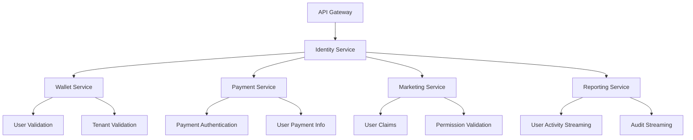

# 🗄️ **User & Identity Service - Optimized ER Diagram**

## 📊 **Entity Relationship Diagram**

Based on your existing **ASP.NET Core Identity + OpenID Connect + OpenIddict** implementation, this optimized ER diagram shows the User & Identity Service database schema with multi-tenant support.

## 🎯 **Optimized Architecture Based on Your Current Implementation**
Caption: Summary of core identity and OAuth components used in this service.

### **✅ ASP.NET Core Identity Integration**
Caption: Core ASP.NET Identity features and associated tables.

| Feature | Tables / Notes |
|--------|-----------------|
| Standard Identity Tables | `ASPNET_USERS`, `ASPNET_ROLES`, `ASPNET_USER_ROLES` |
| Claims-Based Authorization | `ASPNET_USER_CLAIMS`, `ASPNET_ROLE_CLAIMS` |
| External Login Providers | `ASPNET_USER_LOGINS` |
| Token Management | `ASPNET_USER_TOKENS` |
| Multi-Tenant Support | `tenant_id` in all Identity tables |

Context notes (our sportsbook):
- `ASPNET_USER_LOGINS`: maps a bettor or staff account to an external IdP (e.g., Google/Microsoft) when SSO is enabled for backoffice.
- `ASPNET_USER_TOKENS`: app-managed, per-user tokens for flows like password reset, phone/email confirmation, and 2FA; not OAuth access tokens.

### **✅ OpenIddict Integration**
Caption: OAuth 2.0 / OpenID Connect components and tables.

| Feature | Tables / Notes |
|--------|-----------------|
| OAuth 2.0 / OpenID Connect | `OPENIDDICT_APPLICATIONS`, `OPENIDDICT_TOKENS` |
| Authorization Management | `OPENIDDICT_AUTHORIZATIONS` |
| Scope Management | `OPENIDDICT_SCOPES` |
| Multi-Tenant OAuth | `tenant_id` in all OpenIddict tables |

Context notes (our sportsbook):
- `OPENIDDICT_APPLICATIONS`: registered client apps such as the Public Web, Mobile App, Backoffice, and Machine-to-Machine clients per tenant.
- `OPENIDDICT_TOKENS`: OAuth/OIDC tokens (access/refresh/device/code) issued to clients; used by API Gateway and microservices to authenticate requests.

## 📊 **Complete Table Organization & Structure**
Caption: High-level index of tables by domain area.

### **🏢 1. TENANT MANAGEMENT TABLES**
Caption: Tables governing tenant configuration and policies with hierarchical support.
| Table Name | Purpose | Key Fields |
|------------|---------|------------|
| `TENANTS` | Core tenant information with hierarchy | `id`, `tenant_code`, `tenant_name`, `parent_tenant_id`, `tenant_type` |
| `TENANT_SETTINGS` | Cross-cutting tenant settings | `tenant_id`, `setting_key`, `setting_value` |
| `TENANT_CONFIGURATIONS` | Cross-cutting config (non-domain-specific) | `tenant_id`, `config_key`, `config_value` |
| `TENANT_GENERAL_CONFIGURATIONS` | General tenant settings | `tenant_id`, `country_code`, `currency`, `language_code` |

### **👤 2. ASP.NET CORE IDENTITY TABLES**
Caption: Identity user, role, and related mapping tables.
| Table Name | Purpose | Key Fields |
|------------|---------|------------|
| `ASPNET_USERS` | User accounts with tenant support | `id`, `tenant_id`, `username`, `email`, `password_hash`, `user_type`, `agent_id` |
| `ASPNET_ROLES` | Role definitions per tenant | `id`, `tenant_id`, `name`, `description` |
| `ASPNET_USER_ROLES` | User-role assignments | `user_id`, `role_id`, `tenant_id` |
| `ASPNET_USER_CLAIMS` | User-specific permissions | `user_id`, `claim_type`, `claim_value`, `tenant_id` |
| `ASPNET_ROLE_CLAIMS` | Role-based permissions | `role_id`, `claim_type`, `claim_value`, `tenant_id` |
| `ASPNET_USER_LOGINS` | External login providers | `user_id`, `login_provider`, `provider_key`, `tenant_id` |
| `ASPNET_USER_TOKENS` | User authentication tokens | `user_id`, `login_provider`, `name`, `value`, `tenant_id` |

### **🏢 3. SALES BRANCH TABLES**
Caption: Sales branch management tables.
| Table Name | Purpose | Key Fields |
|------------|---------|------------|
| `SALES_BRANCHES` | Sales branch information | `id`, `branch_code`, `branch_name`, `manager_id`, `tenant_id` |

### **🔐 4. OAUTH 2.0 / OPENID CONNECT TABLES**
Caption: Summary list of OAuth-related tables.
| Table Name | Purpose | Key Fields |
|------------|---------|------------|
| `OPENIDDICT_APPLICATIONS` | OAuth client applications | `id`, `client_id`, `client_secret`, `tenant_id` |
| `OPENIDDICT_AUTHORIZATIONS` | OAuth authorizations | `id`, `application_id`, `subject`, `scopes`, `tenant_id` |
| `OPENIDDICT_SCOPES` | OAuth scopes/permissions | `id`, `name`, `description`, `tenant_id` |
| `OPENIDDICT_TOKENS` | OAuth access/refresh tokens | `id`, `application_id`, `subject`, `type`, `tenant_id` |

### **📋 4. AUDIT & LOGGING TABLES**
Caption: Summary list of auditing tables.
| Table Name | Purpose | Key Fields |
|------------|---------|------------|
| `AUDIT_LOGS` | Complete audit trail | `id`, `tenant_id`, `user_id`, `action`, `entity_type`, `old_values`, `new_values` |

## 📚 **Detailed Table Definitions**
Caption: Column-level specifications, defaults, relations, and brief remarks.

### 1) `TENANTS`
| No. | Column | Type | Default | Relation | Remarks |
|----|--------|------|---------|----------|---------|
| 1 | id | uuid | gen_random_uuid() | PK | Tenant ID |
| 2 | tenant_code | varchar | null | UK | Short unique code |
| 3 | tenant_name | varchar | null | - | Display name |
| 4 | description | text | null | - | Optional |
| 5 | is_active | boolean | true | - | Enable/disable tenant |
| 6 | parent_tenant_id | uuid | null | FK→TENANTS.id | Self-reference for tenant groups |
| 7 | tenant_type | varchar | 'main' | - | main/group/sub-tenant |
| 8 | rowVersion | integer | 1 | - | Concurrency token |
| 9 | created_at | timestamp | now() | - | - |
| 10 | updated_at | timestamp | now() | - | - |

### 2) `ASPNET_USERS`
| No. | Column | Type | Default | Relation | Remarks |
|----|--------|------|---------|----------|---------|
| 1 | id | varchar | uuid_generate_v7() | PK | Identity user ID |
| 2 | tenant_id | uuid | - | FK→TENANTS.id | Multi-tenant isolation |
| 3 | username | varchar | null | UK(tenant_id, normalized_username) | - |
| 4 | normalized_username | varchar | null | - | Upper-cased |
| 5 | email | varchar | null | - | - |
| 6 | normalized_email | varchar | null | - | Upper-cased |
| 7 | email_confirmed | boolean | false | - | - |
| 8 | password_hash | varchar | null | - | ASP.NET Core Identity |
| 9 | security_stamp | varchar | null | - | - |
| 10 | concurrency_stamp | varchar | null | - | - |
| 11 | phone_number | varchar | null | - | E.164 |
| 12 | phone_number_confirmed | boolean | false | - | - |
| 13 | two_factor_enabled | boolean | false | - | - |
| 14 | lockout_end | timestamp | null | - | - |
| 15 | lockout_enabled | boolean | true | - | - |
| 16 | access_failed_count | integer | 0 | - | - |
| 17 | friendly_name | varchar | null | - | - |
| 18 | job_title | varchar | null | - | - |
| 19 | full_name | varchar | null | - | - |
| 20 | configuration | varchar | null | - | JSON as string |
| 21 | is_enabled | boolean | true | - | Soft disable user |
| 22 | user_type | varchar | 'customer' | - | customer/agent/staff/admin |
| 23 | agent_id | varchar | null | FK→ASPNET_USERS.id | Self-reference for agent-member relationship |
| 24 | created_by | varchar | null | - | - |
| 25 | updated_by | varchar | null | - | - |
| 26 | created_date | timestamp | now() | - | - |
| 27 | updated_date | timestamp | now() | - | - |
| 28 | rowVersion | integer | 1 | - | Concurrency token |

### 3) `ASPNET_ROLES`
| No. | Column | Type | Default | Relation | Remarks |
|----|--------|------|---------|----------|---------|
| 1 | id | varchar | uuid_generate_v7() | PK | Role ID |
| 2 | tenant_id | uuid | - | FK→TENANTS.id | Tenant-scoped role |
| 3 | name | varchar | null | UK(tenant_id, normalized_name) | - |
| 4 | normalized_name | varchar | null | - | Upper-cased |
| 5 | concurrency_stamp | varchar | null | - | - |
| 6 | description | varchar | null | - | - |
| 7 | created_by | varchar | null | - | - |
| 8 | updated_by | varchar | null | - | - |
| 9 | created_date | timestamp | now() | - | - |
| 10 | updated_date | timestamp | now() | - | - |
| 11 | rowVersion | integer | 1 | - | Concurrency token |

### 4) `ASPNET_USER_ROLES`
| No. | Column | Type | Default | Relation | Remarks |
|----|--------|------|---------|----------|---------|
| 1 | user_id | varchar | - | FK→ASPNET_USERS.id | PK part |
| 2 | role_id | varchar | - | FK→ASPNET_ROLES.id | PK part |
| 3 | tenant_id | uuid | - | FK→TENANTS.id | Partition key |
| 4 | rowVersion | integer | 1 | - | Concurrency token |

### 5) `OPENIDDICT_APPLICATIONS`
| No. | Column | Type | Default | Relation | Remarks |
|----|--------|------|---------|----------|---------|
| 1 | id | varchar | uuid_generate_v7() | PK | Client record |
| 2 | client_id | varchar | null | UK | Public client ID |
| 3 | client_secret | varchar | null | - | Hashed if confidential |
| 4 | concurrency_stamp | varchar | null | - | - |
| 5 | consent_type | varchar | null | - | - |
| 6 | display_name | varchar | null | - | - |
| 7 | type | varchar | null | - | public/confidential |
| 8 | tenant_id | uuid | - | FK→TENANTS.id | Tenant-scoped client |
| 9 | rowVersion | integer | 1 | - | Concurrency token |

### 6) `OPENIDDICT_TOKENS`
| No. | Column | Type | Default | Relation | Remarks |
|----|--------|------|---------|----------|---------|
| 1 | id | varchar | uuid_generate_v7() | PK | Token record |
| 2 | application_id | varchar | - | FK→OPENIDDICT_APPLICATIONS.id | - |
| 3 | authorization_id | varchar | null | FK→OPENIDDICT_AUTHORIZATIONS.id | - |
| 4 | creation_date | timestamp | now() | - | - |
| 5 | expiration_date | timestamp | null | - | - |
| 6 | payload | varchar | null | - | Compact token data |
| 7 | properties | varchar | null | - | - |
| 8 | redemption_date | timestamp | null | - | - |
| 9 | reference_id | varchar | null | UK (optional) | Reference tokens |
| 10 | scopes | varchar | null | - | Space-separated |
| 11 | status | varchar | null | - | valid/revoked |
| 12 | subject | varchar | - | FK→ASPNET_USERS.id | Token owner |
| 13 | type | varchar | - | - | access/refresh/etc |
| 14 | tenant_id | uuid | - | FK→TENANTS.id | Tenant partition |
| 15 | rowVersion | integer | 1 | - | Concurrency token |

### 7) `TENANT_SETTINGS`
| No. | Column | Type | Default | Relation | Remarks |
|----|--------|------|---------|----------|---------|
| 1 | id | uuid | gen_random_uuid() | PK | - |
| 2 | tenant_id | uuid | - | FK→TENANTS.id | - |
| 3 | setting_key | varchar | - | UK(tenant_id, setting_key) | - |
| 4 | setting_value | text | null | - | Can be JSON |
| 5 | setting_type | varchar | 'string' | - | string/int/bool/json |
| 6 | description | text | null | - | - |
| 7 | is_encrypted | boolean | false | - | Secrets |
| 8 | rowVersion | integer | 1 | - | Concurrency token |
| 9 | created_at | timestamp | now() | - | - |
| 10 | updated_at | timestamp | now() | - | - |

### 8) `AUDIT_LOGS`
| No. | Column | Type | Default | Relation | Remarks |
|----|--------|------|---------|----------|---------|
| 1 | id | uuid | gen_random_uuid() | PK | - |
| 2 | tenant_id | uuid | - | FK→TENANTS.id | - |
| 3 | user_id | varchar | null | FK→ASPNET_USERS.id | Actor if any |
| 4 | action | varchar | - | - | e.g., CreateUser |
| 5 | entity_type | varchar | - | - | e.g., ASPNET_USERS |
| 6 | entity_id | varchar | null | - | Target entity key |
| 7 | old_values | jsonb | '{}' | - | Before state |
| 8 | new_values | jsonb | '{}' | - | After state |
| 9 | ip_address | inet | null | - | - |
| 10 | user_agent | text | null | - | - |
| 11 | request_id | varchar | null | - | Correlation ID |
| 12 | rowVersion | integer | 1 | - | Concurrency token |
| 13 | created_at | timestamp | now() | - | - |

### 9) `ASPNET_USER_CLAIMS`
Caption: User-specific claims
Description: Stores per-user claims for fine-grained authorization.
Purpose: Attach permissions or attributes directly to users.
| No. | Column | Type | Default | Relation | Remarks |
|----|--------|------|---------|----------|---------|
| 1 | id | int | identity | PK | - |
| 2 | user_id | varchar | - | FK→ASPNET_USERS.id | - |
| 3 | claim_type | varchar | - | - | e.g., permission |
| 4 | claim_value | varchar | - | - | e.g., Bet.Place |
| 5 | tenant_id | uuid | - | FK→TENANTS.id | Partition |
| 6 | rowVersion | integer | 1 | - | Concurrency token |

### 10) `ASPNET_ROLE_CLAIMS`
Caption: Role-based claims
Description: Claims granted to roles and inherited by members.
Purpose: Centralize permission sets per role.
| No. | Column | Type | Default | Relation | Remarks |
|----|--------|------|---------|----------|---------|
| 1 | id | int | identity | PK | - |
| 2 | role_id | varchar | - | FK→ASPNET_ROLES.id | - |
| 3 | claim_type | varchar | - | - | - |
| 4 | claim_value | varchar | - | - | - |
| 5 | tenant_id | uuid | - | FK→TENANTS.id | Partition |
| 6 | rowVersion | integer | 1 | - | Concurrency token |

### 11) `ASPNET_USER_LOGINS`
Caption: External login providers
Description: Links users to external identity providers.
Purpose: Support social logins and federated auth.
| No. | Column | Type | Default | Relation | Remarks |
|----|--------|------|---------|----------|---------|
| 1 | login_provider | varchar | - | PK part | e.g., google |
| 2 | provider_key | varchar | - | PK part | External user key |
| 3 | provider_display_name | varchar | null | - | - |
| 4 | user_id | varchar | - | FK→ASPNET_USERS.id | - |
| 5 | tenant_id | uuid | - | FK→TENANTS.id | Partition |
| 6 | rowVersion | integer | 1 | - | Concurrency token |

### 12) `ASPNET_USER_TOKENS`
Caption: User tokens
Description: Stores ancillary tokens (e.g., reset, 2FA) for users.
Purpose: Manage user-related token state.
| No. | Column | Type | Default | Relation | Remarks |
|----|--------|------|---------|----------|---------|
| 1 | user_id | varchar | - | PK part, FK→ASPNET_USERS.id | - |
| 2 | login_provider | varchar | - | PK part | - |
| 3 | name | varchar | - | PK part | e.g., ResetPassword |
| 4 | value | varchar | null | - | Token value/metadata |
| 5 | tenant_id | uuid | - | FK→TENANTS.id | Partition |
| 6 | rowVersion | integer | 1 | - | Concurrency token |

### 13) `OPENIDDICT_AUTHORIZATIONS`
Caption: OAuth authorizations
Description: User consent and authorization state for clients.
Purpose: Track grants and sessions per client/user.
| No. | Column | Type | Default | Relation | Remarks |
|----|--------|------|---------|----------|---------|
| 1 | id | varchar | uuid_generate_v7() | PK | - |
| 2 | application_id | varchar | - | FK→OPENIDDICT_APPLICATIONS.id | - |
| 3 | concurrency_stamp | varchar | null | - | - |
| 4 | scopes | varchar | null | - | Space-separated |
| 5 | status | varchar | null | - | active/revoked |
| 6 | subject | varchar | - | FK→ASPNET_USERS.id | - |
| 7 | type | varchar | - | - | permanent/ad-hoc |
| 8 | tenant_id | uuid | - | FK→TENANTS.id | Partition |
| 9 | rowVersion | integer | 1 | - | Concurrency token |

### 14) `OPENIDDICT_SCOPES`
Caption: OAuth scopes
Description: Named permissions exposed by the auth server.
Purpose: Define reusable permissions for clients.
| No. | Column | Type | Default | Relation | Remarks |
|----|--------|------|---------|----------|---------|
| 1 | id | varchar | uuid_generate_v7() | PK | - |
| 2 | name | varchar | - | UK | Scope name |
| 3 | description | varchar | null | - | - |
| 4 | descriptions | varchar | null | - | Localized JSON |
| 5 | display_name | varchar | null | - | - |
| 6 | display_names | varchar | null | - | Localized JSON |
| 7 | properties | varchar | null | - | JSON |
| 8 | resources | varchar | null | - | APIs covered |
| 9 | tenant_id | uuid | - | FK→TENANTS.id | Partition |
| 10 | rowVersion | integer | 1 | - | Concurrency token |

### 15) `TENANT_CONFIGURATIONS`
Caption: Advanced tenant configurations
Description: Arbitrary key/value tenant configs.
Purpose: Feature flags and custom settings per tenant.
| No. | Column | Type | Default | Relation | Remarks |
|----|--------|------|---------|----------|---------|
| 1 | id | uuid | gen_random_uuid() | PK | - |
| 2 | tenant_id | uuid | - | FK→TENANTS.id | - |
| 3 | config_key | varchar | - | UK(tenant_id, config_key) | - |
| 4 | config_value | text | null | - | Can be JSON |
| 5 | config_type | varchar | 'string' | - | string/int/bool/json |
| 6 | is_encrypted | boolean | false | - | Secrets |
| 7 | rowVersion | integer | 1 | - | Concurrency token |
| 8 | created_at | timestamp | now() | - | - |
| 9 | updated_at | timestamp | now() | - | - |

### 16) `TENANT_GENERAL_CONFIGURATIONS`
Caption: General tenant settings
Description: Country, currency, language, and general flags.
Purpose: Localize and govern tenant-wide behavior.
| No. | Column | Type | Default | Relation | Remarks |
|----|--------|------|---------|----------|---------|
| 1 | id | uuid | gen_random_uuid() | PK | - |
| 2 | tenant_id | uuid | - | FK→TENANTS.id | - |
| 3 | country_code | varchar | null | - | ISO-3166 |
| 4 | currency | varchar | null | - | ISO-4217 |
| 5 | language_code | varchar | null | - | BCP-47 |
| 6 | country | varchar | null | - | - |
| 7 | domain_name | varchar | null | - | - |
| 8 | contact_number | varchar | null | - | - |
| 9 | online_bet_support | boolean | true | - | - |
| 10 | offline_bet_support | boolean | true | - | - |
| 11 | offline_payout_enabled | boolean | false | - | - |
| 12 | language_supported | boolean | true | - | - |
| 13 | underage_limit | varchar | null | - | e.g., 18 |
| 14 | registration_flow | varchar | null | - | simple/advanced |
| 15 | rowVersion | integer | 1 | - | Concurrency token |
| 16 | created_at | timestamp | now() | - | - |
| 17 | updated_at | timestamp | now() | - | - |

### 17) `SALES_BRANCHES`
Caption: Sales branch information
Description: Manages sales branch details and configurations.
Purpose: Track sales branches and their associated agents.
| No. | Column | Type | Default | Relation | Remarks |
|----|--------|------|---------|----------|---------|
| 1 | id | uuid | gen_random_uuid() | PK | - |
| 2 | branch_code | varchar | - | UK | Unique branch identifier |
| 3 | branch_name | varchar | - | - | Branch display name |
| 4 | tenant_id | uuid | - | FK→TENANTS.id | Multi-tenant isolation |
| 5 | manager_id | varchar | null | FK→ASPNET_USERS.id | Branch manager |
| 6 | address | text | null | - | Branch address |
| 7 | phone | varchar | null | - | Branch phone |
| 8 | email | varchar | null | - | Branch email |
| 9 | is_active | boolean | true | - | Active branch |
| 10 | created_by | varchar | null | FK→ASPNET_USERS.id | - |
| 11 | updated_by | varchar | null | FK→ASPNET_USERS.id | - |
| 12 | created_date | timestamp | now() | - | - |
| 13 | updated_date | timestamp | now() | - | - |
| 14 | rowVersion | integer | 1 | - | Concurrency token |

## 🎯 **Table Relationships Summary**
Caption: High-level relationships among core entities.

### **🔗 Core Relationships:**
- **TENANTS** → Parent of all other tables (1:Many)
- **TENANTS** → **TENANTS** (1:Many) - Self-reference: parent_tenant_id
- **TENANTS** → **TENANTS** (Many:1) - Self-reference: parent_tenant_id
- **ASPNET_USERS** → Core user entity with tenant isolation
- **All tables** → Include `tenant_id` for multi-tenant isolation

### **🔗 Identity Relationships:**
- **ASPNET_USERS** ↔ **ASPNET_ROLES** (Many:Many via ASPNET_USER_ROLES)
- **ASPNET_USERS** → **ASPNET_USER_CLAIMS** (1:Many)
- **ASPNET_ROLES** → **ASPNET_ROLE_CLAIMS** (1:Many)

### **🔗 Agent Self-Reference Relationships:**
- **ASPNET_USERS** → **ASPNET_USERS** (1:Many) - Self-reference: agent_id
- **ASPNET_USERS** → **ASPNET_USERS** (Many:1) - Self-reference: agent_id

### **🔗 Sales Branch Relationships:**
- **ASPNET_USERS** → **SALES_BRANCHES** (1:Many) - FK: manager_id
- **SALES_BRANCHES** → **ASPNET_USERS** (Many:1) - FK: manager_id

### **🔗 OAuth Relationships:**
- **OPENIDDICT_APPLICATIONS** → **OPENIDDICT_AUTHORIZATIONS** (1:Many)
- **OPENIDDICT_APPLICATIONS** → **OPENIDDICT_TOKENS** (1:Many)
- **OPENIDDICT_AUTHORIZATIONS** → **OPENIDDICT_TOKENS** (1:Many)

### **🔗 Tenant Relationships:**
- **TENANTS** → **TENANT_SETTINGS** (1:Many)
- **TENANTS** → **TENANT_CONFIGURATIONS** (1:Many)
- **TENANTS** → **TENANT_GENERAL_CONFIGURATIONS** (1:Many)

---

## 🚀 **gRPC Service Definition - Implementation Ready**

### **📋 Service: IdentityService**

```protobuf
syntax = "proto3";

package convex.identity.v1;

import "google/protobuf/timestamp.proto";
import "google/protobuf/empty.proto";

option csharp_namespace = "Convex.Identity.V1";

// ============================================================================
// CORE IDENTITY OPERATIONS
// ============================================================================

service IdentityService {
  // ============================================================================
  // USER MANAGEMENT
  // ============================================================================
  
  // Create new user
  rpc CreateUser(CreateUserRequest) returns (CreateUserResponse);
  
  // Get user by ID
  rpc GetUser(GetUserRequest) returns (GetUserResponse);
  
  // Get users by tenant
  rpc GetUsers(GetUsersRequest) returns (GetUsersResponse);
  
  // Update user
  rpc UpdateUser(UpdateUserRequest) returns (UpdateUserResponse);
  
  // Delete user (soft delete)
  rpc DeleteUser(DeleteUserRequest) returns (DeleteUserResponse);
  
  // Search users
  rpc SearchUsers(SearchUsersRequest) returns (SearchUsersResponse);

  // ============================================================================
  // AUTHENTICATION & AUTHORIZATION
  // ============================================================================
  
  // Authenticate user
  rpc AuthenticateUser(AuthenticateUserRequest) returns (AuthenticateUserResponse);
  
  // Validate token
  rpc ValidateToken(ValidateTokenRequest) returns (ValidateTokenResponse);
  
  // Refresh token
  rpc RefreshToken(RefreshTokenRequest) returns (RefreshTokenResponse);
  
  // Logout user
  rpc LogoutUser(LogoutUserRequest) returns (LogoutUserResponse);
  
  // Validate user permissions
  rpc ValidatePermissions(ValidatePermissionsRequest) returns (ValidatePermissionsResponse);

  // ============================================================================
  // ROLE MANAGEMENT
  // ============================================================================
  
  // Create role
  rpc CreateRole(CreateRoleRequest) returns (CreateRoleResponse);
  
  // Get role
  rpc GetRole(GetRoleRequest) returns (GetRoleResponse);
  
  // Get roles by tenant
  rpc GetRoles(GetRolesRequest) returns (GetRolesResponse);
  
  // Update role
  rpc UpdateRole(UpdateRoleRequest) returns (UpdateRoleResponse);
  
  // Delete role
  rpc DeleteRole(DeleteRoleRequest) returns (DeleteRoleResponse);
  
  // Assign role to user
  rpc AssignRoleToUser(AssignRoleToUserRequest) returns (AssignRoleToUserResponse);
  
  // Remove role from user
  rpc RemoveRoleFromUser(RemoveRoleFromUserRequest) returns (RemoveRoleFromUserResponse);

  // ============================================================================
  // TENANT MANAGEMENT
  // ============================================================================
  
  // Create tenant
  rpc CreateTenant(CreateTenantRequest) returns (CreateTenantResponse);
  
  // Get tenant
  rpc GetTenant(GetTenantRequest) returns (GetTenantResponse);
  
  // Get tenants
  rpc GetTenants(GetTenantsRequest) returns (GetTenantsResponse);
  
  // Update tenant
  rpc UpdateTenant(UpdateTenantRequest) returns (UpdateTenantResponse);
  
  // Delete tenant
  rpc DeleteTenant(DeleteTenantRequest) returns (DeleteTenantResponse);

  // ============================================================================
  // SALES BRANCH MANAGEMENT
  // ============================================================================
  
  // Create sales branch
  rpc CreateSalesBranch(CreateSalesBranchRequest) returns (CreateSalesBranchResponse);
  
  // Get sales branch
  rpc GetSalesBranch(GetSalesBranchRequest) returns (GetSalesBranchResponse);
  
  // Get sales branches
  rpc GetSalesBranches(GetSalesBranchesRequest) returns (GetSalesBranchesResponse);
  
  // Update sales branch
  rpc UpdateSalesBranch(UpdateSalesBranchRequest) returns (UpdateSalesBranchResponse);
  
  // Delete sales branch
  rpc DeleteSalesBranch(DeleteSalesBranchRequest) returns (DeleteSalesBranchResponse);

  // ============================================================================
  // OAUTH & OPENID CONNECT
  // ============================================================================
  
  // Create OAuth application
  rpc CreateOAuthApplication(CreateOAuthApplicationRequest) returns (CreateOAuthApplicationResponse);
  
  // Get OAuth application
  rpc GetOAuthApplication(GetOAuthApplicationRequest) returns (GetOAuthApplicationResponse);
  
  // Get OAuth applications
  rpc GetOAuthApplications(GetOAuthApplicationsRequest) returns (GetOAuthApplicationsResponse);
  
  // Update OAuth application
  rpc UpdateOAuthApplication(UpdateOAuthApplicationRequest) returns (UpdateOAuthApplicationResponse);
  
  // Delete OAuth application
  rpc DeleteOAuthApplication(DeleteOAuthApplicationRequest) returns (DeleteOAuthApplicationResponse);

  // ============================================================================
  // AUDIT & SECURITY
  // ============================================================================
  
  // Get audit logs
  rpc GetAuditLogs(GetAuditLogsRequest) returns (GetAuditLogsResponse);
  
  // Log security event
  rpc LogSecurityEvent(LogSecurityEventRequest) returns (LogSecurityEventResponse);

  // ============================================================================
  // HEALTH & MONITORING
  // ============================================================================
  
  // Health check
  rpc HealthCheck(google.protobuf.Empty) returns (HealthCheckResponse);
  
  // Get service metrics
  rpc GetMetrics(google.protobuf.Empty) returns (GetMetricsResponse);

  // ============================================================================
  // PASSWORD MANAGEMENT
  // ============================================================================
  
  // Change password
  rpc ChangePassword(ChangePasswordRequest) returns (ChangePasswordResponse);
  
  // Reset password
  rpc ResetPassword(ResetPasswordRequest) returns (ResetPasswordResponse);
  
  // Validate password strength
  rpc ValidatePasswordStrength(ValidatePasswordStrengthRequest) returns (ValidatePasswordStrengthResponse);

  // ============================================================================
  // USER SESSION MANAGEMENT
  // ============================================================================
  
  // Get user sessions
  rpc GetUserSessions(GetUserSessionsRequest) returns (GetUserSessionsResponse);
  
  // Terminate user session
  rpc TerminateSession(TerminateSessionRequest) returns (TerminateSessionResponse);
  
  // Terminate all user sessions
  rpc TerminateAllUserSessions(TerminateAllUserSessionsRequest) returns (TerminateAllUserSessionsResponse);

  // ============================================================================
  // BULK OPERATIONS
  // ============================================================================
  
  // Bulk create users
  rpc BulkCreateUsers(BulkCreateUsersRequest) returns (BulkCreateUsersResponse);
  
  // Bulk update users
  rpc BulkUpdateUsers(BulkUpdateUsersRequest) returns (BulkUpdateUsersResponse);
  
  // Bulk assign roles
  rpc BulkAssignRoles(BulkAssignRolesRequest) returns (BulkAssignRolesResponse);

  // ============================================================================
  // TWO-FACTOR AUTHENTICATION (2FA)
  // ============================================================================
  
  // Enable 2FA for user
  rpc EnableTwoFactor(EnableTwoFactorRequest) returns (EnableTwoFactorResponse);
  
  // Disable 2FA for user
  rpc DisableTwoFactor(DisableTwoFactorRequest) returns (DisableTwoFactorResponse);
  
  // Verify 2FA code
  rpc VerifyTwoFactorCode(VerifyTwoFactorCodeRequest) returns (VerifyTwoFactorCodeResponse);
  
  // Generate 2FA backup codes
  rpc GenerateTwoFactorBackupCodes(GenerateTwoFactorBackupCodesRequest) returns (GenerateTwoFactorBackupCodesResponse);

  // ============================================================================
  // EMAIL & PHONE VERIFICATION
  // ============================================================================
  
  // Send email verification
  rpc SendEmailVerification(SendEmailVerificationRequest) returns (SendEmailVerificationResponse);
  
  // Verify email
  rpc VerifyEmail(VerifyEmailRequest) returns (VerifyEmailResponse);
  
  // Send phone verification
  rpc SendPhoneVerification(SendPhoneVerificationRequest) returns (SendPhoneVerificationResponse);
  
  // Verify phone
  rpc VerifyPhone(VerifyPhoneRequest) returns (VerifyPhoneResponse);

  // ============================================================================
  // USER PREFERENCES & SETTINGS
  // ============================================================================
  
  // Get user preferences
  rpc GetUserPreferences(GetUserPreferencesRequest) returns (GetUserPreferencesResponse);
  
  // Update user preferences
  rpc UpdateUserPreferences(UpdateUserPreferencesRequest) returns (UpdateUserPreferencesResponse);
  
  // Get user settings
  rpc GetUserSettings(GetUserSettingsRequest) returns (GetUserSettingsResponse);
  
  // Update user settings
  rpc UpdateUserSettings(UpdateUserSettingsRequest) returns (UpdateUserSettingsResponse);

  // ============================================================================
  // NOTIFICATION PREFERENCES
  // ============================================================================
  
  // Get notification preferences
  rpc GetNotificationPreferences(GetNotificationPreferencesRequest) returns (GetNotificationPreferencesResponse);
  
  // Update notification preferences
  rpc UpdateNotificationPreferences(UpdateNotificationPreferencesRequest) returns (UpdateNotificationPreferencesResponse);

  // ============================================================================
  // DATA EXPORT & PRIVACY
  // ============================================================================
  
  // Export user data
  rpc ExportUserData(ExportUserDataRequest) returns (ExportUserDataResponse);
  
  // Delete user data (GDPR compliance)
  rpc DeleteUserData(DeleteUserDataRequest) returns (DeleteUserDataResponse);
  
  // Get data processing consent
  rpc GetDataProcessingConsent(GetDataProcessingConsentRequest) returns (GetDataProcessingConsentResponse);
  
  // Update data processing consent
  rpc UpdateDataProcessingConsent(UpdateDataProcessingConsentRequest) returns (UpdateDataProcessingConsentResponse);
}

// ============================================================================
// REQUEST/RESPONSE MESSAGES
// ============================================================================

// User Management
message CreateUserRequest {
  string tenant_id = 1;
  string username = 2;
  string email = 3;
  string password = 4;
  string full_name = 5;
  string friendly_name = 6;
  string phone_number = 7;
  string user_type = 8; // customer/agent/staff/admin
  string agent_id = 9; // For agent-member relationship
  string job_title = 10;
  string configuration = 11; // JSON
}

message CreateUserResponse {
  bool success = 1;
  string user_id = 2;
  string message = 3;
}

message GetUserRequest {
  string tenant_id = 1;
  string user_id = 2;
}

message GetUserResponse {
  User user = 1;
}

message GetUsersRequest {
  string tenant_id = 1;
  string user_type = 2; // Optional filter
  int32 page_size = 3;
  int32 page_number = 4;
}

message GetUsersResponse {
  repeated User users = 1;
  int32 total_count = 2;
  int32 page_number = 3;
  int32 page_size = 4;
}

message UpdateUserRequest {
  string tenant_id = 1;
  string user_id = 2;
  string full_name = 3;
  string friendly_name = 4;
  string phone_number = 5;
  string job_title = 6;
  string configuration = 7; // JSON
  bool is_enabled = 8;
}

message UpdateUserResponse {
  bool success = 1;
  string message = 2;
}

message DeleteUserRequest {
  string tenant_id = 1;
  string user_id = 2;
}

message DeleteUserResponse {
  bool success = 1;
  string message = 2;
}

message SearchUsersRequest {
  string tenant_id = 1;
  string search_term = 2;
  string user_type = 3;
  int32 page_size = 4;
  int32 page_number = 5;
}

message SearchUsersResponse {
  repeated User users = 1;
  int32 total_count = 2;
  int32 page_number = 3;
  int32 page_size = 4;
}

// Authentication & Authorization
message AuthenticateUserRequest {
  string tenant_id = 1;
  string username = 2;
  string password = 3;
  string client_id = 4;
  string scope = 5;
}

message AuthenticateUserResponse {
  bool success = 1;
  string access_token = 2;
  string refresh_token = 3;
  string token_type = 4;
  int32 expires_in = 5;
  string message = 6;
}

message ValidateTokenRequest {
  string token = 1;
  string client_id = 2;
}

message ValidateTokenResponse {
  bool is_valid = 1;
  string user_id = 2;
  string tenant_id = 3;
  repeated string scopes = 4;
  string message = 5;
}

message RefreshTokenRequest {
  string refresh_token = 1;
  string client_id = 2;
}

message RefreshTokenResponse {
  bool success = 1;
  string access_token = 2;
  string refresh_token = 3;
  string token_type = 4;
  int32 expires_in = 5;
  string message = 6;
}

message LogoutUserRequest {
  string user_id = 1;
  string token = 2;
}

message LogoutUserResponse {
  bool success = 1;
  string message = 2;
}

message ValidatePermissionsRequest {
  string user_id = 1;
  string tenant_id = 2;
  repeated string required_permissions = 3;
}

message ValidatePermissionsResponse {
  bool has_permission = 1;
  repeated string missing_permissions = 2;
  string message = 3;
}

// Role Management
message CreateRoleRequest {
  string tenant_id = 1;
  string name = 2;
  string description = 3;
}

message CreateRoleResponse {
  bool success = 1;
  string role_id = 2;
  string message = 3;
}

message GetRoleRequest {
  string tenant_id = 1;
  string role_id = 2;
}

message GetRoleResponse {
  Role role = 1;
}

message GetRolesRequest {
  string tenant_id = 1;
  int32 page_size = 2;
  int32 page_number = 3;
}

message GetRolesResponse {
  repeated Role roles = 1;
  int32 total_count = 2;
  int32 page_number = 3;
  int32 page_size = 4;
}

message UpdateRoleRequest {
  string tenant_id = 1;
  string role_id = 2;
  string name = 3;
  string description = 4;
}

message UpdateRoleResponse {
  bool success = 1;
  string message = 2;
}

message DeleteRoleRequest {
  string tenant_id = 1;
  string role_id = 2;
}

message DeleteRoleResponse {
  bool success = 1;
  string message = 2;
}

message AssignRoleToUserRequest {
  string tenant_id = 1;
  string user_id = 2;
  string role_id = 3;
}

message AssignRoleToUserResponse {
  bool success = 1;
  string message = 2;
}

message RemoveRoleFromUserRequest {
  string tenant_id = 1;
  string user_id = 2;
  string role_id = 3;
}

message RemoveRoleFromUserResponse {
  bool success = 1;
  string message = 2;
}

// Tenant Management
message CreateTenantRequest {
  string tenant_code = 1;
  string tenant_name = 2;
  string description = 3;
  string parent_tenant_id = 4;
  string tenant_type = 5; // main/group/sub-tenant
}

message CreateTenantResponse {
  bool success = 1;
  string tenant_id = 2;
  string message = 3;
}

message GetTenantRequest {
  string tenant_id = 1;
}

message GetTenantResponse {
  Tenant tenant = 1;
}

message GetTenantsRequest {
  string parent_tenant_id = 1; // Optional filter
  int32 page_size = 2;
  int32 page_number = 3;
}

message GetTenantsResponse {
  repeated Tenant tenants = 1;
  int32 total_count = 2;
  int32 page_number = 3;
  int32 page_size = 4;
}

message UpdateTenantRequest {
  string tenant_id = 1;
  string tenant_name = 2;
  string description = 3;
  bool is_active = 4;
}

message UpdateTenantResponse {
  bool success = 1;
  string message = 2;
}

message DeleteTenantRequest {
  string tenant_id = 1;
}

message DeleteTenantResponse {
  bool success = 1;
  string message = 2;
}

// Sales Branch Management
message CreateSalesBranchRequest {
  string tenant_id = 1;
  string branch_code = 2;
  string branch_name = 3;
  string manager_id = 4;
  string address = 5;
  string phone = 6;
  string email = 7;
}

message CreateSalesBranchResponse {
  bool success = 1;
  string branch_id = 2;
  string message = 3;
}

message GetSalesBranchRequest {
  string tenant_id = 1;
  string branch_id = 2;
}

message GetSalesBranchResponse {
  SalesBranch branch = 1;
}

message GetSalesBranchesRequest {
  string tenant_id = 1;
  int32 page_size = 2;
  int32 page_number = 3;
}

message GetSalesBranchesResponse {
  repeated SalesBranch branches = 1;
  int32 total_count = 2;
  int32 page_number = 3;
  int32 page_size = 4;
}

message UpdateSalesBranchRequest {
  string tenant_id = 1;
  string branch_id = 2;
  string branch_name = 3;
  string manager_id = 4;
  string address = 5;
  string phone = 6;
  string email = 7;
  bool is_active = 8;
}

message UpdateSalesBranchResponse {
  bool success = 1;
  string message = 2;
}

message DeleteSalesBranchRequest {
  string tenant_id = 1;
  string branch_id = 2;
}

message DeleteSalesBranchResponse {
  bool success = 1;
  string message = 2;
}

// OAuth & OpenID Connect
message CreateOAuthApplicationRequest {
  string tenant_id = 1;
  string client_id = 2;
  string client_secret = 3;
  string display_name = 4;
  string type = 5; // public/confidential
  string consent_type = 6;
}

message CreateOAuthApplicationResponse {
  bool success = 1;
  string application_id = 2;
  string message = 3;
}

message GetOAuthApplicationRequest {
  string tenant_id = 1;
  string application_id = 2;
}

message GetOAuthApplicationResponse {
  OAuthApplication application = 1;
}

message GetOAuthApplicationsRequest {
  string tenant_id = 1;
  int32 page_size = 2;
  int32 page_number = 3;
}

message GetOAuthApplicationsResponse {
  repeated OAuthApplication applications = 1;
  int32 total_count = 2;
  int32 page_number = 3;
  int32 page_size = 4;
}

message UpdateOAuthApplicationRequest {
  string tenant_id = 1;
  string application_id = 2;
  string display_name = 3;
  string client_secret = 4;
  string consent_type = 5;
}

message UpdateOAuthApplicationResponse {
  bool success = 1;
  string message = 2;
}

message DeleteOAuthApplicationRequest {
  string tenant_id = 1;
  string application_id = 2;
}

message DeleteOAuthApplicationResponse {
  bool success = 1;
  string message = 2;
}

// Audit & Security
message GetAuditLogsRequest {
  string tenant_id = 1;
  string user_id = 2;
  string entity_type = 3;
  string entity_id = 4;
  google.protobuf.Timestamp start_date = 5;
  google.protobuf.Timestamp end_date = 6;
  int32 page_size = 7;
  int32 page_number = 8;
}

message GetAuditLogsResponse {
  repeated AuditLog audit_logs = 1;
  int32 total_count = 2;
  int32 page_number = 3;
  int32 page_size = 4;
}

message LogSecurityEventRequest {
  string tenant_id = 1;
  string user_id = 2;
  string action = 3;
  string entity_type = 4;
  string entity_id = 5;
  string ip_address = 6;
  string user_agent = 7;
  string description = 8;
}

message LogSecurityEventResponse {
  bool success = 1;
  string audit_log_id = 2;
  string message = 3;
}

// Health & Monitoring
message HealthCheckResponse {
  string status = 1;
  string message = 2;
  google.protobuf.Timestamp timestamp = 3;
}

message GetMetricsResponse {
  string service_name = 1;
  string version = 2;
  int64 total_users = 3;
  int64 total_tenants = 4;
  int64 total_roles = 5;
  string uptime = 6;
  google.protobuf.Timestamp timestamp = 7;
}

// Password Management
message ChangePasswordRequest {
  string tenant_id = 1;
  string user_id = 2;
  string current_password = 3;
  string new_password = 4;
}

message ChangePasswordResponse {
  bool success = 1;
  string message = 2;
}

message ResetPasswordRequest {
  string tenant_id = 1;
  string user_id = 2;
  string new_password = 3;
  string reset_token = 4; // Optional for secure reset
}

message ResetPasswordResponse {
  bool success = 1;
  string message = 2;
}

message ValidatePasswordStrengthRequest {
  string password = 1;
}

message ValidatePasswordStrengthResponse {
  bool is_valid = 1;
  int32 strength_score = 2; // 1-10
  repeated string validation_errors = 3;
}

// User Session Management
message GetUserSessionsRequest {
  string tenant_id = 1;
  string user_id = 2;
}

message GetUserSessionsResponse {
  repeated UserSession sessions = 1;
}

message TerminateSessionRequest {
  string tenant_id = 1;
  string user_id = 2;
  string session_id = 3;
}

message TerminateSessionResponse {
  bool success = 1;
  string message = 2;
}

message TerminateAllUserSessionsRequest {
  string tenant_id = 1;
  string user_id = 2;
}

message TerminateAllUserSessionsResponse {
  bool success = 1;
  int32 terminated_sessions = 2;
  string message = 3;
}

// Bulk Operations
message BulkCreateUsersRequest {
  string tenant_id = 1;
  repeated CreateUserRequest users = 2;
}

message BulkCreateUsersResponse {
  bool success = 1;
  repeated string user_ids = 2;
  repeated string errors = 3;
  int32 success_count = 4;
  int32 error_count = 5;
}

message BulkUpdateUsersRequest {
  string tenant_id = 1;
  repeated UpdateUserRequest users = 2;
}

message BulkUpdateUsersResponse {
  bool success = 1;
  repeated string updated_user_ids = 2;
  repeated string errors = 3;
  int32 success_count = 4;
  int32 error_count = 5;
}

message BulkAssignRolesRequest {
  string tenant_id = 1;
  repeated string user_ids = 2;
  repeated string role_ids = 3;
}

message BulkAssignRolesResponse {
  bool success = 1;
  repeated string assigned_user_ids = 2;
  repeated string errors = 3;
  int32 success_count = 4;
  int32 error_count = 5;
}

// Two-Factor Authentication (2FA)
message EnableTwoFactorRequest {
  string tenant_id = 1;
  string user_id = 2;
}

message EnableTwoFactorResponse {
  bool success = 1;
  string qr_code_url = 2;
  string manual_entry_key = 3;
  string message = 4;
}

message DisableTwoFactorRequest {
  string tenant_id = 1;
  string user_id = 2;
  string verification_code = 3;
}

message DisableTwoFactorResponse {
  bool success = 1;
  string message = 2;
}

message VerifyTwoFactorCodeRequest {
  string tenant_id = 1;
  string user_id = 2;
  string verification_code = 3;
}

message VerifyTwoFactorCodeResponse {
  bool success = 1;
  string message = 2;
}

message GenerateTwoFactorBackupCodesRequest {
  string tenant_id = 1;
  string user_id = 2;
}

message GenerateTwoFactorBackupCodesResponse {
  bool success = 1;
  repeated string backup_codes = 2;
  string message = 3;
}

// Email & Phone Verification
message SendEmailVerificationRequest {
  string tenant_id = 1;
  string user_id = 2;
  string email = 3;
}

message SendEmailVerificationResponse {
  bool success = 1;
  string message = 2;
}

message VerifyEmailRequest {
  string tenant_id = 1;
  string user_id = 2;
  string verification_token = 3;
}

message VerifyEmailResponse {
  bool success = 1;
  string message = 2;
}

message SendPhoneVerificationRequest {
  string tenant_id = 1;
  string user_id = 2;
  string phone_number = 3;
}

message SendPhoneVerificationResponse {
  bool success = 1;
  string message = 2;
}

message VerifyPhoneRequest {
  string tenant_id = 1;
  string user_id = 2;
  string verification_code = 3;
}

message VerifyPhoneResponse {
  bool success = 1;
  string message = 2;
}

// User Preferences & Settings
message GetUserPreferencesRequest {
  string tenant_id = 1;
  string user_id = 2;
}

message GetUserPreferencesResponse {
  UserPreferences preferences = 1;
}

message UpdateUserPreferencesRequest {
  string tenant_id = 1;
  string user_id = 2;
  UserPreferences preferences = 3;
}

message UpdateUserPreferencesResponse {
  bool success = 1;
  string message = 2;
}

message GetUserSettingsRequest {
  string tenant_id = 1;
  string user_id = 2;
}

message GetUserSettingsResponse {
  UserSettings settings = 1;
}

message UpdateUserSettingsRequest {
  string tenant_id = 1;
  string user_id = 2;
  UserSettings settings = 3;
}

message UpdateUserSettingsResponse {
  bool success = 1;
  string message = 2;
}

// Notification Preferences
message GetNotificationPreferencesRequest {
  string tenant_id = 1;
  string user_id = 2;
}

message GetNotificationPreferencesResponse {
  NotificationPreferences preferences = 1;
}

message UpdateNotificationPreferencesRequest {
  string tenant_id = 1;
  string user_id = 2;
  NotificationPreferences preferences = 3;
}

message UpdateNotificationPreferencesResponse {
  bool success = 1;
  string message = 2;
}

// Data Export & Privacy
message ExportUserDataRequest {
  string tenant_id = 1;
  string user_id = 2;
  string format = 3; // json/xml/csv
}

message ExportUserDataResponse {
  bool success = 1;
  string download_url = 2;
  string message = 3;
}

message DeleteUserDataRequest {
  string tenant_id = 1;
  string user_id = 2;
  string confirmation_token = 3;
}

message DeleteUserDataResponse {
  bool success = 1;
  string message = 2;
}

message GetDataProcessingConsentRequest {
  string tenant_id = 1;
  string user_id = 2;
}

message GetDataProcessingConsentResponse {
  DataProcessingConsent consent = 1;
}

message UpdateDataProcessingConsentRequest {
  string tenant_id = 1;
  string user_id = 2;
  DataProcessingConsent consent = 3;
}

message UpdateDataProcessingConsentResponse {
  bool success = 1;
  string message = 2;
}

// ============================================================================
// DATA MODELS
// ============================================================================

message User {
  string id = 1;
  string tenant_id = 2;
  string username = 3;
  string email = 4;
  string full_name = 5;
  string friendly_name = 6;
  string phone_number = 7;
  string user_type = 8;
  string agent_id = 9;
  string job_title = 10;
  string configuration = 11; // JSON
  bool is_enabled = 12;
  bool email_confirmed = 13;
  bool phone_number_confirmed = 14;
  bool two_factor_enabled = 15;
  google.protobuf.Timestamp created_date = 16;
  google.protobuf.Timestamp updated_date = 17;
}

message Role {
  string id = 1;
  string tenant_id = 2;
  string name = 3;
  string description = 4;
  google.protobuf.Timestamp created_date = 5;
  google.protobuf.Timestamp updated_date = 6;
}

message Tenant {
  string id = 1;
  string tenant_code = 2;
  string tenant_name = 3;
  string description = 4;
  bool is_active = 5;
  string parent_tenant_id = 6;
  string tenant_type = 7;
  google.protobuf.Timestamp created_at = 8;
  google.protobuf.Timestamp updated_at = 9;
}

message SalesBranch {
  string id = 1;
  string branch_code = 2;
  string branch_name = 3;
  string tenant_id = 4;
  string manager_id = 5;
  string address = 6;
  string phone = 7;
  string email = 8;
  bool is_active = 9;
  google.protobuf.Timestamp created_date = 10;
  google.protobuf.Timestamp updated_date = 11;
}

message OAuthApplication {
  string id = 1;
  string client_id = 2;
  string display_name = 3;
  string type = 4;
  string consent_type = 5;
  string tenant_id = 6;
  google.protobuf.Timestamp created_at = 7;
}

message AuditLog {
  string id = 1;
  string tenant_id = 2;
  string user_id = 3;
  string action = 4;
  string entity_type = 5;
  string entity_id = 6;
  string old_values = 7; // JSON
  string new_values = 8; // JSON
  string ip_address = 9;
  string user_agent = 10;
  google.protobuf.Timestamp created_at = 11;
}

message UserSession {
  string id = 1;
  string tenant_id = 2;
  string user_id = 3;
  string session_token = 4;
  string ip_address = 5;
  string user_agent = 6;
  bool is_active = 7;
  google.protobuf.Timestamp created_at = 8;
  google.protobuf.Timestamp last_activity = 9;
  google.protobuf.Timestamp expires_at = 10;
}

message UserPreferences {
  string user_id = 1;
  string tenant_id = 2;
  string language_code = 3;
  string timezone = 4;
  string date_format = 5;
  string currency = 6;
  bool dark_mode = 7;
  string theme = 8;
  google.protobuf.Timestamp updated_at = 9;
}

message UserSettings {
  string user_id = 1;
  string tenant_id = 2;
  bool email_notifications = 3;
  bool sms_notifications = 4;
  bool push_notifications = 5;
  bool marketing_emails = 6;
  bool data_sharing = 7;
  string privacy_level = 8;
  google.protobuf.Timestamp updated_at = 9;
}

message NotificationPreferences {
  string user_id = 1;
  string tenant_id = 2;
  bool email_transaction_alerts = 3;
  bool email_security_alerts = 4;
  bool email_marketing = 5;
  bool sms_transaction_alerts = 6;
  bool sms_security_alerts = 7;
  bool push_transaction_alerts = 8;
  bool push_security_alerts = 9;
  bool push_marketing = 10;
  google.protobuf.Timestamp updated_at = 11;
}

message DataProcessingConsent {
  string user_id = 1;
  string tenant_id = 2;
  bool marketing_consent = 3;
  bool analytics_consent = 4;
  bool personalization_consent = 5;
  bool third_party_sharing = 6;
  google.protobuf.Timestamp consent_date = 7;
  google.protobuf.Timestamp updated_at = 8;
}
```

### **🔗 External Service Communication Patterns**

#### **📡 Service Dependencies:**

```protobuf
// Wallet Service Integration
service WalletService {
  rpc ValidateUser(ValidateUserRequest) returns (ValidateUserResponse);
  rpc GetUserInfo(GetUserInfoRequest) returns (GetUserInfoResponse);
  rpc ValidateTenant(ValidateTenantRequest) returns (ValidateTenantResponse);
}

// Payment Service Integration  
service PaymentService {
  rpc ValidateUserForPayment(ValidateUserForPaymentRequest) returns (ValidateUserForPaymentResponse);
  rpc GetUserPaymentInfo(GetUserPaymentInfoRequest) returns (GetUserPaymentInfoResponse);
}

// Marketing Service Integration
service MarketingService {
  rpc GetUserClaims(GetUserClaimsRequest) returns (GetUserClaimsResponse);
  rpc ValidateUserPermissions(ValidateUserPermissionsRequest) returns (ValidateUserPermissionsResponse);
}

// Reporting Service Integration
service ReportingService {
  rpc StreamUserActivity(StreamUserActivityRequest) returns (stream StreamUserActivityResponse);
  rpc StreamAuditData(StreamAuditDataRequest) returns (stream StreamAuditDataResponse);
}
```

#### **🔄 Communication Flow:**



### **⚡ Implementation Guidelines:**

#### **🔧 Service Configuration:**
- **Service Registration** → Add gRPC services and reflection
- **Identity Service Options** → Configure multi-tenant, OAuth, audit logging, metrics
- **External Service Clients** → Register Wallet, Payment, Marketing, Reporting services

#### **🛡️ Error Handling:**
- **Global Exception Handling** → Handle validation and system exceptions
- **Success/Failure Responses** → Standardized response format
- **Error Logging** → Comprehensive error tracking

#### **📊 Monitoring & Health Checks:**
- **Health Check Implementation** → Database and external service connectivity
- **Service Metrics** → User, tenant, and role counts
- **Uptime Monitoring** → Service availability tracking

## 🎯 **gRPC Service Finalization Summary**

### **✅ Completed gRPC Service Definition:**

#### **📋 Core Service Methods (68 total):**
- **User Management** (6 methods) → Create, Get, Update, Delete, Search users
- **Authentication & Authorization** (5 methods) → Authenticate, Validate token, Refresh, Logout, Validate permissions
- **Role Management** (7 methods) → Create, Get, Update, Delete roles, Assign/Remove roles
- **Tenant Management** (5 methods) → Create, Get, Update, Delete tenants
- **Sales Branch Management** (5 methods) → Create, Get, Update, Delete branches
- **OAuth & OpenID Connect** (5 methods) → Create, Get, Update, Delete OAuth applications
- **Password Management** (3 methods) → Change password, Reset password, Validate strength
- **User Session Management** (3 methods) → Get sessions, Terminate session, Terminate all sessions
- **Bulk Operations** (3 methods) → Bulk create users, Bulk update users, Bulk assign roles
- **Two-Factor Authentication** (4 methods) → Enable/Disable 2FA, Verify code, Generate backup codes
- **Email & Phone Verification** (4 methods) → Send/Verify email, Send/Verify phone
- **User Preferences & Settings** (4 methods) → Get/Update preferences, Get/Update settings
- **Notification Preferences** (2 methods) → Get/Update notification preferences
- **Data Export & Privacy** (4 methods) → Export data, Delete data, Get/Update consent
- **Audit & Security** (2 methods) → Get audit logs, Log security events
- **Health & Monitoring** (2 methods) → Health check, Get metrics

#### **🔗 External Service Integration:**
- **Wallet Service** → User validation, tenant validation, user info
- **Payment Service** → User authentication for payments, payment info
- **Marketing Service** → User claims, permission validation
- **Reporting Service** → User activity streaming, audit streaming

#### **📊 Data Models (11 complete):**
- **User** → Complete user information with tenant support
- **Role** → Role definitions with tenant isolation
- **Tenant** → Tenant information with hierarchy support
- **SalesBranch** → Sales branch management
- **OAuthApplication** → OAuth client applications
- **AuditLog** → Complete audit trail
- **UserSession** → User session management and tracking
- **UserPreferences** → User interface and experience preferences
- **UserSettings** → User privacy and notification settings
- **NotificationPreferences** → Granular notification controls
- **DataProcessingConsent** → GDPR compliance and consent management

### **🚀 Implementation Ready Features:**
- ✅ **Complete protobuf schema** with all request/response models
- ✅ **Multi-tenant support** in all operations
- ✅ **External service integration** patterns
- ✅ **Error handling** and success/failure responses
- ✅ **Pagination support** for large data sets
- ✅ **Security and audit** capabilities
- ✅ **Health monitoring** and metrics
- ✅ **C# namespace configuration** for .NET development

**The Identity Service gRPC definition is now FINALIZED and ready for implementation!** 🎯