# 🌐 **API Gateway Service ER Diagram**

## 🎯 **Service Overview**
The API Gateway Service handles API routing, security, rate limiting, and request/response management for the betting platform. It manages API endpoints, authentication, rate limiting, request transformation, and monitoring with complete multi-tenant isolation.

## 📊 **Entity Relationship Diagram**

```mermaid
erDiagram
    %% Core Tables
    TENANTS {
        uuid id PK
        varchar tenant_code UK
        varchar tenant_name
        boolean is_active
        varchar country_code
        varchar currency
        varchar language_code
        timestamp created_at
        timestamp updated_at
        integer rowVersion
    }
    
    API_ENDPOINTS {
        uuid id PK
        uuid tenant_id FK
        varchar endpoint_name
        varchar endpoint_path
        varchar http_method
        varchar service_name
        varchar service_endpoint
        varchar endpoint_type
        boolean is_active
        boolean requires_auth
        boolean requires_permission
        jsonb endpoint_config
        integer rowVersion
        timestamp created_at
        timestamp updated_at
    }
    
    API_ROUTES {
        uuid id PK
        uuid tenant_id FK
        uuid api_endpoint_id FK
        varchar route_pattern
        varchar route_priority
        varchar route_condition
        jsonb route_config
        boolean is_active
        integer rowVersion
        timestamp created_at
        timestamp updated_at
    }
    
    API_RATE_LIMITS {
        uuid id PK
        uuid tenant_id FK
        uuid api_endpoint_id FK
        varchar rate_limit_name
        varchar rate_limit_type
        integer requests_per_minute
        integer requests_per_hour
        integer requests_per_day
        integer burst_limit
        varchar rate_limit_scope
        jsonb rate_limit_config
        boolean is_active
        integer rowVersion
        timestamp created_at
        timestamp updated_at
    }
    
    API_AUTHENTICATION {
        uuid id PK
        uuid tenant_id FK
        uuid api_endpoint_id FK
        varchar auth_type
        varchar auth_scheme
        jsonb auth_config
        varchar token_validation_url
        varchar user_info_url
        boolean is_active
        integer rowVersion
        timestamp created_at
        timestamp updated_at
    }
    
    API_PERMISSIONS {
        uuid id PK
        uuid tenant_id FK
        uuid api_endpoint_id FK
        varchar permission_name
        varchar permission_type
        varchar required_role
        jsonb permission_config
        boolean is_active
        integer rowVersion
        timestamp created_at
        timestamp updated_at
    }
    
    API_TRANSFORMATIONS {
        uuid id PK
        uuid tenant_id FK
        uuid api_endpoint_id FK
        varchar transformation_type
        varchar transformation_direction
        jsonb request_transformation
        jsonb response_transformation
        jsonb header_transformation
        boolean is_active
        integer rowVersion
        timestamp created_at
        timestamp updated_at
    }
    
    API_MIDDLEWARE {
        uuid id PK
        uuid tenant_id FK
        uuid api_endpoint_id FK
        varchar middleware_name
        varchar middleware_type
        varchar execution_order
        jsonb middleware_config
        boolean is_active
        integer rowVersion
        timestamp created_at
        timestamp updated_at
    }
    
    API_REQUESTS {
        uuid id PK
        uuid tenant_id FK
        uuid api_endpoint_id FK
        varchar request_id
        varchar client_ip
        varchar user_agent
        varchar user_id
        varchar request_method
        varchar request_path
        jsonb request_headers
        jsonb request_body
        varchar request_status
        integer response_code
        integer response_time_ms
        timestamp started_at
        timestamp completed_at
        integer rowVersion
        timestamp created_at
    }
    
    API_RESPONSES {
        uuid id PK
        uuid tenant_id FK
        uuid api_request_id FK
        integer status_code
        jsonb response_headers
        jsonb response_body
        varchar error_message
        timestamp responded_at
        integer rowVersion
        timestamp created_at
    }
    
    API_ERRORS {
        uuid id PK
        uuid tenant_id FK
        uuid api_request_id FK
        varchar error_code
        varchar error_type
        varchar error_message
        text error_details
        varchar error_severity
        timestamp error_occurred_at
        integer rowVersion
        timestamp created_at
    }
    
    API_ANALYTICS {
        uuid id PK
        uuid tenant_id FK
        varchar analytics_type
        varchar endpoint_path
        varchar http_method
        integer total_requests
        integer successful_requests
        integer failed_requests
        decimal average_response_time
        decimal success_rate
        timestamp period_start
        timestamp period_end
        jsonb additional_metrics
        integer rowVersion
        timestamp created_at
        timestamp updated_at
    }
    
    API_LOGS {
        uuid id PK
        uuid tenant_id FK
        uuid api_request_id FK
        varchar log_level
        varchar log_message
        text log_details
        varchar log_category
        timestamp log_timestamp
        varchar source_component
        integer rowVersion
        timestamp created_at
    }
    
    API_ALERTS {
        uuid id PK
        uuid tenant_id FK
        varchar alert_name
        varchar alert_type
        varchar alert_condition
        varchar alert_severity
        varchar alert_status
        text alert_message
        jsonb alert_metadata
        timestamp triggered_at
        timestamp acknowledged_at
        varchar acknowledged_by
        integer rowVersion
        timestamp created_at
        timestamp updated_at
    }
    
    API_CONFIGURATIONS {
        uuid id PK
        uuid tenant_id FK
        varchar config_name
        varchar config_type
        jsonb config_values
        varchar config_status
        boolean is_default
        integer rowVersion
        timestamp created_at
        timestamp updated_at
    }
    
    AUDIT_LOGS {
        uuid id PK
        uuid tenant_id FK
        varchar user_id FK
        varchar action
        varchar entity_type
        uuid entity_id FK
        jsonb old_values
        jsonb new_values
        varchar ip_address
        varchar user_agent
        integer rowVersion
        timestamp created_at
    }
    
    %% Core Relationships
    TENANTS ||--o{ API_ENDPOINTS : "has"
    TENANTS ||--o{ API_ROUTES : "has"
    TENANTS ||--o{ API_RATE_LIMITS : "has"
    TENANTS ||--o{ API_AUTHENTICATION : "has"
    TENANTS ||--o{ API_PERMISSIONS : "has"
    TENANTS ||--o{ API_TRANSFORMATIONS : "has"
    TENANTS ||--o{ API_MIDDLEWARE : "has"
    TENANTS ||--o{ API_REQUESTS : "has"
    TENANTS ||--o{ API_RESPONSES : "has"
    TENANTS ||--o{ API_ERRORS : "has"
    TENANTS ||--o{ API_ANALYTICS : "has"
    TENANTS ||--o{ API_LOGS : "has"
    TENANTS ||--o{ API_ALERTS : "has"
    TENANTS ||--o{ API_CONFIGURATIONS : "has"
    TENANTS ||--o{ AUDIT_LOGS : "has"
    
    %% Endpoint Relationships
    API_ENDPOINTS ||--o{ API_ROUTES : "has"
    API_ENDPOINTS ||--o{ API_RATE_LIMITS : "has"
    API_ENDPOINTS ||--o{ API_AUTHENTICATION : "has"
    API_ENDPOINTS ||--o{ API_PERMISSIONS : "has"
    API_ENDPOINTS ||--o{ API_TRANSFORMATIONS : "has"
    API_ENDPOINTS ||--o{ API_MIDDLEWARE : "has"
    API_ENDPOINTS ||--o{ API_REQUESTS : "processes"
    
    %% Request Relationships
    API_REQUESTS ||--o{ API_RESPONSES : "generates"
    API_REQUESTS ||--o{ API_ERRORS : "may_have"
    API_REQUESTS ||--o{ API_LOGS : "generates"
    
    %% Analytics Relationships
    API_ANALYTICS ||--o{ API_ALERTS : "triggers"
```

## 🎯 **SRS Requirements Coverage**

### **FR-038: API Gateway Management** ✅
- **API Routing** → `API_ENDPOINTS` and `API_ROUTES` for request routing
- **Rate Limiting** → `API_RATE_LIMITS` for request throttling
- **Authentication** → `API_AUTHENTICATION` for JWT and OAuth validation
- **Authorization** → `API_PERMISSIONS` for role-based access control
- **Request/Response Transformation** → `API_TRANSFORMATIONS` for data conversion
- **Middleware Support** → `API_MIDDLEWARE` for custom processing
- **Monitoring** → `API_ANALYTICS`, `API_LOGS`, and `API_ALERTS` for complete observability

## 🔒 **Security Features**

### **1. Multi-Tenant Isolation**
- **TenantId in every table** for complete data isolation
- **No cross-tenant API access** possible
- **Tenant-scoped routing** for security

### **2. API Security**
- **Authentication validation** with JWT and OAuth
- **Rate limiting** with tenant-specific quotas
- **Permission enforcement** with role-based access
- **Request validation** with input sanitization

### **3. Data Integrity**
- **Request tracking** with complete audit trail
- **Error handling** with detailed error logging
- **Response validation** with output sanitization
- **Real-time monitoring** with performance metrics

## 🚀 **Performance Optimizations**

### **1. Indexing Strategy**
- **Primary indexes** on all ID columns
- **Composite indexes** on (tenant_id, endpoint_path, created_at)
- **Performance indexes** on frequently queried columns
- **Request indexes** for fast request tracking

### **2. Query Optimization**
- **TenantId filtering** on all queries
- **Efficient joins** with proper foreign keys
- **Caching strategy** for endpoint configurations
- **Real-time updates** with request monitoring

## 📊 **Complete Table Organization & Structure**

### **🏢 1. TENANT MANAGEMENT (1 table)**
- `TENANTS` - Core tenant information

#### **🌐 2. API ENDPOINT MANAGEMENT (1 table)**
- `API_ENDPOINTS` - API endpoint configuration

#### **🛣️ 3. API ROUTING (1 table)**
- `API_ROUTES` - Route patterns and conditions

#### **⚡ 4. RATE LIMITING (1 table)**
- `API_RATE_LIMITS` - Rate limiting configuration

#### **🔐 5. AUTHENTICATION & AUTHORIZATION (2 tables)**
- `API_AUTHENTICATION` - Authentication configuration
- `API_PERMISSIONS` - Permission and role management

#### **🔄 6. REQUEST/RESPONSE PROCESSING (3 tables)**
- `API_TRANSFORMATIONS` - Request/response transformation
- `API_MIDDLEWARE` - Middleware configuration
- `API_REQUESTS` - Request tracking and monitoring

#### **📊 7. RESPONSE & ERROR HANDLING (2 tables)**
- `API_RESPONSES` - Response tracking
- `API_ERRORS` - Error logging and management

#### **📈 8. ANALYTICS & MONITORING (4 tables)**
- `API_ANALYTICS` - API performance analytics
- `API_LOGS` - Request and system logs
- `API_ALERTS` - Alert management
- `API_CONFIGURATIONS` - Gateway configuration

#### **🔍 9. AUDIT TRAIL (1 table)**
- `AUDIT_LOGS` - Complete audit trail

## 🎯 **Total: 15 Tables**

### **✅ Complete Coverage:**
1. **API Endpoint Management** (1 table)
2. **API Routing** (1 table)
3. **Rate Limiting** (1 table)
4. **Authentication & Authorization** (2 tables)
5. **Request/Response Processing** (3 tables)
6. **Response & Error Handling** (2 tables)
7. **Analytics & Monitoring** (4 tables)
8. **Audit Trail** (1 table)

### **✅ Migration Strategy:**
- **Preserve Business Logic** → Keep your current API logic
- **Enhance with .NET** → Add modern microservices architecture
- **Multi-Tenant Support** → Add tenant_id to all existing patterns
- **Advanced Features** → Add rate limiting, analytics, and monitoring

## 🚀 **Key Features:**

### **✅ 1. Advanced API Routing**
- **Dynamic Routing** → Pattern-based request routing
- **Service Discovery** → Automatic service endpoint resolution
- **Load Balancing** → Request distribution across services
- **Circuit Breaker** → Fault tolerance and resilience

### **✅ 2. Comprehensive Security**
- **JWT Authentication** → Token-based authentication
- **OAuth 2.0 Integration** → OAuth provider integration
- **Rate Limiting** → Request throttling and quota management
- **Permission Management** → Role-based access control

### **✅ 3. Request/Response Processing**
- **Data Transformation** → Request/response data conversion
- **Middleware Pipeline** → Custom processing middleware
- **Header Management** → Request/response header handling
- **Content Negotiation** → Multiple content type support

### **✅ 4. Complete Monitoring**
- **Request Tracking** → Complete request lifecycle monitoring
- **Performance Analytics** → Response time and throughput metrics
- **Error Management** → Comprehensive error logging and handling
- **Real-time Alerts** → Performance and error alerts

### **✅ 5. Enterprise Features**
- **Multi-Tenant Support** → Complete tenant isolation
- **Configuration Management** → Dynamic configuration updates
- **API Versioning** → Multiple API version support
- **Documentation** → Auto-generated API documentation

---

**This API Gateway Service ER diagram provides complete API management and routing capabilities for your betting platform!** 🎯
