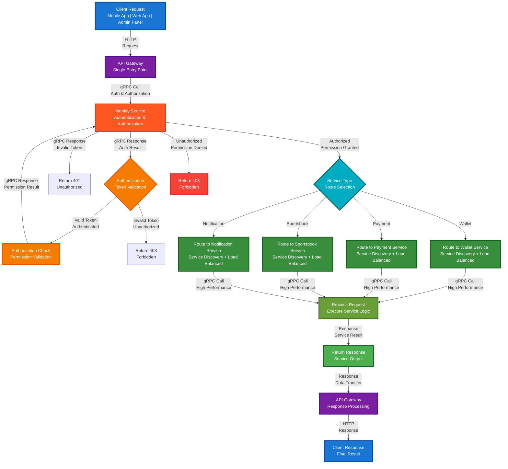

# 🌐 **API Gateway Service ER Diagram**

## 🎯 **Service Overview**
The API Gateway Service is the **single entry point** for all applications in the betting platform. It handles API routing, security, rate limiting, and request/response management for all external and internal communication. Every request passes through the API Gateway for authentication, authorization, and routing to the appropriate microservice.

## 📊 **Entity Relationship Diagram**

## 🔄 **Request Flow Diagram**



## 🎯 **SRS Requirements Coverage**

### **FR-038: API Gateway Management** ✅

#### **🌐 API Routing:**
- **Request Routing** → `API_ROUTES` table for URL pattern matching
- **Service Discovery** → Automatic service endpoint resolution
- **Load Balancing** → Request distribution across service instances
- **Circuit Breaker** → Fault tolerance and resilience patterns
- **Path Rewriting** → URL transformation and redirection

#### **⚡ Rate Limiting:**
- **Request Throttling** → `API_RATE_LIMITS` table for quota management
- **User-based Limits** → Per-user request limits (100 requests/minute)
- **Tenant-based Limits** → Per-tenant request limits (10,000 requests/minute)
- **Endpoint Limits** → Per-endpoint specific limits
- **Burst Handling** → Temporary limit increases for traffic spikes

#### **🔐 Authentication:**
- **JWT Validation** → `API_AUTHENTICATION` table for token validation
- **OAuth 2.0 Support** → OpenID Connect integration
- **Token Refresh** → Automatic token renewal
- **Multi-Provider** → Google, Facebook, Microsoft login
- **Session Management** → User session tracking and validation

#### **🛡️ Authorization:**
- **Role-Based Access** → `API_PERMISSIONS` table for permission management
- **Permission Checking** → Fine-grained access control
- **Tenant Isolation** → Multi-tenant permission scoping
- **Resource Access** → Endpoint and method-level permissions
- **Dynamic Permissions** → Runtime permission evaluation

#### **🔄 Request/Response Processing:**
- **Data Transformation** → `API_TRANSFORMATIONS` for request/response conversion
- **Middleware Pipeline** → `API_MIDDLEWARE` for custom processing
- **Request Tracking** → `API_REQUESTS` for complete request lifecycle
- **Header Management** → Request/response header manipulation
- **Content Negotiation** → Multiple content type support (JSON, XML, etc.)

#### **📊 Monitoring & Observability:**
- **Performance Analytics** → `API_ANALYTICS` for response time and throughput metrics
- **Request Logging** → `API_LOGS` for complete request audit trail
- **Alert Management** → `API_ALERTS` for proactive issue detection
- **Real-time Metrics** → Live performance monitoring
- **Error Tracking** → Comprehensive error logging and analysis

## 🔗 **Integration with Identity Service**

### **Authentication Flow:**
1. **JWT Token Validation** → Validates tokens against `OPENIDDICT_TOKENS` table
2. **User Authentication** → Checks user status in `ASPNET_USERS` table
3. **Tenant Isolation** → Ensures requests are scoped to correct `tenant_id`
4. **Role Verification** → Validates user roles via `ASPNET_USER_ROLES` table

### **Authorization Flow:**
1. **Permission Checking** → Validates claims from `ASPNET_USER_CLAIMS` table
2. **Role-Based Access** → Checks permissions via `ASPNET_ROLE_CLAIMS` table
3. **Tenant Scoping** → Ensures all checks are tenant-isolated
4. **Audit Logging** → Records all auth events in `AUDIT_LOGS` table

### **Request Flow:**
```
Client → API Gateway → Authentication → Route to Service → Response
```

### **🎯 All Applications Pass Through API Gateway:**
- **Mobile App** → API Gateway → All Services
- **Web App** → API Gateway → All Services  
- **Admin Panel** → API Gateway → All Services
- **External APIs** → API Gateway → Appropriate Service

## 🚀 **Deployment Strategies**

### **🎯 Development Phase: .NET Aspire**

#### **Aspire Implementation:**
```csharp
// Aspire AppHost
var builder = DistributedApplication.CreateBuilder(args);

// Services auto-register
var walletService = builder.AddProject<Projects.WalletService>("wallet-service");
var paymentService = builder.AddProject<Projects.PaymentService>("payment-service");
var sportsbookService = builder.AddProject<Projects.SportsbookService>("sportsbook-service");

builder.Build().Run();
```

#### **API Gateway with Aspire (gRPC):**
```csharp
// API Gateway Controller - gRPC
public class ApiGatewayController : ControllerBase
{
    private readonly WalletService.WalletServiceClient _walletClient;
    private readonly PaymentService.PaymentServiceClient _paymentClient;

    public ApiGatewayController(
        WalletService.WalletServiceClient walletClient,
        PaymentService.PaymentServiceClient paymentClient)
    {
        _walletClient = walletClient;
        _paymentClient = paymentClient;
    }
    
    [HttpGet("/api/wallet/balance")]
    public async Task<IActionResult> GetWalletBalance()
    {
        // gRPC call to wallet service
        var request = new GetWalletRequest 
        { 
            UserId = GetUserIdFromToken(),
            TenantId = GetTenantIdFromToken()
        };
        
        var response = await _walletClient.GetWalletAsync(request);
        return Ok(response);
    }
    
    [HttpPost("/api/payment/process")]
    public async Task<IActionResult> ProcessPayment([FromBody] PaymentRequestDto dto)
    {
        // gRPC call to payment service
        var request = new ProcessPaymentRequest 
        { 
            UserId = GetUserIdFromToken(),
            TenantId = GetTenantIdFromToken(),
            Amount = dto.Amount,
            Currency = dto.Currency
        };
        
        var response = await _paymentClient.ProcessPaymentAsync(request);
        return Ok(response);
    }
}
```


#### **Aspire Benefits:**
- ✅ **No service discovery code** → Aspire handles everything
- ✅ **No health monitoring code** → Aspire monitors automatically
- ✅ **No load balancing code** → Aspire balances automatically
- ✅ **Fast development** → Get your betting platform working quickly
- ✅ **gRPC Performance** → High-speed service communication

#### **🚀 gRPC Benefits:**
- **High Performance** → Fast service communication
- **Type Safety** → Protocol Buffers
- **Real-time Streaming** → Live odds, notifications
- **Service Communication** → Internal microservices

### **🏭 Production Phase: Kubernetes**

#### **Kubernetes Deployment:**
```yaml
# wallet-service.yaml
apiVersion: apps/v1
kind: Deployment
metadata:
  name: wallet-service
spec:
  replicas: 3
  selector:
    matchLabels:
      app: wallet-service
  template:
    metadata:
      labels:
        app: wallet-service
    spec:
      containers:
      - name: wallet-service
        image: wallet-service:latest
        ports:
        - containerPort: 8080
        livenessProbe:
          httpGet:
            path: /health
            port: 8080
        readinessProbe:
          httpGet:
            path: /ready
            port: 8080
---
apiVersion: v1
kind: Service
metadata:
  name: wallet-service
spec:
  selector:
    app: wallet-service
  ports:
  - port: 80
    targetPort: 8080
  type: ClusterIP
```

#### **API Gateway with Kubernetes (gRPC):**
```csharp
// Same gRPC code, different deployment
public class ApiGatewayController : ControllerBase
{
    private readonly WalletService.WalletServiceClient _walletClient;
    private readonly PaymentService.PaymentServiceClient _paymentClient;
    
    [HttpGet("/api/wallet/balance")]
    public async Task<IActionResult> GetWalletBalance()
    {
        // Kubernetes DNS: wallet-service.default.svc.cluster.local
        var request = new GetWalletRequest { UserId = GetUserIdFromToken() };
        var response = await _walletClient.GetWalletAsync(request);
        return Ok(response);
    }
}
```

#### **Kubernetes Benefits:**
- ✅ **High Availability** → Multiple nodes, auto-failover
- ✅ **Auto-Scaling** → Horizontal Pod Autoscaler
- ✅ **Production-Ready** → Industry standard

## 📊 **Complete Table Organization & Structure**

### **🏢 1. TENANT MANAGEMENT (1 table)**
- `TENANTS` - Core tenant information

#### **🛣️ 2. API ROUTING (1 table)**
- `API_ROUTES` - Route patterns and conditions

#### **⚡ 3. RATE LIMITING (1 table)**
- `API_RATE_LIMITS` - Rate limiting configuration

#### **🔐 4. AUTHENTICATION & AUTHORIZATION (2 tables)**
- `API_AUTHENTICATION` - Authentication configuration
- `API_PERMISSIONS` - Permission and role management

#### **🔄 5. REQUEST/RESPONSE PROCESSING (3 tables)**
- `API_TRANSFORMATIONS` - Request/response transformation
- `API_MIDDLEWARE` - Middleware configuration
- `API_REQUESTS` - Request tracking and monitoring

#### **📊 6. RESPONSE & ERROR HANDLING (2 tables)**
- `API_RESPONSES` - Response tracking
- `API_ERRORS` - Error logging and management

#### **📈 7. ANALYTICS & MONITORING (4 tables)**
- `API_ANALYTICS` - API performance analytics
- `API_LOGS` - Request and system logs
- `API_ALERTS` - Alert management
- `API_CONFIGURATIONS` - Gateway configuration

#### **🔍 8. AUDIT TRAIL (1 table)**
- `AUDIT_LOGS` - Complete audit trail

#### **⚙️ 9. UI CONFIGURATIONS (1 table)**
- `TENANT_UI_CONFIGURATIONS` - Frontend UI settings per tenant

## 🎯 **Total: 15 Tables**

### **✅ Complete Coverage:**
1. **API Routing** (1 table)
2. **Rate Limiting** (1 table)
3. **Authentication & Authorization** (2 tables)
4. **Request/Response Processing** (3 tables)
5. **Response & Error Handling** (2 tables)
6. **Analytics & Monitoring** (4 tables)
7. **Audit Trail** (1 table)
8. **UI Configurations** (1 table)

## 🚀 **Key Features:**

### **✅ 1. Advanced API Routing**
- **Dynamic Routing** → Pattern-based request routing
- **Service Discovery** → Automatic service endpoint resolution
- **Load Balancing** → Request distribution across services
- **Circuit Breaker** → Fault tolerance and resilience

### **✅ 2. Comprehensive Security**
- **JWT Authentication** → Token-based authentication
- **OAuth 2.0 Integration** → OAuth provider integration
- **Rate Limiting** → Request throttling and quota management
- **Permission Management** → Role-based access control

### **✅ 3. Request/Response Processing**
- **Data Transformation** → Request/response data conversion
- **Middleware Pipeline** → Custom processing middleware
- **Header Management** → Request/response header handling
- **Content Negotiation** → Multiple content type support

### **✅ 4. Complete Monitoring**
- **Request Tracking** → Complete request lifecycle monitoring
- **Performance Analytics** → Response time and throughput metrics
- **Error Management** → Comprehensive error logging and handling
- **Real-time Alerts** → Performance and error alerts

### **✅ 5. Enterprise Features**
- **Multi-Tenant Support** → Complete tenant isolation
- **Configuration Management** → Dynamic configuration updates
- **API Versioning** → Multiple API version support
- **Documentation** → Auto-generated API documentation

## 🎯 **Deployment Strategy:**

### **Development: .NET Aspire**
- **Fast development** → Focus on business logic
- **Perfect for MVP** → Testing and validation

### **Production: Kubernetes**
- **Enterprise scale** → Handle millions of users
- **High availability** → Multi-node deployment
- **Auto-scaling** → Automatic resource management

**Same code, different deployment!** 🚀

## 🚀 **Auto-Scaling**

### **📊 Configuration:**
- **Instances** → 3-50 (auto-scaling)
- **CPU threshold** → 70% (scale up)
- **Active users** → 1000+ (scale up)
- **Response time** → 500ms (scale up)

### **🎯 Benefits:**
- **Handles 1M users** → Automatic scaling
- **High availability** → Multiple instances
- **Cost effective** → Right-sized instances

## 🔄 **Detailed Information Flow with Sample Code**

### **📊 Complete Request Flow:**
```
Client Request → API Gateway → Identity Service (gRPC) → Target Service (gRPC) → Response
```

### **🔐 Identity Service Implementation:**
```csharp
// IdentityService.proto
service IdentityService {
  rpc AuthenticateAndAuthorize(AuthRequest) returns (AuthResponse);
}

message AuthRequest {
  string token = 1;
  string resource = 2;
  string action = 3;
}

message AuthResponse {
  bool is_authenticated = 1;
  bool is_authorized = 2;
  string user_id = 3;
  string tenant_id = 4;
  repeated string permissions = 5;
}

// IdentityService.cs
public class IdentityServiceImpl : IdentityService.IdentityServiceBase
{
    public override async Task<AuthResponse> AuthenticateAndAuthorize(AuthRequest request, ServerCallContext context)
    {
        // 1. Validate token (authentication)
        var user = await ValidateToken(request.Token);
        if (user == null)
        {
            return new AuthResponse { IsAuthenticated = false, IsAuthorized = false };
        }
        
        // 2. Check permission (authorization)
        var hasPermission = await CheckPermission(user.Id, request.Resource, request.Action);
        
        return new AuthResponse
        {
            IsAuthenticated = true,
            IsAuthorized = hasPermission,
            UserId = user.Id,
            TenantId = user.TenantId,
            Permissions = await GetUserPermissions(user.Id)
        };
    }
    
    private async Task<bool> CheckPermission(string userId, string resource, string action)
    {
        var permission = $"{resource}.{action}";
        
        // Check user claims
        var userClaim = await _context.ASPNET_USER_CLAIMS
            .AnyAsync(c => c.user_id == userId && c.claim_value == permission);
            
        // Check role claims
        var roleClaim = await _context.ASPNET_ROLE_CLAIMS
            .AnyAsync(rc => rc.role_id == userRoleId && rc.claim_value == permission);
            
        return userClaim || roleClaim;
    }
}
```

### **💰 Wallet Service Implementation:**
```csharp
// WalletService.proto
service WalletService {
  rpc GetBalance(GetBalanceRequest) returns (GetBalanceResponse);
  rpc Withdraw(WithdrawRequest) returns (WithdrawResponse);
}

message GetBalanceRequest {
  string user_id = 1;
  string wallet_id = 2;
}

message GetBalanceResponse {
  double balance = 1;
  string currency = 2;
}

// WalletService.cs
public class WalletServiceImpl : WalletService.WalletServiceBase
{
    private readonly IdentityService.IdentityServiceClient _identityClient;
    
    public override async Task<GetBalanceResponse> GetBalance(GetBalanceRequest request, ServerCallContext context)
    {
        // 1. Check base permission via gRPC call to Identity Service
        var authRequest = new AuthRequest
        {
            Token = GetTokenFromContext(context),
            Resource = "Wallet",
            Action = "View"
        };
        
        var authResponse = await _identityClient.AuthenticateAndAuthorizeAsync(authRequest);
        if (!authResponse.IsAuthenticated) 
            throw new RpcException(new Status(StatusCode.Unauthenticated, "Invalid token"));
        if (!authResponse.IsAuthorized) 
            throw new RpcException(new Status(StatusCode.PermissionDenied, "Access denied"));
        
        // 2. Check wallet-specific policy
        if (!await CanAccessWallet(request.UserId, request.WalletId))
            throw new RpcException(new Status(StatusCode.PermissionDenied, "Cannot access this wallet"));
            
        var balance = await _walletRepository.GetBalance(request.WalletId);
        return new GetBalanceResponse { Balance = balance, Currency = "USD" };
    }
    
    public override async Task<WithdrawResponse> Withdraw(WithdrawRequest request, ServerCallContext context)
    {
        // 1. Check base permission
        var authRequest = new AuthRequest
        {
            Token = GetTokenFromContext(context),
            Resource = "Wallet",
            Action = "Withdraw"
        };
        
        var authResponse = await _identityClient.AuthenticateAndAuthorizeAsync(authRequest);
        if (!authResponse.IsAuthenticated) 
            throw new RpcException(new Status(StatusCode.Unauthenticated, "Invalid token"));
        if (!authResponse.IsAuthorized) 
            throw new RpcException(new Status(StatusCode.PermissionDenied, "Access denied"));
        
        // 2. Check wallet-specific policies
        if (!await CanWithdraw(request.UserId, request.Amount))
            throw new RpcException(new Status(StatusCode.InvalidArgument, "Withdrawal not allowed"));
            
        var result = await _walletRepository.Withdraw(request.UserId, request.Amount);
        return new WithdrawResponse { Success = true, NewBalance = result.Balance };
    }
    
    private async Task<bool> CanWithdraw(string userId, decimal amount)
    {
        var user = await GetUser(userId);
        var wallet = await GetWallet(userId);
        
        // Policy 1: Daily limit
        var dailyLimit = user.DailyWithdrawalLimit; // $1000
        var todayWithdrawn = await GetTodayWithdrawn(userId); // $200
        if (amount + todayWithdrawn > dailyLimit) return false;
        
        // Policy 2: KYC status
        if (user.KycStatus != "Verified") return false;
        
        // Policy 3: Account status
        if (user.AccountStatus != "Active") return false;
        
        // Policy 4: Minimum balance
        if (wallet.Balance < amount) return false;
        
        return true;
    }
}
```

### **⚽ Sportsbook Service Implementation:**
```csharp
// SportsbookService.proto
service SportsbookService {
  rpc PlaceBet(PlaceBetRequest) returns (PlaceBetResponse);
  rpc GetMarket(GetMarketRequest) returns (GetMarketResponse);
}

message PlaceBetRequest {
  string user_id = 1;
  double stake = 2;
  string market_id = 3;
  string selection_id = 4;
}

message PlaceBetResponse {
  bool success = 1;
  string bet_id = 2;
  string message = 3;
}

// SportsbookService.cs
public class SportsbookServiceImpl : SportsbookService.SportsbookServiceBase
{
    private readonly IdentityService.IdentityServiceClient _identityClient;
    
    public override async Task<PlaceBetResponse> PlaceBet(PlaceBetRequest request, ServerCallContext context)
    {
        // 1. Check base permission
        var authRequest = new AuthRequest
        {
            Token = GetTokenFromContext(context),
            Resource = "Bet",
            Action = "Place"
        };
        
        var authResponse = await _identityClient.AuthenticateAndAuthorizeAsync(authRequest);
        if (!authResponse.IsAuthenticated) 
            throw new RpcException(new Status(StatusCode.Unauthenticated, "Invalid token"));
        if (!authResponse.IsAuthorized) 
            throw new RpcException(new Status(StatusCode.PermissionDenied, "Access denied"));
        
        // 2. Check sportsbook-specific policies
        if (!await CanPlaceBet(request.UserId, request.Stake, request.MarketId))
            throw new RpcException(new Status(StatusCode.InvalidArgument, "Bet not allowed"));
            
        var bet = await _sportsbookRepository.PlaceBet(request);
        return new PlaceBetResponse { Success = true, BetId = bet.Id, Message = "Bet placed successfully" };
    }
    
    private async Task<bool> CanPlaceBet(string userId, decimal stake, string marketId)
    {
        var user = await GetUser(userId);
        var market = await GetMarket(marketId);
        
        // Policy 1: User stake limit
        var userLimit = user.StakeLimit; // $500
        if (stake > userLimit) return false;
        
        // Policy 2: Market limit
        var marketLimit = market.MaxStake; // $1000
        if (stake > marketLimit) return false;
        
        // Policy 3: Geo restriction
        var userCountry = user.Country;
        var allowedCountries = market.AllowedCountries;
        if (!allowedCountries.Contains(userCountry)) return false;
        
        // Policy 4: Market status
        if (market.Status != "Active") return false;
        
        return true;
    }
}
```

### **🌐 API Gateway Implementation:**
```csharp
// ApiGatewayService.cs
public class ApiGatewayService
{
    private readonly IdentityService.IdentityServiceClient _identityClient;
    private readonly WalletService.WalletServiceClient _walletClient;
    private readonly SportsbookService.SportsbookServiceClient _sportsbookClient;
    
    public async Task<IActionResult> RouteRequest(string path, string token, object data)
    {
        // 1. Authenticate with Identity Service (gRPC)
        var authRequest = new AuthRequest
        {
            Token = token,
            Resource = GetResourceFromPath(path),
            Action = GetActionFromPath(path)
        };
        
        var authResponse = await _identityClient.AuthenticateAndAuthorizeAsync(authRequest);
        if (!authResponse.IsAuthenticated) return Unauthorized();
        if (!authResponse.IsAuthorized) return Forbid();
        
        // 2. Route to target service (gRPC)
        if (path.StartsWith("/api/wallet"))
        {
            return await RouteToWalletService(path, authResponse.UserId, data);
        }
        else if (path.StartsWith("/api/sportsbook"))
        {
            return await RouteToSportsbookService(path, authResponse.UserId, data);
        }
        
        return NotFound();
    }
    
    private async Task<IActionResult> RouteToWalletService(string path, string userId, object data)
    {
        if (path.EndsWith("/balance"))
        {
            var request = new GetBalanceRequest { UserId = userId, WalletId = GetWalletIdFromPath(path) };
            var response = await _walletClient.GetBalanceAsync(request);
            return Ok(response);
        }
        else if (path.EndsWith("/withdraw"))
        {
            var request = new WithdrawRequest { UserId = userId, Amount = GetAmountFromData(data) };
            var response = await _walletClient.WithdrawAsync(request);
            return Ok(response);
        }
        
        return NotFound();
    }
}
```

### **🔧 Helper Methods:**
```csharp
public class GrpcHelper
{
    public static string GetTokenFromContext(ServerCallContext context)
    {
        var headers = context.RequestHeaders;
        var authHeader = headers.FirstOrDefault(h => h.Key == "authorization");
        return authHeader?.Value?.Replace("Bearer ", "") ?? throw new UnauthorizedException();
    }
    
    public static string GetResourceFromPath(string path)
    {
        return path.Split('/')[2]; // /api/wallet/balance -> wallet
    }
    
    public static string GetActionFromPath(string path)
    {
        var method = path.Split('/')[3]; // /api/wallet/balance -> balance
        return method switch
        {
            "balance" => "View",
            "withdraw" => "Withdraw",
            "deposit" => "Deposit",
            "place-bet" => "Place",
            _ => "Unknown"
        };
    }
}
```

### **📊 Complete Request Flow Example:**
```
1. Client: POST /api/wallet/withdraw { "amount": 500 }
2. API Gateway: Extract token, resource="Wallet", action="Withdraw"
3. API Gateway → Identity Service (gRPC): AuthenticateAndAuthorize
4. Identity Service: Check ASPNET_USER_CLAIMS for "Wallet.Withdraw"
5. Identity Service → API Gateway: { is_authenticated: true, is_authorized: true }
6. API Gateway → Wallet Service (gRPC): Withdraw request
7. Wallet Service: Check CanWithdraw(userId, 500) - daily limits, KYC, etc.
8. Wallet Service: Process withdrawal
9. Wallet Service → API Gateway: { success: true, new_balance: 500 }
10. API Gateway → Client: HTTP response
```

## 🚀 **gRPC Service Definition - Implementation Ready**

### **🔧 API Gateway Service (api_gateway.proto)**

```protobuf
syntax = "proto3";

package api_gateway.v1;

import "google/protobuf/empty.proto";
import "google/protobuf/timestamp.proto";

// API Gateway Service - Central routing and security service
service ApiGatewayService {
  // Authentication & Authorization
  rpc AuthenticateRequest(AuthenticateRequest) returns (AuthenticationResponse);
  rpc AuthorizeRequest(AuthorizeRequest) returns (AuthorizationResponse);
  rpc ValidateToken(ValidateTokenRequest) returns (TokenValidationResponse);
  
  // Request Routing
  rpc RouteRequest(RouteRequest) returns (RouteResponse);
  rpc GetServiceEndpoint(GetServiceEndpointRequest) returns (ServiceEndpointResponse);
  rpc LoadBalanceRequest(LoadBalanceRequest) returns (LoadBalanceResponse);
  
  // Rate Limiting & Throttling
  rpc CheckRateLimit(RateLimitRequest) returns (RateLimitResponse);
  rpc UpdateRateLimit(RateLimitUpdateRequest) returns (RateLimitUpdateResponse);
  rpc GetRateLimitStatus(RateLimitStatusRequest) returns (RateLimitStatusResponse);
  
  // Request/Response Processing
  rpc ProcessRequest(ProcessRequestRequest) returns (ProcessRequestResponse);
  rpc ProcessResponse(ProcessResponseRequest) returns (ProcessResponseResponse);
  rpc TransformRequest(TransformRequestRequest) returns (TransformRequestResponse);
  rpc TransformResponse(TransformResponseRequest) returns (TransformResponseResponse);
  
  // Security & Monitoring
  rpc LogRequest(LogRequestRequest) returns (LogRequestResponse);
  rpc MonitorHealth(HealthCheckRequest) returns (HealthCheckResponse);
  rpc GetMetrics(MetricsRequest) returns (MetricsResponse);
  
  // Configuration Management
  rpc GetRoutingConfig(RoutingConfigRequest) returns (RoutingConfigResponse);
  rpc UpdateRoutingConfig(UpdateRoutingConfigRequest) returns (UpdateRoutingConfigResponse);
  rpc GetSecurityConfig(SecurityConfigRequest) returns (SecurityConfigResponse);
  rpc UpdateSecurityConfig(UpdateSecurityConfigRequest) returns (UpdateSecurityConfigResponse);
}

// Request/Response Messages
message AuthenticateRequest {
  string token = 1;
  string client_ip = 2;
  string user_agent = 3;
  string tenant_id = 4;
}

message AuthenticationResponse {
  bool is_authenticated = 1;
  string user_id = 2;
  string tenant_id = 3;
  repeated string roles = 4;
  repeated string permissions = 5;
  string error_message = 6;
}

message AuthorizeRequest {
  string user_id = 1;
  string resource = 2;
  string action = 3;
  string tenant_id = 4;
}

message AuthorizationResponse {
  bool is_authorized = 1;
  string reason = 2;
  repeated string required_permissions = 3;
}

message ValidateTokenRequest {
  string token = 1;
  string tenant_id = 2;
}

message TokenValidationResponse {
  bool is_valid = 1;
  string user_id = 2;
  string tenant_id = 3;
  google.protobuf.Timestamp expires_at = 4;
  repeated string claims = 5;
}

message RouteRequest {
  string method = 1;
  string path = 2;
  string tenant_id = 3;
  string user_id = 4;
}

message RouteResponse {
  string service_name = 1;
  string endpoint = 2;
  string protocol = 3;
  map<string, string> headers = 4;
  string error_message = 5;
}

message GetServiceEndpointRequest {
  string service_name = 1;
  string tenant_id = 2;
}

message ServiceEndpointResponse {
  string endpoint = 1;
  string protocol = 2;
  bool is_healthy = 3;
  int32 load_factor = 4;
}

message LoadBalanceRequest {
  string service_name = 1;
  string tenant_id = 2;
  string user_id = 3;
}

message LoadBalanceResponse {
  string selected_endpoint = 1;
  string load_balancer_algorithm = 2;
  int32 current_load = 3;
}

message RateLimitRequest {
  string user_id = 1;
  string tenant_id = 2;
  string endpoint = 3;
  string client_ip = 4;
}

message RateLimitResponse {
  bool is_allowed = 1;
  int32 remaining_requests = 2;
  int32 reset_time_seconds = 3;
  string limit_type = 4;
}

message ProcessRequestRequest {
  string method = 1;
  string path = 2;
  map<string, string> headers = 3;
  bytes body = 4;
  string user_id = 5;
  string tenant_id = 6;
}

message ProcessRequestResponse {
  bool should_continue = 1;
  map<string, string> modified_headers = 2;
  bytes modified_body = 3;
  string error_message = 4;
}

message ProcessResponseRequest {
  int32 status_code = 1;
  map<string, string> headers = 2;
  bytes body = 3;
  string user_id = 4;
  string tenant_id = 5;
}

message ProcessResponseResponse {
  int32 modified_status_code = 1;
  map<string, string> modified_headers = 2;
  bytes modified_body = 3;
  bool should_log = 4;
}

message LogRequestRequest {
  string method = 1;
  string path = 2;
  int32 status_code = 3;
  int64 response_time_ms = 4;
  string user_id = 5;
  string tenant_id = 6;
  string client_ip = 7;
  string user_agent = 8;
}

message LogRequestResponse {
  bool success = 1;
  string log_id = 2;
}

message HealthCheckRequest {
  string service_name = 1;
}

message HealthCheckResponse {
  bool is_healthy = 1;
  string status = 2;
  map<string, string> details = 3;
}

message MetricsRequest {
  string metric_type = 1;
  string time_range = 2;
  string tenant_id = 3;
}

message MetricsResponse {
  map<string, double> metrics = 1;
  google.protobuf.Timestamp timestamp = 2;
}

message RoutingConfigRequest {
  string tenant_id = 1;
}

message RoutingConfigResponse {
  map<string, string> routes = 1;
  map<string, string> service_endpoints = 2;
  map<string, string> load_balancing = 3;
}

message SecurityConfigRequest {
  string tenant_id = 1;
}

message SecurityConfigResponse {
  map<string, string> security_policies = 1;
  map<string, string> rate_limits = 2;
  map<string, string> authentication = 3;
}
```

### **🔗 External Service Communication Patterns**

#### **Identity Service Integration:**
- **Authentication** → `AuthenticateRequest` → Identity Service
- **Authorization** → `AuthorizeRequest` → Identity Service  
- **Token Validation** → `ValidateTokenRequest` → Identity Service

#### **Backend Services Integration:**
- **Wallet Service** → Route wallet requests with user context
- **Payment Service** → Route payment requests with security validation
- **Sportsbook Service** → Route betting requests with authorization
- **All Services** → Centralized routing and security enforcement

### **📊 Implementation Guidelines**

#### **Service Configuration:**
- Configure routing rules for each backend service
- Set up load balancing algorithms (round-robin, least-connections, etc.)
- Define rate limiting policies per tenant and endpoint
- Configure security policies and authentication requirements

#### **Error Handling:**
- Implement circuit breaker patterns for service failures
- Handle authentication/authorization failures gracefully
- Provide meaningful error messages to clients
- Log all security violations and failed requests

#### **Monitoring & Health Checks:**
- Monitor service health and availability
- Track request/response metrics and performance
- Alert on rate limit violations and security breaches
- Generate reports on API usage and patterns

**This API Gateway Service ER diagram provides complete API management, service discovery, and routing capabilities for your betting platform!** 🎯
