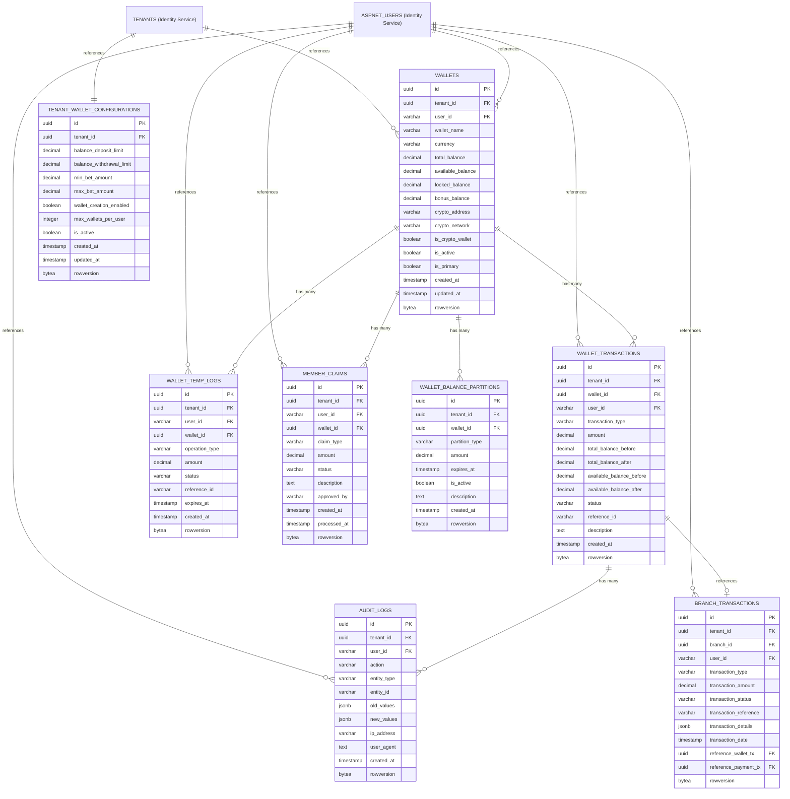

# 💰 **Wallet Service ER Diagram**

## 🎯 **Service Overview**
The Wallet Service handles all wallet management, balance tracking, and internal financial transactions for the betting platform. It manages multiple wallets per user (one per currency) with complete multi-tenant isolation and cryptocurrency support.

**Note: External payment processing is handled by the separate Payment Service. Bonus management is handled by the Marketing Service.**

## 📊 **Table Organization**

### **💰 1. WALLET MANAGEMENT (2 tables)**
- `WALLETS` - User wallet with balance partitions
- `WALLET_TRANSACTIONS` - Complete transaction history


### **⏳ 2. TEMPORARY OPERATIONS (1 table)**
- `WALLET_TEMP_LOGS` - Temporary transaction logs

### **🎁 3. CLAIMS SYSTEM (1 table)**
- `MEMBER_CLAIMS` - User claim management

### **🔧 4. BALANCE PARTITIONS (1 table)**
- `WALLET_BALANCE_PARTITIONS` - Advanced balance management

### **📋 5. AUDIT & LOGGING (1 table)**
- `AUDIT_LOGS` - Complete audit trail

### **⚙️ 6. WALLET CONFIGURATIONS (2 tables)**
- `TENANT_WALLET_CONFIGURATIONS` - Wallet and balance settings per tenant
- `BRANCH_TRANSACTIONS` - Branch financial transactions

## 🎯 **Total: 7 Tables**

### **🔗 External Service References:**
- **TENANTS** → Referenced from Identity Service (not duplicated)
- **ASPNET_USERS** → Referenced from Identity Service (not duplicated)

## 🚀 **Key Features:**

### **✅ Multi-Currency Wallet System**
- **One Wallet per Currency** → Separate wallets for USD, EUR, BTC, ETH, USDT, etc.
- **8 Decimal Precision** → Supports Bitcoin (0.00000001 BTC) and other cryptos
- **No Currency Conversion** → Each currency stays in its own wallet
- **Crypto Support** → Bitcoin, Ethereum, BSC, Polygon networks

### **✅ Balance Management**
- **Total Balance** → Complete wallet balance per currency
- **Available Balance** → Available for betting and withdrawal
- **Locked Balance** → Temporarily unavailable funds
- **Bonus Balance** → Promotional and bonus funds

### **✅ High-Performance Operations**
- **Rowversion Support** → Optimistic concurrency control
- **Partitioned Tables** → Monthly partitions for scale
- **Auto-Cleanup** → TTL for temporary data
- **Multi-Tenant Isolation** → Complete data separation

---

## 📚 **Detailed Table Definitions**

### 1) **WALLETS** - Multi-Currency Wallet Management

> **Purpose:** Core wallet management with multiple wallets per user (one per currency)
> 
> **When to Use:**
> - **User Registration** → Create wallets for new users (USD, EUR, BTC, ETH, etc.)
> - **Currency Selection** → Users select which currency wallet to use for betting
> - **Balance Queries** → Get current balance for specific currency
> - **Balance Updates** → Update balances after deposits, withdrawals, bets per currency
> - **Wallet Management** → Enable/disable wallets, update wallet settings per currency
> - **Multi-Currency Management** → Manage different currency wallets separately
> 
> **Key Operations:**
> - Create currency-specific wallets for new user
> - Update balance after transaction in specific currency
> - Check balance before bet placement in selected currency
> - Validate withdrawal eligibility per currency
> - Manage currency-specific balance partitions

| **Column** | **Type** | **Default** | **Constraints** | **Description** |
|------------|----------|-------------|-----------------|-----------------|
| **id** | `uuid` | `gen_random_uuid()` | `PRIMARY KEY` | Unique wallet identifier |
| **tenant_id** | `uuid` | - | `NOT NULL, FK→TENANTS.id` | Multi-tenant isolation |
| **user_id** | `varchar(50)` | - | `NOT NULL, FK→ASPNET_USERS.id` | Wallet owner |
| **wallet_name** | `varchar(100)` | - | `NOT NULL` | Wallet display name (e.g., "My USD Wallet", "My Bitcoin Wallet") |
| **currency** | `varchar(10)` | `'USD'` | `NOT NULL` | Wallet currency (USD, EUR, BTC, ETH, USDT, BNB) |
| **total_balance** | `decimal(18,8)` | `0.00000000` | `NOT NULL, CHECK >= 0` | Total wallet balance (8 decimals for crypto) |
| **available_balance** | `decimal(18,8)` | `0.00000000` | `NOT NULL, CHECK >= 0` | Available for betting/withdrawal |
| **locked_balance** | `decimal(18,8)` | `0.00000000` | `NOT NULL, CHECK >= 0` | Temporarily locked funds |
| **bonus_balance** | `decimal(18,8)` | `0.00000000` | `NOT NULL, CHECK >= 0` | Promotional/bonus funds |
| **crypto_address** | `varchar(100)` | `null` | - | Crypto wallet address (for crypto wallets) |
| **crypto_network** | `varchar(20)` | `null` | - | Crypto network (bitcoin, ethereum, bsc, polygon) |
| **is_crypto_wallet** | `boolean` | `false` | `NOT NULL` | Flag for crypto wallet |
| **is_active** | `boolean` | `true` | `NOT NULL` | Wallet status |
| **is_primary** | `boolean` | `false` | `NOT NULL` | Primary wallet flag for this currency |
| **created_at** | `timestamp` | `now()` | `NOT NULL` | Creation timestamp |
| **updated_at** | `timestamp` | `now()` | `NOT NULL` | Last update timestamp |
| **rowversion** | `bytea` | `gen_random_bytes(8)` | `NOT NULL` | Row version for optimistic concurrency |

#### **₿ Multi-Currency Support:**

> **The wallet system supports multiple currencies with separate wallets per currency:**

##### **Supported Currencies:**
- **Fiat:** USD, EUR, GBP, CAD, AUD, JPY
- **Crypto:** BTC, ETH, USDT, USDC, BNB, ADA, SOL
- **Stablecoins:** USDT, USDC, DAI, BUSD

##### **Multi-Currency Operations:**
- **One Wallet per Currency** → Separate wallets for each currency type
- **No Currency Conversion** → Each currency stays in its own wallet
- **Real Values** → Users see actual currency amounts
- **Crypto Integration** → Bitcoin, Ethereum, BSC, Polygon networks

##### **Multi-Currency Wallet Example:**
```
User: John Smith
├── USD Wallet: $1,000.00
├── EUR Wallet: €500.00
├── BTC Wallet: 0.05 BTC
├── ETH Wallet: 2.5 ETH
└── USDT Wallet: 1,000 USDT
```

### 2) **WALLET_TRANSACTIONS** - Transaction History

> **Purpose:** Complete transaction history with balance tracking for all wallet operations
> 
> **When to Use:**
> - **Transaction Recording** → Record every wallet operation (deposits, withdrawals, bets, winnings)
> - **Balance History** → Track balance changes over time via balance_before/balance_after
> - **Audit Compliance** → Provide complete transaction trail for regulatory requirements
> - **User History** → Show transaction history to users
> - **Dispute Resolution** → Investigate transaction issues and balance discrepancies
> - **Reporting** → Generate financial reports and analytics
> 
> **Key Operations:**
> - Record deposit from payment service
> - Record bet placement and results
> - Record withdrawal requests
> - Track balance changes
> - Generate transaction statements
> - Investigate balance discrepancies

| **Column** | **Type** | **Default** | **Constraints** | **Description** |
|------------|----------|-------------|-----------------|-----------------|
| **id** | `uuid` | `gen_random_uuid()` | `PRIMARY KEY` | Unique transaction identifier |
| **tenant_id** | `uuid` | - | `NOT NULL, FK→TENANTS.id` | Multi-tenant isolation |
| **wallet_id** | `uuid` | - | `NOT NULL, FK→WALLETS.id` | Wallet reference |
| **user_id** | `varchar(50)` | - | `NOT NULL, FK→ASPNET_USERS.id` | Transaction owner |
| **transaction_type** | `varchar(30)` | - | `NOT NULL` | Transaction type (bet_placed/bet_won/bet_lost/deposit/withdrawal/refund/bonus) |
| **amount** | `decimal(18,8)` | - | `NOT NULL, CHECK != 0` | Transaction amount (positive/negative, 8 decimals for crypto) |
| **total_balance_before** | `decimal(18,8)` | - | `NOT NULL, CHECK >= 0` | Total balance before transaction |
| **total_balance_after** | `decimal(18,8)` | - | `NOT NULL, CHECK >= 0` | Total balance after transaction |
| **available_balance_before** | `decimal(18,8)` | - | `NOT NULL, CHECK >= 0` | Available balance before transaction |
| **available_balance_after** | `decimal(18,8)` | - | `NOT NULL, CHECK >= 0` | Available balance after transaction |
| **status** | `varchar(20)` | `'pending'` | `NOT NULL` | Transaction status (pending/completed/failed/cancelled) |
| **reference_id** | `varchar(100)` | `null` | - | External reference (bet_id/game_id/payment_id) |
| **description** | `text` | `null` | - | Transaction description |
| **created_at** | `timestamp` | `now()` | `NOT NULL` | Transaction timestamp |
| **rowversion** | `bytea` | `gen_random_bytes(8)` | `NOT NULL` | Row version for optimistic concurrency |


### 3) **WALLET_TEMP_LOGS** - Temporary Operations

> **Purpose:** Temporary transaction logs with auto-cleanup for pending operations
> 
> **When to Use:**
> - **Pending Bets** → Track bets that are being processed but not yet confirmed
> - **Pending Withdrawals** → Track withdrawal requests awaiting approval
> - **Pending Deposits** → Track deposits that are being processed by payment service
> - **Transaction Locks** → Prevent duplicate transactions during processing
> - **Auto-Cleanup** → Automatically remove expired pending operations
> - **Race Condition Prevention** → Handle concurrent transaction attempts
> 
> **Key Operations:**
> - Lock funds during bet processing
> - Track pending withdrawal requests
> - Monitor deposit processing status
> - Prevent duplicate transactions
> - Auto-expire stale operations
> - Handle transaction timeouts

| **Column** | **Type** | **Default** | **Constraints** | **Description** |
|------------|----------|-------------|-----------------|-----------------|
| **id** | `uuid` | `gen_random_uuid()` | `PRIMARY KEY` | Unique temp log identifier |
| **tenant_id** | `uuid` | - | `NOT NULL, FK→TENANTS.id` | Multi-tenant isolation |
| **user_id** | `varchar(50)` | - | `NOT NULL, FK→ASPNET_USERS.id` | Log owner |
| **wallet_id** | `uuid` | - | `NOT NULL, FK→WALLETS.id` | Wallet reference |
| **operation_type** | `varchar(30)` | - | `NOT NULL` | Operation type (pending_bet/pending_withdrawal/pending_deposit/pending_transfer) |
| **amount** | `decimal(18,8)` | - | `NOT NULL, CHECK != 0` | Operation amount (8 decimals for crypto) |
| **status** | `varchar(20)` | `'pending'` | `NOT NULL` | Status (pending/processed/expired/cancelled) |
| **reference_id** | `varchar(100)` | `null` | - | External reference |
| **expires_at** | `timestamp` | `now() + interval '1 hour'` | `NOT NULL` | Log expiration (auto-cleanup) |
| **created_at** | `timestamp` | `now()` | `NOT NULL` | Log timestamp |
| **rowversion** | `bytea` | `gen_random_bytes(8)` | `NOT NULL` | Row version for optimistic concurrency |


### 4) **MEMBER_CLAIMS** - User Claims Management

> **Purpose:** User claim management for bonuses, refunds, and compensation
> 
> **When to Use:**
> - **Bonus Claims** → Users request bonus credits from marketing service
> - **Refund Requests** → Users claim refunds for cancelled bets or technical issues
> - **Compensation Claims** → Users request compensation for service disruptions
> - **Rebate Claims** → Users claim cashback or rebate rewards
> - **Dispute Resolution** → Handle user complaints and compensation requests
> - **Approval Workflow** → Admin approval process for high-value claims
> 
> **Key Operations:**
> - Submit claim request from user
> - Review and approve claims by admin
> - Process approved claims to wallet
> - Track claim status and history
> - Generate claim reports
> - Handle claim disputes

| **Column** | **Type** | **Default** | **Constraints** | **Description** |
|------------|----------|-------------|-----------------|-----------------|
| **id** | `uuid` | `gen_random_uuid()` | `PRIMARY KEY` | Unique claim identifier |
| **tenant_id** | `uuid` | - | `NOT NULL, FK→TENANTS.id` | Multi-tenant isolation |
| **user_id** | `varchar(50)` | - | `NOT NULL, FK→ASPNET_USERS.id` | Claim owner |
| **wallet_id** | `uuid` | - | `NOT NULL, FK→WALLETS.id` | Target wallet |
| **claim_type** | `varchar(30)` | - | `NOT NULL` | Claim type (bonus/refund/compensation/rebate/cashback) |
| **amount** | `decimal(18,8)` | - | `NOT NULL, CHECK > 0` | Claim amount (8 decimals for crypto) |
| **status** | `varchar(20)` | `'pending'` | `NOT NULL` | Status (pending/approved/rejected/processed) |
| **description** | `text` | `null` | - | Claim description |
| **approved_by** | `varchar(50)` | `null` | `FK→ASPNET_USERS.id` | Approver |
| **created_at** | `timestamp` | `now()` | `NOT NULL` | Claim timestamp |
| **processed_at** | `timestamp` | `null` | - | Processing timestamp |
| **rowversion** | `bytea` | `gen_random_bytes(8)` | `NOT NULL` | Row version for optimistic concurrency |


### 5) **WALLET_BALANCE_PARTITIONS** - Advanced Balance Management

> **Purpose:** Advanced balance management with fund categorization and expiration
> 
> **When to Use:**
> - **Bonus Funds** → Separate bonus money from real money with expiration dates
> - **Restricted Funds** → Lock funds for specific purposes (tournament entry, special events)
> - **Promotional Funds** → Manage promotional credits with usage rules
> - **Trading Funds** → Separate funds for trading activities vs betting
> - **Expiration Management** → Track and expire funds based on time limits
> - **Fund Categorization** → Organize different types of funds within a wallet
> 
> **Key Operations:**
> - Create fund partitions for bonuses
> - Set expiration dates for promotional funds
> - Track partition usage and remaining amounts
> - Expire funds automatically
> - Transfer funds between partitions
> - Generate partition reports

| **Column** | **Type** | **Default** | **Constraints** | **Description** |
|------------|----------|-------------|-----------------|-----------------|
| **id** | `uuid` | `gen_random_uuid()` | `PRIMARY KEY` | Unique partition identifier |
| **tenant_id** | `uuid` | - | `NOT NULL, FK→TENANTS.id` | Multi-tenant isolation |
| **wallet_id** | `uuid` | - | `NOT NULL, FK→WALLETS.id` | Wallet reference |
| **partition_type** | `varchar(30)` | - | `NOT NULL` | Partition type (bonus/restricted/locked/promotional/trading) |
| **amount** | `decimal(18,8)` | `0.00000000` | `NOT NULL, CHECK >= 0` | Partition amount (8 decimals for crypto) |
| **expires_at** | `timestamp` | `null` | - | Partition expiration (null = permanent) |
| **is_active** | `boolean` | `true` | `NOT NULL` | Partition status |
| **description** | `text` | `null` | - | Partition description |
| **created_at** | `timestamp` | `now()` | `NOT NULL` | Creation timestamp |
| **rowversion** | `bytea` | `gen_random_bytes(8)` | `NOT NULL` | Row version for optimistic concurrency |


### 6) **TENANT_WALLET_CONFIGURATIONS** - Wallet Settings

> **Purpose:** Tenant-specific wallet configuration and limits management
> 
> **When to Use:**
> - **Tenant Setup** → Configure wallet settings for new tenants
> - **Limit Management** → Set daily deposit/withdrawal limits per tenant
> - **Betting Limits** → Configure minimum and maximum bet amounts
> - **Wallet Policies** → Enable/disable multiple wallets per user
> - **Compliance Settings** → Set regulatory limits and restrictions
> - **Tenant Customization** → Different settings for different tenant types
> 
> **Key Operations:**
> - Configure tenant wallet limits
> - Set betting amount restrictions
> - Enable/disable wallet features
> - Update tenant-specific policies
> - Monitor limit compliance
> - Generate configuration reports

| **Column** | **Type** | **Default** | **Constraints** | **Description** |
|------------|----------|-------------|-----------------|-----------------|
| **id** | `uuid` | `gen_random_uuid()` | `PRIMARY KEY` | Unique config identifier |
| **tenant_id** | `uuid` | - | `NOT NULL, UNIQUE, FK→TENANTS.id` | Multi-tenant isolation |
| **balance_deposit_limit** | `decimal(18,8)` | `10000.00000000` | `NOT NULL, CHECK > 0` | Daily deposit limit (8 decimals for crypto) |
| **balance_withdrawal_limit** | `decimal(18,8)` | `5000.00000000` | `NOT NULL, CHECK > 0` | Daily withdrawal limit (8 decimals for crypto) |
| **min_bet_amount** | `decimal(18,8)` | `1.00000000` | `NOT NULL, CHECK > 0` | Minimum bet amount (8 decimals for crypto) |
| **max_bet_amount** | `decimal(18,8)` | `1000.00000000` | `NOT NULL, CHECK > 0` | Maximum bet amount (8 decimals for crypto) |
| **wallet_creation_enabled** | `boolean` | `true` | `NOT NULL` | Allow multiple wallets |
| **max_wallets_per_user** | `integer` | `5` | `NOT NULL, CHECK > 0` | Maximum wallets per user |
| **is_active** | `boolean` | `true` | `NOT NULL` | Configuration status |
| **created_at** | `timestamp` | `now()` | `NOT NULL` | Creation timestamp |
| **updated_at** | `timestamp` | `now()` | `NOT NULL` | Last update timestamp |
| **rowversion** | `bytea` | `gen_random_bytes(8)` | `NOT NULL` | Row version for optimistic concurrency |


### 7) **AUDIT_LOGS** - Complete Audit Trail

> **Purpose:** Complete audit trail for security, compliance, and regulatory requirements
> 
> **When to Use:**
> - **Security Auditing** → Track all wallet operations for security monitoring
> - **Compliance Reporting** → Meet regulatory requirements for financial transactions
> - **Fraud Detection** → Monitor suspicious activities and transaction patterns
> - **Dispute Resolution** → Provide evidence for transaction disputes
> - **Change Tracking** → Record all modifications to wallet data
> - **Forensic Analysis** → Investigate security incidents and unauthorized access
> 
> **Key Operations:**
> - Log all wallet operations
> - Track user actions and changes
> - Monitor for suspicious activities
> - Generate audit reports
> - Investigate security incidents
> - Maintain compliance records

| **Column** | **Type** | **Default** | **Constraints** | **Description** |
|------------|----------|-------------|-----------------|-----------------|
| **id** | `uuid` | `gen_random_uuid()` | `PRIMARY KEY` | Unique audit log identifier |
| **tenant_id** | `uuid` | - | `NOT NULL, FK→TENANTS.id` | Multi-tenant isolation |
| **user_id** | `varchar(50)` | `null` | `FK→ASPNET_USERS.id` | User who performed action |
| **action** | `varchar(30)` | - | `NOT NULL` | Action type (create/update/delete/transfer/bet/withdrawal) |
| **entity_type** | `varchar(30)` | - | `NOT NULL` | Entity type (wallet/transaction/balance/claim) |
| **entity_id** | `varchar(100)` | - | `NOT NULL` | ID of affected entity |
| **old_values** | `jsonb` | `null` | - | Previous values (JSON) |
| **new_values** | `jsonb` | `null` | - | New values (JSON) |
| **ip_address** | `varchar(45)` | `null` | - | User IP address |
| **user_agent** | `text` | `null` | - | User agent string |
| **created_at** | `timestamp` | `now()` | `NOT NULL` | Audit timestamp |
| **rowversion** | `bytea` | `gen_random_bytes(8)` | `NOT NULL` | Row version for optimistic concurrency |


### 8) **BRANCH_TRANSACTIONS** - Physical Branch Operations

> **Purpose:** Physical branch operations with POS integration and cross-service references
> 
> **When to Use:**
> - **Physical Deposits** → Record cash deposits made at physical branches
> - **Physical Withdrawals** → Record cash withdrawals at physical locations
> - **POS Integration** → Connect with point-of-sale systems at branches
> - **Cashier Operations** → Track transactions performed by branch staff
> - **Cross-Service Integration** → Link with wallet and payment services
> - **Physical Audit Trail** → Maintain records of all physical branch transactions
> 
> **Key Operations:**
> - Process cash deposits at branches
> - Handle cash withdrawals
> - Integrate with POS systems
> - Track cashier activities
> - Link with digital wallet transactions
> - Generate branch transaction reports

| **Column** | **Type** | **Default** | **Constraints** | **Description** |
|------------|----------|-------------|-----------------|-----------------|
| **id** | `uuid` | `gen_random_uuid()` | `PRIMARY KEY` | Unique transaction identifier |
| **tenant_id** | `uuid` | - | `NOT NULL, FK→TENANTS.id` | Multi-tenant isolation |
| **branch_id** | `uuid` | - | `NOT NULL, FK→BRANCHES.id` | Branch reference |
| **user_id** | `varchar(50)` | `null` | `FK→ASPNET_USERS.id` | Operator/cashier |
| **transaction_type** | `varchar(30)` | - | `NOT NULL` | Transaction type (deposit/withdrawal/payout/refund) |
| **transaction_amount** | `decimal(18,8)` | - | `NOT NULL, CHECK > 0` | Transaction amount (8 decimals for crypto) |
| **transaction_status** | `varchar(20)` | `'pending'` | `NOT NULL` | Status (pending/success/failed/cancelled) |
| **transaction_reference** | `varchar(100)` | `null` | - | External reference |
| **transaction_details** | `jsonb` | `'{}'` | `NOT NULL` | POS payload (JSON) |
| **transaction_date** | `timestamp` | `now()` | `NOT NULL` | Transaction timestamp |
| **reference_wallet_tx** | `uuid` | `null` | `FK→WALLET_TRANSACTIONS.id` | Wallet Service cross-reference |
| **reference_payment_tx** | `uuid` | `null` | `FK→PAYMENT_TRANSACTIONS.id` | Payment Service cross-reference |
| **rowversion** | `bytea` | `gen_random_bytes(8)` | `NOT NULL` | Row version for optimistic concurrency |


---

## 🚀 **Major gRPC Methods**

### **💰 Multi-Currency Wallet Management Methods:**

> **When to Use:**
> - **User Registration** → Create multiple currency wallets for new users
> - **Currency Selection** → Users selecting which currency wallet to use
> - **Wallet Management** → Users managing their multiple currency wallets
> - **Admin Operations** → Administrative wallet management per currency
> - **Wallet Configuration** → Setting up wallet settings and permissions per currency
> - **User Onboarding** → Initial multi-currency wallet setup process

#### **1. Multi-Currency Wallet Operations**
```protobuf
// Create new currency wallet for user
rpc CreateCurrencyWallet(CreateCurrencyWalletRequest) returns (CreateCurrencyWalletResponse);

// Get user wallets by currency
rpc GetUserWallets(GetUserWalletsRequest) returns (GetUserWalletsResponse);

// Get specific currency wallet
rpc GetCurrencyWallet(GetCurrencyWalletRequest) returns (GetCurrencyWalletResponse);

// Update currency wallet details
rpc UpdateCurrencyWallet(UpdateCurrencyWalletRequest) returns (UpdateCurrencyWalletResponse);

// Delete currency wallet (soft delete)
rpc DeleteCurrencyWallet(DeleteCurrencyWalletRequest) returns (DeleteCurrencyWalletResponse);
```

#### **2. Currency-Specific Balance Operations**
```protobuf
// Get current balance for specific currency wallet
rpc GetCurrencyBalance(GetCurrencyBalanceRequest) returns (GetCurrencyBalanceResponse);

// Update balance for specific currency wallet
rpc UpdateCurrencyBalance(UpdateCurrencyBalanceRequest) returns (UpdateCurrencyBalanceResponse);

// Lock funds for pending operations in specific currency
rpc LockCurrencyFunds(LockCurrencyFundsRequest) returns (LockCurrencyFundsResponse);

// Unlock funds after operation completion in specific currency
rpc UnlockCurrencyFunds(UnlockCurrencyFundsRequest) returns (UnlockCurrencyFundsResponse);

// Get all currency balances for user
rpc GetAllCurrencyBalances(GetAllCurrencyBalancesRequest) returns (GetAllCurrencyBalancesResponse);
```

### **💳 Multi-Currency Transaction Methods:**

> **When to Use:**
> - **Currency-Specific Payments** → Handle deposits in specific currencies
> - **Multi-Currency Betting** → Process bet placements in selected currency
> - **Currency-Specific Withdrawals** → Handle withdrawal requests per currency
> - **Currency-Specific Refunds** → Process refunds in original currency
> - **Multi-Currency History** → User viewing transaction records per currency
> - **Currency Operations** → All money movement operations per currency

#### **3. Currency-Specific Transaction Processing**
```protobuf
// Process deposit transaction in specific currency
rpc ProcessCurrencyDeposit(ProcessCurrencyDepositRequest) returns (ProcessCurrencyDepositResponse);

// Process withdrawal transaction in specific currency
rpc ProcessCurrencyWithdrawal(ProcessCurrencyWithdrawalRequest) returns (ProcessCurrencyWithdrawalResponse);

// Process bet transaction in specific currency
rpc ProcessCurrencyBet(ProcessCurrencyBetRequest) returns (ProcessCurrencyBetResponse);

// Process bet result (win/loss) in specific currency
rpc ProcessCurrencyBetResult(ProcessCurrencyBetResultRequest) returns (ProcessCurrencyBetResultResponse);

// Process refund transaction in specific currency
rpc ProcessCurrencyRefund(ProcessCurrencyRefundRequest) returns (ProcessCurrencyRefundResponse);
```

#### **4. Transaction History**
```protobuf
// Get transaction history
rpc GetTransactionHistory(GetTransactionHistoryRequest) returns (GetTransactionHistoryResponse);

// Get transaction by ID
rpc GetTransaction(GetTransactionRequest) returns (GetTransactionResponse);

// Search transactions
rpc SearchTransactions(SearchTransactionsRequest) returns (SearchTransactionsResponse);
```

### **🎁 Claims & Partitions Methods:**

> **When to Use:**
> - **User Claims** → Users requesting bonuses, refunds, compensation
> - **Admin Approval** → Staff reviewing and approving claims
> - **Bonus Management** → Marketing service crediting bonuses
> - **Fund Categorization** → Organizing different fund types
> - **Expiration Management** → Handling time-limited funds
> - **Dispute Resolution** → Customer service handling complaints

#### **5. Claims Management**
```protobuf
// Submit user claim
rpc SubmitClaim(SubmitClaimRequest) returns (SubmitClaimResponse);

// Get user claims
rpc GetUserClaims(GetUserClaimsRequest) returns (GetUserClaimsResponse);

// Approve claim
rpc ApproveClaim(ApproveClaimRequest) returns (ApproveClaimResponse);

// Reject claim
rpc RejectClaim(RejectClaimRequest) returns (RejectClaimResponse);

// Process approved claim
rpc ProcessClaim(ProcessClaimRequest) returns (ProcessClaimResponse);
```

#### **6. Balance Partitions**
```protobuf
// Create balance partition
rpc CreatePartition(CreatePartitionRequest) returns (CreatePartitionResponse);

// Get wallet partitions
rpc GetPartitions(GetPartitionsRequest) returns (GetPartitionsResponse);

// Update partition
rpc UpdatePartition(UpdatePartitionRequest) returns (UpdatePartitionResponse);

// Expire partition
rpc ExpirePartition(ExpirePartitionRequest) returns (ExpirePartitionResponse);
```

### **⚙️ Configuration Methods:**

> **When to Use:**
> - **Tenant Setup** → Configure wallet settings for new tenants
> - **Limit Management** → Set daily deposit/withdrawal limits
> - **Compliance Settings** → Configure regulatory requirements
> - **Betting Limits** → Set minimum and maximum bet amounts
> - **Feature Toggles** → Enable/disable wallet features
> - **Multi-tenant Management** → Different settings per tenant

#### **7. Tenant Configuration**
```protobuf
// Get tenant wallet configuration
rpc GetTenantConfiguration(GetTenantConfigurationRequest) returns (GetTenantConfigurationResponse);

// Update tenant configuration
rpc UpdateTenantConfiguration(UpdateTenantConfigurationRequest) returns (UpdateTenantConfigurationResponse);

// Validate transaction limits
rpc ValidateLimits(ValidateLimitsRequest) returns (ValidateLimitsResponse);
```

### **🏢 Branch Operations Methods:**

> **When to Use:**
> - **Physical Deposits** → Cash deposits at physical branches
> - **Physical Withdrawals** → Cash withdrawals at branches
> - **POS Integration** → Point-of-sale system integration
> - **Cashier Operations** → Branch staff processing transactions
> - **Physical Audit** → Tracking physical branch operations
> - **Hybrid Operations** → Combining digital and physical transactions

#### **8. Branch Transactions**
```protobuf
// Process branch deposit
rpc ProcessBranchDeposit(ProcessBranchDepositRequest) returns (ProcessBranchDepositResponse);

// Process branch withdrawal
rpc ProcessBranchWithdrawal(ProcessBranchWithdrawalRequest) returns (ProcessBranchWithdrawalResponse);

// Get branch transactions
rpc GetBranchTransactions(GetBranchTransactionsRequest) returns (GetBranchTransactionsResponse);
```

### **🔒 Security & Audit Methods:**

> **When to Use:**
> - **Security Monitoring** → Track suspicious activities and fraud
> - **Compliance Reporting** → Meet regulatory audit requirements
> - **Forensic Analysis** → Investigate security incidents
> - **Permission Validation** → Check user access rights
> - **Audit Trail** → Complete transaction history for investigations
> - **Risk Management** → Monitor high-risk transactions

#### **9. Audit & Security**
```protobuf
// Get audit logs
rpc GetAuditLogs(GetAuditLogsRequest) returns (GetAuditLogsResponse);

// Log security event
rpc LogSecurityEvent(LogSecurityEventRequest) returns (LogSecurityEventResponse);

// Validate user permissions
rpc ValidatePermissions(ValidatePermissionsRequest) returns (ValidatePermissionsResponse);
```

### **⏳ Temporary Operations Methods:**

> **When to Use:**
> - **Pending Transactions** → Track operations awaiting confirmation
> - **Race Condition Prevention** → Handle concurrent transaction attempts
> - **Transaction Locks** → Prevent duplicate operations
> - **Timeout Management** → Handle expired pending operations
> - **Auto-Cleanup** → Remove stale pending operations
> - **Concurrent Processing** → Manage high-volume concurrent requests

#### **10. Pending Operations**
```protobuf
// Create temporary log
rpc CreateTempLog(CreateTempLogRequest) returns (CreateTempLogResponse);

// Get pending operations
rpc GetPendingOperations(GetPendingOperationsRequest) returns (GetPendingOperationsResponse);

// Complete pending operation
rpc CompletePendingOperation(CompletePendingOperationRequest) returns (CompletePendingOperationResponse);

// Expire pending operations
rpc ExpirePendingOperations(ExpirePendingOperationsRequest) returns (ExpirePendingOperationsResponse);
```

### **📊 Health & Monitoring Methods:**

> **When to Use:**
> - **Service Health Checks** → Monitor service availability and performance
> - **Load Balancing** → Health checks for load balancers
> - **Performance Monitoring** → Track service metrics and KPIs
> - **Alerting Systems** → Trigger alerts for service issues
> - **Service Discovery** → Register/unregister service instances
> - **Operational Monitoring** → DevOps and operations team monitoring

#### **11. Service Health**
```protobuf
// Health check
rpc HealthCheck(HealthCheckRequest) returns (HealthCheckResponse);

// Get service metrics
rpc GetMetrics(GetMetricsRequest) returns (GetMetricsResponse);

// Get service status
rpc GetStatus(GetStatusRequest) returns (GetStatusResponse);
```

### **₿ Crypto Support Methods:**

> **When to Use:**
> - **Crypto Deposits** → Users depositing Bitcoin, Ethereum, etc.
> - **Crypto Withdrawals** → Users withdrawing crypto to external wallets
> - **Crypto Trading** → Users trading between different cryptocurrencies
> - **Crypto Staking** → Users earning rewards on crypto holdings
> - **Multi-Currency Support** → Supporting both fiat and crypto currencies
> - **Crypto Integration** → Connecting with crypto exchanges and networks

#### **12. Crypto Operations**
```protobuf
// Create crypto wallet
rpc CreateCryptoWallet(CreateCryptoWalletRequest) returns (CreateCryptoWalletResponse);

// Get crypto balance
rpc GetCryptoBalance(GetCryptoBalanceRequest) returns (GetCryptoBalanceResponse);

// Process crypto deposit
rpc ProcessCryptoDeposit(ProcessCryptoDepositRequest) returns (ProcessCryptoDepositResponse);

// Process crypto withdrawal
rpc ProcessCryptoWithdrawal(ProcessCryptoWithdrawalRequest) returns (ProcessCryptoWithdrawalResponse);

// Get crypto rates
rpc GetCryptoRates(GetCryptoRatesRequest) returns (GetCryptoRatesResponse);

// Process crypto trade
rpc ProcessCryptoTrade(ProcessCryptoTradeRequest) returns (ProcessCryptoTradeResponse);

// Stake crypto
rpc StakeCrypto(StakeCryptoRequest) returns (StakeCryptoResponse);

// Unstake crypto
rpc UnstakeCrypto(UnstakeCryptoRequest) returns (UnstakeCryptoResponse);

// Get crypto transaction history
rpc GetCryptoTransactionHistory(GetCryptoTransactionHistoryRequest) returns (GetCryptoTransactionHistoryResponse);
```

---

## 🎯 **Entity Relationship Diagram**



## 🎯 **Table Relationships**

### **📊 Core Relationships:**
- **TENANTS (Identity Service)** → **WALLETS** (1:Many) - External reference for multi-tenant isolation
- **ASPNET_USERS (Identity Service)** → **WALLETS** (1:Many) - External reference for user identification
- **WALLETS** → **WALLET_TRANSACTIONS** (1:Many) - One wallet has many transactions
- **WALLETS** → **WALLET_TEMP_LOGS** (1:Many) - One wallet has many temp logs
- **WALLETS** → **MEMBER_CLAIMS** (1:Many) - One wallet has many claims
- **WALLETS** → **WALLET_BALANCE_PARTITIONS** (1:Many) - One wallet has many partitions
- **TENANTS (Identity Service)** → **TENANT_WALLET_CONFIGURATIONS** (1:1) - External reference
- **WALLET_TRANSACTIONS** → **BRANCH_TRANSACTIONS** (1:1) - Cross-service reference
- **WALLET_TRANSACTIONS** → **AUDIT_LOGS** (1:Many) - One transaction has many audit logs

### **🔗 Foreign Key Constraints:**
- All tables reference `TENANTS.id` (Identity Service) for multi-tenant isolation
- All tables reference `ASPNET_USERS.id` (Identity Service) for user identification
- `WALLET_TRANSACTIONS.wallet_id` → `WALLETS.id`
- `WALLET_TEMP_LOGS.wallet_id` → `WALLETS.id`
- `MEMBER_CLAIMS.wallet_id` → `WALLETS.id`
- `WALLET_BALANCE_PARTITIONS.wallet_id` → `WALLETS.id`
- `BRANCH_TRANSACTIONS.reference_wallet_tx` → `WALLET_TRANSACTIONS.id`

**This Multi-Currency Wallet Service provides complete wallet management with separate currency wallets and full cryptocurrency support for your betting platform!** 🎯