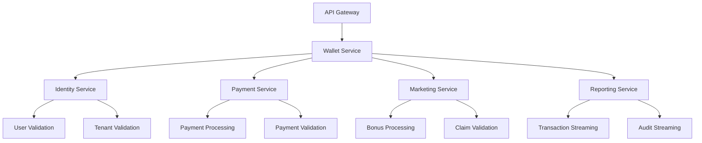
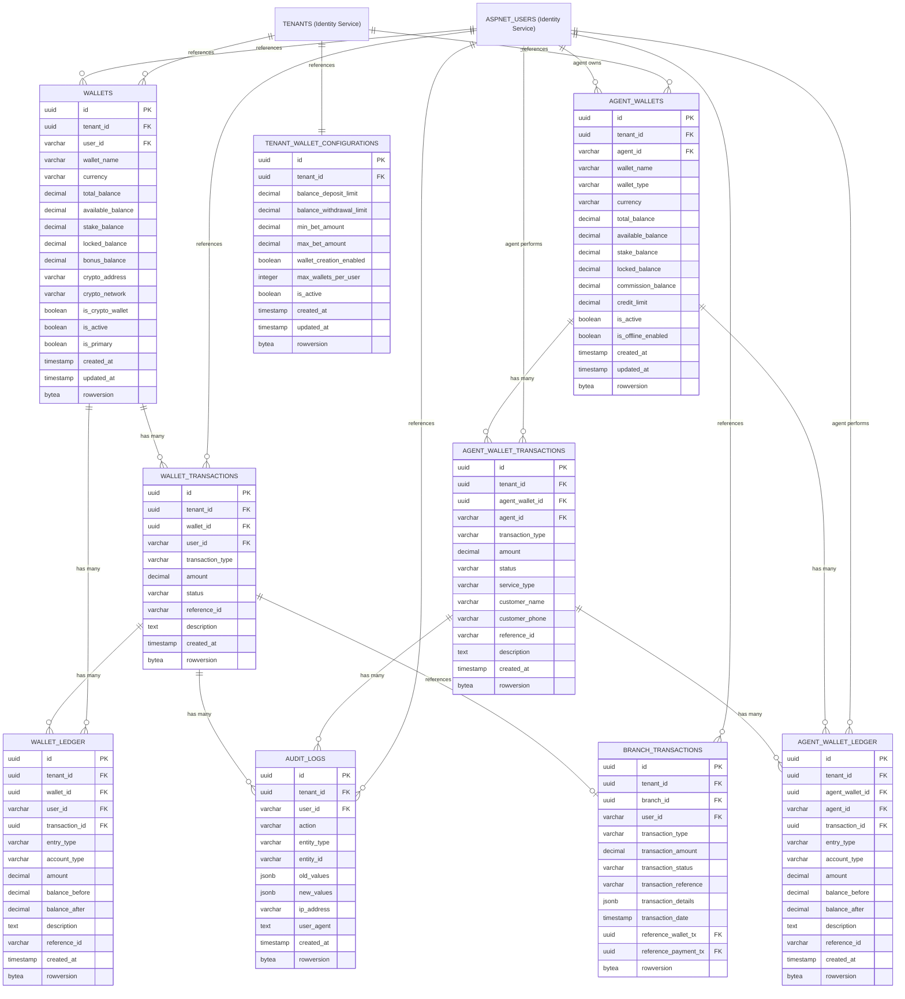

# 💰 **Wallet Service ER Diagram**

## 🎯 **Service Overview**
The Wallet Service handles all wallet management, balance tracking, and internal financial transactions for the betting platform. It manages multiple wallets per user (one per currency) with complete multi-tenant isolation and cryptocurrency support.

**Note: External payment processing is handled by the separate Payment Service. Bonus management is handled by the Marketing Service.**

## 📊 **Table Organization**

### **💰 1. WALLET MANAGEMENT (6 tables)**
- `WALLETS` - User wallet with balance partitions
- `WALLET_TRANSACTIONS` - Simplified transaction records
- `WALLET_LEDGER` - Comprehensive financial ledger
- `AGENT_WALLETS` - Agent-specific wallets for offline operations
- `AGENT_WALLET_TRANSACTIONS` - Agent wallet transaction records
- `AGENT_WALLET_LEDGER` - Agent wallet financial ledger

### **📋 2. AUDIT & LOGGING (1 table)**
- `AUDIT_LOGS` - Complete audit trail

### **⚙️ 3. WALLET CONFIGURATIONS (2 tables)**
- `TENANT_WALLET_CONFIGURATIONS` - Wallet and balance settings per tenant
- `BRANCH_TRANSACTIONS` - Branch financial transactions

## 🎯 **Total: 9 Tables**

**Note:** `MEMBER_CLAIMS` table moved to Market Service
**Note:** Agent wallets use simplified design without balance partitions for better performance

### **🔗 External Service References:**
- **TENANTS** → Referenced from Identity Service (not duplicated)
- **ASPNET_USERS** → Referenced from Identity Service (not duplicated)

## 🚀 **Key Features:**

### **✅ Multi-Currency Wallet System**
- **One Wallet per Currency** → Separate wallets for USD, EUR, BTC, ETH, USDT, etc.
- **8 Decimal Precision** → Supports Bitcoin (0.00000001 BTC) and other cryptos
- **No Currency Conversion** → Each currency stays in its own wallet
- **Crypto Support** → Bitcoin, Ethereum, BSC, Polygon networks

### **✅ Balance Management**
- **Total Balance** → Complete wallet balance per currency
- **Available Balance** → Available for betting and withdrawal
- **Stake Balance** → Stake balance (not withdrawable)
- **Locked Balance** → Temporarily unavailable funds
- **Bonus Balance** → Promotional and bonus funds

### **✅ High-Performance Operations**
- **Rowversion Support** → Optimistic concurrency control
- **Partitioned Tables** → Monthly partitions for scale
- **Auto-Cleanup** → TTL for temporary data
- **Multi-Tenant Isolation** → Complete data separation

---

## 📚 **Detailed Table Definitions**

### 1) **WALLETS** - Multi-Currency Wallet Management

> **Purpose:** Core wallet management with multiple wallets per user (one per currency)
> 
> **When to Use:**
> - **User Registration** → Create wallets for new users (USD, EUR, BTC, ETH, etc.)
> - **Currency Selection** → Users select which currency wallet to use for betting
> - **Balance Queries** → Get current balance for specific currency
> - **Balance Updates** → Update balances after deposits, withdrawals, bets per currency
> - **Wallet Management** → Enable/disable wallets, update wallet settings per currency
> - **Multi-Currency Management** → Manage different currency wallets separately
> 
> **Key Operations:**
> - Create currency-specific wallets for new user
> - Update balance after transaction in specific currency
> - Check balance before bet placement in selected currency
> - Validate withdrawal eligibility per currency
> - Manage currency-specific balance partitions

| **Column** | **Type** | **Default** | **Constraints** | **Description** |
|------------|----------|-------------|-----------------|-----------------|
| **id** | `uuid` | `gen_random_uuid()` | `PRIMARY KEY` | Unique wallet identifier |
| **tenant_id** | `uuid` | - | `NOT NULL, FK→TENANTS.id` | Multi-tenant isolation |
| **user_id** | `varchar(50)` | - | `NOT NULL, FK→ASPNET_USERS.id` | Wallet owner |
| **wallet_name** | `varchar(100)` | - | `NOT NULL` | Wallet display name (e.g., "My USD Wallet", "My Bitcoin Wallet") |
| **currency** | `varchar(10)` | `'USD'` | `NOT NULL` | Wallet currency (USD, EUR, BTC, ETH, USDT, BNB) |
| **total_balance** | `decimal(18,8)` | `0.00000000` | `NOT NULL, CHECK >= 0` | Total wallet balance (8 decimals for crypto) |
| **available_balance** | `decimal(18,8)` | `0.00000000` | `NOT NULL, CHECK >= 0` | Available for betting/withdrawal |
| **stake_balance** | `decimal(18,8)` | `0.00000000` | `NOT NULL, CHECK >= 0` | Stake balance (not withdrawable) |
| **locked_balance** | `decimal(18,8)` | `0.00000000` | `NOT NULL, CHECK >= 0` | Temporarily locked funds |
| **bonus_balance** | `decimal(18,8)` | `0.00000000` | `NOT NULL, CHECK >= 0` | Promotional/bonus funds |
| **crypto_address** | `varchar(100)` | `null` | - | Crypto wallet address (for crypto wallets) |
| **crypto_network** | `varchar(20)` | `null` | - | Crypto network (bitcoin, ethereum, bsc, polygon) |
| **is_crypto_wallet** | `boolean` | `false` | `NOT NULL` | Flag for crypto wallet |
| **is_active** | `boolean` | `true` | `NOT NULL` | Wallet status |
| **is_primary** | `boolean` | `false` | `NOT NULL` | Primary wallet flag for this currency |
| **created_at** | `timestamp` | `now()` | `NOT NULL` | Creation timestamp |
| **updated_at** | `timestamp` | `now()` | `NOT NULL` | Last update timestamp |
| **rowversion** | `bytea` | `gen_random_bytes(8)` | `NOT NULL` | Row version for optimistic concurrency |

#### **₿ Multi-Currency Support:**

> **The wallet system supports multiple currencies with separate wallets per currency:**

##### **Supported Currencies:**
- **Fiat:** USD, EUR, GBP, CAD, AUD, JPY
- **Crypto:** BTC, ETH, USDT, USDC, BNB, ADA, SOL
- **Stablecoins:** USDT, USDC, DAI, BUSD

##### **Multi-Currency Operations:**
- **One Wallet per Currency** → Separate wallets for each currency type
- **No Currency Conversion** → Each currency stays in its own wallet
- **Real Values** → Users see actual currency amounts
- **Crypto Integration** → Bitcoin, Ethereum, BSC, Polygon networks

##### **Multi-Currency Wallet Example:**
```
User: John Smith
├── USD Wallet: $1,000.00
├── EUR Wallet: €500.00
├── BTC Wallet: 0.05 BTC
├── ETH Wallet: 2.5 ETH
└── USDT Wallet: 1,000 USDT
```

### 2) **WALLET_TRANSACTIONS** - Transaction Records & Temporary Operations

> **Purpose:** Transaction records for all wallet operations including temporary/pending states
> 
> **When to Use:**
> - **Transaction Recording** → Record all transaction information
> - **User History** → Show transaction history to users
> - **Transaction Status** → Track transaction processing status (pending/completed/failed)
> - **Temporary Operations** → Handle pending bets, withdrawals, deposits
> - **External References** → Link to external systems (bets, payments)
> - **Quick Lookups** → Fast transaction queries for user interface
> 
> **Key Operations:**
> - Record all transaction information
> - Track transaction status and temporary states
> - Handle pending operations with status='pending'
> - Link to external references
> - Provide user transaction history
> - Support quick transaction lookups

| **Column** | **Type** | **Default** | **Constraints** | **Description** |
|------------|----------|-------------|-----------------|-----------------|
| **id** | `uuid` | `gen_random_uuid()` | `PRIMARY KEY` | Unique transaction identifier |
| **tenant_id** | `uuid` | - | `NOT NULL, FK→TENANTS.id` | Multi-tenant isolation |
| **wallet_id** | `uuid` | - | `NOT NULL, FK→WALLETS.id` | Wallet reference |
| **user_id** | `varchar(50)` | - | `NOT NULL, FK→ASPNET_USERS.id` | Transaction owner |
| **transaction_type** | `varchar(30)` | - | `NOT NULL` | Transaction type (bet_placed/bet_won/bet_lost/deposit/withdrawal/refund/bonus) |
| **amount** | `decimal(18,8)` | - | `NOT NULL, CHECK != 0` | Transaction amount (8 decimals for crypto) |
| **status** | `varchar(20)` | `'pending'` | `NOT NULL` | Transaction status (pending/completed/failed/cancelled) |
| **reference_id** | `varchar(100)` | `null` | - | External reference (bet_id/game_id/payment_id) |
| **description** | `text` | `null` | - | Transaction description |
| **created_at** | `timestamp` | `now()` | `NOT NULL` | Transaction timestamp |
| **rowversion** | `bytea` | `gen_random_bytes(8)` | `NOT NULL` | Row version for optimistic concurrency |


### 3) **WALLET_LEDGER** - Comprehensive Financial Ledger

> **Purpose:** Comprehensive financial ledger with double-entry bookkeeping for complete transaction tracking
> 
> **When to Use:**
> - **Double-Entry Bookkeeping** → Every transaction has debit and credit entries
> - **Financial Reporting** → Generate comprehensive financial reports
> - **Audit Compliance** → Complete audit trail for regulatory requirements
> - **Balance Reconciliation** → Verify wallet balances against ledger entries
> - **Financial Analysis** → Detailed financial analytics and reporting
> - **Transaction Tracing** → Track complete transaction flow and impact
> 
> **Key Operations:**
> - Record debit/credit entries for every transaction
> - Generate balance sheets and financial reports
> - Reconcile wallet balances with ledger entries
> - Track transaction impact on all balance types
> - Generate audit trails for compliance
> - Support financial analytics and reporting

| **Column** | **Type** | **Default** | **Constraints** | **Description** |
|------------|----------|-------------|-----------------|-----------------|
| **id** | `uuid` | `gen_random_uuid()` | `PRIMARY KEY` | Unique ledger entry identifier |
| **tenant_id** | `uuid` | - | `NOT NULL, FK→TENANTS.id` | Multi-tenant isolation |
| **wallet_id** | `uuid` | - | `NOT NULL, FK→WALLETS.id` | Wallet reference |
| **user_id** | `varchar(50)` | - | `NOT NULL, FK→ASPNET_USERS.id` | Transaction owner |
| **transaction_id** | `uuid` | - | `NOT NULL, FK→WALLET_TRANSACTIONS.id` | Related transaction |
| **entry_type** | `varchar(20)` | - | `NOT NULL` | Entry type (debit/credit) |
| **account_type** | `varchar(30)` | - | `NOT NULL` | Account type (total_balance/available_balance/stake_balance/locked_balance/bonus_balance) |
| **amount** | `decimal(18,8)` | - | `NOT NULL, CHECK > 0` | Entry amount (8 decimals for crypto) |
| **balance_before** | `decimal(18,8)` | - | `NOT NULL, CHECK >= 0` | Balance before entry |
| **balance_after** | `decimal(18,8)` | - | `NOT NULL, CHECK >= 0` | Balance after entry |
| **description** | `text` | `null` | - | Entry description |
| **reference_id** | `varchar(100)` | `null` | - | External reference |
| **created_at** | `timestamp` | `now()` | `NOT NULL` | Entry timestamp |
| **rowversion** | `bytea` | `gen_random_bytes(8)` | `NOT NULL` | Row version for optimistic concurrency |


**Note:** `MEMBER_CLAIMS` table moved to Market Service for better separation of concerns.
**Note:** Temporary operations now handled by WALLET_TRANSACTIONS with status='pending' for simpler architecture.

### 4) **TENANT_WALLET_CONFIGURATIONS** - Wallet Settings

> **Purpose:** Tenant-specific wallet configuration and limits management
> 
> **When to Use:**
> - **Tenant Setup** → Configure wallet settings for new tenants
> - **Limit Management** → Set daily deposit/withdrawal limits per tenant
> - **Betting Limits** → Configure minimum and maximum bet amounts
> - **Wallet Policies** → Enable/disable multiple wallets per user
> - **Compliance Settings** → Set regulatory limits and restrictions
> - **Tenant Customization** → Different settings for different tenant types
> 
> **Key Operations:**
> - Configure tenant wallet limits
> - Set betting amount restrictions
> - Enable/disable wallet features
> - Update tenant-specific policies
> - Monitor limit compliance
> - Generate configuration reports

| **Column** | **Type** | **Default** | **Constraints** | **Description** |
|------------|----------|-------------|-----------------|-----------------|
| **id** | `uuid` | `gen_random_uuid()` | `PRIMARY KEY` | Unique config identifier |
| **tenant_id** | `uuid` | - | `NOT NULL, UNIQUE, FK→TENANTS.id` | Multi-tenant isolation |
| **balance_deposit_limit** | `decimal(18,8)` | `10000.00000000` | `NOT NULL, CHECK > 0` | Daily deposit limit (8 decimals for crypto) |
| **balance_withdrawal_limit** | `decimal(18,8)` | `5000.00000000` | `NOT NULL, CHECK > 0` | Daily withdrawal limit (8 decimals for crypto) |
| **min_bet_amount** | `decimal(18,8)` | `1.00000000` | `NOT NULL, CHECK > 0` | Minimum bet amount (8 decimals for crypto) |
| **max_bet_amount** | `decimal(18,8)` | `1000.00000000` | `NOT NULL, CHECK > 0` | Maximum bet amount (8 decimals for crypto) |
| **wallet_creation_enabled** | `boolean` | `true` | `NOT NULL` | Allow multiple wallets |
| **max_wallets_per_user** | `integer` | `5` | `NOT NULL, CHECK > 0` | Maximum wallets per user |
| **is_active** | `boolean` | `true` | `NOT NULL` | Configuration status |
| **created_at** | `timestamp` | `now()` | `NOT NULL` | Creation timestamp |
| **updated_at** | `timestamp` | `now()` | `NOT NULL` | Last update timestamp |
| **rowversion** | `bytea` | `gen_random_bytes(8)` | `NOT NULL` | Row version for optimistic concurrency |


### 5) **AUDIT_LOGS** - Complete Audit Trail

> **Purpose:** Complete audit trail for security, compliance, and regulatory requirements
> 
> **When to Use:**
> - **Security Auditing** → Track all wallet operations for security monitoring
> - **Compliance Reporting** → Meet regulatory requirements for financial transactions
> - **Fraud Detection** → Monitor suspicious activities and transaction patterns
> - **Dispute Resolution** → Provide evidence for transaction disputes
> - **Change Tracking** → Record all modifications to wallet data
> - **Forensic Analysis** → Investigate security incidents and unauthorized access
> 
> **Key Operations:**
> - Log all wallet operations
> - Track user actions and changes
> - Monitor for suspicious activities
> - Generate audit reports
> - Investigate security incidents
> - Maintain compliance records

| **Column** | **Type** | **Default** | **Constraints** | **Description** |
|------------|----------|-------------|-----------------|-----------------|
| **id** | `uuid` | `gen_random_uuid()` | `PRIMARY KEY` | Unique audit log identifier |
| **tenant_id** | `uuid` | - | `NOT NULL, FK→TENANTS.id` | Multi-tenant isolation |
| **user_id** | `varchar(50)` | `null` | `FK→ASPNET_USERS.id` | User who performed action |
| **action** | `varchar(30)` | - | `NOT NULL` | Action type (create/update/delete/transfer/bet/withdrawal) |
| **entity_type** | `varchar(30)` | - | `NOT NULL` | Entity type (wallet/transaction/balance/claim) |
| **entity_id** | `varchar(100)` | - | `NOT NULL` | ID of affected entity |
| **old_values** | `jsonb` | `null` | - | Previous values (JSON) |
| **new_values** | `jsonb` | `null` | - | New values (JSON) |
| **ip_address** | `varchar(45)` | `null` | - | User IP address |
| **user_agent** | `text` | `null` | - | User agent string |
| **created_at** | `timestamp` | `now()` | `NOT NULL` | Audit timestamp |
| **rowversion** | `bytea` | `gen_random_bytes(8)` | `NOT NULL` | Row version for optimistic concurrency |

#### **📋 Sample Audit Log Entries:**

##### **User Wallet Operations:**
```json
// User deposit
{
  "action": "wallet_deposit",
  "entity_type": "wallet_transaction",
  "entity_id": "tx_user_001",
  "old_values": {"available_balance": 1000.00},
  "new_values": {"available_balance": 1500.00},
  "description": "User deposit of $500.00 via credit card"
}

// User bet placement
{
  "action": "bet_placed",
  "entity_type": "wallet_transaction", 
  "entity_id": "tx_user_002",
  "old_values": {"available_balance": 1500.00, "stake_balance": 0.00, "locked_balance": 0.00},
  "new_values": {"available_balance": 1300.00, "stake_balance": 200.00, "locked_balance": 0.00},
  "description": "User placed $200 bet on Manchester United vs Liverpool"
}

// User bet result (win)
{
  "action": "bet_won",
  "entity_type": "wallet_transaction",
  "entity_id": "tx_user_003", 
  "old_values": {"available_balance": 1300.00, "stake_balance": 200.00, "locked_balance": 0.00},
  "new_values": {"available_balance": 1500.00, "stake_balance": 0.00, "locked_balance": 0.00},
  "description": "User won $200 bet, total payout $400"
}
```

##### **Agent Wallet Operations:**
```json
// Agent cash collection
{
  "action": "agent_cash_collection",
  "entity_type": "agent_wallet_transaction",
  "entity_id": "tx_agent_001",
  "old_values": {"available_balance": 500.00, "stake_balance": 0.00, "total_balance": 500.00},
  "new_values": {"available_balance": 600.00, "stake_balance": 0.00, "total_balance": 600.00},
  "description": "Agent John collected $100 cash from customer Alice"
}

// Agent service credit
{
  "action": "agent_service_credit",
  "entity_type": "agent_wallet_transaction",
  "entity_id": "tx_agent_002",
  "old_values": {"available_balance": 600.00, "stake_balance": 0.00, "commission_balance": 50.00},
  "new_values": {"available_balance": 550.00, "stake_balance": 50.00, "commission_balance": 50.00},
  "description": "Agent John provided $50 credit to customer Bob for bet placement"
}

// Agent commission earned
{
  "action": "agent_commission_earned",
  "entity_type": "agent_wallet_transaction",
  "entity_id": "tx_agent_003",
  "old_values": {"commission_balance": 50.00, "total_balance": 600.00},
  "new_values": {"commission_balance": 75.00, "total_balance": 625.00},
  "description": "Agent John earned $25 commission from platform"
}
```

##### **Branch Operations:**
```json
// Physical branch deposit
{
  "action": "branch_deposit",
  "entity_type": "branch_transaction",
  "entity_id": "tx_branch_001",
  "old_values": {"transaction_status": "pending"},
  "new_values": {"transaction_status": "completed"},
  "description": "Customer deposited $300 cash at Branch #123"
}

// Physical branch withdrawal
{
  "action": "branch_withdrawal", 
  "entity_type": "branch_transaction",
  "entity_id": "tx_branch_002",
  "old_values": {"transaction_status": "pending"},
  "new_values": {"transaction_status": "completed"},
  "description": "Customer withdrew $200 cash at Branch #123"
}
```

##### **System Operations:**
```json
// Wallet creation
{
  "action": "wallet_created",
  "entity_type": "wallet",
  "entity_id": "wallet_user_001",
  "old_values": null,
  "new_values": {"currency": "USD", "total_balance": 0.00},
  "description": "Created new USD wallet for user registration"
}

// Wallet deactivation
{
  "action": "wallet_deactivated",
  "entity_type": "wallet", 
  "entity_id": "wallet_user_002",
  "old_values": {"is_active": true},
  "new_values": {"is_active": false},
  "description": "Deactivated wallet due to account closure"
}
```


### 6) **AGENT_WALLETS** - Agent-Specific Wallets for Offline Operations

> **Purpose:** Agent wallets for offline agents who serve walking users with postpaid/prepaid services
> 
> **When to Use:**
> - **Agent Operations** → Agents managing their own wallet for offline services
> - **Walking Users** → Agents providing services to users who don't have digital wallets
> - **Postpaid Services** → Agents offering credit-based services to users
> - **Prepaid Services** → Agents accepting cash payments for services
> - **Agent Commission** → Track agent earnings and commissions
> - **Offline Transactions** → Handle transactions when agents are offline
> 
> **Key Operations:**
> - Create agent wallets for offline operations
> - Process agent-to-user transactions
> - Handle postpaid credit services
> - Manage prepaid cash collections
> - Track agent commissions
> - Generate agent financial reports

| **Column** | **Type** | **Default** | **Constraints** | **Description** |
|------------|----------|-------------|-----------------|-----------------|
| **id** | `uuid` | `gen_random_uuid()` | `PRIMARY KEY` | Unique agent wallet identifier |
| **tenant_id** | `uuid` | - | `NOT NULL, FK→TENANTS.id` | Multi-tenant isolation |
| **agent_id** | `varchar(50)` | - | `NOT NULL, FK→ASPNET_USERS.id` | Agent owner |
| **wallet_name** | `varchar(100)` | - | `NOT NULL` | Agent wallet name (e.g., "Agent John's Wallet") |
| **wallet_type** | `varchar(20)` | `'postpaid'` | `NOT NULL` | Wallet type (postpaid/prepaid/hybrid) |
| **currency** | `varchar(10)` | `'USD'` | `NOT NULL` | Wallet currency |
| **total_balance** | `decimal(18,8)` | `0.00000000` | `NOT NULL, CHECK >= 0` | Total agent balance |
| **available_balance** | `decimal(18,8)` | `0.00000000` | `NOT NULL, CHECK >= 0` | Available for services |
| **locked_balance** | `decimal(18,8)` | `0.00000000` | `NOT NULL, CHECK >= 0` | Locked funds |
| **commission_balance** | `decimal(18,8)` | `0.00000000` | `NOT NULL, CHECK >= 0` | Agent commission earnings |
| **credit_limit** | `decimal(18,8)` | `1000.00000000` | `NOT NULL, CHECK >= 0` | Postpaid credit limit |
| **is_active** | `boolean` | `true` | `NOT NULL` | Agent wallet status |
| **is_offline_enabled** | `boolean` | `true` | `NOT NULL` | Allow offline operations |
| **created_at** | `timestamp` | `now()` | `NOT NULL` | Creation timestamp |
| **updated_at** | `timestamp` | `now()` | `NOT NULL` | Last update timestamp |
| **rowversion** | `bytea` | `gen_random_bytes(8)` | `NOT NULL` | Row version for optimistic concurrency |

### 7) **AGENT_WALLET_TRANSACTIONS** - Agent Wallet Transaction Records

> **Purpose:** Transaction records for agent wallet operations including user services and commissions
> 
> **When to Use:**
> - **Agent Services** → Record services provided to walking users
> - **Cash Collections** → Track cash payments received by agents
> - **Commission Tracking** → Record agent commission earnings
> - **Credit Services** → Track postpaid credit given to users
> - **Agent Replenishment** → Record agent wallet top-ups
> - **Service History** → Maintain history of agent services
> 
> **Key Operations:**
> - Record agent service transactions
> - Track cash collections from users
> - Process commission payments
> - Handle credit service transactions
> - Manage agent wallet replenishments
> - Generate agent service reports

| **Column** | **Type** | **Default** | **Constraints** | **Description** |
|------------|----------|-------------|-----------------|-----------------|
| **id** | `uuid` | `gen_random_uuid()` | `PRIMARY KEY` | Unique transaction identifier |
| **tenant_id** | `uuid` | - | `NOT NULL, FK→TENANTS.id` | Multi-tenant isolation |
| **agent_wallet_id** | `uuid` | - | `NOT NULL, FK→AGENT_WALLETS.id` | Agent wallet reference |
| **agent_id** | `varchar(50)` | - | `NOT NULL, FK→ASPNET_USERS.id` | Agent performing transaction |
| **transaction_type** | `varchar(30)` | - | `NOT NULL` | Transaction type (service_provided/cash_collected/commission_earned/credit_given/replenishment) |
| **amount** | `decimal(18,8)` | - | `NOT NULL, CHECK != 0` | Transaction amount |
| **status** | `varchar(20)` | `'completed'` | `NOT NULL` | Transaction status (pending/completed/failed/cancelled) |
| **service_type** | `varchar(30)` | `null` | - | Service type (bet_placement/payout/refund/consultation) |
| **customer_name** | `varchar(100)` | `null` | - | Walking user name |
| **customer_phone** | `varchar(20)` | `null` | - | Walking user phone |
| **reference_id** | `varchar(100)` | `null` | - | External reference (bet_id/game_id) |
| **description** | `text` | `null` | - | Transaction description |
| **created_at** | `timestamp` | `now()` | `NOT NULL` | Transaction timestamp |
| **rowversion** | `bytea` | `gen_random_bytes(8)` | `NOT NULL` | Row version for optimistic concurrency |

### 8) **AGENT_WALLET_LEDGER** - Agent Wallet Financial Ledger

> **Purpose:** Comprehensive financial ledger for agent wallet operations with double-entry bookkeeping
> 
> **When to Use:**
> - **Agent Financial Tracking** → Track all agent wallet financial activities
> - **Commission Accounting** → Record agent commission earnings and payments
> - **Cash Flow Management** → Track cash collections and disbursements
> - **Service Revenue** → Record revenue from services provided to walking users
> - **Agent Audit Trail** → Complete financial audit trail for agent operations
> - **Financial Reporting** → Generate agent financial reports and analytics
> 
> **Key Operations:**
> - Record debit/credit entries for agent transactions
> - Track commission earnings and payments
> - Monitor cash flow and service revenue
> - Generate agent financial reports
> - Reconcile agent wallet balances
> - Support agent financial analytics

| **Column** | **Type** | **Default** | **Constraints** | **Description** |
|------------|----------|-------------|-----------------|-----------------|
| **id** | `uuid` | `gen_random_uuid()` | `PRIMARY KEY` | Unique ledger entry identifier |
| **tenant_id** | `uuid` | - | `NOT NULL, FK→TENANTS.id` | Multi-tenant isolation |
| **agent_wallet_id** | `uuid` | - | `NOT NULL, FK→AGENT_WALLETS.id` | Agent wallet reference |
| **agent_id** | `varchar(50)` | - | `NOT NULL, FK→ASPNET_USERS.id` | Agent performing transaction |
| **transaction_id** | `uuid` | - | `NOT NULL, FK→AGENT_WALLET_TRANSACTIONS.id` | Related transaction |
| **entry_type** | `varchar(20)` | - | `NOT NULL` | Entry type (debit/credit) |
| **account_type** | `varchar(30)` | - | `NOT NULL` | Account type (total_balance/available_balance/stake_balance/locked_balance/commission_balance) |
| **amount** | `decimal(18,8)` | - | `NOT NULL, CHECK > 0` | Entry amount (8 decimals for crypto) |
| **balance_before** | `decimal(18,8)` | - | `NOT NULL, CHECK >= 0` | Balance before entry |
| **balance_after** | `decimal(18,8)` | - | `NOT NULL, CHECK >= 0` | Balance after entry |
| **description** | `text` | `null` | - | Entry description |
| **reference_id** | `varchar(100)` | `null` | - | External reference |
| **created_at** | `timestamp` | `now()` | `NOT NULL` | Entry timestamp |
| **rowversion** | `bytea` | `gen_random_bytes(8)` | `NOT NULL` | Row version for optimistic concurrency |

### 9) **BRANCH_TRANSACTIONS** - Physical Branch Operations

> **Purpose:** Physical branch operations with POS integration and cross-service references
> 
> **When to Use:**
> - **Physical Deposits** → Record cash deposits made at physical branches
> - **Physical Withdrawals** → Record cash withdrawals at physical locations
> - **POS Integration** → Connect with point-of-sale systems at branches
> - **Cashier Operations** → Track transactions performed by branch staff
> - **Cross-Service Integration** → Link with wallet and payment services
> - **Physical Audit Trail** → Maintain records of all physical branch transactions
> 
> **Key Operations:**
> - Process cash deposits at branches
> - Handle cash withdrawals
> - Integrate with POS systems
> - Track cashier activities
> - Link with digital wallet transactions
> - Generate branch transaction reports

| **Column** | **Type** | **Default** | **Constraints** | **Description** |
|------------|----------|-------------|-----------------|-----------------|
| **id** | `uuid` | `gen_random_uuid()` | `PRIMARY KEY` | Unique transaction identifier |
| **tenant_id** | `uuid` | - | `NOT NULL, FK→TENANTS.id` | Multi-tenant isolation |
| **branch_id** | `uuid` | - | `NOT NULL, FK→BRANCHES.id` | Branch reference |
| **user_id** | `varchar(50)` | `null` | `FK→ASPNET_USERS.id` | Operator/cashier |
| **transaction_type** | `varchar(30)` | - | `NOT NULL` | Transaction type (deposit/withdrawal/payout/refund) |
| **transaction_amount** | `decimal(18,8)` | - | `NOT NULL, CHECK > 0` | Transaction amount (8 decimals for crypto) |
| **transaction_status** | `varchar(20)` | `'pending'` | `NOT NULL` | Status (pending/success/failed/cancelled) |
| **transaction_reference** | `varchar(100)` | `null` | - | External reference |
| **transaction_details** | `jsonb` | `'{}'` | `NOT NULL` | POS payload (JSON) |
| **transaction_date** | `timestamp` | `now()` | `NOT NULL` | Transaction timestamp |
| **reference_wallet_tx** | `uuid` | `null` | `FK→WALLET_TRANSACTIONS.id` | Wallet Service cross-reference |
| **reference_payment_tx** | `uuid` | `null` | `FK→PAYMENT_TRANSACTIONS.id` | Payment Service cross-reference |
| **rowversion** | `bytea` | `gen_random_bytes(8)` | `NOT NULL` | Row version for optimistic concurrency |


---

## 🚀 **gRPC Service Definition - Implementation Ready**

### **📋 Service: WalletService**

```protobuf
syntax = "proto3";

package convex.wallet.v1;

import "google/protobuf/timestamp.proto";
import "google/protobuf/empty.proto";

option csharp_namespace = "Convex.Wallet.V1";

// ============================================================================
// CORE WALLET OPERATIONS
// ============================================================================

service WalletService {
  // ============================================================================
  // WALLET MANAGEMENT
  // ============================================================================
  
  // Create new wallet for user
  rpc CreateWallet(CreateWalletRequest) returns (CreateWalletResponse);
  
  // Get user's wallets
rpc GetUserWallets(GetUserWalletsRequest) returns (GetUserWalletsResponse);

  // Get specific wallet
  rpc GetWallet(GetWalletRequest) returns (GetWalletResponse);
  
  // Update wallet details
  rpc UpdateWallet(UpdateWalletRequest) returns (UpdateWalletResponse);
  
  // Deactivate wallet
  rpc DeactivateWallet(DeactivateWalletRequest) returns (DeactivateWalletResponse);

  // ============================================================================
  // BALANCE OPERATIONS
  // ============================================================================
  
  // Get wallet balance
  rpc GetBalance(GetBalanceRequest) returns (GetBalanceResponse);
  
  // Update balance (internal use)
  rpc UpdateBalance(UpdateBalanceRequest) returns (UpdateBalanceResponse);
  
  // Lock funds for pending operations
  rpc LockFunds(LockFundsRequest) returns (LockFundsResponse);
  
  // Unlock funds after operation completion
  rpc UnlockFunds(UnlockFundsRequest) returns (UnlockFundsResponse);

  // ============================================================================
  // TRANSACTION PROCESSING
  // ============================================================================
  
  // Process deposit
  rpc ProcessDeposit(ProcessDepositRequest) returns (ProcessDepositResponse);
  
  // Process withdrawal
  rpc ProcessWithdrawal(ProcessWithdrawalRequest) returns (ProcessWithdrawalResponse);
  
  // Process bet transaction
  rpc ProcessBet(ProcessBetRequest) returns (ProcessBetResponse);
  
  // Process bet result (win/loss)
  rpc ProcessBetResult(ProcessBetResultRequest) returns (ProcessBetResultResponse);
  
  // Process refund
  rpc ProcessRefund(ProcessRefundRequest) returns (ProcessRefundResponse);

  // ============================================================================
  // TRANSACTION HISTORY
  // ============================================================================
  
// Get transaction history
rpc GetTransactionHistory(GetTransactionHistoryRequest) returns (GetTransactionHistoryResponse);

// Get transaction by ID
rpc GetTransaction(GetTransactionRequest) returns (GetTransactionResponse);

// Search transactions
rpc SearchTransactions(SearchTransactionsRequest) returns (SearchTransactionsResponse);

  // ============================================================================
  // AGENT WALLET OPERATIONS
  // ============================================================================
  
  // Create agent wallet
  rpc CreateAgentWallet(CreateAgentWalletRequest) returns (CreateAgentWalletResponse);
  
  // Get agent wallets
  rpc GetAgentWallets(GetAgentWalletsRequest) returns (GetAgentWalletsResponse);
  
  // Process agent transaction
  rpc ProcessAgentTransaction(ProcessAgentTransactionRequest) returns (ProcessAgentTransactionResponse);
  
  // Get agent transaction history
  rpc GetAgentTransactionHistory(GetAgentTransactionHistoryRequest) returns (GetAgentTransactionHistoryResponse);

  // ============================================================================
  // BRANCH OPERATIONS
  // ============================================================================
  
  // Process branch deposit
  rpc ProcessBranchDeposit(ProcessBranchDepositRequest) returns (ProcessBranchDepositResponse);
  
  // Process branch withdrawal
  rpc ProcessBranchWithdrawal(ProcessBranchWithdrawalRequest) returns (ProcessBranchWithdrawalResponse);
  
  // Get branch transactions
  rpc GetBranchTransactions(GetBranchTransactionsRequest) returns (GetBranchTransactionsResponse);

  // ============================================================================
  // CONFIGURATION
  // ============================================================================
  
  // Get tenant configuration
rpc GetTenantConfiguration(GetTenantConfigurationRequest) returns (GetTenantConfigurationResponse);

// Update tenant configuration
rpc UpdateTenantConfiguration(UpdateTenantConfigurationRequest) returns (UpdateTenantConfigurationResponse);

// Validate transaction limits
rpc ValidateLimits(ValidateLimitsRequest) returns (ValidateLimitsResponse);

  // ============================================================================
  // AUDIT & SECURITY
  // ============================================================================
  
  // Get audit logs
  rpc GetAuditLogs(GetAuditLogsRequest) returns (GetAuditLogsResponse);
  
  // Log security event
  rpc LogSecurityEvent(LogSecurityEventRequest) returns (LogSecurityEventResponse);

  // ============================================================================
  // HEALTH & MONITORING
  // ============================================================================
  
  // Health check
  rpc HealthCheck(google.protobuf.Empty) returns (HealthCheckResponse);
  
  // Get service metrics
  rpc GetMetrics(google.protobuf.Empty) returns (GetMetricsResponse);
}

// ============================================================================
// REQUEST/RESPONSE MESSAGES
// ============================================================================

// Wallet Management
message CreateWalletRequest {
  string tenant_id = 1;
  string user_id = 2;
  string wallet_name = 3;
  string currency = 4;
  bool is_crypto_wallet = 5;
  string crypto_network = 6;
}

message CreateWalletResponse {
  bool success = 1;
  string wallet_id = 2;
  string message = 3;
}

message GetUserWalletsRequest {
  string tenant_id = 1;
  string user_id = 2;
  string currency = 3; // Optional filter
}

message GetUserWalletsResponse {
  repeated Wallet wallets = 1;
}

message GetWalletRequest {
  string tenant_id = 1;
  string wallet_id = 2;
}

message GetWalletResponse {
  Wallet wallet = 1;
}

message UpdateWalletRequest {
  string tenant_id = 1;
  string wallet_id = 2;
  string wallet_name = 3;
  bool is_active = 4;
}

message UpdateWalletResponse {
  bool success = 1;
  string message = 2;
}

message DeactivateWalletRequest {
  string tenant_id = 1;
  string wallet_id = 2;
}

message DeactivateWalletResponse {
  bool success = 1;
  string message = 2;
}

// Balance Operations
message GetBalanceRequest {
  string tenant_id = 1;
  string wallet_id = 2;
}

message GetBalanceResponse {
  string wallet_id = 1;
  string currency = 2;
  string total_balance = 3;
  string available_balance = 4;
  string stake_balance = 5;
  string locked_balance = 6;
  string bonus_balance = 7;
}

message UpdateBalanceRequest {
  string tenant_id = 1;
  string wallet_id = 2;
  string total_balance = 3;
  string available_balance = 4;
  string stake_balance = 5;
  string locked_balance = 6;
  string bonus_balance = 7;
  string reason = 8;
}

message UpdateBalanceResponse {
  bool success = 1;
  string message = 2;
}

message LockFundsRequest {
  string tenant_id = 1;
  string wallet_id = 2;
  string amount = 3;
  string reason = 4;
  string reference_id = 5;
}

message LockFundsResponse {
  bool success = 1;
  string transaction_id = 2;
  string message = 3;
}

message UnlockFundsRequest {
  string tenant_id = 1;
  string wallet_id = 2;
  string amount = 3;
  string reason = 4;
  string reference_id = 5;
}

message UnlockFundsResponse {
  bool success = 1;
  string transaction_id = 2;
  string message = 3;
}

// Transaction Processing
message ProcessDepositRequest {
  string tenant_id = 1;
  string wallet_id = 2;
  string user_id = 3;
  string amount = 4;
  string currency = 5;
  string payment_method = 6;
  string reference_id = 7;
  string description = 8;
}

message ProcessDepositResponse {
  bool success = 1;
  string transaction_id = 2;
  string new_balance = 3;
  string message = 4;
}

message ProcessWithdrawalRequest {
  string tenant_id = 1;
  string wallet_id = 2;
  string user_id = 3;
  string amount = 4;
  string currency = 5;
  string withdrawal_method = 6;
  string reference_id = 7;
  string description = 8;
}

message ProcessWithdrawalResponse {
  bool success = 1;
  string transaction_id = 2;
  string new_balance = 3;
  string message = 4;
}

message ProcessBetRequest {
  string tenant_id = 1;
  string wallet_id = 2;
  string user_id = 3;
  string amount = 4;
  string currency = 5;
  string bet_id = 6;
  string game_id = 7;
  string description = 8;
}

message ProcessBetResponse {
  bool success = 1;
  string transaction_id = 2;
  string new_balance = 3;
  string message = 4;
}

message ProcessBetResultRequest {
  string tenant_id = 1;
  string wallet_id = 2;
  string user_id = 3;
  string bet_id = 4;
  string result = 5; // "win", "loss", "push"
  string amount = 6;
  string currency = 7;
  string description = 8;
}

message ProcessBetResultResponse {
  bool success = 1;
  string transaction_id = 2;
  string new_balance = 3;
  string message = 4;
}

message ProcessRefundRequest {
  string tenant_id = 1;
  string wallet_id = 2;
  string user_id = 3;
  string amount = 4;
  string currency = 5;
  string original_transaction_id = 6;
  string reason = 7;
  string description = 8;
}

message ProcessRefundResponse {
  bool success = 1;
  string transaction_id = 2;
  string new_balance = 3;
  string message = 4;
}

// Transaction History
message GetTransactionHistoryRequest {
  string tenant_id = 1;
  string user_id = 2;
  string wallet_id = 3;
  google.protobuf.Timestamp start_date = 4;
  google.protobuf.Timestamp end_date = 5;
  int32 page_size = 6;
  int32 page_number = 7;
}

message GetTransactionHistoryResponse {
  repeated Transaction transactions = 1;
  int32 total_count = 2;
  int32 page_number = 3;
  int32 page_size = 4;
}

message GetTransactionRequest {
  string tenant_id = 1;
  string transaction_id = 2;
}

message GetTransactionResponse {
  Transaction transaction = 1;
}

message SearchTransactionsRequest {
  string tenant_id = 1;
  string user_id = 2;
  string transaction_type = 3;
  string status = 4;
  string currency = 5;
  google.protobuf.Timestamp start_date = 6;
  google.protobuf.Timestamp end_date = 7;
  int32 page_size = 8;
  int32 page_number = 9;
}

message SearchTransactionsResponse {
  repeated Transaction transactions = 1;
  int32 total_count = 2;
  int32 page_number = 3;
  int32 page_size = 4;
}

// Agent Wallet Operations
message CreateAgentWalletRequest {
  string tenant_id = 1;
  string agent_id = 2;
  string wallet_name = 3;
  string wallet_type = 4; // "postpaid", "prepaid", "hybrid"
  string currency = 5;
  string credit_limit = 6;
}

message CreateAgentWalletResponse {
  bool success = 1;
  string agent_wallet_id = 2;
  string message = 3;
}

message GetAgentWalletsRequest {
  string tenant_id = 1;
  string agent_id = 2;
}

message GetAgentWalletsResponse {
  repeated AgentWallet agent_wallets = 1;
}

message ProcessAgentTransactionRequest {
  string tenant_id = 1;
  string agent_wallet_id = 2;
  string agent_id = 3;
  string transaction_type = 4;
  string amount = 5;
  string service_type = 6;
  string customer_name = 7;
  string customer_phone = 8;
  string reference_id = 9;
  string description = 10;
}

message ProcessAgentTransactionResponse {
  bool success = 1;
  string transaction_id = 2;
  string new_balance = 3;
  string message = 4;
}

message GetAgentTransactionHistoryRequest {
  string tenant_id = 1;
  string agent_id = 2;
  string agent_wallet_id = 3;
  google.protobuf.Timestamp start_date = 4;
  google.protobuf.Timestamp end_date = 5;
  int32 page_size = 6;
  int32 page_number = 7;
}

message GetAgentTransactionHistoryResponse {
  repeated AgentTransaction transactions = 1;
  int32 total_count = 2;
  int32 page_number = 3;
  int32 page_size = 4;
}

// Branch Operations
message ProcessBranchDepositRequest {
  string tenant_id = 1;
  string branch_id = 2;
  string user_id = 3;
  string amount = 4;
  string currency = 5;
  string transaction_reference = 6;
  string description = 7;
}

message ProcessBranchDepositResponse {
  bool success = 1;
  string transaction_id = 2;
  string wallet_transaction_id = 3;
  string message = 4;
}

message ProcessBranchWithdrawalRequest {
  string tenant_id = 1;
  string branch_id = 2;
  string user_id = 3;
  string amount = 4;
  string currency = 5;
  string transaction_reference = 6;
  string description = 7;
}

message ProcessBranchWithdrawalResponse {
  bool success = 1;
  string transaction_id = 2;
  string wallet_transaction_id = 3;
  string message = 4;
}

message GetBranchTransactionsRequest {
  string tenant_id = 1;
  string branch_id = 2;
  google.protobuf.Timestamp start_date = 3;
  google.protobuf.Timestamp end_date = 4;
  int32 page_size = 5;
  int32 page_number = 6;
}

message GetBranchTransactionsResponse {
  repeated BranchTransaction transactions = 1;
  int32 total_count = 2;
  int32 page_number = 3;
  int32 page_size = 4;
}

// Configuration
message GetTenantConfigurationRequest {
  string tenant_id = 1;
}

message GetTenantConfigurationResponse {
  TenantWalletConfiguration configuration = 1;
}

message UpdateTenantConfigurationRequest {
  string tenant_id = 1;
  string balance_deposit_limit = 2;
  string balance_withdrawal_limit = 3;
  string min_bet_amount = 4;
  string max_bet_amount = 5;
  bool wallet_creation_enabled = 6;
  int32 max_wallets_per_user = 7;
}

message UpdateTenantConfigurationResponse {
  bool success = 1;
  string message = 2;
}

message ValidateLimitsRequest {
  string tenant_id = 1;
  string user_id = 2;
  string transaction_type = 3;
  string amount = 4;
  string currency = 5;
}

message ValidateLimitsResponse {
  bool is_valid = 1;
  string message = 2;
  string limit_type = 3;
  string limit_value = 4;
}

// Audit & Security
message GetAuditLogsRequest {
  string tenant_id = 1;
  string user_id = 2;
  string entity_type = 3;
  string entity_id = 4;
  google.protobuf.Timestamp start_date = 5;
  google.protobuf.Timestamp end_date = 6;
  int32 page_size = 7;
  int32 page_number = 8;
}

message GetAuditLogsResponse {
  repeated AuditLog audit_logs = 1;
  int32 total_count = 2;
  int32 page_number = 3;
  int32 page_size = 4;
}

message LogSecurityEventRequest {
  string tenant_id = 1;
  string user_id = 2;
  string action = 3;
  string entity_type = 4;
  string entity_id = 5;
  string ip_address = 6;
  string user_agent = 7;
  string description = 8;
}

message LogSecurityEventResponse {
  bool success = 1;
  string audit_log_id = 2;
  string message = 3;
}

// Health & Monitoring
message HealthCheckResponse {
  string status = 1;
  string message = 2;
  google.protobuf.Timestamp timestamp = 3;
}

message GetMetricsResponse {
  string service_name = 1;
  string version = 2;
  int64 total_wallets = 3;
  int64 total_transactions = 4;
  string uptime = 5;
  google.protobuf.Timestamp timestamp = 6;
}

// ============================================================================
// DATA MODELS
// ============================================================================

message Wallet {
  string id = 1;
  string tenant_id = 2;
  string user_id = 3;
  string wallet_name = 4;
  string currency = 5;
  string total_balance = 6;
  string available_balance = 7;
  string stake_balance = 8;
  string locked_balance = 9;
  string bonus_balance = 10;
  string crypto_address = 11;
  string crypto_network = 12;
  bool is_crypto_wallet = 13;
  bool is_active = 14;
  bool is_primary = 15;
  google.protobuf.Timestamp created_at = 16;
  google.protobuf.Timestamp updated_at = 17;
}

message Transaction {
  string id = 1;
  string tenant_id = 2;
  string wallet_id = 3;
  string user_id = 4;
  string transaction_type = 5;
  string amount = 6;
  string status = 7;
  string reference_id = 8;
  string description = 9;
  google.protobuf.Timestamp created_at = 10;
}

message AgentWallet {
  string id = 1;
  string tenant_id = 2;
  string agent_id = 3;
  string wallet_name = 4;
  string wallet_type = 5;
  string currency = 6;
  string total_balance = 7;
  string available_balance = 8;
  string stake_balance = 9;
  string locked_balance = 10;
  string commission_balance = 11;
  string credit_limit = 12;
  bool is_active = 13;
  bool is_offline_enabled = 14;
  google.protobuf.Timestamp created_at = 15;
  google.protobuf.Timestamp updated_at = 16;
}

message AgentTransaction {
  string id = 1;
  string tenant_id = 2;
  string agent_wallet_id = 3;
  string agent_id = 4;
  string transaction_type = 5;
  string amount = 6;
  string status = 7;
  string service_type = 8;
  string customer_name = 9;
  string customer_phone = 10;
  string reference_id = 11;
  string description = 12;
  google.protobuf.Timestamp created_at = 13;
}

message BranchTransaction {
  string id = 1;
  string tenant_id = 2;
  string branch_id = 3;
  string user_id = 4;
  string transaction_type = 5;
  string transaction_amount = 6;
  string transaction_status = 7;
  string transaction_reference = 8;
  string transaction_details = 9; // JSON
  google.protobuf.Timestamp transaction_date = 10;
  string reference_wallet_tx = 11;
  string reference_payment_tx = 12;
}

message TenantWalletConfiguration {
  string id = 1;
  string tenant_id = 2;
  string balance_deposit_limit = 3;
  string balance_withdrawal_limit = 4;
  string min_bet_amount = 5;
  string max_bet_amount = 6;
  bool wallet_creation_enabled = 7;
  int32 max_wallets_per_user = 8;
  bool is_active = 9;
  google.protobuf.Timestamp created_at = 10;
  google.protobuf.Timestamp updated_at = 11;
}

message AuditLog {
  string id = 1;
  string tenant_id = 2;
  string user_id = 3;
  string action = 4;
  string entity_type = 5;
  string entity_id = 6;
  string old_values = 7; // JSON
  string new_values = 8; // JSON
  string ip_address = 9;
  string user_agent = 10;
  google.protobuf.Timestamp created_at = 11;
}
```

### **🔗 External Service Communication Patterns**

#### **📡 Service Dependencies:**

```protobuf
// Identity Service Integration
service IdentityService {
  rpc ValidateUser(ValidateUserRequest) returns (ValidateUserResponse);
  rpc GetUserInfo(GetUserInfoRequest) returns (GetUserInfoResponse);
  rpc ValidateTenant(ValidateTenantRequest) returns (ValidateTenantResponse);
}

// Payment Service Integration  
service PaymentService {
  rpc ProcessPayment(ProcessPaymentRequest) returns (ProcessPaymentResponse);
  rpc ValidatePaymentMethod(ValidatePaymentMethodRequest) returns (ValidatePaymentMethodResponse);
}

// Marketing Service Integration
service MarketingService {
  rpc ProcessBonus(ProcessBonusRequest) returns (ProcessBonusResponse);
  rpc ValidateClaim(ValidateClaimRequest) returns (ValidateClaimResponse);
}

// Reporting Service Integration
service ReportingService {
  rpc StreamTransactionData(StreamTransactionDataRequest) returns (stream StreamTransactionDataResponse);
  rpc StreamAuditData(StreamAuditDataRequest) returns (stream StreamAuditDataResponse);
}
```

#### **🔄 Communication Flow:**



### **⚡ Implementation Guidelines:**

#### **🔧 Service Configuration:**
```csharp
// Program.cs - Service Registration
builder.Services.AddGrpc();
builder.Services.AddGrpcReflection();

// Configure Wallet Service
builder.Services.Configure<WalletServiceOptions>(options =>
{
    options.MaxRetryAttempts = 3;
    options.RetryDelayMs = 100;
    options.EnableAuditLogging = true;
    options.EnableMetrics = true;
});

// Register external service clients
builder.Services.AddGrpcClient<IdentityService.IdentityServiceClient>(options =>
{
    options.Address = new Uri("https://identity-service:5001");
});

builder.Services.AddGrpcClient<PaymentService.PaymentServiceClient>(options =>
{
    options.Address = new Uri("https://payment-service:5002");
});
```

#### **🛡️ Error Handling:**
```csharp
// Global exception handling
public class WalletService : WalletServiceBase
{
    public override async Task<CreateWalletResponse> CreateWallet(
        CreateWalletRequest request, 
        ServerCallContext context)
    {
        try
        {
            // Implementation
            return new CreateWalletResponse { Success = true };
        }
        catch (ValidationException ex)
        {
            return new CreateWalletResponse 
            { 
                Success = false, 
                Message = ex.Message 
            };
        }
        catch (Exception ex)
        {
            // Log error
            return new CreateWalletResponse 
            { 
                Success = false, 
                Message = "Internal server error" 
            };
        }
    }
}
```

#### **📊 Monitoring & Health Checks:**
```csharp
// Health check implementation
public class WalletHealthCheck : IHealthCheck
{
    public async Task<HealthCheckResult> CheckHealthAsync(
        HealthCheckContext context, 
        CancellationToken cancellationToken = default)
    {
        try
        {
            // Check database connectivity
            // Check external service connectivity
            return HealthCheckResult.Healthy("Wallet service is healthy");
        }
        catch (Exception ex)
        {
            return HealthCheckResult.Unhealthy("Wallet service is unhealthy", ex);
        }
    }
}
```

## 🎯 **gRPC Service Finalization Summary**

### **✅ Completed gRPC Service Definition:**

#### **📋 Core Service Methods (25 total):**
- **Wallet Management** (5 methods) → Create, Get, Update, Deactivate wallets
- **Balance Operations** (4 methods) → Get, Update, Lock, Unlock funds
- **Transaction Processing** (5 methods) → Deposit, Withdrawal, Bet, Bet Result, Refund
- **Transaction History** (3 methods) → Get history, Get by ID, Search
- **Agent Wallet Operations** (4 methods) → Create, Get, Process, Get history
- **Branch Operations** (3 methods) → Process deposit/withdrawal, Get transactions
- **Configuration** (3 methods) → Get/Update tenant config, Validate limits
- **Audit & Security** (2 methods) → Get audit logs, Log security events
- **Health & Monitoring** (2 methods) → Health check, Get metrics

#### **🔗 External Service Integration:**
- **Identity Service** → User validation, tenant validation, user info
- **Payment Service** → Payment processing, payment method validation
- **Marketing Service** → Bonus processing, claim validation
- **Reporting Service** → Transaction streaming, audit streaming

#### **📊 Data Models (8 complete):**
- **Wallet** → Multi-currency wallet with crypto support
- **Transaction** → User transaction records
- **AgentWallet** → Agent-specific wallets (prepaid/postpaid)
- **AgentTransaction** → Agent transaction records
- **BranchTransaction** → Physical branch operations
- **TenantWalletConfiguration** → Tenant wallet settings
- **AuditLog** → Complete audit trail
- **HealthCheckResponse** → Service health status

### **🚀 Implementation Ready Features:**
- ✅ **Complete protobuf schema** with all request/response models
- ✅ **Multi-tenant support** in all operations
- ✅ **External service integration** patterns
- ✅ **Error handling** and success/failure responses
- ✅ **Pagination support** for large data sets
- ✅ **Security and audit** capabilities
- ✅ **Health monitoring** and metrics
- ✅ **C# namespace configuration** for .NET development

**The Wallet Service gRPC definition is now FINALIZED and ready for implementation!** 🎯

---

## 🎯 **Entity Relationship Diagram**



## 🎯 **Table Relationships**

### **📊 Core Relationships:**
- **TENANTS (Identity Service)** → **WALLETS** (1:Many) - External reference for multi-tenant isolation
- **TENANTS (Identity Service)** → **AGENT_WALLETS** (1:Many) - External reference for multi-tenant isolation
- **ASPNET_USERS (Identity Service)** → **WALLETS** (1:Many) - External reference for user identification
- **ASPNET_USERS (Identity Service)** → **AGENT_WALLETS** (1:Many) - Agent owns agent wallet
- **ASPNET_USERS (Identity Service)** → **AGENT_WALLET_TRANSACTIONS** (1:Many) - Agent performs transactions
- **ASPNET_USERS (Identity Service)** → **AGENT_WALLET_LEDGER** (1:Many) - Agent performs ledger entries
- **WALLETS** → **WALLET_TRANSACTIONS** (1:Many) - One wallet has many transactions
- **WALLETS** → **WALLET_LEDGER** (1:Many) - One wallet has many ledger entries
- **AGENT_WALLETS** → **AGENT_WALLET_TRANSACTIONS** (1:Many) - One agent wallet has many transactions
- **AGENT_WALLETS** → **AGENT_WALLET_LEDGER** (1:Many) - One agent wallet has many ledger entries
- **AGENT_WALLET_TRANSACTIONS** → **AGENT_WALLET_LEDGER** (1:Many) - One agent transaction has many ledger entries
- **AGENT_WALLET_TRANSACTIONS** → **AUDIT_LOGS** (1:Many) - One agent transaction has many audit logs
- **WALLET_TRANSACTIONS** → **WALLET_LEDGER** (1:Many) - One transaction has many ledger entries
- **TENANTS (Identity Service)** → **TENANT_WALLET_CONFIGURATIONS** (1:1) - External reference
- **WALLET_TRANSACTIONS** → **BRANCH_TRANSACTIONS** (1:1) - Cross-service reference
- **WALLET_TRANSACTIONS** → **AUDIT_LOGS** (1:Many) - One transaction has many audit logs

### **🔗 Foreign Key Constraints:**
- All tables reference `TENANTS.id` (Identity Service) for multi-tenant isolation
- All tables reference `ASPNET_USERS.id` (Identity Service) for user identification
- `WALLET_TRANSACTIONS.wallet_id` → `WALLETS.id`
- `WALLET_LEDGER.wallet_id` → `WALLETS.id`
- `WALLET_LEDGER.transaction_id` → `WALLET_TRANSACTIONS.id`
- `AGENT_WALLETS.agent_id` → `ASPNET_USERS.id` (Identity Service)
- `AGENT_WALLET_TRANSACTIONS.agent_wallet_id` → `AGENT_WALLETS.id`
- `AGENT_WALLET_TRANSACTIONS.agent_id` → `ASPNET_USERS.id` (Identity Service)
- `AGENT_WALLET_LEDGER.agent_wallet_id` → `AGENT_WALLETS.id`
- `AGENT_WALLET_LEDGER.agent_id` → `ASPNET_USERS.id` (Identity Service)
- `AGENT_WALLET_LEDGER.transaction_id` → `AGENT_WALLET_TRANSACTIONS.id`
- `BRANCH_TRANSACTIONS.reference_wallet_tx` → `WALLET_TRANSACTIONS.id`

---

## 🚨 **Race Condition Prevention**

### **🎯 Recommended Approach: Optimistic Concurrency + Retry**

> **Simple Solution:** Use `rowversion` to detect conflicts and automatically retry failed operations.

#### **🔧 Implementation:**

```csharp
// Process wallet transaction with automatic retry
public async Task<bool> ProcessTransaction(TransactionRequest request)
{
    for (int attempt = 0; attempt < 3; attempt++)
    {
        try
        {
            using var transaction = await _context.Database.BeginTransactionAsync();
            
            // 1. Get current wallet with rowversion
            var wallet = await _context.Wallets
                .FirstAsync(w => w.Id == request.WalletId);
            
            // 2. Check sufficient balance
            if (wallet.AvailableBalance < request.Amount)
                throw new InsufficientFundsException();
            
            // 3. Update balance (rowversion will throw exception if changed)
            wallet.AvailableBalance -= request.Amount;
            wallet.TotalBalance -= request.Amount;
            wallet.UpdatedAt = DateTime.UtcNow;
            
            // 4. Create transaction record
            var txRecord = new WalletTransaction
            {
                WalletId = request.WalletId,
                Amount = request.Amount,
                TransactionType = request.Type,
                Status = "completed"
            };
            _context.WalletTransactions.Add(txRecord);
            
            // 5. Save changes (throws DbUpdateConcurrencyException if rowversion changed)
            await _context.SaveChangesAsync();
            await transaction.CommitAsync();
            
            return true; // Success
        }
        catch (DbUpdateConcurrencyException)
        {
            // Another transaction modified the wallet, retry
            await Task.Delay(50 * (attempt + 1)); // Wait before retry
            continue;
        }
        catch
        {
            throw; // Other errors, don't retry
        }
    }
    
    throw new Exception("Transaction failed after 3 attempts");
}
```

#### **✅ Benefits:**
- **Simple** → Easy to understand and implement
- **Fast** → No database locks, high performance
- **Reliable** → Automatic retry handles conflicts
- **Safe** → Prevents double-spending and balance corruption

**This approach handles race conditions automatically with minimal code complexity!** 🎯

---

## ⚠️ **Bottleneck & Deadlock Analysis**

### **🚨 Critical Issues Identified:**

#### **1. 🔒 DEADLOCK RISKS:**

##### **❌ Problem: Multiple Table Locks**
```sql
-- DEADLOCK SCENARIO:
-- Transaction A: Locks WALLETS → WALLET_TRANSACTIONS → WALLET_LEDGER
-- Transaction B: Locks WALLET_LEDGER → WALLET_TRANSACTIONS → WALLETS
-- Result: DEADLOCK!
```

##### **✅ Solution: Consistent Lock Order**
```csharp
// ALWAYS lock tables in same order: WALLETS → WALLET_TRANSACTIONS → WALLET_LEDGER
public async Task<bool> ProcessTransaction(TransactionRequest request)
{
    // 1. Lock WALLETS first (highest priority)
    var wallet = await _context.Wallets
        .Where(w => w.Id == request.WalletId)
        .FirstAsync();
    
    // 2. Lock WALLET_TRANSACTIONS second
    var transaction = new WalletTransaction { ... };
    _context.WalletTransactions.Add(transaction);
    
    // 3. Lock WALLET_LEDGER last (lowest priority)
    var ledgerEntries = CreateLedgerEntries(transaction, wallet);
    _context.WalletLedger.AddRange(ledgerEntries);
    
    await _context.SaveChangesAsync();
}
```

#### **2. 🐌 BOTTLENECK ISSUES:**

##### **❌ Problem: Hot Spot on WALLETS Table**
```sql
-- BOTTLENECK: All transactions hit same WALLETS row
-- High-frequency wallet = performance degradation
UPDATE WALLETS 
SET total_balance = @new_balance 
WHERE id = @wallet_id  -- Single row contention!
```

##### **✅ Solution: Wallet Partitioning**
```csharp
// Partition by user_id to distribute load
public async Task<bool> ProcessTransaction(TransactionRequest request)
{
    // Use user_id for partitioning instead of wallet_id
    var wallet = await _context.Wallets
        .Where(w => w.UserId == request.UserId && w.Currency == request.Currency)
        .FirstAsync();
    
    // This distributes load across multiple partitions
}
```

##### **❌ Problem: WALLET_LEDGER Table Growth**
```sql
-- BOTTLENECK: WALLET_LEDGER grows exponentially
-- Every transaction = 4 ledger entries (debit/credit × 2 balance types)
-- 1M transactions = 4M ledger entries!
```

##### **✅ Solution: Ledger Archiving**
```csharp
// Archive old ledger entries
public async Task ArchiveOldLedgerEntries()
{
    var cutoffDate = DateTime.UtcNow.AddMonths(-6);
    
    // Move old entries to archive table
    await _context.Database.ExecuteSqlRawAsync(@"
        INSERT INTO WALLET_LEDGER_ARCHIVE 
        SELECT * FROM WALLET_LEDGER 
        WHERE created_at < @cutoffDate
    ", new SqlParameter("@cutoffDate", cutoffDate));
    
    // Delete old entries
    await _context.Database.ExecuteSqlRawAsync(@"
        DELETE FROM WALLET_LEDGER 
        WHERE created_at < @cutoffDate
    ", new SqlParameter("@cutoffDate", cutoffDate));
}
```

#### **3. 🔄 CONCURRENCY BOTTLENECKS:**

##### **❌ Problem: Retry Storm**
```csharp
// BOTTLENECK: All retries hit same wallet simultaneously
for (int attempt = 0; attempt < 3; attempt++)
{
    // 100 transactions retrying same wallet = 300 database hits!
    await Task.Delay(50 * (attempt + 1)); // Insufficient backoff
}
```

##### **✅ Solution: Exponential Backoff + Jitter**
```csharp
// Better retry strategy
public async Task<bool> ProcessTransaction(TransactionRequest request)
{
    var random = new Random();
    
    for (int attempt = 0; attempt < 3; attempt++)
    {
        try
        {
            // Process transaction...
            return true;
        }
        catch (DbUpdateConcurrencyException)
        {
            // Exponential backoff + jitter to spread retries
            var delay = Math.Pow(2, attempt) * 100 + random.Next(0, 50);
            await Task.Delay((int)delay);
        }
    }
}
```

#### **4. 📊 INDEX BOTTLENECKS:**

##### **❌ Problem: Missing Indexes**
```sql
-- BOTTLENECK: Slow queries without proper indexes
SELECT * FROM WALLET_TRANSACTIONS 
WHERE user_id = @user_id 
  AND created_at BETWEEN @start AND @end
  AND status = 'completed'
-- No composite index = full table scan!
```

##### **✅ Solution: Proper Indexing**
```sql
-- Create composite indexes for common queries
CREATE INDEX IX_WALLET_TRANSACTIONS_USER_DATE_STATUS 
ON WALLET_TRANSACTIONS (user_id, created_at, status);

CREATE INDEX IX_WALLET_LEDGER_WALLET_DATE 
ON WALLET_LEDGER (wallet_id, created_at);

CREATE INDEX IX_WALLETS_USER_CURRENCY 
ON WALLETS (user_id, currency);
```

#### **5. 🔗 FOREIGN KEY BOTTLENECKS:**

##### **❌ Problem: FK Constraint Checks**
```sql
-- BOTTLENECK: Every insert checks FK constraints
INSERT INTO WALLET_TRANSACTIONS (wallet_id, user_id, ...)
-- Checks: WALLETS.id exists, ASPNET_USERS.id exists, TENANTS.id exists
```

##### **✅ Solution: Batch Operations**
```csharp
// Batch multiple operations to reduce FK checks
public async Task<bool> ProcessBatchTransactions(List<TransactionRequest> requests)
{
    using var transaction = await _context.Database.BeginTransactionAsync();
    
    try
    {
        // Batch all inserts together
        var transactions = requests.Select(r => new WalletTransaction { ... }).ToList();
        _context.WalletTransactions.AddRange(transactions);
        
        var ledgerEntries = CreateBatchLedgerEntries(transactions);
        _context.WalletLedger.AddRange(ledgerEntries);
        
        await _context.SaveChangesAsync();
        await transaction.CommitAsync();
        
        return true;
    }
    catch
    {
        await transaction.RollbackAsync();
        throw;
    }
}
```

### **🎯 Performance Recommendations:**

#### **✅ Database Optimizations:**
- **Partition WALLET_LEDGER by date** → Monthly partitions
- **Create proper indexes** → Composite indexes for common queries  
- **Archive old data** → Move old ledger entries to archive tables
- **Use connection pooling** → Reduce connection overhead

#### **✅ Application Optimizations:**
- **Batch operations** → Process multiple transactions together
- **Async processing** → Use message queues for non-critical operations
- **Caching** → Cache frequently accessed wallet data
- **Circuit breakers** → Prevent cascade failures

#### **✅ Monitoring:**
- **Deadlock detection** → Monitor deadlock frequency
- **Query performance** → Track slow queries
- **Retry rates** → Monitor concurrency conflict rates
- **Table growth** → Monitor WALLET_LEDGER growth rate

**These optimizations will prevent bottlenecks and deadlocks in high-volume wallet operations!** 🎯

---

## 📊 **Data Streaming to Reporting Service**

### **🔄 What to Stream from Wallet Service:**

#### **💰 WALLET_TRANSACTIONS → Reporting:**
- Transaction ID, User ID, Amount, Currency, Type, Status, Timestamp
- **Purpose:** Transaction volume, revenue tracking, user spending patterns

#### **📊 WALLET_LEDGER → Reporting:**
- Entry Type (debit/credit), Account Type, Amount, Balance Before/After, Timestamp
- **Purpose:** Financial reconciliation, balance tracking, audit compliance

#### **👤 AGENT_WALLET_TRANSACTIONS → Reporting:**
- Agent ID, Transaction Type, Amount, Service Type, Customer Info, Commission
- **Purpose:** Agent performance, commission tracking, service analytics

#### **🏢 BRANCH_TRANSACTIONS → Reporting:**
- Branch ID, Transaction Type, Amount, Status, POS Details, Timestamp
- **Purpose:** Branch performance, physical vs digital ratios, cash flow

#### **🔍 AUDIT_LOGS → Reporting:**
- Action, Entity Type, Old/New Values, User ID, IP Address, Timestamp
- **Purpose:** Security monitoring, compliance reporting, fraud detection

#### **🔧 WALLET_BALANCE_PARTITIONS → Reporting (On-the-Fly):**
- Partition Type, Amount, Expires At, Is Active, Description, Timestamp
- **Purpose:** Bonus fund tracking, promotional credit analytics, fund categorization
- **Note:** Created dynamically as needed, streamed to reporting for real-time analytics

### **📈 Business Intelligence Focus:**
- **Revenue Analytics** → Transaction amounts and currency distribution
- **Agent Performance** → Commission earnings and service quality metrics
- **User Behavior** → Wallet usage patterns and transaction frequency
- **Risk Management** → Suspicious transaction patterns and audit trails
- **Compliance** → Financial reporting and regulatory requirements

**This Multi-Currency Wallet Service provides complete wallet management with separate currency wallets, full cryptocurrency support, and comprehensive data streaming to the Reporting Service!** 🎯