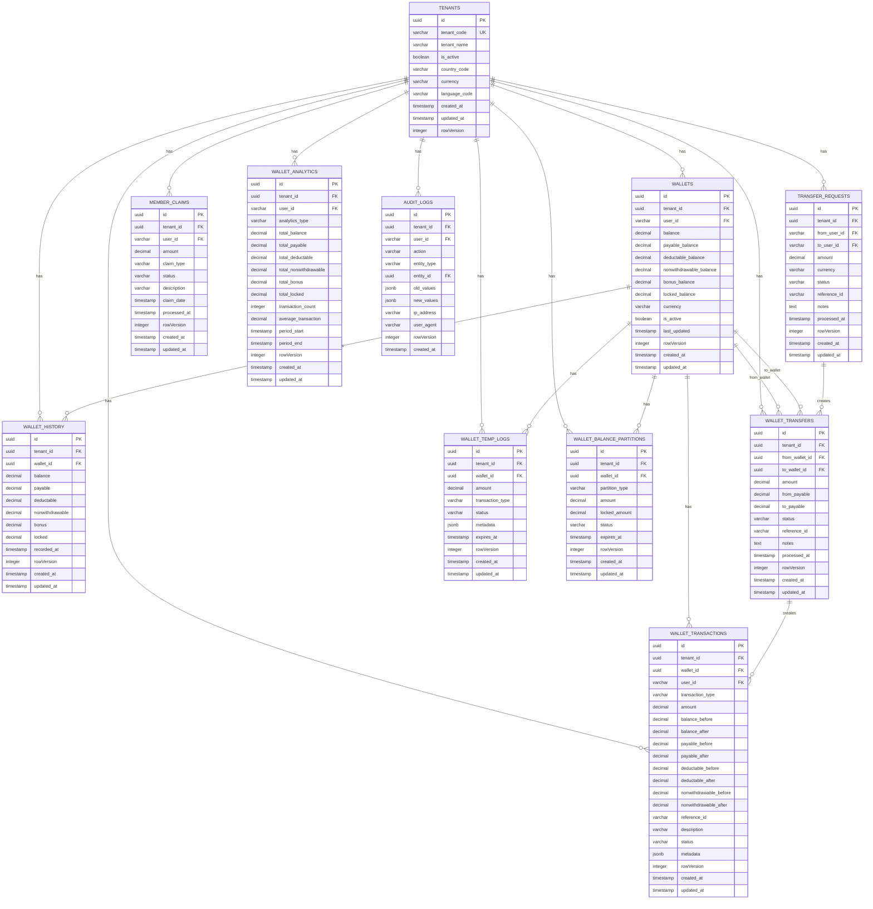

# 💰 **Wallet Service ER Diagram**

## 🎯 **Service Overview**
The Wallet Service handles all wallet management, balance tracking, and internal financial transactions for the betting platform. It manages user balances with multiple balance types and handles wallet-to-wallet transfers with complete multi-tenant isolation.

**Note: External payment processing is handled by the separate Payment Service.**

## 📊 **Entity Relationship Diagram**

## 🎯 **SRS Requirements Coverage**

### **FR-018: Wallet Management System** ✅
- **Wallet Creation** → `WALLETS` with balance partitions
- **Balance Management** → Multiple balance types (payable, deductable, nonwithdrawable)
- **Transaction History** → `WALLET_TRANSACTIONS` with complete audit trail
- **Transfer System** → `WALLET_TRANSFERS` for user-to-user transfers
- **Balance Analytics** → `WALLET_ANALYTICS` for reporting

## 🔒 **Security Features**

### **1. Multi-Tenant Isolation**
- **TenantId in every table** for complete data isolation
- **No cross-tenant data access** possible
- **Tenant-scoped queries** for performance

### **2. Wallet Security**
- **Balance validation** with transaction atomicity
- **Audit trail** for all wallet operations
- **Temporary logs** for pending transactions
- **Balance partitions** for different fund types

### **3. Data Integrity**
- **Transaction atomicity** with proper rollback
- **Balance consistency** with transaction validation
- **Historical tracking** with wallet history
- **Real-time monitoring** with analytics

## 🚀 **Performance Optimizations**

### **1. Indexing Strategy**
- **Primary indexes** on all ID columns
- **Composite indexes** on (tenant_id, user_id, created_at)
- **Performance indexes** on frequently queried columns
- **Balance indexes** for wallet operations

### **2. Query Optimization**
- **TenantId filtering** on all queries
- **Efficient joins** with proper foreign keys
- **Caching strategy** for wallet balances
- **Real-time updates** with transaction processing

## 📊 **Complete Table Organization & Structure**

### **🏢 1. TENANT MANAGEMENT (1 table)**
- `TENANTS` - Core tenant information

#### **💰 2. WALLET MANAGEMENT (2 tables)**
- `WALLETS` - User wallet with balance partitions
- `WALLET_TRANSACTIONS` - Complete transaction history

#### **📊 3. WALLET HISTORY (1 table)**
- `WALLET_HISTORY` - Historical balance snapshots

#### **🔄 4. TRANSFER SYSTEM (2 tables)**
- `TRANSFER_REQUESTS` - Transfer request management
- `WALLET_TRANSFERS` - Wallet-to-wallet transfers

#### **⏳ 5. TEMPORARY OPERATIONS (1 table)**
- `WALLET_TEMP_LOGS` - Temporary transaction logs

#### **🎁 6. CLAIMS SYSTEM (1 table)**
- `MEMBER_CLAIMS` - User claim management

#### **🔧 7. BALANCE PARTITIONS (1 table)**
- `WALLET_BALANCE_PARTITIONS` - Advanced balance management

#### **📈 8. ANALYTICS (1 table)**
- `WALLET_ANALYTICS` - Wallet analytics and reporting

#### **📋 9. AUDIT & LOGGING (1 table)**
- `AUDIT_LOGS` - Complete audit trail

## 🎯 **Total: 10 Tables**

### **✅ Complete Coverage:**
1. **Core Wallet Management** (2 tables)
2. **Wallet History** (1 table)
3. **Transfer System** (2 tables)
4. **Temporary Operations** (1 table)
5. **Claims System** (1 table)
6. **Balance Partitions** (1 table)
7. **Analytics** (1 table)
8. **Audit & Logging** (1 table)

### **✅ Migration Strategy:**
- **Preserve Business Logic** → Keep your current wallet and balance logic
- **Enhance with .NET** → Add modern microservices architecture
- **Multi-Tenant Support** → Add tenant_id to all existing patterns
- **Balance Management** → Enhance with modern balance partitioning

## 🚀 **Key Features:**

### **✅ 1. Multi-Balance Wallet System**
- **Main Balance** → Total available balance
- **Payable Balance** → Available for betting
- **Deductable Balance** → Available for withdrawals
- **Non-withdrawable Balance** → Bonus/restricted funds
- **Bonus Balance** → Promotional funds
- **Locked Balance** → Temporarily unavailable funds

### **✅ 2. Advanced Balance Management**
- **Balance Partitions** → Advanced fund categorization
- **Temporary Logs** → Pending transaction management
- **Historical Tracking** → Complete balance history
- **Claims System** → User claim management

### **✅ 3. Transfer System**
- **User-to-User Transfers** → Internal transfer system
- **Wallet-to-Wallet** → Direct wallet transfers
- **Transfer Requests** → Transfer request management
- **Transfer Analytics** → Transfer reporting

### **✅ 4. Security & Audit**
- **Transaction Atomicity** → All-or-nothing transactions
- **Balance Validation** → Consistent balance tracking
- **Audit Logging** → Complete transaction history
- **Temporary Operations** → Secure pending transactions

---

**This Wallet Service ER diagram provides complete wallet management, balance tracking, and internal financial transaction capabilities with multi-tenant support for your betting platform!** 🎯
