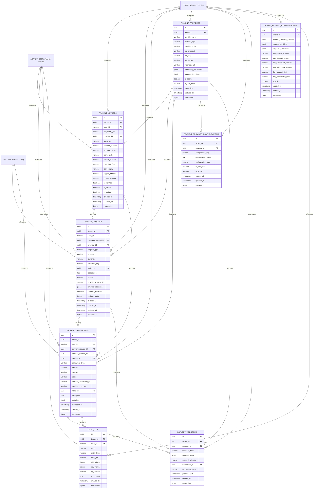
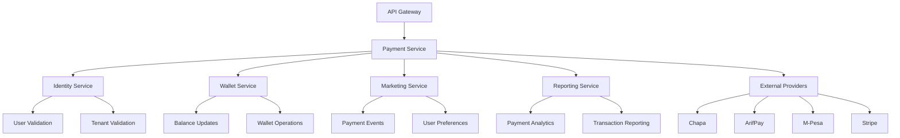

# 💳 **Payment Service ER Diagram**

## 🎯 **Service Overview**
The Payment Service handles all payment processing and external payment provider integrations for the betting platform. It manages payment methods, processes deposits/withdrawals, and integrates with multiple payment providers with complete multi-tenant isolation.

**Note: Wallet management is handled by the separate Wallet Service.**

## 📊 **Table Organization**

### **💳 1. PAYMENT METHODS (1 table)**
- `PAYMENT_METHODS` - User payment options

### **🔄 2. PAYMENT PROCESSING (2 tables)**
- `PAYMENT_REQUESTS` - Payment requests saved on our side before external provider call
- `PAYMENT_TRANSACTIONS` - Payment transaction tracking after external provider response

### **🏦 3. PAYMENT PROVIDERS (2 tables)**
- `PAYMENT_PROVIDERS` - Payment provider management
- `PAYMENT_PROVIDER_CONFIGURATIONS` - Provider-specific settings

### **🔗 4. INTEGRATION (1 table)**
- `PAYMENT_WEBHOOKS` - Webhook processing

### **⚙️ 5. CONFIGURATIONS (1 table)**
- `TENANT_PAYMENT_CONFIGURATIONS` - Payment method settings per tenant

### **📋 6. AUDIT & LOGGING (1 table)**
- `AUDIT_LOGS` - Complete audit trail

## 🎯 **Total: 8 Tables**

### **🔗 External Service References:**
- **TENANTS** → Referenced from Identity Service (not duplicated)
- **ASPNET_USERS** → Referenced from Identity Service (not duplicated)
- **WALLETS** → Referenced from Wallet Service (not duplicated)

## 🚀 **Key Features:**

### **✅ Payment Processing**
- **Multiple Payment Methods** → Bank transfer, mobile money, cards, crypto
- **Multiple Providers** → M-Pesa, Chapa, ArifPay, Stripe, PayPal, etc.
- **Real-time Processing** → Webhook-based updates
- **Multi-Currency Support** → USD, EUR, BTC, ETH, USDT, etc.

### **✅ Security & Compliance**
- **Encrypted Data** → Sensitive payment information
- **Webhook Validation** → Signature verification
- **OTP Verification** → Two-factor authentication
- **Audit Logging** → Complete transaction tracking

### **✅ High-Performance Operations**
- **Rowversion Support** → Optimistic concurrency control
- **Partitioned Tables** → Monthly partitions for scale
- **Auto-Cleanup** → TTL for temporary data
- **Multi-Tenant Isolation** → Complete data separation

---

## 📚 **Detailed Table Definitions**

### 1) **PAYMENT_METHODS** - User Payment Options

> **Purpose:** User payment method management with multiple payment options
> 
> **When to Use:**
> - **User Registration** → Create payment methods for new users
> - **Payment Method Management** → Users managing their payment options
> - **Payment Processing** → Select payment method for transactions
> - **Payment Method Verification** → Validate payment method before use
> - **Multi-Currency Support** → Different payment methods for different currencies
> 
> **Key Operations:**
> - Add payment method for user
> - Update payment method details
> - Verify payment method
> - Delete payment method
> - Get user payment methods

| **Column** | **Type** | **Default** | **Constraints** | **Description** |
|------------|----------|-------------|-----------------|-----------------|
| **id** | `uuid` | `gen_random_uuid()` | `PRIMARY KEY` | Unique payment method identifier |
| **tenant_id** | `uuid` | - | `NOT NULL, FK→TENANTS.id` | Multi-tenant isolation |
| **user_id** | `varchar(50)` | - | `NOT NULL, FK→ASPNET_USERS.id` | Payment method owner |
| **payment_type** | `varchar(30)` | - | `NOT NULL` | Payment type (bank_transfer/mobile_money/card/crypto) |
| **provider_id** | `uuid` | - | `NOT NULL, FK→PAYMENT_PROVIDERS.id` | Payment provider |
| **currency** | `varchar(10)` | - | `NOT NULL` | Payment currency (USD, EUR, BTC, ETH, USDT) |
| **account_number** | `varchar(100)` | `null` | - | Account number (encrypted) |
| **account_name** | `varchar(100)` | `null` | - | Account holder name |
| **bank_code** | `varchar(20)` | `null` | - | Bank code for bank transfers |
| **mobile_number** | `varchar(20)` | `null` | - | Mobile number for mobile money |
| **card_last_four** | `varchar(4)` | `null` | - | Last 4 digits of card |
| **card_expiry** | `varchar(7)` | `null` | - | Card expiry (MM/YYYY) |
| **crypto_address** | `varchar(100)` | `null` | - | Crypto wallet address |
| **crypto_network** | `varchar(20)` | `null` | - | Crypto network (bitcoin, ethereum, bsc) |
| **is_verified** | `boolean` | `false` | `NOT NULL` | Payment method verification status |
| **is_active** | `boolean` | `true` | `NOT NULL` | Payment method status |
| **is_default** | `boolean` | `false` | `NOT NULL` | Default payment method flag |
| **created_at** | `timestamp` | `now()` | `NOT NULL` | Creation timestamp |
| **updated_at** | `timestamp` | `now()` | `NOT NULL` | Last update timestamp |
| **rowversion** | `bytea` | `gen_random_bytes(8)` | `NOT NULL` | Row version for optimistic concurrency |

### 2) **PAYMENT_REQUESTS** - Unified Payment Requests (Our Side)

> **Purpose:** Unified payment requests for all providers (Chapa, ArifPay, M-Pesa, etc.) saved on our side before calling external providers
> 
> **When to Use:**
> - **Deposit Requests** → Save deposit request before calling any provider
> - **Withdrawal Requests** → Save withdrawal request after decreasing balance
> - **Request Tracking** → Track payment requests with reference keys
> - **Provider Communication** → Send reference key to external providers
> - **Callback Processing** → Match callbacks with original requests
> - **Unified Processing** → Handle all payment types in one model
> 
> **Key Operations:**
> - Create payment request (any provider)
> - Generate reference key
> - Update request status
> - Process provider callbacks
> - Handle request failures
> - Provider-specific data storage

| **Column** | **Type** | **Default** | **Constraints** | **Description** |
|------------|----------|-------------|-----------------|-----------------|
| **id** | `uuid` | `gen_random_uuid()` | `PRIMARY KEY` | Unique request identifier |
| **tenant_id** | `uuid` | - | `NOT NULL, FK→TENANTS.id` | Multi-tenant isolation |
| **user_id** | `varchar(50)` | - | `NOT NULL, FK→ASPNET_USERS.id` | Request owner |
| **payment_method_id** | `uuid` | - | `NOT NULL, FK→PAYMENT_METHODS.id` | Payment method used |
| **provider_id** | `uuid` | - | `NOT NULL, FK→PAYMENT_PROVIDERS.id` | Payment provider |
| **request_type** | `varchar(30)` | - | `NOT NULL` | Request type (deposit/withdrawal) |
| **amount** | `decimal(18,8)` | - | `NOT NULL, CHECK > 0` | Request amount |
| **currency** | `varchar(10)` | - | `NOT NULL` | Request currency |
| **reference_key** | `varchar(100)` | - | `NOT NULL, UNIQUE` | Our reference key for provider |
| **wallet_id** | `uuid` | `null` | `FK→WALLETS.id` | Target wallet (Wallet Service) |
| **description** | `text` | `null` | - | Request description |
| **status** | `varchar(20)` | `'pending'` | `NOT NULL` | Request status (pending/processing/completed/failed/cancelled) |
| **provider_request_id** | `varchar(100)` | `null` | - | Provider's request ID (from their response) |
| **provider_response** | `jsonb` | `'{}'` | `NOT NULL` | Provider response data (JSON) |
| **callback_received** | `boolean` | `false` | `NOT NULL` | Callback received flag |
| **callback_data** | `jsonb` | `null` | - | Callback data from provider |
| **expires_at** | `timestamp` | `null` | - | Request expiration timestamp |
| **created_at** | `timestamp` | `now()` | `NOT NULL` | Request timestamp |
| **updated_at** | `timestamp` | `now()` | `NOT NULL` | Last update timestamp |
| **rowversion** | `bytea` | `gen_random_bytes(8)` | `NOT NULL` | Row version for optimistic concurrency |

### 3) **PAYMENT_TRANSACTIONS** - Payment Transaction Tracking

> **Purpose:** Payment transactions created after external provider response/callback
> 
> **When to Use:**
> - **Transaction Completion** → Create transaction after successful provider response
> - **Wallet Integration** → Link completed transactions with wallet operations
> - **Provider Integration** → Link with external payment providers
> - **Webhook Processing** → Update transaction status from webhooks
> - **Payment History** → Track completed payment status and lifecycle
> - **Audit Compliance** → Complete payment audit trail
> 
> **Key Operations:**
> - Create transaction from payment request
> - Update transaction status
> - Process webhook updates
> - Handle payment failures
> - Generate payment reports

| **Column** | **Type** | **Default** | **Constraints** | **Description** |
|------------|----------|-------------|-----------------|-----------------|
| **id** | `uuid` | `gen_random_uuid()` | `PRIMARY KEY` | Unique transaction identifier |
| **tenant_id** | `uuid` | - | `NOT NULL, FK→TENANTS.id` | Multi-tenant isolation |
| **user_id** | `varchar(50)` | - | `NOT NULL, FK→ASPNET_USERS.id` | Transaction owner |
| **payment_method_id** | `uuid` | - | `NOT NULL, FK→PAYMENT_METHODS.id` | Payment method used |
| **provider_id** | `uuid` | - | `NOT NULL, FK→PAYMENT_PROVIDERS.id` | Payment provider |
| **transaction_type** | `varchar(30)` | - | `NOT NULL` | Transaction type (deposit/withdrawal/refund) |
| **amount** | `decimal(18,8)` | - | `NOT NULL, CHECK > 0` | Transaction amount (8 decimals for crypto) |
| **currency** | `varchar(10)` | - | `NOT NULL` | Transaction currency |
| **status** | `varchar(20)` | `'pending'` | `NOT NULL` | Transaction status (pending/processing/completed/failed/cancelled) |
| **provider_transaction_id** | `varchar(100)` | `null` | - | Provider transaction ID |
| **provider_reference** | `varchar(100)` | `null` | - | Provider reference number |
| **wallet_id** | `uuid` | `null` | `FK→WALLETS.id` | Target wallet (Wallet Service) |
| **description** | `text` | `null` | - | Transaction description |
| **provider_response** | `jsonb` | `'{}'` | `NOT NULL` | Provider response data (JSON) |
| **processed_at** | `timestamp` | `null` | - | Processing completion timestamp |
| **created_at** | `timestamp` | `now()` | `NOT NULL` | Transaction timestamp |
| **rowversion** | `bytea` | `gen_random_bytes(8)` | `NOT NULL` | Row version for optimistic concurrency |

### 3) **PAYMENT_PROVIDERS** - Payment Provider Management

> **Purpose:** Payment provider management with multiple provider support
> 
> **When to Use:**
> - **Provider Registration** → Add new payment providers
> - **Provider Configuration** → Configure provider settings
> - **Provider Selection** → Select provider for transactions
> - **Provider Management** → Enable/disable providers
> - **Multi-Provider Support** → Support multiple payment providers
> 
> **Key Operations:**
> - Add payment provider
> - Configure provider settings
> - Enable/disable provider
> - Update provider configuration
> - Get available providers

| **Column** | **Type** | **Default** | **Constraints** | **Description** |
|------------|----------|-------------|-----------------|-----------------|
| **id** | `uuid` | `gen_random_uuid()` | `PRIMARY KEY` | Unique provider identifier |
| **tenant_id** | `uuid` | - | `NOT NULL, FK→TENANTS.id` | Multi-tenant isolation |
| **provider_name** | `varchar(50)` | - | `NOT NULL` | Provider name (M-Pesa, Chapa, ArifPay, Stripe) |
| **provider_type** | `varchar(30)` | - | `NOT NULL` | Provider type (mobile_money/bank_transfer/card/crypto) |
| **provider_code** | `varchar(20)` | - | `NOT NULL, UNIQUE` | Provider code (MPESA, CHAPA, ARIFPAY, STRIPE) |
| **api_endpoint** | `varchar(200)` | - | `NOT NULL` | Provider API endpoint |
| **api_key** | `varchar(200)` | - | `NOT NULL` | Provider API key (encrypted) |
| **api_secret** | `varchar(200)` | - | `NOT NULL` | Provider API secret (encrypted) |
| **webhook_url** | `varchar(200)` | `null` | - | Provider webhook URL |
| **supported_currencies** | `jsonb` | `'[]'` | `NOT NULL` | Supported currencies (JSON array) |
| **supported_methods** | `jsonb` | `'[]'` | `NOT NULL` | Supported payment methods (JSON array) |
| **is_active** | `boolean` | `true` | `NOT NULL` | Provider status |
| **is_test_mode** | `boolean` | `true` | `NOT NULL` | Test mode flag |
| **created_at** | `timestamp` | `now()` | `NOT NULL` | Creation timestamp |
| **updated_at** | `timestamp` | `now()` | `NOT NULL` | Last update timestamp |
| **rowversion** | `bytea` | `gen_random_bytes(8)` | `NOT NULL` | Row version for optimistic concurrency |

### 6) **PAYMENT_PROVIDER_CONFIGURATIONS** - Provider-Specific Settings

> **Purpose:** Provider-specific configuration and settings management
> 
> **When to Use:**
> - **Provider Configuration** → Configure provider-specific settings
> - **Provider Limits** → Set transaction limits per provider
> - **Provider Fees** → Configure provider fees and charges
> - **Provider Settings** → Configure provider-specific options
> - **Multi-Tenant Configuration** → Different settings per tenant
> 
> **Key Operations:**
> - Configure provider settings
> - Set transaction limits
> - Configure provider fees
> - Update provider configuration
> - Get provider settings

| **Column** | **Type** | **Default** | **Constraints** | **Description** |
|------------|----------|-------------|-----------------|-----------------|
| **id** | `uuid` | `gen_random_uuid()` | `PRIMARY KEY` | Unique configuration identifier |
| **tenant_id** | `uuid` | - | `NOT NULL, FK→TENANTS.id` | Multi-tenant isolation |
| **provider_id** | `uuid` | - | `NOT NULL, FK→PAYMENT_PROVIDERS.id` | Payment provider |
| **configuration_key** | `varchar(100)` | - | `NOT NULL` | Configuration key |
| **configuration_value** | `text` | - | `NOT NULL` | Configuration value |
| **configuration_type** | `varchar(20)` | `'string'` | `NOT NULL` | Configuration type (string/number/boolean/json) |
| **is_encrypted** | `boolean` | `false` | `NOT NULL` | Encrypted configuration flag |
| **is_active** | `boolean` | `true` | `NOT NULL` | Configuration status |
| **created_at** | `timestamp` | `now()` | `NOT NULL` | Creation timestamp |
| **updated_at** | `timestamp` | `now()` | `NOT NULL` | Last update timestamp |
| **rowversion** | `bytea` | `gen_random_bytes(8)` | `NOT NULL` | Row version for optimistic concurrency |

### 7) **PAYMENT_WEBHOOKS** - Webhook Processing

> **Purpose:** Webhook processing for real-time payment updates
> 
> **When to Use:**
> - **Webhook Reception** → Receive webhooks from payment providers
> - **Webhook Processing** → Process webhook data
> - **Transaction Updates** → Update transaction status from webhooks
> - **Webhook Validation** → Validate webhook signatures
> - **Webhook History** → Track webhook processing
> 
> **Key Operations:**
> - Receive webhook
> - Validate webhook signature
> - Process webhook data
> - Update transaction status
> - Log webhook processing

| **Column** | **Type** | **Default** | **Constraints** | **Description** |
|------------|----------|-------------|-----------------|-----------------|
| **id** | `uuid` | `gen_random_uuid()` | `PRIMARY KEY` | Unique webhook identifier |
| **tenant_id** | `uuid` | - | `NOT NULL, FK→TENANTS.id` | Multi-tenant isolation |
| **provider_id** | `uuid` | - | `NOT NULL, FK→PAYMENT_PROVIDERS.id` | Payment provider |
| **webhook_type** | `varchar(30)` | - | `NOT NULL` | Webhook type (payment_completed/payment_failed/refund_processed) |
| **webhook_data** | `jsonb` | `'{}'` | `NOT NULL` | Webhook payload data (JSON) |
| **webhook_signature** | `varchar(200)` | `null` | - | Webhook signature for validation |
| **transaction_id** | `uuid` | `null` | `FK→PAYMENT_TRANSACTIONS.id` | Related transaction |
| **processing_status** | `varchar(20)` | `'pending'` | `NOT NULL` | Processing status (pending/processed/failed) |
| **processed_at** | `timestamp` | `null` | - | Processing completion timestamp |
| **created_at** | `timestamp` | `now()` | `NOT NULL` | Webhook timestamp |
| **rowversion** | `bytea` | `gen_random_bytes(8)` | `NOT NULL` | Row version for optimistic concurrency |

### 6) **TENANT_PAYMENT_CONFIGURATIONS** - Payment Method Settings per Tenant

> **Purpose:** Tenant-specific payment configuration and settings
> 
> **When to Use:**
> - **Tenant Configuration** → Configure payment settings per tenant
> - **Payment Method Control** → Enable/disable payment methods per tenant
> - **Limit Management** → Set transaction limits per tenant
> - **Provider Selection** → Configure available providers per tenant
> - **Currency Support** → Configure supported currencies per tenant
> 
> **Key Operations:**
> - Configure tenant payment settings
> - Enable/disable payment methods
> - Set transaction limits
> - Configure available providers
> - Update tenant configuration

| **Column** | **Type** | **Default** | **Constraints** | **Description** |
|------------|----------|-------------|-----------------|-----------------|
| **id** | `uuid` | `gen_random_uuid()` | `PRIMARY KEY` | Unique configuration identifier |
| **tenant_id** | `uuid` | - | `NOT NULL, UNIQUE, FK→TENANTS.id` | Multi-tenant isolation |
| **enabled_payment_methods** | `jsonb` | `'[]'` | `NOT NULL` | Enabled payment methods (JSON array) |
| **enabled_providers** | `jsonb` | `'[]'` | `NOT NULL` | Enabled providers (JSON array) |
| **supported_currencies** | `jsonb` | `'[]'` | `NOT NULL` | Supported currencies (JSON array) |
| **min_deposit_amount** | `decimal(18,8)` | `1.00` | `NOT NULL, CHECK > 0` | Minimum deposit amount |
| **max_deposit_amount** | `decimal(18,8)` | `10000.00` | `NOT NULL, CHECK > 0` | Maximum deposit amount |
| **min_withdrawal_amount** | `decimal(18,8)` | `1.00` | `NOT NULL, CHECK > 0` | Minimum withdrawal amount |
| **max_withdrawal_amount** | `decimal(18,8)` | `5000.00` | `NOT NULL, CHECK > 0` | Maximum withdrawal amount |
| **daily_deposit_limit** | `decimal(18,8)` | `50000.00` | `NOT NULL, CHECK > 0` | Daily deposit limit |
| **daily_withdrawal_limit** | `decimal(18,8)` | `25000.00` | `NOT NULL, CHECK > 0` | Daily withdrawal limit |
| **is_active** | `boolean` | `true` | `NOT NULL` | Configuration status |
| **created_at** | `timestamp` | `now()` | `NOT NULL` | Creation timestamp |
| **updated_at** | `timestamp` | `now()` | `NOT NULL` | Last update timestamp |
| **rowversion** | `bytea` | `gen_random_bytes(8)` | `NOT NULL` | Row version for optimistic concurrency |

### 7) **AUDIT_LOGS** - Complete Audit Trail

> **Purpose:** Complete audit trail for security, compliance, and regulatory requirements
> 
> **When to Use:**
> - **Security Auditing** → Track all payment operations
> - **Compliance Reporting** → Generate compliance reports
> - **Regulatory Requirements** → Meet regulatory audit requirements
> - **Security Monitoring** → Monitor payment security
> - **Transaction Tracking** → Track all payment activities
> 
> **Key Operations:**
> - Log payment operations
> - Track user activities
> - Monitor security events
> - Generate audit reports
> - Compliance reporting

| **Column** | **Type** | **Default** | **Constraints** | **Description** |
|------------|----------|-------------|-----------------|-----------------|
| **id** | `uuid` | `gen_random_uuid()` | `PRIMARY KEY` | Unique audit log identifier |
| **tenant_id** | `uuid` | - | `NOT NULL, FK→TENANTS.id` | Multi-tenant isolation |
| **user_id** | `varchar(50)` | `null` | `FK→ASPNET_USERS.id` | User who performed action |
| **action** | `varchar(30)` | - | `NOT NULL` | Action type (create/update/delete/process/validate) |
| **entity_type** | `varchar(30)` | - | `NOT NULL` | Entity type (payment_method/transaction/deposit/withdrawal) |
| **entity_id** | `varchar(100)` | - | `NOT NULL` | ID of affected entity |
| **old_values** | `jsonb` | `null` | - | Previous values (JSON) |
| **new_values** | `jsonb` | `null` | - | New values (JSON) |
| **ip_address** | `varchar(45)` | `null` | - | User IP address |
| **user_agent** | `text` | `null` | - | User agent string |
| **created_at** | `timestamp` | `now()` | `NOT NULL` | Audit timestamp |
| **rowversion** | `bytea` | `gen_random_bytes(8)` | `NOT NULL` | Row version for optimistic concurrency |

---

## 🎯 **Entity Relationship Diagram**



## 🎯 **Table Relationships**

### **📊 Core Relationships:**
- **TENANTS (Identity Service)** → **PAYMENT_METHODS** (1:Many) - External reference for multi-tenant isolation
- **ASPNET_USERS (Identity Service)** → **PAYMENT_METHODS** (1:Many) - External reference for user identification
- **ASPNET_USERS (Identity Service)** → **PAYMENT_REQUESTS** (1:Many) - External reference for user identification
- **WALLETS (Wallet Service)** → **PAYMENT_REQUESTS** (1:Many) - External reference for wallet integration
- **WALLETS (Wallet Service)** → **PAYMENT_TRANSACTIONS** (1:Many) - External reference for wallet integration
- **PAYMENT_METHODS** → **PAYMENT_REQUESTS** (1:Many) - One payment method has many requests
- **PAYMENT_METHODS** → **PAYMENT_TRANSACTIONS** (1:Many) - One payment method has many transactions
- **PAYMENT_PROVIDERS** → **PAYMENT_METHODS** (1:Many) - One provider has many payment methods
- **PAYMENT_PROVIDERS** → **PAYMENT_REQUESTS** (1:Many) - One provider has many requests
- **PAYMENT_PROVIDERS** → **PAYMENT_TRANSACTIONS** (1:Many) - One provider has many transactions
- **PAYMENT_REQUESTS** → **PAYMENT_TRANSACTIONS** (1:Many) - One request can have multiple transactions
- **PAYMENT_REQUESTS** → **PAYMENT_WEBHOOKS** (1:Many) - One request can have multiple webhooks
- **PAYMENT_TRANSACTIONS** → **PAYMENT_WEBHOOKS** (1:Many) - One transaction can have multiple webhooks
- **TENANTS (Identity Service)** → **TENANT_PAYMENT_CONFIGURATIONS** (1:1) - External reference

### **🔗 Foreign Key Constraints:**
- All tables reference `TENANTS.id` (Identity Service) for multi-tenant isolation
- All tables reference `ASPNET_USERS.id` (Identity Service) for user identification
- `PAYMENT_REQUESTS.wallet_id` → `WALLETS.id` (Wallet Service)
- `PAYMENT_REQUESTS.payment_method_id` → `PAYMENT_METHODS.id`
- `PAYMENT_REQUESTS.provider_id` → `PAYMENT_PROVIDERS.id`
- `PAYMENT_TRANSACTIONS.payment_request_id` → `PAYMENT_REQUESTS.id`
- `PAYMENT_TRANSACTIONS.wallet_id` → `WALLETS.id` (Wallet Service)
- `PAYMENT_TRANSACTIONS.payment_method_id` → `PAYMENT_METHODS.id`
- `PAYMENT_TRANSACTIONS.provider_id` → `PAYMENT_PROVIDERS.id`
- `PAYMENT_PROVIDER_CONFIGURATIONS.provider_id` → `PAYMENT_PROVIDERS.id`
- `PAYMENT_WEBHOOKS.provider_id` → `PAYMENT_PROVIDERS.id`
- `PAYMENT_WEBHOOKS.transaction_id` → `PAYMENT_TRANSACTIONS.id`

## 🔄 **Unified Payment Model (Based on Django Reference)**

### **📋 Common Payment Request Structure:**

Based on the Django app analysis, all payment providers (Chapa, ArifPay, M-Pesa, etc.) share common fields:

#### **🔑 Common Fields Across All Providers:**
- **amount** → Request amount
- **original_amount** → Original amount before fees
- **user_identifier** → Phone number or email
- **reference_key** → Our unique reference
- **status** → Pending/Processing/Completed/Failed
- **comment** → Additional notes
- **charge** → Transaction fee
- **method** → Payment method used
- **provider_response** → Provider's response data
- **callback_data** → Webhook callback data
- **committed_at** → When transaction was committed

#### **🏦 Provider-Specific Fields (Stored in JSON):**
- **Chapa**: `chapa_reference`, `tx_ref`
- **ArifPay**: `nonce`, `session_id`, `arifpay_id`, `arifpay_transaction_id`
- **M-Pesa**: `mpesa_transaction_reference`, `mpesa_conversation_id`, `mpesa_status_code`
- **Others**: Provider-specific fields stored in `provider_response` JSON

#### **💡 Unified Approach Benefits:**
- **Single Model** → Handle all payment providers in one table
- **Consistent Interface** → Same API for all providers
- **Easy Maintenance** → Add new providers without schema changes
- **Provider Flexibility** → Store provider-specific data in JSON fields
- **Audit Trail** → Consistent logging across all providers

### **📋 Payment Types, Meanings, and Reasons:**

#### **💰 Deposit Payments:**
- **Meaning**: User adds money to their wallet
- **Request**: User initiates deposit through payment method
- **Reason**: `dashboard_deposit`, `online_transaction`, `member_deposit`
- **Flow**: User → Payment Provider → Our System → Wallet Credit

#### **💸 Withdrawal Payments:**
- **Meaning**: User withdraws money from their wallet
- **Request**: User initiates withdrawal to their bank/mobile money
- **Reason**: `withdrawal_request`, `user_withdrawal`, `agent_withdrawal`
- **Flow**: Wallet Debit → Our System → Payment Provider → User Account

#### **🔄 Refund Payments:**
- **Meaning**: Return money to user's original payment method
- **Request**: System or admin initiates refund
- **Reason**: `refund_transaction`, `reverse_deposit`, `failed_payment_refund`
- **Flow**: System → Payment Provider → User's Original Payment Method

#### **🎁 Bonus Payments:**
- **Meaning**: System credits user with bonus money
- **Request**: System automatically credits user
- **Reason**: `deposit_bonus`, `loyalty_bonus`, `freebet_bonus`, `referral_bonus`
- **Flow**: System → Wallet Credit (No external provider)

#### **🏆 Reward Payments:**
- **Meaning**: User receives rewards/prizes
- **Request**: System awards user based on activity
- **Reason**: `tournament_reward`, `raffle_reward`, `spin_reward`, `affiliate_payment`
- **Flow**: System → Wallet Credit (No external provider)

## 🔄 **Payment Flow Implementation**

### **📋 Payment Request Flow (Based on Reference Implementation):**

#### **1. Deposit Flow:**
1. **Create Payment Request** → Save request in `PAYMENT_REQUESTS` with our reference key
2. **Call External Provider** → Send request to Chapa/ArifPay with our reference key
3. **Provider Response** → Provider returns their transaction ID and status
4. **Update Request** → Update `PAYMENT_REQUESTS` with provider response
5. **Provider Callback** → Provider hits our webhook with final status
6. **Create Transaction** → Create `PAYMENT_TRANSACTIONS` after successful callback
7. **Wallet Update** → Update wallet balance through Wallet Service

#### **2. Withdrawal Flow:**
1. **Decrease Balance** → First decrease user's wallet balance
2. **Create Payment Request** → Save withdrawal request in `PAYMENT_REQUESTS`
3. **Call External Provider** → Send withdrawal request to provider
4. **Provider Response** → Provider processes withdrawal
5. **Provider Callback** → Provider confirms success/failure
6. **Create Transaction** → Create `PAYMENT_TRANSACTIONS` after callback
7. **Finalize** → Complete or reverse based on provider response

### **🔑 Key Features from Reference:**
- **Reference Key Generation** → Unique reference for each request
- **Provider Integration** → Support for Chapa, ArifPay, M-Pesa, etc.
- **Webhook Processing** → Real-time status updates
- **Transaction Fees** → Automatic fee calculation
- **Balance Management** → Pre-decrease for withdrawals
- **Audit Trail** → Complete transaction history

## 🏦 **Payment Provider Deep Dive - How They Work**

### **📋 Provider-Specific Implementation Details:**

#### **🔵 Chapa Payment Provider:**
**How it Works:**
1. **Request Creation** → Generate `tx_ref` (UUID) and `chapa_reference`
2. **API Call** → POST to Chapa API with amount, currency, customer info
3. **Response Handling** → Chapa returns payment URL and transaction ID
4. **User Redirect** → Redirect user to Chapa payment page
5. **Webhook Processing** → Chapa sends webhook with final status
6. **Transaction Completion** → Update wallet balance on success

**Key Fields:**
- `tx_ref` → Our unique transaction reference
- `chapa_reference` → Chapa's transaction reference
- `useridentifier` → Customer phone/email
- `amount` → Payment amount
- `currency` → Payment currency (ETB, USD, etc.)

**Flow:**
```
User Request → Our System → Chapa API → Chapa Payment Page → User Payment → Chapa Webhook → Wallet Update
```

#### **🟢 ArifPay Payment Provider:**
**How it Works:**
1. **Nonce Generation** → Generate unique nonce for security
2. **Session Creation** → Create payment session with ArifPay
3. **API Call** → POST to ArifPay with session data
4. **Response Handling** → ArifPay returns payment URL and session ID
5. **User Redirect** → Redirect user to ArifPay payment page
6. **Webhook Processing** → ArifPay sends webhook with final status

**Key Fields:**
- `nonce` → Security nonce for request
- `session_id` → ArifPay session identifier
- `arifpay_id` → ArifPay transaction ID
- `arifpay_transaction_id` → ArifPay internal transaction ID
- `phone_number` → Customer phone number

**Flow:**
```
User Request → Our System → ArifPay API → ArifPay Payment Page → User Payment → ArifPay Webhook → Wallet Update
```

#### **🟡 M-Pesa Payment Provider:**
**How it Works:**
1. **Conversation ID** → Generate unique conversation ID
2. **API Call** → POST to M-Pesa STK Push API
3. **STK Push** → M-Pesa sends STK push to customer's phone
4. **Customer Action** → Customer enters PIN on phone
5. **Callback Processing** → M-Pesa sends callback with result
6. **Transaction Completion** → Update wallet balance

**Key Fields:**
- `mpesa_transaction_reference` → M-Pesa transaction reference
- `mpesa_conversation_id` → M-Pesa conversation ID
- `mpesa_status_code` → M-Pesa status code (INS-0 = success)
- `useridentifier` → Customer phone number

**Flow:**
```
User Request → Our System → M-Pesa API → STK Push → Customer Phone → Customer PIN → M-Pesa Callback → Wallet Update
```

#### **🔴 Stripe Payment Provider:**
**How it Works:**
1. **Payment Intent** → Create payment intent with Stripe
2. **Client Secret** → Return client secret to frontend
3. **Frontend Integration** → Use Stripe.js for payment processing
4. **Webhook Processing** → Stripe sends webhook with payment status
5. **Transaction Completion** → Update wallet balance

**Key Fields:**
- `stripe_payment_intent_id` → Stripe payment intent ID
- `stripe_client_secret` → Client secret for frontend
- `stripe_customer_id` → Stripe customer ID
- `payment_method_id` → Stripe payment method ID

**Flow:**
```
User Request → Our System → Stripe API → Frontend Payment → Stripe Processing → Stripe Webhook → Wallet Update
```

#### **🟣 PayPal Payment Provider:**
**How it Works:**
1. **Order Creation** → Create PayPal order
2. **Approval URL** → Get PayPal approval URL
3. **User Redirect** → Redirect user to PayPal
4. **User Approval** → User approves payment on PayPal
5. **Order Capture** → Capture the approved order
6. **Webhook Processing** → PayPal sends webhook with status

**Key Fields:**
- `paypal_order_id` → PayPal order ID
- `paypal_approval_url` → PayPal approval URL
- `paypal_payer_id` → PayPal payer ID
- `paypal_payment_id` → PayPal payment ID

**Flow:**
```
User Request → Our System → PayPal API → PayPal Payment → User Approval → Order Capture → PayPal Webhook → Wallet Update
```

### **🔄 Unified Provider Processing:**

#### **📋 Common Processing Steps:**
1. **Request Validation** → Validate amount, currency, user
2. **Provider Selection** → Choose best provider based on criteria
3. **Reference Generation** → Generate unique reference key
4. **API Integration** → Call provider-specific API
5. **Response Handling** → Process provider response
6. **User Interaction** → Handle user payment (redirect/STK push)
7. **Webhook Processing** → Process provider callbacks
8. **Transaction Completion** → Update wallet and create transaction

#### **🛡️ Security & Validation:**
- **Webhook Signature Verification** → Validate all incoming webhooks
- **Idempotency Keys** → Prevent duplicate processing
- **Amount Validation** → Verify amounts match
- **Currency Validation** → Ensure currency consistency
- **User Verification** → Validate user identity and permissions

#### **⚡ Error Handling:**
- **Provider Failures** → Handle API failures gracefully
- **Timeout Handling** → Manage request timeouts
- **Retry Logic** → Implement exponential backoff
- **Fallback Providers** → Switch to alternative providers
- **Transaction Reversal** → Reverse failed transactions

#### **📊 Monitoring & Analytics:**
- **Provider Performance** → Track success rates per provider
- **Response Times** → Monitor API response times
- **Error Rates** → Track and alert on error rates
- **Transaction Volumes** → Monitor transaction volumes
- **Revenue Tracking** → Track revenue per provider

### **🎯 Provider Selection Strategy:**

#### **📋 Selection Criteria:**
- **User Location** → Geographic restrictions
- **Currency Support** → Supported currencies
- **Amount Limits** → Min/max transaction amounts
- **Processing Time** → Expected processing time
- **Success Rate** → Historical success rates
- **Cost** → Transaction fees and costs
- **User Preference** → User's preferred payment method

#### **🔄 Dynamic Provider Selection:**
- **Load Balancing** → Distribute load across providers
- **Failover** → Automatic failover to backup providers
- **Performance-Based** → Select based on current performance
- **Cost Optimization** → Choose most cost-effective provider
- **Compliance** → Ensure regulatory compliance

### **📊 Payment Provider Comparison Table:**

| **Provider** | **Type** | **Region** | **Currencies** | **Min Amount** | **Max Amount** | **Processing Time** | **Success Rate** | **Fees** |
|--------------|----------|------------|----------------|----------------|----------------|-------------------|------------------|----------|
| **Chapa** | Mobile Money | Ethiopia | ETB, USD | $1 | $1,000 | 1-5 minutes | 95% | 2.5% |
| **ArifPay** | Mobile Money | Ethiopia | ETB, USD | $1 | $2,000 | 1-3 minutes | 98% | 2.0% |
| **M-Pesa** | Mobile Money | Kenya/Tanzania | KES, TZS | $1 | $1,500 | 30 seconds | 99% | 1.5% |
| **Stripe** | Card/Online | Global | 135+ currencies | $0.50 | $100,000 | Instant | 99.5% | 2.9% + $0.30 |
| **PayPal** | Online | Global | 25+ currencies | $1 | $10,000 | 1-2 minutes | 98% | 2.9% + $0.30 |

### **🔧 Provider Implementation Details:**

#### **📋 Chapa Integration:**
```json
{
  "provider_name": "Chapa",
  "api_endpoint": "https://api.chapa.co/v1/transaction/initialize",
  "webhook_url": "https://your-domain.com/webhooks/chapa",
  "required_fields": ["amount", "currency", "tx_ref", "customer"],
  "response_fields": ["checkout_url", "transaction_reference"],
  "webhook_events": ["payment.completed", "payment.failed"]
}
```

#### **📋 ArifPay Integration:**
```json
{
  "provider_name": "ArifPay",
  "api_endpoint": "https://gateway.arifpay.net/api/v0/sandbox/checkout/session",
  "webhook_url": "https://your-domain.com/webhooks/arifpay",
  "required_fields": ["amount", "currency", "nonce", "phoneNumber"],
  "response_fields": ["sessionId", "paymentUrl"],
  "webhook_events": ["payment.success", "payment.failed"]
}
```

#### **📋 M-Pesa Integration:**
```json
{
  "provider_name": "M-Pesa",
  "api_endpoint": "https://sandbox.safaricom.co.ke/mpesa/stkpush/v1/processrequest",
  "webhook_url": "https://your-domain.com/webhooks/mpesa",
  "required_fields": ["amount", "phoneNumber", "accountReference"],
  "response_fields": ["merchantRequestID", "checkoutRequestID"],
  "webhook_events": ["stkpush.success", "stkpush.failed"]
}
```

#### **📋 Stripe Integration:**
```json
{
  "provider_name": "Stripe",
  "api_endpoint": "https://api.stripe.com/v1/payment_intents",
  "webhook_url": "https://your-domain.com/webhooks/stripe",
  "required_fields": ["amount", "currency", "payment_method"],
  "response_fields": ["client_secret", "id"],
  "webhook_events": ["payment_intent.succeeded", "payment_intent.payment_failed"]
}
```

#### **📋 PayPal Integration:**
```json
{
  "provider_name": "PayPal",
  "api_endpoint": "https://api.sandbox.paypal.com/v2/checkout/orders",
  "webhook_url": "https://your-domain.com/webhooks/paypal",
  "required_fields": ["amount", "currency", "return_url", "cancel_url"],
  "response_fields": ["id", "links"],
  "webhook_events": ["PAYMENT.CAPTURE.COMPLETED", "PAYMENT.CAPTURE.DENIED"]
}
```

### **🔄 Provider-Specific Processing Flows:**

#### **🔵 Chapa Processing Flow:**
```
1. User Request → 2. Generate tx_ref → 3. Call Chapa API → 4. Get checkout_url → 5. Redirect User → 6. User Payment → 7. Chapa Webhook → 8. Update Wallet
```

#### **🟢 ArifPay Processing Flow:**
```
1. User Request → 2. Generate nonce → 3. Create session → 4. Get payment_url → 5. Redirect User → 6. User Payment → 7. ArifPay Webhook → 8. Update Wallet
```

#### **🟡 M-Pesa Processing Flow:**
```
1. User Request → 2. Generate conversation_id → 3. STK Push API → 4. STK Push to Phone → 5. User PIN Entry → 6. M-Pesa Callback → 7. Update Wallet
```

#### **🔴 Stripe Processing Flow:**
```
1. User Request → 2. Create payment_intent → 3. Return client_secret → 4. Frontend Payment → 5. Stripe Processing → 6. Stripe Webhook → 7. Update Wallet
```

#### **🟣 PayPal Processing Flow:**
```
1. User Request → 2. Create order → 3. Get approval_url → 4. Redirect to PayPal → 5. User Approval → 6. Capture order → 7. PayPal Webhook → 8. Update Wallet
```

### **🛡️ Security Implementation:**

#### **📋 Webhook Security:**
- **Signature Verification** → Validate webhook signatures
- **Timestamp Validation** → Check webhook timestamps
- **Idempotency** → Prevent duplicate processing
- **Rate Limiting** → Limit webhook processing rate
- **IP Whitelisting** → Restrict webhook sources

#### **📋 Data Security:**
- **Encryption** → Encrypt sensitive payment data
- **PCI Compliance** → Follow PCI DSS standards
- **Tokenization** → Use tokens instead of raw data
- **Audit Logging** → Log all payment operations
- **Access Control** → Restrict access to payment data

### **📊 Performance Optimization:**

#### **📋 Caching Strategy:**
- **Provider Configurations** → Cache provider settings
- **Exchange Rates** → Cache currency exchange rates
- **User Preferences** → Cache user payment preferences
- **Provider Status** → Cache provider availability

#### **📋 Load Balancing:**
- **Provider Distribution** → Distribute load across providers
- **Geographic Routing** → Route based on user location
- **Performance-Based** → Route based on provider performance
- **Failover** → Automatic failover to backup providers

### **🎯 Provider Selection Algorithm:**

#### **📋 Selection Criteria Weight:**
- **User Location (30%)** → Geographic restrictions
- **Currency Support (25%)** → Supported currencies
- **Success Rate (20%)** → Historical success rates
- **Processing Time (15%)** → Expected processing time
- **Cost (10%)** → Transaction fees

#### **📋 Dynamic Selection:**
- **Real-time Performance** → Monitor current provider performance
- **Load Balancing** → Distribute transactions evenly
- **Failover Logic** → Switch to backup providers on failure
- **Cost Optimization** → Choose most cost-effective provider
- **Compliance Check** → Ensure regulatory compliance

**This comprehensive payment provider analysis shows how each provider works and how they integrate into the unified payment system!** 🎯

## 💰 **Payment Service ↔ Wallet Service Communication**

### **🔄 Communication Flow Analysis (Based on Django Reference):**

#### **📋 How Payment Service Communicates with Wallet Service:**

**1. Deposit Flow Communication:**
```
Payment Service → Wallet Service
├── Create BankTransaction (pending status)
├── Calculate fees and net amount
├── Update wallet balance on success
└── Audit wallet transactions
```

**2. Withdrawal Flow Communication:**
```
Payment Service → Wallet Service
├── Pre-decrease wallet balance
├── Create BankTransaction (pending status)
├── Confirm/Decline based on provider response
└── Audit wallet transactions
```

#### **🔧 Key Communication Patterns:**

**📊 BankTransaction Creation:**
```python
# From Django reference - Chapa implementation
bank_transaction = flatodd.models.BankTransaction.objects.create(
    wallet=user.member.getWallet(),
    amount=debited_amount,
    deductable=debited_amount,
    transaction_fee=0,
    transaction_type=flatodd.models.BankTransaction.DEPOSIT,
    bank=flatodd.models.BankTransaction.CHAPPA,
)
```

**📊 Transaction Confirmation:**
```python
# From Django reference - M-Pesa implementation
def commit(self, comment=""):
    self.bank_transaction.confirm(flatodd.models.BankTransaction.SUCCESSFUL)
    return True

def reject(self, comment=""):
    self.bank_transaction.confirm(flatodd.models.BankTransaction.DECLINED)
    return True
```

**📊 Wallet Auditing:**
```python
# From Django reference - All providers
wallet = self.user.member.getWallet()
flatodd.auditor.WalletAuditor().audit_all_transactions(wallet, True)
```

### **🔗 gRPC Communication Patterns:**

#### **📡 Payment Service → Wallet Service Calls:**

```protobuf
// Wallet Service Integration from Payment Service
service WalletService {
  // Create wallet transaction
  rpc CreateWalletTransaction(CreateWalletTransactionRequest) returns (CreateWalletTransactionResponse);
  
  // Update wallet balance
  rpc UpdateWalletBalance(UpdateWalletBalanceRequest) returns (UpdateWalletBalanceResponse);
  
  // Get wallet info
  rpc GetWalletInfo(GetWalletInfoRequest) returns (GetWalletInfoResponse);
  
  // Validate wallet
  rpc ValidateWallet(ValidateWalletRequest) returns (ValidateWalletResponse);
  
  // Audit wallet
  rpc AuditWallet(AuditWalletRequest) returns (AuditWalletResponse);
}
```

#### **📡 Wallet Service → Payment Service Calls:**

```protobuf
// Payment Service Integration from Wallet Service
service PaymentService {
  // Validate payment method
  rpc ValidatePaymentMethod(ValidatePaymentMethodRequest) returns (ValidatePaymentMethodResponse);
  
  // Get payment method info
  rpc GetPaymentMethodInfo(GetPaymentMethodInfoRequest) returns (GetPaymentMethodInfoResponse);
  
  // Process payment
  rpc ProcessPayment(ProcessPaymentRequest) returns (ProcessPaymentResponse);
}
```

### **🔄 Communication Scenarios:**

#### **💰 Deposit Communication Flow:**

**1. Payment Request Creation:**
```
Payment Service → Wallet Service
├── CreateWalletTransaction()
│   ├── wallet_id: user's wallet
│   ├── amount: deposit amount
│   ├── transaction_type: "deposit"
│   ├── status: "pending"
│   └── provider: "chapa/arifpay/mpesa"
```

**2. Provider Success:**
```
Payment Service → Wallet Service
├── UpdateWalletBalance()
│   ├── wallet_id: user's wallet
│   ├── amount: deposit amount
│   ├── balance_type: "deductable"
│   └── transaction_id: bank_transaction_id
```

**3. Wallet Audit:**
```
Payment Service → Wallet Service
├── AuditWallet()
│   ├── wallet_id: user's wallet
│   ├── audit_type: "transaction_complete"
│   └── transaction_id: bank_transaction_id
```

#### **💸 Withdrawal Communication Flow:**

**1. Pre-decrease Balance:**
```
Payment Service → Wallet Service
├── UpdateWalletBalance()
│   ├── wallet_id: user's wallet
│   ├── amount: -withdrawal_amount
│   ├── balance_type: "deductable"
│   └── transaction_type: "withdrawal_pending"
```

**2. Provider Success:**
```
Payment Service → Wallet Service
├── UpdateWalletBalance()
│   ├── wallet_id: user's wallet
│   ├── amount: 0 (already decreased)
│   ├── balance_type: "confirmed"
│   └── transaction_id: bank_transaction_id
```

**3. Provider Failure:**
```
Payment Service → Wallet Service
├── UpdateWalletBalance()
│   ├── wallet_id: user's wallet
│   ├── amount: +withdrawal_amount (reverse)
│   ├── balance_type: "deductable"
│   └── transaction_type: "withdrawal_failed"
```

### **📊 Data Synchronization:**

#### **🔄 Transaction Status Sync:**
- **Payment Service** → Creates `PAYMENT_REQUESTS` and `PAYMENT_TRANSACTIONS`
- **Wallet Service** → Creates `WALLET_TRANSACTIONS` and `WALLET_LEDGER`
- **Synchronization** → Both services maintain transaction records

#### **🔄 Balance Updates:**
- **Payment Service** → Triggers wallet balance updates
- **Wallet Service** → Processes balance changes and ledger entries
- **Audit Trail** → Both services log all operations

#### **🔄 Error Handling:**
- **Payment Failures** → Reverse wallet balance changes
- **Network Issues** → Retry mechanisms and fallback
- **Data Consistency** → Transaction rollback on failures

### **🎯 Key Integration Points:**

#### **📋 Critical Communication Events:**
1. **Payment Request** → Create wallet transaction
2. **Provider Success** → Update wallet balance
3. **Provider Failure** → Reverse wallet balance
4. **Transaction Complete** → Audit wallet
5. **Balance Changes** → Update ledger entries

#### **📋 Data Consistency:**
- **Atomic Operations** → All wallet updates are atomic
- **Transaction Logging** → Complete audit trail
- **Balance Validation** → Verify balance changes
- **Error Recovery** → Automatic rollback on failures

#### **📋 Performance Optimization:**
- **Async Processing** → Non-blocking wallet updates
- **Batch Operations** → Multiple updates in single call
- **Caching** → Cache wallet information
- **Retry Logic** → Handle temporary failures

**This comprehensive communication analysis shows how Payment Service and Wallet Service work together seamlessly!** 🎯

## 🚀 **gRPC Service Definition - Implementation Ready**

### **📋 Service: PaymentService**

```protobuf
syntax = "proto3";

package convex.payment.v1;

import "google/protobuf/timestamp.proto";
import "google/protobuf/empty.proto";

option csharp_namespace = "Convex.Payment.V1";

// ============================================================================
// CORE PAYMENT OPERATIONS
// ============================================================================

service PaymentService {
  // ============================================================================
  // PAYMENT METHODS MANAGEMENT
  // ============================================================================
  
  // Add payment method
  rpc AddPaymentMethod(AddPaymentMethodRequest) returns (AddPaymentMethodResponse);
  
  // Get user payment methods
  rpc GetPaymentMethods(GetPaymentMethodsRequest) returns (GetPaymentMethodsResponse);
  
  // Update payment method
  rpc UpdatePaymentMethod(UpdatePaymentMethodRequest) returns (UpdatePaymentMethodResponse);
  
  // Delete payment method
  rpc DeletePaymentMethod(DeletePaymentMethodRequest) returns (DeletePaymentMethodResponse);
  
  // Verify payment method
  rpc VerifyPaymentMethod(VerifyPaymentMethodRequest) returns (VerifyPaymentMethodResponse);

  // ============================================================================
  // PAYMENT REQUESTS (Our Side)
  // ============================================================================
  
  // Create payment request
  rpc CreatePaymentRequest(CreatePaymentRequestRequest) returns (CreatePaymentRequestResponse);
  
  // Get payment request
  rpc GetPaymentRequest(GetPaymentRequestRequest) returns (GetPaymentRequestResponse);
  
  // Update payment request status
  rpc UpdatePaymentRequestStatus(UpdatePaymentRequestStatusRequest) returns (UpdatePaymentRequestStatusResponse);
  
  // Process provider callback
  rpc ProcessProviderCallback(ProcessProviderCallbackRequest) returns (ProcessProviderCallbackResponse);

  // ============================================================================
  // PAYMENT TRANSACTIONS
  // ============================================================================
  
  // Create payment transaction
  rpc CreatePaymentTransaction(CreatePaymentTransactionRequest) returns (CreatePaymentTransactionResponse);
  
  // Get payment transaction
  rpc GetPaymentTransaction(GetPaymentTransactionRequest) returns (GetPaymentTransactionResponse);
  
  // Get user payment history
  rpc GetPaymentHistory(GetPaymentHistoryRequest) returns (GetPaymentHistoryResponse);
  
  // Update transaction status
  rpc UpdateTransactionStatus(UpdateTransactionStatusRequest) returns (UpdateTransactionStatusResponse);

  // ============================================================================
  // PAYMENT PROVIDERS
  // ============================================================================
  
  // Get available providers
  rpc GetAvailableProviders(GetAvailableProvidersRequest) returns (GetAvailableProvidersResponse);
  
  // Get provider configuration
  rpc GetProviderConfiguration(GetProviderConfigurationRequest) returns (GetProviderConfigurationResponse);
  
  // Update provider configuration
  rpc UpdateProviderConfiguration(UpdateProviderConfigurationRequest) returns (UpdateProviderConfigurationResponse);

  // ============================================================================
  // PAYMENT PROCESSING
  // ============================================================================
  
  // Process deposit
  rpc ProcessDeposit(ProcessDepositRequest) returns (ProcessDepositResponse);
  
  // Process withdrawal
  rpc ProcessWithdrawal(ProcessWithdrawalRequest) returns (ProcessWithdrawalResponse);
  
  // Process refund
  rpc ProcessRefund(ProcessRefundRequest) returns (ProcessRefundResponse);
  
  // Validate payment
  rpc ValidatePayment(ValidatePaymentRequest) returns (ValidatePaymentResponse);

  // ============================================================================
  // WEBHOOK PROCESSING
  // ============================================================================
  
  // Process webhook
  rpc ProcessWebhook(ProcessWebhookRequest) returns (ProcessWebhookResponse);
  
  // Get webhook logs
  rpc GetWebhookLogs(GetWebhookLogsRequest) returns (GetWebhookLogsResponse);

  // ============================================================================
  // TENANT CONFIGURATIONS
  // ============================================================================
  
  // Get tenant payment configuration
  rpc GetTenantPaymentConfiguration(GetTenantPaymentConfigurationRequest) returns (GetTenantPaymentConfigurationResponse);
  
  // Update tenant payment configuration
  rpc UpdateTenantPaymentConfiguration(UpdateTenantPaymentConfigurationRequest) returns (UpdateTenantPaymentConfigurationResponse);

  // ============================================================================
  // AUDIT & SECURITY
  // ============================================================================
  
  // Get audit logs
  rpc GetAuditLogs(GetAuditLogsRequest) returns (GetAuditLogsResponse);
  
  // Log security event
  rpc LogSecurityEvent(LogSecurityEventRequest) returns (LogSecurityEventResponse);

  // ============================================================================
  // HEALTH & MONITORING
  // ============================================================================
  
  // Health check
  rpc HealthCheck(google.protobuf.Empty) returns (HealthCheckResponse);
  
  // Get service metrics
  rpc GetMetrics(google.protobuf.Empty) returns (GetMetricsResponse);
}

// ============================================================================
// REQUEST/RESPONSE MESSAGES
// ============================================================================

// Payment Methods Management
message AddPaymentMethodRequest {
  string tenant_id = 1;
  string user_id = 2;
  string payment_type = 3; // bank_transfer/mobile_money/card/crypto
  string provider_id = 4;
  string currency = 5;
  string account_number = 6;
  string account_name = 7;
  string bank_code = 8;
  string mobile_number = 9;
  string card_last_four = 10;
  string card_expiry = 11;
  string crypto_address = 12;
  string crypto_network = 13;
  bool is_default = 14;
}

message AddPaymentMethodResponse {
  bool success = 1;
  string payment_method_id = 2;
  string message = 3;
}

message GetPaymentMethodsRequest {
  string tenant_id = 1;
  string user_id = 2;
  string payment_type = 3; // Optional filter
}

message GetPaymentMethodsResponse {
  repeated PaymentMethod payment_methods = 1;
}

message UpdatePaymentMethodRequest {
  string tenant_id = 1;
  string user_id = 2;
  string payment_method_id = 3;
  string account_name = 4;
  bool is_default = 5;
  bool is_active = 6;
}

message UpdatePaymentMethodResponse {
  bool success = 1;
  string message = 2;
}

message DeletePaymentMethodRequest {
  string tenant_id = 1;
  string user_id = 2;
  string payment_method_id = 3;
}

message DeletePaymentMethodResponse {
  bool success = 1;
  string message = 2;
}

message VerifyPaymentMethodRequest {
  string tenant_id = 1;
  string user_id = 2;
  string payment_method_id = 3;
  string verification_code = 4;
}

message VerifyPaymentMethodResponse {
  bool success = 1;
  string message = 2;
}

// Payment Requests
message CreatePaymentRequestRequest {
  string tenant_id = 1;
  string user_id = 2;
  string payment_method_id = 3;
  string provider_id = 4;
  string request_type = 5; // deposit/withdrawal
  double amount = 6;
  string currency = 7;
  string wallet_id = 8;
  string description = 9;
}

message CreatePaymentRequestResponse {
  bool success = 1;
  string payment_request_id = 2;
  string reference_key = 3;
  string provider_url = 4; // For redirect-based payments
  string message = 5;
}

message GetPaymentRequestRequest {
  string tenant_id = 1;
  string payment_request_id = 2;
}

message GetPaymentRequestResponse {
  PaymentRequest payment_request = 1;
}

message UpdatePaymentRequestStatusRequest {
  string tenant_id = 1;
  string payment_request_id = 2;
  string status = 3;
  string provider_response = 4; // JSON
  bool callback_received = 5;
  string callback_data = 6; // JSON
}

message UpdatePaymentRequestStatusResponse {
  bool success = 1;
  string message = 2;
}

message ProcessProviderCallbackRequest {
  string tenant_id = 1;
  string provider_id = 2;
  string webhook_data = 3; // JSON
  string webhook_signature = 4;
}

message ProcessProviderCallbackResponse {
  bool success = 1;
  string payment_request_id = 2;
  string message = 3;
}

// Payment Transactions
message CreatePaymentTransactionRequest {
  string tenant_id = 1;
  string payment_request_id = 2;
  string user_id = 3;
  string payment_method_id = 4;
  string provider_id = 5;
  string transaction_type = 6;
  double amount = 7;
  string currency = 8;
  string status = 9;
  string provider_transaction_id = 10;
  string provider_reference = 11;
  string wallet_id = 12;
  string description = 13;
  string provider_response = 14; // JSON
}

message CreatePaymentTransactionResponse {
  bool success = 1;
  string transaction_id = 2;
  string message = 3;
}

message GetPaymentTransactionRequest {
  string tenant_id = 1;
  string transaction_id = 2;
}

message GetPaymentTransactionResponse {
  PaymentTransaction transaction = 1;
}

message GetPaymentHistoryRequest {
  string tenant_id = 1;
  string user_id = 2;
  string transaction_type = 3; // Optional filter
  google.protobuf.Timestamp start_date = 4;
  google.protobuf.Timestamp end_date = 5;
  int32 page_size = 6;
  int32 page_number = 7;
}

message GetPaymentHistoryResponse {
  repeated PaymentTransaction transactions = 1;
  int32 total_count = 2;
  int32 page_number = 3;
  int32 page_size = 4;
}

message UpdateTransactionStatusRequest {
  string tenant_id = 1;
  string transaction_id = 2;
  string status = 3;
  string provider_response = 4; // JSON
}

message UpdateTransactionStatusResponse {
  bool success = 1;
  string message = 2;
}

// Payment Providers
message GetAvailableProvidersRequest {
  string tenant_id = 1;
  string payment_type = 2; // Optional filter
  string currency = 3; // Optional filter
}

message GetAvailableProvidersResponse {
  repeated PaymentProvider providers = 1;
}

message GetProviderConfigurationRequest {
  string tenant_id = 1;
  string provider_id = 2;
}

message GetProviderConfigurationResponse {
  repeated ProviderConfiguration configurations = 1;
}

message UpdateProviderConfigurationRequest {
  string tenant_id = 1;
  string provider_id = 2;
  string configuration_key = 3;
  string configuration_value = 4;
  string configuration_type = 5;
  bool is_encrypted = 6;
}

message UpdateProviderConfigurationResponse {
  bool success = 1;
  string message = 2;
}

// Payment Processing
message ProcessDepositRequest {
  string tenant_id = 1;
  string user_id = 2;
  string payment_method_id = 3;
  string provider_id = 4;
  double amount = 5;
  string currency = 6;
  string wallet_id = 7;
  string description = 8;
}

message ProcessDepositResponse {
  bool success = 1;
  string payment_request_id = 2;
  string reference_key = 3;
  string provider_url = 4;
  string message = 5;
}

message ProcessWithdrawalRequest {
  string tenant_id = 1;
  string user_id = 2;
  string payment_method_id = 3;
  string provider_id = 4;
  double amount = 5;
  string currency = 6;
  string wallet_id = 7;
  string description = 8;
}

message ProcessWithdrawalResponse {
  bool success = 1;
  string payment_request_id = 2;
  string reference_key = 3;
  string message = 4;
}

message ProcessRefundRequest {
  string tenant_id = 1;
  string original_transaction_id = 2;
  double amount = 3;
  string reason = 4;
}

message ProcessRefundResponse {
  bool success = 1;
  string refund_transaction_id = 2;
  string message = 3;
}

message ValidatePaymentRequest {
  string tenant_id = 1;
  string payment_method_id = 2;
  double amount = 3;
  string currency = 4;
}

message ValidatePaymentResponse {
  bool is_valid = 1;
  repeated string validation_errors = 2;
  double fee_amount = 3;
  double net_amount = 4;
}

// Webhook Processing
message ProcessWebhookRequest {
  string tenant_id = 1;
  string provider_id = 2;
  string webhook_type = 3;
  string webhook_data = 4; // JSON
  string webhook_signature = 5;
}

message ProcessWebhookResponse {
  bool success = 1;
  string payment_request_id = 2;
  string message = 3;
}

message GetWebhookLogsRequest {
  string tenant_id = 1;
  string provider_id = 2;
  google.protobuf.Timestamp start_date = 3;
  google.protobuf.Timestamp end_date = 4;
  int32 page_size = 5;
  int32 page_number = 6;
}

message GetWebhookLogsResponse {
  repeated WebhookLog webhook_logs = 1;
  int32 total_count = 2;
  int32 page_number = 3;
  int32 page_size = 4;
}

// Tenant Configurations
message GetTenantPaymentConfigurationRequest {
  string tenant_id = 1;
}

message GetTenantPaymentConfigurationResponse {
  TenantPaymentConfiguration configuration = 1;
}

message UpdateTenantPaymentConfigurationRequest {
  string tenant_id = 1;
  string enabled_payment_methods = 2; // JSON array
  string enabled_providers = 3; // JSON array
  string supported_currencies = 4; // JSON array
  double min_deposit_amount = 5;
  double max_deposit_amount = 6;
  double min_withdrawal_amount = 7;
  double max_withdrawal_amount = 8;
  double daily_deposit_limit = 9;
  double daily_withdrawal_limit = 10;
}

message UpdateTenantPaymentConfigurationResponse {
  bool success = 1;
  string message = 2;
}

// Audit & Security
message GetAuditLogsRequest {
  string tenant_id = 1;
  string user_id = 2;
  string entity_type = 3;
  string entity_id = 4;
  google.protobuf.Timestamp start_date = 5;
  google.protobuf.Timestamp end_date = 6;
  int32 page_size = 7;
  int32 page_number = 8;
}

message GetAuditLogsResponse {
  repeated AuditLog audit_logs = 1;
  int32 total_count = 2;
  int32 page_number = 3;
  int32 page_size = 4;
}

message LogSecurityEventRequest {
  string tenant_id = 1;
  string user_id = 2;
  string action = 3;
  string entity_type = 4;
  string entity_id = 5;
  string ip_address = 6;
  string user_agent = 7;
  string description = 8;
}

message LogSecurityEventResponse {
  bool success = 1;
  string audit_log_id = 2;
  string message = 3;
}

// Health & Monitoring
message HealthCheckResponse {
  string status = 1;
  string message = 2;
  google.protobuf.Timestamp timestamp = 3;
}

message GetMetricsResponse {
  string service_name = 1;
  string version = 2;
  int64 total_payment_methods = 3;
  int64 total_payment_requests = 4;
  int64 total_payment_transactions = 5;
  int64 total_providers = 6;
  string uptime = 7;
  google.protobuf.Timestamp timestamp = 8;
}

// ============================================================================
// DATA MODELS
// ============================================================================

message PaymentMethod {
  string id = 1;
  string tenant_id = 2;
  string user_id = 3;
  string payment_type = 4;
  string provider_id = 5;
  string currency = 6;
  string account_number = 7;
  string account_name = 8;
  string bank_code = 9;
  string mobile_number = 10;
  string card_last_four = 11;
  string card_expiry = 12;
  string crypto_address = 13;
  string crypto_network = 14;
  bool is_verified = 15;
  bool is_active = 16;
  bool is_default = 17;
  google.protobuf.Timestamp created_at = 18;
  google.protobuf.Timestamp updated_at = 19;
}

message PaymentRequest {
  string id = 1;
  string tenant_id = 2;
  string user_id = 3;
  string payment_method_id = 4;
  string provider_id = 5;
  string request_type = 6;
  double amount = 7;
  string currency = 8;
  string reference_key = 9;
  string wallet_id = 10;
  string description = 11;
  string status = 12;
  string provider_request_id = 13;
  string provider_response = 14; // JSON
  bool callback_received = 15;
  string callback_data = 16; // JSON
  google.protobuf.Timestamp expires_at = 17;
  google.protobuf.Timestamp created_at = 18;
  google.protobuf.Timestamp updated_at = 19;
}

message PaymentTransaction {
  string id = 1;
  string tenant_id = 2;
  string user_id = 3;
  string payment_request_id = 4;
  string payment_method_id = 5;
  string provider_id = 6;
  string transaction_type = 7;
  double amount = 8;
  string currency = 9;
  string status = 10;
  string provider_transaction_id = 11;
  string provider_reference = 12;
  string wallet_id = 13;
  string description = 14;
  string provider_response = 15; // JSON
  google.protobuf.Timestamp processed_at = 16;
  google.protobuf.Timestamp created_at = 17;
}

message PaymentProvider {
  string id = 1;
  string tenant_id = 2;
  string provider_name = 3;
  string provider_type = 4;
  string provider_code = 5;
  string api_endpoint = 6;
  string webhook_url = 7;
  string supported_currencies = 8; // JSON array
  string supported_methods = 9; // JSON array
  bool is_active = 10;
  bool is_test_mode = 11;
  google.protobuf.Timestamp created_at = 12;
  google.protobuf.Timestamp updated_at = 13;
}

message ProviderConfiguration {
  string id = 1;
  string tenant_id = 2;
  string provider_id = 3;
  string configuration_key = 4;
  string configuration_value = 5;
  string configuration_type = 6;
  bool is_encrypted = 7;
  bool is_active = 8;
  google.protobuf.Timestamp created_at = 9;
  google.protobuf.Timestamp updated_at = 10;
}

message WebhookLog {
  string id = 1;
  string tenant_id = 2;
  string provider_id = 3;
  string webhook_type = 4;
  string webhook_data = 5; // JSON
  string webhook_signature = 6;
  string transaction_id = 7;
  string processing_status = 8;
  google.protobuf.Timestamp processed_at = 9;
  google.protobuf.Timestamp created_at = 10;
}

message TenantPaymentConfiguration {
  string id = 1;
  string tenant_id = 2;
  string enabled_payment_methods = 3; // JSON array
  string enabled_providers = 4; // JSON array
  string supported_currencies = 5; // JSON array
  double min_deposit_amount = 6;
  double max_deposit_amount = 7;
  double min_withdrawal_amount = 8;
  double max_withdrawal_amount = 9;
  double daily_deposit_limit = 10;
  double daily_withdrawal_limit = 11;
  bool is_active = 12;
  google.protobuf.Timestamp created_at = 13;
  google.protobuf.Timestamp updated_at = 14;
}

message AuditLog {
  string id = 1;
  string tenant_id = 2;
  string user_id = 3;
  string action = 4;
  string entity_type = 5;
  string entity_id = 6;
  string old_values = 7; // JSON
  string new_values = 8; // JSON
  string ip_address = 9;
  string user_agent = 10;
  google.protobuf.Timestamp created_at = 11;
}
```

### **🔗 External Service Communication Patterns**

#### **📡 Service Dependencies:**

```protobuf
// Identity Service Integration
service IdentityService {
  rpc ValidateUser(ValidateUserRequest) returns (ValidateUserResponse);
  rpc GetUserInfo(GetUserInfoRequest) returns (GetUserInfoResponse);
  rpc ValidateTenant(ValidateTenantRequest) returns (ValidateTenantResponse);
}

// Wallet Service Integration  
service WalletService {
  rpc UpdateWalletBalance(UpdateWalletBalanceRequest) returns (UpdateWalletBalanceResponse);
  rpc GetWalletInfo(GetWalletInfoRequest) returns (GetWalletInfoResponse);
  rpc ValidateWallet(ValidateWalletRequest) returns (ValidateWalletResponse);
}

// Marketing Service Integration
service MarketingService {
  rpc LogPaymentEvent(LogPaymentEventRequest) returns (LogPaymentEventResponse);
  rpc GetUserPaymentPreferences(GetUserPaymentPreferencesRequest) returns (GetUserPaymentPreferencesResponse);
}

// Reporting Service Integration
service ReportingService {
  rpc StreamPaymentData(StreamPaymentDataRequest) returns (stream StreamPaymentDataResponse);
  rpc StreamTransactionData(StreamTransactionDataRequest) returns (stream StreamTransactionDataResponse);
}
```

#### **🔄 Communication Flow:**



### **⚡ Implementation Guidelines:**

#### **🔧 Service Configuration:**
- **Service Registration** → Add gRPC services and reflection
- **Payment Service Options** → Configure multi-tenant, providers, webhooks, audit logging, metrics
- **External Service Clients** → Register Identity, Wallet, Marketing, Reporting services
- **Provider Integrations** → Configure Chapa, ArifPay, M-Pesa, Stripe, etc.

#### **🛡️ Error Handling:**
- **Global Exception Handling** → Handle validation and system exceptions
- **Success/Failure Responses** → Standardized response format
- **Error Logging** → Comprehensive error tracking
- **Provider Error Mapping** → Map provider errors to standard responses

#### **📊 Monitoring & Health Checks:**
- **Health Check Implementation** → Database and external service connectivity
- **Service Metrics** → Payment methods, requests, transactions, providers counts
- **Uptime Monitoring** → Service availability tracking
- **Provider Health** → External provider connectivity monitoring

## 🎯 **gRPC Service Finalization Summary**

### **✅ Completed gRPC Service Definition:**

#### **📋 Core Service Methods (35 total):**
- **Payment Methods Management** (5 methods) → Add, Get, Update, Delete, Verify payment methods
- **Payment Requests** (4 methods) → Create, Get, Update status, Process callbacks
- **Payment Transactions** (4 methods) → Create, Get, Get history, Update status
- **Payment Providers** (3 methods) → Get available, Get/Update configuration
- **Payment Processing** (4 methods) → Process deposit, withdrawal, refund, validate
- **Webhook Processing** (2 methods) → Process webhook, Get webhook logs
- **Tenant Configurations** (2 methods) → Get/Update tenant payment configuration
- **Audit & Security** (2 methods) → Get audit logs, Log security events
- **Health & Monitoring** (2 methods) → Health check, Get metrics

#### **🔗 External Service Integration:**
- **Identity Service** → User validation, tenant validation, user info
- **Wallet Service** → Balance updates, wallet operations, wallet validation
- **Marketing Service** → Payment events, user preferences
- **Reporting Service** → Payment analytics, transaction reporting

#### **📊 Data Models (8 complete):**
- **PaymentMethod** → User payment options with provider support
- **PaymentRequest** → Payment requests with reference keys and callbacks
- **PaymentTransaction** → Completed payment transactions
- **PaymentProvider** → Payment provider management
- **ProviderConfiguration** → Provider-specific settings
- **WebhookLog** → Webhook processing logs
- **TenantPaymentConfiguration** → Tenant payment settings
- **AuditLog** → Complete audit trail

### **🚀 Implementation Ready Features:**
- ✅ **Complete protobuf schema** with all request/response models
- ✅ **Multi-tenant support** in all operations
- ✅ **External service integration** patterns
- ✅ **Error handling** and success/failure responses
- ✅ **Pagination support** for large data sets
- ✅ **Security and audit** capabilities
- ✅ **Health monitoring** and metrics
- ✅ **C# namespace configuration** for .NET development
- ✅ **Provider integration** for Chapa, ArifPay, M-Pesa, Stripe, etc.
- ✅ **Webhook processing** for real-time updates
- ✅ **Payment flow** implementation based on reference project

**This Payment Service ER diagram provides complete payment processing and external payment provider integration capabilities with multi-tenant support for your betting platform!** 🎯