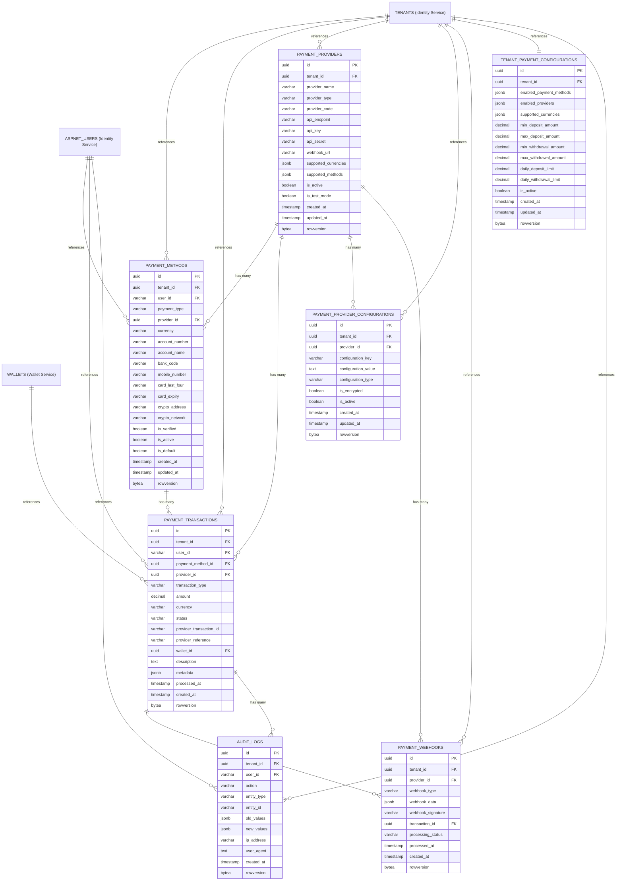

# 💳 **Payment Service ER Diagram**

## 🎯 **Service Overview**
The Payment Service handles all payment processing and external payment provider integrations for the betting platform. It manages payment methods, processes deposits/withdrawals, and integrates with multiple payment providers with complete multi-tenant isolation.

**Note: Wallet management is handled by the separate Wallet Service.**

## 📊 **Table Organization**

### **💳 1. PAYMENT METHODS (1 table)**
- `PAYMENT_METHODS` - User payment options

### **🔄 2. PAYMENT PROCESSING (1 table)**
- `PAYMENT_TRANSACTIONS` - Payment transaction tracking

### **🏦 3. PAYMENT PROVIDERS (2 tables)**
- `PAYMENT_PROVIDERS` - Payment provider management
- `PAYMENT_PROVIDER_CONFIGURATIONS` - Provider-specific settings

### **🔗 4. INTEGRATION (1 table)**
- `PAYMENT_WEBHOOKS` - Webhook processing

### **⚙️ 5. CONFIGURATIONS (1 table)**
- `TENANT_PAYMENT_CONFIGURATIONS` - Payment method settings per tenant

### **📋 6. AUDIT & LOGGING (1 table)**
- `AUDIT_LOGS` - Complete audit trail

## 🎯 **Total: 7 Tables**

### **🔗 External Service References:**
- **TENANTS** → Referenced from Identity Service (not duplicated)
- **ASPNET_USERS** → Referenced from Identity Service (not duplicated)
- **WALLETS** → Referenced from Wallet Service (not duplicated)

## 🚀 **Key Features:**

### **✅ Payment Processing**
- **Multiple Payment Methods** → Bank transfer, mobile money, cards, crypto
- **Multiple Providers** → M-Pesa, Chapa, ArifPay, Stripe, PayPal, etc.
- **Real-time Processing** → Webhook-based updates
- **Multi-Currency Support** → USD, EUR, BTC, ETH, USDT, etc.

### **✅ Security & Compliance**
- **Encrypted Data** → Sensitive payment information
- **Webhook Validation** → Signature verification
- **OTP Verification** → Two-factor authentication
- **Audit Logging** → Complete transaction tracking

### **✅ High-Performance Operations**
- **Rowversion Support** → Optimistic concurrency control
- **Partitioned Tables** → Monthly partitions for scale
- **Auto-Cleanup** → TTL for temporary data
- **Multi-Tenant Isolation** → Complete data separation

---

## 📚 **Detailed Table Definitions**

### 1) **PAYMENT_METHODS** - User Payment Options

> **Purpose:** User payment method management with multiple payment options
> 
> **When to Use:**
> - **User Registration** → Create payment methods for new users
> - **Payment Method Management** → Users managing their payment options
> - **Payment Processing** → Select payment method for transactions
> - **Payment Method Verification** → Validate payment method before use
> - **Multi-Currency Support** → Different payment methods for different currencies
> 
> **Key Operations:**
> - Add payment method for user
> - Update payment method details
> - Verify payment method
> - Delete payment method
> - Get user payment methods

| **Column** | **Type** | **Default** | **Constraints** | **Description** |
|------------|----------|-------------|-----------------|-----------------|
| **id** | `uuid` | `gen_random_uuid()` | `PRIMARY KEY` | Unique payment method identifier |
| **tenant_id** | `uuid` | - | `NOT NULL, FK→TENANTS.id` | Multi-tenant isolation |
| **user_id** | `varchar(50)` | - | `NOT NULL, FK→ASPNET_USERS.id` | Payment method owner |
| **payment_type** | `varchar(30)` | - | `NOT NULL` | Payment type (bank_transfer/mobile_money/card/crypto) |
| **provider_id** | `uuid` | - | `NOT NULL, FK→PAYMENT_PROVIDERS.id` | Payment provider |
| **currency** | `varchar(10)` | - | `NOT NULL` | Payment currency (USD, EUR, BTC, ETH, USDT) |
| **account_number** | `varchar(100)` | `null` | - | Account number (encrypted) |
| **account_name** | `varchar(100)` | `null` | - | Account holder name |
| **bank_code** | `varchar(20)` | `null` | - | Bank code for bank transfers |
| **mobile_number** | `varchar(20)` | `null` | - | Mobile number for mobile money |
| **card_last_four** | `varchar(4)` | `null` | - | Last 4 digits of card |
| **card_expiry** | `varchar(7)` | `null` | - | Card expiry (MM/YYYY) |
| **crypto_address** | `varchar(100)` | `null` | - | Crypto wallet address |
| **crypto_network** | `varchar(20)` | `null` | - | Crypto network (bitcoin, ethereum, bsc) |
| **is_verified** | `boolean` | `false` | `NOT NULL` | Payment method verification status |
| **is_active** | `boolean` | `true` | `NOT NULL` | Payment method status |
| **is_default** | `boolean` | `false` | `NOT NULL` | Default payment method flag |
| **created_at** | `timestamp` | `now()` | `NOT NULL` | Creation timestamp |
| **updated_at** | `timestamp` | `now()` | `NOT NULL` | Last update timestamp |
| **rowversion** | `bytea` | `gen_random_bytes(8)` | `NOT NULL` | Row version for optimistic concurrency |

### 2) **PAYMENT_TRANSACTIONS** - Payment Transaction Tracking

> **Purpose:** Payment transaction tracking with provider integration
> 
> **When to Use:**
> - **Payment Processing** → Record payment operations with providers
> - **Provider Integration** → Link with external payment providers
> - **Webhook Processing** → Update transaction status from webhooks
> - **Payment History** → Track payment status and lifecycle
> - **Audit Compliance** → Complete payment audit trail
> 
> **Key Operations:**
> - Create payment transaction
> - Update transaction status
> - Process webhook updates
> - Handle payment failures
> - Generate payment reports

| **Column** | **Type** | **Default** | **Constraints** | **Description** |
|------------|----------|-------------|-----------------|-----------------|
| **id** | `uuid` | `gen_random_uuid()` | `PRIMARY KEY` | Unique transaction identifier |
| **tenant_id** | `uuid` | - | `NOT NULL, FK→TENANTS.id` | Multi-tenant isolation |
| **user_id** | `varchar(50)` | - | `NOT NULL, FK→ASPNET_USERS.id` | Transaction owner |
| **payment_method_id** | `uuid` | - | `NOT NULL, FK→PAYMENT_METHODS.id` | Payment method used |
| **provider_id** | `uuid` | - | `NOT NULL, FK→PAYMENT_PROVIDERS.id` | Payment provider |
| **transaction_type** | `varchar(30)` | - | `NOT NULL` | Transaction type (deposit/withdrawal/refund) |
| **amount** | `decimal(18,8)` | - | `NOT NULL, CHECK > 0` | Transaction amount (8 decimals for crypto) |
| **currency** | `varchar(10)` | - | `NOT NULL` | Transaction currency |
| **status** | `varchar(20)` | `'pending'` | `NOT NULL` | Transaction status (pending/processing/completed/failed/cancelled) |
| **provider_transaction_id** | `varchar(100)` | `null` | - | Provider transaction ID |
| **provider_reference** | `varchar(100)` | `null` | - | Provider reference number |
| **wallet_id** | `uuid` | `null` | `FK→WALLETS.id` | Target wallet (Wallet Service) |
| **description** | `text` | `null` | - | Transaction description |
| **provider_response** | `jsonb` | `'{}'` | `NOT NULL` | Provider response data (JSON) |
| **processed_at** | `timestamp` | `null` | - | Processing completion timestamp |
| **created_at** | `timestamp` | `now()` | `NOT NULL` | Transaction timestamp |
| **rowversion** | `bytea` | `gen_random_bytes(8)` | `NOT NULL` | Row version for optimistic concurrency |

### 3) **PAYMENT_PROVIDERS** - Payment Provider Management

> **Purpose:** Payment provider management with multiple provider support
> 
> **When to Use:**
> - **Provider Registration** → Add new payment providers
> - **Provider Configuration** → Configure provider settings
> - **Provider Selection** → Select provider for transactions
> - **Provider Management** → Enable/disable providers
> - **Multi-Provider Support** → Support multiple payment providers
> 
> **Key Operations:**
> - Add payment provider
> - Configure provider settings
> - Enable/disable provider
> - Update provider configuration
> - Get available providers

| **Column** | **Type** | **Default** | **Constraints** | **Description** |
|------------|----------|-------------|-----------------|-----------------|
| **id** | `uuid` | `gen_random_uuid()` | `PRIMARY KEY` | Unique provider identifier |
| **tenant_id** | `uuid` | - | `NOT NULL, FK→TENANTS.id` | Multi-tenant isolation |
| **provider_name** | `varchar(50)` | - | `NOT NULL` | Provider name (M-Pesa, Chapa, ArifPay, Stripe) |
| **provider_type** | `varchar(30)` | - | `NOT NULL` | Provider type (mobile_money/bank_transfer/card/crypto) |
| **provider_code** | `varchar(20)` | - | `NOT NULL, UNIQUE` | Provider code (MPESA, CHAPA, ARIFPAY, STRIPE) |
| **api_endpoint** | `varchar(200)` | - | `NOT NULL` | Provider API endpoint |
| **api_key** | `varchar(200)` | - | `NOT NULL` | Provider API key (encrypted) |
| **api_secret** | `varchar(200)` | - | `NOT NULL` | Provider API secret (encrypted) |
| **webhook_url** | `varchar(200)` | `null` | - | Provider webhook URL |
| **supported_currencies** | `jsonb` | `'[]'` | `NOT NULL` | Supported currencies (JSON array) |
| **supported_methods** | `jsonb` | `'[]'` | `NOT NULL` | Supported payment methods (JSON array) |
| **is_active** | `boolean` | `true` | `NOT NULL` | Provider status |
| **is_test_mode** | `boolean` | `true` | `NOT NULL` | Test mode flag |
| **created_at** | `timestamp` | `now()` | `NOT NULL` | Creation timestamp |
| **updated_at** | `timestamp` | `now()` | `NOT NULL` | Last update timestamp |
| **rowversion** | `bytea` | `gen_random_bytes(8)` | `NOT NULL` | Row version for optimistic concurrency |

### 6) **PAYMENT_PROVIDER_CONFIGURATIONS** - Provider-Specific Settings

> **Purpose:** Provider-specific configuration and settings management
> 
> **When to Use:**
> - **Provider Configuration** → Configure provider-specific settings
> - **Provider Limits** → Set transaction limits per provider
> - **Provider Fees** → Configure provider fees and charges
> - **Provider Settings** → Configure provider-specific options
> - **Multi-Tenant Configuration** → Different settings per tenant
> 
> **Key Operations:**
> - Configure provider settings
> - Set transaction limits
> - Configure provider fees
> - Update provider configuration
> - Get provider settings

| **Column** | **Type** | **Default** | **Constraints** | **Description** |
|------------|----------|-------------|-----------------|-----------------|
| **id** | `uuid` | `gen_random_uuid()` | `PRIMARY KEY` | Unique configuration identifier |
| **tenant_id** | `uuid` | - | `NOT NULL, FK→TENANTS.id` | Multi-tenant isolation |
| **provider_id** | `uuid` | - | `NOT NULL, FK→PAYMENT_PROVIDERS.id` | Payment provider |
| **configuration_key** | `varchar(100)` | - | `NOT NULL` | Configuration key |
| **configuration_value** | `text` | - | `NOT NULL` | Configuration value |
| **configuration_type** | `varchar(20)` | `'string'` | `NOT NULL` | Configuration type (string/number/boolean/json) |
| **is_encrypted** | `boolean` | `false` | `NOT NULL` | Encrypted configuration flag |
| **is_active** | `boolean` | `true` | `NOT NULL` | Configuration status |
| **created_at** | `timestamp` | `now()` | `NOT NULL` | Creation timestamp |
| **updated_at** | `timestamp` | `now()` | `NOT NULL` | Last update timestamp |
| **rowversion** | `bytea` | `gen_random_bytes(8)` | `NOT NULL` | Row version for optimistic concurrency |

### 7) **PAYMENT_WEBHOOKS** - Webhook Processing

> **Purpose:** Webhook processing for real-time payment updates
> 
> **When to Use:**
> - **Webhook Reception** → Receive webhooks from payment providers
> - **Webhook Processing** → Process webhook data
> - **Transaction Updates** → Update transaction status from webhooks
> - **Webhook Validation** → Validate webhook signatures
> - **Webhook History** → Track webhook processing
> 
> **Key Operations:**
> - Receive webhook
> - Validate webhook signature
> - Process webhook data
> - Update transaction status
> - Log webhook processing

| **Column** | **Type** | **Default** | **Constraints** | **Description** |
|------------|----------|-------------|-----------------|-----------------|
| **id** | `uuid` | `gen_random_uuid()` | `PRIMARY KEY` | Unique webhook identifier |
| **tenant_id** | `uuid` | - | `NOT NULL, FK→TENANTS.id` | Multi-tenant isolation |
| **provider_id** | `uuid` | - | `NOT NULL, FK→PAYMENT_PROVIDERS.id` | Payment provider |
| **webhook_type** | `varchar(30)` | - | `NOT NULL` | Webhook type (payment_completed/payment_failed/refund_processed) |
| **webhook_data** | `jsonb` | `'{}'` | `NOT NULL` | Webhook payload data (JSON) |
| **webhook_signature** | `varchar(200)` | `null` | - | Webhook signature for validation |
| **transaction_id** | `uuid` | `null` | `FK→PAYMENT_TRANSACTIONS.id` | Related transaction |
| **processing_status** | `varchar(20)` | `'pending'` | `NOT NULL` | Processing status (pending/processed/failed) |
| **processed_at** | `timestamp` | `null` | - | Processing completion timestamp |
| **created_at** | `timestamp` | `now()` | `NOT NULL` | Webhook timestamp |
| **rowversion** | `bytea` | `gen_random_bytes(8)` | `NOT NULL` | Row version for optimistic concurrency |

### 6) **TENANT_PAYMENT_CONFIGURATIONS** - Payment Method Settings per Tenant

> **Purpose:** Tenant-specific payment configuration and settings
> 
> **When to Use:**
> - **Tenant Configuration** → Configure payment settings per tenant
> - **Payment Method Control** → Enable/disable payment methods per tenant
> - **Limit Management** → Set transaction limits per tenant
> - **Provider Selection** → Configure available providers per tenant
> - **Currency Support** → Configure supported currencies per tenant
> 
> **Key Operations:**
> - Configure tenant payment settings
> - Enable/disable payment methods
> - Set transaction limits
> - Configure available providers
> - Update tenant configuration

| **Column** | **Type** | **Default** | **Constraints** | **Description** |
|------------|----------|-------------|-----------------|-----------------|
| **id** | `uuid` | `gen_random_uuid()` | `PRIMARY KEY` | Unique configuration identifier |
| **tenant_id** | `uuid` | - | `NOT NULL, UNIQUE, FK→TENANTS.id` | Multi-tenant isolation |
| **enabled_payment_methods** | `jsonb` | `'[]'` | `NOT NULL` | Enabled payment methods (JSON array) |
| **enabled_providers** | `jsonb` | `'[]'` | `NOT NULL` | Enabled providers (JSON array) |
| **supported_currencies** | `jsonb` | `'[]'` | `NOT NULL` | Supported currencies (JSON array) |
| **min_deposit_amount** | `decimal(18,8)` | `1.00` | `NOT NULL, CHECK > 0` | Minimum deposit amount |
| **max_deposit_amount** | `decimal(18,8)` | `10000.00` | `NOT NULL, CHECK > 0` | Maximum deposit amount |
| **min_withdrawal_amount** | `decimal(18,8)` | `1.00` | `NOT NULL, CHECK > 0` | Minimum withdrawal amount |
| **max_withdrawal_amount** | `decimal(18,8)` | `5000.00` | `NOT NULL, CHECK > 0` | Maximum withdrawal amount |
| **daily_deposit_limit** | `decimal(18,8)` | `50000.00` | `NOT NULL, CHECK > 0` | Daily deposit limit |
| **daily_withdrawal_limit** | `decimal(18,8)` | `25000.00` | `NOT NULL, CHECK > 0` | Daily withdrawal limit |
| **is_active** | `boolean` | `true` | `NOT NULL` | Configuration status |
| **created_at** | `timestamp` | `now()` | `NOT NULL` | Creation timestamp |
| **updated_at** | `timestamp` | `now()` | `NOT NULL` | Last update timestamp |
| **rowversion** | `bytea` | `gen_random_bytes(8)` | `NOT NULL` | Row version for optimistic concurrency |

### 7) **AUDIT_LOGS** - Complete Audit Trail

> **Purpose:** Complete audit trail for security, compliance, and regulatory requirements
> 
> **When to Use:**
> - **Security Auditing** → Track all payment operations
> - **Compliance Reporting** → Generate compliance reports
> - **Regulatory Requirements** → Meet regulatory audit requirements
> - **Security Monitoring** → Monitor payment security
> - **Transaction Tracking** → Track all payment activities
> 
> **Key Operations:**
> - Log payment operations
> - Track user activities
> - Monitor security events
> - Generate audit reports
> - Compliance reporting

| **Column** | **Type** | **Default** | **Constraints** | **Description** |
|------------|----------|-------------|-----------------|-----------------|
| **id** | `uuid` | `gen_random_uuid()` | `PRIMARY KEY` | Unique audit log identifier |
| **tenant_id** | `uuid` | - | `NOT NULL, FK→TENANTS.id` | Multi-tenant isolation |
| **user_id** | `varchar(50)` | `null` | `FK→ASPNET_USERS.id` | User who performed action |
| **action** | `varchar(30)` | - | `NOT NULL` | Action type (create/update/delete/process/validate) |
| **entity_type** | `varchar(30)` | - | `NOT NULL` | Entity type (payment_method/transaction/deposit/withdrawal) |
| **entity_id** | `varchar(100)` | - | `NOT NULL` | ID of affected entity |
| **old_values** | `jsonb` | `null` | - | Previous values (JSON) |
| **new_values** | `jsonb` | `null` | - | New values (JSON) |
| **ip_address** | `varchar(45)` | `null` | - | User IP address |
| **user_agent** | `text` | `null` | - | User agent string |
| **created_at** | `timestamp` | `now()` | `NOT NULL` | Audit timestamp |
| **rowversion** | `bytea` | `gen_random_bytes(8)` | `NOT NULL` | Row version for optimistic concurrency |

---

## 🎯 **Entity Relationship Diagram**

## 🎯 **Table Relationships**

### **📊 Core Relationships:**
- **TENANTS (Identity Service)** → **PAYMENT_METHODS** (1:Many) - External reference for multi-tenant isolation
- **ASPNET_USERS (Identity Service)** → **PAYMENT_METHODS** (1:Many) - External reference for user identification
- **WALLETS (Wallet Service)** → **PAYMENT_TRANSACTIONS** (1:Many) - External reference for wallet integration
- **PAYMENT_METHODS** → **PAYMENT_TRANSACTIONS** (1:Many) - One payment method has many transactions
- **PAYMENT_PROVIDERS** → **PAYMENT_METHODS** (1:Many) - One provider has many payment methods
- **PAYMENT_PROVIDERS** → **PAYMENT_TRANSACTIONS** (1:Many) - One provider has many transactions
- **PAYMENT_TRANSACTIONS** → **PAYMENT_WEBHOOKS** (1:Many) - One transaction can have multiple webhooks
- **TENANTS (Identity Service)** → **TENANT_PAYMENT_CONFIGURATIONS** (1:1) - External reference

### **🔗 Foreign Key Constraints:**
- All tables reference `TENANTS.id` (Identity Service) for multi-tenant isolation
- All tables reference `ASPNET_USERS.id` (Identity Service) for user identification
- `PAYMENT_TRANSACTIONS.wallet_id` → `WALLETS.id` (Wallet Service)
- `PAYMENT_TRANSACTIONS.payment_method_id` → `PAYMENT_METHODS.id`
- `PAYMENT_TRANSACTIONS.provider_id` → `PAYMENT_PROVIDERS.id`
- `PAYMENT_PROVIDER_CONFIGURATIONS.provider_id` → `PAYMENT_PROVIDERS.id`
- `PAYMENT_WEBHOOKS.provider_id` → `PAYMENT_PROVIDERS.id`
- `PAYMENT_WEBHOOKS.transaction_id` → `PAYMENT_TRANSACTIONS.id`

**This Payment Service ER diagram provides complete payment processing and external payment provider integration capabilities with multi-tenant support for your betting platform!** 🎯