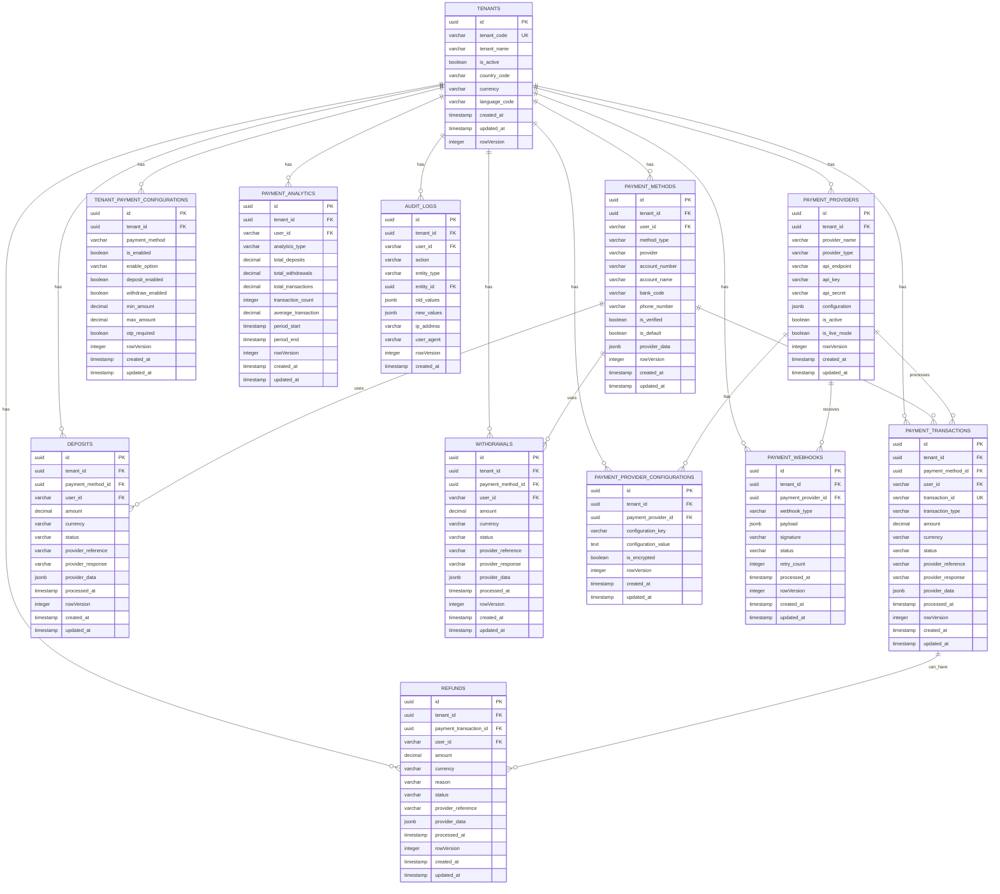

# 💳 **Payment Service ER Diagram**

## 🎯 **Service Overview**
The Payment Service handles all payment processing and external payment provider integrations for the betting platform. It manages payment methods, processes deposits/withdrawals, and integrates with multiple payment providers with complete multi-tenant isolation.

**Note: Wallet management is handled by the separate Wallet Service.**

## 📊 **Entity Relationship Diagram**

## 🎯 **SRS Requirements Coverage**

### **FR-017: Payment Integration and Processing** ✅
- **Payment Provider Integration** → `PAYMENT_PROVIDERS` with multiple provider support
- **Payment Method Management** → `PAYMENT_METHODS` with user payment options
- **Transaction Processing** → `PAYMENT_TRANSACTIONS` with complete lifecycle
- **Webhook Handling** → `PAYMENT_WEBHOOKS` for real-time updates
- **Provider Configuration** → `PAYMENT_PROVIDER_CONFIGURATIONS` for settings

## 🔒 **Security Features**

### **1. Multi-Tenant Isolation**
- **TenantId in every table** for complete data isolation
- **No cross-tenant data access** possible
- **Tenant-scoped queries** for performance

### **2. Payment Security**
- **Encrypted payment data** with provider-specific encryption
- **Webhook signature validation** for security
- **Audit trail** for all financial transactions
- **OTP verification** for sensitive operations

### **3. Data Integrity**
- **Transaction atomicity** with proper rollback
- **Balance consistency** with transaction validation
- **Provider integration** with retry mechanisms
- **Real-time monitoring** with webhook processing

## 🚀 **Performance Optimizations**

### **1. Indexing Strategy**
- **Primary indexes** on all ID columns
- **Composite indexes** on (tenant_id, user_id, created_at)
- **Performance indexes** on frequently queried columns
- **Transaction indexes** for payment processing

### **2. Query Optimization**
- **TenantId filtering** on all queries
- **Efficient joins** with proper foreign keys
- **Caching strategy** for payment providers
- **Real-time updates** with webhook processing

## 📊 **Complete Table Organization & Structure**

### **🏢 1. TENANT MANAGEMENT (1 table)**
- `TENANTS` - Core tenant information

#### **💳 2. PAYMENT METHODS (1 table)**
- `PAYMENT_METHODS` - User payment options

#### **🔄 3. PAYMENT PROCESSING (4 tables)**
- `PAYMENT_TRANSACTIONS` - Payment transaction tracking
- `DEPOSITS` - Deposit transaction management
- `WITHDRAWALS` - Withdrawal transaction management
- `REFUNDS` - Refund transaction management

#### **🏦 4. PAYMENT PROVIDERS (2 tables)**
- `PAYMENT_PROVIDERS` - Payment provider management
- `PAYMENT_PROVIDER_CONFIGURATIONS` - Provider-specific settings

#### **⚙️ 5. TENANT CONFIGURATIONS (1 table)**
- `TENANT_PAYMENT_CONFIGURATIONS` - Payment method settings per tenant

#### **🔗 6. INTEGRATION (2 tables)**
- `PAYMENT_WEBHOOKS` - Webhook processing
- `PAYMENT_ANALYTICS` - Payment analytics and reporting

#### **📋 7. AUDIT & LOGGING (1 table)**
- `AUDIT_LOGS` - Complete audit trail

## 🎯 **Total: 12 Tables**

### **✅ Complete Coverage:**
1. **Payment Methods** (1 table)
2. **Payment Processing** (4 tables)
3. **Payment Providers** (2 tables)
4. **Tenant Configurations** (1 table)
5. **Integration** (2 tables)
6. **Analytics** (1 table)
7. **Audit & Logging** (1 table)

### **✅ Migration Strategy:**
- **Preserve Business Logic** → Keep your current payment processing logic
- **Enhance with .NET** → Add modern microservices architecture
- **Multi-Tenant Support** → Add tenant_id to all existing patterns
- **Payment Provider Integration** → Enhance with modern payment APIs

## 🚀 **Key Features:**

### **✅ 1. Payment Method Management**
- **Multiple Payment Methods** → Bank transfer, mobile money, cards
- **User Payment Options** → Saved payment methods
- **Payment Method Verification** → Secure payment method validation
- **Payment Method Analytics** → Usage tracking and reporting

### **✅ 2. Comprehensive Payment Processing**
- **Multiple Providers** → M-Pesa, Chapa, ArifPay, etc.
- **Real-time Processing** → Webhook-based updates
- **Transaction History** → Complete audit trail
- **Provider Integration** → Seamless provider switching

### **✅ 3. Advanced Security**
- **Encrypted Data** → Sensitive payment information
- **Webhook Validation** → Signature verification
- **OTP Verification** → Two-factor authentication
- **Audit Logging** → Complete transaction tracking

### **✅ 4. Tenant-Specific Configuration**
- **Payment Method Control** → Enable/disable per tenant
- **Limit Management** → Min/max amounts per tenant
- **Provider Selection** → Available providers per tenant
- **Currency Support** → Multi-currency per tenant

---

**This Payment Service ER diagram provides complete payment processing and external payment provider integration capabilities with multi-tenant support for your betting platform!** 🎯
