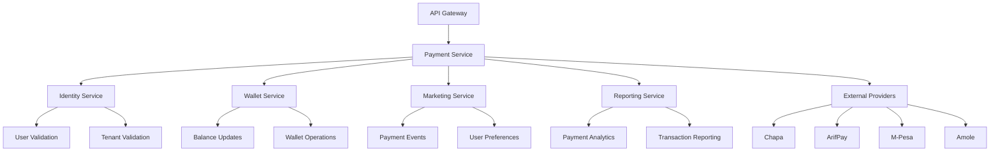

# 💳 **Payment Service ER Diagram**

## 🎯 **Service Overview**
The Payment Service handles all payment processing and external payment provider integrations for the betting platform. It manages payment methods, processes deposits/withdrawals, and integrates with multiple payment providers with complete multi-tenant isolation.

**Note: Wallet management is handled by the separate Wallet Service.**

## 📊 **Table Organization**

### **💳 1. PAYMENT METHODS (1 table)**
- `PAYMENT_METHODS` - User payment options

### **🔄 2. PAYMENT PROCESSING (2 tables)**
- `PAYMENT_REQUESTS` - Payment requests saved on our side before external provider call
- `PAYMENT_TRANSACTIONS` - Payment transaction tracking after external provider response

### **🏦 3. PAYMENT PROVIDERS (2 tables)**
- `PAYMENT_PROVIDERS` - Payment provider management
- `PAYMENT_PROVIDER_CONFIGURATIONS` - Provider-specific settings

### **🔗 4. INTEGRATION (1 table)**
- `PAYMENT_WEBHOOKS` - Webhook processing

### **⚙️ 5. CONFIGURATIONS (1 table)**
- `TENANT_PAYMENT_CONFIGURATIONS` - Payment method settings per tenant

### **📋 6. AUDIT & LOGGING (1 table)**
- `AUDIT_LOGS` - Complete audit trail

## 🎯 **Total: 8 Tables**

### **🔗 External Service References:**
- **TENANTS** → Referenced from Identity Service (not duplicated)
- **ASPNET_USERS** → Referenced from Identity Service (not duplicated)
- **WALLETS** → Referenced from Wallet Service (not duplicated)

## 🚀 **Key Features:**

### **✅ Payment Processing**
- **Multiple Payment Methods** → Bank transfer, mobile money, cards, crypto
- **Multiple Providers** → M-Pesa, Chapa, ArifPay, Amole, CBE Birr, Telebirr, etc.
- **Real-time Processing** → Webhook-based updates
- **Multi-Currency Support** → USD, EUR, BTC, ETH, USDT, etc.

> **📝 Note:** Credit cards and crypto payments are **optional for the time being** and can be enabled/disabled per tenant configuration.

### **✅ Security & Compliance**
- **Encrypted Data** → Sensitive payment information
- **Webhook Validation** → Signature verification
- **OTP Verification** → Two-factor authentication
- **Audit Logging** → Complete transaction tracking

### **✅ High-Performance Operations**
- **Rowversion Support** → Optimistic concurrency control
- **Partitioned Tables** → Monthly partitions for scale
- **Auto-Cleanup** → TTL for temporary data
- **Multi-Tenant Isolation** → Complete data separation

### **🏥 Payment Health Monitoring**
- **Real-Time Metrics** → Success rate, response time, error rate
- **Provider Health** → Automated health checks every 5 minutes
- **Performance Tracking** → Average response times and throughput
- **Alert System** → Automatic alerts for degraded performance
- **Load Balancing** → Route payments to healthiest providers

### **🎛️ Payment Request Control**
- **Request Prioritization** → High/Medium/Low/Emergency priority levels
- **Rate Limiting** → Prevent request spam and system overload
- **Queue Management** → Process requests in priority order
- **Retry Logic** → Automatic retry with exponential backoff
- **Request Deduplication** → Prevent duplicate payment requests
- **Load Balancing** → Distribute requests across healthy providers

---

## 📚 **Detailed Table Definitions**

### 1) **PAYMENT_METHODS** - User Payment Options

> **Purpose:** User payment method management with multiple payment options
> 
> **When to Use:**
> - **User Registration** → Create payment methods for new users
> - **Payment Method Management** → Users managing their payment options
> - **Payment Processing** → Select payment method for transactions
> - **Payment Method Verification** → Validate payment method before use
> - **Multi-Currency Support** → Different payment methods for different currencies
> 
> **Key Operations:**
> - Add payment method for user
> - Update payment method details
> - Verify payment method
> - Delete payment method
> - Get user payment methods

| **Column** | **Type** | **Default** | **Constraints** | **Description** |
|------------|----------|-------------|-----------------|-----------------|
| **id** | `uuid` | `gen_random_uuid()` | `PRIMARY KEY` | **Unique payment method identifier** - System-generated UUID for internal tracking and API references - Used for all database operations, API calls, and external integrations - Immutable once created |
| **tenant_id** | `uuid` | - | `NOT NULL, FK→TENANTS.id` | **Multi-tenant isolation** - Links to tenant in Identity Service, ensures complete data separation between different betting platforms - Critical for data security and compliance - Used in all queries for tenant filtering |
| **user_id** | `varchar(50)` | - | `NOT NULL, FK→ASPNET_USERS.id` | **Payment method owner** - References user in Identity Service, each payment method belongs to exactly one user - Used for user-specific payment method queries - Links to user's betting account and wallet |
| **payment_type** | `varchar(30)` | - | `NOT NULL` | **Payment method type** - bank_transfer, mobile_money, card, crypto - *card/crypto optional* - Determines which fields are used and validation rules - Controls UI display and processing logic - Used for payment method filtering and selection |
| **provider_id** | `uuid` | - | `NOT NULL, FK→PAYMENT_PROVIDERS.id` | **External payment provider** - References PAYMENT_PROVIDERS table (M-Pesa, Chapa, ArifPay, Amole, CBE Birr, Telebirr, etc.) - Determines API integration and processing rules - Used for provider-specific validation and webhook routing - Links to provider configuration and credentials |
| **currency** | `varchar(10)` | - | `NOT NULL` | **Payment currency code** - USD, EUR, ETB, BTC, ETH, USDT - Must match wallet currency - ISO 4217 standard format - Used for currency-specific validation and exchange rate calculation - Determines supported payment methods per currency |
| **account_number** | `varchar(100)` | `null` | - | **Bank account number (encrypted)** - Used for bank transfers and withdrawals - Must be encrypted at rest using AES-256 encryption - Format varies by country/bank (IBAN, account number, routing number) - Used for payment processing and verification - Never displayed in full to users |
| **account_name** | `varchar(100)` | `null` | - | **Account holder's full name** - Must match bank records exactly - Used for verification and compliance - Case-sensitive and must match exactly - Used for payment processing and fraud prevention - Displayed to users for confirmation |
| **bank_code** | `varchar(20)` | `null` | - | **Bank identification code** - SWIFT/BIC for international transfers or local bank code - Required for international transfers - Used for routing payments to correct bank - Format: SWIFT (8-11 chars) or local bank codes - Validated against bank directory |
| **mobile_number** | `varchar(20)` | `null` | - | **Mobile phone number** - Format: +251911234567 - Must include country code - Used for mobile money services (M-Pesa, Chapa, etc.) - Validated for correct format and country - Used for SMS verification and payment processing |
| **card_last_four** | `varchar(4)` | `null` | - | **Last 4 digits of credit/debit card** *(optional)* - Never store full card number - Used for identification and display - PCI DSS compliant - Masked for security (e.g., "****1234") - Used for user identification of their cards |
| **card_expiry** | `varchar(7)` | `null` | - | **Card expiry date** *(optional)* - MM/YYYY format (e.g., "12/2025") - Used for card validation and display - Never store full expiry - Used for card expiration checks and user display - Validated against current date |
| **crypto_address** | `varchar(100)` | `null` | - | **Cryptocurrency wallet address** *(optional)* - Bitcoin, Ethereum, USDT, etc. - Must be valid for specified network - Case-sensitive - Used for crypto deposits and withdrawals - Validated against blockchain network format |
| **crypto_network** | `varchar(20)` | `null` | - | **Blockchain network identifier** *(optional)* - bitcoin, ethereum, bsc, polygon, solana - Determines address format validation - Used for network-specific processing - Controls which blockchain to use for transactions |
| **is_verified** | `boolean` | `false` | `NOT NULL` | **Payment method verification status** - **See verification details below** - Controls whether method can be used for transactions - Prevents unverified methods from processing payments - Used for fraud prevention and compliance - Updated after successful verification process |
| **is_active** | `boolean` | `true` | `NOT NULL` | **Payment method enabled/disabled status** - Users can temporarily disable methods - Admin can disable for security/compliance - Controls payment method availability in UI - Used for soft deletion and temporary suspension - Prevents processing through inactive methods |
| **is_default** | `boolean` | `false` | `NOT NULL` | **Primary payment method flag** - Only one default per user per currency - Used for auto-selection in transactions - Automatically selected when user doesn't specify method - Updated when user changes default preference - Used for quick payment processing |
| **created_at** | `timestamp` | `now()` | `NOT NULL` | **Creation timestamp** - UTC timestamp when payment method was added - Used for audit and reporting - Immutable once set - Used for payment method age validation - Required for compliance and audit trails |
| **updated_at** | `timestamp` | `now()` | `NOT NULL` | **Last update timestamp** - UTC timestamp of last modification - Auto-updated on changes - Used for change tracking and audit - Updated by database triggers - Used for conflict resolution and change detection |
| **rowversion** | `bytea` | `gen_random_bytes(8)` | `NOT NULL` | **Row version for optimistic concurrency** - Prevents concurrent update conflicts - Auto-generated 8-byte value - Used for optimistic locking in high-concurrency scenarios - Prevents lost updates and data corruption - Automatically updated on each row modification |

#### **🔐 Payment Method Verification Process:**

> **Purpose:** The `is_verified` field ensures payment methods are legitimate and belong to the user before allowing transactions.

##### **Verification Requirements by Payment Type:**

**🏦 Bank Transfer Verification:**
- **Account Ownership** → Verify account number matches user's registered bank account
- **Micro-deposit** → Send small amount (e.g., $0.01) and require user to confirm exact amount
- **Bank Statement** → User uploads bank statement showing account ownership
- **Manual Review** → Admin reviews bank documents for high-value accounts

**📱 Mobile Money Verification:**
- **SMS Verification** → Send OTP to mobile number, user confirms code
- **USSD Confirmation** → User dials USSD code to confirm mobile money account
- **Provider API** → Query mobile money provider to verify account ownership
- **Transaction Test** → Small test transaction to verify account is active

**💳 Credit Card Verification:**
- **Card Validation** → Verify card number, expiry, CVV through payment processor
- **Address Verification** → Match billing address with card issuer records
- **3D Secure** → Complete 3D Secure authentication flow
- **Small Charge** → Temporary authorization charge (refunded immediately)

**₿ Crypto Verification:**
- **Address Ownership** → User signs message with private key to prove ownership
- **Test Transaction** → Send small amount to verify address is controlled by user
- **Blockchain Confirmation** → Verify transaction appears on blockchain
- **Network Validation** → Confirm address format matches specified network

##### **Verification States:**
- **`false`** → Payment method added but not yet verified
- **`true`** → Payment method verified and ready for transactions
- **`null`** → Verification not required for this payment type

##### **Verification Workflow:**
1. **User adds payment method** → `is_verified = false`
2. **System initiates verification** → Send verification request
3. **User completes verification** → OTP, micro-deposit, etc.
4. **System validates response** → Confirm verification details
5. **Update status** → `is_verified = true`
6. **Enable transactions** → Payment method ready for use

##### **Security Benefits:**
- **Prevent Fraud** → Ensure payment methods belong to legitimate users
- **Reduce Chargebacks** → Verified methods have lower dispute rates
- **Compliance** → Meet regulatory requirements for payment verification
- **Risk Management** → Unverified methods have transaction limits

### 2) **PAYMENT_REQUESTS** - Unified Payment Requests (Our Side)

> **Purpose:** Unified payment requests for all providers (Chapa, ArifPay, M-Pesa, etc.) saved on our side before calling external providers
> 
> **When to Use:**
> - **Deposit Requests** → Save deposit request before calling any provider
> - **Withdrawal Requests** → Save withdrawal request after decreasing balance
> - **Request Tracking** → Track payment requests with reference keys
> - **Provider Communication** → Send reference key to external providers
> - **Callback Processing** → Match callbacks with original requests
> - **Unified Processing** → Handle all payment types in one model
> 
> **Key Operations:**
> - Create payment request (any provider)
> - Generate reference key
> - Update request status
> - Process provider callbacks
> - Handle request failures
> - Provider-specific data storage

| **Column** | **Type** | **Default** | **Constraints** | **Description** |
|------------|----------|-------------|-----------------|-----------------|
| **id** | `uuid` | `gen_random_uuid()` | `PRIMARY KEY` | **Unique request identifier** - System-generated UUID for internal tracking - Used for all database operations and API calls - Links to payment transactions and webhooks - Immutable once created - Used for request status tracking |
| **tenant_id** | `uuid` | - | `NOT NULL, FK→TENANTS.id` | **Multi-tenant isolation** - Links to tenant in Identity Service - Ensures complete data separation between betting platforms - Critical for security and compliance - Used in all queries for tenant filtering |
| **user_id** | `varchar(50)` | - | `NOT NULL, FK→ASPNET_USERS.id` | **Request owner** - References user in Identity Service - Links to user's betting account and wallet - Used for user-specific payment request queries - Required for payment processing authorization |
| **payment_method_id** | `uuid` | - | `NOT NULL, FK→PAYMENT_METHODS.id` | **Payment method used** - References PAYMENT_METHODS table - Determines which payment method to use for processing - Links to user's saved payment methods - Used for payment method validation and processing |
| **provider_id** | `uuid` | - | `NOT NULL, FK→PAYMENT_PROVIDERS.id` | **Payment provider** - References PAYMENT_PROVIDERS table - Determines which external provider to use - Used for provider-specific API calls and webhook routing - Links to provider configuration and credentials |
| **request_type** | `varchar(30)` | - | `NOT NULL` | **Request type** - deposit/withdrawal/refund - Determines payment flow direction - Used for processing logic and validation - Controls which fields are required and how processing works |
| **amount** | `decimal(18,8)` | - | `NOT NULL, CHECK > 0` | **Request amount** - Payment amount with 8 decimal precision for crypto support - Must be greater than 0 - Used for payment processing and validation - Supports micro-transactions and high-precision amounts |
| **currency** | `varchar(10)` | - | `NOT NULL` | **Request currency** - ISO 4217 currency code (USD, EUR, ETB, BTC, ETH) - Must match payment method currency - Used for currency validation and exchange rate calculation - Determines supported payment methods |
| **reference_key** | `varchar(100)` | - | `NOT NULL, UNIQUE` | **Our reference key for provider** - Unique identifier sent to external providers - Used for tracking and callback matching - Generated using UUID or custom format - Required for provider communication and webhook processing |
| **wallet_id** | `uuid` | `null` | `FK→WALLETS.id` | **Target wallet (Wallet Service)** - References wallet in Wallet Service - Used for balance updates after successful payment - Links to user's wallet for the specific currency - Required for deposit and withdrawal processing |
| **description** | `text` | `null` | - | **Request description** - Human-readable description of the payment request - Used for user display and audit logging - Can include payment purpose, reference numbers, or notes - Optional field for additional context |
| **status** | `varchar(20)` | `'pending'` | `NOT NULL` | **Request status** - pending/processing/completed/failed/cancelled - Tracks payment request lifecycle - Used for UI display and business logic - Updated throughout payment processing flow |
| **provider_request_id** | `varchar(100)` | `null` | - | **Provider's request ID** - External provider's transaction identifier - Returned by provider after API call - Used for status tracking and callback matching - Required for provider communication and support |
| **provider_response** | `jsonb` | `'{}'` | `NOT NULL` | **Provider response data (JSON)** - Complete response from external provider - Contains provider-specific data and metadata - Used for debugging and audit purposes - Includes provider transaction details and status |
| **callback_received** | `boolean` | `false` | `NOT NULL` | **Callback received flag** - Indicates if webhook callback has been received - Used for timeout handling and retry logic - Prevents duplicate processing of callbacks - Updated when webhook is processed |
| **callback_data** | `jsonb` | `null` | - | **Callback data from provider** - Webhook payload data from external provider - Contains final payment status and details - Used for payment completion processing - Includes provider transaction confirmation |
| **expires_at** | `timestamp` | `null` | - | **Request expiration timestamp** - When payment request expires - Used for timeout handling and cleanup - Prevents processing of expired requests - Set based on provider timeout settings |
| **priority_level** | `varchar(20)` | `'medium'` | `NOT NULL` | **Request priority level** - high/medium/low/emergency - Used for request processing order - High priority for withdrawals, medium for deposits - Used for queue management and load balancing |
| **retry_count** | `integer` | `0` | `NOT NULL` | **Retry attempt counter** - Number of times request has been retried - Used for retry logic and failure handling - Prevents infinite retry loops - Updated on each retry attempt |
| **queue_position** | `integer` | `null` | - | **Queue position** - Position in processing queue - Used for queue management and user display - Set when request is queued - Updated as queue processes |
| **throttle_key** | `varchar(100)` | `null` | - | **Rate limiting key** - Unique key for rate limiting (user_id + payment_type) - Used for request throttling and rate limiting - Prevents request spam - Used for user-specific rate limits |
| **created_at** | `timestamp` | `now()` | `NOT NULL` | **Request timestamp** - UTC timestamp when request was created - Used for audit and reporting - Immutable once set - Required for compliance and audit trails |
| **updated_at** | `timestamp` | `now()` | `NOT NULL` | **Last update timestamp** - UTC timestamp of last modification - Auto-updated on changes - Used for change tracking and audit - Updated by database triggers |
| **rowversion** | `bytea` | `gen_random_bytes(8)` | `NOT NULL` | **Row version for optimistic concurrency** - Prevents concurrent update conflicts - Auto-generated 8-byte value - Used for optimistic locking in high-concurrency scenarios - Prevents lost updates and data corruption |

### 3) **PAYMENT_TRANSACTIONS** - Payment Transaction Tracking

> **Purpose:** Payment transactions created after external provider response/callback
> 
> **When to Use:**
> - **Transaction Completion** → Create transaction after successful provider response
> - **Wallet Integration** → Link completed transactions with wallet operations
> - **Provider Integration** → Link with external payment providers
> - **Webhook Processing** → Update transaction status from webhooks
> - **Payment History** → Track completed payment status and lifecycle
> - **Audit Compliance** → Complete payment audit trail
> 
> **Key Operations:**
> - Create transaction from payment request
> - Update transaction status
> - Process webhook updates
> - Handle payment failures
> - Generate payment reports

| **Column** | **Type** | **Default** | **Constraints** | **Description** |
|------------|----------|-------------|-----------------|-----------------|
| **id** | `uuid` | `gen_random_uuid()` | `PRIMARY KEY` | **Unique transaction identifier** - System-generated UUID for internal tracking - Used for all database operations and API calls - Links to payment requests and webhooks - Immutable once created - Used for transaction status tracking and audit trails |
| **tenant_id** | `uuid` | - | `NOT NULL, FK→TENANTS.id` | **Multi-tenant isolation** - Links to tenant in Identity Service - Ensures complete data separation between betting platforms - Critical for security and compliance - Used in all queries for tenant filtering |
| **user_id** | `varchar(50)` | - | `NOT NULL, FK→ASPNET_USERS.id` | **Transaction owner** - References user in Identity Service - Links to user's betting account and wallet - Used for user-specific transaction queries - Required for payment processing authorization |
| **payment_method_id** | `uuid` | - | `NOT NULL, FK→PAYMENT_METHODS.id` | **Payment method used** - References PAYMENT_METHODS table - Determines which payment method was used for processing - Links to user's saved payment methods - Used for payment method validation and processing |
| **provider_id** | `uuid` | - | `NOT NULL, FK→PAYMENT_PROVIDERS.id` | **Payment provider** - References PAYMENT_PROVIDERS table - Determines which external provider was used - Used for provider-specific API calls and webhook routing - Links to provider configuration and credentials |
| **transaction_type** | `varchar(30)` | - | `NOT NULL` | **Transaction type** - deposit/withdrawal/refund - Determines payment flow direction - Used for processing logic and validation - Controls which fields are required and how processing works |
| **amount** | `decimal(18,8)` | - | `NOT NULL, CHECK > 0` | **Transaction amount** - Payment amount with 8 decimal precision for crypto support - Must be greater than 0 - Used for payment processing and validation - Supports micro-transactions and high-precision amounts |
| **currency** | `varchar(10)` | - | `NOT NULL` | **Transaction currency** - ISO 4217 currency code (USD, EUR, ETB, BTC, ETH) - Must match payment method currency - Used for currency validation and exchange rate calculation - Determines supported payment methods |
| **status** | `varchar(20)` | `'pending'` | `NOT NULL` | **Transaction status** - pending/processing/completed/failed/cancelled - Tracks payment transaction lifecycle - Used for UI display and business logic - Updated throughout payment processing flow |
| **provider_transaction_id** | `varchar(100)` | `null` | - | **Provider's transaction ID** - External provider's transaction identifier - Returned by provider after API call - Used for status tracking and callback matching - Required for provider communication and support |
| **provider_reference** | `varchar(100)` | `null` | - | **Provider reference number** - External provider's reference number - Used for tracking and support - Links to provider's internal systems - Required for provider communication and dispute resolution |
| **wallet_id** | `uuid` | `null` | `FK→WALLETS.id` | **Target wallet (Wallet Service)** - References wallet in Wallet Service - Used for balance updates after successful payment - Links to user's wallet for the specific currency - Required for deposit and withdrawal processing |
| **description** | `text` | `null` | - | **Transaction description** - Human-readable description of the payment transaction - Used for user display and audit logging - Can include payment purpose, reference numbers, or notes - Optional field for additional context |
| **provider_response** | `jsonb` | `'{}'` | `NOT NULL` | **Provider response data (JSON)** - Complete response from external provider - Contains provider-specific data and metadata - Used for debugging and audit purposes - Includes provider transaction details and status |
| **processed_at** | `timestamp` | `null` | - | **Processing completion timestamp** - UTC timestamp when transaction was completed - Used for audit and reporting - Set when transaction status changes to completed - Required for compliance and audit trails |
| **created_at** | `timestamp` | `now()` | `NOT NULL` | **Transaction timestamp** - UTC timestamp when transaction was created - Used for audit and reporting - Immutable once set - Required for compliance and audit trails |
| **rowversion** | `bytea` | `gen_random_bytes(8)` | `NOT NULL` | **Row version for optimistic concurrency** - Prevents concurrent update conflicts - Auto-generated 8-byte value - Used for optimistic locking in high-concurrency scenarios - Prevents lost updates and data corruption |

### 3) **PAYMENT_PROVIDERS** - Payment Provider Management

> **Purpose:** Payment provider management with multiple provider support
> 
> **When to Use:**
> - **Provider Registration** → Add new payment providers
> - **Provider Configuration** → Configure provider settings
> - **Provider Selection** → Select provider for transactions
> - **Provider Management** → Enable/disable providers
> - **Multi-Provider Support** → Support multiple payment providers
> 
> **Key Operations:**
> - Add payment provider
> - Configure provider settings
> - Enable/disable provider
> - Update provider configuration
> - Get available providers

| **Column** | **Type** | **Default** | **Constraints** | **Description** |
|------------|----------|-------------|-----------------|-----------------|
| **id** | `uuid` | `gen_random_uuid()` | `PRIMARY KEY` | **Unique provider identifier** - System-generated UUID for internal tracking - Used for all database operations and API calls - Links to payment methods, requests, and transactions - Immutable once created - Used for provider management and configuration |
| **tenant_id** | `uuid` | - | `NOT NULL, FK→TENANTS.id` | **Multi-tenant isolation** - Links to tenant in Identity Service - Ensures complete data separation between betting platforms - Critical for security and compliance - Used in all queries for tenant filtering |
| **provider_name** | `varchar(50)` | - | `NOT NULL` | **Provider display name** - Human-readable provider name (M-Pesa, Chapa, ArifPay, Amole, CBE Birr, Telebirr) - Used for UI display and user selection - Must be unique per tenant - Used for provider identification and branding |
| **provider_type** | `varchar(30)` | - | `NOT NULL` | **Provider category** - mobile_money/bank_transfer/card/crypto - Determines provider capabilities and processing flow - Used for provider filtering and selection - Controls which payment methods are supported |
| **provider_code** | `varchar(20)` | - | `NOT NULL, UNIQUE` | **Provider system code** - Unique identifier (MPESA, CHAPA, ARIFPAY, AMOLE, CBE_BIRR, TELEBIRR) - Used for API routing and webhook processing - Must be unique across all tenants - Used for provider identification in code |
| **api_endpoint** | `varchar(200)` | - | `NOT NULL` | **Provider API endpoint** - Full URL to provider's API (https://api.chapa.co/v1/transaction/initialize) - Used for API calls and integration - Must be valid HTTPS URL - Used for provider communication |
| **api_key** | `varchar(200)` | - | `NOT NULL` | **Provider API key (encrypted)** - Provider's API key for authentication - Must be encrypted at rest using AES-256 encryption - Used for API authentication and authorization - Never displayed in logs or responses |
| **api_secret** | `varchar(200)` | - | `NOT NULL` | **Provider API secret (encrypted)** - Provider's API secret for authentication - Must be encrypted at rest using AES-256 encryption - Used for API authentication and webhook validation - Never displayed in logs or responses |
| **webhook_url** | `varchar(200)` | `null` | - | **Provider webhook URL** - Our webhook endpoint for provider callbacks - Used for webhook processing and status updates - Must be valid HTTPS URL - Used for real-time payment status updates |
| **supported_currencies** | `jsonb` | `'[]'` | `NOT NULL` | **Supported currencies (JSON array)** - List of supported currency codes (["USD", "EUR", "ETB", "BTC"]) - Used for currency validation and provider selection - Must be valid ISO 4217 codes - Used for payment method filtering |
| **supported_methods** | `jsonb` | `'[]'` | `NOT NULL` | **Supported payment methods (JSON array)** - List of supported payment types (["bank_transfer", "mobile_money", "card"]) - Used for payment method validation and provider selection - Must match payment_type values - Used for provider capability filtering |
| **is_active** | `boolean` | `true` | `NOT NULL` | **Provider enabled/disabled status** - Controls whether provider can be used for transactions - Admin can disable for maintenance or issues - Controls provider availability in UI - Used for provider management and maintenance |
| **is_test_mode** | `boolean` | `true` | `NOT NULL` | **Test mode flag** - Indicates if provider is in test/sandbox mode - Used for development and testing - Prevents real money transactions in test mode - Used for provider configuration and testing |
| **success_rate** | `decimal(5,2)` | `100.00` | `NOT NULL` | **Provider success rate** - Percentage of successful payments (0.00-100.00) - Updated every 5 minutes by health monitoring - Used for provider selection and load balancing - Critical for payment reliability |
| **avg_response_time** | `integer` | `0` | `NOT NULL` | **Average response time (ms)** - Average API response time in milliseconds - Updated every 5 minutes by health monitoring - Used for performance optimization - Critical for user experience |
| **last_health_check** | `timestamp` | `now()` | `NOT NULL` | **Last health check timestamp** - UTC timestamp of last health check - Updated by health monitoring service - Used for health status tracking - Required for monitoring and alerting |
| **health_status** | `varchar(20)` | `'healthy'` | `NOT NULL` | **Provider health status** - healthy/degraded/unhealthy/unknown - Updated by health monitoring service - Used for provider selection and alerting - Critical for payment reliability |
| **created_at** | `timestamp` | `now()` | `NOT NULL` | **Creation timestamp** - UTC timestamp when provider was added - Used for audit and reporting - Immutable once set - Required for compliance and audit trails |
| **updated_at** | `timestamp` | `now()` | `NOT NULL` | **Last update timestamp** - UTC timestamp of last modification - Auto-updated on changes - Used for change tracking and audit - Updated by database triggers |
| **rowversion** | `bytea` | `gen_random_bytes(8)` | `NOT NULL` | **Row version for optimistic concurrency** - Prevents concurrent update conflicts - Auto-generated 8-byte value - Used for optimistic locking in high-concurrency scenarios - Prevents lost updates and data corruption |

### 6) **PAYMENT_PROVIDER_CONFIGURATIONS** - Provider-Specific Settings

> **Purpose:** Provider-specific configuration and settings management
> 
> **When to Use:**
> - **Provider Configuration** → Configure provider-specific settings
> - **Provider Limits** → Set transaction limits per provider
> - **Provider Fees** → Configure provider fees and charges
> - **Provider Settings** → Configure provider-specific options
> - **Multi-Tenant Configuration** → Different settings per tenant
> 
> **Key Operations:**
> - Configure provider settings
> - Set transaction limits
> - Configure provider fees
> - Update provider configuration
> - Get provider settings

| **Column** | **Type** | **Default** | **Constraints** | **Description** |
|------------|----------|-------------|-----------------|-----------------|
| **id** | `uuid` | `gen_random_uuid()` | `PRIMARY KEY` | **Unique configuration identifier** - System-generated UUID for internal tracking - Used for all database operations and API calls - Links to provider configurations - Immutable once created - Used for configuration management and updates |
| **tenant_id** | `uuid` | - | `NOT NULL, FK→TENANTS.id` | **Multi-tenant isolation** - Links to tenant in Identity Service - Ensures complete data separation between betting platforms - Critical for security and compliance - Used in all queries for tenant filtering |
| **provider_id** | `uuid` | - | `NOT NULL, FK→PAYMENT_PROVIDERS.id` | **Payment provider** - References PAYMENT_PROVIDERS table - Determines which provider this configuration belongs to - Used for provider-specific settings - Links to provider management and configuration |
| **configuration_key** | `varchar(100)` | - | `NOT NULL` | **Configuration key** - Unique identifier for configuration setting (e.g., "timeout_seconds", "retry_count", "fee_percentage") - Used for configuration lookup and updates - Must be unique per provider - Used for configuration management and API access |
| **configuration_value** | `text` | - | `NOT NULL` | **Configuration value** - The actual configuration value (e.g., "30", "3", "2.5") - Used for provider behavior and processing - Can be encrypted if is_encrypted is true - Used for provider configuration and behavior control |
| **configuration_type** | `varchar(20)` | `'string'` | `NOT NULL` | **Configuration type** - string/number/boolean/json - Determines how value is parsed and validated - Used for type checking and validation - Controls value format and processing - Used for configuration validation and type safety |
| **is_encrypted** | `boolean` | `false` | `NOT NULL` | **Encrypted configuration flag** - Indicates if value is encrypted at rest - Used for sensitive configuration data - Must be encrypted using AES-256 if true - Used for security and compliance |
| **is_active** | `boolean` | `true` | `NOT NULL` | **Configuration status** - Controls whether configuration is active - Used for configuration management - Can be disabled without deletion - Used for configuration lifecycle management |
| **created_at** | `timestamp` | `now()` | `NOT NULL` | **Creation timestamp** - UTC timestamp when configuration was added - Used for audit and reporting - Immutable once set - Required for compliance and audit trails |
| **updated_at** | `timestamp` | `now()` | `NOT NULL` | **Last update timestamp** - UTC timestamp of last modification - Auto-updated on changes - Used for change tracking and audit - Updated by database triggers |
| **rowversion** | `bytea` | `gen_random_bytes(8)` | `NOT NULL` | **Row version for optimistic concurrency** - Prevents concurrent update conflicts - Auto-generated 8-byte value - Used for optimistic locking in high-concurrency scenarios - Prevents lost updates and data corruption |

### 7) **PAYMENT_WEBHOOKS** - Webhook Processing

> **Purpose:** Webhook processing for real-time payment updates
> 
> **When to Use:**
> - **Webhook Reception** → Receive webhooks from payment providers
> - **Webhook Processing** → Process webhook data
> - **Transaction Updates** → Update transaction status from webhooks
> - **Webhook Validation** → Validate webhook signatures
> - **Webhook History** → Track webhook processing
> 
> **Key Operations:**
> - Receive webhook
> - Validate webhook signature
> - Process webhook data
> - Update transaction status
> - Log webhook processing

| **Column** | **Type** | **Default** | **Constraints** | **Description** |
|------------|----------|-------------|-----------------|-----------------|
| **id** | `uuid` | `gen_random_uuid()` | `PRIMARY KEY` | **Unique webhook identifier** - System-generated UUID for internal tracking - Used for all database operations and API calls - Links to transactions and processing - Immutable once created - Used for webhook processing and audit trails |
| **tenant_id** | `uuid` | - | `NOT NULL, FK→TENANTS.id` | **Multi-tenant isolation** - Links to tenant in Identity Service - Ensures complete data separation between betting platforms - Critical for security and compliance - Used in all queries for tenant filtering |
| **provider_id** | `uuid` | - | `NOT NULL, FK→PAYMENT_PROVIDERS.id` | **Payment provider** - References PAYMENT_PROVIDERS table - Determines which provider sent the webhook - Used for provider-specific processing - Links to provider configuration and credentials |
| **webhook_type** | `varchar(30)` | - | `NOT NULL` | **Webhook event type** - payment_completed/payment_failed/refund_processed - Determines webhook processing logic - Used for event routing and handling - Controls which processing flow to use |
| **webhook_data** | `jsonb` | `'{}'` | `NOT NULL` | **Webhook payload data (JSON)** - Complete webhook payload from provider - Contains provider-specific data and metadata - Used for webhook processing and validation - Includes transaction details and status |
| **webhook_signature** | `varchar(200)` | `null` | - | **Webhook signature for validation** - Provider's signature for webhook authenticity - Used for webhook security and validation - Must be validated before processing - Used for fraud prevention and security |
| **transaction_id** | `uuid` | `null` | `FK→PAYMENT_TRANSACTIONS.id` | **Related transaction** - Links to PAYMENT_TRANSACTIONS table - Used for transaction updates and status changes - Required for webhook processing - Used for transaction lifecycle management |
| **processing_status** | `varchar(20)` | `'pending'` | `NOT NULL` | **Processing status** - pending/processed/failed - Tracks webhook processing lifecycle - Used for retry logic and error handling - Updated throughout webhook processing |
| **processed_at** | `timestamp` | `null` | - | **Processing completion timestamp** - UTC timestamp when webhook was processed - Used for audit and reporting - Set when processing_status changes to processed - Required for compliance and audit trails |
| **created_at** | `timestamp` | `now()` | `NOT NULL` | **Webhook timestamp** - UTC timestamp when webhook was received - Used for audit and reporting - Immutable once set - Required for compliance and audit trails |
| **rowversion** | `bytea` | `gen_random_bytes(8)` | `NOT NULL` | **Row version for optimistic concurrency** - Prevents concurrent update conflicts - Auto-generated 8-byte value - Used for optimistic locking in high-concurrency scenarios - Prevents lost updates and data corruption |

### 6) **TENANT_PAYMENT_CONFIGURATIONS** - Payment Method Settings per Tenant

> **Purpose:** Tenant-specific payment configuration and settings
> 
> **When to Use:**
> - **Tenant Configuration** → Configure payment settings per tenant
> - **Payment Method Control** → Enable/disable payment methods per tenant
> - **Limit Management** → Set transaction limits per tenant
> - **Provider Selection** → Configure available providers per tenant
> - **Currency Support** → Configure supported currencies per tenant
> 
> **Key Operations:**
> - Configure tenant payment settings
> - Enable/disable payment methods
> - Set transaction limits
> - Configure available providers
> - Update tenant configuration

| **Column** | **Type** | **Default** | **Constraints** | **Description** |
|------------|----------|-------------|-----------------|-----------------|
| **id** | `uuid` | `gen_random_uuid()` | `PRIMARY KEY` | **Unique configuration identifier** - System-generated UUID for internal tracking - Used for all database operations and API calls - Links to tenant payment settings - Immutable once created - Used for configuration management and updates |
| **tenant_id** | `uuid` | - | `NOT NULL, UNIQUE, FK→TENANTS.id` | **Multi-tenant isolation** - Links to tenant in Identity Service - Ensures complete data separation between betting platforms - Critical for security and compliance - Used in all queries for tenant filtering |
| **enabled_payment_methods** | `jsonb` | `'[]'` | `NOT NULL` | **Enabled payment methods (JSON array)** - List of enabled payment types (["bank_transfer", "mobile_money", "card", "crypto"]) - Used for payment method validation and UI display - Controls which payment methods are available - Used for tenant-specific payment method control |
| **enabled_providers** | `jsonb` | `'[]'` | `NOT NULL` | **Enabled providers (JSON array)** - List of enabled provider IDs (["chapa", "arifpay", "mpesa", "stripe"]) - Used for provider selection and validation - Controls which providers are available - Used for tenant-specific provider control |
| **supported_currencies** | `jsonb` | `'[]'` | `NOT NULL` | **Supported currencies (JSON array)** - List of supported currency codes (["USD", "EUR", "ETB", "BTC", "ETH"]) - Used for currency validation and provider selection - Must be valid ISO 4217 codes - Used for tenant-specific currency control |
| **min_deposit_amount** | `decimal(18,8)` | `1.00` | `NOT NULL, CHECK > 0` | **Minimum deposit amount** - Minimum amount allowed for deposits - Used for deposit validation and UI display - Prevents micro-transactions if needed - Used for tenant-specific deposit limits |
| **max_deposit_amount** | `decimal(18,8)` | `10000.00` | `NOT NULL, CHECK > 0` | **Maximum deposit amount** - Maximum amount allowed for deposits - Used for deposit validation and UI display - Prevents large deposits if needed - Used for tenant-specific deposit limits |
| **min_withdrawal_amount** | `decimal(18,8)` | `1.00` | `NOT NULL, CHECK > 0` | **Minimum withdrawal amount** - Minimum amount allowed for withdrawals - Used for withdrawal validation and UI display - Prevents micro-transactions if needed - Used for tenant-specific withdrawal limits |
| **max_withdrawal_amount** | `decimal(18,8)` | `5000.00` | `NOT NULL, CHECK > 0` | **Maximum withdrawal amount** - Maximum amount allowed for withdrawals - Used for withdrawal validation and UI display - Prevents large withdrawals if needed - Used for tenant-specific withdrawal limits |
| **daily_deposit_limit** | `decimal(18,8)` | `50000.00` | `NOT NULL, CHECK > 0` | **Daily deposit limit** - Maximum total deposits allowed per day - Used for daily limit validation and compliance - Prevents excessive daily deposits - Used for tenant-specific daily limits |
| **daily_withdrawal_limit** | `decimal(18,8)` | `25000.00` | `NOT NULL, CHECK > 0` | **Daily withdrawal limit** - Maximum total withdrawals allowed per day - Used for daily limit validation and compliance - Prevents excessive daily withdrawals - Used for tenant-specific daily limits |
| **is_active** | `boolean` | `true` | `NOT NULL` | **Configuration status** - Controls whether configuration is active - Used for configuration management - Can be disabled without deletion - Used for configuration lifecycle management |
| **created_at** | `timestamp` | `now()` | `NOT NULL` | **Creation timestamp** - UTC timestamp when configuration was added - Used for audit and reporting - Immutable once set - Required for compliance and audit trails |
| **updated_at** | `timestamp` | `now()` | `NOT NULL` | **Last update timestamp** - UTC timestamp of last modification - Auto-updated on changes - Used for change tracking and audit - Updated by database triggers |
| **rowversion** | `bytea` | `gen_random_bytes(8)` | `NOT NULL` | **Row version for optimistic concurrency** - Prevents concurrent update conflicts - Auto-generated 8-byte value - Used for optimistic locking in high-concurrency scenarios - Prevents lost updates and data corruption |

### 7) **AUDIT_LOGS** - Complete Audit Trail

> **Purpose:** Complete audit trail for security, compliance, and regulatory requirements
> 
> **When to Use:**
> - **Security Auditing** → Track all payment operations
> - **Compliance Reporting** → Generate compliance reports
> - **Regulatory Requirements** → Meet regulatory audit requirements
> - **Security Monitoring** → Monitor payment security
> - **Transaction Tracking** → Track all payment activities
> 
> **Key Operations:**
> - Log payment operations
> - Track user activities
> - Monitor security events
> - Generate audit reports
> - Compliance reporting

| **Column** | **Type** | **Default** | **Constraints** | **Description** |
|------------|----------|-------------|-----------------|-----------------|
| **id** | `uuid` | `gen_random_uuid()` | `PRIMARY KEY` | **Unique audit log identifier** - System-generated UUID for internal tracking - Used for all database operations and API calls - Links to audit trail and compliance - Immutable once created - Used for audit log management and reporting |
| **tenant_id** | `uuid` | - | `NOT NULL, FK→TENANTS.id` | **Multi-tenant isolation** - Links to tenant in Identity Service - Ensures complete data separation between betting platforms - Critical for security and compliance - Used in all queries for tenant filtering |
| **user_id** | `varchar(50)` | `null` | `FK→ASPNET_USERS.id` | **User who performed action** - References user in Identity Service - Links to user who performed the action - Used for user-specific audit queries - Required for user activity tracking |
| **action** | `varchar(30)` | - | `NOT NULL` | **Action type** - create/update/delete/process/validate - Describes the action performed on the entity - Used for audit categorization and reporting - Controls audit log processing and analysis |
| **entity_type** | `varchar(30)` | - | `NOT NULL` | **Entity type** - payment_method/transaction/deposit/withdrawal - Describes the type of entity affected - Used for audit categorization and reporting - Controls audit log processing and analysis |
| **entity_id** | `varchar(100)` | - | `NOT NULL` | **ID of affected entity** - Unique identifier of the affected entity - Used for entity-specific audit queries - Links to the actual entity record - Required for audit trail and compliance |
| **old_values** | `jsonb` | `null` | - | **Previous values (JSON)** - Complete previous state of the entity - Used for change tracking and rollback - Contains all fields before modification - Used for audit trail and compliance |
| **new_values** | `jsonb` | `null` | - | **New values (JSON)** - Complete new state of the entity - Used for change tracking and validation - Contains all fields after modification - Used for audit trail and compliance |
| **ip_address** | `varchar(45)` | `null` | - | **User IP address** - IP address of the user who performed the action - Used for security monitoring and fraud detection - Supports both IPv4 and IPv6 - Used for audit trail and security analysis |
| **user_agent** | `text` | `null` | - | **User agent string** - Browser/client information of the user - Used for security monitoring and fraud detection - Contains browser, OS, and device information - Used for audit trail and security analysis |
| **created_at** | `timestamp` | `now()` | `NOT NULL` | **Audit timestamp** - UTC timestamp when audit log was created - Used for audit and reporting - Immutable once set - Required for compliance and audit trails |
| **rowversion** | `bytea` | `gen_random_bytes(8)` | `NOT NULL` | **Row version for optimistic concurrency** - Prevents concurrent update conflicts - Auto-generated 8-byte value - Used for optimistic locking in high-concurrency scenarios - Prevents lost updates and data corruption |

---

## 🎛️ **Payment Request Control System**

### **🎯 Request Control Strategy:**

#### **1. Priority-Based Processing:**
- **Emergency** → Critical system payments (admin operations)
- **High** → Withdrawal requests (user cashing out)
- **Medium** → Deposit requests (user funding account)
- **Low** → Refund requests (system-initiated)

#### **2. Rate Limiting & Throttling:**
- **User-level limits** → Max requests per user per hour/day
- **Payment type limits** → Different limits for deposits/withdrawals
- **Amount-based limits** → Higher limits for larger amounts
- **Geographic limits** → Different limits by country/region

#### **3. Queue Management:**
- **Priority queue** → Process high-priority requests first
- **Queue position tracking** → Show users their position
- **Queue depth monitoring** → Alert when queue is too deep
- **Queue timeout** → Auto-expire old queued requests

#### **4. Retry Logic:**
- **Exponential backoff** → Increase delay between retries
- **Max retry attempts** → Prevent infinite retry loops
- **Retry conditions** → Only retry on specific error types
- **Retry tracking** → Monitor retry patterns

#### **5. Request Deduplication:**
- **Duplicate detection** → Same user, amount, payment method
- **Time window** → Check for duplicates within 5 minutes
- **Automatic rejection** → Reject duplicate requests
- **User notification** → Inform users of duplicate attempts

### **🔧 Control Implementation:**

#### **1. Database Constraints:**
```sql
-- Prevent duplicate requests within 5 minutes
CREATE UNIQUE INDEX idx_payment_request_dedup 
ON PAYMENT_REQUESTS (user_id, amount, payment_method_id, created_at) 
WHERE created_at > NOW() - INTERVAL '5 minutes';

-- Rate limiting by user and payment type
CREATE INDEX idx_payment_request_throttle 
ON PAYMENT_REQUESTS (throttle_key, created_at);
```

#### **2. Priority Processing Logic:**
- **Emergency** → Process immediately, bypass queue
- **High** → Process within 30 seconds
- **Medium** → Process within 2 minutes
- **Low** → Process within 10 minutes

#### **3. Health-Based Routing:**
- **Route to healthiest provider** → Based on success rate and response time
- **Avoid unhealthy providers** → Skip providers with low health scores
- **Load balance** → Distribute load across healthy providers
- **Failover** → Switch to backup providers on failure

#### **4. Monitoring & Alerting:**
- **Queue depth alerts** → Alert when queue > 100 requests
- **Provider health alerts** → Alert when provider health < 90%
- **Retry rate alerts** → Alert when retry rate > 10%
- **Response time alerts** → Alert when avg response time > 5s

### **📊 Control Metrics:**

#### **1. Request Metrics:**
- **Total requests** → Count of all requests
- **Success rate** → Percentage of successful requests
- **Average processing time** → Time from request to completion
- **Queue depth** → Number of pending requests
- **Retry rate** → Percentage of requests that need retry

#### **2. Provider Metrics:**
- **Provider health score** → Overall provider performance
- **Success rate per provider** → Provider-specific success rates
- **Response time per provider** → Provider-specific response times
- **Error rate per provider** → Provider-specific error rates

#### **3. System Metrics:**
- **Throughput** → Requests processed per minute
- **Latency** → Average request processing time
- **Error rate** → Percentage of failed requests
- **Availability** → System uptime percentage

### **🎯 Benefits:**

#### **1. System Stability:**
- **Prevent overload** → Rate limiting and queue management
- **Prioritize important requests** → Withdrawals processed first
- **Handle failures gracefully** → Retry logic and failover
- **Monitor system health** → Proactive issue detection

#### **2. User Experience:**
- **Faster processing** → Priority-based processing
- **Reliable payments** → Health-based provider selection
- **Transparent queuing** → Users see their position
- **Consistent performance** → Load balancing and monitoring

#### **3. Business Benefits:**
- **Higher success rates** → Route to best providers
- **Reduced costs** → Efficient provider usage
- **Better compliance** → Complete audit trail
- **Scalable system** → Handle increasing load

---

## 💰 **Payment Process Flows**

### **📥 Deposit Process Flow:**

#### **1. User Payment Method Selection:**
```
User Dashboard → Payment Methods → Select Method → Enter Amount → Confirm Deposit
```

**Available Payment Methods:**
- **M-Pesa** → +251911234567 (Mobile Money)
- **Chapa** → +251911234567 (Mobile Money)
- **ArifPay** → +251911234567 (Mobile Money)
- **Amole** → +251911234567 (Mobile Money)
- **CBE Birr** → +251911234567 (Mobile Money)
- **Bank Transfer** → Account: 1000123456789 (Bank Transfer)

#### **2. System Processing:**
```
1. Validate Payment Method (verified, active)
2. Check User Limits (daily/monthly limits)
3. Create PAYMENT_REQUEST (status: pending)
4. Generate Reference Key (unique identifier)
5. Select Healthiest Provider (based on health score)
6. Call External Provider API
7. Update Request Status (status: processing)
8. Redirect User to Provider (if needed)
```

#### **3. Provider Processing:**
```
Provider → Process Payment → Send Webhook → Update Status
```

#### **4. Wallet Update Process:**
```
1. Receive Provider Webhook
2. Validate Webhook Signature
3. Update PAYMENT_REQUEST (status: completed)
4. Create PAYMENT_TRANSACTION
5. Call Wallet Service (credit user balance)
6. Send User Notification
7. Log Audit Trail
```

#### **5. Wallet Balance Update:**
```
Before: User Balance = $100.00
Payment: +$50.00 (Deposit)
After: User Balance = $150.00
```

### **📤 Withdrawal Process Flow:**

#### **1. User Payment Method Selection:**
```
User Dashboard → Withdraw → Select Method → Enter Amount → Confirm Withdrawal
```

**Available Withdrawal Methods:**
- **M-Pesa** → +251911234567 (Mobile Money)
- **Chapa** → +251911234567 (Mobile Money)
- **ArifPay** → +251911234567 (Mobile Money)
- **Amole** → +251911234567 (Mobile Money)
- **CBE Birr** → +251911234567 (Mobile Money)
- **Bank Transfer** → Account: 1000123456789 (Bank Transfer)

#### **2. Pre-Validation:**
```
1. Check User Balance (sufficient funds)
2. Validate Payment Method (verified, active)
3. Check Withdrawal Limits (daily/monthly limits)
4. Check Provider Health (route to healthy provider)
```

#### **3. System Processing:**
```
1. Decrease User Balance (pre-authorize)
2. Create PAYMENT_REQUEST (status: pending)
3. Generate Reference Key
4. Select Healthiest Provider
5. Call External Provider API
6. Update Request Status (status: processing)
```

#### **4. Provider Processing:**
```
Provider → Process Withdrawal → Send Webhook → Update Status
```

#### **5. Wallet Update Process:**
```
1. Receive Provider Webhook
2. Validate Webhook Signature
3. Update PAYMENT_REQUEST (status: completed)
4. Create PAYMENT_TRANSACTION
5. Confirm Balance Decrease (finalize)
6. Send User Notification
7. Log Audit Trail
```

#### **6. Wallet Balance Update:**
```
Before: User Balance = $150.00
Withdrawal: -$50.00 (Withdrawal)
After: User Balance = $100.00
```

### **🔄 Process Flow Diagram:**

```
┌─────────────────┐    ┌─────────────────┐    ┌─────────────────┐    ┌─────────────────┐
│   User Action   │    │  Payment Service│    │  External Provider│   │  Wallet Service │
└─────────────────┘    └─────────────────┘    └─────────────────┘    └─────────────────┘
         │                       │                       │                       │
         │ 1. Select Payment     │                       │                       │
         │    Method & Amount    │                       │                       │
         ├──────────────────────►│                       │                       │
         │                       │                       │                       │
         │                       │ 2. Validate Method    │                       │
         │                       │    Check Limits       │                       │
         │                       │                       │                       │
         │                       │ 3. Create REQUEST     │                       │
         │                       │    Generate Reference │                       │
         │                       │                       │                       │
         │                       │ 4. Select Provider    │                       │
         │                       │    (Health-based)     │                       │
         │                       │                       │                       │
         │                       │ 5. Call Provider API  │                       │
         │                       ├──────────────────────►│                       │
         │                       │                       │                       │
         │ 6. Redirect to Provider│                       │                       │
         │◄──────────────────────┤                       │                       │
         │                       │                       │                       │
         │ 7. User Payment       │                       │                       │
         │    (PIN/OTP)          │                       │                       │
         ├──────────────────────►│                       │                       │
         │                       │                       │                       │
         │                       │ 8. Provider Webhook   │                       │
         │                       │◄──────────────────────┤                       │
         │                       │                       │                       │
         │                       │ 9. Update Status      │                       │
         │                       │    Create Transaction │                       │
         │                       │                       │                       │
         │                       │ 10. Call Wallet      │                       │
         │                       │     (Balance Update)  ├──────────────────────►│
         │                       │                       │                       │
         │                       │ 11. Wallet Response  │                       │
         │                       │◄──────────────────────┤                       │
         │                       │                       │                       │
         │ 12. Send Notification │                       │                       │
         │     (Success/Failure)│                       │                       │
         │◄──────────────────────┤                       │                       │
         │                       │                       │                       │
         │ 13. Log Audit Trail  │                       │                       │
         │                       │                       │                       │
```

### **🎯 Key Process Features:**

#### **1. Deposit Flow:**
- **Pre-validation** → Check limits and method status
- **Provider selection** → Route to healthiest provider
- **Real-time processing** → Immediate status updates
- **Balance update** → Credit user wallet
- **Notification** → Confirm successful deposit

#### **2. Withdrawal Flow:**
- **Pre-authorization** → Decrease balance first
- **Provider processing** → External withdrawal
- **Confirmation** → Finalize balance decrease
- **Notification** → Confirm successful withdrawal

### **💰 Wallet Service Integration:**

#### **1. Deposit Wallet Update:**
```
Payment Service → Wallet Service
├── Method: POST /api/wallet/credit
├── Payload: {
│   "user_id": "user123",
│   "amount": 50.00,
│   "currency": "USD",
│   "transaction_type": "deposit",
│   "reference": "PAY_REF_123456"
│ }
└── Response: {
    "success": true,
    "new_balance": 150.00,
    "transaction_id": "TXN_789"
}
```

#### **2. Withdrawal Wallet Update:**
```
Payment Service → Wallet Service
├── Method: POST /api/wallet/debit
├── Payload: {
│   "user_id": "user123",
│   "amount": 50.00,
│   "currency": "USD",
│   "transaction_type": "withdrawal",
│   "reference": "PAY_REF_123456"
│ }
└── Response: {
    "success": true,
    "new_balance": 100.00,
    "transaction_id": "TXN_790"
}
```

#### **3. Wallet Balance Check:**
```
Payment Service → Wallet Service
├── Method: GET /api/wallet/balance/{user_id}
├── Response: {
│   "user_id": "user123",
│   "balance": 150.00,
│   "currency": "USD",
│   "last_updated": "2024-01-15T10:30:00Z"
│ }
└── Used for: Withdrawal validation
```

#### **3. Error Handling:**
- **Validation errors** → Reject invalid requests
- **Provider failures** → Retry with backup provider
- **Timeout handling** → Auto-expire old requests
- **Balance reversal** → Reverse pre-authorized amounts

#### **4. Security & Compliance:**
- **Webhook validation** → Verify provider signatures
- **Audit logging** → Complete transaction trail
- **Encryption** → Secure sensitive data
- **Multi-tenant** → Complete data isolation

### **📊 Process Metrics:**

#### **1. Performance Targets:**
- **Deposit processing** → < 30 seconds
- **Withdrawal processing** → < 2 minutes
- **Provider response** → < 5 seconds
- **Webhook processing** → < 10 seconds

#### **2. Success Rates:**
- **Deposit success** → > 95%
- **Withdrawal success** → > 98%
- **Provider uptime** → > 99%
- **System availability** → > 99.9%

#### **3. Monitoring:**
- **Real-time metrics** → Success rates, response times
- **Health monitoring** → Provider status tracking
- **Queue monitoring** → Request processing status
- **Alert system** → Proactive issue detection

---

## 🎯 **Entity Relationship Diagram**


## 🎯 **Table Relationships**

### **📊 Core Relationships:**
- **TENANTS (Identity Service)** → **PAYMENT_METHODS** (1:Many) - External reference for multi-tenant isolation
- **ASPNET_USERS (Identity Service)** → **PAYMENT_METHODS** (1:Many) - External reference for user identification
- **ASPNET_USERS (Identity Service)** → **PAYMENT_REQUESTS** (1:Many) - External reference for user identification
- **WALLETS (Wallet Service)** → **PAYMENT_REQUESTS** (1:Many) - External reference for wallet integration
- **WALLETS (Wallet Service)** → **PAYMENT_TRANSACTIONS** (1:Many) - External reference for wallet integration
- **PAYMENT_METHODS** → **PAYMENT_REQUESTS** (1:Many) - One payment method has many requests
- **PAYMENT_METHODS** → **PAYMENT_TRANSACTIONS** (1:Many) - One payment method has many transactions
- **PAYMENT_PROVIDERS** → **PAYMENT_METHODS** (1:Many) - One provider has many payment methods
- **PAYMENT_PROVIDERS** → **PAYMENT_REQUESTS** (1:Many) - One provider has many requests
- **PAYMENT_PROVIDERS** → **PAYMENT_TRANSACTIONS** (1:Many) - One provider has many transactions
- **PAYMENT_REQUESTS** → **PAYMENT_TRANSACTIONS** (1:Many) - One request can have multiple transactions
- **PAYMENT_REQUESTS** → **PAYMENT_WEBHOOKS** (1:Many) - One request can have multiple webhooks
- **PAYMENT_TRANSACTIONS** → **PAYMENT_WEBHOOKS** (1:Many) - One transaction can have multiple webhooks
- **TENANTS (Identity Service)** → **TENANT_PAYMENT_CONFIGURATIONS** (1:1) - External reference

### **🔗 Foreign Key Constraints:**
- All tables reference `TENANTS.id` (Identity Service) for multi-tenant isolation
- All tables reference `ASPNET_USERS.id` (Identity Service) for user identification
- `PAYMENT_REQUESTS.wallet_id` → `WALLETS.id` (Wallet Service)
- `PAYMENT_REQUESTS.payment_method_id` → `PAYMENT_METHODS.id`
- `PAYMENT_REQUESTS.provider_id` → `PAYMENT_PROVIDERS.id`
- `PAYMENT_TRANSACTIONS.payment_request_id` → `PAYMENT_REQUESTS.id`
- `PAYMENT_TRANSACTIONS.wallet_id` → `WALLETS.id` (Wallet Service)
- `PAYMENT_TRANSACTIONS.payment_method_id` → `PAYMENT_METHODS.id`
- `PAYMENT_TRANSACTIONS.provider_id` → `PAYMENT_PROVIDERS.id`
- `PAYMENT_PROVIDER_CONFIGURATIONS.provider_id` → `PAYMENT_PROVIDERS.id`
- `PAYMENT_WEBHOOKS.provider_id` → `PAYMENT_PROVIDERS.id`
- `PAYMENT_WEBHOOKS.transaction_id` → `PAYMENT_TRANSACTIONS.id`

## 🔄 **Unified Payment Model (Based on Django Reference)**

### **📋 Common Payment Request Structure:**

Based on the Django app analysis, all payment providers (Chapa, ArifPay, M-Pesa, etc.) share common fields:

#### **🔑 Common Fields Across All Providers:**
- **amount** → Request amount
- **original_amount** → Original amount before fees
- **user_identifier** → Phone number or email
- **reference_key** → Our unique reference
- **status** → Pending/Processing/Completed/Failed
- **comment** → Additional notes
- **charge** → Transaction fee
- **method** → Payment method used
- **provider_response** → Provider's response data
- **callback_data** → Webhook callback data
- **committed_at** → When transaction was committed

#### **🏦 Provider-Specific Fields (Stored in JSON):**
- **Chapa**: `chapa_reference`, `tx_ref`
- **ArifPay**: `nonce`, `session_id`, `arifpay_id`, `arifpay_transaction_id`
- **M-Pesa**: `mpesa_transaction_reference`, `mpesa_conversation_id`, `mpesa_status_code`
- **Others**: Provider-specific fields stored in `provider_response` JSON

#### **💡 Unified Approach Benefits:**
- **Single Model** → Handle all payment providers in one table
- **Consistent Interface** → Same API for all providers
- **Easy Maintenance** → Add new providers without schema changes
- **Provider Flexibility** → Store provider-specific data in JSON fields
- **Audit Trail** → Consistent logging across all providers

### **📋 Payment Types, Meanings, and Reasons:**

#### **💰 Deposit Payments:**
- **Meaning**: User adds money to their wallet
- **Request**: User initiates deposit through payment method
- **Reason**: `dashboard_deposit`, `online_transaction`, `member_deposit`
- **Flow**: User → Payment Provider → Our System → Wallet Credit

#### **💸 Withdrawal Payments:**
- **Meaning**: User withdraws money from their wallet
- **Request**: User initiates withdrawal to their bank/mobile money
- **Reason**: `withdrawal_request`, `user_withdrawal`, `agent_withdrawal`
- **Flow**: Wallet Debit → Our System → Payment Provider → User Account

#### **🔄 Refund Payments:**
- **Meaning**: Return money to user's original payment method
- **Request**: System or admin initiates refund
- **Reason**: `refund_transaction`, `reverse_deposit`, `failed_payment_refund`
- **Flow**: System → Payment Provider → User's Original Payment Method

#### **🎁 Bonus Payments:**
- **Meaning**: System credits user with bonus money
- **Request**: System automatically credits user
- **Reason**: `deposit_bonus`, `loyalty_bonus`, `freebet_bonus`, `referral_bonus`
- **Flow**: System → Wallet Credit (No external provider)

#### **🏆 Reward Payments:**
- **Meaning**: User receives rewards/prizes
- **Request**: System awards user based on activity
- **Reason**: `tournament_reward`, `raffle_reward`, `spin_reward`, `affiliate_payment`
- **Flow**: System → Wallet Credit (No external provider)

## 🔄 **Payment Flow Implementation**

### **📋 Payment Request Flow (Based on Reference Implementation):**

#### **1. Deposit Flow:**
1. **Create Payment Request** → Save request in `PAYMENT_REQUESTS` with our reference key
2. **Call External Provider** → Send request to Chapa/ArifPay with our reference key
3. **Provider Response** → Provider returns their transaction ID and status
4. **Update Request** → Update `PAYMENT_REQUESTS` with provider response
5. **Provider Callback** → Provider hits our webhook with final status
6. **Create Transaction** → Create `PAYMENT_TRANSACTIONS` after successful callback
7. **Wallet Update** → Update wallet balance through Wallet Service

#### **2. Withdrawal Flow:**
1. **Decrease Balance** → First decrease user's wallet balance
2. **Create Payment Request** → Save withdrawal request in `PAYMENT_REQUESTS`
3. **Call External Provider** → Send withdrawal request to provider
4. **Provider Response** → Provider processes withdrawal
5. **Provider Callback** → Provider confirms success/failure
6. **Create Transaction** → Create `PAYMENT_TRANSACTIONS` after callback
7. **Finalize** → Complete or reverse based on provider response

### **🔑 Key Features from Reference:**
- **Reference Key Generation** → Unique reference for each request
- **Provider Integration** → Support for Chapa, ArifPay, M-Pesa, etc.
- **Webhook Processing** → Real-time status updates
- **Transaction Fees** → Automatic fee calculation
- **Balance Management** → Pre-decrease for withdrawals
- **Audit Trail** → Complete transaction history

## 🏦 **Payment Provider Deep Dive - How They Work**

### **📋 Provider-Specific Implementation Details:**

#### **🔵 Chapa Payment Provider:**
**How it Works:**
1. **Request Creation** → Generate `tx_ref` (UUID) and `chapa_reference`
2. **API Call** → POST to Chapa API with amount, currency, customer info
3. **Response Handling** → Chapa returns payment URL and transaction ID
4. **User Redirect** → Redirect user to Chapa payment page
5. **Webhook Processing** → Chapa sends webhook with final status
6. **Transaction Completion** → Update wallet balance on success

**Key Fields:**
- `tx_ref` → Our unique transaction reference
- `chapa_reference` → Chapa's transaction reference
- `useridentifier` → Customer phone/email
- `amount` → Payment amount
- `currency` → Payment currency (ETB, USD, etc.)

**Flow:**
```
User Request → Our System → Chapa API → Chapa Payment Page → User Payment → Chapa Webhook → Wallet Update
```

#### **🟢 ArifPay Payment Provider:**
**How it Works:**
1. **Nonce Generation** → Generate unique nonce for security
2. **Session Creation** → Create payment session with ArifPay
3. **API Call** → POST to ArifPay with session data
4. **Response Handling** → ArifPay returns payment URL and session ID
5. **User Redirect** → Redirect user to ArifPay payment page
6. **Webhook Processing** → ArifPay sends webhook with final status

**Key Fields:**
- `nonce` → Security nonce for request
- `session_id` → ArifPay session identifier
- `arifpay_id` → ArifPay transaction ID
- `arifpay_transaction_id` → ArifPay internal transaction ID
- `phone_number` → Customer phone number

**Flow:**
```
User Request → Our System → ArifPay API → ArifPay Payment Page → User Payment → ArifPay Webhook → Wallet Update
```

#### **🟡 M-Pesa Payment Provider:**
**How it Works:**
1. **Conversation ID** → Generate unique conversation ID
2. **API Call** → POST to M-Pesa STK Push API
3. **STK Push** → M-Pesa sends STK push to customer's phone
4. **Customer Action** → Customer enters PIN on phone
5. **Callback Processing** → M-Pesa sends callback with result
6. **Transaction Completion** → Update wallet balance

**Key Fields:**
- `mpesa_transaction_reference` → M-Pesa transaction reference
- `mpesa_conversation_id` → M-Pesa conversation ID
- `mpesa_status_code` → M-Pesa status code (INS-0 = success)
- `useridentifier` → Customer phone number

**Flow:**
```
User Request → Our System → M-Pesa API → STK Push → Customer Phone → Customer PIN → M-Pesa Callback → Wallet Update
```

#### **🟡 Chapa Payment Provider:**
**How it Works:**
1. **Transaction Initialize** → Create Chapa transaction
2. **Payment URL** → Get Chapa payment URL
3. **User Redirect** → Redirect user to Chapa
4. **User Payment** → User completes payment on Chapa
5. **Webhook Processing** → Chapa sends webhook with status

**Key Fields:**
- `chapa_transaction_id` → Chapa transaction ID
- `chapa_payment_url` → Chapa payment URL
- `chapa_reference` → Chapa reference
- `chapa_checkout_url` → Chapa checkout URL

**Flow:**
```
User Request → Our System → Chapa API → Payment URL → User Payment → Chapa Processing → Chapa Webhook → Wallet Update
```

#### **🔵 ArifPay Payment Provider:**
**How it Works:**
1. **Payment Request** → Create ArifPay payment request
2. **Payment URL** → Get ArifPay payment URL
3. **User Redirect** → Redirect user to ArifPay
4. **User Payment** → User completes payment on ArifPay
5. **Webhook Processing** → ArifPay sends webhook with status

**Key Fields:**
- `arifpay_transaction_id` → ArifPay transaction ID
- `arifpay_payment_url` → ArifPay payment URL
- `arifpay_reference` → ArifPay reference
- `arifpay_checkout_url` → ArifPay checkout URL

**Flow:**
```
User Request → Our System → ArifPay API → Payment URL → User Payment → ArifPay Processing → ArifPay Webhook → Wallet Update
```

### **🔄 Unified Provider Processing:**

#### **📋 Common Processing Steps:**
1. **Request Validation** → Validate amount, currency, user
2. **Provider Selection** → Choose best provider based on criteria
3. **Reference Generation** → Generate unique reference key
4. **API Integration** → Call provider-specific API
5. **Response Handling** → Process provider response
6. **User Interaction** → Handle user payment (redirect/STK push)
7. **Webhook Processing** → Process provider callbacks
8. **Transaction Completion** → Update wallet and create transaction

#### **🛡️ Security & Validation:**
- **Webhook Signature Verification** → Validate all incoming webhooks
- **Idempotency Keys** → Prevent duplicate processing
- **Amount Validation** → Verify amounts match
- **Currency Validation** → Ensure currency consistency
- **User Verification** → Validate user identity and permissions

#### **⚡ Error Handling:**
- **Provider Failures** → Handle API failures gracefully
- **Timeout Handling** → Manage request timeouts
- **Retry Logic** → Implement exponential backoff
- **Fallback Providers** → Switch to alternative providers
- **Transaction Reversal** → Reverse failed transactions

#### **📊 Monitoring & Analytics:**
- **Provider Performance** → Track success rates per provider
- **Response Times** → Monitor API response times
- **Error Rates** → Track and alert on error rates
- **Transaction Volumes** → Monitor transaction volumes
- **Revenue Tracking** → Track revenue per provider

### **🎯 Provider Selection Strategy:**

#### **📋 Selection Criteria:**
- **User Location** → Geographic restrictions
- **Currency Support** → Supported currencies
- **Amount Limits** → Min/max transaction amounts
- **Processing Time** → Expected processing time
- **Success Rate** → Historical success rates
- **Cost** → Transaction fees and costs
- **User Preference** → User's preferred payment method

#### **🔄 Dynamic Provider Selection:**
- **Load Balancing** → Distribute load across providers
- **Failover** → Automatic failover to backup providers
- **Performance-Based** → Select based on current performance
- **Cost Optimization** → Choose most cost-effective provider
- **Compliance** → Ensure regulatory compliance

### **📊 Payment Provider Comparison Table:**

| **Provider** | **Type** | **Region** | **Currencies** | **Min Amount** | **Max Amount** | **Processing Time** | **Success Rate** | **Fees** |
|--------------|----------|------------|----------------|----------------|----------------|-------------------|------------------|----------|
| **Chapa** | Mobile Money | Ethiopia | ETB, USD | $1 | $1,000 | 1-5 minutes | 95% | 2.5% |
| **ArifPay** | Mobile Money | Ethiopia | ETB, USD | $1 | $2,000 | 1-3 minutes | 98% | 2.0% |
| **M-Pesa** | Mobile Money | Kenya/Tanzania | KES, TZS | $1 | $1,500 | 30 seconds | 99% | 1.5% |
| **Amole** | Mobile Money | Ethiopia | ETB | 1 ETB | 50,000 ETB | 1-2 minutes | 98% | 1.5% |
| **CBE Birr** | Mobile Money | Ethiopia | ETB | 1 ETB | 100,000 ETB | Instant | 99% | 1% |

### **🔧 Provider Implementation Details:**

#### **📋 Chapa Integration:**
```json
{
  "provider_name": "Chapa",
  "api_endpoint": "https://api.chapa.co/v1/transaction/initialize",
  "webhook_url": "https://your-domain.com/webhooks/chapa",
  "required_fields": ["amount", "currency", "tx_ref", "customer"],
  "response_fields": ["checkout_url", "transaction_reference"],
  "webhook_events": ["payment.completed", "payment.failed"]
}
```

#### **📋 ArifPay Integration:**
```json
{
  "provider_name": "ArifPay",
  "api_endpoint": "https://gateway.arifpay.net/api/v0/sandbox/checkout/session",
  "webhook_url": "https://your-domain.com/webhooks/arifpay",
  "required_fields": ["amount", "currency", "nonce", "phoneNumber"],
  "response_fields": ["sessionId", "paymentUrl"],
  "webhook_events": ["payment.success", "payment.failed"]
}
```

#### **📋 M-Pesa Integration:**
```json
{
  "provider_name": "M-Pesa",
  "api_endpoint": "https://sandbox.safaricom.co.ke/mpesa/stkpush/v1/processrequest",
  "webhook_url": "https://your-domain.com/webhooks/mpesa",
  "required_fields": ["amount", "phoneNumber", "accountReference"],
  "response_fields": ["merchantRequestID", "checkoutRequestID"],
  "webhook_events": ["stkpush.success", "stkpush.failed"]
}
```

#### **📋 Amole Integration:**
```json
{
  "provider_name": "Amole",
  "api_endpoint": "https://api.amole.com/v1/payments",
  "webhook_url": "https://your-domain.com/webhooks/amole",
  "required_fields": ["amount", "currency", "phone_number"],
  "response_fields": ["transaction_id", "status"],
  "webhook_events": ["payment.completed", "payment.failed"]
}
```

#### **📋 CBE Birr Integration:**
```json
{
  "provider_name": "CBE Birr",
  "api_endpoint": "https://api.cbebirr.com/v1/transactions",
  "webhook_url": "https://your-domain.com/webhooks/cbebirr",
  "required_fields": ["amount", "currency", "account_number"],
  "response_fields": ["transaction_id", "status"],
  "webhook_events": ["transaction.completed", "transaction.failed"]
}
```

### **🔄 Provider-Specific Processing Flows:**

#### **🔵 Chapa Processing Flow:**
```
1. User Request → 2. Generate tx_ref → 3. Call Chapa API → 4. Get checkout_url → 5. Redirect User → 6. User Payment → 7. Chapa Webhook → 8. Update Wallet
```

#### **🟢 ArifPay Processing Flow:**
```
1. User Request → 2. Generate nonce → 3. Create session → 4. Get payment_url → 5. Redirect User → 6. User Payment → 7. ArifPay Webhook → 8. Update Wallet
```

#### **🟡 M-Pesa Processing Flow:**
```
1. User Request → 2. Generate conversation_id → 3. STK Push API → 4. STK Push to Phone → 5. User PIN Entry → 6. M-Pesa Callback → 7. Update Wallet
```

#### **🟡 Amole Processing Flow:**
```
1. User Request → 2. Create payment → 3. Get transaction_id → 4. User Payment → 5. Amole Processing → 6. Amole Webhook → 7. Update Wallet
```

#### **🔵 CBE Birr Processing Flow:**
```
1. User Request → 2. Create transaction → 3. Get transaction_id → 4. User Payment → 5. CBE Birr Processing → 6. CBE Birr Webhook → 7. Update Wallet
```

### **🛡️ Security Implementation:**

#### **📋 Webhook Security:**
- **Signature Verification** → Validate webhook signatures
- **Timestamp Validation** → Check webhook timestamps
- **Idempotency** → Prevent duplicate processing
- **Rate Limiting** → Limit webhook processing rate
- **IP Whitelisting** → Restrict webhook sources

#### **📋 Data Security:**
- **Encryption** → Encrypt sensitive payment data
- **PCI Compliance** → Follow PCI DSS standards
- **Tokenization** → Use tokens instead of raw data
- **Audit Logging** → Log all payment operations
- **Access Control** → Restrict access to payment data

### **📊 Performance Optimization:**

#### **📋 Caching Strategy:**
- **Provider Configurations** → Cache provider settings
- **Exchange Rates** → Cache currency exchange rates
- **User Preferences** → Cache user payment preferences
- **Provider Status** → Cache provider availability

#### **📋 Load Balancing:**
- **Provider Distribution** → Distribute load across providers
- **Geographic Routing** → Route based on user location
- **Performance-Based** → Route based on provider performance
- **Failover** → Automatic failover to backup providers

### **🎯 Provider Selection Algorithm:**

#### **📋 Selection Criteria Weight:**
- **User Location (30%)** → Geographic restrictions
- **Currency Support (25%)** → Supported currencies
- **Success Rate (20%)** → Historical success rates
- **Processing Time (15%)** → Expected processing time
- **Cost (10%)** → Transaction fees

#### **📋 Dynamic Selection:**
- **Real-time Performance** → Monitor current provider performance
- **Load Balancing** → Distribute transactions evenly
- **Failover Logic** → Switch to backup providers on failure
- **Cost Optimization** → Choose most cost-effective provider
- **Compliance Check** → Ensure regulatory compliance

**This comprehensive payment provider analysis shows how each provider works and how they integrate into the unified payment system!** 🎯

## 💰 **Payment Service ↔ Wallet Service Communication**

### **🔄 Communication Flow Analysis (Based on Django Reference):**

#### **📋 How Payment Service Communicates with Wallet Service:**

**1. Deposit Flow Communication:**
```
Payment Service → Wallet Service
├── Create BankTransaction (pending status)
├── Calculate fees and net amount
├── Update wallet balance on success
└── Audit wallet transactions
```

**2. Withdrawal Flow Communication:**
```
Payment Service → Wallet Service
├── Pre-decrease wallet balance
├── Create BankTransaction (pending status)
├── Confirm/Decline based on provider response
└── Audit wallet transactions
```

#### **🔧 Key Communication Patterns:**

**📊 BankTransaction Creation:**
```python
# From Django reference - Chapa implementation
bank_transaction = flatodd.models.BankTransaction.objects.create(
    wallet=user.member.getWallet(),
    amount=debited_amount,
    deductable=debited_amount,
    transaction_fee=0,
    transaction_type=flatodd.models.BankTransaction.DEPOSIT,
    bank=flatodd.models.BankTransaction.CHAPPA,
)
```

**📊 Transaction Confirmation:**
```python
# From Django reference - M-Pesa implementation
def commit(self, comment=""):
    self.bank_transaction.confirm(flatodd.models.BankTransaction.SUCCESSFUL)
    return True

def reject(self, comment=""):
    self.bank_transaction.confirm(flatodd.models.BankTransaction.DECLINED)
    return True
```

**📊 Wallet Auditing:**
```python
# From Django reference - All providers
wallet = self.user.member.getWallet()
flatodd.auditor.WalletAuditor().audit_all_transactions(wallet, True)
```

### **🔗 gRPC Communication Patterns:**

#### **📡 Payment Service → Wallet Service Calls:**

```protobuf
// Wallet Service Integration from Payment Service
service WalletService {
  // Create wallet transaction
  rpc CreateWalletTransaction(CreateWalletTransactionRequest) returns (CreateWalletTransactionResponse);
  
  // Update wallet balance
  rpc UpdateWalletBalance(UpdateWalletBalanceRequest) returns (UpdateWalletBalanceResponse);
  
  // Get wallet info
  rpc GetWalletInfo(GetWalletInfoRequest) returns (GetWalletInfoResponse);
  
  // Validate wallet
  rpc ValidateWallet(ValidateWalletRequest) returns (ValidateWalletResponse);
  
  // Audit wallet
  rpc AuditWallet(AuditWalletRequest) returns (AuditWalletResponse);
}
```

#### **📡 Wallet Service → Payment Service Calls:**

```protobuf
// Payment Service Integration from Wallet Service
service PaymentService {
  // Validate payment method
  rpc ValidatePaymentMethod(ValidatePaymentMethodRequest) returns (ValidatePaymentMethodResponse);
  
  // Get payment method info
  rpc GetPaymentMethodInfo(GetPaymentMethodInfoRequest) returns (GetPaymentMethodInfoResponse);
  
  // Process payment
  rpc ProcessPayment(ProcessPaymentRequest) returns (ProcessPaymentResponse);
}
```

### **🔄 Communication Scenarios:**

#### **💰 Deposit Communication Flow:**

**1. Payment Request Creation:**
```
Payment Service → Wallet Service
├── CreateWalletTransaction()
│   ├── wallet_id: user's wallet
│   ├── amount: deposit amount
│   ├── transaction_type: "deposit"
│   ├── status: "pending"
│   └── provider: "chapa/arifpay/mpesa"
```

**2. Provider Success:**
```
Payment Service → Wallet Service
├── UpdateWalletBalance()
│   ├── wallet_id: user's wallet
│   ├── amount: deposit amount
│   ├── balance_type: "deductable"
│   └── transaction_id: bank_transaction_id
```

**3. Wallet Audit:**
```
Payment Service → Wallet Service
├── AuditWallet()
│   ├── wallet_id: user's wallet
│   ├── audit_type: "transaction_complete"
│   └── transaction_id: bank_transaction_id
```

#### **💸 Withdrawal Communication Flow:**

**1. Pre-decrease Balance:**
```
Payment Service → Wallet Service
├── UpdateWalletBalance()
│   ├── wallet_id: user's wallet
│   ├── amount: -withdrawal_amount
│   ├── balance_type: "deductable"
│   └── transaction_type: "withdrawal_pending"
```

**2. Provider Success:**
```
Payment Service → Wallet Service
├── UpdateWalletBalance()
│   ├── wallet_id: user's wallet
│   ├── amount: 0 (already decreased)
│   ├── balance_type: "confirmed"
│   └── transaction_id: bank_transaction_id
```

**3. Provider Failure:**
```
Payment Service → Wallet Service
├── UpdateWalletBalance()
│   ├── wallet_id: user's wallet
│   ├── amount: +withdrawal_amount (reverse)
│   ├── balance_type: "deductable"
│   └── transaction_type: "withdrawal_failed"
```

### **📊 Data Synchronization:**

#### **🔄 Transaction Status Sync:**
- **Payment Service** → Creates `PAYMENT_REQUESTS` and `PAYMENT_TRANSACTIONS`
- **Wallet Service** → Creates `WALLET_TRANSACTIONS` and `WALLET_LEDGER`
- **Synchronization** → Both services maintain transaction records

#### **🔄 Balance Updates:**
- **Payment Service** → Triggers wallet balance updates
- **Wallet Service** → Processes balance changes and ledger entries
- **Audit Trail** → Both services log all operations

#### **🔄 Error Handling:**
- **Payment Failures** → Reverse wallet balance changes
- **Network Issues** → Retry mechanisms and fallback
- **Data Consistency** → Transaction rollback on failures

### **🎯 Key Integration Points:**

#### **📋 Critical Communication Events:**
1. **Payment Request** → Create wallet transaction
2. **Provider Success** → Update wallet balance
3. **Provider Failure** → Reverse wallet balance
4. **Transaction Complete** → Audit wallet
5. **Balance Changes** → Update ledger entries

#### **📋 Data Consistency:**
- **Atomic Operations** → All wallet updates are atomic
- **Transaction Logging** → Complete audit trail
- **Balance Validation** → Verify balance changes
- **Error Recovery** → Automatic rollback on failures

#### **📋 Performance Optimization:**
- **Async Processing** → Non-blocking wallet updates
- **Batch Operations** → Multiple updates in single call
- **Caching** → Cache wallet information
- **Retry Logic** → Handle temporary failures

**This comprehensive communication analysis shows how Payment Service and Wallet Service work together seamlessly!** 🎯

## 🚀 **gRPC Service Definition - Implementation Ready**

### **📋 Service: PaymentService**

```protobuf
syntax = "proto3";

package convex.payment.v1;

import "google/protobuf/timestamp.proto";
import "google/protobuf/empty.proto";

option csharp_namespace = "Convex.Payment.V1";

// ============================================================================
// CORE PAYMENT OPERATIONS
// ============================================================================

service PaymentService {
  // ============================================================================
  // PAYMENT METHODS MANAGEMENT
  // ============================================================================
  
  // Add payment method
  rpc AddPaymentMethod(AddPaymentMethodRequest) returns (AddPaymentMethodResponse);
  
  // Get user payment methods
  rpc GetPaymentMethods(GetPaymentMethodsRequest) returns (GetPaymentMethodsResponse);
  
  // Update payment method
  rpc UpdatePaymentMethod(UpdatePaymentMethodRequest) returns (UpdatePaymentMethodResponse);
  
  // Delete payment method
  rpc DeletePaymentMethod(DeletePaymentMethodRequest) returns (DeletePaymentMethodResponse);
  
  // Verify payment method
  rpc VerifyPaymentMethod(VerifyPaymentMethodRequest) returns (VerifyPaymentMethodResponse);

  // ============================================================================
  // PAYMENT REQUESTS (Our Side)
  // ============================================================================
  
  // Create payment request
  rpc CreatePaymentRequest(CreatePaymentRequestRequest) returns (CreatePaymentRequestResponse);
  
  // Get payment request
  rpc GetPaymentRequest(GetPaymentRequestRequest) returns (GetPaymentRequestResponse);
  
  // Update payment request status
  rpc UpdatePaymentRequestStatus(UpdatePaymentRequestStatusRequest) returns (UpdatePaymentRequestStatusResponse);
  
  // Process provider callback
  rpc ProcessProviderCallback(ProcessProviderCallbackRequest) returns (ProcessProviderCallbackResponse);

  // ============================================================================
  // PAYMENT TRANSACTIONS
  // ============================================================================
  
  // Create payment transaction
  rpc CreatePaymentTransaction(CreatePaymentTransactionRequest) returns (CreatePaymentTransactionResponse);
  
  // Get payment transaction
  rpc GetPaymentTransaction(GetPaymentTransactionRequest) returns (GetPaymentTransactionResponse);
  
  // Get user payment history
  rpc GetPaymentHistory(GetPaymentHistoryRequest) returns (GetPaymentHistoryResponse);
  
  // Update transaction status
  rpc UpdateTransactionStatus(UpdateTransactionStatusRequest) returns (UpdateTransactionStatusResponse);

  // ============================================================================
  // PAYMENT PROVIDERS
  // ============================================================================
  
  // Get available providers
  rpc GetAvailableProviders(GetAvailableProvidersRequest) returns (GetAvailableProvidersResponse);
  
  // Get provider configuration
  rpc GetProviderConfiguration(GetProviderConfigurationRequest) returns (GetProviderConfigurationResponse);
  
  // Update provider configuration
  rpc UpdateProviderConfiguration(UpdateProviderConfigurationRequest) returns (UpdateProviderConfigurationResponse);

  // ============================================================================
  // PAYMENT PROCESSING
  // ============================================================================
  
  // Process deposit
  rpc ProcessDeposit(ProcessDepositRequest) returns (ProcessDepositResponse);
  
  // Process withdrawal
  rpc ProcessWithdrawal(ProcessWithdrawalRequest) returns (ProcessWithdrawalResponse);
  
  // Process refund
  rpc ProcessRefund(ProcessRefundRequest) returns (ProcessRefundResponse);
  
  // Validate payment
  rpc ValidatePayment(ValidatePaymentRequest) returns (ValidatePaymentResponse);

  // ============================================================================
  // WEBHOOK PROCESSING
  // ============================================================================
  
  // Process webhook
  rpc ProcessWebhook(ProcessWebhookRequest) returns (ProcessWebhookResponse);
  
  // Get webhook logs
  rpc GetWebhookLogs(GetWebhookLogsRequest) returns (GetWebhookLogsResponse);

  // ============================================================================
  // TENANT CONFIGURATIONS
  // ============================================================================
  
  // Get tenant payment configuration
  rpc GetTenantPaymentConfiguration(GetTenantPaymentConfigurationRequest) returns (GetTenantPaymentConfigurationResponse);
  
  // Update tenant payment configuration
  rpc UpdateTenantPaymentConfiguration(UpdateTenantPaymentConfigurationRequest) returns (UpdateTenantPaymentConfigurationResponse);

  // ============================================================================
  // AUDIT & SECURITY
  // ============================================================================
  
  // Get audit logs
  rpc GetAuditLogs(GetAuditLogsRequest) returns (GetAuditLogsResponse);
  
  // Log security event
  rpc LogSecurityEvent(LogSecurityEventRequest) returns (LogSecurityEventResponse);

  // ============================================================================
  // HEALTH & MONITORING
  // ============================================================================
  
  // Health check
  rpc HealthCheck(google.protobuf.Empty) returns (HealthCheckResponse);
  
  // Get service metrics
  rpc GetMetrics(google.protobuf.Empty) returns (GetMetricsResponse);
}

// ============================================================================
// REQUEST/RESPONSE MESSAGES
// ============================================================================

// Payment Methods Management
message AddPaymentMethodRequest {
  string tenant_id = 1;
  string user_id = 2;
  string payment_type = 3; // bank_transfer/mobile_money/card/crypto
  string provider_id = 4;
  string currency = 5;
  string account_number = 6;
  string account_name = 7;
  string bank_code = 8;
  string mobile_number = 9;
  string card_last_four = 10;
  string card_expiry = 11;
  string crypto_address = 12;
  string crypto_network = 13;
  bool is_default = 14;
}

message AddPaymentMethodResponse {
  bool success = 1;
  string payment_method_id = 2;
  string message = 3;
}

message GetPaymentMethodsRequest {
  string tenant_id = 1;
  string user_id = 2;
  string payment_type = 3; // Optional filter
}

message GetPaymentMethodsResponse {
  repeated PaymentMethod payment_methods = 1;
}

message UpdatePaymentMethodRequest {
  string tenant_id = 1;
  string user_id = 2;
  string payment_method_id = 3;
  string account_name = 4;
  bool is_default = 5;
  bool is_active = 6;
}

message UpdatePaymentMethodResponse {
  bool success = 1;
  string message = 2;
}

message DeletePaymentMethodRequest {
  string tenant_id = 1;
  string user_id = 2;
  string payment_method_id = 3;
}

message DeletePaymentMethodResponse {
  bool success = 1;
  string message = 2;
}

message VerifyPaymentMethodRequest {
  string tenant_id = 1;
  string user_id = 2;
  string payment_method_id = 3;
  string verification_code = 4;
}

message VerifyPaymentMethodResponse {
  bool success = 1;
  string message = 2;
}

// Payment Requests
message CreatePaymentRequestRequest {
  string tenant_id = 1;
  string user_id = 2;
  string payment_method_id = 3;
  string provider_id = 4;
  string request_type = 5; // deposit/withdrawal
  double amount = 6;
  string currency = 7;
  string wallet_id = 8;
  string description = 9;
}

message CreatePaymentRequestResponse {
  bool success = 1;
  string payment_request_id = 2;
  string reference_key = 3;
  string provider_url = 4; // For redirect-based payments
  string message = 5;
}

message GetPaymentRequestRequest {
  string tenant_id = 1;
  string payment_request_id = 2;
}

message GetPaymentRequestResponse {
  PaymentRequest payment_request = 1;
}

message UpdatePaymentRequestStatusRequest {
  string tenant_id = 1;
  string payment_request_id = 2;
  string status = 3;
  string provider_response = 4; // JSON
  bool callback_received = 5;
  string callback_data = 6; // JSON
}

message UpdatePaymentRequestStatusResponse {
  bool success = 1;
  string message = 2;
}

message ProcessProviderCallbackRequest {
  string tenant_id = 1;
  string provider_id = 2;
  string webhook_data = 3; // JSON
  string webhook_signature = 4;
}

message ProcessProviderCallbackResponse {
  bool success = 1;
  string payment_request_id = 2;
  string message = 3;
}

// Payment Transactions
message CreatePaymentTransactionRequest {
  string tenant_id = 1;
  string payment_request_id = 2;
  string user_id = 3;
  string payment_method_id = 4;
  string provider_id = 5;
  string transaction_type = 6;
  double amount = 7;
  string currency = 8;
  string status = 9;
  string provider_transaction_id = 10;
  string provider_reference = 11;
  string wallet_id = 12;
  string description = 13;
  string provider_response = 14; // JSON
}

message CreatePaymentTransactionResponse {
  bool success = 1;
  string transaction_id = 2;
  string message = 3;
}

message GetPaymentTransactionRequest {
  string tenant_id = 1;
  string transaction_id = 2;
}

message GetPaymentTransactionResponse {
  PaymentTransaction transaction = 1;
}

message GetPaymentHistoryRequest {
  string tenant_id = 1;
  string user_id = 2;
  string transaction_type = 3; // Optional filter
  google.protobuf.Timestamp start_date = 4;
  google.protobuf.Timestamp end_date = 5;
  int32 page_size = 6;
  int32 page_number = 7;
}

message GetPaymentHistoryResponse {
  repeated PaymentTransaction transactions = 1;
  int32 total_count = 2;
  int32 page_number = 3;
  int32 page_size = 4;
}

message UpdateTransactionStatusRequest {
  string tenant_id = 1;
  string transaction_id = 2;
  string status = 3;
  string provider_response = 4; // JSON
}

message UpdateTransactionStatusResponse {
  bool success = 1;
  string message = 2;
}

// Payment Providers
message GetAvailableProvidersRequest {
  string tenant_id = 1;
  string payment_type = 2; // Optional filter
  string currency = 3; // Optional filter
}

message GetAvailableProvidersResponse {
  repeated PaymentProvider providers = 1;
}

message GetProviderConfigurationRequest {
  string tenant_id = 1;
  string provider_id = 2;
}

message GetProviderConfigurationResponse {
  repeated ProviderConfiguration configurations = 1;
}

message UpdateProviderConfigurationRequest {
  string tenant_id = 1;
  string provider_id = 2;
  string configuration_key = 3;
  string configuration_value = 4;
  string configuration_type = 5;
  bool is_encrypted = 6;
}

message UpdateProviderConfigurationResponse {
  bool success = 1;
  string message = 2;
}

// Payment Processing
message ProcessDepositRequest {
  string tenant_id = 1;
  string user_id = 2;
  string payment_method_id = 3;
  string provider_id = 4;
  double amount = 5;
  string currency = 6;
  string wallet_id = 7;
  string description = 8;
}

message ProcessDepositResponse {
  bool success = 1;
  string payment_request_id = 2;
  string reference_key = 3;
  string provider_url = 4;
  string message = 5;
}

message ProcessWithdrawalRequest {
  string tenant_id = 1;
  string user_id = 2;
  string payment_method_id = 3;
  string provider_id = 4;
  double amount = 5;
  string currency = 6;
  string wallet_id = 7;
  string description = 8;
}

message ProcessWithdrawalResponse {
  bool success = 1;
  string payment_request_id = 2;
  string reference_key = 3;
  string message = 4;
}

message ProcessRefundRequest {
  string tenant_id = 1;
  string original_transaction_id = 2;
  double amount = 3;
  string reason = 4;
}

message ProcessRefundResponse {
  bool success = 1;
  string refund_transaction_id = 2;
  string message = 3;
}

message ValidatePaymentRequest {
  string tenant_id = 1;
  string payment_method_id = 2;
  double amount = 3;
  string currency = 4;
}

message ValidatePaymentResponse {
  bool is_valid = 1;
  repeated string validation_errors = 2;
  double fee_amount = 3;
  double net_amount = 4;
}

// Webhook Processing
message ProcessWebhookRequest {
  string tenant_id = 1;
  string provider_id = 2;
  string webhook_type = 3;
  string webhook_data = 4; // JSON
  string webhook_signature = 5;
}

message ProcessWebhookResponse {
  bool success = 1;
  string payment_request_id = 2;
  string message = 3;
}

message GetWebhookLogsRequest {
  string tenant_id = 1;
  string provider_id = 2;
  google.protobuf.Timestamp start_date = 3;
  google.protobuf.Timestamp end_date = 4;
  int32 page_size = 5;
  int32 page_number = 6;
}

message GetWebhookLogsResponse {
  repeated WebhookLog webhook_logs = 1;
  int32 total_count = 2;
  int32 page_number = 3;
  int32 page_size = 4;
}

// Tenant Configurations
message GetTenantPaymentConfigurationRequest {
  string tenant_id = 1;
}

message GetTenantPaymentConfigurationResponse {
  TenantPaymentConfiguration configuration = 1;
}

message UpdateTenantPaymentConfigurationRequest {
  string tenant_id = 1;
  string enabled_payment_methods = 2; // JSON array
  string enabled_providers = 3; // JSON array
  string supported_currencies = 4; // JSON array
  double min_deposit_amount = 5;
  double max_deposit_amount = 6;
  double min_withdrawal_amount = 7;
  double max_withdrawal_amount = 8;
  double daily_deposit_limit = 9;
  double daily_withdrawal_limit = 10;
}

message UpdateTenantPaymentConfigurationResponse {
  bool success = 1;
  string message = 2;
}

// Audit & Security
message GetAuditLogsRequest {
  string tenant_id = 1;
  string user_id = 2;
  string entity_type = 3;
  string entity_id = 4;
  google.protobuf.Timestamp start_date = 5;
  google.protobuf.Timestamp end_date = 6;
  int32 page_size = 7;
  int32 page_number = 8;
}

message GetAuditLogsResponse {
  repeated AuditLog audit_logs = 1;
  int32 total_count = 2;
  int32 page_number = 3;
  int32 page_size = 4;
}

message LogSecurityEventRequest {
  string tenant_id = 1;
  string user_id = 2;
  string action = 3;
  string entity_type = 4;
  string entity_id = 5;
  string ip_address = 6;
  string user_agent = 7;
  string description = 8;
}

message LogSecurityEventResponse {
  bool success = 1;
  string audit_log_id = 2;
  string message = 3;
}

// Health & Monitoring
message HealthCheckResponse {
  string status = 1;
  string message = 2;
  google.protobuf.Timestamp timestamp = 3;
}

message GetMetricsResponse {
  string service_name = 1;
  string version = 2;
  int64 total_payment_methods = 3;
  int64 total_payment_requests = 4;
  int64 total_payment_transactions = 5;
  int64 total_providers = 6;
  string uptime = 7;
  google.protobuf.Timestamp timestamp = 8;
}

// ============================================================================
// DATA MODELS
// ============================================================================

message PaymentMethod {
  string id = 1;
  string tenant_id = 2;
  string user_id = 3;
  string payment_type = 4;
  string provider_id = 5;
  string currency = 6;
  string account_number = 7;
  string account_name = 8;
  string bank_code = 9;
  string mobile_number = 10;
  string card_last_four = 11;
  string card_expiry = 12;
  string crypto_address = 13;
  string crypto_network = 14;
  bool is_verified = 15;
  bool is_active = 16;
  bool is_default = 17;
  google.protobuf.Timestamp created_at = 18;
  google.protobuf.Timestamp updated_at = 19;
}

message PaymentRequest {
  string id = 1;
  string tenant_id = 2;
  string user_id = 3;
  string payment_method_id = 4;
  string provider_id = 5;
  string request_type = 6;
  double amount = 7;
  string currency = 8;
  string reference_key = 9;
  string wallet_id = 10;
  string description = 11;
  string status = 12;
  string provider_request_id = 13;
  string provider_response = 14; // JSON
  bool callback_received = 15;
  string callback_data = 16; // JSON
  google.protobuf.Timestamp expires_at = 17;
  google.protobuf.Timestamp created_at = 18;
  google.protobuf.Timestamp updated_at = 19;
}

message PaymentTransaction {
  string id = 1;
  string tenant_id = 2;
  string user_id = 3;
  string payment_request_id = 4;
  string payment_method_id = 5;
  string provider_id = 6;
  string transaction_type = 7;
  double amount = 8;
  string currency = 9;
  string status = 10;
  string provider_transaction_id = 11;
  string provider_reference = 12;
  string wallet_id = 13;
  string description = 14;
  string provider_response = 15; // JSON
  google.protobuf.Timestamp processed_at = 16;
  google.protobuf.Timestamp created_at = 17;
}

message PaymentProvider {
  string id = 1;
  string tenant_id = 2;
  string provider_name = 3;
  string provider_type = 4;
  string provider_code = 5;
  string api_endpoint = 6;
  string webhook_url = 7;
  string supported_currencies = 8; // JSON array
  string supported_methods = 9; // JSON array
  bool is_active = 10;
  bool is_test_mode = 11;
  google.protobuf.Timestamp created_at = 12;
  google.protobuf.Timestamp updated_at = 13;
}

message ProviderConfiguration {
  string id = 1;
  string tenant_id = 2;
  string provider_id = 3;
  string configuration_key = 4;
  string configuration_value = 5;
  string configuration_type = 6;
  bool is_encrypted = 7;
  bool is_active = 8;
  google.protobuf.Timestamp created_at = 9;
  google.protobuf.Timestamp updated_at = 10;
}

message WebhookLog {
  string id = 1;
  string tenant_id = 2;
  string provider_id = 3;
  string webhook_type = 4;
  string webhook_data = 5; // JSON
  string webhook_signature = 6;
  string transaction_id = 7;
  string processing_status = 8;
  google.protobuf.Timestamp processed_at = 9;
  google.protobuf.Timestamp created_at = 10;
}

message TenantPaymentConfiguration {
  string id = 1;
  string tenant_id = 2;
  string enabled_payment_methods = 3; // JSON array
  string enabled_providers = 4; // JSON array
  string supported_currencies = 5; // JSON array
  double min_deposit_amount = 6;
  double max_deposit_amount = 7;
  double min_withdrawal_amount = 8;
  double max_withdrawal_amount = 9;
  double daily_deposit_limit = 10;
  double daily_withdrawal_limit = 11;
  bool is_active = 12;
  google.protobuf.Timestamp created_at = 13;
  google.protobuf.Timestamp updated_at = 14;
}

message AuditLog {
  string id = 1;
  string tenant_id = 2;
  string user_id = 3;
  string action = 4;
  string entity_type = 5;
  string entity_id = 6;
  string old_values = 7; // JSON
  string new_values = 8; // JSON
  string ip_address = 9;
  string user_agent = 10;
  google.protobuf.Timestamp created_at = 11;
}
```

### **🔗 External Service Communication Patterns**

#### **📡 Service Dependencies:**

```protobuf
// Identity Service Integration
service IdentityService {
  rpc ValidateUser(ValidateUserRequest) returns (ValidateUserResponse);
  rpc GetUserInfo(GetUserInfoRequest) returns (GetUserInfoResponse);
  rpc ValidateTenant(ValidateTenantRequest) returns (ValidateTenantResponse);
}

// Wallet Service Integration  
service WalletService {
  rpc UpdateWalletBalance(UpdateWalletBalanceRequest) returns (UpdateWalletBalanceResponse);
  rpc GetWalletInfo(GetWalletInfoRequest) returns (GetWalletInfoResponse);
  rpc ValidateWallet(ValidateWalletRequest) returns (ValidateWalletResponse);
}

// Marketing Service Integration
service MarketingService {
  rpc LogPaymentEvent(LogPaymentEventRequest) returns (LogPaymentEventResponse);
  rpc GetUserPaymentPreferences(GetUserPaymentPreferencesRequest) returns (GetUserPaymentPreferencesResponse);
}

// Reporting Service Integration
service ReportingService {
  rpc StreamPaymentData(StreamPaymentDataRequest) returns (stream StreamPaymentDataResponse);
  rpc StreamTransactionData(StreamTransactionDataRequest) returns (stream StreamTransactionDataResponse);
}
```

#### **🔄 Communication Flow:**



### **⚡ Implementation Guidelines:**

#### **🔧 Service Configuration:**
- **Service Registration** → Add gRPC services and reflection
- **Payment Service Options** → Configure multi-tenant, providers, webhooks, audit logging, metrics
- **External Service Clients** → Register Identity, Wallet, Marketing, Reporting services
- **Provider Integrations** → Configure Chapa, ArifPay, M-Pesa, Amole, CBE Birr, Telebirr, etc.

#### **🛡️ Error Handling:**
- **Global Exception Handling** → Handle validation and system exceptions
- **Success/Failure Responses** → Standardized response format
- **Error Logging** → Comprehensive error tracking
- **Provider Error Mapping** → Map provider errors to standard responses

#### **📊 Monitoring & Health Checks:**
- **Health Check Implementation** → Database and external service connectivity
- **Service Metrics** → Payment methods, requests, transactions, providers counts
- **Uptime Monitoring** → Service availability tracking
- **Provider Health** → External provider connectivity monitoring

## 🎯 **gRPC Service Finalization Summary**

### **✅ Completed gRPC Service Definition:**

#### **📋 Core Service Methods (35 total):**
- **Payment Methods Management** (5 methods) → Add, Get, Update, Delete, Verify payment methods
- **Payment Requests** (4 methods) → Create, Get, Update status, Process callbacks
- **Payment Transactions** (4 methods) → Create, Get, Get history, Update status
- **Payment Providers** (3 methods) → Get available, Get/Update configuration
- **Payment Processing** (4 methods) → Process deposit, withdrawal, refund, validate
- **Webhook Processing** (2 methods) → Process webhook, Get webhook logs
- **Tenant Configurations** (2 methods) → Get/Update tenant payment configuration
- **Audit & Security** (2 methods) → Get audit logs, Log security events
- **Health & Monitoring** (2 methods) → Health check, Get metrics

#### **🔗 External Service Integration:**
- **Identity Service** → User validation, tenant validation, user info
- **Wallet Service** → Balance updates, wallet operations, wallet validation
- **Marketing Service** → Payment events, user preferences
- **Reporting Service** → Payment analytics, transaction reporting

#### **📊 Data Models (8 complete):**
- **PaymentMethod** → User payment options with provider support
- **PaymentRequest** → Payment requests with reference keys and callbacks
- **PaymentTransaction** → Completed payment transactions
- **PaymentProvider** → Payment provider management
- **ProviderConfiguration** → Provider-specific settings
- **WebhookLog** → Webhook processing logs
- **TenantPaymentConfiguration** → Tenant payment settings
- **AuditLog** → Complete audit trail

### **🚀 Implementation Ready Features:**
- ✅ **Complete protobuf schema** with all request/response models
- ✅ **Multi-tenant support** in all operations
- ✅ **External service integration** patterns
- ✅ **Error handling** and success/failure responses
- ✅ **Pagination support** for large data sets
- ✅ **Security and audit** capabilities
- ✅ **Health monitoring** and metrics
- ✅ **C# namespace configuration** for .NET development
- ✅ **Provider integration** for Chapa, ArifPay, M-Pesa, Amole, CBE Birr, Telebirr, etc.
- ✅ **Webhook processing** for real-time updates
- ✅ **Payment flow** implementation based on reference project

**This Payment Service ER diagram provides complete payment processing and external payment provider integration capabilities with multi-tenant support for your betting platform!** 🎯