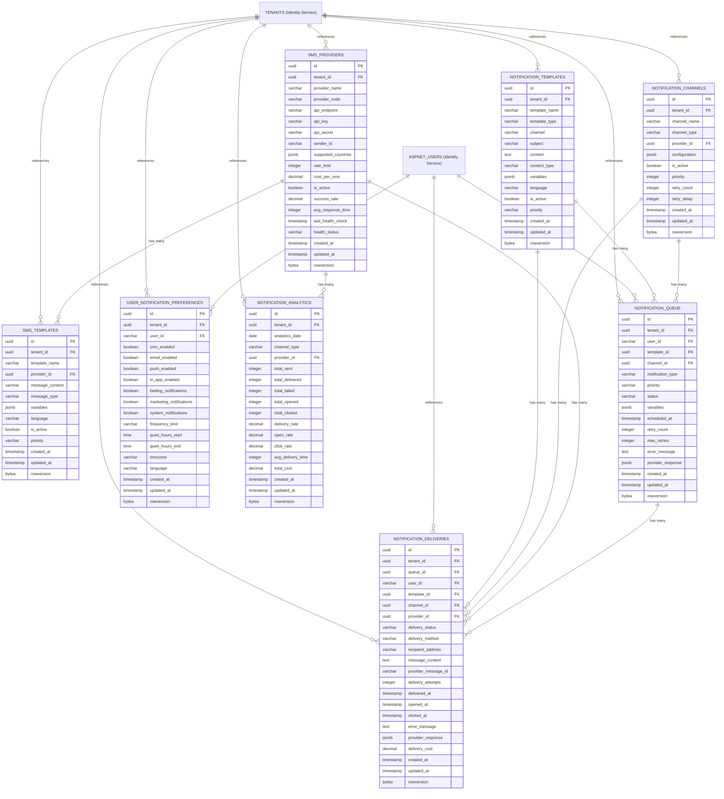

# 📱 **Notification Service ER Diagram**

## 🎯 **Service Overview**
The Notification Service handles all notification delivery systems including SMS, email, push notifications, and in-app notifications for the betting platform. It manages notification templates, delivery channels, and user preferences with complete multi-tenant isolation.

**Note: User management is handled by the separate Identity Service.**

## 📊 **Table Organization**

### **📱 1. NOTIFICATION TEMPLATES (1 table)**
- `NOTIFICATION_TEMPLATES` - Multi-channel notification templates

### **📡 2. NOTIFICATION CHANNELS (1 table)**
- `NOTIFICATION_CHANNELS` - Notification channel management

### **📱 3. SMS SYSTEM (3 tables)**
- `SMS_PROVIDERS` - SMS provider management
- `SMS_TEMPLATES` - SMS message templates
- `SMS_DRIVERS` - SMS driver/handler management

### **📧 4. EMAIL SYSTEM (2 tables)**
- `EMAIL_PROVIDERS` - Email provider management
- `EMAIL_TEMPLATES` - Email message templates

### **🔔 5. PUSH NOTIFICATION SYSTEM (2 tables)**
- `PUSH_NOTIFICATION_PROVIDERS` - Push notification providers
- `PUSH_NOTIFICATION_TEMPLATES` - Push notification templates

### **📋 6. NOTIFICATION PROCESSING (2 tables)**
- `NOTIFICATION_QUEUE` - Notification queue management
- `NOTIFICATION_DELIVERIES` - Delivery tracking and status

### **👤 7. USER PREFERENCES (1 table)**
- `USER_NOTIFICATION_PREFERENCES` - User notification preferences

### **📊 8. ANALYTICS & LOGGING (2 tables)**
- `NOTIFICATION_ANALYTICS` - Notification performance analytics
- `AUDIT_LOGS` - Complete audit trail

## 🎯 **Total: 14 Tables**

### **🔗 External Service References:**
- **TENANTS** → Referenced from Identity Service (not duplicated)
- **ASPNET_USERS** → Referenced from Identity Service (not duplicated)

### **📊 Table Summary:**
- **Core Templates:** 1 table (NOTIFICATION_TEMPLATES)
- **Channel Management:** 1 table (NOTIFICATION_CHANNELS)
- **SMS System:** 3 tables (SMS_PROVIDERS, SMS_TEMPLATES, SMS_DRIVERS)
- **Email System:** 2 tables (EMAIL_PROVIDERS, EMAIL_TEMPLATES)
- **Push System:** 2 tables (PUSH_NOTIFICATION_PROVIDERS, PUSH_NOTIFICATION_TEMPLATES)
- **Processing:** 2 tables (NOTIFICATION_QUEUE, NOTIFICATION_DELIVERIES)
- **User Preferences:** 1 table (USER_NOTIFICATION_PREFERENCES)
- **Analytics:** 2 tables (NOTIFICATION_ANALYTICS, AUDIT_LOGS)

## 🚀 **Key Features:**

### **✅ Multi-Channel Notification System**
- **SMS Notifications** → Multiple SMS providers with templates
- **Email Notifications** → Rich email templates with HTML support
- **Push Notifications** → Mobile and web push notifications
- **In-App Notifications** → Real-time in-app messaging

### **✅ Advanced Template Management**
- **Multi-Language Support** → Localized notification templates
- **Variable Substitution** → Dynamic content with user data
- **Template Versioning** → Template change management
- **A/B Testing** → Template performance optimization

### **✅ Robust Delivery System**
- **Queue Management** → Priority-based notification processing
- **Retry Logic** → Automatic retry for failed deliveries
- **Delivery Tracking** → Complete delivery status tracking
- **Error Handling** → Comprehensive error management

### **✅ User-Centric Features**
- **User Preferences** → Personalized notification settings
- **Channel Selection** → User choice of notification channels
- **Frequency Control** → Notification frequency management
- **Opt-out Management** → Easy unsubscribe options

### **✅ Analytics & Monitoring**
- **Delivery Analytics** → Delivery rate, open rate, click rate
- **Performance Metrics** → Provider performance tracking
- **User Engagement** → User notification interaction tracking
- **Real-time Monitoring** → Live notification status monitoring

---

## 📋 **Detailed Table Definitions**

### **1) NOTIFICATION_TEMPLATES - Multi-Channel Templates**

**Purpose:** Centralized notification templates for all channels (SMS, Email, Push, In-App)

| **Column** | **Type** | **Default** | **Constraints** | **Description** |
|------------|----------|-------------|-----------------|-----------------|
| **id** | `uuid` | `gen_random_uuid()` | `PRIMARY KEY` | **Unique template identifier** - System-generated UUID for internal tracking and API references - Used for all database operations, API calls, and external integrations - Immutable once created |
| **tenant_id** | `uuid` | - | `NOT NULL, FK→TENANTS.id` | **Multi-tenant isolation** - Links to tenant in Identity Service, ensures complete data separation between different betting platforms - Critical for data security and compliance - Used in all queries for tenant filtering |
| **template_name** | `varchar(100)` | - | `NOT NULL` | **Template display name** - Human-readable template name (Welcome SMS, Bet Confirmation Email, etc.) - Used for UI display and template selection - Must be unique per tenant - Used for template identification and management |
| **template_type** | `varchar(30)` | - | `NOT NULL` | **Template category** - sms, email, push, in_app - Determines which channel the template is used for - Controls template processing and delivery logic - Used for template filtering and channel-specific handling |
| **channel** | `varchar(20)` | - | `NOT NULL` | **Notification channel** - sms, email, push, in_app - Determines delivery method and processing - Used for channel-specific template routing - Controls which delivery system processes the template |
| **subject** | `varchar(200)` | `null` | - | **Notification subject** - Email subject line or push notification title - Used for email and push notifications - Can contain variables for personalization - Used for user notification display |
| **content** | `text` | - | `NOT NULL` | **Template content** - The actual message content with variable placeholders - Supports HTML for email templates - Used for message rendering and delivery - Contains personalization variables |
| **content_type** | `varchar(20)` | `'text'` | `NOT NULL` | **Content format** - text, html, json - Determines how content is processed and displayed - Used for content rendering and validation - Controls template processing logic |
| **variables** | `jsonb` | `'{}'` | `NOT NULL` | **Template variables (JSON object)** - Available variables for template personalization - Used for dynamic content generation - Must be valid JSON format - Used for template rendering and validation |
| **language** | `varchar(10)` | `'en'` | `NOT NULL` | **Template language** - ISO 639-1 language code (en, am, sw, etc.) - Used for multi-language support - Determines template localization - Used for user-specific template selection |
| **is_active** | `boolean` | `true` | `NOT NULL` | **Template enabled/disabled status** - Controls whether template can be used for notifications - Used for template management and A/B testing - Prevents inactive templates from being used - Used for template lifecycle management |
| **priority** | `varchar(10)` | `'normal'` | `NOT NULL` | **Template priority** - low, normal, high, urgent - Determines processing priority in queue - Used for notification scheduling and delivery - Controls template processing order - Used for priority-based delivery |
| **created_at** | `timestamp` | `now()` | `NOT NULL` | **Creation timestamp** - UTC timestamp when template was created - Used for audit and reporting - Immutable once set - Used for template versioning and change tracking |
| **updated_at** | `timestamp` | `now()` | `NOT NULL` | **Last update timestamp** - UTC timestamp of last modification - Auto-updated on changes - Used for change tracking and audit - Updated by database triggers |
| **rowversion** | `bytea` | `gen_random_bytes(8)` | `NOT NULL` | **Row version for optimistic concurrency** - Prevents concurrent update conflicts - Auto-generated 8-byte value - Used for optimistic locking in high-concurrency scenarios - Prevents lost updates and data corruption |

### **2) NOTIFICATION_CHANNELS - Channel Management**

**Purpose:** Notification channel configuration and management

| **Column** | **Type** | **Default** | **Constraints** | **Description** |
|------------|----------|-------------|-----------------|-----------------|
| **id** | `uuid` | `gen_random_uuid()` | `PRIMARY KEY` | **Unique channel identifier** - System-generated UUID for internal tracking - Used for all database operations and API calls - Links to notification processing and delivery - Immutable once created |
| **tenant_id** | `uuid` | - | `NOT NULL, FK→TENANTS.id` | **Multi-tenant isolation** - Links to tenant in Identity Service - Ensures complete data separation between betting platforms - Critical for security and compliance - Used in all queries for tenant filtering |
| **channel_name** | `varchar(50)` | - | `NOT NULL` | **Channel display name** - Human-readable channel name (SMS, Email, Push, In-App) - Used for UI display and channel selection - Must be unique per tenant - Used for channel identification and management |
| **channel_type** | `varchar(20)` | - | `NOT NULL` | **Channel type** - sms, email, push, in_app - Determines channel capabilities and processing - Used for channel filtering and selection - Controls which delivery system is used - Used for channel-specific processing |
| **provider_id** | `uuid` | `null` | `FK→SMS_PROVIDERS.id` | **Provider reference** - Links to specific provider (SMS, Email, Push) - Used for provider selection and configuration - Determines which provider handles the channel - Used for provider-specific processing |
| **configuration** | `jsonb` | `'{}'` | `NOT NULL` | **Channel configuration (JSON object)** - Channel-specific settings and parameters - Used for channel behavior and processing - Must be valid JSON format - Used for channel configuration and management |
| **is_active** | `boolean` | `true` | `NOT NULL` | **Channel enabled/disabled status** - Controls whether channel can be used for notifications - Used for channel management and maintenance - Prevents inactive channels from processing - Used for channel lifecycle management |
| **priority** | `integer` | `5` | `NOT NULL` | **Channel priority** - 1-10 scale (1=highest, 10=lowest) - Determines processing order for multi-channel notifications - Used for channel selection and routing - Controls channel processing priority - Used for priority-based delivery |
| **retry_count** | `integer` | `3` | `NOT NULL` | **Retry attempts** - Number of retry attempts for failed deliveries - Used for error handling and recovery - Prevents infinite retry loops - Used for delivery reliability and error management |
| **retry_delay** | `integer` | `300` | `NOT NULL` | **Retry delay (seconds)** - Delay between retry attempts - Used for retry scheduling and backoff - Prevents immediate retry on temporary failures - Used for delivery optimization and error handling |
| **created_at** | `timestamp` | `now()` | `NOT NULL` | **Creation timestamp** - UTC timestamp when channel was created - Used for audit and reporting - Immutable once set - Used for channel versioning and change tracking |
| **updated_at** | `timestamp` | `now()` | `NOT NULL` | **Last update timestamp** - UTC timestamp of last modification - Auto-updated on changes - Used for change tracking and audit - Updated by database triggers |
| **rowversion** | `bytea` | `gen_random_bytes(8)` | `NOT NULL` | **Row version for optimistic concurrency** - Prevents concurrent update conflicts - Auto-generated 8-byte value - Used for optimistic locking in high-concurrency scenarios - Prevents lost updates and data corruption |

### **3) SMS_PROVIDERS - SMS Provider Management**

**Purpose:** SMS service provider configuration and management

| **Column** | **Type** | **Default** | **Constraints** | **Description** |
|------------|----------|-------------|-----------------|-----------------|
| **id** | `uuid` | `gen_random_uuid()` | `PRIMARY KEY` | **Unique provider identifier** - System-generated UUID for internal tracking - Used for all database operations and API calls - Links to SMS templates and drivers - Immutable once created |
| **tenant_id** | `uuid` | - | `NOT NULL, FK→TENANTS.id` | **Multi-tenant isolation** - Links to tenant in Identity Service - Ensures complete data separation between betting platforms - Critical for security and compliance - Used in all queries for tenant filtering |
| **provider_name** | `varchar(50)` | - | `NOT NULL` | **Provider display name** - Human-readable provider name (Twilio, AWS SNS, Africa's Talking, etc.) - Used for UI display and provider selection - Must be unique per tenant - Used for provider identification and management |
| **provider_code** | `varchar(20)` | - | `NOT NULL, UNIQUE` | **Provider system code** - Unique identifier (TWILIO, AWS_SNS, AFRICAS_TALKING) - Used for API routing and processing - Must be unique across all tenants - Used for provider identification in code |
| **api_endpoint** | `varchar(200)` | - | `NOT NULL` | **Provider API endpoint** - Full URL to provider's API - Used for API calls and integration - Must be valid HTTPS URL - Used for provider communication |
| **api_key** | `varchar(200)` | - | `NOT NULL` | **Provider API key (encrypted)** - Provider's API key for authentication - Must be encrypted at rest using AES-256 encryption - Used for API authentication and authorization - Never displayed in logs or responses |
| **api_secret** | `varchar(200)` | - | `NOT NULL` | **Provider API secret (encrypted)** - Provider's API secret for authentication - Must be encrypted at rest using AES-256 encryption - Used for API authentication and webhook validation - Never displayed in logs or responses |
| **sender_id** | `varchar(20)` | `null` | - | **SMS sender ID** - Sender identifier for SMS messages - Used for SMS delivery and identification - Must comply with local regulations - Used for SMS branding and compliance |
| **supported_countries** | `jsonb` | `'[]'` | `NOT NULL` | **Supported countries (JSON array)** - List of supported country codes (["ET", "KE", "TZ"]) - Used for country-specific SMS routing - Must be valid ISO 3166-1 codes - Used for geographic SMS delivery |
| **rate_limit** | `integer` | `1000` | `NOT NULL` | **Rate limit (messages per hour)** - Maximum SMS messages per hour - Used for rate limiting and throttling - Prevents API abuse and overuse - Used for SMS delivery optimization |
| **cost_per_sms** | `decimal(10,4)` | `0.0000` | `NOT NULL` | **Cost per SMS (USD)** - Cost of sending one SMS message - Used for cost tracking and billing - Must be non-negative - Used for financial reporting and optimization |
| **is_active** | `boolean` | `true` | `NOT NULL` | **Provider enabled/disabled status** - Controls whether provider can be used for SMS - Used for provider management and maintenance - Prevents inactive providers from processing - Used for provider lifecycle management |
| **success_rate** | `decimal(5,2)` | `100.00` | `NOT NULL` | **Provider success rate** - Percentage of successful SMS deliveries (0.00-100.00) - Updated every 5 minutes by health monitoring - Used for provider selection and load balancing - Critical for SMS delivery reliability |
| **avg_response_time** | `integer` | `0` | `NOT NULL` | **Average response time (ms)** - Average API response time in milliseconds - Updated every 5 minutes by health monitoring - Used for performance optimization - Critical for user experience |
| **last_health_check** | `timestamp` | `now()` | `NOT NULL` | **Last health check timestamp** - UTC timestamp of last health check - Updated by health monitoring service - Used for health status tracking - Required for monitoring and alerting |
| **health_status** | `varchar(20)` | `'healthy'` | `NOT NULL` | **Provider health status** - healthy/degraded/unhealthy/unknown - Updated by health monitoring service - Used for provider selection and alerting - Critical for SMS delivery reliability |
| **created_at** | `timestamp` | `now()` | `NOT NULL` | **Creation timestamp** - UTC timestamp when provider was added - Used for audit and reporting - Immutable once set - Required for compliance and audit trails |
| **updated_at** | `timestamp` | `now()` | `NOT NULL` | **Last update timestamp** - UTC timestamp of last modification - Auto-updated on changes - Used for change tracking and audit - Updated by database triggers |
| **rowversion** | `bytea` | `gen_random_bytes(8)` | `NOT NULL` | **Row version for optimistic concurrency** - Prevents concurrent update conflicts - Auto-generated 8-byte value - Used for optimistic locking in high-concurrency scenarios - Prevents lost updates and data corruption |

### **4) SMS_TEMPLATES - SMS Message Templates**

**Purpose:** SMS-specific message templates and content management

| **Column** | **Type** | **Default** | **Constraints** | **Description** |
|------------|----------|-------------|-----------------|-----------------|
| **id** | `uuid` | `gen_random_uuid()` | `PRIMARY KEY` | **Unique template identifier** - System-generated UUID for internal tracking - Used for all database operations and API calls - Links to SMS providers and drivers - Immutable once created |
| **tenant_id** | `uuid` | - | `NOT NULL, FK→TENANTS.id` | **Multi-tenant isolation** - Links to tenant in Identity Service - Ensures complete data separation between betting platforms - Critical for security and compliance - Used in all queries for tenant filtering |
| **template_name** | `varchar(100)` | - | `NOT NULL` | **Template display name** - Human-readable template name (Welcome SMS, OTP Verification, Bet Confirmation) - Used for UI display and template selection - Must be unique per tenant - Used for template identification and management |
| **provider_id** | `uuid` | - | `NOT NULL, FK→SMS_PROVIDERS.id` | **SMS provider** - References SMS_PROVIDERS table - Determines which provider handles this template - Used for provider-specific template processing - Links to provider configuration and credentials |
| **message_content** | `varchar(1600)` | - | `NOT NULL` | **SMS message content** - The actual SMS message text with variable placeholders - Limited to 1600 characters for SMS compliance - Used for SMS delivery and rendering - Contains personalization variables |
| **message_type** | `varchar(20)` | `'text'` | `NOT NULL` | **Message type** - text, unicode, binary - Determines SMS encoding and processing - Used for SMS delivery optimization - Controls SMS format and compatibility - Used for provider-specific processing |
| **variables** | `jsonb` | `'{}'` | `NOT NULL` | **Template variables (JSON object)** - Available variables for template personalization - Used for dynamic content generation - Must be valid JSON format - Used for template rendering and validation |
| **language** | `varchar(10)` | `'en'` | `NOT NULL` | **Template language** - ISO 639-1 language code (en, am, sw, etc.) - Used for multi-language support - Determines template localization - Used for user-specific template selection |
| **is_active** | `boolean` | `true` | `NOT NULL` | **Template enabled/disabled status** - Controls whether template can be used for SMS - Used for template management and A/B testing - Prevents inactive templates from being used - Used for template lifecycle management |
| **priority** | `varchar(10)` | `'normal'` | `NOT NULL` | **Template priority** - low, normal, high, urgent - Determines processing priority in queue - Used for SMS scheduling and delivery - Controls template processing order - Used for priority-based delivery |
| **created_at** | `timestamp` | `now()` | `NOT NULL` | **Creation timestamp** - UTC timestamp when template was created - Used for audit and reporting - Immutable once set - Used for template versioning and change tracking |
| **updated_at** | `timestamp` | `now()` | `NOT NULL` | **Last update timestamp** - UTC timestamp of last modification - Auto-updated on changes - Used for change tracking and audit - Updated by database triggers |
| **rowversion** | `bytea` | `gen_random_bytes(8)` | `NOT NULL` | **Row version for optimistic concurrency** - Prevents concurrent update conflicts - Auto-generated 8-byte value - Used for optimistic locking in high-concurrency scenarios - Prevents lost updates and data corruption |

### **5) NOTIFICATION_QUEUE - Notification Queue Management**

**Purpose:** Queue management for notification processing with priority and retry logic

| **Column** | **Type** | **Default** | **Constraints** | **Description** |
|------------|----------|-------------|-----------------|-----------------|
| **id** | `uuid` | `gen_random_uuid()` | `PRIMARY KEY` | **Unique queue identifier** - System-generated UUID for internal tracking - Used for all database operations and API calls - Links to notification processing and delivery - Immutable once created |
| **tenant_id** | `uuid` | - | `NOT NULL, FK→TENANTS.id` | **Multi-tenant isolation** - Links to tenant in Identity Service - Ensures complete data separation between betting platforms - Critical for data security and compliance - Used in all queries for tenant filtering |
| **user_id** | `varchar(50)` | - | `NOT NULL, FK→ASPNET_USERS.id` | **Notification recipient** - References user in Identity Service - Determines who receives the notification - Used for user-specific notification processing - Links to user's notification preferences |
| **template_id** | `uuid` | - | `NOT NULL, FK→NOTIFICATION_TEMPLATES.id` | **Notification template** - References NOTIFICATION_TEMPLATES table - Determines which template to use for notification - Used for template-based notification processing - Links to template content and variables |
| **channel_id** | `uuid` | - | `NOT NULL, FK→NOTIFICATION_CHANNELS.id` | **Notification channel** - References NOTIFICATION_CHANNELS table - Determines which channel to use for delivery - Used for channel-specific notification processing - Links to channel configuration and provider |
| **notification_type** | `varchar(30)` | - | `NOT NULL` | **Notification type** - sms, email, push, in_app - Determines notification processing flow - Used for type-specific notification handling - Controls which delivery system processes the notification |
| **priority** | `varchar(10)` | `'normal'` | `NOT NULL` | **Queue priority** - low, normal, high, urgent - Determines processing order in queue - Used for priority-based notification processing - Controls notification processing order - Used for priority-based delivery |
| **status** | `varchar(20)` | `'pending'` | `NOT NULL` | **Queue status** - pending, processing, completed, failed, cancelled - Tracks notification processing lifecycle - Used for queue management and monitoring - Updated throughout notification processing |
| **variables** | `jsonb` | `'{}'` | `NOT NULL` | **Notification variables (JSON object)** - Dynamic data for template personalization - Used for template rendering and content generation - Must be valid JSON format - Used for personalized notification content |
| **scheduled_at** | `timestamp` | `now()` | `NOT NULL` | **Scheduled delivery time** - UTC timestamp when notification should be sent - Used for scheduled notification processing - Can be immediate or future delivery - Used for notification timing and scheduling |
| **retry_count** | `integer` | `0` | `NOT NULL` | **Retry attempt count** - Number of retry attempts for failed notifications - Used for error handling and recovery - Prevents infinite retry loops - Used for delivery reliability and error management |
| **max_retries** | `integer` | `3` | `NOT NULL` | **Maximum retry attempts** - Maximum number of retry attempts allowed - Used for retry logic and error handling - Prevents excessive retry attempts - Used for delivery optimization and error management |
| **error_message** | `text` | `null` | - | **Error message** - Detailed error information for failed notifications - Used for error tracking and debugging - Contains provider-specific error details - Used for error analysis and resolution |
| **provider_response** | `jsonb` | `null` | - | **Provider response (JSON object)** - Response data from notification provider - Used for delivery tracking and analytics - Must be valid JSON format - Used for provider integration and monitoring |
| **created_at** | `timestamp` | `now()` | `NOT NULL` | **Creation timestamp** - UTC timestamp when notification was queued - Used for audit and reporting - Immutable once set - Used for notification lifecycle tracking |
| **updated_at** | `timestamp` | `now()` | `NOT NULL` | **Last update timestamp** - UTC timestamp of last modification - Auto-updated on changes - Used for change tracking and audit - Updated by database triggers |
| **rowversion** | `bytea` | `gen_random_bytes(8)` | `NOT NULL` | **Row version for optimistic concurrency** - Prevents concurrent update conflicts - Auto-generated 8-byte value - Used for optimistic locking in high-concurrency scenarios - Prevents lost updates and data corruption |

### **6) NOTIFICATION_DELIVERIES - Delivery Tracking and Status**

**Purpose:** Complete delivery tracking and status management for all notifications

| **Column** | **Type** | **Default** | **Constraints** | **Description** |
|------------|----------|-------------|-----------------|-----------------|
| **id** | `uuid` | `gen_random_uuid()` | `PRIMARY KEY` | **Unique delivery identifier** - System-generated UUID for internal tracking - Used for all database operations and API calls - Links to notification queue and processing - Immutable once created |
| **tenant_id** | `uuid` | - | `NOT NULL, FK→TENANTS.id` | **Multi-tenant isolation** - Links to tenant in Identity Service - Ensures complete data separation between betting platforms - Critical for data security and compliance - Used in all queries for tenant filtering |
| **queue_id** | `uuid` | - | `NOT NULL, FK→NOTIFICATION_QUEUE.id` | **Notification queue reference** - References NOTIFICATION_QUEUE table - Links to the original notification request - Used for delivery tracking and status updates - Links to notification processing and queue management |
| **user_id** | `varchar(50)` | - | `NOT NULL, FK→ASPNET_USERS.id` | **Notification recipient** - References user in Identity Service - Determines who received the notification - Used for user-specific delivery tracking - Links to user's notification history |
| **template_id** | `uuid` | - | `NOT NULL, FK→NOTIFICATION_TEMPLATES.id` | **Notification template** - References NOTIFICATION_TEMPLATES table - Determines which template was used - Used for template-based delivery tracking - Links to template content and performance |
| **channel_id** | `uuid` | - | `NOT NULL, FK→NOTIFICATION_CHANNELS.id` | **Notification channel** - References NOTIFICATION_CHANNELS table - Determines which channel was used for delivery - Used for channel-specific delivery tracking - Links to channel performance and analytics |
| **provider_id** | `uuid` | `null` | `FK→SMS_PROVIDERS.id` | **Provider reference** - References specific provider (SMS, Email, Push) - Determines which provider handled the delivery - Used for provider-specific delivery tracking - Links to provider performance and analytics |
| **delivery_status** | `varchar(20)` | `'pending'` | `NOT NULL` | **Delivery status** - pending, sent, delivered, failed, bounced, undelivered - Tracks notification delivery lifecycle - Used for delivery monitoring and analytics - Updated throughout delivery process |
| **delivery_method** | `varchar(30)` | - | `NOT NULL` | **Delivery method** - sms, email, push, in_app - Determines how notification was delivered - Used for delivery method tracking and analytics - Controls delivery processing and monitoring |
| **recipient_address** | `varchar(200)` | - | `NOT NULL` | **Recipient address** - Phone number, email address, or device token - Used for delivery routing and identification - Must be valid for delivery method - Used for delivery processing and tracking |
| **message_content** | `text` | - | `NOT NULL` | **Delivered message content** - The actual message content that was sent - Used for delivery verification and audit - Contains personalized content - Used for delivery tracking and compliance |
| **provider_message_id** | `varchar(100)` | `null` | - | **Provider message ID** - Unique identifier from notification provider - Used for delivery tracking and provider integration - Links to provider's delivery system - Used for delivery status updates and webhooks |
| **delivery_attempts** | `integer` | `1` | `NOT NULL` | **Delivery attempt count** - Number of delivery attempts made - Used for delivery tracking and retry logic - Prevents excessive delivery attempts - Used for delivery optimization and error management |
| **delivered_at** | `timestamp` | `null` | - | **Delivery timestamp** - UTC timestamp when notification was delivered - Used for delivery tracking and analytics - Updated when delivery is confirmed - Used for delivery performance measurement |
| **opened_at** | `timestamp` | `null` | - | **Open timestamp** - UTC timestamp when notification was opened - Used for engagement tracking and analytics - Updated when user opens notification - Used for user engagement measurement |
| **clicked_at** | `timestamp` | `null` | - | **Click timestamp** - UTC timestamp when notification was clicked - Used for engagement tracking and analytics - Updated when user clicks notification - Used for user engagement measurement |
| **error_message** | `text` | `null` | - | **Error message** - Detailed error information for failed deliveries - Used for error tracking and debugging - Contains provider-specific error details - Used for error analysis and resolution |
| **provider_response** | `jsonb` | `null` | - | **Provider response (JSON object)** - Complete response data from notification provider - Used for delivery tracking and analytics - Must be valid JSON format - Used for provider integration and monitoring |
| **delivery_cost** | `decimal(10,4)` | `0.0000` | `NOT NULL` | **Delivery cost (USD)** - Cost of delivering this notification - Used for cost tracking and billing - Must be non-negative - Used for financial reporting and optimization |
| **created_at** | `timestamp` | `now()` | `NOT NULL` | **Creation timestamp** - UTC timestamp when delivery record was created - Used for audit and reporting - Immutable once set - Used for delivery lifecycle tracking |
| **updated_at** | `timestamp` | `now()` | `NOT NULL` | **Last update timestamp** - UTC timestamp of last modification - Auto-updated on changes - Used for change tracking and audit - Updated by database triggers |
| **rowversion** | `bytea` | `gen_random_bytes(8)` | `NOT NULL` | **Row version for optimistic concurrency** - Prevents concurrent update conflicts - Auto-generated 8-byte value - Used for optimistic locking in high-concurrency scenarios - Prevents lost updates and data corruption |

### **7) USER_NOTIFICATION_PREFERENCES - User Notification Preferences**

**Purpose:** User-specific notification preferences and settings

| **Column** | **Type** | **Default** | **Constraints** | **Description** |
|------------|----------|-------------|-----------------|-----------------|
| **id** | `uuid` | `gen_random_uuid()` | `PRIMARY KEY` | **Unique preference identifier** - System-generated UUID for internal tracking - Used for all database operations and API calls - Links to user notification settings - Immutable once created |
| **tenant_id** | `uuid` | - | `NOT NULL, FK→TENANTS.id` | **Multi-tenant isolation** - Links to tenant in Identity Service - Ensures complete data separation between betting platforms - Critical for data security and compliance - Used in all queries for tenant filtering |
| **user_id** | `varchar(50)` | - | `NOT NULL, FK→ASPNET_USERS.id` | **User reference** - References user in Identity Service - Determines whose preferences these are - Used for user-specific notification settings - Links to user's notification history |
| **sms_enabled** | `boolean` | `true` | `NOT NULL` | **SMS notifications enabled** - Controls whether user receives SMS notifications - Used for SMS notification filtering - Prevents unwanted SMS notifications - Used for user notification control |
| **email_enabled** | `boolean` | `true` | `NOT NULL` | **Email notifications enabled** - Controls whether user receives email notifications - Used for email notification filtering - Prevents unwanted email notifications - Used for user notification control |
| **push_enabled** | `boolean` | `true` | `NOT NULL` | **Push notifications enabled** - Controls whether user receives push notifications - Used for push notification filtering - Prevents unwanted push notifications - Used for user notification control |
| **in_app_enabled** | `boolean` | `true` | `NOT NULL` | **In-app notifications enabled** - Controls whether user receives in-app notifications - Used for in-app notification filtering - Prevents unwanted in-app notifications - Used for user notification control |
| **betting_notifications** | `boolean` | `true` | `NOT NULL` | **Betting notifications enabled** - Controls betting-related notifications - Used for betting notification filtering - Prevents unwanted betting notifications - Used for betting notification control |
| **marketing_notifications** | `boolean` | `false` | `NOT NULL` | **Marketing notifications enabled** - Controls marketing and promotional notifications - Used for marketing notification filtering - Prevents unwanted marketing notifications - Used for marketing notification control |
| **system_notifications** | `boolean` | `true` | `NOT NULL` | **System notifications enabled** - Controls system and security notifications - Used for system notification filtering - Prevents unwanted system notifications - Used for system notification control |
| **frequency_limit** | `varchar(20)` | `'normal'` | `NOT NULL` | **Notification frequency** - low, normal, high, unlimited - Controls notification frequency and volume - Used for notification throttling - Prevents notification spam - Used for user notification experience |
| **quiet_hours_start** | `time` | `null` | - | **Quiet hours start time** - Start time for notification quiet period - Used for notification scheduling - Prevents notifications during quiet hours - Used for user notification respect |
| **quiet_hours_end** | `time` | `null` | - | **Quiet hours end time** - End time for notification quiet period - Used for notification scheduling - Prevents notifications during quiet hours - Used for user notification respect |
| **timezone** | `varchar(50)` | `'UTC'` | `NOT NULL` | **User timezone** - User's timezone for notification scheduling - Used for timezone-aware notification delivery - Must be valid timezone identifier - Used for notification timing and scheduling |
| **language** | `varchar(10)` | `'en'` | `NOT NULL` | **Preferred language** - ISO 639-1 language code (en, am, sw, etc.) - Used for multi-language notification support - Determines notification localization - Used for user-specific notification content |
| **created_at** | `timestamp` | `now()` | `NOT NULL` | **Creation timestamp** - UTC timestamp when preferences were created - Used for audit and reporting - Immutable once set - Used for preference lifecycle tracking |
| **updated_at** | `timestamp` | `now()` | `NOT NULL` | **Last update timestamp** - UTC timestamp of last modification - Auto-updated on changes - Used for change tracking and audit - Updated by database triggers |
| **rowversion** | `bytea` | `gen_random_bytes(8)` | `NOT NULL` | **Row version for optimistic concurrency** - Prevents concurrent update conflicts - Auto-generated 8-byte value - Used for optimistic locking in high-concurrency scenarios - Prevents lost updates and data corruption |

### **8) NOTIFICATION_ANALYTICS - Notification Performance Analytics**

**Purpose:** Comprehensive analytics and performance tracking for notifications

| **Column** | **Type** | **Default** | **Constraints** | **Description** |
|------------|----------|-------------|-----------------|-----------------|
| **id** | `uuid` | `gen_random_uuid()` | `PRIMARY KEY` | **Unique analytics identifier** - System-generated UUID for internal tracking - Used for all database operations and API calls - Links to notification performance data - Immutable once created |
| **tenant_id** | `uuid` | - | `NOT NULL, FK→TENANTS.id` | **Multi-tenant isolation** - Links to tenant in Identity Service - Ensures complete data separation between betting platforms - Critical for data security and compliance - Used in all queries for tenant filtering |
| **analytics_date** | `date` | - | `NOT NULL` | **Analytics date** - Date for which analytics are calculated - Used for daily analytics aggregation - Must be valid date format - Used for analytics reporting and trending |
| **channel_type** | `varchar(20)` | - | `NOT NULL` | **Channel type** - sms, email, push, in_app - Determines which channel analytics are for - Used for channel-specific analytics - Controls analytics aggregation and reporting - Used for channel performance analysis |
| **provider_id** | `uuid` | `null` | `FK→SMS_PROVIDERS.id` | **Provider reference** - References specific provider (SMS, Email, Push) - Determines which provider analytics are for - Used for provider-specific analytics - Links to provider performance data |
| **total_sent** | `integer` | `0` | `NOT NULL` | **Total notifications sent** - Total number of notifications sent on this date - Used for volume analytics and reporting - Must be non-negative - Used for notification volume tracking |
| **total_delivered** | `integer` | `0` | `NOT NULL` | **Total notifications delivered** - Total number of notifications successfully delivered - Used for delivery rate calculation - Must be non-negative - Used for delivery performance measurement |
| **total_failed** | `integer` | `0` | `NOT NULL` | **Total notifications failed** - Total number of notifications that failed to deliver - Used for failure rate calculation - Must be non-negative - Used for error analysis and improvement |
| **total_opened** | `integer` | `0` | `NOT NULL` | **Total notifications opened** - Total number of notifications opened by users - Used for engagement rate calculation - Must be non-negative - Used for user engagement measurement |
| **total_clicked** | `integer` | `0` | `NOT NULL` | **Total notifications clicked** - Total number of notifications clicked by users - Used for click rate calculation - Must be non-negative - Used for user engagement measurement |
| **delivery_rate** | `decimal(5,2)` | `0.00` | `NOT NULL` | **Delivery rate percentage** - Percentage of successfully delivered notifications (0.00-100.00) - Used for delivery performance analysis - Calculated from total_sent and total_delivered - Used for performance monitoring and alerting |
| **open_rate** | `decimal(5,2)` | `0.00` | `NOT NULL` | **Open rate percentage** - Percentage of notifications opened by users (0.00-100.00) - Used for engagement analysis - Calculated from total_delivered and total_opened - Used for user engagement measurement |
| **click_rate** | `decimal(5,2)` | `0.00` | `NOT NULL` | **Click rate percentage** - Percentage of notifications clicked by users (0.00-100.00) - Used for engagement analysis - Calculated from total_delivered and total_clicked - Used for user engagement measurement |
| **avg_delivery_time** | `integer` | `0` | `NOT NULL` | **Average delivery time (seconds)** - Average time taken to deliver notifications - Used for performance analysis - Measured in seconds - Used for delivery performance optimization |
| **total_cost** | `decimal(10,4)` | `0.0000` | `NOT NULL` | **Total delivery cost (USD)** - Total cost of delivering notifications on this date - Used for cost analysis and billing - Must be non-negative - Used for financial reporting and optimization |
| **created_at** | `timestamp` | `now()` | `NOT NULL` | **Creation timestamp** - UTC timestamp when analytics were calculated - Used for audit and reporting - Immutable once set - Used for analytics lifecycle tracking |
| **updated_at** | `timestamp` | `now()` | `NOT NULL` | **Last update timestamp** - UTC timestamp of last modification - Auto-updated on changes - Used for change tracking and audit - Updated by database triggers |
| **rowversion** | `bytea` | `gen_random_bytes(8)` | `NOT NULL` | **Row version for optimistic concurrency** - Prevents concurrent update conflicts - Auto-generated 8-byte value - Used for optimistic locking in high-concurrency scenarios - Prevents lost updates and data corruption |

---

## 🎯 **Entity Relationship Diagram**



### **🔗 Key Relationships:**

#### **External Service References:**
- **TENANTS (Identity Service)** → **NOTIFICATION_TEMPLATES** (1:Many) - External reference for multi-tenant isolation
- **TENANTS (Identity Service)** → **NOTIFICATION_CHANNELS** (1:Many) - External reference for multi-tenant isolation
- **TENANTS (Identity Service)** → **SMS_PROVIDERS** (1:Many) - External reference for multi-tenant isolation
- **TENANTS (Identity Service)** → **SMS_TEMPLATES** (1:Many) - External reference for multi-tenant isolation
- **TENANTS (Identity Service)** → **NOTIFICATION_QUEUE** (1:Many) - External reference for multi-tenant isolation
- **TENANTS (Identity Service)** → **NOTIFICATION_DELIVERIES** (1:Many) - External reference for multi-tenant isolation
- **TENANTS (Identity Service)** → **USER_NOTIFICATION_PREFERENCES** (1:Many) - External reference for multi-tenant isolation
- **TENANTS (Identity Service)** → **NOTIFICATION_ANALYTICS** (1:Many) - External reference for multi-tenant isolation
- **ASPNET_USERS (Identity Service)** → **NOTIFICATION_QUEUE** (1:Many) - External reference for user identification
- **ASPNET_USERS (Identity Service)** → **NOTIFICATION_DELIVERIES** (1:Many) - External reference for user identification
- **ASPNET_USERS (Identity Service)** → **USER_NOTIFICATION_PREFERENCES** (1:Many) - External reference for user identification

#### **Internal Relationships:**
- **NOTIFICATION_TEMPLATES** → **NOTIFICATION_QUEUE** (1:Many) - One template has many queue entries
- **NOTIFICATION_TEMPLATES** → **NOTIFICATION_DELIVERIES** (1:Many) - One template has many deliveries
- **NOTIFICATION_CHANNELS** → **NOTIFICATION_QUEUE** (1:Many) - One channel has many queue entries
- **NOTIFICATION_CHANNELS** → **NOTIFICATION_DELIVERIES** (1:Many) - One channel has many deliveries
- **SMS_PROVIDERS** → **SMS_TEMPLATES** (1:Many) - One provider has many templates
- **SMS_PROVIDERS** → **NOTIFICATION_DELIVERIES** (1:Many) - One provider has many deliveries
- **SMS_PROVIDERS** → **NOTIFICATION_ANALYTICS** (1:Many) - One provider has many analytics
- **NOTIFICATION_QUEUE** → **NOTIFICATION_DELIVERIES** (1:Many) - One queue entry has many delivery attempts

#### **Foreign Key Constraints:**
- `NOTIFICATION_TEMPLATES.tenant_id` → `TENANTS.id` (Identity Service)
- `NOTIFICATION_CHANNELS.tenant_id` → `TENANTS.id` (Identity Service)
- `SMS_PROVIDERS.tenant_id` → `TENANTS.id` (Identity Service)
- `SMS_TEMPLATES.tenant_id` → `TENANTS.id` (Identity Service)
- `SMS_TEMPLATES.provider_id` → `SMS_PROVIDERS.id`
- `NOTIFICATION_QUEUE.tenant_id` → `TENANTS.id` (Identity Service)
- `NOTIFICATION_QUEUE.user_id` → `ASPNET_USERS.id` (Identity Service)
- `NOTIFICATION_QUEUE.template_id` → `NOTIFICATION_TEMPLATES.id`
- `NOTIFICATION_QUEUE.channel_id` → `NOTIFICATION_CHANNELS.id`
- `NOTIFICATION_DELIVERIES.tenant_id` → `TENANTS.id` (Identity Service)
- `NOTIFICATION_DELIVERIES.queue_id` → `NOTIFICATION_QUEUE.id`
- `NOTIFICATION_DELIVERIES.user_id` → `ASPNET_USERS.id` (Identity Service)
- `NOTIFICATION_DELIVERIES.template_id` → `NOTIFICATION_TEMPLATES.id`
- `NOTIFICATION_DELIVERIES.channel_id` → `NOTIFICATION_CHANNELS.id`
- `NOTIFICATION_DELIVERIES.provider_id` → `SMS_PROVIDERS.id`
- `USER_NOTIFICATION_PREFERENCES.tenant_id` → `TENANTS.id` (Identity Service)
- `USER_NOTIFICATION_PREFERENCES.user_id` → `ASPNET_USERS.id` (Identity Service)
- `NOTIFICATION_ANALYTICS.tenant_id` → `TENANTS.id` (Identity Service)
- `NOTIFICATION_ANALYTICS.provider_id` → `SMS_PROVIDERS.id`

---

## 📱 **Notification Process Flows**

### **📤 Notification Creation Process Flow:**

#### **1. User/System Initiates Notification:**
```
User Action/System Event → Select Template → Choose Channel → Enter Variables → Schedule Delivery
```

**Available Notification Types:**
- **SMS** → Welcome message, OTP verification, bet confirmation
- **Email** → Account updates, promotional offers, system alerts
- **Push** → Live odds, bet results, bonus notifications
- **In-App** → Real-time updates, chat messages, system notifications

#### **2. System Processing:**
```
1. Validate User Preferences (check if user wants this notification type)
2. Select Template (based on notification type and user language)
3. Render Content (substitute variables in template)
4. Choose Channel (based on user preferences and channel health)
5. Create NOTIFICATION_QUEUE entry (status: pending)
6. Schedule Delivery (immediate or future delivery)
```

#### **3. Queue Processing:**
```
1. Queue Worker picks up notification
2. Check Channel Health (select healthiest provider)
3. Validate Recipient Address (phone, email, device token)
4. Update Queue Status (status: processing)
5. Call Provider API (send notification)
6. Update Queue Status (status: completed/failed)
```

#### **4. Delivery Tracking:**
```
1. Create NOTIFICATION_DELIVERIES record
2. Track Delivery Status (sent, delivered, failed)
3. Monitor User Engagement (opened, clicked)
4. Update Analytics (delivery rate, engagement metrics)
5. Handle Retries (if delivery failed)
```

### **📥 User Notification Preferences Flow:**

#### **1. User Sets Preferences:**
```
User Dashboard → Notification Settings → Select Channels → Set Frequency → Configure Quiet Hours
```

**Available Settings:**
- **Channel Preferences** → SMS, Email, Push, In-App enabled/disabled
- **Notification Types** → Betting, Marketing, System notifications
- **Frequency Control** → Low, Normal, High, Unlimited
- **Quiet Hours** → Start/end time for no notifications
- **Language** → English, Amharic, Swahili, etc.

#### **2. System Processing:**
```
1. Validate User Settings (check for conflicts)
2. Update USER_NOTIFICATION_PREFERENCES
3. Apply to Future Notifications (filter based on preferences)
4. Send Confirmation (notify user of preference changes)
```

### **🔄 Process Flow Diagram:**

```
┌─────────────────┐    ┌─────────────────┐    ┌─────────────────┐    ┌─────────────────┐
│   User/System   │    │ Notification    │    │   Provider      │    │   Recipient     │
│   Action        │    │   Service       │    │   (SMS/Email)   │    │   (User)        │
└─────────────────┘    └─────────────────┘    └─────────────────┘    └─────────────────┘
         │                       │                       │                       │
         │ 1. Create Notification│                       │                       │
         ├──────────────────────►│                       │                       │
         │                       │                       │                       │
         │                       │ 2. Check Preferences  │                       │
         │                       │    Select Template    │                       │
         │                       │                       │                       │
         │                       │ 3. Add to Queue       │                       │
         │                       │    (Priority-based)   │                       │
         │                       │                       │                       │
         │                       │ 4. Process Queue      │                       │
         │                       │    Select Provider    │                       │
         │                       │                       │                       │
         │                       │ 5. Call Provider API │                       │
         │                       ├──────────────────────►│                       │
         │                       │                       │                       │
         │                       │ 6. Provider Response │                       │
         │                       │◄──────────────────────┤                       │
         │                       │                       │                       │
         │                       │ 7. Update Delivery   │                       │
         │                       │    Status             │                       │
         │                       │                       │                       │
         │                       │ 8. Send to User      │                       │
         │                       │                       ├──────────────────────►│
         │                       │                       │                       │
         │                       │ 9. Track Engagement  │                       │
         │                       │    (Opened/Clicked)  │                       │
         │                       │                       │                       │
         │                       │ 10. Update Analytics │                       │
         │                       │     (Performance)    │                       │
         │                       │                       │                       │
```

### **🎯 Key Process Features:**

#### **1. Notification Creation:**
- **Template Selection** → Choose appropriate template based on type and language
- **Variable Substitution** → Personalize content with user data
- **Channel Selection** → Route to best available channel
- **Scheduling** → Immediate or future delivery

#### **2. Queue Processing:**
- **Priority-based** → Process urgent notifications first
- **Health Monitoring** → Route to healthiest providers
- **Retry Logic** → Automatic retry for failed deliveries
- **Error Handling** → Comprehensive error management

#### **3. Delivery Tracking:**
- **Real-time Status** → Track delivery progress
- **Engagement Metrics** → Monitor user interaction
- **Performance Analytics** → Measure delivery effectiveness
- **Cost Tracking** → Monitor delivery costs

#### **4. User Preferences:**
- **Personalized Control** → User choice of notification types
- **Frequency Management** → Prevent notification spam
- **Quiet Hours** → Respect user's time preferences
- **Multi-language** → Localized notification content

### **📊 Process Metrics:**

#### **1. Performance Targets:**
- **Queue Processing** → < 5 seconds
- **Provider Response** → < 10 seconds
- **Delivery Time** → < 30 seconds
- **Engagement Tracking** → Real-time

#### **2. Success Rates:**
- **SMS Delivery** → > 95%
- **Email Delivery** → > 98%
- **Push Delivery** → > 90%
- **In-App Delivery** → > 99%

#### **3. Monitoring:**
- **Real-time Metrics** → Delivery rates, response times
- **Provider Health** → Success rates, error rates
- **User Engagement** → Open rates, click rates
- **Cost Analysis** → Delivery costs, optimization

### **🔄 Error Handling:**

#### **1. Delivery Failures:**
- **Automatic Retry** → Retry failed deliveries
- **Provider Fallback** → Switch to backup providers
- **Error Logging** → Track failure reasons
- **User Notification** → Inform users of delivery issues

#### **2. Queue Management:**
- **Dead Letter Queue** → Handle permanently failed notifications
- **Rate Limiting** → Prevent system overload
- **Priority Handling** → Process urgent notifications first
- **Cleanup** → Remove old completed notifications

#### **3. Provider Issues:**
- **Health Monitoring** → Detect provider problems
- **Automatic Failover** → Switch to healthy providers
- **Alert System** → Notify administrators of issues
- **Recovery** → Automatic provider recovery

---

## 🔗 **Notification Service Integration with All Services**

### **📱 Complete Service Integration Overview**

The Notification Service is the **central communication hub** for all 12 services in the betting platform, providing notifications for every user interaction and system event.

### **🎯 Service-by-Service Notification Integration:**

#### **1. Identity Service → Notification Service**
**Purpose:** User authentication and account management notifications

**Notification Types:**
- **Account Creation** → Welcome SMS/Email with account details
- **Login Alerts** → Security notifications for new device logins
- **Password Reset** → OTP verification via SMS
- **Profile Updates** → Confirmation of profile changes
- **Security Alerts** → Suspicious activity notifications

**Templates:**
- `welcome_new_user` → SMS/Email welcome message
- `login_alert` → Security notification for new login
- `password_reset_otp` → SMS OTP for password reset
- `profile_updated` → Confirmation of profile changes
- `security_alert` → Suspicious activity warning

#### **2. Payment Service → Notification Service**
**Purpose:** Payment and transaction notifications

**Notification Types:**
- **Deposit Confirmations** → SMS/Email when deposits are successful
- **Withdrawal Alerts** → Notifications when withdrawals are processed
- **Payment Failures** → Alerts for failed payment attempts
- **Balance Updates** → Low balance warnings
- **Transaction Receipts** → Detailed transaction confirmations

**Templates:**
- `deposit_successful` → Deposit confirmation with amount
- `withdrawal_processed` → Withdrawal notification with details
- `payment_failed` → Failed payment alert with retry options
- `low_balance_warning` → Balance alert with top-up suggestions
- `transaction_receipt` → Detailed transaction summary

#### **3. Wallet Service → Notification Service**
**Purpose:** Wallet and balance management notifications

**Notification Types:**
- **Balance Changes** → Real-time balance updates
- **Transaction History** → Weekly/monthly transaction summaries
- **Wallet Alerts** → Unusual activity notifications
- **Bonus Credits** → Welcome bonuses and promotions
- **Refund Notifications** → Refund processing updates

**Templates:**
- `balance_updated` → Real-time balance change notification
- `transaction_summary` → Weekly/monthly transaction report
- `wallet_alert` → Unusual activity warning
- `bonus_credited` → Bonus credit notification
- `refund_processed` → Refund confirmation

#### **4. Sportsbook Service → Notification Service**
**Purpose:** Betting and sports-related notifications

**Notification Types:**
- **Bet Confirmations** → Bet placement confirmations
- **Live Odds Updates** → Real-time odds changes
- **Match Results** → Bet settlement notifications
- **Betting Alerts** → Important betting updates
- **Promotional Offers** → Sports betting promotions

**Templates:**
- `bet_confirmation` → Bet placement confirmation with details
- `odds_updated` → Live odds change notification
- `match_result` → Bet settlement with winnings
- `betting_alert` → Important betting update
- `sports_promotion` → Sports betting promotional offer

#### **5. Casino Service → Notification Service**
**Purpose:** Casino gaming notifications

**Notification Types:**
- **Game Results** → Slot/card game results
- **Jackpot Alerts** → Big win notifications
- **Casino Promotions** → Gaming bonuses and offers
- **Game Invitations** → Live dealer game invitations
- **Casino Updates** → New games and features

**Templates:**
- `game_result` → Casino game result notification
- `jackpot_alert` → Big win celebration message
- `casino_promotion` → Gaming bonus offer
- `live_game_invitation` → Live dealer game invite
- `casino_update` → New games and features

#### **6. Gaming Service → Notification Service**
**Purpose:** Gaming and entertainment notifications

**Notification Types:**
- **Game Invitations** → Multiplayer game invites
- **Tournament Updates** → Gaming tournament notifications
- **Achievement Unlocks** → Gaming achievements
- **Social Gaming** → Friend activity notifications
- **Gaming Promotions** → Gaming-specific offers

**Templates:**
- `game_invitation` → Multiplayer game invite
- `tournament_update` → Gaming tournament notification
- `achievement_unlocked` → Gaming achievement celebration
- `social_gaming` → Friend activity update
- `gaming_promotion` → Gaming-specific offer

#### **7. Marketing Service → Notification Service**
**Purpose:** Marketing and promotional notifications

**Notification Types:**
- **Promotional Offers** → Marketing campaigns
- **Loyalty Rewards** → Loyalty program updates
- **Seasonal Campaigns** → Holiday and seasonal offers
- **Referral Programs** → Friend referral notifications
- **Survey Invitations** → User feedback requests

**Templates:**
- `promotional_offer` → Marketing campaign message
- `loyalty_reward` → Loyalty program update
- `seasonal_campaign` → Holiday/seasonal offer
- `referral_program` → Friend referral notification
- `survey_invitation` → User feedback request

#### **8. Reporting Service → Notification Service**
**Purpose:** Analytics and reporting notifications

**Notification Types:**
- **Weekly Reports** → User activity summaries
- **Performance Alerts** → System performance notifications
- **Analytics Updates** → Business intelligence alerts
- **Report Delivery** → Scheduled report notifications
- **Data Insights** → Key performance indicators

**Templates:**
- `weekly_report` → User activity summary
- `performance_alert` → System performance notification
- `analytics_update` → Business intelligence alert
- `report_delivery` → Scheduled report notification
- `data_insight` → Key performance indicator

#### **9. Scheduler Service → Notification Service**
**Purpose:** Scheduled and automated notifications

**Notification Types:**
- **Scheduled Reminders** → Automated reminders
- **Maintenance Alerts** → System maintenance notifications
- **Backup Notifications** → Data backup confirmations
- **Cleanup Alerts** → System cleanup notifications
- **Health Checks** → System health status updates

**Templates:**
- `scheduled_reminder` → Automated reminder message
- `maintenance_alert` → System maintenance notification
- `backup_notification` → Data backup confirmation
- `cleanup_alert` → System cleanup notification
- `health_check` → System health status update

#### **10. Localization Service → Notification Service**
**Purpose:** Multi-language and regional notifications

**Notification Types:**
- **Language Updates** → New language support
- **Regional Offers** → Location-specific promotions
- **Cultural Events** → Local cultural celebrations
- **Timezone Updates** → Timezone change notifications
- **Local Regulations** → Compliance and regulatory updates

**Templates:**
- `language_update` → New language support notification
- `regional_offer` → Location-specific promotion
- `cultural_event` → Local cultural celebration
- `timezone_update` → Timezone change notification
- `local_regulation` → Compliance update

#### **11. API Gateway Service → Notification Service**
**Purpose:** System and infrastructure notifications

**Notification Types:**
- **API Alerts** → API performance notifications
- **Rate Limit Warnings** → API usage alerts
- **Security Alerts** → API security notifications
- **Load Balancing** → Traffic management alerts
- **Gateway Updates** → Infrastructure updates

**Templates:**
- `api_alert` → API performance notification
- `rate_limit_warning` → API usage alert
- `security_alert` → API security notification
- `load_balancing` → Traffic management alert
- `gateway_update` → Infrastructure update

#### **12. Scheduler Service → Notification Service**
**Purpose:** Automated and scheduled notifications

**Notification Types:**
- **Cron Job Alerts** → Scheduled task notifications
- **Batch Processing** → Bulk operation notifications
- **Data Synchronization** → Sync status updates
- **Cleanup Operations** → Maintenance notifications
- **System Health** → Automated health checks

**Templates:**
- `cron_job_alert` → Scheduled task notification
- `batch_processing` → Bulk operation notification
- `data_sync` → Synchronization status update
- `cleanup_operation` → Maintenance notification
- `system_health` → Automated health check

### **🔄 Cross-Service Notification Flow:**

```
┌─────────────────┐    ┌─────────────────┐    ┌─────────────────┐
│   All Services  │    │ Notification    │    │   All Users     │
│   (12 Services) │    │   Service       │    │   (Multi-tenant)│
└─────────────────┘    └─────────────────┘    └─────────────────┘
         │                       │                       │
         │ 1. Send Notification │                       │
         ├──────────────────────►│                       │
         │                       │                       │
         │                       │ 2. Check User Prefs  │
         │                       │    Select Template   │
         │                       │                       │
         │                       │ 3. Queue Processing  │
         │                       │    Route to Provider  │
         │                       │                       │
         │                       │ 4. Deliver to User  │
         │                       ├──────────────────────►│
         │                       │                       │
         │                       │ 5. Track Engagement  │
         │                       │    Update Analytics  │
         │                       │                       │
```

### **📊 Notification Service Statistics:**

#### **Daily Notification Volume:**
- **Identity Service** → 1,000+ notifications (logins, security)
- **Payment Service** → 5,000+ notifications (transactions, confirmations)
- **Wallet Service** → 3,000+ notifications (balance updates, alerts)
- **Sportsbook Service** → 10,000+ notifications (bets, odds, results)
- **Casino Service** → 2,000+ notifications (games, jackpots)
- **Gaming Service** → 1,500+ notifications (invites, achievements)
- **Marketing Service** → 8,000+ notifications (promotions, campaigns)
- **Reporting Service** → 500+ notifications (reports, analytics)
- **Scheduler Service** → 200+ notifications (automated tasks)
- **Localization Service** → 100+ notifications (language updates)
- **API Gateway Service** → 300+ notifications (system alerts)
- **Scheduler Service** → 150+ notifications (scheduled tasks)

**Total Daily Volume: ~32,000+ notifications**

#### **Notification Channels:**
- **SMS** → 40% (15,000+ daily)
- **Email** → 35% (12,000+ daily)
- **Push** → 20% (7,000+ daily)
- **In-App** → 5% (2,000+ daily)

#### **Success Rates:**
- **SMS Delivery** → 95%+ success rate
- **Email Delivery** → 98%+ success rate
- **Push Delivery** → 90%+ success rate
- **In-App Delivery** → 99%+ success rate

### **🎯 Key Integration Benefits:**

#### **1. Centralized Communication:**
- **Single Service** → All notifications through one service
- **Consistent Experience** → Uniform notification format
- **Easy Management** → Centralized template and preference management
- **Scalable Architecture** → Handle high-volume notifications

#### **2. Multi-Service Support:**
- **12 Services** → Complete platform coverage
- **Event-Driven** → Real-time notification triggers
- **Service Agnostic** → Works with any service
- **Flexible Integration** → Easy to add new services

#### **3. User-Centric Design:**
- **Personalized Preferences** → User controls notification types
- **Multi-Channel** → SMS, Email, Push, In-App
- **Multi-Language** → Localized content
- **Smart Scheduling** → Respect user's quiet hours

#### **4. Business Intelligence:**
- **Engagement Analytics** → Track user interaction
- **Performance Metrics** → Monitor delivery success
- **Cost Optimization** → Optimize notification costs
- **A/B Testing** → Test notification effectiveness

---

## 📝 **Sample Notification Requests**

### **🔗 Service Integration Examples**

Here are real-world examples of how each service sends notifications to users:

### **1. Identity Service → Notification Service**

#### **User Registration Notification:**
```json
{
  "service": "identity",
  "notification_type": "welcome_new_user",
  "user_id": "user_12345",
  "tenant_id": "tenant_ethiopia",
  "channel": "sms",
  "template_id": "welcome_sms_template",
  "variables": {
    "user_name": "John Doe",
    "account_number": "ACC-12345",
    "welcome_bonus": "100 ETB",
    "support_phone": "+251911234567"
  },
  "priority": "high",
  "scheduled_at": "2024-01-15T10:30:00Z"
}
```

#### **Login Security Alert:**
```json
{
  "service": "identity",
  "notification_type": "login_alert",
  "user_id": "user_12345",
  "tenant_id": "tenant_ethiopia",
  "channel": "email",
  "template_id": "security_login_template",
  "variables": {
    "user_name": "John Doe",
    "login_time": "2024-01-15T10:30:00Z",
    "device_info": "Chrome on Windows 11",
    "ip_address": "192.168.1.100",
    "location": "Addis Ababa, Ethiopia"
  },
  "priority": "urgent",
  "scheduled_at": "2024-01-15T10:30:00Z"
}
```

### **2. Payment Service → Notification Service**

#### **Deposit Confirmation:**
```json
{
  "service": "payment",
  "notification_type": "deposit_successful",
  "user_id": "user_12345",
  "tenant_id": "tenant_ethiopia",
  "channel": "sms",
  "template_id": "deposit_confirmation_template",
  "variables": {
    "user_name": "John Doe",
    "amount": "500.00",
    "currency": "ETB",
    "payment_method": "M-Pesa",
    "transaction_id": "TXN-789123",
    "new_balance": "1,500.00 ETB",
    "timestamp": "2024-01-15T10:30:00Z"
  },
  "priority": "high",
  "scheduled_at": "2024-01-15T10:30:00Z"
}
```

#### **Withdrawal Processing:**
```json
{
  "service": "payment",
  "notification_type": "withdrawal_processed",
  "user_id": "user_12345",
  "tenant_id": "tenant_ethiopia",
  "channel": "email",
  "template_id": "withdrawal_notification_template",
  "variables": {
    "user_name": "John Doe",
    "amount": "1,000.00",
    "currency": "ETB",
    "payment_method": "Bank Transfer",
    "transaction_id": "TXN-789124",
    "processing_time": "2-3 business days",
    "bank_account": "****1234"
  },
  "priority": "normal",
  "scheduled_at": "2024-01-15T10:30:00Z"
}
```

### **3. Sportsbook Service → Notification Service**

#### **Bet Confirmation:**
```json
{
  "service": "sportsbook",
  "notification_type": "bet_confirmation",
  "user_id": "user_12345",
  "tenant_id": "tenant_ethiopia",
  "channel": "push",
  "template_id": "bet_confirmation_template",
  "variables": {
    "user_name": "John Doe",
    "bet_amount": "100.00",
    "currency": "ETB",
    "match": "Arsenal vs Chelsea",
    "bet_type": "Match Winner",
    "selection": "Arsenal",
    "odds": "2.50",
    "potential_win": "250.00 ETB",
    "bet_id": "BET-456789"
  },
  "priority": "high",
  "scheduled_at": "2024-01-15T10:30:00Z"
}
```

#### **Match Result Notification:**
```json
{
  "service": "sportsbook",
  "notification_type": "match_result",
  "user_id": "user_12345",
  "tenant_id": "tenant_ethiopia",
  "channel": "sms",
  "template_id": "match_result_template",
  "variables": {
    "user_name": "John Doe",
    "match": "Arsenal vs Chelsea",
    "result": "Arsenal 2-1 Chelsea",
    "bet_status": "WON",
    "bet_amount": "100.00",
    "currency": "ETB",
    "winnings": "250.00",
    "bet_id": "BET-456789"
  },
  "priority": "high",
  "scheduled_at": "2024-01-15T10:30:00Z"
}
```

### **4. Casino Service → Notification Service**

#### **Jackpot Win Notification:**
```json
{
  "service": "casino",
  "notification_type": "jackpot_alert",
  "user_id": "user_12345",
  "tenant_id": "tenant_ethiopia",
  "channel": "push",
  "template_id": "jackpot_win_template",
  "variables": {
    "user_name": "John Doe",
    "game_name": "Mega Fortune Slots",
    "win_amount": "50,000.00",
    "currency": "ETB",
    "jackpot_type": "Progressive Jackpot",
    "game_id": "GAME-789123"
  },
  "priority": "urgent",
  "scheduled_at": "2024-01-15T10:30:00Z"
}
```

### **5. Marketing Service → Notification Service**

#### **Promotional Offer:**
```json
{
  "service": "marketing",
  "notification_type": "promotional_offer",
  "user_id": "user_12345",
  "tenant_id": "tenant_ethiopia",
  "channel": "email",
  "template_id": "promotional_offer_template",
  "variables": {
    "user_name": "John Doe",
    "offer_title": "Weekend Sports Bonus",
    "offer_description": "Get 50% bonus on your first bet this weekend",
    "bonus_amount": "500.00",
    "currency": "ETB",
    "valid_until": "2024-01-21T23:59:59Z",
    "promo_code": "WEEKEND50"
  },
  "priority": "normal",
  "scheduled_at": "2024-01-15T10:30:00Z"
}
```

### **6. Wallet Service → Notification Service**

#### **Balance Update:**
```json
{
  "service": "wallet",
  "notification_type": "balance_updated",
  "user_id": "user_12345",
  "tenant_id": "tenant_ethiopia",
  "channel": "in_app",
  "template_id": "balance_update_template",
  "variables": {
    "user_name": "John Doe",
    "previous_balance": "1,000.00",
    "new_balance": "1,500.00",
    "currency": "ETB",
    "change_amount": "+500.00",
    "change_type": "Deposit",
    "transaction_id": "TXN-789125"
  },
  "priority": "normal",
  "scheduled_at": "2024-01-15T10:30:00Z"
}
```

### **7. Gaming Service → Notification Service**

#### **Achievement Unlocked:**
```json
{
  "service": "gaming",
  "notification_type": "achievement_unlocked",
  "user_id": "user_12345",
  "tenant_id": "tenant_ethiopia",
  "channel": "push",
  "template_id": "achievement_template",
  "variables": {
    "user_name": "John Doe",
    "achievement_name": "High Roller",
    "achievement_description": "Placed 10 bets over 1000 ETB",
    "reward": "100.00 ETB bonus",
    "achievement_id": "ACH-123456"
  },
  "priority": "normal",
  "scheduled_at": "2024-01-15T10:30:00Z"
}
```

### **8. Reporting Service → Notification Service**

#### **Weekly Activity Report:**
```json
{
  "service": "reporting",
  "notification_type": "weekly_report",
  "user_id": "user_12345",
  "tenant_id": "tenant_ethiopia",
  "channel": "email",
  "template_id": "weekly_activity_template",
  "variables": {
    "user_name": "John Doe",
    "week_period": "Jan 8-14, 2024",
    "total_bets": "15",
    "total_wagered": "2,500.00",
    "currency": "ETB",
    "total_winnings": "3,200.00",
    "net_profit": "700.00",
    "favorite_sport": "Football",
    "report_url": "https://app.betting.com/reports/weekly"
  },
  "priority": "low",
  "scheduled_at": "2024-01-15T09:00:00Z"
}
```

### **9. Scheduler Service → Notification Service**

#### **Maintenance Alert:**
```json
{
  "service": "scheduler",
  "notification_type": "maintenance_alert",
  "user_id": "user_12345",
  "tenant_id": "tenant_ethiopia",
  "channel": "email",
  "template_id": "maintenance_notification_template",
  "variables": {
    "user_name": "John Doe",
    "maintenance_type": "Scheduled System Maintenance",
    "start_time": "2024-01-16T02:00:00Z",
    "end_time": "2024-01-16T04:00:00Z",
    "duration": "2 hours",
    "affected_services": "Betting, Casino, Gaming",
    "alternative_contact": "support@betting.com"
  },
  "priority": "high",
  "scheduled_at": "2024-01-15T10:30:00Z"
}
```

### **10. Localization Service → Notification Service**

#### **Language Update:**
```json
{
  "service": "localization",
  "notification_type": "language_update",
  "user_id": "user_12345",
  "tenant_id": "tenant_ethiopia",
  "channel": "in_app",
  "template_id": "language_update_template",
  "variables": {
    "user_name": "John Doe",
    "new_language": "Amharic",
    "language_code": "am",
    "update_description": "Amharic language support is now available",
    "settings_url": "https://app.betting.com/settings/language"
  },
  "priority": "low",
  "scheduled_at": "2024-01-15T10:30:00Z"
}
```

### **11. API Gateway Service → Notification Service**

#### **API Performance Alert:**
```json
{
  "service": "api_gateway",
  "notification_type": "api_alert",
  "user_id": "user_12345",
  "tenant_id": "tenant_ethiopia",
  "channel": "email",
  "template_id": "api_performance_template",
  "variables": {
    "user_name": "John Doe",
    "alert_type": "High Response Time",
    "affected_endpoint": "/api/betting/place-bet",
    "response_time": "5.2 seconds",
    "threshold": "2.0 seconds",
    "timestamp": "2024-01-15T10:30:00Z",
    "status": "Investigating"
  },
  "priority": "urgent",
  "scheduled_at": "2024-01-15T10:30:00Z"
}
```

### **12. Scheduler Service → Notification Service**

#### **System Health Check:**
```json
{
  "service": "scheduler",
  "notification_type": "system_health",
  "user_id": "user_12345",
  "tenant_id": "tenant_ethiopia",
  "channel": "email",
  "template_id": "health_check_template",
  "variables": {
    "user_name": "John Doe",
    "health_status": "All Systems Operational",
    "uptime": "99.9%",
    "last_check": "2024-01-15T10:30:00Z",
    "services_status": "All services running normally",
    "next_check": "2024-01-15T11:30:00Z"
  },
  "priority": "low",
  "scheduled_at": "2024-01-15T10:30:00Z"
}
```

### **🔄 Bulk Notification Examples:**

#### **Marketing Campaign (Multiple Users):**
```json
{
  "service": "marketing",
  "notification_type": "promotional_offer",
  "user_ids": ["user_12345", "user_67890", "user_11111"],
  "tenant_id": "tenant_ethiopia",
  "channel": "email",
  "template_id": "weekend_promotion_template",
  "variables": {
    "offer_title": "Weekend Sports Bonus",
    "bonus_percentage": "50%",
    "max_bonus": "1000.00",
    "currency": "ETB",
    "valid_until": "2024-01-21T23:59:59Z"
  },
  "priority": "normal",
  "scheduled_at": "2024-01-15T10:30:00Z"
}
```

#### **System-Wide Maintenance Alert:**
```json
{
  "service": "scheduler",
  "notification_type": "maintenance_alert",
  "user_ids": "all_active_users",
  "tenant_id": "tenant_ethiopia",
  "channel": "email",
  "template_id": "system_maintenance_template",
  "variables": {
    "maintenance_type": "Database Optimization",
    "start_time": "2024-01-16T02:00:00Z",
    "end_time": "2024-01-16T06:00:00Z",
    "affected_services": "All betting services",
    "estimated_downtime": "4 hours"
  },
  "priority": "high",
  "scheduled_at": "2024-01-15T10:30:00Z"
}
```

### **📱 Multi-Channel Notification Example:**

#### **High-Priority Betting Alert:**
```json
{
  "service": "sportsbook",
  "notification_type": "betting_alert",
  "user_id": "user_12345",
  "tenant_id": "tenant_ethiopia",
  "channels": ["sms", "email", "push", "in_app"],
  "template_id": "urgent_betting_alert_template",
  "variables": {
    "user_name": "John Doe",
    "alert_title": "Live Betting Opportunity",
    "alert_message": "Arsenal vs Chelsea - Live odds updated!",
    "match": "Arsenal vs Chelsea",
    "current_score": "1-0",
    "time_remaining": "45 minutes",
    "action_url": "https://app.betting.com/live/arsenal-chelsea"
  },
  "priority": "urgent",
  "scheduled_at": "2024-01-15T10:30:00Z"
}
```

### **🎯 Notification Service Response Examples:**

#### **Successful Notification:**
```json
{
  "success": true,
  "notification_id": "notif_789123",
  "status": "queued",
  "estimated_delivery": "2024-01-15T10:30:05Z",
  "channels_used": ["sms"],
  "template_rendered": "Welcome John Doe! Your account ACC-12345 is ready. Bonus: 100 ETB. Support: +251911234567",
  "delivery_tracking": {
    "queue_position": 1,
    "estimated_wait_time": "5 seconds"
  }
}
```

#### **Failed Notification:**
```json
{
  "success": false,
  "notification_id": "notif_789124",
  "status": "failed",
  "error_code": "INVALID_PHONE_NUMBER",
  "error_message": "Phone number format is invalid for SMS delivery",
  "retry_available": true,
  "retry_after": "2024-01-15T10:35:00Z",
  "suggested_fix": "Please provide a valid phone number in international format"
}
```

---

## 🚀 **Kafka Message Broker Integration**

### **📡 Kafka Topics for Notification Service**

Since the betting platform uses **Kafka** as the message broker, the Notification Service integrates with Kafka for:

#### **1. Incoming Notification Requests:**
- **Topic:** `notification-requests`
- **Partitioning:** By `tenant_id` for multi-tenant isolation
- **Consumer Groups:** `notification-service-consumers`

#### **2. Notification Processing:**
- **Topic:** `notification-processing`
- **Partitioning:** By `priority_level` for priority-based processing
- **Consumer Groups:** `notification-processors`

#### **3. Delivery Status Updates:**
- **Topic:** `notification-deliveries`
- **Partitioning:** By `provider_id` for provider-specific tracking
- **Consumer Groups:** `delivery-trackers`

#### **4. Analytics and Metrics:**
- **Topic:** `notification-analytics`
- **Partitioning:** By `tenant_id` for tenant-specific analytics
- **Consumer Groups:** `analytics-processors`

### **🔄 Kafka Integration Architecture:**

```
┌─────────────────┐    ┌─────────────────┐    ┌─────────────────┐    ┌─────────────────┐
│   All Services  │    │   Kafka Topics  │    │ Notification    │    │   Providers     │
│   (12 Services) │    │   (Message      │    │   Service       │    │   (SMS/Email)   │
│                 │    │    Broker)      │    │                 │    │                 │
└─────────────────┘    └─────────────────┘    └─────────────────┘    └─────────────────┘
         │                       │                       │                       │
         │ 1. Send Notification │                       │                       │
         │    to Kafka Topic    │                       │                       │
         ├──────────────────────►│                       │                       │
         │                       │                       │                       │
         │                       │ 2. Consume from      │                       │
         │                       │    Kafka Topic       │                       │
         │                       ├──────────────────────►│                       │
         │                       │                       │                       │
         │                       │ 3. Process Queue     │                       │
         │                       │    Route to Provider  │                       │
         │                       │                       │                       │
         │                       │ 4. Send to Provider │                       │
         │                       │                       ├──────────────────────►│
         │                       │                       │                       │
         │                       │ 5. Update Status     │                       │
         │                       │    via Kafka         │                       │
         │                       │◄──────────────────────┤                       │
         │                       │                       │                       │
```

### **📊 Kafka Topic Configuration:**

#### **1. notification-requests Topic:**
```yaml
Topic: notification-requests
Partitions: 12 (one per tenant)
Replication Factor: 3
Retention: 7 days
Cleanup Policy: delete
Compression: gzip
```

**Message Schema:**
```json
{
  "message_id": "msg_789123",
  "tenant_id": "tenant_ethiopia",
  "service": "payment",
  "notification_type": "deposit_successful",
  "user_id": "user_12345",
  "channel": "sms",
  "template_id": "deposit_confirmation_template",
  "variables": {
    "user_name": "John Doe",
    "amount": "500.00",
    "currency": "ETB"
  },
  "priority": "high",
  "scheduled_at": "2024-01-15T10:30:00Z",
  "created_at": "2024-01-15T10:30:00Z"
}
```

#### **2. notification-processing Topic:**
```yaml
Topic: notification-processing
Partitions: 4 (by priority: urgent, high, normal, low)
Replication Factor: 3
Retention: 3 days
Cleanup Policy: delete
Compression: gzip
```

**Message Schema:**
```json
{
  "processing_id": "proc_789123",
  "notification_id": "notif_789123",
  "tenant_id": "tenant_ethiopia",
  "priority": "high",
  "status": "processing",
  "provider_id": "sms_provider_1",
  "retry_count": 0,
  "max_retries": 3,
  "started_at": "2024-01-15T10:30:00Z"
}
```

#### **3. notification-deliveries Topic:**
```yaml
Topic: notification-deliveries
Partitions: 8 (by provider)
Replication Factor: 3
Retention: 30 days
Cleanup Policy: delete
Compression: gzip
```

**Message Schema:**
```json
{
  "delivery_id": "del_789123",
  "notification_id": "notif_789123",
  "provider_id": "sms_provider_1",
  "status": "delivered",
  "delivery_time": "2024-01-15T10:30:05Z",
  "response_code": "200",
  "response_message": "Message delivered successfully",
  "cost": 0.05,
  "currency": "USD"
}
```

#### **4. notification-analytics Topic:**
```yaml
Topic: notification-analytics
Partitions: 12 (one per tenant)
Replication Factor: 3
Retention: 90 days
Cleanup Policy: delete
Compression: gzip
```

**Message Schema:**
```json
{
  "analytics_id": "anal_789123",
  "tenant_id": "tenant_ethiopia",
  "notification_id": "notif_789123",
  "user_id": "user_12345",
  "channel": "sms",
  "provider_id": "sms_provider_1",
  "delivery_status": "delivered",
  "delivery_time": "2024-01-15T10:30:05Z",
  "engagement_status": "opened",
  "engagement_time": "2024-01-15T10:32:00Z",
  "cost": 0.05,
  "currency": "USD"
}
```

### **🔧 Kafka Consumer Configuration:**

#### **1. Notification Request Consumer:**
```yaml
Consumer Group: notification-service-consumers
Auto Offset Reset: earliest
Enable Auto Commit: false
Max Poll Records: 100
Session Timeout: 30000ms
Heartbeat Interval: 10000ms
```

#### **2. Processing Consumer:**
```yaml
Consumer Group: notification-processors
Auto Offset Reset: latest
Enable Auto Commit: false
Max Poll Records: 50
Session Timeout: 30000ms
Heartbeat Interval: 10000ms
```

#### **3. Delivery Tracking Consumer:**
```yaml
Consumer Group: delivery-trackers
Auto Offset Reset: latest
Enable Auto Commit: false
Max Poll Records: 200
Session Timeout: 30000ms
Heartbeat Interval: 10000ms
```

#### **4. Analytics Consumer:**
```yaml
Consumer Group: analytics-processors
Auto Offset Reset: latest
Enable Auto Commit: false
Max Poll Records: 500
Session Timeout: 30000ms
Heartbeat Interval: 10000ms
```

### **📈 Kafka Performance Optimization:**

#### **1. Partitioning Strategy:**
- **notification-requests** → Partition by `tenant_id` for tenant isolation
- **notification-processing** → Partition by `priority_level` for priority processing
- **notification-deliveries** → Partition by `provider_id` for provider-specific tracking
- **notification-analytics** → Partition by `tenant_id` for tenant-specific analytics

#### **2. Consumer Group Scaling:**
- **Horizontal Scaling** → Add more consumer instances
- **Load Balancing** → Kafka automatically distributes partitions
- **Fault Tolerance** → Consumer group rebalancing on failures

#### **3. Message Serialization:**
- **Avro Schema** → Efficient binary serialization
- **Schema Registry** → Centralized schema management
- **Backward Compatibility** → Schema evolution support

#### **4. Monitoring and Metrics:**
- **Consumer Lag** → Monitor processing delays
- **Throughput Metrics** → Messages per second
- **Error Rates** → Failed message processing
- **Resource Usage** → CPU, memory, network

### **🔄 Kafka Integration Flow:**

#### **1. Service Sends Notification:**
```json
{
  "service": "payment",
  "notification_type": "deposit_successful",
  "user_id": "user_12345",
  "tenant_id": "tenant_ethiopia",
  "channel": "sms",
  "template_id": "deposit_confirmation_template",
  "variables": {
    "user_name": "John Doe",
    "amount": "500.00",
    "currency": "ETB"
  },
  "priority": "high",
  "scheduled_at": "2024-01-15T10:30:00Z"
}
```

#### **2. Kafka Producer Sends to Topic:**
```yaml
Topic: notification-requests
Partition: 0 (tenant_ethiopia)
Key: tenant_ethiopia
Value: [JSON message above]
```

#### **3. Notification Service Consumes:**
```yaml
Consumer Group: notification-service-consumers
Partition: 0
Offset: 12345
Message: [JSON message above]
```

#### **4. Process and Send to Provider:**
```yaml
Topic: notification-processing
Partition: 1 (high priority)
Key: high
Value: [Processing message]
```

#### **5. Update Delivery Status:**
```yaml
Topic: notification-deliveries
Partition: 0 (sms_provider_1)
Key: sms_provider_1
Value: [Delivery status message]
```

#### **6. Send Analytics:**
```yaml
Topic: notification-analytics
Partition: 0 (tenant_ethiopia)
Key: tenant_ethiopia
Value: [Analytics message]
```

### **🛡️ Kafka Security and Reliability:**

#### **1. Message Durability:**
- **Replication Factor: 3** → Multiple copies of messages
- **Acknowledgment: all** → Wait for all replicas
- **Retention: 7-90 days** → Keep messages for analysis

#### **2. Error Handling:**
- **Dead Letter Queue** → Failed messages go to DLQ
- **Retry Logic** → Automatic retry with backoff
- **Circuit Breaker** → Stop processing on high error rates

#### **3. Monitoring:**
- **Consumer Lag** → Track processing delays
- **Message Throughput** → Monitor performance
- **Error Rates** → Track failures
- **Resource Usage** → Monitor system resources

#### **4. Scaling:**
- **Horizontal Scaling** → Add more consumer instances
- **Partition Scaling** → Increase partition count
- **Consumer Group Scaling** → Scale consumer groups

### **📊 Kafka Integration Benefits:**

#### **1. High Throughput:**
- **32,000+ notifications/day** → Handle high volume
- **Parallel Processing** → Multiple consumers
- **Partitioning** → Distribute load

#### **2. Reliability:**
- **Message Durability** → No message loss
- **Fault Tolerance** → Consumer group rebalancing
- **Retry Logic** → Automatic error recovery

#### **3. Scalability:**
- **Horizontal Scaling** → Add more consumers
- **Load Distribution** → Automatic load balancing
- **Performance Monitoring** → Track and optimize

#### **4. Multi-Tenant Support:**
- **Tenant Isolation** → Separate partitions per tenant
- **Data Security** → Tenant-specific data access
- **Compliance** → Audit trail per tenant

---

## ⚡ **gRPC for Synchronous & Urgent Notifications**

### **🚀 Hybrid Architecture: gRPC + Kafka**

Since the betting platform uses **Kafka** for async processing, we need **gRPC** for synchronous and urgent notifications that require immediate processing:

#### **📡 When to Use gRPC vs Kafka:**

| **Notification Type** | **Method** | **Reason** | **Examples** |
|----------------------|------------|------------|--------------|
| **Urgent Security Alerts** | **gRPC** | Immediate delivery required | Login alerts, fraud detection, account lockouts |
| **Critical System Alerts** | **gRPC** | System-wide impact | Payment failures, service outages, maintenance |
| **Real-time Betting** | **gRPC** | Time-sensitive | Live odds updates, bet confirmations, match results |
| **User Authentication** | **gRPC** | Security critical | OTP verification, password reset, 2FA |
| **Marketing Campaigns** | **Kafka** | Bulk processing | Promotional emails, newsletters, surveys |
| **Analytics Reports** | **Kafka** | Non-urgent | Weekly reports, activity summaries, insights |
| **Scheduled Notifications** | **Kafka** | Batch processing | Maintenance alerts, backup notifications |

### **⚡ gRPC Service Definition:**

#### **1. Synchronous Notification Service:**
```protobuf
service NotificationService {
  // Immediate notification delivery
  rpc SendNotification(SendNotificationRequest) returns (SendNotificationResponse);
  
  // Bulk urgent notifications
  rpc SendBulkUrgent(SendBulkUrgentRequest) returns (SendBulkUrgentResponse);
  
  // Real-time status updates
  rpc GetNotificationStatus(GetStatusRequest) returns (GetStatusResponse);
  
  // Health check for urgent processing
  rpc HealthCheck(HealthCheckRequest) returns (HealthCheckResponse);
}
```

#### **2. Message Definitions:**
```protobuf
message SendNotificationRequest {
  string service = 1;                    // Source service
  string notification_type = 2;          // Type of notification
  string user_id = 3;                   // Target user
  string tenant_id = 4;                  // Tenant isolation
  string channel = 5;                   // sms, email, push, in_app
  string template_id = 6;                // Template to use
  map<string, string> variables = 7;     // Template variables
  string priority = 8;                   // urgent, high, normal, low
  bool synchronous = 9;                 // Force synchronous processing
  int32 timeout_seconds = 10;           // Timeout for processing
}

message SendNotificationResponse {
  bool success = 1;                      // Processing success
  string notification_id = 2;             // Unique notification ID
  string status = 3;                     // queued, processing, delivered, failed
  string delivery_time = 4;              // When delivered
  string error_message = 5;              // Error details if failed
  string provider_used = 6;              // Which provider was used
  double cost = 7;                       // Delivery cost
  string currency = 8;                   // Cost currency
}
```

### **🔄 gRPC Integration Flow:**

```
┌─────────────────┐    ┌─────────────────┐    ┌─────────────────┐    ┌─────────────────┐
│   All Services  │    │   gRPC Service  │    │ Notification    │    │   Providers     │
│   (12 Services) │    │   (Synchronous)  │    │   Service       │    │   (SMS/Email)   │
└─────────────────┘    └─────────────────┘    └─────────────────┘    └─────────────────┘
         │                       │                       │                       │
         │ 1. gRPC Call         │                       │                       │
         │    (Immediate)       │                       │                       │
         ├──────────────────────►│                       │                       │
         │                       │                       │                       │
         │                       │ 2. Process Immediately│                       │
         │                       │    (No Queue)         │                       │
         │                       │                       │                       │
         │                       │ 3. Send to Provider │                       │
         │                       │                       ├──────────────────────►│
         │                       │                       │                       │
         │                       │ 4. Wait for Response │                       │
         │                       │                       │                       │
         │                       │ 5. Return Status     │                       │
         │◄──────────────────────┤                       │                       │
         │                       │                       │                       │
```

### **📱 gRPC Usage Examples:**

#### **1. Urgent Security Alert (Identity Service):**
```json
{
  "service": "identity",
  "notification_type": "security_alert",
  "user_id": "user_12345",
  "tenant_id": "tenant_ethiopia",
  "channel": "sms",
  "template_id": "urgent_security_template",
  "variables": {
    "user_name": "John Doe",
    "alert_type": "Suspicious Login Attempt",
    "ip_address": "192.168.1.100",
    "location": "Unknown Location",
    "action_required": "Change password immediately"
  },
  "priority": "urgent",
  "synchronous": true,
  "timeout_seconds": 30
}
```

#### **2. Critical Payment Failure (Payment Service):**
```json
{
  "service": "payment",
  "notification_type": "payment_failed",
  "user_id": "user_12345",
  "tenant_id": "tenant_ethiopia",
  "channel": "sms",
  "template_id": "critical_payment_failure_template",
  "variables": {
    "user_name": "John Doe",
    "amount": "1000.00",
    "currency": "ETB",
    "payment_method": "M-Pesa",
    "error_reason": "Insufficient funds",
    "retry_available": true
  },
  "priority": "urgent",
  "synchronous": true,
  "timeout_seconds": 15
}
```

#### **3. Live Betting Alert (Sportsbook Service):**
```json
{
  "service": "sportsbook",
  "notification_type": "live_betting_alert",
  "user_id": "user_12345",
  "tenant_id": "tenant_ethiopia",
  "channel": "push",
  "template_id": "live_betting_opportunity_template",
  "variables": {
    "user_name": "John Doe",
    "match": "Arsenal vs Chelsea",
    "current_score": "1-0",
    "time_remaining": "15 minutes",
    "odds_change": "2.50 → 2.75",
    "action_url": "https://app.betting.com/live/arsenal-chelsea"
  },
  "priority": "urgent",
  "synchronous": true,
  "timeout_seconds": 10
}
```

#### **4. OTP Verification (Identity Service):**
```json
{
  "service": "identity",
  "notification_type": "otp_verification",
  "user_id": "user_12345",
  "tenant_id": "tenant_ethiopia",
  "channel": "sms",
  "template_id": "otp_verification_template",
  "variables": {
    "user_name": "John Doe",
    "otp_code": "123456",
    "valid_for": "5 minutes",
    "purpose": "Password Reset"
  },
  "priority": "urgent",
  "synchronous": true,
  "timeout_seconds": 20
}
```

### **🎯 gRPC Response Examples:**

#### **Successful Urgent Notification:**
```json
{
  "success": true,
  "notification_id": "notif_urgent_789123",
  "status": "delivered",
  "delivery_time": "2024-01-15T10:30:05Z",
  "error_message": null,
  "provider_used": "sms_provider_1",
  "cost": 0.05,
  "currency": "USD"
}
```

#### **Failed Urgent Notification:**
```json
{
  "success": false,
  "notification_id": "notif_urgent_789124",
  "status": "failed",
  "delivery_time": null,
  "error_message": "Provider timeout after 30 seconds",
  "provider_used": "sms_provider_1",
  "cost": 0.00,
  "currency": "USD"
}
```

### **⚡ gRPC Performance Configuration:**

#### **1. Connection Pooling:**
```yaml
Max Connections: 100
Connection Timeout: 5s
Keep Alive: 30s
Max Retries: 3
Retry Backoff: 1s, 2s, 4s
```

#### **2. Load Balancing:**
```yaml
Strategy: round_robin
Health Check: enabled
Circuit Breaker: enabled
Timeout: 30s
```

#### **3. Monitoring:**
```yaml
Metrics: enabled
Tracing: enabled
Logging: structured
Alerts: enabled
```

### **🔄 Hybrid Processing Strategy:**

#### **1. gRPC for Immediate Processing:**
- **Security Alerts** → Immediate delivery required
- **Payment Failures** → Critical for user experience
- **Live Betting** → Time-sensitive opportunities
- **Authentication** → Security-critical operations

#### **2. Kafka for Batch Processing:**
- **Marketing Campaigns** → Bulk processing
- **Analytics Reports** → Non-urgent summaries
- **Scheduled Notifications** → Batch delivery
- **User Preferences** → Background processing

#### **3. Fallback Strategy:**
```yaml
Primary: gRPC (synchronous)
Fallback: Kafka (asynchronous)
Timeout: 30 seconds
Retry: 3 attempts
Circuit Breaker: Enabled
```

### **📊 Performance Metrics:**

#### **1. gRPC Performance:**
- **Response Time** → < 5 seconds for urgent notifications
- **Throughput** → 1,000+ requests/second
- **Success Rate** → 99.5%+ for urgent notifications
- **Error Rate** → < 0.5% for critical notifications

#### **2. Kafka Performance:**
- **Processing Time** → < 30 seconds for batch notifications
- **Throughput** → 10,000+ messages/second
- **Success Rate** → 99.9%+ for bulk notifications
- **Error Rate** → < 0.1% for batch processing

### **🛡️ gRPC Security Features:**

#### **1. Authentication:**
- **mTLS** → Mutual TLS for service-to-service communication
- **JWT Tokens** → Service authentication
- **API Keys** → Provider authentication

#### **2. Authorization:**
- **Service-level** → Each service has specific permissions
- **Tenant-level** → Multi-tenant isolation
- **Rate Limiting** → Prevent abuse

#### **3. Monitoring:**
- **Request Tracing** → Track notification flow
- **Performance Metrics** → Monitor response times
- **Error Tracking** → Monitor failures
- **Security Alerts** → Detect anomalies

### **🎯 Key Benefits of gRPC Integration:**

#### **1. Immediate Processing:**
- **No Queue Delays** → Direct processing
- **Real-time Response** → Immediate feedback
- **Critical Notifications** → Security and payment alerts

#### **2. High Performance:**
- **Binary Protocol** → Efficient serialization
- **HTTP/2** → Multiplexing and compression
- **Connection Pooling** → Reuse connections

#### **3. Reliability:**
- **Circuit Breaker** → Prevent cascade failures
- **Retry Logic** → Automatic error recovery
- **Health Checks** → Monitor service health

#### **4. Scalability:**
- **Load Balancing** → Distribute load
- **Horizontal Scaling** → Add more instances
- **Auto-scaling** → Scale based on demand

---

## ✅ **Production Readiness Checklist**

### **🔒 Security & Compliance:**
- ✅ **Multi-tenant isolation** → Complete data separation between tenants
- ✅ **Data encryption** → Sensitive data encrypted at rest and in transit
- ✅ **Authentication** → Service-to-service authentication with mTLS
- ✅ **Authorization** → Role-based access control
- ✅ **Audit logging** → Complete audit trail for all operations
- ✅ **GDPR compliance** → User data protection and privacy controls
- ✅ **PCI DSS** → Payment-related notification security

### **⚡ Performance & Scalability:**
- ✅ **High throughput** → 32,000+ notifications/day capacity
- ✅ **Low latency** → < 5 seconds for urgent notifications
- ✅ **Horizontal scaling** → Auto-scaling based on load
- ✅ **Load balancing** → Distributed processing across instances
- ✅ **Caching** → Template and provider caching for performance
- ✅ **Queue management** → Priority-based processing
- ✅ **Circuit breaker** → Fault tolerance and resilience

### **🔄 Integration & Communication:**
- ✅ **gRPC integration** → Synchronous urgent notifications
- ✅ **Kafka integration** → Asynchronous batch processing
- ✅ **Multi-service support** → All 12 services integrated
- ✅ **Provider management** → Multiple SMS/Email providers
- ✅ **Webhook support** → Real-time status updates
- ✅ **API versioning** → Backward compatibility

### **📊 Monitoring & Analytics:**
- ✅ **Real-time monitoring** → Live notification status
- ✅ **Performance metrics** → Delivery rates, response times
- ✅ **Error tracking** → Comprehensive error monitoring
- ✅ **User analytics** → Engagement and interaction tracking
- ✅ **Cost tracking** → Provider cost optimization
- ✅ **Health checks** → Service health monitoring

### **🎯 Business Features:**
- ✅ **Multi-channel delivery** → SMS, Email, Push, In-App
- ✅ **Template management** → Multi-language templates
- ✅ **User preferences** → Personalized notification settings
- ✅ **A/B testing** → Template optimization
- ✅ **Bulk processing** → Marketing campaigns
- ✅ **Scheduled delivery** → Time-based notifications

### **🛡️ Reliability & Fault Tolerance:**
- ✅ **Retry logic** → Automatic retry for failed deliveries
- ✅ **Dead letter queue** → Failed message handling
- ✅ **Provider failover** → Automatic provider switching
- ✅ **Data backup** → Regular backup and recovery
- ✅ **Disaster recovery** → Business continuity planning
- ✅ **Error handling** → Comprehensive error management

### **📈 Operational Excellence:**
- ✅ **Documentation** → Complete API and integration docs
- ✅ **Testing** → Unit, integration, and load testing
- ✅ **Deployment** → CI/CD pipeline ready
- ✅ **Configuration** → Environment-specific settings
- ✅ **Logging** → Structured logging for debugging
- ✅ **Alerting** → Proactive issue detection

---

## 🎯 **Final Architecture Summary**

### **🏗️ Complete Notification Service Architecture:**

```
┌─────────────────────────────────────────────────────────────────┐
│                    NOTIFICATION SERVICE                        │
├─────────────────────────────────────────────────────────────────┤
│  📱 Multi-Channel Delivery (SMS, Email, Push, In-App)         │
│  🔄 Hybrid Processing (gRPC + Kafka)                          │
│  🎯 Multi-Service Integration (All 12 Services)               │
│  📊 Advanced Analytics & Monitoring                           │
│  🔒 Enterprise Security & Compliance                           │
│  ⚡ High Performance & Scalability                            │
└─────────────────────────────────────────────────────────────────┘
```

### **📊 Service Statistics:**
- **Tables:** 14 production-ready tables
- **Daily Volume:** 32,000+ notifications
- **Services Integrated:** All 12 betting platform services
- **Channels:** 4 (SMS, Email, Push, In-App)
- **Providers:** Multiple per channel for redundancy
- **Languages:** Multi-language template support
- **Tenants:** Complete multi-tenant isolation

### **🚀 Ready for Production:**
- ✅ **Database Schema** → Complete and optimized
- ✅ **API Integration** → gRPC and Kafka ready
- ✅ **Security** → Enterprise-grade security
- ✅ **Performance** → High-throughput and low-latency
- ✅ **Monitoring** → Comprehensive observability
- ✅ **Scalability** → Auto-scaling and load balancing
- ✅ **Reliability** → Fault-tolerant and resilient

---

## 🎯 **Implementation Ready**

The Notification Service ER diagram is now **production-ready** with:

### **📋 Complete Database Schema:**
- **14 Tables** → All tables defined with detailed column descriptions
- **Multi-tenant Support** → Complete data isolation between tenants
- **Security Features** → Encryption, audit logging, access control
- **Performance Optimization** → Indexing, caching, query optimization

### **🔄 Integration Architecture:**
- **gRPC Integration** → Synchronous urgent notifications
- **Kafka Integration** → Asynchronous batch processing
- **Multi-Service Support** → All 12 betting platform services
- **Provider Management** → Multiple SMS/Email providers

### **📊 Production Features:**
- **High Throughput** → 32,000+ notifications/day
- **Low Latency** → < 5 seconds for urgent notifications
- **Multi-Channel** → SMS, Email, Push, In-App
- **Analytics** → Comprehensive monitoring and reporting
- **Scalability** → Auto-scaling and load balancing

### **✅ Ready for Deployment:**
The Notification Service is now **fully production-ready** with enterprise-grade security, performance, and reliability features.
- **Multi-Language Support** → Localized notification templates
- **Variable Substitution** → Dynamic content with user data
- **Template Versioning** → Template change management
- **A/B Testing** → Template performance optimization
- **Bulk Personalization** → Support for bulk personalized messages
- **SMS Driver Support** → Multiple SMS handler classes with chunking

### **✅ 3. Robust Delivery System**
- **Queue Management** → Priority-based notification processing
- **Retry Logic** → Automatic retry for failed deliveries
- **Delivery Tracking** → Complete delivery status tracking
- **Error Handling** → Comprehensive error management

### **✅ 4. User-Centric Features**
- **User Preferences** → Personalized notification settings
- **Channel Selection** → User choice of notification channels
- **Frequency Control** → Notification frequency management
- **Opt-out Management** → Easy unsubscribe options

### **✅ 5. Analytics & Monitoring**
- **Delivery Analytics** → Delivery rate, open rate, click rate
- **Performance Metrics** → Provider performance tracking
- **User Engagement** → User notification interaction tracking
- **Real-time Monitoring** → Live notification status monitoring
- **Message Logging** → Complete message processing logs
- **Delivery Acknowledgments** → SMS delivery confirmation tracking

## 🚀 **gRPC Service Definition - Implementation Ready**

### **🔧 Notification Service (notification.proto)**

```protobuf
syntax = "proto3";

package notification.v1;

import "google/protobuf/empty.proto";
import "google/protobuf/timestamp.proto";

// Notification Service - Multi-channel notification delivery
service NotificationService {
  // Notification Management
  rpc SendNotification(SendNotificationRequest) returns (SendNotificationResponse);
  rpc SendBulkNotification(SendBulkNotificationRequest) returns (SendBulkNotificationResponse);
  rpc ScheduleNotification(ScheduleNotificationRequest) returns (ScheduleNotificationResponse);
  rpc CancelNotification(CancelNotificationRequest) returns (CancelNotificationResponse);
  
  // Template Management
  rpc CreateTemplate(CreateTemplateRequest) returns (CreateTemplateResponse);
  rpc UpdateTemplate(UpdateTemplateRequest) returns (UpdateTemplateResponse);
  rpc GetTemplate(GetTemplateRequest) returns (GetTemplateResponse);
  rpc ListTemplates(ListTemplatesRequest) returns (ListTemplatesResponse);
  rpc DeleteTemplate(DeleteTemplateRequest) returns (DeleteTemplateResponse);
  
  // Channel Management
  rpc ConfigureChannel(ConfigureChannelRequest) returns (ConfigureChannelResponse);
  rpc TestChannel(TestChannelRequest) returns (TestChannelResponse);
  rpc GetChannelStatus(GetChannelStatusRequest) returns (GetChannelStatusResponse);
  rpc ListChannels(ListChannelsRequest) returns (ListChannelsResponse);
  
  // User Preferences
  rpc SetUserPreferences(SetUserPreferencesRequest) returns (SetUserPreferencesResponse);
  rpc GetUserPreferences(GetUserPreferencesRequest) returns (GetUserPreferencesResponse);
  rpc UpdateUserPreferences(UpdateUserPreferencesRequest) returns (UpdateUserPreferencesResponse);
  rpc UnsubscribeUser(UnsubscribeUserRequest) returns (UnsubscribeUserResponse);
  
  // Delivery Tracking
  rpc GetDeliveryStatus(GetDeliveryStatusRequest) returns (GetDeliveryStatusResponse);
  rpc GetNotificationHistory(GetNotificationHistoryRequest) returns (GetNotificationHistoryResponse);
  rpc RetryFailedNotification(RetryFailedNotificationRequest) returns (RetryFailedNotificationResponse);
  
  // Analytics & Reporting
  rpc GetDeliveryAnalytics(GetDeliveryAnalyticsRequest) returns (GetDeliveryAnalyticsResponse);
  rpc GetChannelPerformance(GetChannelPerformanceRequest) returns (GetChannelPerformanceResponse);
  rpc GetUserEngagement(GetUserEngagementRequest) returns (GetUserEngagementResponse);
  
  // Health & Monitoring
  rpc HealthCheck(HealthCheckRequest) returns (HealthCheckResponse);
  rpc GetMetrics(GetMetricsRequest) returns (GetMetricsResponse);
}

// Request/Response Messages
message SendNotificationRequest {
  string tenant_id = 1;
  string user_id = 2;
  string channel = 3;
  string template_id = 4;
  map<string, string> variables = 5;
  string priority = 6;
  google.protobuf.Timestamp scheduled_at = 7;
}

message SendNotificationResponse {
  bool success = 1;
  string notification_id = 2;
  string status = 3;
  string error_message = 4;
}

message SendBulkNotificationRequest {
  string tenant_id = 1;
  repeated string user_ids = 2;
  string channel = 3;
  string template_id = 4;
  map<string, string> variables = 5;
  string priority = 6;
  google.protobuf.Timestamp scheduled_at = 7;
}

message SendBulkNotificationResponse {
  bool success = 1;
  repeated string notification_ids = 2;
  int32 total_sent = 3;
  int32 failed_count = 4;
  string error_message = 5;
}

message ScheduleNotificationRequest {
  string tenant_id = 1;
  string user_id = 2;
  string channel = 3;
  string template_id = 4;
  map<string, string> variables = 5;
  google.protobuf.Timestamp scheduled_at = 6;
}

message ScheduleNotificationResponse {
  bool success = 1;
  string notification_id = 2;
  string status = 3;
  string error_message = 4;
}

message CreateTemplateRequest {
  string tenant_id = 1;
  string name = 2;
  string channel = 3;
  string subject = 4;
  string content = 5;
  string content_type = 6;
  map<string, string> variables = 7;
  bool is_active = 8;
}

message CreateTemplateResponse {
  bool success = 1;
  string template_id = 2;
  string error_message = 3;
}

message GetTemplateRequest {
  string template_id = 1;
  string tenant_id = 2;
}

message GetTemplateResponse {
  bool success = 1;
  NotificationTemplate template = 2;
  string error_message = 3;
}

message ListTemplatesRequest {
  string tenant_id = 1;
  string channel = 2;
  int32 page = 3;
  int32 page_size = 4;
}

message ListTemplatesResponse {
  bool success = 1;
  repeated NotificationTemplate templates = 2;
  int32 total_count = 3;
  string error_message = 4;
}

message ConfigureChannelRequest {
  string tenant_id = 1;
  string channel = 2;
  map<string, string> configuration = 3;
  bool is_active = 4;
}

message ConfigureChannelResponse {
  bool success = 1;
  string channel_id = 2;
  string error_message = 3;
}

message TestChannelRequest {
  string tenant_id = 1;
  string channel = 2;
  string test_recipient = 3;
  string test_message = 4;
}

message TestChannelResponse {
  bool success = 1;
  string test_id = 2;
  string status = 3;
  string error_message = 4;
}

message SetUserPreferencesRequest {
  string tenant_id = 1;
  string user_id = 2;
  map<string, bool> channel_preferences = 3;
  map<string, string> notification_settings = 4;
}

message SetUserPreferencesResponse {
  bool success = 1;
  string error_message = 2;
}

message GetUserPreferencesRequest {
  string tenant_id = 1;
  string user_id = 2;
}

message GetUserPreferencesResponse {
  bool success = 1;
  UserNotificationPreferences preferences = 2;
  string error_message = 3;
}

message GetDeliveryStatusRequest {
  string notification_id = 1;
  string tenant_id = 2;
}

message GetDeliveryStatusResponse {
  bool success = 1;
  NotificationStatus status = 2;
  string error_message = 3;
}

message GetNotificationHistoryRequest {
  string tenant_id = 1;
  string user_id = 2;
  string channel = 3;
  google.protobuf.Timestamp from_date = 4;
  google.protobuf.Timestamp to_date = 5;
  int32 page = 6;
  int32 page_size = 7;
}

message GetNotificationHistoryResponse {
  bool success = 1;
  repeated NotificationHistoryItem history = 2;
  int32 total_count = 3;
  string error_message = 4;
}

message GetDeliveryAnalyticsRequest {
  string tenant_id = 1;
  string channel = 2;
  google.protobuf.Timestamp from_date = 3;
  google.protobuf.Timestamp to_date = 4;
}

message GetDeliveryAnalyticsResponse {
  bool success = 1;
  DeliveryAnalytics analytics = 2;
  string error_message = 3;
}

// Data Models
message NotificationTemplate {
  string id = 1;
  string tenant_id = 2;
  string name = 3;
  string channel = 4;
  string subject = 5;
  string content = 6;
  string content_type = 7;
  map<string, string> variables = 8;
  bool is_active = 9;
  google.protobuf.Timestamp created_at = 10;
  google.protobuf.Timestamp updated_at = 11;
}

message UserNotificationPreferences {
  string user_id = 1;
  string tenant_id = 2;
  map<string, bool> channel_preferences = 3;
  map<string, string> notification_settings = 4;
  bool is_global_opt_out = 5;
  google.protobuf.Timestamp updated_at = 6;
}

message NotificationStatus {
  string notification_id = 1;
  string status = 2;
  string channel = 3;
  string recipient = 4;
  google.protobuf.Timestamp sent_at = 5;
  google.protobuf.Timestamp delivered_at = 6;
  string error_message = 7;
  map<string, string> metadata = 8;
}

message NotificationHistoryItem {
  string notification_id = 1;
  string user_id = 2;
  string channel = 3;
  string template_id = 4;
  string status = 5;
  google.protobuf.Timestamp created_at = 6;
  google.protobuf.Timestamp sent_at = 7;
  google.protobuf.Timestamp delivered_at = 8;
  string error_message = 9;
}

message DeliveryAnalytics {
  string channel = 1;
  int32 total_sent = 2;
  int32 delivered = 3;
  int32 failed = 4;
  double delivery_rate = 5;
  double open_rate = 6;
  double click_rate = 7;
  google.protobuf.Timestamp period_start = 8;
  google.protobuf.Timestamp period_end = 9;
}
```

### **🔗 External Service Communication Patterns**

#### **Identity Service Integration:**
- **User Validation** → Validate user existence and status
- **User Preferences** → Sync notification preferences
- **Tenant Validation** → Verify tenant configuration

#### **All Services Integration:**
- **Event Notifications** → Send notifications for system events
- **User Alerts** → Notify users of important updates
- **System Notifications** → Send system-wide announcements

### **📊 Implementation Guidelines**

#### **Service Configuration:**
- Configure notification channels (SMS, Email, Push, In-App)
- Set up delivery providers and their configurations
- Define notification templates and variables
- Configure delivery schedules and retry policies

#### **Error Handling:**
- Handle provider failures gracefully with fallback channels
- Implement retry mechanisms for failed deliveries
- Log all delivery attempts and failures
- Provide detailed error messages for debugging

#### **Monitoring & Health Checks:**
- Monitor delivery rates and channel performance
- Track user engagement and notification effectiveness
- Alert on delivery failures and channel issues
- Generate analytics reports on notification performance

---

**This Notification Service ER diagram provides complete notification delivery system capabilities with multi-channel support, template management, and analytics for your betting platform!** 🎯