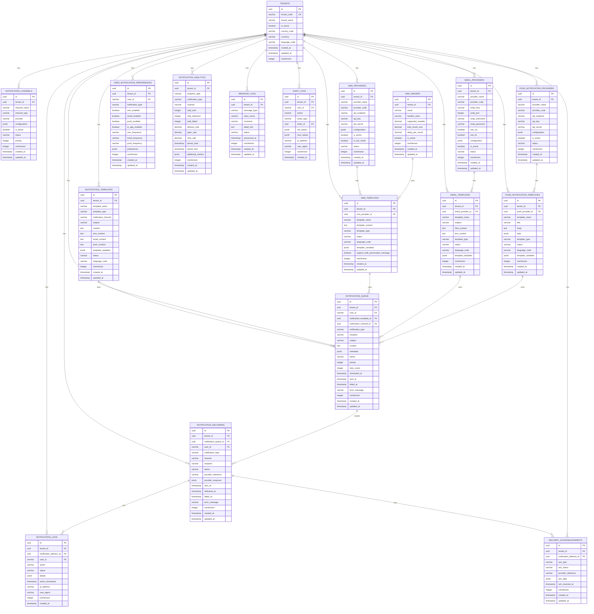

# 📱 **Notification Service ER Diagram**

## 🎯 **Service Overview**
The Notification Service handles all notification delivery systems including SMS, email, push notifications, and in-app notifications for the betting platform. It manages notification templates, delivery channels, and user preferences with complete multi-tenant isolation.

## 📊 **Entity Relationship Diagram**

## 🎯 **SRS Requirements Coverage**

### **FR-035: Notification Delivery System** ✅
- **Multi-Channel Notifications** → SMS, Email, Push, In-App notifications
- **Template Management** → `NOTIFICATION_TEMPLATES` with multi-language support
- **Provider Integration** → Multiple SMS, Email, and Push providers
- **Queue Management** → `NOTIFICATION_QUEUE` with priority and retry logic
- **Delivery Tracking** → `NOTIFICATION_DELIVERIES` with complete status tracking
- **User Preferences** → `USER_NOTIFICATION_PREFERENCES` for personalized notifications
- **Analytics** → `NOTIFICATION_ANALYTICS` with delivery metrics

## 🔒 **Security Features**

### **1. Multi-Tenant Isolation**
- **TenantId in every table** for complete data isolation
- **No cross-tenant data access** possible
- **Tenant-scoped queries** for performance

### **2. Notification Security**
- **Template validation** with content sanitization
- **Provider authentication** with secure credentials
- **Delivery encryption** for sensitive notifications
- **Audit trail** for all notification activities

### **3. Data Integrity**
- **Queue consistency** with proper retry mechanisms
- **Delivery tracking** with status validation
- **Template versioning** with change management
- **Real-time monitoring** with delivery analytics

## 🚀 **Performance Optimizations**

### **1. Indexing Strategy**
- **Primary indexes** on all ID columns
- **Composite indexes** on (tenant_id, user_id, created_at)
- **Performance indexes** on frequently queried columns
- **Queue indexes** for priority-based processing

### **2. Query Optimization**
- **TenantId filtering** on all queries
- **Efficient joins** with proper foreign keys
- **Caching strategy** for templates and preferences
- **Real-time updates** with queue processing

## 📊 **Complete Table Organization & Structure**

### **🏢 1. TENANT MANAGEMENT (1 table)**
- `TENANTS` - Core tenant information

#### **📝 2. NOTIFICATION TEMPLATES (1 table)**
- `NOTIFICATION_TEMPLATES` - Multi-channel notification templates

#### **📡 3. NOTIFICATION CHANNELS (1 table)**
- `NOTIFICATION_CHANNELS` - Notification channel management

#### **📱 4. SMS SYSTEM (3 tables)**
- `SMS_PROVIDERS` - SMS provider management
- `SMS_TEMPLATES` - SMS message templates
- `SMS_DRIVERS` - SMS driver/handler management

#### **📧 5. EMAIL SYSTEM (2 tables)**
- `EMAIL_PROVIDERS` - Email provider management
- `EMAIL_TEMPLATES` - Email message templates

#### **🔔 6. PUSH NOTIFICATION SYSTEM (2 tables)**
- `PUSH_NOTIFICATION_PROVIDERS` - Push notification providers
- `PUSH_NOTIFICATION_TEMPLATES` - Push notification templates

#### **📋 7. NOTIFICATION PROCESSING (2 tables)**
- `NOTIFICATION_QUEUE` - Notification queue management
- `NOTIFICATION_DELIVERIES` - Delivery tracking and status

#### **👤 8. USER PREFERENCES (1 table)**
- `USER_NOTIFICATION_PREFERENCES` - User notification preferences

#### **📊 9. ANALYTICS & LOGGING (5 tables)**
- `NOTIFICATION_LOGS` - Notification activity logs
- `NOTIFICATION_ANALYTICS` - Notification performance analytics
- `MESSAGE_LOGS` - Message processing logs
- `DELIVERY_ACKNOWLEDGMENTS` - Delivery acknowledgment tracking
- `AUDIT_LOGS` - Complete audit trail

## 🎯 **Total: 18 Tables**

### **✅ Complete Coverage:**
1. **Notification Templates** (1 table)
2. **Notification Channels** (1 table)
3. **SMS System** (3 tables)
4. **Email System** (2 tables)
5. **Push Notification System** (2 tables)
6. **Notification Processing** (2 tables)
7. **User Preferences** (1 table)
8. **Analytics & Logging** (5 tables)

### **✅ Migration Strategy:**
- **Preserve Business Logic** → Keep your current SMS and notification logic
- **Enhance with .NET** → Add modern microservices architecture
- **Multi-Tenant Support** → Add tenant_id to all existing patterns
- **Provider Integration** → Enhance with modern notification APIs

## 🚀 **Key Features:**

### **✅ 1. Multi-Channel Notification System**
- **SMS Notifications** → Multiple SMS providers with templates
- **Email Notifications** → Rich email templates with HTML support
- **Push Notifications** → Mobile and web push notifications
- **In-App Notifications** → Real-time in-app messaging

### **✅ 2. Advanced Template Management**
- **Multi-Language Support** → Localized notification templates
- **Variable Substitution** → Dynamic content with user data
- **Template Versioning** → Template change management
- **A/B Testing** → Template performance optimization
- **Bulk Personalization** → Support for bulk personalized messages
- **SMS Driver Support** → Multiple SMS handler classes with chunking

### **✅ 3. Robust Delivery System**
- **Queue Management** → Priority-based notification processing
- **Retry Logic** → Automatic retry for failed deliveries
- **Delivery Tracking** → Complete delivery status tracking
- **Error Handling** → Comprehensive error management

### **✅ 4. User-Centric Features**
- **User Preferences** → Personalized notification settings
- **Channel Selection** → User choice of notification channels
- **Frequency Control** → Notification frequency management
- **Opt-out Management** → Easy unsubscribe options

### **✅ 5. Analytics & Monitoring**
- **Delivery Analytics** → Delivery rate, open rate, click rate
- **Performance Metrics** → Provider performance tracking
- **User Engagement** → User notification interaction tracking
- **Real-time Monitoring** → Live notification status monitoring
- **Message Logging** → Complete message processing logs
- **Delivery Acknowledgments** → SMS delivery confirmation tracking

---

**This Notification Service ER diagram provides complete notification delivery system capabilities with multi-channel support, template management, and analytics for your betting platform!** 🎯
