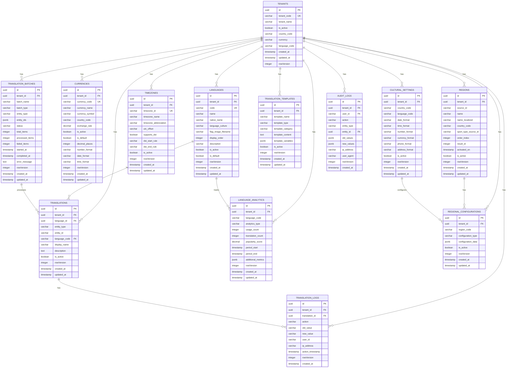

# 🌍 **Localization Service ER Diagram**

## 🎯 **Service Overview**
The Localization Service handles multi-language support, regional settings, currency management, and timezone handling for the betting platform. It manages translations, language configurations, regional settings, and cultural adaptations with complete multi-tenant isolation.

## 📊 **Entity Relationship Diagram**

## 🎯 **SRS Requirements Coverage**

### **FR-037: Regional Support** ✅
- **Multi-Language Support** → `LANGUAGES` and `TRANSLATIONS` for complete localization
- **Currency Management** → `CURRENCIES` with exchange rates and formatting
- **Regional Settings** → `REGIONS` and `CULTURAL_SETTINGS` for country-specific configurations
- **Timezone Support** → `TIMEZONES` with DST handling
- **Translation Management** → `TRANSLATION_TEMPLATES` and `TRANSLATION_BATCHES` for bulk operations
- **Analytics** → `LANGUAGE_ANALYTICS` for usage tracking and optimization

## 🔒 **Security Features**

### **1. Multi-Tenant Isolation**
- **TenantId in every table** for complete data isolation
- **No cross-tenant access** possible
- **Tenant-scoped queries** for performance

### **2. Translation Security**
- **Translation validation** with content sanitization
- **Batch processing** with error handling
- **Audit trail** for all translation activities
- **Version control** with change tracking

### **3. Data Integrity**
- **Language consistency** with proper validation
- **Currency accuracy** with exchange rate management
- **Regional compliance** with local regulations
- **Real-time updates** with caching support

## 🚀 **Performance Optimizations**

### **1. Indexing Strategy**
- **Primary indexes** on all ID columns
- **Composite indexes** on (tenant_id, language_code, entity_type)
- **Performance indexes** on frequently queried columns
- **Translation indexes** for fast lookups

### **2. Query Optimization**
- **TenantId filtering** on all queries
- **Efficient joins** with proper foreign keys
- **Caching strategy** for translations and languages
- **Batch processing** for bulk operations

## 📊 **Complete Table Organization & Structure**

### **🏢 1. TENANT MANAGEMENT (1 table)**
- `TENANTS` - Core tenant information

#### **🌍 2. LANGUAGE MANAGEMENT (1 table)**
- `LANGUAGES` - Language configuration and settings

#### **📝 3. TRANSLATION SYSTEM (3 tables)**
- `TRANSLATIONS` - Entity translations
- `TRANSLATION_TEMPLATES` - Translation templates
- `TRANSLATION_BATCHES` - Bulk translation processing

#### **💰 4. CURRENCY SYSTEM (1 table)**
- `CURRENCIES` - Currency management and exchange rates

#### **🗺️ 5. REGIONAL SYSTEM (2 tables)**
- `REGIONS` - Geographical regions
- `CULTURAL_SETTINGS` - Cultural and regional settings

#### **⏰ 6. TIMEZONE SYSTEM (1 table)**
- `TIMEZONES` - Timezone management with DST support

#### **📊 7. ANALYTICS & LOGGING (3 tables)**
- `TRANSLATION_LOGS` - Translation activity logs
- `LANGUAGE_ANALYTICS` - Language usage analytics
- `REGIONAL_CONFIGURATIONS` - Regional configuration management

#### **🔍 8. AUDIT TRAIL (1 table)**
- `AUDIT_LOGS` - Complete audit trail

## 🎯 **Total: 12 Tables**

### **✅ Complete Coverage:**
1. **Language Management** (1 table)
2. **Translation System** (3 tables)
3. **Currency System** (1 table)
4. **Regional System** (2 tables)
5. **Timezone System** (1 table)
6. **Analytics & Logging** (3 tables)
7. **Audit Trail** (1 table)

### **✅ Migration Strategy:**
- **Preserve Business Logic** → Keep your current translation logic
- **Enhance with .NET** → Add modern microservices architecture
- **Multi-Tenant Support** → Add tenant_id to all existing patterns
- **Advanced Features** → Add batch processing and analytics

## 🚀 **Key Features:**

### **✅ 1. Multi-Language Support**
- **Language Management** → Complete language configuration
- **Translation System** → Entity-based translations
- **Template Support** → Reusable translation templates
- **Batch Processing** → Bulk translation operations

### **✅ 2. Regional Configuration**
- **Currency Support** → Multi-currency with exchange rates
- **Regional Settings** → Country-specific configurations
- **Cultural Adaptation** → Date, time, and number formatting
- **Timezone Management** → DST-aware timezone handling

### **✅ 3. Advanced Translation Features**
- **Entity-Based Translations** → Translate any entity type
- **Template System** → Reusable translation templates
- **Batch Operations** → Bulk translation processing
- **Version Control** → Translation change tracking

### **✅ 4. Analytics & Monitoring**
- **Usage Analytics** → Language usage tracking
- **Performance Metrics** → Translation performance monitoring
- **Audit Trail** → Complete translation activity logging
- **Regional Analytics** → Regional usage patterns

### **✅ 5. Enterprise Features**
- **Multi-Tenant Support** → Complete tenant isolation
- **Configuration Management** → Regional and cultural settings
- **Caching Support** → High-performance translation lookups
- **API Integration** → RESTful translation services

---

**This Localization Service ER diagram provides complete multi-language and regional support capabilities for your betting platform!** 🎯
