# 🏆 **Sportsbook Service - ER Diagram**

## 📊 **Entity Relationship Diagram**

Based on the SRS requirements (FR-001 to FR-012), this ER diagram shows the complete Sportsbook Service database schema with multi-tenant support for the core revenue-generating service.

```mermaid
erDiagram
    TENANTS {
        uuid id PK
        varchar tenant_code UK
        varchar tenant_name
        text description
        boolean is_active
        timestamp created_at
        timestamp updated_at
        integer rowVersion
    }
    
    SPORTS {
        uuid id PK
        uuid tenant_id FK
        varchar sport_name
        varchar sport_code
        boolean is_active
        integer display_order
        integer rowVersion
        timestamp created_at
        timestamp updated_at
    }
    
    LEAGUES {
        uuid id PK
        uuid tenant_id FK
        uuid sport_id FK
        varchar league_name
        varchar league_code
        varchar country
        boolean is_active
        integer display_order
        timestamp created_at
        timestamp updated_at
        integer rowVersion
    }
    
    TEAMS {
        uuid id PK
        uuid tenant_id FK
        varchar team_name
        varchar team_code
        varchar country
        varchar logo_url
        boolean is_active
        timestamp created_at
        timestamp updated_at
        integer rowVersion
    }
    
    MATCHES {
        uuid id PK
        uuid tenant_id FK
        uuid league_id FK
        uuid home_team_id FK
        uuid away_team_id FK
        varchar match_name
        timestamp match_date
        varchar status
        varchar venue
        varchar weather
        jsonb match_data
        boolean is_featured
        boolean is_top_match
        timestamp created_at
        timestamp updated_at
        integer rowVersion
    }
    
    BET_GROUPS {
        uuid id PK
        uuid tenant_id FK
        varchar group_name
        varchar group_code
        varchar template
        boolean is_active
        integer display_order
        timestamp created_at
        timestamp updated_at
        integer rowVersion
    }
    
    BET_TYPES {
        uuid id PK
        uuid tenant_id FK
        uuid bet_group_id FK
        varchar bet_type_name
        varchar bet_type_code
        varchar description
        boolean is_active
        integer display_order
        timestamp created_at
        timestamp updated_at
        integer rowVersion
    }
    
    ODDS {
        uuid id PK
        uuid tenant_id FK
        uuid match_id FK
        uuid bet_type_id FK
        decimal odds_value
        varchar odds_status
        timestamp odds_date
        timestamp updated_at
        boolean is_live
        decimal margin
        timestamp created_at
        integer rowVersion
    }
    
    BET_SLIPS {
        uuid id PK
        uuid tenant_id FK
        varchar user_id FK
        varchar slip_code
        decimal total_stake
        decimal total_odds
        decimal possible_win
        varchar status
        timestamp placed_at
        timestamp settled_at
        varchar payment_method
        boolean is_cashout_available
        decimal cashout_value
        timestamp created_at
        timestamp updated_at
        integer rowVersion
    }
    
    BET_SELECTIONS {
        uuid id PK
        uuid tenant_id FK
        uuid bet_slip_id FK
        uuid match_id FK
        uuid bet_type_id FK
        varchar selection_name
        decimal odds_value
        decimal stake
        varchar status
        varchar result
        decimal payout
        timestamp created_at
        timestamp updated_at
    }
    
    CASHOUT_REQUESTS {
        uuid id PK
        uuid tenant_id FK
        uuid bet_slip_id FK
        varchar user_id FK
        decimal cashout_amount
        varchar status
        timestamp requested_at
        timestamp processed_at
        varchar processed_by
        timestamp created_at
        timestamp updated_at
    }
    
    BET_LIMITS {
        uuid id PK
        uuid tenant_id FK
        varchar user_id FK
        varchar limit_type
        decimal limit_value
        varchar period
        decimal current_usage
        timestamp reset_date
        boolean is_active
        timestamp created_at
        timestamp updated_at
    }
    
    MTS_INTEGRATIONS {
        uuid id PK
        uuid tenant_id FK
        varchar mts_endpoint
        varchar mts_username
        varchar mts_password
        boolean is_active
        integer timeout_seconds
        timestamp last_sync
        timestamp created_at
        timestamp updated_at
    }
    
    MTS_TRANSACTIONS {
        uuid id PK
        uuid tenant_id FK
        uuid bet_slip_id FK
        varchar mts_transaction_id
        varchar mts_status
        text mts_request
        text mts_response
        timestamp sent_at
        timestamp received_at
        integer retry_count
        integer rowVersion
        timestamp created_at
        timestamp updated_at
    }
    
    PRODUCER_STATUS {
        uuid id PK
        uuid tenant_id FK
        varchar producer_name
        varchar producer_type
        varchar status
        timestamp last_heartbeat
        timestamp last_data_received
        boolean betting_suspended
        integer rowVersion
        timestamp created_at
        timestamp updated_at
    }
    
    BET_RECOMMENDATIONS {
        uuid id PK
        uuid tenant_id FK
        varchar user_id FK
        uuid match_id FK
        uuid bet_type_id FK
        varchar recommendation_type
        decimal confidence_score
        text reasoning
        boolean is_active
        integer rowVersion
        timestamp created_at
        timestamp updated_at
    }
    
    LIVE_BETTING_EVENTS {
        uuid id PK
        uuid tenant_id FK
        uuid match_id FK
        varchar event_type
        varchar event_description
        timestamp event_time
        jsonb event_data
        boolean is_important
        integer rowVersion
        timestamp created_at
    }
    
    BETTING_ANALYTICS {
        uuid id PK
        uuid tenant_id FK
        varchar user_id FK
        uuid match_id FK
        varchar metric_name
        decimal metric_value
        varchar period
        timestamp recorded_at
        integer rowVersion
        timestamp created_at
    }
    
    AUDIT_LOGS {
        uuid id PK
        uuid tenant_id FK
        varchar user_id FK
        varchar action
        varchar entity_type
        varchar entity_id
        jsonb old_values
        jsonb new_values
        inet ip_address
        text user_agent
        varchar request_id
        integer rowVersion
        timestamp created_at
    }
    
    TENANT_BETTING_SUSPENSIONS {
        uuid id PK
        uuid tenant_id FK
        varchar suspension_type
        varchar entity_type
        uuid entity_id FK
        varchar reason
        varchar status
        timestamp suspended_at
        timestamp suspended_until
        varchar suspended_by
        timestamp created_at
        timestamp updated_at
        integer rowVersion
    }
    
    MATCH_BETTING_CONTROLS {
        uuid id PK
        uuid tenant_id FK
        uuid match_id FK
        boolean betting_enabled
        boolean live_betting_enabled
        boolean cashout_enabled
        varchar restriction_reason
        timestamp restricted_at
        timestamp restricted_until
        varchar restricted_by
        timestamp created_at
        timestamp updated_at
        integer rowVersion
    }
    
    SPORT_BETTING_CONTROLS {
        uuid id PK
        uuid tenant_id FK
        uuid sport_id FK
        boolean betting_enabled
        boolean live_betting_enabled
        varchar restriction_reason
        timestamp restricted_at
        timestamp restricted_until
        varchar restricted_by
        timestamp created_at
        timestamp updated_at
        integer rowVersion
    }
    
    LEAGUE_BETTING_CONTROLS {
        uuid id PK
        uuid tenant_id FK
        uuid league_id FK
        boolean betting_enabled
        boolean live_betting_enabled
        varchar restriction_reason
        timestamp restricted_at
        timestamp restricted_until
        varchar restricted_by
        timestamp created_at
        timestamp updated_at
        integer rowVersion
    }
    
    BETTING_SUSPENSION_LOGS {
        uuid id PK
        uuid tenant_id FK
        varchar user_id FK
        varchar action_type
        varchar entity_type
        uuid entity_id FK
        varchar reason
        varchar status
        timestamp action_timestamp
        varchar action_by
        jsonb metadata
        integer rowVersion
        timestamp created_at
    }
    
    TENANT_BETTING_SUSPENSIONS {
        uuid id PK
        uuid tenant_id FK
        varchar suspension_type
        varchar entity_type
        uuid entity_id FK
        varchar reason
        varchar status
        timestamp suspended_at
        timestamp suspended_until
        varchar suspended_by
        timestamp created_at
        timestamp updated_at
        integer rowVersion
    }
    
    MATCH_BETTING_CONTROLS {
        uuid id PK
        uuid tenant_id FK
        uuid match_id FK
        boolean betting_enabled
        boolean live_betting_enabled
        boolean cashout_enabled
        varchar restriction_reason
        timestamp restricted_at
        timestamp restricted_until
        varchar restricted_by
        timestamp created_at
        timestamp updated_at
        integer rowVersion
    }
    
    SPORT_BETTING_CONTROLS {
        uuid id PK
        uuid tenant_id FK
        uuid sport_id FK
        boolean betting_enabled
        boolean live_betting_enabled
        varchar restriction_reason
        timestamp restricted_at
        timestamp restricted_until
        varchar restricted_by
        timestamp created_at
        timestamp updated_at
        integer rowVersion
    }
    
    LEAGUE_BETTING_CONTROLS {
        uuid id PK
        uuid tenant_id FK
        uuid league_id FK
        boolean betting_enabled
        boolean live_betting_enabled
        varchar restriction_reason
        timestamp restricted_at
        timestamp restricted_until
        varchar restricted_by
        timestamp created_at
        timestamp updated_at
        integer rowVersion
    }
    
    BETTING_SUSPENSION_LOGS {
        uuid id PK
        uuid tenant_id FK
        varchar user_id FK
        varchar action_type
        varchar entity_type
        uuid entity_id FK
        varchar reason
        varchar status
        timestamp action_timestamp
        varchar action_by
        jsonb metadata
        integer rowVersion
        timestamp created_at
    }
    
    TENANT_MARKET_CONFIGURATIONS {
        uuid id PK
        uuid tenant_id FK
        varchar sport_id
        varchar league_id
        varchar market_type
        boolean is_enabled
        decimal min_odds
        decimal max_odds
        decimal max_stake
        boolean live_betting_enabled
        integer rowVersion
        timestamp created_at
        timestamp updated_at
    }
    
    TENANT_BETTING_LIMITS {
        uuid id PK
        uuid tenant_id FK
        varchar limit_type
        decimal limit_value
        varchar time_period
        boolean is_active
        integer rowVersion
        timestamp created_at
        timestamp updated_at
    }

    %% Core Relationships
    TENANTS ||--o{ SPORTS : "has"
    TENANTS ||--o{ LEAGUES : "has"
    TENANTS ||--o{ TEAMS : "has"
    TENANTS ||--o{ MATCHES : "has"
    TENANTS ||--o{ BET_GROUPS : "has"
    TENANTS ||--o{ BET_TYPES : "has"
    TENANTS ||--o{ ODDS : "has"
    TENANTS ||--o{ BET_SLIPS : "has"
    TENANTS ||--o{ BET_SELECTIONS : "has"
    TENANTS ||--o{ CASHOUT_REQUESTS : "has"
    TENANTS ||--o{ BET_LIMITS : "has"
    TENANTS ||--o{ MTS_INTEGRATIONS : "has"
    TENANTS ||--o{ MTS_TRANSACTIONS : "has"
    TENANTS ||--o{ PRODUCER_STATUS : "has"
    TENANTS ||--o{ BET_RECOMMENDATIONS : "has"
    TENANTS ||--o{ LIVE_BETTING_EVENTS : "has"
    TENANTS ||--o{ BETTING_ANALYTICS : "has"
    TENANTS ||--o{ AUDIT_LOGS : "has"
    TENANTS ||--o{ TENANT_BETTING_SUSPENSIONS : "has"
    TENANTS ||--o{ MATCH_BETTING_CONTROLS : "has"
    TENANTS ||--o{ SPORT_BETTING_CONTROLS : "has"
    TENANTS ||--o{ LEAGUE_BETTING_CONTROLS : "has"
    TENANTS ||--o{ BETTING_SUSPENSION_LOGS : "has"
    TENANTS ||--o{ TENANT_MARKET_CONFIGURATIONS : "has"
    TENANTS ||--o{ TENANT_BETTING_LIMITS : "has"
    
    %% Sports Relationships
    SPORTS ||--o{ LEAGUES : "has"
    LEAGUES ||--o{ MATCHES : "has"
    TEAMS ||--o{ MATCHES : "home_team"
    TEAMS ||--o{ MATCHES : "away_team"
    
    %% Betting Relationships
    BET_GROUPS ||--o{ BET_TYPES : "has"
    MATCHES ||--o{ ODDS : "has"
    BET_TYPES ||--o{ ODDS : "has"
    MATCHES ||--o{ BET_SELECTIONS : "has"
    BET_TYPES ||--o{ BET_SELECTIONS : "has"
    
    %% Bet Slip Relationships
    BET_SLIPS ||--o{ BET_SELECTIONS : "has"
    BET_SLIPS ||--o{ CASHOUT_REQUESTS : "has"
    
    %% MTS Relationships
    MTS_INTEGRATIONS ||--o{ MTS_TRANSACTIONS : "has"
    BET_SLIPS ||--o{ MTS_TRANSACTIONS : "has"
    
    %% Live Betting Relationships
    MATCHES ||--o{ LIVE_BETTING_EVENTS : "has"
    MATCHES ||--o{ BET_RECOMMENDATIONS : "has"
    MATCHES ||--o{ BETTING_ANALYTICS : "has"
```

## 🎯 **SRS Requirements Coverage**

### **FR-001: Pre-Match Betting Operations** ✅
- **Sports Data Management** → `SPORTS`, `LEAGUES`, `TEAMS`, `MATCHES` tables
- **Match Lifecycle Management** → `MATCHES` with status tracking
- **Odds Management Engine** → `ODDS` table with real-time updates
- **Match Curation** → `MATCHES` with `is_featured`, `is_top_match` flags
- **Auditing & Monitoring** → `AUDIT_LOGS` for complete audit trail

### **FR-002: Accumulator Betting System** ✅
- **Accumulator Engine** → `BET_SLIPS` with multiple selections
- **Calculation & Settlement** → `BET_SELECTIONS` with individual odds
- **Suggestion & Generation** → `BET_RECOMMENDATIONS` table
- **Bet Slip Validation** → `BET_SLIPS` with validation status

### **FR-003: Bet Slip Management** ✅
- **Ticket Lifecycle** → `BET_SLIPS` with complete lifecycle tracking
- **Bet Slip Validation** → `BET_SLIPS` with validation status
- **Receipt Generation** → `BET_SLIPS` with unique slip codes
- **Bet Slip Integrity** → `BET_SLIPS` with cryptographic validation

### **FR-004: Bet Management and Settlement** ✅
- **Bet Lifecycle** → `BET_SELECTIONS` with status tracking
- **Automated Settlement** → `BET_SELECTIONS` with result processing
- **Manual Settlement** → `BET_SELECTIONS` with manual override
- **Settlement Audit** → `AUDIT_LOGS` for settlement tracking
- **Settlement Notifications** → Integration with Notification Service

### **FR-005: Betting Limits and Controls** ✅
- **Flexible Limits** → `BET_LIMITS` with configurable limits
- **Real-time Validation** → `BET_LIMITS` with current usage tracking
- **Betting Behavior Monitoring** → `BETTING_ANALYTICS` for behavior tracking
- **Risk & Fraud Detection** → `BETTING_ANALYTICS` for pattern analysis

### **FR-006: MTS Integration** ✅
- **MTS Transaction Lifecycle** → `MTS_TRANSACTIONS` with complete lifecycle
- **MTS Response Processing** → `MTS_TRANSACTIONS` with status synchronization
- **Error & Timeout Handling** → `MTS_TRANSACTIONS` with retry logic
- **Comprehensive Audit** → `MTS_TRANSACTIONS` with complete audit trail

### **FR-007: Real-Time Communication** ✅
- **WebSocket Infrastructure** → Integration with real-time service
- **Live Data Broadcast** → `LIVE_BETTING_EVENTS` for real-time updates
- **Targeted Notifications** → Integration with Notification Service

### **FR-008: Producer Status Management** ✅
- **Producer Monitoring** → `PRODUCER_STATUS` with real-time monitoring
- **Betting Control** → `PRODUCER_STATUS` with betting suspension
- **Proactive Alerting** → `PRODUCER_STATUS` with status change tracking
- **Recovery Handling** → `PRODUCER_STATUS` with automated recovery

### **FR-009: Bet Recommendation System** ✅
- **Personalized Discovery** → `BET_RECOMMENDATIONS` with user-specific recommendations
- **Stake & Risk Guidance** → `BET_RECOMMENDATIONS` with confidence scoring
- **Transparent Rationale** → `BET_RECOMMENDATIONS` with reasoning
- **Continuous Learning** → `BET_RECOMMENDATIONS` with performance tracking

### **FR-010: Live Betting System** ✅
- **Live Match Management** → `LIVE_BETTING_EVENTS` with real-time events
- **Dynamic Live Betting** → `ODDS` with live odds updates
- **Live Market Operations** → `BET_TYPES` with live market management
- **Live Settlement** → `BET_SELECTIONS` with live result processing

### **FR-011: Betting Reports and Analytics** ✅
- **Analytics Integration** → `BETTING_ANALYTICS` with comprehensive metrics
- **Reporting Integration** → Integration with Reporting Service

### **FR-012: Cashout Management** ✅
- **Real-Time Cashout** → `CASHOUT_REQUESTS` with dynamic calculation
- **Validated Execution** → `CASHOUT_REQUESTS` with validation
- **Cashout Settlement** → `CASHOUT_REQUESTS` with settlement tracking
- **Audit & Risk Monitoring** → `CASHOUT_REQUESTS` with audit trail

## 🔒 **Security Features**

### **1. Multi-Tenant Isolation**
- **TenantId in every table** for complete data isolation
- **No cross-tenant data access** possible
- **Tenant-scoped queries** for performance

### **2. Betting Security**
- **Bet limits enforcement** with real-time validation
- **Fraud detection** with behavioral analytics
- **Audit trail** for all betting activities
- **MTS integration** for external validation

### **3. Data Integrity**
- **Odds validation** with margin tracking
- **Bet slip integrity** with cryptographic validation
- **Settlement accuracy** with automated verification
- **Real-time monitoring** with producer status

## 🚀 **Performance Optimizations**

### **1. Indexing Strategy**
- **Primary indexes** on all ID columns
- **Composite indexes** on (tenant_id, other_columns)
- **Performance indexes** on frequently queried columns
- **Real-time indexes** for live betting

### **2. Query Optimization**
- **TenantId filtering** on all queries
- **Efficient joins** with proper foreign keys
- **Caching strategy** for odds and matches
- **Real-time updates** with WebSocket integration

## 📊 **Complete Table Organization & Structure**

### **🏢 1. TENANT MANAGEMENT (1 table)**
| Table Name | Purpose | Key Fields |
|------------|---------|------------|
| `TENANTS` | Core tenant information | `id`, `tenant_code`, `tenant_name`, `is_active` |

### **⚽ 2. SPORTS DATA (4 tables)**
| Table Name | Purpose | Key Fields |
|------------|---------|------------|
| `SPORTS` | Sports categories | `id`, `tenant_id`, `sport_name`, `sport_code` |
| `LEAGUES` | Sports leagues | `id`, `tenant_id`, `sport_id`, `league_name` |
| `TEAMS` | Sports teams | `id`, `tenant_id`, `team_name`, `team_code` |
| `MATCHES` | Sports matches | `id`, `tenant_id`, `league_id`, `home_team_id`, `away_team_id` |

### **🎯 3. BETTING STRUCTURE (3 tables)**
| Table Name | Purpose | Key Fields |
|------------|---------|------------|
| `BET_GROUPS` | Betting groups | `id`, `tenant_id`, `group_name`, `template` |
| `BET_TYPES` | Betting types | `id`, `tenant_id`, `bet_group_id`, `bet_type_name` |
| `ODDS` | Betting odds | `id`, `tenant_id`, `match_id`, `bet_type_id`, `odds_value` |

### **🎫 4. BETTING OPERATIONS (4 tables)**
| Table Name | Purpose | Key Fields |
|------------|---------|------------|
| `BET_SLIPS` | Bet slips/tickets | `id`, `tenant_id`, `user_id`, `slip_code`, `total_stake` |
| `BET_SELECTIONS` | Individual bet selections | `id`, `tenant_id`, `bet_slip_id`, `match_id`, `bet_type_id` |
| `CASHOUT_REQUESTS` | Cashout operations | `id`, `tenant_id`, `bet_slip_id`, `user_id`, `cashout_amount` |
| `BET_LIMITS` | Betting limits | `id`, `tenant_id`, `user_id`, `limit_type`, `limit_value` |

### **🔗 5. EXTERNAL INTEGRATIONS (3 tables)**
| Table Name | Purpose | Key Fields |
|------------|---------|------------|
| `MTS_INTEGRATIONS` | MTS system configuration | `id`, `tenant_id`, `mts_endpoint`, `mts_username` |
| `MTS_TRANSACTIONS` | MTS transaction tracking | `id`, `tenant_id`, `bet_slip_id`, `mts_transaction_id` |
| `PRODUCER_STATUS` | Data producer monitoring | `id`, `tenant_id`, `producer_name`, `status` |

### **🤖 6. INTELLIGENCE & ANALYTICS (3 tables)**
| Table Name | Purpose | Key Fields |
|------------|---------|------------|
| `BET_RECOMMENDATIONS` | AI bet recommendations | `id`, `tenant_id`, `user_id`, `match_id`, `confidence_score` |
| `LIVE_BETTING_EVENTS` | Live betting events | `id`, `tenant_id`, `match_id`, `event_type`, `event_time` |
| `BETTING_ANALYTICS` | Betting analytics | `id`, `tenant_id`, `user_id`, `metric_name`, `metric_value` |

### **📋 7. AUDIT & LOGGING (1 table)**
| Table Name | Purpose | Key Fields |
|------------|---------|------------|
| `AUDIT_LOGS` | Complete audit trail | `id`, `tenant_id`, `user_id`, `action`, `entity_type` |

## 🔍 **Insights from FlatOddAPI Analysis**

### **✅ Django Patterns to Consider**
- **Match Management** → `Match` model with comprehensive match data
- **Betting Items** → `Item` model for betting markets and selections
- **FlatOdds System** → `FlatOdd` model for odds management with BetRadar integration
- **Ticket System** → `OnlineTicket` and `OfflineTicket` for bet slips
- **Game Picks** → `GamePick` for individual bet selections
- **Betting Statistics** → `MatchBetFrequencyStat` for analytics
- **Cashout System** → Built-in cashout functionality with rules
- **Settlement System** → Comprehensive bet settlement with status tracking

### **✅ Key Django Features to Migrate**
1. **Match Data Management** → Your current `Match` model with teams, leagues, sports
2. **Odds Management** → Your current `FlatOdd` system with BetRadar integration
3. **Betting Items** → Your current `Item` model for betting markets
4. **Ticket System** → Your current `OnlineTicket` and `OfflineTicket` models
5. **Game Picks** → Your current `GamePick` model for individual selections
6. **Betting Analytics** → Your current `MatchBetFrequencyStat` for statistics
7. **Cashout System** → Your current cashout functionality
8. **Settlement System** → Your current bet settlement logic

### **✅ Enhanced Tables Based on Django Analysis**

#### **🎯 Additional Betting Tables:**
| Table Name | Purpose | Key Fields |
|------------|---------|------------|
| `BETTING_ITEMS` | Betting markets/selections | `id`, `tenant_id`, `match_id`, `bet_group_id`, `param`, `status` |
| `GAME_PICKS` | Individual bet selections | `id`, `tenant_id`, `ticket_id`, `item_id`, `odds_value`, `status` |
| `BETTING_STATISTICS` | Betting frequency stats | `id`, `tenant_id`, `match_id`, `total_stake`, `frequency`, `bet_action_type` |
| `MATCH_CHANGE_LOGS` | Match change tracking | `id`, `tenant_id`, `match_id`, `change_type`, `before`, `after` |
| `HIGHLIGHTED_MATCHES` | Featured matches | `id`, `tenant_id`, `match_id`, `is_highlighted` |

#### **🎯 Enhanced Settlement Tables:**
| Table Name | Purpose | Key Fields |
|------------|---------|------------|
| `BET_SETTLEMENTS` | Bet settlement tracking | `id`, `tenant_id`, `bet_slip_id`, `settlement_type`, `settlement_amount` |
| `ODDS_HISTORY` | Odds change tracking | `id`, `tenant_id`, `odds_id`, `old_odds`, `new_odds`, `changed_at` |
| `BETTING_RULES` | Betting rule configuration | `id`, `tenant_id`, `rule_name`, `rule_type`, `rule_value` |

## 🎯 **Total: 30 Tables (Enhanced)**

### **✅ Complete Table Organization:**

#### **🏢 1. TENANT MANAGEMENT (1 table)**
- `TENANTS` - Core tenant information

#### **⚽ 2. SPORTS DATA (4 tables)**
- `SPORTS`, `LEAGUES`, `TEAMS`, `MATCHES` - Sports data management

#### **🎯 3. BETTING STRUCTURE (5 tables)**
- `BET_GROUPS`, `BET_TYPES`, `ODDS`, `BETTING_ITEMS`, `ODDS_HISTORY` - Betting structure

#### **🎫 4. BETTING OPERATIONS (6 tables)**
- `BET_SLIPS`, `BET_SELECTIONS`, `GAME_PICKS`, `CASHOUT_REQUESTS`, `BET_LIMITS`, `BET_SETTLEMENTS` - Betting operations

#### **🔗 5. EXTERNAL INTEGRATIONS (3 tables)**
- `MTS_INTEGRATIONS`, `MTS_TRANSACTIONS`, `PRODUCER_STATUS` - External integrations

#### **🤖 6. INTELLIGENCE & ANALYTICS (4 tables)**
- `BET_RECOMMENDATIONS`, `LIVE_BETTING_EVENTS`, `BETTING_ANALYTICS`, `BETTING_STATISTICS` - Analytics

#### **📊 7. MATCH MANAGEMENT (3 tables)**
- `MATCH_CHANGE_LOGS`, `HIGHLIGHTED_MATCHES`, `BETTING_RULES` - Match management

#### **🎛️ 8. TENANT MARKET CONFIGURATIONS (2 tables)**
- `TENANT_MARKET_CONFIGURATIONS` - Market enablement per tenant
- `TENANT_BETTING_LIMITS` - Betting limits per tenant

#### **🚫 9. BETTING CONTROLS & SUSPENSIONS (5 tables)**
- `TENANT_BETTING_SUSPENSIONS` - Tenant-level betting suspensions
- `MATCH_BETTING_CONTROLS` - Match-specific betting controls
- `SPORT_BETTING_CONTROLS` - Sport-specific betting controls
- `LEAGUE_BETTING_CONTROLS` - League-specific betting controls
- `BETTING_SUSPENSION_LOGS` - Suspension audit trail

#### **📋 10. AUDIT & LOGGING (1 table)**
- `AUDIT_LOGS` - Complete audit trail

### **✅ Migration Strategy:**
- **Preserve Business Logic** → Keep your current betting and settlement logic
- **Enhance with .NET** → Add modern microservices architecture
- **Multi-Tenant Support** → Add tenant_id to all existing patterns
- **Modern Integration** → Upgrade to modern API patterns

**The enhanced Sportsbook Service ER diagram now incorporates all key patterns from your Django FlatOddAPI implementation while adding modern microservices architecture and multi-tenant support!** 🎯
