# 🎰 **Casino Service ER Diagram**

## 🎯 **Service Overview**
The Casino Service handles all casino game management, provider integrations, game sessions, and casino-specific bonuses for the betting platform. It manages multiple casino providers, game categories, and casino bonus systems with complete multi-tenant isolation.

## 📊 **Entity Relationship Diagram**

```mermaid
erDiagram
    %% Core Tables
    TENANTS {
        uuid id PK
        varchar tenant_code UK
        varchar tenant_name
        boolean is_active
        varchar country_code
        varchar currency
        varchar language_code
        timestamp created_at
        timestamp updated_at
        integer rowVersion
    }
    
    CASINO_PROVIDERS {
        uuid id PK
        uuid tenant_id FK
        varchar provider_name
        varchar provider_code
        varchar api_endpoint
        varchar api_key
        varchar api_secret
        jsonb configuration
        boolean is_active
        boolean is_live_mode
        varchar status
        integer rowVersion
        timestamp created_at
        timestamp updated_at
    }
    
    CASINO_GAMES {
        uuid id PK
        uuid tenant_id FK
        uuid casino_provider_id FK
        varchar game_id
        varchar game_name
        varchar game_category
        varchar game_type
        varchar game_provider
        varchar game_icon
        varchar game_thumbnail
        text game_description
        jsonb game_configuration
        boolean is_active
        boolean is_featured
        decimal min_bet
        decimal max_bet
        varchar currency
        varchar language
        integer rowVersion
        timestamp created_at
        timestamp updated_at
    }
    
    CASINO_GAME_CATEGORIES {
        uuid id PK
        uuid tenant_id FK
        varchar category_name
        varchar category_code
        varchar description
        varchar icon
        boolean is_active
        integer sort_order
        integer rowVersion
        timestamp created_at
        timestamp updated_at
    }
    
    CASINO_SESSIONS {
        uuid id PK
        uuid tenant_id FK
        varchar user_id FK
        uuid casino_provider_id FK
        uuid casino_game_id FK
        varchar session_id
        varchar session_token
        varchar session_status
        decimal balance
        varchar currency
        timestamp session_start
        timestamp session_end
        jsonb session_data
        integer rowVersion
        timestamp created_at
        timestamp updated_at
    }
    
    CASINO_TRANSACTIONS {
        uuid id PK
        uuid tenant_id FK
        uuid casino_session_id FK
        varchar user_id FK
        varchar transaction_id
        varchar transaction_type
        decimal amount
        varchar currency
        varchar status
        varchar provider_reference
        jsonb provider_data
        timestamp processed_at
        integer rowVersion
        timestamp created_at
        timestamp updated_at
    }
    
    CASINO_BONUSES {
        uuid id PK
        uuid tenant_id FK
        varchar user_id FK
        uuid casino_game_id FK
        varchar bonus_type
        decimal bonus_amount
        decimal wagering_requirement
        decimal wagered_amount
        varchar status
        timestamp awarded_at
        timestamp expires_at
        timestamp completed_at
        jsonb bonus_terms
        integer rowVersion
        timestamp created_at
        timestamp updated_at
    }
    
    CASINO_FREE_BETS {
        uuid id PK
        uuid tenant_id FK
        varchar user_id FK
        uuid casino_game_id FK
        decimal amount
        decimal used_amount
        decimal remaining_amount
        varchar status
        timestamp awarded_at
        timestamp expires_at
        timestamp used_at
        varchar reference_id
        integer rowVersion
        timestamp created_at
        timestamp updated_at
    }
    
    CASINO_REWARDS {
        uuid id PK
        uuid tenant_id FK
        varchar user_id FK
        uuid casino_game_id FK
        varchar reward_type
        decimal reward_amount
        varchar currency
        varchar status
        timestamp earned_at
        timestamp processed_at
        varchar reference_id
        jsonb reward_data
        integer rowVersion
        timestamp created_at
        timestamp updated_at
    }
    
    CASINO_CASHBACKS {
        uuid id PK
        uuid tenant_id FK
        varchar user_id FK
        uuid casino_game_id FK
        decimal bet_amount
        decimal cashback_amount
        decimal cashback_percentage
        varchar status
        timestamp earned_at
        timestamp processed_at
        varchar reference_id
        integer rowVersion
        timestamp created_at
        timestamp updated_at
    }
    
    CASINO_ANALYTICS {
        uuid id PK
        uuid tenant_id FK
        varchar user_id FK
        uuid casino_game_id FK
        varchar analytics_type
        decimal total_bet
        decimal total_win
        decimal total_loss
        decimal net_result
        integer game_count
        decimal average_bet
        timestamp period_start
        timestamp period_end
        jsonb additional_metrics
        integer rowVersion
        timestamp created_at
        timestamp updated_at
    }
    
    CASINO_GAME_STATISTICS {
        uuid id PK
        uuid tenant_id FK
        uuid casino_game_id FK
        varchar statistic_type
        decimal total_bet
        decimal total_win
        decimal total_loss
        decimal rtp_percentage
        integer player_count
        integer session_count
        decimal average_session_duration
        timestamp period_start
        timestamp period_end
        integer rowVersion
        timestamp created_at
        timestamp updated_at
    }
    
    CASINO_PROVIDER_CONFIGURATIONS {
        uuid id PK
        uuid tenant_id FK
        uuid casino_provider_id FK
        varchar configuration_key
        text configuration_value
        boolean is_encrypted
        varchar configuration_type
        integer rowVersion
        timestamp created_at
        timestamp updated_at
    }
    
    CASINO_GAME_RESTRICTIONS {
        uuid id PK
        uuid tenant_id FK
        uuid casino_game_id FK
        varchar restriction_type
        varchar restriction_value
        boolean is_active
        timestamp effective_from
        timestamp effective_until
        varchar reason
        integer rowVersion
        timestamp created_at
        timestamp updated_at
    }
    
    CASINO_WALLET_SESSIONS {
        uuid id PK
        uuid tenant_id FK
        varchar user_id FK
        uuid casino_provider_id FK
        decimal balance
        varchar currency
        varchar session_status
        timestamp session_start
        timestamp session_end
        jsonb session_metadata
        integer rowVersion
        timestamp created_at
        timestamp updated_at
    }
    
    CASINO_OPERATOR_TOKENS {
        uuid id PK
        uuid tenant_id FK
        uuid casino_provider_id FK
        varchar token
        varchar token_type
        varchar status
        timestamp expires_at
        timestamp created_at
        timestamp updated_at
        integer rowVersion
    }
    
    AUDIT_LOGS {
        uuid id PK
        uuid tenant_id FK
        varchar user_id FK
        varchar action
        varchar entity_type
        uuid entity_id FK
        jsonb old_values
        jsonb new_values
        varchar ip_address
        varchar user_agent
        integer rowVersion
        timestamp created_at
    }
    
    %% Core Relationships
    TENANTS ||--o{ CASINO_PROVIDERS : "has"
    TENANTS ||--o{ CASINO_GAMES : "has"
    TENANTS ||--o{ CASINO_GAME_CATEGORIES : "has"
    TENANTS ||--o{ CASINO_SESSIONS : "has"
    TENANTS ||--o{ CASINO_TRANSACTIONS : "has"
    TENANTS ||--o{ CASINO_BONUSES : "has"
    TENANTS ||--o{ CASINO_FREE_BETS : "has"
    TENANTS ||--o{ CASINO_REWARDS : "has"
    TENANTS ||--o{ CASINO_CASHBACKS : "has"
    TENANTS ||--o{ CASINO_ANALYTICS : "has"
    TENANTS ||--o{ CASINO_GAME_STATISTICS : "has"
    TENANTS ||--o{ CASINO_PROVIDER_CONFIGURATIONS : "has"
    TENANTS ||--o{ CASINO_GAME_RESTRICTIONS : "has"
    TENANTS ||--o{ CASINO_WALLET_SESSIONS : "has"
    TENANTS ||--o{ CASINO_OPERATOR_TOKENS : "has"
    TENANTS ||--o{ AUDIT_LOGS : "has"
    
    %% Casino Provider Relationships
    CASINO_PROVIDERS ||--o{ CASINO_GAMES : "provides"
    CASINO_PROVIDERS ||--o{ CASINO_SESSIONS : "handles"
    CASINO_PROVIDERS ||--o{ CASINO_PROVIDER_CONFIGURATIONS : "has"
    CASINO_PROVIDERS ||--o{ CASINO_WALLET_SESSIONS : "manages"
    CASINO_PROVIDERS ||--o{ CASINO_OPERATOR_TOKENS : "uses"
    
    %% Game Relationships
    CASINO_GAMES ||--o{ CASINO_GAME_CATEGORIES : "belongs_to"
    CASINO_GAMES ||--o{ CASINO_SESSIONS : "played_in"
    CASINO_GAMES ||--o{ CASINO_BONUSES : "awards"
    CASINO_GAMES ||--o{ CASINO_FREE_BETS : "awards"
    CASINO_GAMES ||--o{ CASINO_REWARDS : "awards"
    CASINO_GAMES ||--o{ CASINO_CASHBACKS : "awards"
    CASINO_GAMES ||--o{ CASINO_ANALYTICS : "tracks"
    CASINO_GAMES ||--o{ CASINO_GAME_STATISTICS : "tracks"
    CASINO_GAMES ||--o{ CASINO_GAME_RESTRICTIONS : "has"
    
    %% Session Relationships
    CASINO_SESSIONS ||--o{ CASINO_TRANSACTIONS : "has"
    CASINO_SESSIONS ||--o{ CASINO_ANALYTICS : "contributes_to"
```

## 🎯 **SRS Requirements Coverage**

### **FR-013: Game Provider Integration** ✅
- **Provider Management** → `CASINO_PROVIDERS` with multiple provider support
- **Provider Configuration** → `CASINO_PROVIDER_CONFIGURATIONS` for settings
- **Provider Tokens** → `CASINO_OPERATOR_TOKENS` for authentication
- **Provider Analytics** → Performance tracking per provider

### **FR-014: Game Categories and Management** ✅
- **Game Management** → `CASINO_GAMES` with comprehensive game data
- **Category Management** → `CASINO_GAME_CATEGORIES` with organization
- **Game Restrictions** → `CASINO_GAME_RESTRICTIONS` for control
- **Game Statistics** → `CASINO_GAME_STATISTICS` for analytics

### **FR-015: Game Features and Functionality** ✅
- **Session Management** → `CASINO_SESSIONS` with complete session tracking
- **Transaction Processing** → `CASINO_TRANSACTIONS` with full lifecycle
- **Wallet Integration** → `CASINO_WALLET_SESSIONS` for balance management
- **Bonus System** → `CASINO_BONUSES` and `CASINO_FREE_BETS` for rewards

## 🔒 **Security Features**

### **1. Multi-Tenant Isolation**
- **TenantId in every table** for complete data isolation
- **No cross-tenant data access** possible
- **Tenant-scoped queries** for performance

### **2. Casino Security**
- **Session validation** with secure tokens
- **Transaction integrity** with provider validation
- **Game restrictions** with comprehensive controls
- **Audit trail** for all casino activities

### **3. Data Integrity**
- **Session consistency** with proper state management
- **Transaction atomicity** with rollback capabilities
- **Provider integration** with retry mechanisms
- **Real-time monitoring** with analytics

## 🚀 **Performance Optimizations**

### **1. Indexing Strategy**
- **Primary indexes** on all ID columns
- **Composite indexes** on (tenant_id, user_id, created_at)
- **Performance indexes** on frequently queried columns
- **Session indexes** for real-time operations

### **2. Query Optimization**
- **TenantId filtering** on all queries
- **Efficient joins** with proper foreign keys
- **Caching strategy** for game data
- **Real-time updates** with session management

## 📊 **Complete Table Organization & Structure**

### **🏢 1. TENANT MANAGEMENT (1 table)**
- `TENANTS` - Core tenant information

#### **🎰 2. CASINO PROVIDERS (1 table)**
- `CASINO_PROVIDERS` - Casino provider management

#### **🎮 3. GAME MANAGEMENT (2 tables)**
- `CASINO_GAMES` - Casino game catalog
- `CASINO_GAME_CATEGORIES` - Game category organization

#### **🎯 4. SESSION MANAGEMENT (2 tables)**
- `CASINO_SESSIONS` - Game session tracking
- `CASINO_WALLET_SESSIONS` - Wallet session management

#### **💳 5. TRANSACTION PROCESSING (1 table)**
- `CASINO_TRANSACTIONS` - Casino transaction tracking

#### **🎁 6. BONUS & REWARD SYSTEM (4 tables)**
- `CASINO_BONUSES` - Casino bonus management
- `CASINO_FREE_BETS` - Free bet tracking
- `CASINO_REWARDS` - Reward system
- `CASINO_CASHBACKS` - Cashback management

#### **📊 7. ANALYTICS & STATISTICS (2 tables)**
- `CASINO_ANALYTICS` - User casino analytics
- `CASINO_GAME_STATISTICS` - Game performance statistics

#### **⚙️ 8. CONFIGURATION & CONTROL (3 tables)**
- `CASINO_PROVIDER_CONFIGURATIONS` - Provider settings
- `CASINO_GAME_RESTRICTIONS` - Game access controls
- `CASINO_OPERATOR_TOKENS` - Authentication tokens

#### **📋 9. AUDIT & LOGGING (1 table)**
- `AUDIT_LOGS` - Complete audit trail

## 🎯 **Total: 16 Tables**

### **✅ Complete Coverage:**
1. **Casino Providers** (1 table)
2. **Game Management** (2 tables)
3. **Session Management** (2 tables)
4. **Transaction Processing** (1 table)
5. **Bonus & Reward System** (4 tables)
6. **Analytics & Statistics** (2 tables)
7. **Configuration & Control** (3 tables)
8. **Audit & Logging** (1 table)

### **✅ Migration Strategy:**
- **Preserve Business Logic** → Keep your current casino game logic
- **Enhance with .NET** → Add modern microservices architecture
- **Multi-Tenant Support** → Add tenant_id to all existing patterns
- **Provider Integration** → Enhance with modern casino APIs

## 🚀 **Key Features:**

### **✅ 1. Multi-Provider Casino System**
- **Multiple Providers** → Support for various casino providers
- **Provider Configuration** → Flexible provider settings
- **Provider Analytics** → Performance tracking per provider
- **Provider Authentication** → Secure token management

### **✅ 2. Comprehensive Game Management**
- **Game Catalog** → Complete game database
- **Category Organization** → Structured game categories
- **Game Restrictions** → Granular access controls
- **Game Statistics** → Performance analytics

### **✅ 3. Advanced Session Management**
- **Session Tracking** → Complete session lifecycle
- **Wallet Integration** → Seamless balance management
- **Transaction Processing** → Secure transaction handling
- **Session Analytics** → User behavior tracking

### **✅ 4. Bonus & Reward System**
- **Casino Bonuses** → Flexible bonus management
- **Free Bets** → Casino free bet system
- **Rewards** → Achievement and reward system
- **Cashbacks** → Automated cashback processing

---

**This Casino Service ER diagram provides complete casino game management, provider integration, and bonus system capabilities with multi-tenant support for your betting platform!** 🎯
