# 🎮 **Gaming Service ER Diagram**

## 🎯 **Service Overview**
The Gaming Service handles internal game development, wheel spinning games, and custom gaming features for the betting platform. It manages game engines, wheel games, spin mechanics, rewards, and gaming analytics with complete multi-tenant isolation.

## 📊 **Entity Relationship Diagram**

```mermaid
erDiagram
    %% Core Tables
    TENANTS {
        uuid id PK
        varchar tenant_code UK
        varchar tenant_name
        boolean is_active
        varchar country_code
        varchar currency
        varchar language_code
        timestamp created_at
        timestamp updated_at
        integer rowVersion
    }
    
    GAME_ENGINES {
        uuid id PK
        uuid tenant_id FK
        varchar engine_name
        varchar engine_type
        varchar engine_version
        varchar engine_status
        jsonb engine_config
        jsonb engine_capabilities
        boolean is_active
        integer rowVersion
        timestamp created_at
        timestamp updated_at
    }
    
    GAME_TEMPLATES {
        uuid id PK
        uuid tenant_id FK
        uuid game_engine_id FK
        varchar template_name
        varchar template_type
        varchar template_category
        text template_description
        jsonb template_config
        jsonb game_rules
        jsonb reward_config
        boolean is_active
        integer rowVersion
        timestamp created_at
        timestamp updated_at
    }
    
    WHEEL_GAMES {
        uuid id PK
        uuid tenant_id FK
        uuid game_template_id FK
        varchar wheel_name
        varchar wheel_slug UK
        varchar wheel_status
        text wheel_description
        jsonb wheel_config
        jsonb spin_config
        integer spin_chance_for_page_visit
        boolean is_active
        integer rowVersion
        timestamp created_at
        timestamp updated_at
    }
    
    JACKPOT_GAMES {
        uuid id PK
        uuid tenant_id FK
        varchar jackpot_title
        text jackpot_description
        varchar jackpot_banner
        decimal jackpot_stake
        timestamp start_time
        timestamp end_time
        varchar jackpot_status
        varchar supported_mode
        varchar jackpot_id UK
        varchar created_by
        integer rowVersion
        timestamp created_at
        timestamp updated_at
    }
    
    JACKPOT_EVENTS {
        uuid id PK
        uuid tenant_id FK
        uuid jackpot_game_id FK
        varchar event_name
        varchar event_type
        varchar event_pick
        varchar event_result
        varchar event_status
        jsonb event_config
        integer rowVersion
        timestamp created_at
        timestamp updated_at
    }
    
    JACKPOT_PRIZES {
        uuid id PK
        uuid tenant_id FK
        uuid jackpot_game_id FK
        varchar prize_name
        decimal prize_amount
        varchar prize_type
        varchar prize_status
        jsonb prize_config
        integer rowVersion
        timestamp created_at
        timestamp updated_at
    }
    
    JACKPOT_TICKETS {
        uuid id PK
        uuid tenant_id FK
        uuid jackpot_game_id FK
        varchar user_id FK
        varchar ticket_type
        varchar ticket_status
        decimal ticket_stake
        varchar ticket_picks
        timestamp ticket_created_at
        integer rowVersion
        timestamp created_at
        timestamp updated_at
    }
    
    RAFFLE_CAMPAIGNS {
        uuid id PK
        uuid tenant_id FK
        varchar campaign_name
        text campaign_description
        varchar campaign_status
        timestamp start_time
        timestamp end_time
        integer ticket_price
        integer total_tickets
        integer sold_tickets
        varchar campaign_type
        jsonb campaign_config
        integer rowVersion
        timestamp created_at
        timestamp updated_at
    }
    
    RAFFLE_DRAWS {
        uuid id PK
        uuid tenant_id FK
        uuid raffle_campaign_id FK
        varchar draw_name
        timestamp draw_time
        varchar draw_status
        integer total_tickets
        integer winning_tickets
        jsonb draw_results
        integer rowVersion
        timestamp created_at
        timestamp updated_at
    }
    
    RAFFLE_TICKETS {
        uuid id PK
        uuid tenant_id FK
        uuid raffle_campaign_id FK
        varchar user_id FK
        varchar ticket_number
        varchar ticket_status
        timestamp ticket_purchased_at
        integer rowVersion
        timestamp created_at
        timestamp updated_at
    }
    
    RAFFLE_WINNERS {
        uuid id PK
        uuid tenant_id FK
        uuid raffle_draw_id FK
        uuid raffle_ticket_id FK
        varchar user_id FK
        varchar winner_status
        varchar prize_type
        decimal prize_amount
        timestamp winner_announced_at
        integer rowVersion
        timestamp created_at
        timestamp updated_at
    }
    
    RAFFLE_CONFIGURATIONS {
        uuid id PK
        uuid tenant_id FK
        varchar config_name
        varchar config_type
        jsonb config_values
        boolean is_active
        integer rowVersion
        timestamp created_at
        timestamp updated_at
    }
    
    RAFFLE_TICKET_ALLOCATION_POLICIES {
        uuid id PK
        uuid tenant_id FK
        varchar policy_name
        varchar allocation_policy
        jsonb policy_config
        boolean is_active
        integer rowVersion
        timestamp created_at
        timestamp updated_at
    }
    
    TOURNAMENTS {
        uuid id PK
        uuid tenant_id FK
        varchar tournament_name
        text tournament_description
        varchar tournament_type
        varchar tournament_status
        timestamp start_time
        timestamp end_time
        integer max_participants
        integer current_participants
        jsonb tournament_config
        integer rowVersion
        timestamp created_at
        timestamp updated_at
    }
    
    TOURNAMENT_POINTS {
        uuid id PK
        uuid tenant_id FK
        uuid tournament_id FK
        varchar user_id FK
        decimal points_earned
        varchar points_source
        timestamp points_earned_at
        jsonb points_metadata
        integer rowVersion
        timestamp created_at
        timestamp updated_at
    }
    
    TOURNAMENT_PRIZES {
        uuid id PK
        uuid tenant_id FK
        uuid tournament_id FK
        varchar prize_name
        decimal prize_amount
        varchar prize_type
        integer prize_rank
        varchar prize_status
        jsonb prize_config
        integer rowVersion
        timestamp created_at
        timestamp updated_at
    }
    
    TOURNAMENT_WINNERS {
        uuid id PK
        uuid tenant_id FK
        uuid tournament_id FK
        varchar user_id FK
        integer winner_rank
        decimal total_points
        varchar winner_status
        timestamp winner_announced_at
        integer rowVersion
        timestamp created_at
        timestamp updated_at
    }
    
    WHEEL_REWARDS {
        uuid id PK
        uuid tenant_id FK
        uuid wheel_game_id FK
        varchar reward_label
        varchar reward_slug
        varchar reward_type
        decimal probability
        varchar reward_color
        text reward_description
        jsonb reward_detail
        integer range_start
        integer range_end
        varchar reward_status
        boolean is_active
        integer rowVersion
        timestamp created_at
        timestamp updated_at
    }
    
    SPIN_SESSIONS {
        uuid id PK
        uuid tenant_id FK
        uuid wheel_game_id FK
        varchar user_id FK
        varchar session_id
        varchar spin_status
        timestamp spin_started_at
        timestamp spin_completed_at
        integer spin_duration_ms
        jsonb spin_metadata
        integer rowVersion
        timestamp created_at
        timestamp updated_at
    }
    
    SPIN_RESULTS {
        uuid id PK
        uuid tenant_id FK
        uuid spin_session_id FK
        uuid wheel_reward_id FK
        varchar user_id FK
        varchar result_status
        varchar claim_status
        decimal paid_amount
        varchar win_status
        jsonb result_metadata
        timestamp result_timestamp
        integer rowVersion
        timestamp created_at
        timestamp updated_at
    }
    
    SPIN_CHANCES {
        uuid id PK
        uuid tenant_id FK
        varchar user_id FK
        varchar chance_type
        varchar chance_status
        varchar award_reason
        integer chance_count
        integer used_chances
        integer remaining_chances
        timestamp awarded_at
        timestamp expires_at
        jsonb chance_metadata
        integer rowVersion
        timestamp created_at
        timestamp updated_at
    }
    
    GAME_ANALYTICS {
        uuid id PK
        uuid tenant_id FK
        varchar analytics_type
        varchar game_type
        varchar metric_name
        decimal metric_value
        varchar metric_unit
        jsonb metric_tags
        timestamp metric_timestamp
        varchar source_game
        integer rowVersion
        timestamp created_at
        timestamp updated_at
    }
    
    GAME_EVENTS {
        uuid id PK
        uuid tenant_id FK
        varchar user_id FK
        varchar event_type
        varchar event_category
        varchar game_id
        jsonb event_data
        varchar event_status
        timestamp event_timestamp
        varchar ip_address
        varchar user_agent
        integer rowVersion
        timestamp created_at
    }
    
    GAME_CONFIGURATIONS {
        uuid id PK
        uuid tenant_id FK
        varchar config_name
        varchar config_type
        jsonb config_values
        varchar config_status
        boolean is_default
        integer rowVersion
        timestamp created_at
        timestamp updated_at
    }
    
    GAME_LOGS {
        uuid id PK
        uuid tenant_id FK
        uuid spin_session_id FK
        varchar log_level
        varchar log_message
        text log_details
        varchar log_category
        timestamp log_timestamp
        varchar source_component
        integer rowVersion
        timestamp created_at
    }
    
    GAME_ALERTS {
        uuid id PK
        uuid tenant_id FK
        varchar alert_name
        varchar alert_type
        varchar alert_condition
        varchar alert_severity
        varchar alert_status
        text alert_message
        jsonb alert_metadata
        timestamp triggered_at
        timestamp acknowledged_at
        varchar acknowledged_by
        integer rowVersion
        timestamp created_at
        timestamp updated_at
    }
    
    AUDIT_LOGS {
        uuid id PK
        uuid tenant_id FK
        varchar user_id FK
        varchar action
        varchar entity_type
        uuid entity_id FK
        jsonb old_values
        jsonb new_values
        varchar ip_address
        varchar user_agent
        integer rowVersion
        timestamp created_at
    }
    
    %% Core Relationships
    TENANTS ||--o{ GAME_ENGINES : "has"
    TENANTS ||--o{ GAME_TEMPLATES : "has"
    TENANTS ||--o{ WHEEL_GAMES : "has"
    TENANTS ||--o{ WHEEL_REWARDS : "has"
    TENANTS ||--o{ SPIN_SESSIONS : "has"
    TENANTS ||--o{ SPIN_RESULTS : "has"
    TENANTS ||--o{ SPIN_CHANCES : "has"
    TENANTS ||--o{ GAME_ANALYTICS : "has"
    TENANTS ||--o{ GAME_EVENTS : "has"
    TENANTS ||--o{ GAME_CONFIGURATIONS : "has"
    TENANTS ||--o{ GAME_LOGS : "has"
    TENANTS ||--o{ GAME_ALERTS : "has"
    TENANTS ||--o{ AUDIT_LOGS : "has"
    
    %% Game Engine Relationships
    GAME_ENGINES ||--o{ GAME_TEMPLATES : "supports"
    
    %% Template Relationships
    GAME_TEMPLATES ||--o{ WHEEL_GAMES : "creates"
    
    %% Wheel Game Relationships
    WHEEL_GAMES ||--o{ WHEEL_REWARDS : "has"
    WHEEL_GAMES ||--o{ SPIN_SESSIONS : "processes"
    
    %% Jackpot Game Relationships
    JACKPOT_GAMES ||--o{ JACKPOT_EVENTS : "has"
    JACKPOT_GAMES ||--o{ JACKPOT_PRIZES : "has"
    JACKPOT_GAMES ||--o{ JACKPOT_TICKETS : "has"
    
    %% Raffle Campaign Relationships
    RAFFLE_CAMPAIGNS ||--o{ RAFFLE_DRAWS : "has"
    RAFFLE_CAMPAIGNS ||--o{ RAFFLE_TICKETS : "has"
    RAFFLE_DRAWS ||--o{ RAFFLE_WINNERS : "has"
    RAFFLE_TICKETS ||--o{ RAFFLE_WINNERS : "wins"
    
    %% Tournament Relationships
    TOURNAMENTS ||--o{ TOURNAMENT_POINTS : "tracks"
    TOURNAMENTS ||--o{ TOURNAMENT_PRIZES : "has"
    TOURNAMENTS ||--o{ TOURNAMENT_WINNERS : "has"
    
    %% Spin Session Relationships
    SPIN_SESSIONS ||--o{ SPIN_RESULTS : "generates"
    SPIN_SESSIONS ||--o{ GAME_LOGS : "generates"
    
    %% Reward Relationships
    WHEEL_REWARDS ||--o{ SPIN_RESULTS : "awards"
    
    %% Analytics Relationships
    GAME_ANALYTICS ||--o{ GAME_ALERTS : "triggers"
```

## 🎯 **SRS Requirements Coverage**

### **FR-016: Internal Game Development System** ✅
- **Game Engine Management** → `GAME_ENGINES` for custom game development
- **Game Templates** → `GAME_TEMPLATES` for reusable game configurations
- **Wheel Games** → `WHEEL_GAMES` for wheel spinning game management
- **Reward System** → `WHEEL_REWARDS` for game reward configuration
- **Spin Mechanics** → `SPIN_SESSIONS` and `SPIN_RESULTS` for game execution
- **Chance Management** → `SPIN_CHANCES` for spin opportunity tracking
- **Analytics** → `GAME_ANALYTICS` for game performance monitoring

## 🔒 **Security Features**

### **1. Multi-Tenant Isolation**
- **TenantId in every table** for complete data isolation
- **No cross-tenant game access** possible
- **Tenant-scoped gaming** for security

### **2. Game Security**
- **Session validation** with user authentication
- **Reward verification** with probability validation
- **Spin integrity** with anti-cheat measures
- **Audit trail** for all gaming activities

### **3. Data Integrity**
- **Game state consistency** with proper session management
- **Reward accuracy** with probability validation
- **Spin fairness** with random number generation
- **Real-time monitoring** with game analytics

## 🚀 **Performance Optimizations**

### **1. Indexing Strategy**
- **Primary indexes** on all ID columns
- **Composite indexes** on (tenant_id, user_id, created_at)
- **Performance indexes** on frequently queried columns
- **Game indexes** for fast game lookups

### **2. Query Optimization**
- **TenantId filtering** on all queries
- **Efficient joins** with proper foreign keys
- **Caching strategy** for game configurations
- **Real-time updates** with game events

## 📊 **Complete Table Organization & Structure**

### **🏢 1. TENANT MANAGEMENT (1 table)**
- `TENANTS` - Core tenant information

#### **🎮 2. GAME ENGINE SYSTEM (2 tables)**
- `GAME_ENGINES` - Game engine management
- `GAME_TEMPLATES` - Game template configurations

#### **🎡 3. WHEEL GAME SYSTEM (2 tables)**
- `WHEEL_GAMES` - Wheel spinning game management
- `WHEEL_REWARDS` - Game reward configuration

#### **🎰 4. JACKPOT GAME SYSTEM (4 tables)**
- `JACKPOT_GAMES` - Jackpot game management
- `JACKPOT_EVENTS` - Jackpot event configuration
- `JACKPOT_PRIZES` - Jackpot prize management
- `JACKPOT_TICKETS` - Jackpot ticket tracking

#### **🎫 5. RAFFLE SYSTEM (4 tables)**
- `RAFFLE_CAMPAIGNS` - Raffle campaign management
- `RAFFLE_DRAWS` - Raffle draw management
- `RAFFLE_TICKETS` - Raffle ticket tracking
- `RAFFLE_WINNERS` - Raffle winner management

#### **🏆 6. TOURNAMENT SYSTEM (4 tables)**
- `TOURNAMENTS` - Tournament management
- `TOURNAMENT_POINTS` - Tournament points tracking
- `TOURNAMENT_PRIZES` - Tournament prize management
- `TOURNAMENT_WINNERS` - Tournament winner management

#### **🎲 7. SPIN MECHANICS (3 tables)**
- `SPIN_SESSIONS` - Game spin session management
- `SPIN_RESULTS` - Spin result tracking
- `SPIN_CHANCES` - Spin opportunity management

#### **📊 8. ANALYTICS & MONITORING (3 tables)**
- `GAME_ANALYTICS` - Game performance analytics
- `GAME_EVENTS` - Game event tracking
- `GAME_LOGS` - Game execution logs

#### **⚙️ 9. CONFIGURATION & ALERTS (3 tables)**
- `GAME_CONFIGURATIONS` - Game configuration management
- `GAME_ALERTS` - Game alert management
- `AUDIT_LOGS` - Complete audit trail

## 🎯 **Total: 26 Tables**

### **✅ Complete Coverage:**
1. **Game Engine System** (2 tables)
2. **Wheel Game System** (2 tables)
3. **Jackpot Game System** (4 tables)
4. **Raffle System** (4 tables)
5. **Tournament System** (4 tables)
6. **Spin Mechanics** (3 tables)
7. **Analytics & Monitoring** (3 tables)
8. **Configuration & Alerts** (3 tables)
9. **Audit Trail** (1 table)

### **✅ Migration Strategy:**
- **Preserve Business Logic** → Keep your current wheel spinning logic
- **Enhance with .NET** → Add modern microservices architecture
- **Multi-Tenant Support** → Add tenant_id to all existing patterns
- **Advanced Features** → Add game analytics and monitoring

## 🚀 **Key Features:**

### **✅ 1. Game Engine System**
- **Custom Game Development** → Internal game engine support
- **Game Templates** → Reusable game configurations
- **Game Rules** → Configurable game mechanics
- **Reward Systems** → Flexible reward management

### **✅ 2. Wheel Spinning Games**
- **Wheel Management** → Multiple wheel game support
- **Reward Configuration** → Probability-based reward system
- **Spin Mechanics** → Fair and random spin generation
- **Chance Management** → Spin opportunity tracking

### **✅ 3. Advanced Gaming Features**
- **Session Management** → Complete spin session tracking
- **Result Processing** → Automated reward distribution
- **Event Tracking** → Comprehensive game event logging
- **Analytics** → Game performance and user behavior analytics

### **✅ 4. Enterprise Features**
- **Multi-Tenant Support** → Complete tenant isolation
- **Game Configuration** → Dynamic game settings
- **Alert Management** → Game performance and error alerts
- **Audit Trail** → Complete gaming activity auditing

### **✅ 5. Django Pattern Integration**
- **Wheel Spinning** → Based on Django wheel spinning models
- **Jackpot Games** → Based on Django superjackpot and super_jackpot models
- **Raffle Campaigns** → Based on Django raffle models
- **Tournament System** → Based on Django tournament models
- **Spin Chances** → Spin opportunity management
- **Reward Types** → Cash, free bet, in-kind, spin chance, balance boost
- **Game Analytics** → Performance and usage tracking

---

**This Gaming Service ER diagram provides complete internal game development and wheel spinning capabilities for your betting platform!** 🎯
