# 🎯 **Marketing Service ER Diagram**

## 🎯 **Service Overview**
The Marketing Service handles all marketing activities, bonus management, loyalty programs, and campaign management for the betting platform. It manages user bonuses, loyalty points, marketing campaigns, and promotional activities with complete multi-tenant isolation.

## 📊 **Entity Relationship Diagram**

```mermaid
erDiagram
    %% Core Tables
    TENANTS {
        uuid id PK
        varchar tenant_code UK
        varchar tenant_name
        boolean is_active
        varchar country_code
        varchar currency
        varchar language_code
        timestamp created_at
        timestamp updated_at
        integer rowVersion
    }
    
    BONUS_DESCRIPTIONS {
        uuid id PK
        uuid tenant_id FK
        varchar name
        varchar short_description
        text long_description
        varchar status
        integer rowVersion
        timestamp created_at
        timestamp updated_at
    }
    
    BONUS_DESCRIPTION_LOCALES {
        uuid id PK
        uuid tenant_id FK
        uuid bonus_description_id FK
        uuid locale_id FK
        varchar name
        varchar short_description
        text long_description
        varchar status
        integer rowVersion
        timestamp created_at
        timestamp updated_at
    }
    
    WAGERING_POLICIES {
        uuid id PK
        uuid tenant_id FK
        varchar title
        decimal max_payout
        decimal min_stake
        decimal min_total_odd
        decimal min_individual_odd
        decimal min_deposit_amount
        integer min_number_of_matches
        decimal max_contribution_amount
        varchar max_contribution_type
        varchar contribution_tracking_source
        varchar min_individual_odd_eligibility_criteria
        integer rowVersion
        timestamp created_at
        timestamp updated_at
    }
    
    DEPOSIT_BONUS_SETTINGS {
        uuid id PK
        uuid tenant_id FK
        uuid wagering_policy_id FK
        uuid promotion_description_id FK
        timestamp start_time
        timestamp end_time
        decimal award_amount
        decimal max_bonus_award_amount
        varchar award_amount_type
        time happy_hour_start_time
        time happy_hour_end_time
        integer happy_hour_maximum_awarded_quantity
        varchar happy_hour_days
        uuid wheel_id FK
        interval validity_period
        decimal rollover_multiplier
        boolean sms_notification
        boolean award_sms_notification
        varchar promo_code UK
        varchar redeem_type
        varchar bonus_type
        varchar activation_type
        varchar withdraw_wallet_type
        varchar contribution_platform
        text sms_notification_template
        text award_sms_notification_template
        varchar status
        varchar game_restriction_type
        integer rowVersion
        timestamp created_at
        timestamp updated_at
    }
    
    USER_BONUSES {
        uuid id PK
        uuid tenant_id FK
        varchar user_id FK
        uuid deposit_bonus_setting_id FK
        decimal awarded_amount
        decimal wagered_amount
        decimal remaining_amount
        varchar status
        timestamp awarded_at
        timestamp expires_at
        timestamp claimed_at
        timestamp completed_at
        varchar claim_reference
        jsonb metadata
        integer rowVersion
        timestamp created_at
        timestamp updated_at
    }
    
    FREE_BET_SETTINGS {
        uuid id PK
        uuid tenant_id FK
        varchar name
        varchar description
        decimal award_amount
        decimal max_bonus_amount
        varchar award_type
        decimal min_stake
        decimal min_odd
        integer validity_days
        varchar bonus_type
        varchar status
        integer rowVersion
        timestamp created_at
        timestamp updated_at
    }
    
    USER_FREE_BETS {
        uuid id PK
        uuid tenant_id FK
        varchar user_id FK
        uuid free_bet_setting_id FK
        decimal amount
        decimal used_amount
        decimal remaining_amount
        varchar status
        timestamp awarded_at
        timestamp expires_at
        timestamp used_at
        varchar reference_id
        integer rowVersion
        timestamp created_at
        timestamp updated_at
    }
    
    LOYALTY_PROGRAMS {
        uuid id PK
        uuid tenant_id FK
        varchar name
        varchar description
        varchar program_type
        decimal points_per_deposit
        decimal points_per_bet
        decimal points_per_referral
        decimal redemption_rate
        decimal min_redemption_amount
        varchar status
        integer rowVersion
        timestamp created_at
        timestamp updated_at
    }
    
    USER_LOYALTY_POINTS {
        uuid id PK
        uuid tenant_id FK
        varchar user_id FK
        uuid loyalty_program_id FK
        decimal total_points
        decimal available_points
        decimal redeemed_points
        decimal pending_points
        varchar status
        timestamp last_updated
        integer rowVersion
        timestamp created_at
        timestamp updated_at
    }
    
    LOYALTY_TRANSACTIONS {
        uuid id PK
        uuid tenant_id FK
        uuid user_loyalty_points_id FK
        varchar user_id FK
        varchar transaction_type
        decimal points_amount
        decimal balance_before
        decimal balance_after
        varchar reference_id
        varchar description
        varchar status
        jsonb metadata
        integer rowVersion
        timestamp created_at
        timestamp updated_at
    }
    
    MARKETING_CAMPAIGNS {
        uuid id PK
        uuid tenant_id FK
        varchar name
        varchar description
        varchar campaign_type
        varchar status
        timestamp start_date
        timestamp end_date
        varchar target_audience
        jsonb campaign_settings
        decimal budget
        decimal spent_amount
        integer target_count
        integer achieved_count
        varchar utm_source
        varchar utm_medium
        varchar utm_campaign
        integer rowVersion
        timestamp created_at
        timestamp updated_at
    }
    
    CAMPAIGN_PARTICIPANTS {
        uuid id PK
        uuid tenant_id FK
        uuid marketing_campaign_id FK
        varchar user_id FK
        varchar participation_status
        timestamp joined_at
        timestamp completed_at
        jsonb participation_data
        decimal reward_amount
        varchar reward_type
        integer rowVersion
        timestamp created_at
        timestamp updated_at
    }
    
    UTM_TRACKING {
        uuid id PK
        uuid tenant_id FK
        varchar user_id FK
        uuid marketing_campaign_id FK
        varchar utm_source
        varchar utm_medium
        varchar utm_campaign
        varchar utm_term
        varchar utm_content
        varchar referrer
        varchar landing_page
        varchar device_type
        varchar browser
        varchar ip_address
        varchar user_agent
        timestamp tracked_at
        integer rowVersion
        timestamp created_at
        timestamp updated_at
    }
    
    CASHBACK_SETTINGS {
        uuid id PK
        uuid tenant_id FK
        varchar name
        varchar description
        decimal cashback_percentage
        decimal min_bet_amount
        decimal max_cashback_amount
        varchar cashback_type
        varchar status
        integer rowVersion
        timestamp created_at
        timestamp updated_at
    }
    
    USER_CASHBACKS {
        uuid id PK
        uuid tenant_id FK
        varchar user_id FK
        uuid cashback_setting_id FK
        decimal bet_amount
        decimal cashback_amount
        varchar status
        timestamp earned_at
        timestamp processed_at
        varchar reference_id
        integer rowVersion
        timestamp created_at
        timestamp updated_at
    }
    
    REFERRAL_PROGRAMS {
        uuid id PK
        uuid tenant_id FK
        varchar name
        varchar description
        decimal referrer_bonus
        decimal referee_bonus
        decimal min_deposit_amount
        decimal min_bet_amount
        varchar bonus_type
        varchar status
        integer rowVersion
        timestamp created_at
        timestamp updated_at
    }
    
    USER_REFERRALS {
        uuid id PK
        uuid tenant_id FK
        varchar referrer_user_id FK
        varchar referee_user_id FK
        uuid referral_program_id FK
        varchar status
        timestamp referred_at
        timestamp completed_at
        decimal referrer_reward
        decimal referee_reward
        varchar reward_status
        integer rowVersion
        timestamp created_at
        timestamp updated_at
    }
    
    PROMOTION_DESCRIPTIONS {
        uuid id PK
        uuid tenant_id FK
        varchar title
        text description
        varchar promotion_type
        varchar status
        integer rowVersion
        timestamp created_at
        timestamp updated_at
    }
    
    MARKETING_ANALYTICS {
        uuid id PK
        uuid tenant_id FK
        varchar analytics_type
        varchar metric_name
        decimal metric_value
        integer count_value
        timestamp period_start
        timestamp period_end
        jsonb additional_data
        integer rowVersion
        timestamp created_at
        timestamp updated_at
    }
    
    AUDIT_LOGS {
        uuid id PK
        uuid tenant_id FK
        varchar user_id FK
        varchar action
        varchar entity_type
        uuid entity_id FK
        jsonb old_values
        jsonb new_values
        varchar ip_address
        varchar user_agent
        integer rowVersion
        timestamp created_at
    }
    
    STREAK_SETTINGS {
        uuid id PK
        uuid tenant_id FK
        boolean deposit_enabled
        boolean withdrawal_enabled
        boolean sport_bet_enabled
        boolean casino_bet_enabled
        integer streak_weight
        text description
        integer rowVersion
        timestamp created_at
        timestamp updated_at
    }
    
    CLIENT_SETTINGS {
        uuid id PK
        uuid tenant_id FK
        integer cancel_window
        integer show_event_from
        integer online_minimum_stake
        boolean registration_enabled
        boolean withdrawal_enabled
        boolean deposit_enabled
        integer rowVersion
        timestamp created_at
        timestamp updated_at
    }
    
    APP_SETTINGS {
        uuid id PK
        uuid tenant_id FK
        varchar hook_token
        varchar feed_domain
        varchar api_key
        integer rowVersion
        timestamp created_at
        timestamp updated_at
    }
    
    %% Core Relationships
    TENANTS ||--o{ BONUS_DESCRIPTIONS : "has"
    TENANTS ||--o{ BONUS_DESCRIPTION_LOCALES : "has"
    TENANTS ||--o{ WAGERING_POLICIES : "has"
    TENANTS ||--o{ DEPOSIT_BONUS_SETTINGS : "has"
    TENANTS ||--o{ USER_BONUSES : "has"
    TENANTS ||--o{ FREE_BET_SETTINGS : "has"
    TENANTS ||--o{ USER_FREE_BETS : "has"
    TENANTS ||--o{ LOYALTY_PROGRAMS : "has"
    TENANTS ||--o{ USER_LOYALTY_POINTS : "has"
    TENANTS ||--o{ LOYALTY_TRANSACTIONS : "has"
    TENANTS ||--o{ MARKETING_CAMPAIGNS : "has"
    TENANTS ||--o{ CAMPAIGN_PARTICIPANTS : "has"
    TENANTS ||--o{ UTM_TRACKING : "has"
    TENANTS ||--o{ CASHBACK_SETTINGS : "has"
    TENANTS ||--o{ USER_CASHBACKS : "has"
    TENANTS ||--o{ REFERRAL_PROGRAMS : "has"
    TENANTS ||--o{ USER_REFERRALS : "has"
    TENANTS ||--o{ PROMOTION_DESCRIPTIONS : "has"
    TENANTS ||--o{ MARKETING_ANALYTICS : "has"
    TENANTS ||--o{ AUDIT_LOGS : "has"
    
    %% Bonus Relationships
    BONUS_DESCRIPTIONS ||--o{ BONUS_DESCRIPTION_LOCALES : "has"
    WAGERING_POLICIES ||--o{ DEPOSIT_BONUS_SETTINGS : "has"
    PROMOTION_DESCRIPTIONS ||--o{ DEPOSIT_BONUS_SETTINGS : "has"
    DEPOSIT_BONUS_SETTINGS ||--o{ USER_BONUSES : "awards"
    
    %% Free Bet Relationships
    FREE_BET_SETTINGS ||--o{ USER_FREE_BETS : "awards"
    
    %% Loyalty Relationships
    LOYALTY_PROGRAMS ||--o{ USER_LOYALTY_POINTS : "has"
    USER_LOYALTY_POINTS ||--o{ LOYALTY_TRANSACTIONS : "has"
    
    %% Campaign Relationships
    MARKETING_CAMPAIGNS ||--o{ CAMPAIGN_PARTICIPANTS : "has"
    MARKETING_CAMPAIGNS ||--o{ UTM_TRACKING : "tracks"
    
    %% Cashback Relationships
    CASHBACK_SETTINGS ||--o{ USER_CASHBACKS : "awards"
    
    %% Referral Relationships
    REFERRAL_PROGRAMS ||--o{ USER_REFERRALS : "has"
```

## 🎯 **SRS Requirements Coverage**

### **FR-019: Deposit Bonus System** ✅
- **Bonus Configuration** → `DEPOSIT_BONUS_SETTINGS` with comprehensive settings
- **Wagering Policies** → `WAGERING_POLICIES` with rollover requirements
- **User Bonuses** → `USER_BONUSES` with tracking and management
- **Bonus Descriptions** → `BONUS_DESCRIPTIONS` with localization support

### **FR-020: Free Bet System** ✅
- **Free Bet Settings** → `FREE_BET_SETTINGS` with configuration
- **User Free Bets** → `USER_FREE_BETS` with tracking and usage
- **Free Bet Management** → Complete lifecycle management

### **FR-021: Wagering Requirements** ✅
- **Wagering Policies** → `WAGERING_POLICIES` with detailed requirements
- **Contribution Tracking** → Multiple tracking sources and types
- **Eligibility Criteria** → Comprehensive eligibility rules

### **FR-022: Loyalty Program** ✅
- **Loyalty Programs** → `LOYALTY_PROGRAMS` with point systems
- **User Loyalty Points** → `USER_LOYALTY_POINTS` with balance tracking
- **Loyalty Transactions** → `LOYALTY_TRANSACTIONS` with complete history

### **FR-023: Marketing Campaign Management** ✅
- **Marketing Campaigns** → `MARKETING_CAMPAIGNS` with campaign management
- **Campaign Participants** → `CAMPAIGN_PARTICIPANTS` with participation tracking
- **UTM Tracking** → `UTM_TRACKING` with comprehensive analytics

### **FR-024: UTM Tracking and Analytics** ✅
- **UTM Tracking** → Complete UTM parameter tracking
- **Marketing Analytics** → `MARKETING_ANALYTICS` with comprehensive metrics
- **Campaign Analytics** → Detailed campaign performance tracking

### **FR-025: Marketing Tools** ✅
- **Cashback System** → `CASHBACK_SETTINGS` and `USER_CASHBACKS`
- **Referral System** → `REFERRAL_PROGRAMS` and `USER_REFERRALS`
- **Promotion Management** → `PROMOTION_DESCRIPTIONS` with descriptions

### **FR-026: Commission Structure** ✅
- **Referral Commissions** → Built into referral system
- **Agent Commissions** → Handled by Identity Service
- **Marketing Commissions** → Tracked in analytics

### **FR-027: Marketing Analytics** ✅
- **Marketing Analytics** → `MARKETING_ANALYTICS` with comprehensive metrics
- **Campaign Performance** → Detailed campaign tracking
- **User Behavior** → UTM and participation tracking

### **FR-028: CRM Features** ✅
- **User Segmentation** → Campaign targeting
- **User Engagement** → Loyalty and bonus tracking
- **User Lifecycle** → Complete marketing journey tracking

### **FR-029: Cashback Management** ✅
- **Cashback Settings** → `CASHBACK_SETTINGS` with configuration
- **User Cashbacks** → `USER_CASHBACKS` with tracking
- **Cashback Analytics** → Performance tracking

## 🔒 **Security Features**

### **1. Multi-Tenant Isolation**
- **TenantId in every table** for complete data isolation
- **No cross-tenant data access** possible
- **Tenant-scoped queries** for performance

### **2. Marketing Security**
- **Bonus validation** with comprehensive rules
- **Fraud prevention** with wagering requirements
- **Audit trail** for all marketing activities
- **UTM validation** for campaign tracking

### **3. Data Integrity**
- **Bonus consistency** with proper validation
- **Loyalty point accuracy** with transaction tracking
- **Campaign integrity** with participant validation
- **Analytics accuracy** with comprehensive tracking

## 🚀 **Performance Optimizations**

### **1. Indexing Strategy**
- **Primary indexes** on all ID columns
- **Composite indexes** on (tenant_id, user_id, created_at)
- **Performance indexes** on frequently queried columns
- **Analytics indexes** for reporting queries

### **2. Query Optimization**
- **TenantId filtering** on all queries
- **Efficient joins** with proper foreign keys
- **Caching strategy** for bonus settings
- **Real-time updates** with campaign tracking

## 📊 **Complete Table Organization & Structure**

### **🏢 1. TENANT MANAGEMENT (1 table)**
- `TENANTS` - Core tenant information

#### **🎁 2. BONUS MANAGEMENT (5 tables)**
- `BONUS_DESCRIPTIONS` - Bonus description templates
- `BONUS_DESCRIPTION_LOCALES` - Localized bonus descriptions
- `WAGERING_POLICIES` - Wagering requirements and policies
- `DEPOSIT_BONUS_SETTINGS` - Deposit bonus configurations
- `USER_BONUSES` - User bonus tracking and management

#### **🎫 3. FREE BET SYSTEM (2 tables)**
- `FREE_BET_SETTINGS` - Free bet configurations
- `USER_FREE_BETS` - User free bet tracking

#### **⭐ 4. LOYALTY SYSTEM (3 tables)**
- `LOYALTY_PROGRAMS` - Loyalty program configurations
- `USER_LOYALTY_POINTS` - User loyalty point balances
- `LOYALTY_TRANSACTIONS` - Loyalty point transaction history

#### **📢 5. CAMPAIGN MANAGEMENT (3 tables)**
- `MARKETING_CAMPAIGNS` - Marketing campaign management
- `CAMPAIGN_PARTICIPANTS` - Campaign participation tracking
- `UTM_TRACKING` - UTM parameter tracking

#### **💰 6. CASHBACK SYSTEM (2 tables)**
- `CASHBACK_SETTINGS` - Cashback configurations
- `USER_CASHBACKS` - User cashback tracking

#### **👥 7. REFERRAL SYSTEM (2 tables)**
- `REFERRAL_PROGRAMS` - Referral program configurations
- `USER_REFERRALS` - User referral tracking

#### **📝 8. PROMOTION MANAGEMENT (1 table)**
- `PROMOTION_DESCRIPTIONS` - Promotion descriptions

#### **📊 9. ANALYTICS (1 table)**
- `MARKETING_ANALYTICS` - Marketing analytics and reporting

#### **📋 10. AUDIT & LOGGING (1 table)**
- `AUDIT_LOGS` - Complete audit trail

#### **🔧 11. SYSTEM CONFIGURATIONS (3 tables)**
- `STREAK_SETTINGS` - User streak tracking configuration
- `CLIENT_SETTINGS` - Client-specific settings
- `APP_SETTINGS` - Application-level settings

## 🎯 **Total: 23 Tables**

### **✅ Complete Coverage:**
1. **Bonus Management** (5 tables)
2. **Free Bet System** (2 tables)
3. **Loyalty System** (3 tables)
4. **Campaign Management** (3 tables)
5. **Cashback System** (2 tables)
6. **Referral System** (2 tables)
7. **Promotion Management** (1 table)
8. **Analytics** (1 table)
9. **Audit & Logging** (1 table)
10. **System Configurations** (3 tables)

### **✅ Migration Strategy:**
- **Preserve Business Logic** → Keep your current bonus and loyalty logic
- **Enhance with .NET** → Add modern microservices architecture
- **Multi-Tenant Support** → Add tenant_id to all existing patterns
- **Marketing Automation** → Enhance with modern marketing tools

## 🚀 **Key Features:**

### **✅ 1. Comprehensive Bonus System**
- **Deposit Bonuses** → First deposit, happy hour, sign-up bonuses
- **Wagering Requirements** → Flexible wagering policies
- **Bonus Tracking** → Complete bonus lifecycle management
- **Localization** → Multi-language bonus descriptions

### **✅ 2. Advanced Loyalty Program**
- **Points System** → Flexible points earning and redemption
- **Transaction Tracking** → Complete loyalty point history
- **Program Management** → Multiple loyalty programs per tenant
- **Analytics** → Loyalty program performance tracking

### **✅ 3. Marketing Campaign Management**
- **Campaign Creation** → Comprehensive campaign management
- **UTM Tracking** → Complete UTM parameter tracking
- **Participant Management** → Campaign participation tracking
- **Analytics** → Campaign performance metrics

### **✅ 4. Referral and Cashback Systems**
- **Referral Programs** → Flexible referral reward systems
- **Cashback Management** → Automated cashback processing
- **User Tracking** → Complete referral and cashback history
- **Reward Management** → Flexible reward distribution

---

**This Marketing Service ER diagram provides complete marketing automation, bonus management, loyalty programs, and campaign management capabilities with multi-tenant support for your betting platform!** 🎯
