# 📊 **Reporting Service ER Diagram**

## 🎯 **Service Overview**
The Reporting Service handles analytics, reporting, audit trails, data management, and business intelligence for the betting platform. It manages dashboards, report generation, audit logging, data governance, and advanced analytics with complete multi-tenant isolation.

## 📊 **Entity Relationship Diagram**

```mermaid
erDiagram
    %% Core Tables
    TENANTS {
        uuid id PK
        varchar tenant_code UK
        varchar tenant_name
        boolean is_active
        varchar country_code
        varchar currency
        varchar language_code
        timestamp created_at
        timestamp updated_at
        integer rowVersion
    }
    
    DASHBOARDS {
        uuid id PK
        uuid tenant_id FK
        varchar dashboard_name
        varchar dashboard_type
        varchar dashboard_category
        text dashboard_description
        jsonb dashboard_config
        jsonb widget_configs
        varchar dashboard_status
        boolean is_public
        boolean is_default
        varchar created_by
        integer rowVersion
        timestamp created_at
        timestamp updated_at
    }
    
    REPORTS {
        uuid id PK
        uuid tenant_id FK
        varchar report_name
        varchar report_type
        varchar report_category
        text report_description
        jsonb report_config
        jsonb report_parameters
        varchar report_status
        varchar report_format
        varchar report_frequency
        timestamp last_generated
        timestamp next_generation
        integer rowVersion
        timestamp created_at
        timestamp updated_at
    }
    
    REPORT_SCHEDULES {
        uuid id PK
        uuid tenant_id FK
        uuid report_id FK
        varchar schedule_name
        varchar schedule_type
        varchar cron_expression
        varchar timezone
        timestamp start_date
        timestamp end_date
        boolean is_active
        integer execution_count
        integer max_executions
        jsonb schedule_config
        integer rowVersion
        timestamp created_at
        timestamp updated_at
    }
    
    REPORT_EXECUTIONS {
        uuid id PK
        uuid tenant_id FK
        uuid report_id FK
        uuid report_schedule_id FK
        varchar execution_id
        varchar execution_status
        timestamp started_at
        timestamp completed_at
        integer duration_seconds
        varchar file_path
        varchar file_size
        varchar error_message
        jsonb execution_metadata
        integer rowVersion
        timestamp created_at
        timestamp updated_at
    }
    
    ANALYTICS_METRICS {
        uuid id PK
        uuid tenant_id FK
        varchar metric_name
        varchar metric_type
        varchar metric_category
        decimal metric_value
        varchar metric_unit
        jsonb metric_tags
        timestamp metric_timestamp
        varchar source_service
        varchar source_entity
        integer rowVersion
        timestamp created_at
        timestamp updated_at
    }
    
    ANALYTICS_DIMENSIONS {
        uuid id PK
        uuid tenant_id FK
        varchar dimension_name
        varchar dimension_type
        varchar dimension_value
        varchar dimension_label
        jsonb dimension_metadata
        boolean is_active
        integer rowVersion
        timestamp created_at
        timestamp updated_at
    }
    
    AUDIT_EVENTS {
        uuid id PK
        uuid tenant_id FK
        varchar event_type
        varchar event_category
        varchar user_id
        varchar entity_type
        uuid entity_id
        varchar action
        jsonb old_values
        jsonb new_values
        varchar ip_address
        varchar user_agent
        varchar session_id
        timestamp event_timestamp
        integer rowVersion
        timestamp created_at
    }
    
    SECURITY_EVENTS {
        uuid id PK
        uuid tenant_id FK
        varchar security_event_type
        varchar severity_level
        varchar user_id
        varchar ip_address
        varchar user_agent
        varchar event_description
        jsonb event_details
        varchar event_status
        timestamp event_timestamp
        timestamp resolved_at
        varchar resolved_by
        integer rowVersion
        timestamp created_at
        timestamp updated_at
    }
    
    DATA_SOURCES {
        uuid id PK
        uuid tenant_id FK
        varchar source_name
        varchar source_type
        varchar connection_string
        jsonb source_config
        varchar source_status
        timestamp last_sync
        timestamp next_sync
        boolean is_active
        integer rowVersion
        timestamp created_at
        timestamp updated_at
    }
    
    DATA_QUALITY_RULES {
        uuid id PK
        uuid tenant_id FK
        varchar rule_name
        varchar rule_type
        varchar rule_category
        text rule_description
        jsonb rule_config
        varchar rule_status
        boolean is_active
        integer rowVersion
        timestamp created_at
        timestamp updated_at
    }
    
    DATA_QUALITY_CHECKS {
        uuid id PK
        uuid tenant_id FK
        uuid data_quality_rule_id FK
        varchar check_name
        varchar check_status
        timestamp check_timestamp
        integer records_checked
        integer records_failed
        decimal success_rate
        text error_details
        jsonb check_results
        integer rowVersion
        timestamp created_at
        timestamp updated_at
    }
    
    BUSINESS_INTELLIGENCE_INSIGHTS {
        uuid id PK
        uuid tenant_id FK
        varchar insight_name
        varchar insight_type
        varchar insight_category
        text insight_description
        jsonb insight_data
        decimal confidence_score
        varchar insight_status
        timestamp generated_at
        timestamp expires_at
        integer rowVersion
        timestamp created_at
        timestamp updated_at
    }
    
    REPORT_SUBSCRIPTIONS {
        uuid id PK
        uuid tenant_id FK
        uuid report_id FK
        varchar subscriber_email
        varchar subscription_type
        varchar delivery_method
        jsonb subscription_config
        boolean is_active
        timestamp subscribed_at
        timestamp unsubscribed_at
        integer rowVersion
        timestamp created_at
        timestamp updated_at
    }
    
    REPORT_LOGS {
        uuid id PK
        uuid tenant_id FK
        uuid report_execution_id FK
        varchar log_level
        varchar log_message
        text log_details
        varchar log_category
        timestamp log_timestamp
        varchar source_component
        integer rowVersion
        timestamp created_at
    }
    
    AUDIT_LOGS {
        uuid id PK
        uuid tenant_id FK
        varchar user_id FK
        varchar action
        varchar entity_type
        uuid entity_id FK
        jsonb old_values
        jsonb new_values
        varchar ip_address
        varchar user_agent
        integer rowVersion
        timestamp created_at
    }
    
    %% Core Relationships
    TENANTS ||--o{ DASHBOARDS : "has"
    TENANTS ||--o{ REPORTS : "has"
    TENANTS ||--o{ REPORT_SCHEDULES : "has"
    TENANTS ||--o{ REPORT_EXECUTIONS : "has"
    TENANTS ||--o{ ANALYTICS_METRICS : "has"
    TENANTS ||--o{ ANALYTICS_DIMENSIONS : "has"
    TENANTS ||--o{ AUDIT_EVENTS : "has"
    TENANTS ||--o{ SECURITY_EVENTS : "has"
    TENANTS ||--o{ DATA_SOURCES : "has"
    TENANTS ||--o{ DATA_QUALITY_RULES : "has"
    TENANTS ||--o{ DATA_QUALITY_CHECKS : "has"
    TENANTS ||--o{ BUSINESS_INTELLIGENCE_INSIGHTS : "has"
    TENANTS ||--o{ REPORT_SUBSCRIPTIONS : "has"
    TENANTS ||--o{ REPORT_LOGS : "has"
    TENANTS ||--o{ AUDIT_LOGS : "has"
    
    %% Report Relationships
    REPORTS ||--o{ REPORT_SCHEDULES : "has"
    REPORTS ||--o{ REPORT_EXECUTIONS : "executes"
    REPORTS ||--o{ REPORT_SUBSCRIPTIONS : "has"
    
    %% Schedule Relationships
    REPORT_SCHEDULES ||--o{ REPORT_EXECUTIONS : "triggers"
    
    %% Execution Relationships
    REPORT_EXECUTIONS ||--o{ REPORT_LOGS : "generates"
    
    %% Data Quality Relationships
    DATA_QUALITY_RULES ||--o{ DATA_QUALITY_CHECKS : "validates"
    
    %% Analytics Relationships
    ANALYTICS_METRICS ||--o{ BUSINESS_INTELLIGENCE_INSIGHTS : "generates"
```

## 🎯 **SRS Requirements Coverage**

### **FR-039: Analytics and Reporting System** ✅
- **Dashboard Management** → `DASHBOARDS` with widget configurations
- **Report Generation** → `REPORTS` with automated and on-demand reports
- **Report Scheduling** → `REPORT_SCHEDULES` with cron-based scheduling
- **Report Execution** → `REPORT_EXECUTIONS` with complete execution tracking
- **Analytics Metrics** → `ANALYTICS_METRICS` for performance tracking
- **Business Intelligence** → `BUSINESS_INTELLIGENCE_INSIGHTS` for advanced analytics

### **FR-040: Audit & Security** ✅
- **Audit Events** → `AUDIT_EVENTS` for complete activity tracking
- **Security Events** → `SECURITY_EVENTS` for security monitoring
- **Audit Logs** → `AUDIT_LOGS` for comprehensive audit trail

### **FR-041: Data Management** ✅
- **Data Sources** → `DATA_SOURCES` for data integration
- **Data Quality Rules** → `DATA_QUALITY_RULES` for data governance
- **Data Quality Checks** → `DATA_QUALITY_CHECKS` for data validation

### **FR-042: Business Intelligence** ✅
- **BI Insights** → `BUSINESS_INTELLIGENCE_INSIGHTS` for advanced analytics
- **Analytics Dimensions** → `ANALYTICS_DIMENSIONS` for data categorization
- **Report Subscriptions** → `REPORT_SUBSCRIPTIONS` for automated delivery

## 🔒 **Security Features**

### **1. Multi-Tenant Isolation**
- **TenantId in every table** for complete data isolation
- **No cross-tenant access** possible
- **Tenant-scoped analytics** for security

### **2. Data Security**
- **Audit trail** for all data access and changes
- **Security monitoring** with event tracking
- **Data quality** with validation rules
- **Access control** with user-based permissions

### **3. Data Integrity**
- **Data quality checks** with automated validation
- **Audit consistency** with complete event tracking
- **Report accuracy** with execution monitoring
- **Real-time monitoring** with performance metrics

## 🚀 **Performance Optimizations**

### **1. Indexing Strategy**
- **Primary indexes** on all ID columns
- **Composite indexes** on (tenant_id, metric_timestamp, event_timestamp)
- **Performance indexes** on frequently queried columns
- **Analytics indexes** for fast metric queries

### **2. Query Optimization**
- **TenantId filtering** on all queries
- **Efficient joins** with proper foreign keys
- **Caching strategy** for dashboard and report data
- **Real-time updates** with metric aggregation

## 📊 **Complete Table Organization & Structure**

### **🏢 1. TENANT MANAGEMENT (1 table)**
- `TENANTS` - Core tenant information

#### **📊 2. DASHBOARD MANAGEMENT (1 table)**
- `DASHBOARDS` - Analytics dashboard configuration

#### **📋 3. REPORT SYSTEM (3 tables)**
- `REPORTS` - Report configuration and management
- `REPORT_SCHEDULES` - Automated report scheduling
- `REPORT_EXECUTIONS` - Report execution tracking

#### **📈 4. ANALYTICS SYSTEM (2 tables)**
- `ANALYTICS_METRICS` - Performance and business metrics
- `ANALYTICS_DIMENSIONS` - Data categorization and dimensions

#### **🔍 5. AUDIT & SECURITY (2 tables)**
- `AUDIT_EVENTS` - Complete audit event tracking
- `SECURITY_EVENTS` - Security event monitoring

#### **🗄️ 6. DATA MANAGEMENT (3 tables)**
- `DATA_SOURCES` - Data source integration
- `DATA_QUALITY_RULES` - Data quality governance
- `DATA_QUALITY_CHECKS` - Data validation and quality checks

#### **🧠 7. BUSINESS INTELLIGENCE (1 table)**
- `BUSINESS_INTELLIGENCE_INSIGHTS` - Advanced analytics and insights

#### **📧 8. NOTIFICATION & LOGGING (2 tables)**
- `REPORT_SUBSCRIPTIONS` - Report subscription management
- `REPORT_LOGS` - Report execution and system logs

#### **🔍 9. AUDIT TRAIL (1 table)**
- `AUDIT_LOGS` - Complete audit trail

## 🎯 **Total: 16 Tables**

### **✅ Complete Coverage:**
1. **Dashboard Management** (1 table)
2. **Report System** (3 tables)
3. **Analytics System** (2 tables)
4. **Audit & Security** (2 tables)
5. **Data Management** (3 tables)
6. **Business Intelligence** (1 table)
7. **Notification & Logging** (2 tables)
8. **Audit Trail** (1 table)

### **✅ Migration Strategy:**
- **Preserve Business Logic** → Keep your current reporting logic
- **Enhance with .NET** → Add modern microservices architecture
- **Multi-Tenant Support** → Add tenant_id to all existing patterns
- **Advanced Features** → Add BI insights and data quality management

## 🚀 **Key Features:**

### **✅ 1. Advanced Analytics**
- **Real-time Dashboards** → Live analytics and KPIs
- **Custom Metrics** → Business-specific performance indicators
- **Data Dimensions** → Multi-dimensional data analysis
- **Trend Analysis** → Historical and predictive analytics

### **✅ 2. Comprehensive Reporting**
- **Automated Reports** → Scheduled report generation
- **Custom Reports** → User-defined report configurations
- **Multiple Formats** → PDF, Excel, CSV export options
- **Report Subscriptions** → Automated report delivery

### **✅ 3. Complete Audit & Security**
- **Audit Trail** → Complete activity tracking
- **Security Monitoring** → Real-time security event detection
- **Compliance Reporting** → Regulatory compliance support
- **Data Governance** → Data quality and integrity management

### **✅ 4. Business Intelligence**
- **Advanced Analytics** → Machine learning insights
- **Predictive Analytics** → Future trend predictions
- **Data Visualization** → Interactive charts and graphs
- **Insight Generation** → Automated business insights

### **✅ 5. Enterprise Features**
- **Multi-Tenant Support** → Complete tenant isolation
- **Data Quality Management** → Automated data validation
- **Performance Monitoring** → System and report performance tracking
- **Scalable Architecture** → High-performance analytics processing

---

**This Reporting Service ER diagram provides complete analytics, reporting, and business intelligence capabilities for your betting platform!** 🎯
