# ⏰ **Scheduler Service ER Diagram**

## 🎯 **Service Overview**
The Scheduler Service handles all scheduled tasks, cron jobs, and background processing for the betting platform. It manages task scheduling, execution, monitoring, and integration with TickerQ for distributed task processing with complete multi-tenant isolation.

## 📊 **Entity Relationship Diagram**

```mermaid
erDiagram
    %% Core Tables
    TENANTS {
        uuid id PK
        varchar tenant_code UK
        varchar tenant_name
        boolean is_active
        varchar country_code
        varchar currency
        varchar language_code
        timestamp created_at
        timestamp updated_at
        integer rowVersion
    }
    
    SCHEDULED_TASKS {
        uuid id PK
        uuid tenant_id FK
        varchar task_name
        varchar task_type
        varchar task_category
        text task_description
        varchar cron_expression
        varchar task_status
        varchar execution_mode
        integer priority
        integer max_retries
        integer retry_count
        integer timeout_seconds
        jsonb task_parameters
        jsonb task_metadata
        timestamp next_execution
        timestamp last_execution
        timestamp created_at
        timestamp updated_at
        integer rowVersion
    }
    
    TASK_EXECUTIONS {
        uuid id PK
        uuid tenant_id FK
        uuid scheduled_task_id FK
        varchar execution_id
        varchar execution_status
        varchar execution_mode
        timestamp started_at
        timestamp completed_at
        integer duration_seconds
        text execution_log
        text error_message
        jsonb execution_metadata
        varchar worker_node
        integer rowVersion
        timestamp created_at
        timestamp updated_at
    }
    
    TASK_QUEUES {
        uuid id PK
        uuid tenant_id FK
        varchar queue_name
        varchar queue_type
        varchar queue_status
        integer max_workers
        integer current_workers
        integer pending_tasks
        integer processing_tasks
        integer completed_tasks
        integer failed_tasks
        jsonb queue_configuration
        integer rowVersion
        timestamp created_at
        timestamp updated_at
    }
    
    TASK_WORKERS {
        uuid id PK
        uuid tenant_id FK
        uuid task_queue_id FK
        varchar worker_id
        varchar worker_name
        varchar worker_status
        varchar worker_type
        varchar worker_node
        integer max_concurrent_tasks
        integer current_tasks
        jsonb worker_capabilities
        timestamp last_heartbeat
        timestamp started_at
        integer rowVersion
        timestamp created_at
        timestamp updated_at
    }
    
    TICKERQ_INTEGRATIONS {
        uuid id PK
        uuid tenant_id FK
        varchar integration_name
        varchar tickerq_endpoint
        varchar api_key
        varchar api_secret
        jsonb configuration
        boolean is_active
        varchar status
        integer rowVersion
        timestamp created_at
        timestamp updated_at
    }
    
    TICKERQ_JOBS {
        uuid id PK
        uuid tenant_id FK
        uuid tickerq_integration_id FK
        uuid scheduled_task_id FK
        varchar tickerq_job_id
        varchar job_status
        varchar job_type
        jsonb job_parameters
        jsonb job_result
        timestamp submitted_at
        timestamp completed_at
        text error_message
        integer rowVersion
        timestamp created_at
        timestamp updated_at
    }
    
    TASK_DEPENDENCIES {
        uuid id PK
        uuid tenant_id FK
        uuid parent_task_id FK
        uuid child_task_id FK
        varchar dependency_type
        varchar dependency_condition
        boolean is_required
        integer rowVersion
        timestamp created_at
        timestamp updated_at
    }
    
    TASK_SCHEDULES {
        uuid id PK
        uuid tenant_id FK
        uuid scheduled_task_id FK
        varchar schedule_name
        varchar schedule_type
        varchar cron_expression
        varchar timezone
        timestamp start_date
        timestamp end_date
        boolean is_active
        integer execution_count
        integer max_executions
        jsonb schedule_metadata
        integer rowVersion
        timestamp created_at
        timestamp updated_at
    }
    
    TASK_NOTIFICATIONS {
        uuid id PK
        uuid tenant_id FK
        uuid scheduled_task_id FK
        varchar notification_type
        varchar notification_channel
        varchar recipient
        varchar notification_condition
        jsonb notification_config
        boolean is_enabled
        integer rowVersion
        timestamp created_at
        timestamp updated_at
    }
    
    TASK_LOGS {
        uuid id PK
        uuid tenant_id FK
        uuid task_execution_id FK
        varchar log_level
        varchar log_message
        text log_details
        varchar log_category
        timestamp log_timestamp
        varchar source_component
        integer rowVersion
        timestamp created_at
    }
    
    TASK_METRICS {
        uuid id PK
        uuid tenant_id FK
        varchar metric_name
        varchar metric_type
        decimal metric_value
        varchar metric_unit
        jsonb metric_tags
        timestamp metric_timestamp
        varchar source_task
        integer rowVersion
        timestamp created_at
    }
    
    TASK_ALERTS {
        uuid id PK
        uuid tenant_id FK
        varchar alert_name
        varchar alert_type
        varchar alert_condition
        varchar alert_severity
        varchar alert_status
        text alert_message
        jsonb alert_metadata
        timestamp triggered_at
        timestamp acknowledged_at
        varchar acknowledged_by
        integer rowVersion
        timestamp created_at
        timestamp updated_at
    }
    
    TASK_CONFIGURATIONS {
        uuid id PK
        uuid tenant_id FK
        varchar config_name
        varchar config_type
        jsonb config_values
        varchar config_status
        boolean is_default
        integer rowVersion
        timestamp created_at
        timestamp updated_at
    }
    
    AUDIT_LOGS {
        uuid id PK
        uuid tenant_id FK
        varchar user_id FK
        varchar action
        varchar entity_type
        uuid entity_id FK
        jsonb old_values
        jsonb new_values
        varchar ip_address
        varchar user_agent
        integer rowVersion
        timestamp created_at
    }
    
    %% Core Relationships
    TENANTS ||--o{ SCHEDULED_TASKS : "has"
    TENANTS ||--o{ TASK_EXECUTIONS : "has"
    TENANTS ||--o{ TASK_QUEUES : "has"
    TENANTS ||--o{ TASK_WORKERS : "has"
    TENANTS ||--o{ TICKERQ_INTEGRATIONS : "has"
    TENANTS ||--o{ TICKERQ_JOBS : "has"
    TENANTS ||--o{ TASK_DEPENDENCIES : "has"
    TENANTS ||--o{ TASK_SCHEDULES : "has"
    TENANTS ||--o{ TASK_NOTIFICATIONS : "has"
    TENANTS ||--o{ TASK_LOGS : "has"
    TENANTS ||--o{ TASK_METRICS : "has"
    TENANTS ||--o{ TASK_ALERTS : "has"
    TENANTS ||--o{ TASK_CONFIGURATIONS : "has"
    TENANTS ||--o{ AUDIT_LOGS : "has"
    
    %% Task Relationships
    SCHEDULED_TASKS ||--o{ TASK_EXECUTIONS : "executes"
    SCHEDULED_TASKS ||--o{ TASK_DEPENDENCIES : "parent"
    SCHEDULED_TASKS ||--o{ TASK_DEPENDENCIES : "child"
    SCHEDULED_TASKS ||--o{ TASK_SCHEDULES : "has"
    SCHEDULED_TASKS ||--o{ TASK_NOTIFICATIONS : "has"
    SCHEDULED_TASKS ||--o{ TICKERQ_JOBS : "submits"
    
    %% Queue Relationships
    TASK_QUEUES ||--o{ TASK_WORKERS : "manages"
    TASK_WORKERS ||--o{ TASK_EXECUTIONS : "processes"
    
    %% TickerQ Relationships
    TICKERQ_INTEGRATIONS ||--o{ TICKERQ_JOBS : "submits"
    
    %% Execution Relationships
    TASK_EXECUTIONS ||--o{ TASK_LOGS : "generates"
    TASK_EXECUTIONS ||--o{ TASK_METRICS : "produces"
    
    %% Alert Relationships
    TASK_METRICS ||--o{ TASK_ALERTS : "triggers"
```

## 🎯 **SRS Requirements Coverage**

### **FR-036: Task Scheduling System (TickerQ Integration)** ✅
- **Task Scheduling** → `SCHEDULED_TASKS` with cron expressions and scheduling
- **TickerQ Integration** → `TICKERQ_INTEGRATIONS` and `TICKERQ_JOBS` for distributed processing
- **Task Execution** → `TASK_EXECUTIONS` with complete execution tracking
- **Queue Management** → `TASK_QUEUES` and `TASK_WORKERS` for distributed processing
- **Task Dependencies** → `TASK_DEPENDENCIES` for complex workflow management
- **Monitoring & Alerts** → `TASK_METRICS`, `TASK_ALERTS`, and `TASK_LOGS` for complete observability

## 🔒 **Security Features**

### **1. Multi-Tenant Isolation**
- **TenantId in every table** for complete data isolation
- **No cross-tenant task access** possible
- **Tenant-scoped task execution** for security

### **2. Task Security**
- **Task authentication** with secure API keys
- **Worker authentication** with heartbeat monitoring
- **Execution isolation** with worker node tracking
- **Audit trail** for all task activities

### **3. Data Integrity**
- **Task state consistency** with proper status tracking
- **Execution monitoring** with timeout and retry logic
- **Dependency validation** with task relationship checks
- **Real-time monitoring** with metrics and alerts

## 🚀 **Performance Optimizations**

### **1. Indexing Strategy**
- **Primary indexes** on all ID columns
- **Composite indexes** on (tenant_id, task_status, next_execution)
- **Performance indexes** on frequently queried columns
- **Queue indexes** for worker task assignment

### **2. Query Optimization**
- **TenantId filtering** on all queries
- **Efficient joins** with proper foreign keys
- **Caching strategy** for task configurations
- **Real-time updates** with worker heartbeat monitoring

## 📊 **Complete Table Organization & Structure**

### **🏢 1. TENANT MANAGEMENT (1 table)**
- `TENANTS` - Core tenant information

#### **⏰ 2. TASK SCHEDULING (1 table)**
- `SCHEDULED_TASKS` - Core scheduled task management

#### **🔄 3. TASK EXECUTION (1 table)**
- `TASK_EXECUTIONS` - Task execution tracking and monitoring

#### **📋 4. QUEUE MANAGEMENT (2 tables)**
- `TASK_QUEUES` - Task queue management
- `TASK_WORKERS` - Worker node management

#### **🔗 5. TICKERQ INTEGRATION (2 tables)**
- `TICKERQ_INTEGRATIONS` - TickerQ integration configuration
- `TICKERQ_JOBS` - TickerQ job tracking

#### **🔀 6. TASK DEPENDENCIES (1 table)**
- `TASK_DEPENDENCIES` - Task dependency management

#### **📅 7. TASK SCHEDULING (1 table)**
- `TASK_SCHEDULES` - Advanced scheduling configuration

#### **🔔 8. NOTIFICATIONS (1 table)**
- `TASK_NOTIFICATIONS` - Task notification management

#### **📊 9. MONITORING & LOGGING (4 tables)**
- `TASK_LOGS` - Task execution logs
- `TASK_METRICS` - Task performance metrics
- `TASK_ALERTS` - Task alert management
- `TASK_CONFIGURATIONS` - Task configuration management

#### **🔍 10. AUDIT TRAIL (1 table)**
- `AUDIT_LOGS` - Complete audit trail

## 🎯 **Total: 15 Tables**

### **✅ Complete Coverage:**
1. **Task Scheduling** (1 table)
2. **Task Execution** (1 table)
3. **Queue Management** (2 tables)
4. **TickerQ Integration** (2 tables)
5. **Task Dependencies** (1 table)
6. **Task Scheduling** (1 table)
7. **Notifications** (1 table)
8. **Monitoring & Logging** (4 tables)
9. **Audit Trail** (1 table)

### **✅ Migration Strategy:**
- **Preserve Business Logic** → Keep your current cron job logic
- **Enhance with .NET** → Add modern microservices architecture
- **Multi-Tenant Support** → Add tenant_id to all existing patterns
- **TickerQ Integration** → Enhance with distributed task processing

## 🚀 **Key Features:**

### **✅ 1. Advanced Task Scheduling**
- **Cron Expressions** → Flexible scheduling with cron syntax
- **Task Dependencies** → Complex workflow management
- **Priority Management** → Task priority and execution order
- **Timeout Handling** → Task timeout and retry logic

### **✅ 2. Distributed Processing**
- **TickerQ Integration** → External task queue integration
- **Worker Management** → Distributed worker node management
- **Queue Management** → Task queue and worker assignment
- **Load Balancing** → Automatic task distribution

### **✅ 3. Complete Monitoring**
- **Execution Tracking** → Complete task execution lifecycle
- **Performance Metrics** → Task performance and timing metrics
- **Alert Management** → Task failure and performance alerts
- **Logging System** → Comprehensive task execution logs

### **✅ 4. Django Pattern Integration**
- **CronTab Integration** → Based on Django CronTab class
- **Task Categories** → Data fetching, settlement, awarding, caching
- **Worker Threading** → ThreadPoolExecutor integration
- **Task Logging** → TaskLogHandler integration

### **✅ 5. Enterprise Features**
- **Multi-Tenant Support** → Complete tenant isolation
- **Configuration Management** → Task configuration and settings
- **Notification System** → Task completion and failure notifications
- **Audit Trail** → Complete task activity auditing

---

**This Scheduler Service ER diagram provides complete task scheduling and background processing capabilities with TickerQ integration for your betting platform!** 🎯
